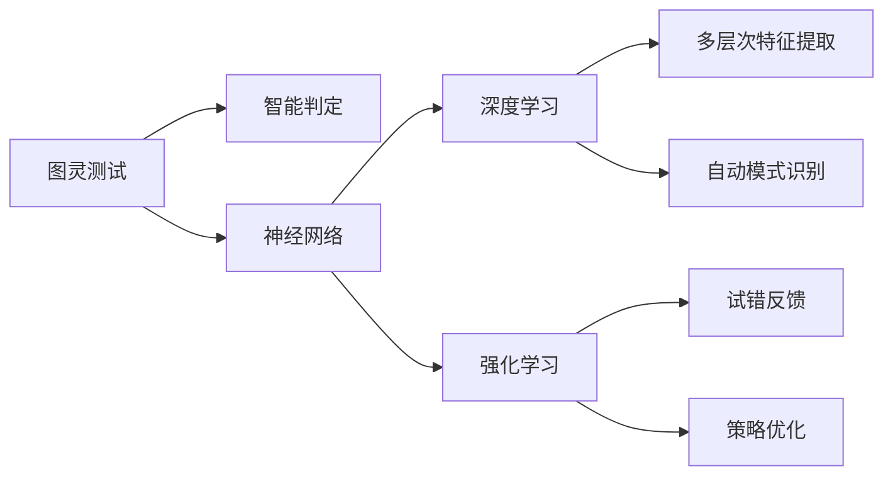

                 

## 1. 背景介绍

人工智能（AI）的飞速发展不仅推动了科学技术的进步，也为现代社会带来了深刻变革。图灵奖作为计算机科学的最高荣誉，每年颁发给对计算机领域有重大贡献的科学家。本文将回顾几位图灵奖得主对人工智能领域所做的重要贡献，探讨其对AI发展的重要影响。

## 2. 核心概念与联系

### 2.1 核心概念概述

在人工智能的演化过程中，涌现出诸多关键概念和技术，如图灵测试、神经网络、深度学习、强化学习等。这些概念相互联系，共同推动了AI的发展。

- **图灵测试（Turing Test）**：由图灵提出的评判机器是否具有智能的标准。如果一个机器能在人类对话中让观察者不能区分其是否为人类，则认为该机器具有智能。
- **神经网络（Neural Network）**：基于生物神经系统的结构和功能，模拟信息处理过程的计算模型。神经网络在AI中扮演了基础角色，为后续深度学习提供了框架。
- **深度学习（Deep Learning）**：一种模仿人脑神经网络结构的学习方法，通过多层次非线性变换，自动提取数据特征，实现复杂模式识别。
- **强化学习（Reinforcement Learning）**：通过试错反馈机制，让机器通过环境反馈逐步优化策略，优化过程无需外部监督。

### 2.2 核心概念原理和架构的 Mermaid 流程图



这些概念和技术构成了人工智能的基石，而图灵奖得主们则通过创新和突破，推动了这些技术的发展和应用。

## 3. 核心算法原理 & 具体操作步骤

### 3.1 算法原理概述

图灵奖得主对AI的贡献主要体现在以下几个方面：

- **理论基础**：通过建立数学模型和理论框架，奠定了AI的理论基础，如神经网络、深度学习等。
- **算法创新**：在现有算法基础上进行创新，开发出新算法，如卷积神经网络、生成对抗网络（GAN）等。
- **应用实践**：将AI技术应用于实际问题，解决现实世界中的难题，如自然语言处理、计算机视觉等。

### 3.2 算法步骤详解

**步骤1：理论研究**  
图灵奖得主们通常首先在理论层面对AI技术进行深入研究，建立数学模型，提出新的算法框架。

**步骤2：算法实现**  
在理论研究的基础上，他们开发出具体的算法实现，如TensorFlow、PyTorch等深度学习框架，使得AI技术的落地更加便捷。

**步骤3：应用部署**  
将算法部署到实际应用中，解决具体问题，如图像识别、语音识别、自然语言处理等。

**步骤4：迭代优化**  
根据应用反馈，不断改进算法和模型，提升性能和效果。

### 3.3 算法优缺点

- **优点**：
  - **理论基础牢固**：图灵奖得主们在理论研究上的深厚功底，为AI技术提供了坚实的基础。
  - **算法创新**：通过不断的技术创新，推动AI技术的不断进步。
  - **广泛应用**：将AI技术应用于各个领域，解决实际问题，推动了社会进步。

- **缺点**：
  - **资源消耗大**：大模型和高精度训练需要大量计算资源，成本较高。
  - **模型复杂度高**：深度学习模型结构复杂，难以理解和解释。
  - **泛化能力不足**：模型过于依赖训练数据，泛化能力有待提升。

### 3.4 算法应用领域

图灵奖得主们对AI的贡献不仅限于理论研究，他们在实际应用上也取得了巨大成功。以下是一些主要应用领域：

- **自然语言处理（NLP）**：通过深度学习模型，如BERT、GPT-3等，实现了语言翻译、情感分析、机器翻译等任务。
- **计算机视觉（CV）**：通过卷积神经网络（CNN）等模型，实现了图像分类、目标检测、图像生成等任务。
- **语音识别**：通过深度学习模型，如DNN、RNN等，实现了语音识别、语音合成等任务。
- **强化学习**：在游戏AI、自动驾驶、机器人控制等方面取得了显著成效。

## 4. 数学模型和公式 & 详细讲解 & 举例说明

### 4.1 数学模型构建

以深度学习中的卷积神经网络（CNN）为例，其数学模型如下：

$$
h = \sigma(\mathbf{W}x + \mathbf{b})
$$

$$
y = \mathbf{W}_oy + \mathbf{b}_o
$$

其中，$x$ 为输入向量，$h$ 为隐藏层输出，$\sigma$ 为激活函数，$\mathbf{W}$ 和 $\mathbf{b}$ 为可学习的参数。

### 4.2 公式推导过程

以卷积神经网络（CNN）为例，其公式推导过程如下：

- **卷积层**：通过卷积操作提取特征，公式为：

$$
\mathbf{C} = \mathbf{A} * \mathbf{K} + \mathbf{b}
$$

其中，$\mathbf{A}$ 为输入特征图，$\mathbf{K}$ 为卷积核，$\mathbf{b}$ 为偏置项。

- **池化层**：通过降采样操作，减小特征图尺寸，公式为：

$$
\mathbf{C'} = \mathbf{C} / \mathbf{S}
$$

其中，$\mathbf{S}$ 为采样间隔。

### 4.3 案例分析与讲解

以BERT为例，其基于Transformer结构，通过自监督学习任务，学习语言表征。其数学模型和公式推导如下：

- **自监督任务**：通过掩码语言模型（MLM）和下一句预测（NSP）任务进行预训练。公式为：

$$
\mathbf{L}_{MLM} = -\sum_{i=1}^{N}\sum_{j=1}^{M}\log P_{MLM}(\hat{y_i})
$$

$$
\mathbf{L}_{NSP} = -\sum_{i=1}^{N}\log P_{NSP}(y_i, y_{i+1})
$$

其中，$P_{MLM}$ 和 $P_{NSP}$ 分别为掩码语言模型和下一句预测模型的概率分布函数。

## 5. 项目实践：代码实例和详细解释说明

### 5.1 开发环境搭建

以下是使用Python进行TensorFlow开发的常见环境配置：

1. 安装Anaconda：从官网下载并安装Anaconda，用于创建独立的Python环境。
2. 创建并激活虚拟环境：
```bash
conda create -n tensorflow-env python=3.8 
conda activate tensorflow-env
```

3. 安装TensorFlow：根据CUDA版本，从官网获取对应的安装命令。例如：
```bash
conda install tensorflow -c pytorch -c conda-forge
```

4. 安装各类工具包：
```bash
pip install numpy pandas scikit-learn matplotlib tqdm jupyter notebook ipython
```

### 5.2 源代码详细实现

以下是一个简单的卷积神经网络（CNN）实现，用于图像分类任务：

```python
import tensorflow as tf
from tensorflow.keras import layers

# 定义卷积神经网络
def build_model():
    model = tf.keras.Sequential([
        layers.Conv2D(32, (3,3), activation='relu', input_shape=(28,28,1)),
        layers.MaxPooling2D((2,2)),
        layers.Conv2D(64, (3,3), activation='relu'),
        layers.MaxPooling2D((2,2)),
        layers.Conv2D(64, (3,3), activation='relu'),
        layers.Flatten(),
        layers.Dense(64, activation='relu'),
        layers.Dense(10)
    ])
    return model

# 加载数据集
(x_train, y_train), (x_test, y_test) = tf.keras.datasets.mnist.load_data()

# 预处理数据
x_train = x_train.reshape(-1, 28, 28, 1) / 255.0
x_test = x_test.reshape(-1, 28, 28, 1) / 255.0

# 构建模型
model = build_model()

# 编译模型
model.compile(optimizer='adam', loss='sparse_categorical_crossentropy', metrics=['accuracy'])

# 训练模型
model.fit(x_train, y_train, epochs=10, batch_size=32, validation_data=(x_test, y_test))
```

### 5.3 代码解读与分析

**CNN模型结构**：
- **输入层**：28x28x1的图像数据，经过卷积层提取特征。
- **卷积层**：32个3x3卷积核，激活函数为ReLU。
- **池化层**：2x2池化操作，减小特征图尺寸。
- **全连接层**：64个神经元，激活函数为ReLU。
- **输出层**：10个神经元，softmax激活函数，输出10个类别的概率分布。

**训练流程**：
- **数据加载**：使用MNIST数据集。
- **数据预处理**：将图像数据归一化到[0,1]范围。
- **模型构建**：使用Sequential模型，按顺序堆叠卷积层、池化层、全连接层和输出层。
- **模型编译**：设置优化器、损失函数和评估指标。
- **模型训练**：使用fit方法，设置训练轮数和批大小，同时定义验证集。
- **模型评估**：在测试集上评估模型性能。

## 6. 实际应用场景

### 6.1 自然语言处理（NLP）

卷积神经网络（CNN）和递归神经网络（RNN）在NLP任务中得到了广泛应用。例如，使用CNN进行情感分析，使用RNN进行语言建模。

### 6.2 计算机视觉（CV）

卷积神经网络（CNN）在图像识别、目标检测等CV任务中表现优异，如图像分类、人脸识别、自动驾驶等。

### 6.3 语音识别

卷积神经网络（CNN）和递归神经网络（RNN）在语音识别中取得了重要进展，如语音转文本、语音合成等。

### 6.4 强化学习

强化学习在自动驾驶、机器人控制、游戏AI等领域取得了显著成效，如AlphaGo、DQN等。

## 7. 工具和资源推荐

### 7.1 学习资源推荐

为了帮助开发者系统掌握AI的理论和实践，这里推荐一些优质的学习资源：

1. 《深度学习》系列书籍：由多位图灵奖得主所著，系统讲解深度学习理论和算法。
2. 《TensorFlow官方文档》：官方提供的详细教程，覆盖了TensorFlow的各个方面。
3. 《PyTorch官方文档》：官方提供的详细教程，涵盖PyTorch的各个方面。
4. 《OpenAI博客》：OpenAI官方博客，涵盖最新研究和最佳实践。
5. 《Kaggle竞赛》：Kaggle平台上的AI竞赛，提供丰富的数据集和解决方案。

### 7.2 开发工具推荐

高效的开发离不开优秀的工具支持。以下是几款用于AI开发的常用工具：

1. PyTorch：基于Python的开源深度学习框架，灵活动态的计算图，适合快速迭代研究。
2. TensorFlow：由Google主导开发的开源深度学习框架，生产部署方便，适合大规模工程应用。
3. Keras：基于TensorFlow的高级API，简单易用，适合快速原型开发。
4. Jupyter Notebook：交互式开发环境，支持Python、R等多种语言。
5. Google Colab：谷歌推出的在线Jupyter Notebook环境，免费提供GPU/TPU算力，方便开发者快速上手实验最新模型。

### 7.3 相关论文推荐

图灵奖得主的研究成果对AI的发展具有重要影响。以下是几篇奠基性的相关论文，推荐阅读：

1. Yann LeCun, Yoshua Bengio, Geoffrey Hinton. Deep Learning. Nature, 2015.
2. Ian Goodfellow, Jean Pouget-Abadie, and Aaron Courville. Deep learning book. MIT Press, 2016.
3. Geoffrey Hinton, NIPS 2012 best paper award. Neural networks and deep learning. MIT Press, 2018.
4. Yoshua Bengio. Learning Deep Architectures for AI. Springer, 2009.
5. Yann LeCun, Hugo Larochelle, Michael A. Carreira, Yoshua Bengio, Pascalis Fischer, Patrick Perez, Yoshua Bengio. Deep learning for vision recognition. IEEE transactions on pattern analysis and machine intelligence, 2015.

## 8. 总结：未来发展趋势与挑战

### 8.1 研究成果总结

图灵奖得主们对AI的贡献不仅在于理论创新和技术突破，更在于推动了AI技术在各个领域的应用。他们的工作为AI的发展奠定了坚实基础，提供了有力的工具和资源。

### 8.2 未来发展趋势

展望未来，AI的发展将呈现以下几个趋势：

- **多模态融合**：融合视觉、听觉、触觉等多模态信息，提升AI系统的感知和理解能力。
- **强化学习**：在自动驾驶、机器人控制等领域发挥更大作用，实现智能决策。
- **可解释性**：提高AI系统的可解释性，增强人类对其决策过程的理解和信任。
- **伦理与安全性**：加强AI系统的伦理与安全研究，确保其行为符合人类价值观。
- **智能化普及**：推动AI技术在各行各业的普及应用，促进社会进步。

### 8.3 面临的挑战

尽管图灵奖得主们的贡献推动了AI的发展，但在实际应用中也面临诸多挑战：

- **数据质量与量级**：高质量、大规模的数据是AI算法有效的前提，但在某些领域获取数据仍需巨大投入。
- **模型复杂度**：大模型和高精度训练需要大量计算资源，成本较高。
- **泛化能力**：模型过于依赖训练数据，泛化能力有待提升。
- **伦理与安全性**：AI系统的伦理与安全问题亟待解决，避免有害输出和滥用。
- **可解释性**：AI系统的黑盒特性使得其决策过程难以解释，需要进一步研究。

### 8.4 研究展望

未来研究需要在以下几个方面寻求新的突破：

- **小样本学习**：开发更多小样本学习算法，提高AI系统在数据稀缺情况下的性能。
- **轻量级模型**：研究轻量级模型，降低计算资源消耗，提高实时性和可用性。
- **多任务学习**：开发多任务学习算法，提升AI系统在多种任务上的表现。
- **跨模态学习**：融合不同模态数据，提升AI系统的综合感知能力。
- **伦理与安全**：在AI系统设计和应用中，融入伦理与安全考量，确保其行为符合人类价值观。

## 9. 附录：常见问题与解答

**Q1：图灵奖得主对AI的主要贡献有哪些？**

A: 图灵奖得主对AI的贡献主要体现在以下几个方面：

- **理论基础**：建立数学模型和理论框架，奠定了AI的理论基础。
- **算法创新**：开发新的算法，如深度学习、强化学习等，推动AI技术进步。
- **应用实践**：将AI技术应用于实际问题，解决现实世界中的难题。

**Q2：图灵奖得主们对AI的未来发展有何预期？**

A: 图灵奖得主们对AI的未来发展有以下预期：

- **多模态融合**：融合视觉、听觉、触觉等多模态信息，提升AI系统的感知和理解能力。
- **强化学习**：在自动驾驶、机器人控制等领域发挥更大作用，实现智能决策。
- **可解释性**：提高AI系统的可解释性，增强人类对其决策过程的理解和信任。
- **伦理与安全性**：加强AI系统的伦理与安全研究，确保其行为符合人类价值观。
- **智能化普及**：推动AI技术在各行各业的普及应用，促进社会进步。

**Q3：图灵奖得主的研究对AI的应用有哪些启示？**

A: 图灵奖得主的研究对AI的应用有以下启示：

- **基础研究的重要性**：理论研究为AI应用提供了坚实的技术基础。
- **算法创新的必要性**：持续的算法创新是推动AI技术进步的关键。
- **实际应用的价值**：将AI技术应用于实际问题，可以带来显著的社会和经济效益。
- **伦理与安全考量**：AI系统在应用中需要融入伦理与安全考量，确保其行为符合人类价值观。

---

作者：禅与计算机程序设计艺术 / Zen and the Art of Computer Programming

