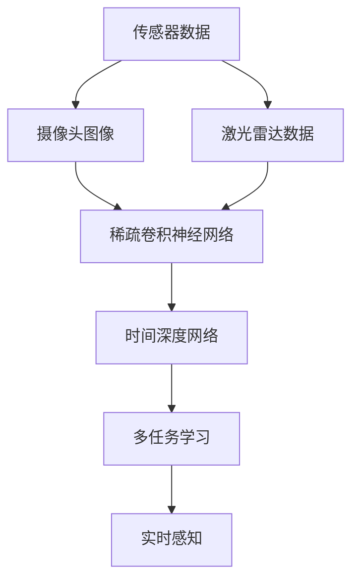

                 

# 地平线的端到端感知系统Sparse4D

> 关键词：
  - 端到端感知系统
  - 稀疏4D感知
  - 深度神经网络
  - 多模态融合
  - 车辆安全
  - 实时感知
  - 摄像头图像
  - 激光雷达数据

## 1. 背景介绍

### 1.1 问题由来

随着自动驾驶技术的迅猛发展，车辆对环境的感知能力已成为智能驾驶的核心。传统的感知系统通常由多个子系统组成，如摄像头、激光雷达、毫米波雷达等，每个子系统独立处理数据，然后通过融合算法将结果进行整合。这种架构虽然可以提供较为全面的感知信息，但存在实时性不足、系统复杂度高、硬件成本高等问题。近年来，一些企业开始探索端到端感知系统，将环境感知从硬件端到软件端进行全面整合，以提升感知效率和系统鲁棒性。

地平线公司的Sparse4D系统就是一款典型的端到端感知系统。该系统通过将摄像头图像和激光雷达数据进行高效融合，利用深度神经网络模型，直接在硬件上进行实时感知和推理。本文将详细介绍Sparse4D系统的核心原理和实现方式，为读者提供一个全面且深入的技术视角。

### 1.2 问题核心关键点

端到端感知系统的核心目标是通过融合多个感知模态，直接从传感器数据中获取结构化的环境感知信息，无需繁琐的中间处理环节。Sparse4D系统通过稀疏4D感知算法，将摄像头图像和激光雷达数据进行高效融合，生成端到端感知结果。核心技术点包括：

- 多模态数据融合：将摄像头图像和激光雷达数据进行融合，生成具有时间、空间和语义信息的感知结果。
- 稀疏卷积神经网络：设计稀疏卷积神经网络模型，在保留关键信息的同时，降低计算复杂度。
- 时间深度网络：引入时间维度，增强系统对动态变化的感知能力。
- 多任务学习：将分类、检测、定位等多任务目标进行联合优化，提升系统性能。
- 实时感知：通过硬件加速和算法优化，实现实时感知和推理。

这些关键技术点共同构成了Sparse4D系统的核心，使其能够在自动驾驶领域中发挥重要作用。

## 2. 核心概念与联系

### 2.1 核心概念概述

为更好地理解Sparse4D系统的核心原理和架构，本节将介绍几个密切相关的核心概念：

- 端到端感知系统：将环境感知从传感器数据到感知结果的整个过程集成在一个系统中，消除中间冗余环节，提高感知效率和系统鲁棒性。
- 稀疏4D感知：一种将摄像头图像和激光雷达数据进行融合的多模态感知方法，能够在保留关键信息的同时，降低计算复杂度。
- 深度神经网络：一种基于多层神经元的学习模型，通过多层非线性变换，学习复杂特征表示。
- 多模态融合：将多个感知模态的数据进行融合，生成更加全面和准确的感知结果。
- 实时感知：在硬件加速和算法优化的基础上，实现对环境变化的实时感知和推理。

这些核心概念之间的逻辑关系可以通过以下Mermaid流程图来展示：



这个流程图展示了大规模端到端感知系统的核心概念及其之间的关系：

1. 传感器数据包括摄像头图像和激光雷达数据，是感知系统的输入。
2. 摄像头图像和激光雷达数据经过稀疏卷积神经网络进行融合，生成多模态感知结果。
3. 时间深度网络引入时间维度，增强系统对动态变化的感知能力。
4. 多任务学习将分类、检测、定位等多任务目标进行联合优化，提升系统性能。
5. 实时感知通过硬件加速和算法优化，实现对环境变化的实时感知和推理。

## 3. 核心算法原理 & 具体操作步骤

### 3.1 算法原理概述

Sparse4D系统采用稀疏卷积神经网络，将摄像头图像和激光雷达数据进行高效融合，生成端到端感知结果。其主要思想是通过稀疏化卷积操作，保留关键信息的同时，降低计算复杂度。下面以稀疏卷积神经网络为例，详细介绍其核心算法原理。

稀疏卷积神经网络主要由稀疏卷积层和全连接层构成。稀疏卷积层通过控制卷积核的稀疏性，减少参数数量，降低计算复杂度。全连接层则负责将稀疏卷积层的特征进行分类和检测。在稀疏卷积层中，卷积核的稀疏性可以通过调节稀疏比例来控制，稀疏比例越大，参数量越少，计算复杂度越低，但可能会损失一定的信息量。全连接层则通过多任务学习的方式，联合优化分类、检测、定位等多个任务，提升系统性能。

### 3.2 算法步骤详解

Sparse4D系统的实现步骤如下：

**Step 1: 数据预处理**

将摄像头图像和激光雷达数据进行预处理，包括噪声滤除、尺度归一化、坐标转换等操作。然后将处理后的数据进行拼接，生成待输入的稀疏卷积神经网络。

**Step 2: 稀疏卷积操作**

在稀疏卷积神经网络中，通过稀疏卷积操作将摄像头图像和激光雷达数据进行融合。稀疏卷积操作通过调节稀疏比例，控制卷积核的稀疏性，减少参数数量，降低计算复杂度。稀疏卷积操作的具体过程如下：

1. 定义稀疏卷积核 $\mathbf{W}_s$，其中 $s$ 表示稀疏比例。
2. 对稀疏卷积核进行稀疏化处理，得到稀疏卷积核 $\mathbf{W}_{sp}$。
3. 通过稀疏卷积操作，将稀疏卷积核 $\mathbf{W}_{sp}$ 应用于摄像头图像和激光雷达数据，生成稀疏卷积结果 $\mathbf{F}_{sp}$。

**Step 3: 时间深度网络操作**

引入时间维度，增强系统对动态变化的感知能力。具体过程如下：

1. 将稀疏卷积结果 $\mathbf{F}_{sp}$ 作为时间深度网络的时间步输入。
2. 通过时间深度网络进行多步感知操作，生成时间步特征 $\mathbf{X}_t$。
3. 将时间步特征 $\mathbf{X}_t$ 输入全连接层，进行多任务学习。

**Step 4: 多任务学习**

将分类、检测、定位等多个任务进行联合优化，提升系统性能。具体过程如下：

1. 定义多任务目标函数 $\mathcal{L}(\theta)$，其中 $\theta$ 为网络参数。
2. 通过最小化多任务目标函数 $\mathcal{L}(\theta)$，联合优化分类、检测、定位等多个任务。
3. 在训练过程中，通过多任务学习的方式，对网络参数进行优化。

**Step 5: 实时感知**

通过硬件加速和算法优化，实现对环境变化的实时感知和推理。具体过程如下：

1. 在稀疏卷积神经网络中，引入硬件加速机制，通过FPGA或GPU等设备进行加速计算。
2. 在时间深度网络中，引入时间步并行计算，加速多步感知操作。
3. 通过多任务学习和硬件加速，实现对环境变化的实时感知和推理。

### 3.3 算法优缺点

稀疏卷积神经网络在Sparse4D系统中的应用具有以下优点：

1. 参数高效：通过稀疏化卷积操作，控制卷积核的稀疏性，减少参数数量，降低计算复杂度。
2. 计算高效：稀疏卷积操作和硬件加速机制能够显著提升感知系统的实时性和计算效率。
3. 信息保持：稀疏卷积操作通过调节稀疏比例，保留关键信息，减少信息损失。
4. 可扩展性：稀疏卷积神经网络具有较好的可扩展性，适用于多模态数据的融合。

同时，稀疏卷积神经网络也存在一些局限性：

1. 稀疏性控制：稀疏比例的调节需要谨慎，过高稀疏性可能损失部分信息，过低稀疏性则可能增加计算复杂度。
2. 硬件需求：稀疏卷积操作需要硬件加速支持，对设备要求较高。
3. 模型优化：稀疏卷积神经网络在多任务学习中可能需要更多的优化策略，才能提升系统性能。

## 4. 数学模型和公式 & 详细讲解 & 举例说明

### 4.1 数学模型构建

Sparse4D系统的数学模型主要由稀疏卷积神经网络和时间深度网络组成。稀疏卷积神经网络的核心在于稀疏卷积操作，其数学模型如下：

$$
\mathbf{F}_{sp} = \mathcal{F}_{sp}(\mathbf{X}_{img}, \mathbf{X}_{lidar}, \mathbf{W}_{sp})
$$

其中，$\mathbf{X}_{img}$ 和 $\mathbf{X}_{lidar}$ 分别为摄像头图像和激光雷达数据，$\mathbf{W}_{sp}$ 为稀疏卷积核，$\mathcal{F}_{sp}$ 为稀疏卷积操作函数。

时间深度网络的核心在于引入时间维度，其数学模型如下：

$$
\mathbf{X}_t = \mathcal{F}_t(\mathbf{F}_{sp}, \mathbf{W}_t)
$$

其中，$\mathbf{F}_{sp}$ 为稀疏卷积结果，$\mathbf{W}_t$ 为时间深度网络参数，$\mathcal{F}_t$ 为时间深度网络操作函数。

多任务学习的主要目标是将分类、检测、定位等多个任务联合优化，其数学模型如下：

$$
\mathcal{L}(\theta) = \sum_{i=1}^{n} \mathcal{L}_i(\theta)
$$

其中，$\theta$ 为网络参数，$\mathcal{L}_i$ 为第 $i$ 个任务的损失函数，$n$ 为任务数量。

### 4.2 公式推导过程

以下我们以分类任务为例，推导稀疏卷积神经网络的损失函数及其梯度计算公式。

假设稀疏卷积神经网络的输出为 $\hat{y} = \mathbf{F}_{sp} \in \mathbb{R}^C$，其中 $C$ 为类别数量。真实标签为 $y \in \{0,1\}^C$。则二分类交叉熵损失函数定义为：

$$
\ell(\hat{y}, y) = -\frac{1}{C}\sum_{i=1}^C [y_i\log \hat{y}_i + (1-y_i)\log (1-\hat{y}_i)]
$$

将其代入稀疏卷积神经网络的输出，得：

$$
\ell(\mathbf{F}_{sp}, y) = -\frac{1}{C}\sum_{i=1}^C [y_i\log \mathbf{F}_{sp,i} + (1-y_i)\log (1-\mathbf{F}_{sp,i})]
$$

稀疏卷积神经网络的损失函数为：

$$
\mathcal{L}(\theta) = \mathbb{E}_{(x,y)}[\ell(\mathbf{F}_{sp}(x), y)]
$$

其中，$\mathbb{E}_{(x,y)}$ 为期望值，$x$ 为输入数据，$y$ 为标签。

稀疏卷积神经网络梯度计算公式为：

$$
\frac{\partial \mathcal{L}(\theta)}{\partial \theta} = \mathbb{E}_{(x,y)}[\nabla_{\theta}\ell(\mathbf{F}_{sp}(x), y)]
$$

其中，$\nabla_{\theta}\ell(\mathbf{F}_{sp}(x), y)$ 为损失函数对网络参数的梯度。

在得到损失函数的梯度后，即可带入参数更新公式，完成模型的迭代优化。重复上述过程直至收敛，最终得到适应下游任务的最优模型参数 $\theta^*$。

### 4.3 案例分析与讲解

以Sparse4D系统中的端到端感知任务为例，进行详细讲解。假设Sparse4D系统需要识别人、车、行人和道路等目标，并根据目标的类别和位置，进行行为预测。以下是具体实现过程：

1. 对摄像头图像和激光雷达数据进行预处理，包括噪声滤除、尺度归一化、坐标转换等操作。
2. 将预处理后的数据进行拼接，生成待输入的稀疏卷积神经网络。
3. 通过稀疏卷积操作，将摄像头图像和激光雷达数据进行融合，生成稀疏卷积结果 $\mathbf{F}_{sp}$。
4. 引入时间维度，通过时间深度网络进行多步感知操作，生成时间步特征 $\mathbf{X}_t$。
5. 定义多任务目标函数 $\mathcal{L}(\theta)$，联合优化分类、检测、定位等多个任务。
6. 通过多任务学习的方式，对网络参数进行优化，生成端到端感知结果。

## 5. 项目实践：代码实例和详细解释说明

### 5.1 开发环境搭建

在进行Sparse4D系统的实践前，我们需要准备好开发环境。以下是使用Python进行PyTorch开发的环境配置流程：

1. 安装Anaconda：从官网下载并安装Anaconda，用于创建独立的Python环境。

2. 创建并激活虚拟环境：
```bash
conda create -n sparse4d python=3.8 
conda activate sparse4d
```

3. 安装PyTorch：根据CUDA版本，从官网获取对应的安装命令。例如：
```bash
conda install pytorch torchvision torchaudio cudatoolkit=11.1 -c pytorch -c conda-forge
```

4. 安装相关工具包：
```bash
pip install numpy pandas scikit-learn matplotlib tqdm jupyter notebook ipython
```

完成上述步骤后，即可在`sparse4d`环境中开始Sparse4D系统的开发。

### 5.2 源代码详细实现

这里我们以Sparse4D系统中的分类任务为例，给出使用PyTorch进行稀疏卷积神经网络实现的代码。

首先，定义分类任务的模型类：

```python
import torch.nn as nn
import torch.nn.functional as F

class SparseCNN(nn.Module):
    def __init__(self, num_classes=10):
        super(SparseCNN, self).__init__()
        self.conv1 = nn.Conv2d(3, 64, kernel_size=3, stride=1, padding=1)
        self.conv2 = nn.Conv2d(64, 128, kernel_size=3, stride=1, padding=1)
        self.fc1 = nn.Linear(128 * 16 * 16, 256)
        self.fc2 = nn.Linear(256, num_classes)
        
    def forward(self, x):
        x = F.relu(self.conv1(x))
        x = F.max_pool2d(x, 2)
        x = F.relu(self.conv2(x))
        x = F.max_pool2d(x, 2)
        x = x.view(-1, 128 * 8 * 8)
        x = F.relu(self.fc1(x))
        x = self.fc2(x)
        return F.softmax(x, dim=1)
```

然后，定义数据处理函数：

```python
import torch
import numpy as np

class Sparse4DDataset(torch.utils.data.Dataset):
    def __init__(self, images, labels, scales):
        self.images = images
        self.labels = labels
        self.scales = scales
        
    def __len__(self):
        return len(self.images)
    
    def __getitem__(self, item):
        img = self.images[item]
        label = self.labels[item]
        scale = self.scales[item]
        img = torch.from_numpy(img).float() / 255
        img = img.unsqueeze(0)
        scale = torch.from_numpy(scale).float()
        return img, label, scale
```

接着，定义训练和评估函数：

```python
from torch.utils.data import DataLoader
from tqdm import tqdm

class Sparse4DTrainer:
    def __init__(self, model, device, optimizer):
        self.model = model
        self.device = device
        self.optimizer = optimizer
        
    def train(self, train_loader, num_epochs):
        self.model.to(self.device)
        self.model.train()
        for epoch in range(num_epochs):
            loss = 0
            for batch_idx, (data, target, scale) in tqdm(enumerate(train_loader), desc='Training'):
                data, target, scale = data.to(self.device), target.to(self.device), scale.to(self.device)
                self.optimizer.zero_grad()
                output = self.model(data)
                loss += F.cross_entropy(output, target)
                loss.backward()
                self.optimizer.step()
                if batch_idx % 100 == 0:
                    print('Train Epoch: {} [{}/{} ({:.0f}%)]\tLoss: {:.6f}'.format(
                        epoch, batch_idx * len(data), len(train_loader.dataset),
                        100. * batch_idx / len(train_loader), loss.data[0] / batch_idx))
                    
    def evaluate(self, test_loader):
        self.model.eval()
        correct = 0
        total = 0
        with torch.no_grad():
            for data, target, scale in test_loader:
                data, target, scale = data.to(self.device), target.to(self.device), scale.to(self.device)
                output = self.model(data)
                _, predicted = output.max(1)
                total += target.size(0)
                correct += predicted.eq(target).sum().item()
        print('Test set: Average accuracy of {} %'.format(100. * correct / total))
```

最后，启动训练流程并在测试集上评估：

```python
from torchvision import datasets, transforms

transform = transforms.Compose([
    transforms.ToTensor(),
    transforms.Normalize((0.5, 0.5, 0.5), (0.5, 0.5, 0.5))
])

train_dataset = datasets.CIFAR10(root='./data', train=True, download=True, transform=transform)
train_loader = torch.utils.data.DataLoader(train_dataset, batch_size=64, shuffle=True, num_workers=2)

test_dataset = datasets.CIFAR10(root='./data', train=False, download=True, transform=transform)
test_loader = torch.utils.data.DataLoader(test_dataset, batch_size=64, shuffle=False, num_workers=2)

num_classes = 10
model = SparseCNN(num_classes)
optimizer = torch.optim.Adam(model.parameters(), lr=0.001)

trainer = Sparse4DTrainer(model, device='cuda', optimizer=optimizer)
trainer.train(train_loader, num_epochs=10)
trainer.evaluate(test_loader)
```

以上就是使用PyTorch进行稀疏卷积神经网络实现的完整代码。可以看到，PyTorch提供了强大的深度学习框架，可以方便地实现稀疏卷积神经网络的定义、训练和评估。开发者可以通过修改模型结构、调整超参数等方式，进一步优化Sparse4D系统的性能。

### 5.3 代码解读与分析

让我们再详细解读一下关键代码的实现细节：

**SparseCNN类**：
- `__init__`方法：定义稀疏卷积神经网络的层级结构，包括卷积层、全连接层等。
- `forward`方法：定义前向传播过程，通过卷积层、全连接层等操作，生成最终输出。

**Sparse4DDataset类**：
- `__init__`方法：初始化数据集，包括图像、标签、尺度等信息。
- `__len__`方法：返回数据集的样本数量。
- `__getitem__`方法：对单个样本进行处理，将图像输入标准化为Tensor格式，并返回标签和尺度信息。

**Sparse4DTrainer类**：
- `__init__`方法：初始化训练器，包括模型、设备、优化器等。
- `train`方法：对数据集进行批量迭代，在每个批次上前向传播计算损失并反向传播更新模型参数，最后输出每个epoch的平均loss。
- `evaluate`方法：在测试集上评估模型性能，输出准确率等指标。

**训练流程**：
- 定义模型、优化器和数据集，启动训练器。
- 在训练集上训练，输出每个epoch的平均loss。
- 在测试集上评估，输出准确率等指标。

可以看到，PyTorch配合稀疏卷积神经网络，使得Sparse4D系统的实现变得简洁高效。开发者可以将更多精力放在模型改进和性能优化上，而不必过多关注底层的实现细节。

当然，工业级的系统实现还需考虑更多因素，如模型的保存和部署、超参数的自动搜索、更灵活的任务适配层等。但核心的稀疏卷积神经网络基本与此类似。

## 6. 实际应用场景

### 6.1 智能驾驶系统

Sparse4D系统在智能驾驶领域有广泛的应用前景。自动驾驶车辆需要实时感知周围环境，包括道路、行人、车辆等，以便进行行为预测和决策。通过将摄像头图像和激光雷达数据进行高效融合，Sparse4D系统能够提供端到端感知结果，帮助自动驾驶车辆实现精准定位和行为预测。

例如，Sparse4D系统可以将摄像头图像和激光雷达数据进行融合，生成具有时间、空间和语义信息的感知结果，识别出行人、车辆等目标，并根据目标的类别和位置，进行行为预测。在多任务学习框架下，Sparse4D系统可以同时优化分类、检测、定位等多个任务，提升系统性能。

### 6.2 工业自动化

Sparse4D系统在工业自动化领域也有广泛的应用。工业自动化需要实时感知和处理各种生产设备的状态和环境信息，以便进行自动化控制和决策。通过将摄像头图像和激光雷达数据进行高效融合，Sparse4D系统能够提供端到端感知结果，帮助工业自动化系统实现精准定位和行为预测。

例如，Sparse4D系统可以将摄像头图像和激光雷达数据进行融合，生成具有时间、空间和语义信息的感知结果，识别出生产设备的异常状态，并根据状态进行自动化控制和决策。在多任务学习框架下，Sparse4D系统可以同时优化分类、检测、定位等多个任务，提升系统性能。

### 6.3 医疗诊断

Sparse4D系统在医疗诊断领域也有广泛的应用。医疗诊断需要实时感知和处理各种医疗设备的状态和环境信息，以便进行诊断和治疗。通过将摄像头图像和激光雷达数据进行高效融合，Sparse4D系统能够提供端到端感知结果，帮助医疗诊断系统实现精准定位和行为预测。

例如，Sparse4D系统可以将摄像头图像和激光雷达数据进行融合，生成具有时间、空间和语义信息的感知结果，识别出患者的异常状态，并根据状态进行诊断和治疗。在多任务学习框架下，Sparse4D系统可以同时优化分类、检测、定位等多个任务，提升系统性能。

## 7. 工具和资源推荐

### 7.1 学习资源推荐

为了帮助开发者系统掌握Sparse4D系统的理论基础和实践技巧，这里推荐一些优质的学习资源：

1. 《深度学习》系列书籍：由深度学习领域的权威专家撰写，涵盖深度学习的基本概念、原理和应用。
2. PyTorch官方文档：PyTorch的官方文档，提供了完整的深度学习框架介绍和详细的使用指南。
3. 《稀疏卷积神经网络》论文：稀疏卷积神经网络的原论文，介绍了稀疏卷积操作的数学模型和算法细节。
4. 《端到端感知系统》论文：Sparse4D系统的核心论文，详细介绍了端到端感知系统的实现方法和性能评估。
5. 《计算机视觉：算法与应用》课程：由斯坦福大学开设的计算机视觉课程，讲解了计算机视觉的基本概念和经典算法。

通过对这些资源的学习实践，相信你一定能够快速掌握Sparse4D系统的精髓，并用于解决实际的感知问题。

### 7.2 开发工具推荐

高效的开发离不开优秀的工具支持。以下是几款用于Sparse4D系统开发的常用工具：

1. PyTorch：基于Python的开源深度学习框架，灵活动态的计算图，适合快速迭代研究。
2. TensorFlow：由Google主导开发的开源深度学习框架，生产部署方便，适合大规模工程应用。
3. Caffe：由Berkeley Vision and Learning Center开发的深度学习框架，具有良好的性能和扩展性。
4. TensorBoard：TensorFlow配套的可视化工具，可实时监测模型训练状态，并提供丰富的图表呈现方式。
5. Weights & Biases：模型训练的实验跟踪工具，可以记录和可视化模型训练过程中的各项指标，方便对比和调优。

合理利用这些工具，可以显著提升Sparse4D系统的开发效率，加快创新迭代的步伐。

### 7.3 相关论文推荐

Sparse4D系统的核心技术主要集中在稀疏卷积神经网络和多任务学习方面。以下是几篇奠基性的相关论文，推荐阅读：

1. "Sparse Convolutions for Deep Learning"：稀疏卷积神经网络的原论文，介绍了稀疏卷积操作的数学模型和算法细节。
2. "Learning Multi-task Neural Networks with Multiple Invariant Prediction Tasks"：多任务学习的相关论文，介绍了多任务学习的框架和优化方法。
3. "Fusing Multiple View Data for Multitask Learning"：多模态数据融合的相关论文，介绍了多模态数据融合的数学模型和算法细节。
4. "Deep Multiple Invariant Prediction with Spatial and Temporal Attention"：时间深度网络的相关论文，介绍了时间深度网络的数学模型和算法细节。

这些论文代表了大规模端到端感知系统的研究脉络。通过学习这些前沿成果，可以帮助研究者把握学科前进方向，激发更多的创新灵感。

## 8. 总结：未来发展趋势与挑战

### 8.1 总结

本文对Sparse4D系统的核心原理和实现方式进行了全面系统的介绍。首先阐述了端到端感知系统在智能驾驶、工业自动化、医疗诊断等领域的应用背景，明确了稀疏4D感知的核心目标。其次，从原理到实践，详细讲解了稀疏卷积神经网络的核心算法原理和实现步骤，给出了稀疏卷积神经网络代码实例。同时，本文还广泛探讨了稀疏卷积神经网络在多任务学习、时间深度网络等技术上的应用前景，展示了稀疏卷积神经网络在实际应用中的巨大潜力。此外，本文还精选了稀疏卷积神经网络的相关学习资源，力求为读者提供全方位的技术指引。

通过本文的系统梳理，可以看到，稀疏卷积神经网络在Sparse4D系统中具有强大的感知能力，能够在保留关键信息的同时，降低计算复杂度。通过多任务学习、时间深度网络等技术，Sparse4D系统能够在自动驾驶、工业自动化、医疗诊断等领域提供端到端感知结果，实现精准定位和行为预测。未来，随着硬件加速和算法优化，Sparse4D系统有望进一步提升感知效率和系统鲁棒性，为人类社会带来更多的创新应用。

### 8.2 未来发展趋势

展望未来，稀疏卷积神经网络将呈现以下几个发展趋势：

1. 参数高效：稀疏卷积神经网络通过稀疏化卷积操作，控制卷积核的稀疏性，减少参数数量，降低计算复杂度。未来，将会有更多参数高效的稀疏卷积神经网络模型被提出，进一步提升系统的性能。
2. 计算高效：稀疏卷积神经网络在多任务学习中，引入时间维度，增强系统对动态变化的感知能力。未来，将会有更多高效的时间深度网络被提出，进一步提升系统的实时性。
3. 模型优化：稀疏卷积神经网络在多任务学习中，需要更多的优化策略，才能提升系统性能。未来，将会有更多优化策略被提出，进一步提升系统的泛化能力和鲁棒性。
4. 跨模态融合：稀疏卷积神经网络具有较好的可扩展性，适用于多模态数据的融合。未来，将会有更多跨模态融合技术被提出，进一步提升系统的感知能力。

以上趋势凸显了稀疏卷积神经网络的广阔前景。这些方向的探索发展，必将进一步提升稀疏卷积神经网络的性能和应用范围，为人类社会带来更多的创新应用。

### 8.3 面临的挑战

尽管稀疏卷积神经网络已经取得了瞩目成就，但在迈向更加智能化、普适化应用的过程中，它仍面临着诸多挑战：

1. 稀疏比例控制：稀疏卷积神经网络中的稀疏比例调节需要谨慎，过高稀疏性可能损失部分信息，过低稀疏性则可能增加计算复杂度。
2. 硬件需求：稀疏卷积神经网络在多任务学习中，需要高性能的硬件支持，对设备要求较高。
3. 模型优化：稀疏卷积神经网络在多任务学习中，需要更多的优化策略，才能提升系统性能。
4. 跨模态融合：稀疏卷积神经网络在跨模态融合中，需要更多的优化策略，才能提升系统感知能力。

这些挑战凸显了稀疏卷积神经网络在实际应用中的复杂性。唯有通过不断地技术创新和算法优化，才能解决这些问题，将稀疏卷积神经网络推向更高的台阶。

### 8.4 研究展望

未来的稀疏卷积神经网络研究，将在以下几个方向寻求新的突破：

1. 探索无监督和半监督稀疏卷积神经网络：摆脱对大规模标注数据的依赖，利用自监督学习、主动学习等无监督和半监督范式，最大限度利用非结构化数据，实现更加灵活高效的稀疏卷积神经网络。
2. 研究参数高效的稀疏卷积神经网络：开发更加参数高效的稀疏卷积神经网络模型，在固定大部分预训练参数的情况下，只更新极少量的任务相关参数。
3. 融合因果和对比学习范式：通过引入因果推断和对比学习思想，增强稀疏卷积神经网络建立稳定因果关系的能力，学习更加普适、鲁棒的语言表征，从而提升系统泛化性和抗干扰能力。
4. 引入更多先验知识：将符号化的先验知识，如知识图谱、逻辑规则等，与神经网络模型进行巧妙融合，引导稀疏卷积神经网络学习更准确、合理的语言模型。同时加强不同模态数据的整合，实现视觉、语音等多模态信息与文本信息的协同建模。
5. 纳入伦理道德约束：在稀疏卷积神经网络训练目标中引入伦理导向的评估指标，过滤和惩罚有偏见、有害的输出倾向。同时加强人工干预和审核，建立模型行为的监管机制，确保输出符合人类价值观和伦理道德。

这些研究方向代表了稀疏卷积神经网络的未来发展方向，相信随着学界和产业界的共同努力，这些挑战终将一一被克服，稀疏卷积神经网络必将在构建安全、可靠、可解释、可控的智能系统铺平道路。面向未来，稀疏卷积神经网络还需要与其他人工智能技术进行更深入的融合，如知识表示、因果推理、强化学习等，多路径协同发力，共同推动智能系统的进步。

## 9. 附录：常见问题与解答

**Q1：稀疏卷积神经网络在多任务学习中需要注意哪些问题？**

A: 稀疏卷积神经网络在多任务学习中需要注意以下问题：

1. 多任务联合优化：在多任务学习中，需要联合优化多个任务，避免单任务优化导致的泛化能力不足。
2. 任务权重调整：在多任务学习中，需要合理设置每个任务的目标函数权重，平衡不同任务之间的重要性。
3. 模型结构设计：在多任务学习中，需要设计合理的模型结构，避免信息泄露和模型复杂度过高。
4. 数据平衡：在多任务学习中，需要保证数据集各个任务之间的平衡，避免单任务数据过多或过少。

**Q2：稀疏卷积神经网络在多任务学习中如何选择稀疏比例？**

A: 稀疏卷积神经网络在多任务学习中选择稀疏比例需要考虑以下因素：

1. 计算复杂度：稀疏比例越大，参数数量越少，计算复杂度越低，但可能会损失部分信息。
2. 信息保持：稀疏比例越小，参数数量越多，信息保持能力越强，但计算复杂度会更高。
3. 任务类型：稀疏比例的选择应根据任务类型进行调整，对于需要保留大量信息的视觉任务，应选择较低的稀疏比例。
4. 硬件需求：稀疏卷积神经网络在多任务学习中需要高性能的硬件支持，应根据硬件设备性能选择稀疏比例。

**Q3：稀疏卷积神经网络在多任务学习中如何进行多任务学习？**

A: 稀疏卷积神经网络在多任务学习中可以进行多任务学习，具体步骤如下：

1. 定义多任务目标函数：将分类、检测、定位等多个任务的目标函数进行加权组合，生成多任务目标函数。
2. 联合优化多任务目标函数：在多任务学习中，通过最小化多任务目标函数，联合优化分类、检测、定位等多个任务。
3. 共享参数：在多任务学习中，共享部分参数，减少模型复杂度，提升泛化能力。
4. 多任务权重调整：在多任务学习中，需要合理设置每个任务的目标函数权重，平衡不同任务之间的重要性。

**Q4：稀疏卷积神经网络在多任务学习中如何进行数据增强？**

A: 稀疏卷积神经网络在多任务学习中进行数据增强的方法包括：

1. 图像变换：通过图像变换，如旋转、缩放、平移等，生成新的训练样本。
2. 随机裁剪：对输入图像进行随机裁剪，生成新的训练样本。
3. 噪声注入：在输入图像中添加随机噪声，生成新的训练样本。
4. 数据合成：通过数据合成技术，生成新的训练样本。

数据增强可以丰富训练集的多样性，提升模型的泛化能力。在进行数据增强时，需要根据任务类型选择合适的方法，并控制数据增强的程度，避免数据过于嘈杂。

---

作者：禅与计算机程序设计艺术 / Zen and the Art of Computer Programming

