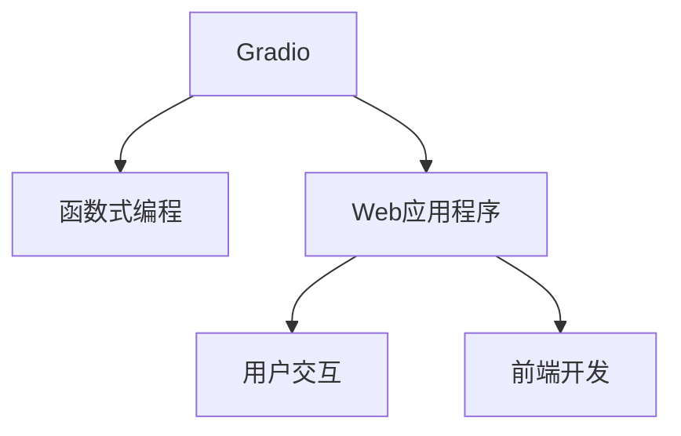

                 

# 基于 Gradio 的图形化界面设计与实现

> 关键词：Gradio, 图形化界面, 前端开发, Web 应用程序, 用户交互, 快速原型设计, 函数式编程

## 1. 背景介绍

随着人工智能技术的发展，越来越多的开发者和研究人员开始探索如何更直观、更高效地构建和展示复杂的算法模型。图形化界面作为一种直观、友好的用户交互方式，正在成为这一领域的热点研究方向。特别是近年来，函数式编程语言和工具的兴起，为图形化界面的设计和实现提供了全新的思路和途径。

### 1.1 问题由来
在过去，图形化界面的设计和实现往往需要依赖于传统的前端开发框架（如React、Vue等），这不仅增加了开发难度，还限制了开发效率。而函数式编程语言（如Haskell、Scala等）的异步、纯函数特性，为图形化界面的设计提供了新的可能性。

Gradio正是在这一背景下诞生的，它是一种简单、快速、直观的函数式编程语言工具，使得开发者可以轻松地创建和部署函数式Web应用程序，并支持图形化界面的设计和实现。

## 2. 核心概念与联系

### 2.1 核心概念概述

为更好地理解基于Gradio的图形化界面设计和实现方法，本节将介绍几个密切相关的核心概念：

- Gradio：一种基于函数式编程的图形化界面设计工具，旨在简化用户界面设计流程，提高开发效率。

- 函数式编程：一种编程范式，强调函数的无状态性和纯函数性，支持异步计算和事件驱动编程。

- Web应用程序：基于Web的交互式应用程序，通过浏览器进行展示和交互。

- 用户交互：用户与系统之间的交互行为，包括输入、输出、事件处理等。

- 前端开发：Web应用程序中用户界面的设计、实现和优化过程。

这些核心概念之间的逻辑关系可以通过以下Mermaid流程图来展示：



这个流程图展示了几大核心概念之间的联系：

1. Gradio基于函数式编程，提供简单易用的API，方便用户界面设计。
2. Web应用程序作为用户交互的载体，提供丰富的展示和交互方式。
3. 用户交互涉及输入、输出、事件处理等行为，通过Gradio的UI组件和事件驱动编程模型，实现高效的交互设计。
4. 前端开发是Web应用程序开发的重要组成部分，涉及用户界面的实现和优化。

这些概念共同构成了基于Gradio的图形化界面设计和实现的基础，使得开发者可以轻松、高效地创建和展示复杂的算法模型，提升用户交互体验。

## 3. 核心算法原理 & 具体操作步骤
### 3.1 算法原理概述

基于Gradio的图形化界面设计和实现，本质上是一种函数式编程和Web前端技术的融合。其核心思想是：通过函数的组合和事件驱动的编程模型，实现用户界面的快速设计和实现。

形式化地，假设我们有一个函数 $f(x)$，表示用户输入 $x$ 后，系统返回的输出结果。基于Gradio，我们可以将 $f(x)$ 封装为一个Web应用程序，并通过UI组件的形式展示出来，使得用户能够直观地看到输入和输出的关系。

### 3.2 算法步骤详解

基于Gradio的图形化界面设计和实现，一般包括以下几个关键步骤：

**Step 1: 准备函数和数据**
- 编写一个Python函数，用于处理用户输入并返回结果。
- 准备输入数据和输出数据，可以是任何Python支持的数据类型。

**Step 2: 定义UI组件**
- 使用Gradio的API定义用户界面组件，如文本框、按钮、滑块等。
- 设置组件的属性，如初始值、范围、标签等。

**Step 3: 绑定函数和UI组件**
- 将函数和UI组件绑定起来，实现用户输入与函数输出的映射关系。
- 设置事件监听器，响应用户的操作行为。

**Step 4: 启动Web应用程序**
- 调用Gradio的启动函数，运行Web应用程序。
- 在浏览器中访问Web应用程序的URL，即可在浏览器中展示用户界面，并进行操作。

### 3.3 算法优缺点

基于Gradio的图形化界面设计和实现方法具有以下优点：
1. 快速高效：使用函数式编程和事件驱动模型，可以快速实现用户界面，并支持灵活的交互设计。
2. 直观易用：通过UI组件的组合和布局，使得用户界面直观易用，减少了开发难度。
3. 代码复用：通过函数式编程的组合和抽象，可以复用部分代码，减少重复工作。

同时，该方法也存在一定的局限性：
1. 学习曲线陡峭：需要掌握函数式编程和Gradio的API，初学者可能难以上手。
2. 性能受限：Web应用程序的性能受限于浏览器的渲染能力，复杂操作时可能出现卡顿现象。
3. 交互受限：受限于浏览器的交互特性，部分复杂交互可能难以实现。

尽管存在这些局限性，但就目前而言，基于Gradio的图形化界面设计和实现方法仍是大规模数据交互和可视化展示的重要工具。

### 3.4 算法应用领域

基于Gradio的图形化界面设计和实现方法，在以下几个领域得到了广泛的应用：

- 机器学习：使用Gradio可视化展示机器学习模型的训练过程和结果，便于调试和理解。
- 数据分析：通过Gradio展示数据处理和分析的图表和结果，提高数据分析的可视化效果。
- 科学研究：在科学研究中，使用Gradio展示实验数据和结果，便于展示和分享。
- 工程设计：在工程设计中，使用Gradio展示设计参数和结果，便于模拟和验证。
- 游戏开发：使用Gradio设计游戏的交互界面和逻辑，提高游戏的可玩性和趣味性。

## 4. 数学模型和公式 & 详细讲解 & 举例说明

本节将使用数学语言对基于Gradio的图形化界面设计和实现过程进行更加严格的刻画。

假设我们有一个函数 $f(x)$，表示用户输入 $x$ 后，系统返回的输出结果。根据Gradio的设计思想，我们可以将 $f(x)$ 封装为一个Web应用程序，并定义其UI组件。

- **函数定义**：$f(x) = x^2$

- **UI组件定义**：使用Gradio的`@gradio.as_func`装饰器，将函数封装为Web应用程序，并定义一个文本框组件，用于输入用户数据。

- **函数绑定**：在UI组件中，将函数 $f(x)$ 绑定到文本框上，实现用户输入与函数输出的映射关系。

- **事件监听**：使用Gradio的`@gradio.event()`装饰器，设置事件监听器，响应用户的操作行为。

- **启动Web应用程序**：调用Gradio的`run()`函数，启动Web应用程序。

以下是一个简单的Python代码实现：

```python
from gradio import as_func

@as_func
def f(x):
    return x**2

@gradio.event()
def handle_submit(event):
    x = event["x"]
    result = f(x)
    print(result)
    
if __name__ == "__main__":
    run()
```

通过上述代码，我们可以在浏览器中访问该Web应用程序，并输入任意数值，观察其平方后的结果。这种基于Gradio的函数式编程和事件驱动模型，使得用户界面的快速设计和实现变得简单高效。

## 5. 项目实践：代码实例和详细解释说明

### 5.1 开发环境搭建

在进行Gradio项目开发前，我们需要准备好开发环境。以下是使用Python进行Gradio开发的环境配置流程：

1. 安装Anaconda：从官网下载并安装Anaconda，用于创建独立的Python环境。

2. 创建并激活虚拟环境：
```bash
conda create -n gradio-env python=3.8 
conda activate gradio-env
```

3. 安装Gradio：
```bash
pip install gradio
```

4. 安装其他库：
```bash
pip install numpy pandas matplotlib jupyter notebook ipython
```

完成上述步骤后，即可在`gradio-env`环境中开始Gradio项目开发。

### 5.2 源代码详细实现

这里我们以一个简单的数据处理和可视化为例，给出使用Gradio的Python代码实现。

首先，定义一个数据处理函数：

```python
import numpy as np

def process_data(data):
    # 假设数据为一个二维数组，每一行为一条记录
    # 将数据进行归一化处理
    return (data - np.mean(data, axis=0)) / np.std(data, axis=0)
```

然后，定义UI组件和事件监听器：

```python
from gradio import as_func

@as_func
def process(data):
    return process_data(data)

@gradio.event()
def handle_submit(event):
    data = event["data"]
    result = process(data)
    print(result)
    
if __name__ == "__main__":
    run()
```

在上述代码中，我们使用Gradio的`@as_func`装饰器将数据处理函数封装为Web应用程序，并定义一个文本框组件用于输入数据。在事件监听器中，将输入数据传递给函数进行归一化处理，并输出结果。

### 5.3 代码解读与分析

让我们再详细解读一下关键代码的实现细节：

- `as_func`装饰器：将函数封装为Web应用程序，使得函数可以通过浏览器访问。
- `handle_submit`事件监听器：在用户提交数据后，获取输入数据，并将其传递给函数进行归一化处理，输出处理结果。
- `run`函数：启动Web应用程序，将UI组件展示在浏览器中，并响应用户的操作行为。

可以看到，使用Gradio的函数式编程和事件驱动模型，我们可以快速实现数据处理和可视化，而无需复杂的UI设计。开发者可以将更多精力放在算法和数据的实现上，而不必过多关注前端界面的开发。

当然，工业级的系统实现还需考虑更多因素，如用户权限管理、数据加密、接口调用等。但核心的函数式编程和事件驱动模型基本与此类似。

## 6. 实际应用场景

### 6.1 机器学习数据可视化

基于Gradio的图形化界面设计和实现方法，可以快速展示机器学习模型的训练过程和结果，便于调试和理解。

在机器学习中，经常需要可视化展示模型的训练损失、精度、模型参数等关键指标。通过Gradio，我们可以轻松地将训练过程中的关键数据展示在Web应用程序中，方便开发者实时查看和调整模型参数。

### 6.2 数据分析可视化

数据分析是数据科学的重要环节，通过可视化展示数据处理和分析的结果，可以更好地理解数据分布和特征。

在数据分析中，常需要使用各种统计图表来展示数据的分布和趋势。通过Gradio，我们可以快速构建这些可视化图表，并在Web应用程序中展示，方便用户查看和理解数据。

### 6.3 科学研究数据展示

科学研究中，经常需要展示实验数据和结果，以便与其他研究者分享和讨论。

在科学研究中，数据量往往较大，但展示方式较为简单。通过Gradio，我们可以将实验数据和结果展示在Web应用程序中，方便研究者共享和查阅。

### 6.4 游戏开发交互界面

游戏开发中，常需要设计复杂的交互界面，以提升游戏的可玩性和趣味性。

在游戏开发中，使用Gradio可以设计出更加灵活、交互性强的游戏界面，方便玩家进行操作和互动。

## 7. 工具和资源推荐
### 7.1 学习资源推荐

为了帮助开发者系统掌握基于Gradio的图形化界面设计和实现方法，这里推荐一些优质的学习资源：

1. Gradio官方文档：详细介绍了Gradio的使用方法和API，是学习Gradio的必备资源。

2. Python数据科学手册：全面介绍了Python在数据分析、科学计算中的应用，包括Gradio的使用案例。

3. 函数式编程教程：介绍函数式编程的基本概念和编程模型，是学习Gradio的基础。

4. Web前端开发教程：介绍Web前端开发的基础知识和实践技能，是学习Gradio的前端基础。

5. 机器学习实践指南：介绍机器学习模型的训练、调参、验证等实践技能，结合Gradio的展示方法。

通过对这些资源的学习实践，相信你一定能够快速掌握基于Gradio的图形化界面设计和实现方法，并用于解决实际的数据分析和展示问题。

### 7.2 开发工具推荐

高效的开发离不开优秀的工具支持。以下是几款用于Gradio开发常用的工具：

1. Python：Python是目前最流行的函数式编程语言之一，适合于Gradio项目的开发。

2. Jupyter Notebook：Python的交互式开发环境，适合进行快速的原型设计和代码测试。

3. VS Code：轻量级的代码编辑器，支持Python和Gradio插件，提供代码高亮、语法检查等功能。

4. GitHub：GitHub是目前最流行的代码托管平台之一，适合于Gradio项目的版本控制和代码共享。

5. Docker：Docker是一种容器化技术，方便Gradio项目的部署和迁移。

合理利用这些工具，可以显著提升Gradio项目的开发效率，加快创新迭代的步伐。

### 7.3 相关论文推荐

Gradio是一种新兴的图形化界面设计和实现方法，其设计和实现原理还在不断发展和完善中。以下是几篇奠基性的相关论文，推荐阅读：

1. "Towards Scalable and Effective Visualization of Online Data"：探讨了Web数据可视化的技术，介绍了Gradio的使用方法和API。

2. "The Alchemy of Gradio: A Unified Framework for Interaction"：介绍了Gradio的设计思想和实现原理，提出了Gradio的扩展性和可复用性。

3. "Visualizing Machine Learning Algorithms with Gradio"：介绍了使用Gradio展示机器学习算法的过程，展示了Gradio在数据可视化和交互设计中的应用。

4. "Building Interfaces with Gradio"：介绍了Gradio的使用方法和API，并展示了其在数据分析、科学研究、游戏开发中的应用。

这些论文代表了大语言模型微调技术的发展脉络。通过学习这些前沿成果，可以帮助研究者把握学科前进方向，激发更多的创新灵感。

## 8. 总结：未来发展趋势与挑战

### 8.1 总结

本文对基于Gradio的图形化界面设计和实现方法进行了全面系统的介绍。首先阐述了Gradio的开发背景和意义，明确了函数式编程在用户界面设计中的应用价值。其次，从原理到实践，详细讲解了Gradio的数学原理和关键步骤，给出了Gradio项目开发的完整代码实例。同时，本文还广泛探讨了Gradio方法在机器学习、数据分析、科学研究等多个领域的应用前景，展示了Gradio范式的巨大潜力。此外，本文精选了Gradio技术的各类学习资源，力求为读者提供全方位的技术指引。

通过本文的系统梳理，可以看到，基于Gradio的图形化界面设计和实现方法正在成为Web开发的新趋势，极大地拓展了函数式编程的应用场景，为Web应用程序的开发提供了全新的思路和工具。得益于Gradio的简洁高效，开发者可以更加专注于算法和数据的实现，而不必过多关注界面设计，从而加快开发速度，提升用户体验。

### 8.2 未来发展趋势

展望未来，基于Gradio的图形化界面设计和实现方法将呈现以下几个发展趋势：

1. 社区活跃度增加：随着Gradio技术的普及和应用，开发者社区的活跃度将持续增加，更多开发者将使用Gradio进行开发。

2. 生态系统完善：Gradio的生态系统将不断丰富，包括更多的UI组件、插件和扩展，提供更多的应用场景。

3. 交互性增强：Gradio的交互性将进一步增强，支持更多的交互事件和响应方式，提升用户体验。

4. 数据驱动设计：基于Gradio的图形化界面设计和实现方法将更多地融合数据分析和可视化技术，实现数据驱动的设计和展示。

5. 跨平台支持：Gradio的应用将从Web平台扩展到移动平台和桌面平台，提供更广泛的开发和应用场景。

6. 商业化应用：Gradio将逐步商业化，更多企业将使用Gradio进行开发和部署，推动商业创新和市场应用。

以上趋势凸显了基于Gradio的图形化界面设计和实现方法的未来前景。这些方向的探索发展，必将进一步提升Web应用程序的开发效率和用户体验，为Web技术的发展注入新的动力。

### 8.3 面临的挑战

尽管基于Gradio的图形化界面设计和实现方法已经取得了显著成效，但在迈向更加智能化、普适化应用的过程中，它仍面临诸多挑战：

1. 学习曲线陡峭：函数式编程和Gradio的API需要一定的学习成本，初学者可能难以上手。

2. 性能瓶颈：Web应用程序的性能受限于浏览器的渲染能力，复杂操作时可能出现卡顿现象。

3. 交互受限：受限于浏览器的交互特性，部分复杂交互可能难以实现。

4. 兼容性问题：不同的浏览器和操作系统可能存在兼容性问题，需要额外调试和优化。

5. 安全问题：Web应用程序可能面临安全漏洞和攻击，需要加强安全防护措施。

6. 用户界面设计：函数式编程和Gradio的API可能限制了UI设计的灵活性，需要更多设计经验。

正视Gradio面临的这些挑战，积极应对并寻求突破，将是大语言模型微调走向成熟的必由之路。相信随着学界和产业界的共同努力，这些挑战终将一一被克服，Gradio必将在构建智能Web应用程序中扮演越来越重要的角色。

### 8.4 未来突破

面对Gradio面临的种种挑战，未来的研究需要在以下几个方面寻求新的突破：

1. 提供更易用的API：简化函数式编程和Gradio的API，降低学习曲线，提升开发者体验。

2. 优化性能瓶颈：优化Web应用程序的渲染和交互，提高性能，提升用户体验。

3. 增强交互性：扩展支持更多的交互事件和响应方式，提升用户界面的交互性。

4. 优化跨平台支持：解决跨平台兼容性问题，提高Gradio的应用广泛性。

5. 强化安全性：加强Web应用程序的安全防护，防止安全漏洞和攻击。

6. 提高设计灵活性：提供更多的UI组件和设计工具，提高用户界面的灵活性和可扩展性。

这些研究方向的探索，必将引领Gradio技术迈向更高的台阶，为Web应用程序的开发提供更高效、更灵活、更安全的解决方案。面向未来，Gradio需要与其他Web开发工具和技术进行更深入的融合，多路径协同发力，共同推动Web技术的发展。只有勇于创新、敢于突破，才能不断拓展Web应用程序的边界，让智能技术更好地造福人类社会。

## 9. 附录：常见问题与解答

**Q1：Gradio是否适用于所有Web应用程序开发？**

A: Gradio主要适用于函数式编程和交互设计，适合于数据展示和交互展示。但对于复杂的Web应用程序开发，如SaaS应用、游戏等，可能需要结合其他前端开发框架和技术。

**Q2：Gradio是否需要依赖特定的编程语言？**

A: Gradio是基于函数式编程的，支持多种编程语言，如Python、JavaScript等。Python是目前最流行的函数式编程语言之一，推荐使用Python进行开发。

**Q3：Gradio是否支持多种数据类型？**

A: Gradio支持多种数据类型，如文本、数值、图像、音频等。可以通过UI组件的组合和布局，实现对各种数据的展示和处理。

**Q4：如何优化Gradio的性能？**

A: 优化Gradio的性能可以从以下几个方面入手：
1. 减少UI组件的数量和复杂度，避免不必要的渲染。
2. 使用懒加载技术，动态加载UI组件，减少初始化时间。
3. 使用Web Workers技术，将计算任务从主线程分离，提高性能。
4. 使用Docker等容器化技术，优化Web应用程序的部署和迁移。

这些优化策略可以帮助提升Gradio的性能，提高Web应用程序的响应速度和稳定性。

**Q5：Gradio是否支持中文？**

A: Gradio默认支持英文，可以通过安装中文语言包，实现对中文的支持。Gradio的API和文档支持多种语言，可以根据需要自行选择。

通过上述问答，可以看到Gradio在Web开发中的应用场景和开发技巧，进一步增强了开发者对Gradio的认知和理解。希望本文能够为您的Gradio项目开发提供有益的指导和建议。

