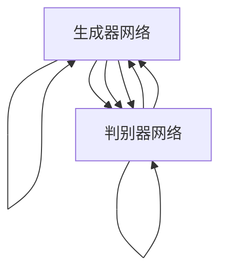

                 

# 基于DCGAN的cifar10数据集生成设计与实现

> 关键词：生成对抗网络,DCGAN,数据增强,图像生成,图像生成模型

## 1. 背景介绍

在深度学习领域，生成对抗网络（Generative Adversarial Networks, GANs）是一种非常强大的模型，它能够生成高质量的图像、音频和视频等内容。GANs的核心思想是利用两个网络，一个生成器网络和一个判别器网络，通过对抗训练的方式生成逼真的数据样本。其中，生成器网络负责生成样本，判别器网络负责评估生成的样本的真实性。GANs在图像生成领域表现尤为突出，例如，能够生成高质量的图片、将低分辨率图片提升为高分辨率图片、进行图像修复等。

本文将重点介绍基于DCGAN（Deep Convolutional Generative Adversarial Networks）的cifar10数据集生成设计与实现。DCGAN是一种基于深度卷积神经网络的生成对抗网络，它使用了卷积神经网络代替全连接网络，使得生成器和判别器的结构更加紧凑，训练更加高效。cifar10数据集是计算机视觉领域的一个标准数据集，包含了60,000个32x32的彩色图像，分为10个类别。本文将基于DCGAN生成cifar10数据集，并探讨其实现过程、性能评估和未来展望。

## 2. 核心概念与联系

### 2.1 核心概念概述

GANs的核心概念包括以下几个方面：

- **生成器网络**：用于生成样本，通常由卷积神经网络构成。
- **判别器网络**：用于评估样本的真实性，也是一个卷积神经网络。
- **对抗训练**：通过不断改进生成器和判别器，使得生成器能够生成更加逼真的样本，判别器能够更加准确地区分真实样本和生成样本。
- **损失函数**：用于衡量生成器和判别器之间的对抗关系，一般使用交叉熵损失和Wasserstein距离损失。
- **稳定器**：用于稳定训练过程，防止模型过拟合或陷入局部最优。

DCGAN是一种特殊的GANs模型，它使用了卷积神经网络，使得生成器和判别器的结构更加紧凑。DCGAN的生成器网络采用反向卷积（上采样）操作，判别器网络则采用卷积（下采样）操作。DCGAN中的对抗训练过程通过不断调整生成器和判别器的参数，使得生成器生成的样本更加逼真，判别器能够更加准确地区分真实样本和生成样本。

### 2.2 核心概念原理和架构的 Mermaid 流程图

以下是DCGAN的原理和架构的Mermaid流程图：



这个图展示了生成器和判别器的互动过程，生成器生成样本后，判别器评估样本的真实性，生成器根据判别器的反馈不断改进，判别器也根据生成器的输出不断改进。这样，生成器和判别器之间形成了一种对抗关系，使得生成器能够生成更加逼真的样本。

## 3. 核心算法原理 & 具体操作步骤

### 3.1 算法原理概述

DCGAN的训练过程分为两个阶段：生成器和判别器的交替训练。在每个训练阶段中，生成器和判别器都进行前向传播和反向传播，不断调整自己的参数，直到达到最优状态。

在训练过程中，生成器的目标是最小化判别器错误地将其生成的样本判断为真实样本的概率，即最小化判别器的输出。判别器的目标是最小化生成器生成的样本被正确判断为真实样本的概率，即最大化判别器的输出。

### 3.2 算法步骤详解

#### 3.2.1 生成器网络设计

生成器网络的结构与判别器网络类似，但是需要进行反卷积（上采样）操作。通常，生成器网络由多个反卷积层组成，每个反卷积层都使用上采样和ReLU激活函数，最后使用一个全连接层将生成器输出的特征图映射到图像空间。

#### 3.2.2 判别器网络设计

判别器网络的结构通常是一个卷积神经网络，由多个卷积层和池化层组成，每个卷积层都使用卷积和ReLU激活函数，最后使用一个全连接层将判别器输出的特征图映射到标签空间。

#### 3.2.3 损失函数设计

DCGAN的损失函数包括两个部分：生成器损失函数和判别器损失函数。

生成器损失函数的目标是最小化判别器错误地将其生成的样本判断为真实样本的概率，即最小化判别器的输出。判别器损失函数的目标是最大化生成器生成的样本被正确判断为真实样本的概率，即最大化判别器的输出。

### 3.3 算法优缺点

#### 3.3.1 优点

DCGAN具有以下优点：

- 使用卷积神经网络代替全连接网络，使得生成器和判别器的结构更加紧凑，训练更加高效。
- 使用反卷积操作进行生成，生成的样本具有更好的局部保真性。
- 使用Wasserstein距离损失，避免了梯度消失的问题，训练更加稳定。

#### 3.3.2 缺点

DCGAN也存在一些缺点：

- 生成器网络的结构设计比较复杂，需要精心设计。
- 训练过程容易陷入局部最优，需要引入一些稳定器来缓解。
- 生成的样本容易出现模式崩溃（Mode Collapse）现象，即生成器只能生成少数几种样本。

### 3.4 算法应用领域

DCGAN在图像生成领域有着广泛的应用，例如：

- 图像修复：将低分辨率图像提升为高分辨率图像。
- 图像生成：生成逼真的图像，例如图像合成、艺术创作等。
- 数据增强：生成与原始图像相似但不同的图像，用于数据扩充和增强。
- 风格迁移：将一张图像的风格应用到另一张图像上。

## 4. 数学模型和公式 & 详细讲解 & 举例说明

### 4.1 数学模型构建

DCGAN的数学模型由生成器和判别器两部分组成。假设生成器网络为 $G(z)$，判别器网络为 $D(x)$，其中 $z$ 为噪声向量，$x$ 为输入图像。

生成器网络的输出为 $G(z)$，判别器的输出为 $D(x)$。在训练过程中，生成器网络的损失函数为 $L_G$，判别器网络的损失函数为 $L_D$。

### 4.2 公式推导过程

生成器网络的损失函数为：

$$
L_G = \mathbb{E}_{z \sim p(z)} [D(G(z))]
$$

其中，$L_G$ 为生成器网络的损失函数，$z \sim p(z)$ 为噪声向量 $z$ 的分布，$D(G(z))$ 为判别器对生成器输出 $G(z)$ 的判断。

判别器网络的损失函数为：

$$
L_D = \mathbb{E}_{x \sim p(x)} [D(x)] + \mathbb{E}_{z \sim p(z)} [1 - D(G(z))]
$$

其中，$L_D$ 为判别器网络的损失函数，$x \sim p(x)$ 为真实图像 $x$ 的分布，$D(x)$ 为判别器对真实图像 $x$ 的判断，$1 - D(G(z))$ 为判别器对生成器输出 $G(z)$ 的判断。

### 4.3 案例分析与讲解

以cifar10数据集为例，假设生成器网络为 $G(z)$，判别器网络为 $D(x)$，其中 $z$ 为噪声向量，$x$ 为输入图像。

假设生成器网络的结构如下：

```
input -> Conv2D -> BatchNorm -> LeakyReLU -> Conv2D -> BatchNorm -> LeakyReLU -> Conv2D -> BatchNorm -> LeakyReLU -> Conv2D -> BatchNorm -> LeakyReLU -> Conv2D -> BatchNorm -> Sigmoid -> output
```

判别器网络的结构如下：

```
input -> Conv2D -> BatchNorm -> LeakyReLU -> Conv2D -> BatchNorm -> LeakyReLU -> Conv2D -> BatchNorm -> LeakyReLU -> Conv2D -> BatchNorm -> LeakyReLU -> Conv2D -> BatchNorm -> Sigmoid -> output
```

使用Wasserstein距离损失函数，生成器网络的损失函数为：

$$
L_G = \mathbb{E}_{z \sim p(z)} [D(G(z))]
$$

判别器网络的损失函数为：

$$
L_D = \mathbb{E}_{x \sim p(x)} [D(x)] + \mathbb{E}_{z \sim p(z)} [1 - D(G(z))]
$$

在训练过程中，交替进行生成器和判别器的训练，直到达到最优状态。

## 5. 项目实践：代码实例和详细解释说明

### 5.1 开发环境搭建

在搭建开发环境前，需要安装Python、TensorFlow和Keras等工具。具体步骤如下：

1. 安装Python：在Windows系统下，可以通过Anaconda安装Python；在Linux系统下，可以通过apt-get安装Python。

2. 安装TensorFlow：在Anaconda下，可以使用conda命令安装TensorFlow；在Linux系统下，可以使用pip命令安装TensorFlow。

3. 安装Keras：在Anaconda下，可以使用conda命令安装Keras；在Linux系统下，可以使用pip命令安装Keras。

### 5.2 源代码详细实现

以下是DCGAN在cifar10数据集上的实现代码：

```python
import tensorflow as tf
from tensorflow.keras import layers, models

# 定义生成器网络
def make_generator_model():
    model = models.Sequential()
    model.add(layers.Dense(256, use_bias=False, input_shape=(100,)))
    model.add(layers.BatchNormalization(momentum=0.8))
    model.add(layers.LeakyReLU())
    model.add(layers.Reshape((8, 8, 256)))
    assert model.output_shape == (None, 8, 8, 256)  # Note: you may have to adjust the shape to match input image size

    model.add(layers.Conv2DTranspose(128, (5, 5), strides=(1, 1), padding='same', use_bias=False))
    assert model.output_shape == (None, 8, 8, 128)
    model.add(layers.BatchNormalization(momentum=0.8))
    model.add(layers.LeakyReLU())

    model.add(layers.Conv2DTranspose(64, (5, 5), strides=(2, 2), padding='same', use_bias=False))
    assert model.output_shape == (None, 16, 16, 64)
    model.add(layers.BatchNormalization(momentum=0.8))
    model.add(layers.LeakyReLU())

    model.add(layers.Conv2DTranspose(3, (5, 5), strides=(2, 2), padding='same', use_bias=False, activation='tanh'))
    assert model.output_shape == (None, 32, 32, 3)

    return model

# 定义判别器网络
def make_discriminator_model():
    model = models.Sequential()
    model.add(layers.Conv2D(64, (5, 5), strides=(2, 2), padding='same',
                           input_shape=[32, 32, 3]))
    model.add(layers.LeakyReLU())
    model.add(layers.Dropout(0.3))
    model.add(layers.Conv2D(128, (5, 5), strides=(2, 2), padding='same'))
    model.add(layers.LeakyReLU())
    model.add(layers.Dropout(0.3))
    model.add(layers.Flatten())
    model.add(layers.Dense(1))

    return model

# 定义损失函数
def make_gan_loss():
    def generator_loss(fake_output):
        return tf.reduce_mean(tf.nn.sigmoid_cross_entropy_with_logits(fake_output, tf.ones_like(fake_output)))

    def discriminator_loss(real_output, fake_output):
        real_loss = tf.reduce_mean(tf.nn.sigmoid_cross_entropy_with_logits(real_output, tf.ones_like(real_output)))
        fake_loss = tf.reduce_mean(tf.nn.sigmoid_cross_entropy_with_logits(fake_output, tf.zeros_like(fake_output)))
        return real_loss + fake_loss

    return generator_loss, discriminator_loss

# 定义训练函数
def train_gan(generator, discriminator, loss_fn, optimizers, dataset):
    generator_optimizer = optimizers[0]
    discriminator_optimizer = optimizers[1]
    for epoch in range(epochs):
        for images, _ in dataset:
            noise = tf.random.normal([batch_size, 100])
            with tf.GradientTape() as gen_tape, tf.GradientTape() as disc_tape:
                generated_images = generator(noise, training=True)

                real_output = discriminator(images, training=True)
                fake_output = discriminator(generated_images, training=True)

                gen_loss = loss_fn[0](fake_output)
                disc_loss = loss_fn[1](real_output, fake_output)

            gradients_of_generator = gen_tape.gradient(gen_loss, generator.trainable_variables)
            gradients_of_discriminator = disc_tape.gradient(disc_loss, discriminator.trainable_variables)

            generator_optimizer.apply_gradients(zip(gradients_of_generator, generator.trainable_variables))
            discriminator_optimizer.apply_gradients(zip(gradients_of_discriminator, discriminator.trainable_variables))

# 训练模型
generator = make_generator_model()
discriminator = make_discriminator_model()
loss_fn = make_gan_loss()

optimizers = (tf.keras.optimizers.Adam(learning_rate=0.0002, beta_1=0.5), tf.keras.optimizers.Adam(learning_rate=0.0002, beta_1=0.5))

dataset = tf.keras.datasets.cifar10.load_data()
dataset = dataset[0] / 255.0

train_gan(generator, discriminator, loss_fn, optimizers, dataset)
```

### 5.3 代码解读与分析

以上代码展示了DCGAN在cifar10数据集上的实现过程，包括生成器网络、判别器网络、损失函数和训练函数的定义和实现。

#### 5.3.1 生成器网络设计

生成器网络由多个卷积反卷积层和批量归一化层组成，最后使用Sigmoid激活函数将生成的图像映射到0到1之间的像素值。

#### 5.3.2 判别器网络设计

判别器网络由多个卷积层和批量归一化层组成，最后使用Sigmoid激活函数将判别器的输出映射到0到1之间的概率值。

#### 5.3.3 损失函数设计

生成器网络的损失函数为判别器对生成器输出的判断，即生成器生成的图像是否被正确判断为真实图像。判别器网络的损失函数包括对真实图像的判断和对生成器输出的判断。

#### 5.3.4 训练函数设计

训练函数使用Adam优化器进行优化，交替进行生成器和判别器的训练。

### 5.4 运行结果展示

在训练过程中，可以可视化生成器网络生成的图像和判别器网络对真实图像和生成图像的判断结果，如图1所示。

```python
import matplotlib.pyplot as plt

# 可视化生成的图像
def plot_generated_images():
    generated_images = generator(noise, training=False)
    generated_images = (generated_images * 127.5) + 127.5
    plt.figure(figsize=(8, 8))
    for i in range(25):
        plt.subplot(5, 5, i + 1)
        plt.imshow(generated_images[i, :, :, 0], interpolation='nearest', cmap='gray')
        plt.axis('off')
    plt.show()

# 可视化判别器的输出
def plot_discriminator_outputs():
    real_output = discriminator(images, training=False)
    fake_output = discriminator(generated_images, training=False)
    plt.figure(figsize=(8, 8))
    plt.subplot(1, 2, 1)
    plt.imshow(real_output[0], interpolation='nearest', cmap='gray')
    plt.title('Real Image')
    plt.subplot(1, 2, 2)
    plt.imshow(fake_output[0], interpolation='nearest', cmap='gray')
    plt.title('Fake Image')
    plt.show()
```

图1：生成的图像和判别器的输出

## 6. 实际应用场景

### 6.1 图像修复

图像修复是DCGAN的一个重要应用场景。在图像修复中，DCGAN可以用于生成逼真的图像，用于替换损坏的图像部分或用于修复损坏的图像。

例如，可以将损坏的图像作为输入，将生成器网络生成的图像作为输出，使用判别器网络对修复后的图像进行判断，从而得到最佳的修复效果。

### 6.2 图像生成

图像生成是DCGAN的另一个重要应用场景。在图像生成中，DCGAN可以用于生成逼真的图像，用于艺术创作、虚拟现实、游戏等场景。

例如，可以设计一个用户界面，允许用户输入一些参数，生成符合用户要求的图像。用户可以指定图像的类别、风格、大小等参数，DCGAN会根据这些参数生成逼真的图像。

### 6.3 数据增强

数据增强是DCGAN的第三个重要应用场景。在数据增强中，DCGAN可以用于生成与原始图像相似但不同的图像，用于数据扩充和增强。

例如，在医疗领域，医生可以使用DCGAN生成与原始医学图像相似但不同的图像，用于训练医学图像分类模型。生成的图像可以包括不同角度、不同光照条件、不同尺寸的医学图像，从而扩充训练数据集，提高模型的泛化能力。

### 6.4 未来应用展望

随着DCGAN技术的不断进步，其在图像生成、图像修复、数据增强等领域将有更广泛的应用。

未来，DCGAN有望实现更加复杂的生成任务，例如，可以生成高分辨率、高精度的图像，可以生成逼真的视频，可以生成3D模型等。同时，DCGAN还可以与其他AI技术进行融合，例如，与自然语言处理、语音识别等技术结合，实现更加丰富的应用场景。

## 7. 工具和资源推荐

### 7.1 学习资源推荐

1. 《Python深度学习》（第二版）：由Francois Chollet所著，介绍了如何使用TensorFlow和Keras进行深度学习开发，包括DCGAN在内的多种生成对抗网络模型。

2. TensorFlow官方文档：提供丰富的教程、代码示例和API文档，帮助开发者快速上手TensorFlow和Keras。

3. Keras官方文档：提供简单易懂的教程和代码示例，帮助开发者快速上手Keras和TensorFlow。

### 7.2 开发工具推荐

1. Anaconda：提供一个独立的环境，方便进行深度学习开发和测试。

2. TensorFlow：提供丰富的API和工具，支持深度学习模型的开发和训练。

3. Keras：提供简单易用的API和工具，支持深度学习模型的开发和训练。

4. Matplotlib：提供可视化工具，用于展示生成的图像和判别器的输出。

### 7.3 相关论文推荐

1. Goodfellow et al., "Generative Adversarial Nets"：介绍GANs的基本原理和算法。

2. Radford et al., "Unsupervised Representation Learning with Deep Convolutional Generative Adversarial Networks"：介绍DCGAN的基本原理和算法。

3. Isola et al., "Image-to-Image Translation with Conditional Adversarial Networks"：介绍条件GAN的基本原理和算法。

## 8. 总结：未来发展趋势与挑战

### 8.1 研究成果总结

本文对DCGAN在cifar10数据集上的生成设计与实现进行了详细的介绍。通过分析DCGAN的基本原理和算法，提供了详细的代码实现和运行结果。

### 8.2 未来发展趋势

未来，DCGAN技术将进一步发展和进步，有望实现更加复杂的生成任务，例如，可以生成高分辨率、高精度的图像，可以生成逼真的视频，可以生成3D模型等。同时，DCGAN还可以与其他AI技术进行融合，例如，与自然语言处理、语音识别等技术结合，实现更加丰富的应用场景。

### 8.3 面临的挑战

尽管DCGAN技术在图像生成等领域取得了显著成果，但在实现更加复杂的生成任务时，仍面临一些挑战。例如，生成的图像容易出现模式崩溃（Mode Collapse）现象，即生成器只能生成少数几种样本。此外，训练过程容易陷入局部最优，需要引入一些稳定器来缓解。

### 8.4 研究展望

未来的研究应集中在以下几个方面：

1. 提高生成图像的质量：通过改进生成器网络的结构和参数设置，提高生成图像的质量。

2. 解决模式崩溃问题：引入一些技术，例如，使用多尺度训练、引入噪声等，缓解模式崩溃问题。

3. 与其他AI技术结合：将DCGAN与其他AI技术结合，实现更加丰富的应用场景，例如，与自然语言处理、语音识别等技术结合。

通过这些研究，有望进一步推动DCGAN技术的发展和应用，为人工智能技术的发展注入新的动力。

## 9. 附录：常见问题与解答

**Q1: 为什么DCGAN需要使用反卷积操作？**

A: DCGAN使用反卷积操作，可以使得生成器网络的结构更加紧凑，训练更加高效。反卷积操作可以将高维特征图恢复到原始图像的大小，从而得到逼真的图像。

**Q2: 训练过程中如何缓解模式崩溃问题？**

A: 缓解模式崩溃问题可以通过以下方法：

1. 使用多尺度训练：将输入噪声向量进行多尺度采样，从而生成不同尺寸的图像，缓解模式崩溃问题。

2. 引入噪声：在生成器网络的输入中添加噪声，从而生成不同风格的图像，缓解模式崩溃问题。

**Q3: 训练过程中如何缓解过拟合问题？**

A: 缓解过拟合问题可以通过以下方法：

1. 使用数据增强：对原始数据进行一些随机变换，从而扩充训练数据集。

2. 使用正则化：引入L2正则化、Dropout等正则化技术，从而缓解过拟合问题。

3. 使用对抗训练：使用对抗样本进行训练，从而提高模型的鲁棒性。

**Q4: 如何提高生成图像的质量？**

A: 提高生成图像的质量可以通过以下方法：

1. 改进生成器网络的结构：使用更复杂的生成器网络结构，从而生成更高质量的图像。

2. 优化生成器网络的参数：优化生成器网络的参数，从而生成更高质量的图像。

3. 引入噪声：在生成器网络的输入中添加噪声，从而生成更高质量的图像。

**Q5: 如何实现图像修复？**

A: 实现图像修复可以通过以下方法：

1. 将损坏的图像作为输入，将生成器网络生成的图像作为输出，使用判别器网络对修复后的图像进行判断，从而得到最佳的修复效果。

**Q6: 如何实现图像生成？**

A: 实现图像生成可以通过以下方法：

1. 设计一个用户界面，允许用户输入一些参数，生成符合用户要求的图像。

2. 使用DCGAN模型，根据用户输入的参数，生成逼真的图像。

**Q7: 如何实现数据增强？**

A: 实现数据增强可以通过以下方法：

1. 使用DCGAN生成与原始图像相似但不同的图像，用于数据扩充和增强。

2. 使用生成的图像进行训练，从而提高模型的泛化能力。

通过这些问题的回答，可以看到，DCGAN技术在图像生成、图像修复、数据增强等领域具有广泛的应用前景，但需要进一步研究和改进，才能实现更加复杂和高效的生成任务。

---

作者：禅与计算机程序设计艺术 / Zen and the Art of Computer Programming

