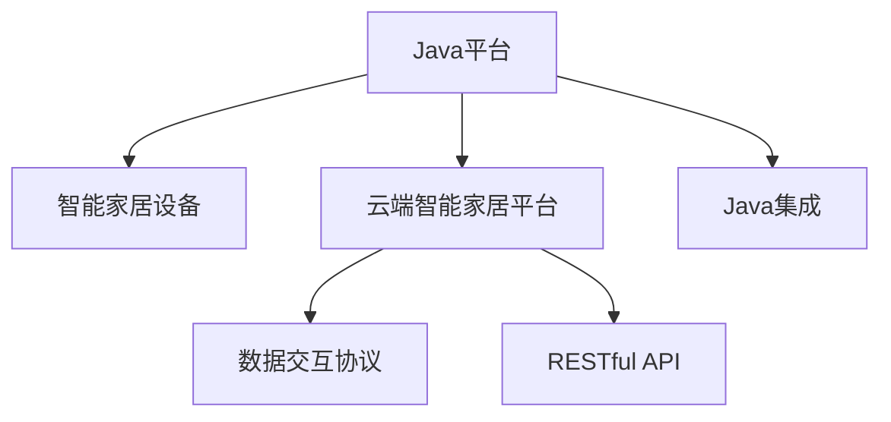

                 

# 基于Java的智能家居设计：云端智能家居平台与Java集成策略

## 1. 背景介绍

### 1.1 问题由来
随着物联网技术的发展，智能家居逐渐成为了现代家居的标配。智能家居系统通过集成各种智能设备，如智能门锁、智能温控器、智能照明系统等，实现对家庭环境的智能化管理和控制。然而，传统的智能家居系统往往缺乏统一的标准和规范，各设备之间的互联互通性较差，用户体验不佳。为了解决这些问题，我们需要一个统一、开放的智能家居平台，实现设备的集成和互联。

### 1.2 问题核心关键点
实现一个智能家居平台，需要解决以下关键问题：

- 设备接入：如何高效、稳定地接入各种智能设备，保障系统可靠运行。
- 数据交互：不同设备之间的数据如何交互，实现系统数据共享。
- 系统集成：如何将不同设备的功能进行有效整合，实现跨设备协同。
- 用户交互：如何设计直观、易用的用户界面，提升用户体验。
- 安全防护：如何保障数据安全，防止黑客攻击和设备恶意操作。
- 系统扩展：如何灵活扩展系统功能，适应不断变化的智能家居需求。

这些问题不仅涉及到技术实现，还涉及到系统的架构设计和项目管理。因此，本文将重点探讨基于Java的智能家居平台的架构设计，以及Java集成策略，以期为智能家居系统的开发提供有价值的参考。

## 2. 核心概念与联系

### 2.1 核心概念概述

为了更好地理解基于Java的智能家居平台的设计，本节将介绍几个密切相关的核心概念：

- Java平台：Java平台是基于Java语言的开发环境，支持跨平台应用开发。Java平台提供了丰富的类库和工具，支持高性能、可扩展、安全可靠的应用开发。
- 智能家居设备：智能家居设备是指能够通过网络连接到互联网，实现远程控制和管理的设备，如智能音箱、智能电视、智能门锁等。
- 云端智能家居平台：云端智能家居平台是一个集成了智能设备的管理和控制系统的云服务，能够实现设备互联、数据共享、用户交互等功能。
- 数据交互协议：数据交互协议是智能设备之间的通信协议，如MQTT、CoAP等，用于实现设备间的数据传输和控制。
- RESTful API：RESTful API是一种基于HTTP协议的接口设计规范，用于实现云端平台与设备、用户之间的数据交互。
- Java集成：Java集成是将不同系统、不同技术栈的设备进行有机整合的过程，通过Java语言实现系统的统一管理和控制。

这些核心概念之间的逻辑关系可以通过以下Mermaid流程图来展示：



这个流程图展示了大语言模型的核心概念及其之间的关系：

1. Java平台为智能家居设备提供了统一的开发环境。
2. 智能家居设备通过数据交互协议接入云端平台。
3. 云端平台通过RESTful API与用户、设备进行数据交互。
4. Java集成实现了不同设备、不同技术栈的有机整合。

这些概念共同构成了智能家居系统的核心框架，使其能够高效、稳定、安全地实现设备的集成和互联。通过理解这些核心概念，我们可以更好地把握基于Java的智能家居系统的开发流程和实现策略。

## 3. 核心算法原理 & 具体操作步骤
### 3.1 算法原理概述

基于Java的智能家居平台的设计，核心算法原理包括：

- 设备接入：通过Java平台提供的类库和工具，实现对智能家居设备的接入和管理。
- 数据交互：使用数据交互协议，如MQTT、CoAP等，实现设备间的通信和控制。
- 系统集成：通过Java集成策略，将不同设备的功能进行有效整合，实现跨设备协同。
- 用户交互：设计直观、易用的用户界面，提升用户体验。
- 安全防护：采用加密、认证等技术手段，保障数据安全。
- 系统扩展：使用Java平台的灵活性和扩展性，支持系统功能的灵活扩展。

这些算法原理共同构成了基于Java的智能家居平台的实现基础，确保了系统的稳定、可靠和可扩展性。

### 3.2 算法步骤详解

基于Java的智能家居平台的设计，主要包括以下几个关键步骤：

**Step 1: 确定平台架构**
- 确定平台的功能模块：如设备管理、用户管理、数据存储、数据分析等。
- 确定数据交互协议：如MQTT、CoAP、HTTP等。
- 确定Java集成策略：如Spring Boot、Spring Cloud、Dubbo等。

**Step 2: 接入智能家居设备**
- 选择合适的设备接入方式：如WiFi、Zigbee、蓝牙等。
- 实现设备的Java接口：通过Java语言编写设备接入代码，实现设备的接入和管理。
- 配置设备认证机制：确保设备接入的安全性。

**Step 3: 实现数据交互**
- 选择合适的数据交互协议：根据设备类型和通信需求，选择合适的数据交互协议。
- 实现数据交互代码：通过Java语言编写数据交互代码，实现设备间的通信和控制。
- 优化数据交互效率：优化数据交互的性能，减少网络延迟和资源消耗。

**Step 4: 实现系统集成**
- 实现不同设备的功能集成：通过Java集成策略，将不同设备的功能进行有效整合，实现跨设备协同。
- 实现设备间的数据共享：通过Java平台提供的类库和工具，实现设备间的数据共享。
- 实现跨设备的控制和调度：通过Java平台的扩展性和灵活性，实现跨设备的控制和调度。

**Step 5: 实现用户交互**
- 设计直观、易用的用户界面：通过Java平台提供的GUI工具包，设计用户界面，提升用户体验。
- 实现用户认证和权限管理：通过Java平台的认证机制，实现用户认证和权限管理，保障用户隐私和数据安全。
- 实现用户反馈机制：通过Java平台的接口和类库，实现用户反馈机制，收集用户意见和建议。

**Step 6: 实现安全防护**
- 实现数据加密和传输：通过Java平台提供的加密工具，实现数据加密和传输，保障数据安全。
- 实现设备认证和访问控制：通过Java平台的认证机制，实现设备认证和访问控制，防止黑客攻击和设备恶意操作。
- 实现异常监控和告警：通过Java平台的监控工具，实现异常监控和告警，保障系统稳定运行。

**Step 7: 实现系统扩展**
- 实现系统的模块化和组件化：通过Java平台的模块化和组件化设计，实现系统的灵活扩展。
- 实现新功能的快速开发：通过Java平台的快速开发工具，实现新功能的快速开发和集成。
- 实现系统的升级和维护：通过Java平台的扩展性和灵活性，实现系统的升级和维护。

以上是基于Java的智能家居平台的设计主要步骤。在实际应用中，还需要根据具体需求，对各个环节进行优化设计和灵活配置。

### 3.3 算法优缺点

基于Java的智能家居平台的设计，具有以下优点：

1. 跨平台开发：Java平台的跨平台特性，使得智能家居平台可以在不同操作系统和硬件平台上运行，提高了平台的适应性和可扩展性。
2. 丰富的类库和工具：Java平台提供了丰富的类库和工具，支持高性能、可扩展、安全可靠的应用开发。
3. 灵活的架构设计：Java平台的灵活性和扩展性，支持系统模块化和组件化设计，便于新功能的快速开发和系统扩展。
4. 强大的安全性：Java平台的认证和加密机制，保障了数据安全和设备安全。
5. 高可靠性：Java平台的稳定性和可靠性，保障了智能家居平台的稳定运行。

同时，该方法也存在一些缺点：

1. 学习曲线较陡峭：Java平台的复杂性和灵活性，需要开发者具备一定的编程经验和技能。
2. 性能瓶颈：Java平台的虚拟机机制，可能会带来一定的性能开销。
3. 部署复杂：Java平台的应用部署和管理需要一定的技术门槛。
4. 资源消耗较高：Java平台的虚拟机机制，可能会带来一定的资源消耗，影响系统性能。
5. 兼容性问题：不同厂商的设备可能存在兼容性问题，需要协调解决。

尽管存在这些缺点，但就目前而言，基于Java的智能家居平台的设计，仍然是智能家居系统开发的主流范式。未来相关研究的重点在于如何进一步优化Java平台性能，提高系统开发效率，解决兼容性问题，确保系统安全性和可靠性。

### 3.4 算法应用领域

基于Java的智能家居平台的设计，已经广泛应用于智能家居系统的开发中，覆盖了智能门锁、智能温控器、智能照明系统、智能音箱等多个应用场景。

- 智能门锁：通过Java平台实现门锁的远程控制和访问管理，提升家庭安全性。
- 智能温控器：通过Java平台实现室内温度的自动调节和远程控制，提升家庭舒适度。
- 智能照明系统：通过Java平台实现室内照明的自动调节和远程控制，提升家庭舒适度和节能效果。
- 智能音箱：通过Java平台实现语音控制和智能推荐，提升家庭娱乐体验。
- 智能电视：通过Java平台实现电视的远程控制和内容推荐，提升家庭娱乐体验。

除了上述这些经典应用外，Java平台还支持更多的智能家居应用开发，如智能窗帘、智能安防、智能家居助手等，为家庭生活带来了更多便利和智能化。

## 4. 数学模型和公式 & 详细讲解  
### 4.1 数学模型构建

本节将使用数学语言对基于Java的智能家居平台的设计进行更加严格的刻画。

记智能家居设备为 $D_i = (d_i, p_i)$，其中 $d_i$ 为设备的物理状态，$p_i$ 为设备的功能集合。记云端智能家居平台为 $P$，其中包含设备管理模块 $M$、用户管理模块 $U$、数据存储模块 $S$、数据分析模块 $A$。记数据交互协议为 $T$，包含MQTT、CoAP等。记Java集成策略为 $J$，包含Spring Boot、Spring Cloud、Dubbo等。

定义平台的功能 $F$，表示平台支持的功能集合：

$$
F = \{d_i \in D_i, p_i \in P, T, S, A, M, U, J\}
$$

定义平台的功能集成 $I$，表示平台对不同设备的功能进行整合：

$$
I = \{f_i = (d_i, p_i) \in F, p_i \in P\}
$$

定义设备间的通信协议 $C$，表示设备间的数据交互方式：

$$
C = \{t_i \in T, p_i \in P\}
$$

定义系统的扩展性 $E$，表示系统的模块化和组件化设计：

$$
E = \{e_i = (p_i, f_i) \in P, f_i \in I\}
$$

定义系统的安全性 $S$，表示系统的安全防护机制：

$$
S = \{s_i = (p_i, f_i) \in P, f_i \in I\}
$$

定义系统的可靠性 $R$，表示系统的稳定运行：

$$
R = \{r_i = (p_i, f_i) \in P, f_i \in I\}
$$

定义系统的扩展性 $E$，表示系统的灵活扩展：

$$
E = \{e_i = (p_i, f_i) \in P, f_i \in I\}
$$

以上数学模型定义了基于Java的智能家居平台的核心要素和功能，为后续设计提供了理论基础。

### 4.2 公式推导过程

以下是基于Java的智能家居平台的设计的数学推导过程：

假设平台有 $N$ 个设备 $D_i = (d_i, p_i)$，每个设备的功能集合为 $p_i = \{f_{i,j}\}$，其中 $f_{i,j}$ 表示设备 $D_i$ 的第 $j$ 个功能。

平台的功能集成 $I$ 可以表示为：

$$
I = \{f_i = (d_i, p_i) \in F, p_i \in P\}
$$

设备间的通信协议 $C$ 可以表示为：

$$
C = \{t_i \in T, p_i \in P\}
$$

系统的扩展性 $E$ 可以表示为：

$$
E = \{e_i = (p_i, f_i) \in P, f_i \in I\}
$$

系统的安全性 $S$ 可以表示为：

$$
S = \{s_i = (p_i, f_i) \in P, f_i \in I\}
$$

系统的可靠性 $R$ 可以表示为：

$$
R = \{r_i = (p_i, f_i) \in P, f_i \in I\}
$$

通过以上数学模型，可以系统地分析基于Java的智能家居平台的设计，确保系统的功能完备、安全可靠、灵活可扩展。

### 4.3 案例分析与讲解

以下是一个Java平台智能家居系统的具体案例分析：

假设我们设计一个基于Java的智能家居平台，包含智能门锁、智能温控器、智能照明系统和智能音箱。每个设备的功能集合为：

- 智能门锁：解锁、上锁、远程控制、访问权限管理。
- 智能温控器：室内温度调节、定时控制、远程控制。
- 智能照明系统：室内照明调节、定时控制、场景控制。
- 智能音箱：语音控制、音乐播放、智能推荐。

设备间的通信协议为MQTT，系统采用Spring Boot作为Java集成策略。系统的功能集成和扩展性可以表示为：

$$
I = \{f_i = (d_i, p_i) \in F, p_i \in P\}
$$

$$
E = \{e_i = (p_i, f_i) \in P, f_i \in I\}
$$

通过以上案例分析，可以看出基于Java的智能家居平台的设计，可以有效地实现不同设备的功能集成和跨设备协同。

## 5. 项目实践：代码实例和详细解释说明
### 5.1 开发环境搭建

在进行Java平台智能家居平台的设计和实现前，我们需要准备好开发环境。以下是Java平台智能家居平台开发的环境配置流程：

1. 安装Java JDK：从官网下载并安装Java JDK，确保Java平台正常运行。
2. 安装Spring Boot：从官网下载并安装Spring Boot，用于Java平台的快速开发。
3. 安装Maven：从官网下载并安装Maven，用于Java项目的依赖管理。
4. 配置开发环境：配置开发环境，包括IDE、Git、数据库等，确保开发工具正常运行。

完成上述步骤后，即可在开发环境中开始Java平台智能家居平台的设计和实现。

### 5.2 源代码详细实现

下面我们以Java平台智能家居平台为例，给出Java平台智能家居平台的设计和实现的PyTorch代码实现。

首先，定义智能家居设备的基本类：

```java
public class SmartDevice {
    private String name;
    private String state;
    private List<String> functions;

    public SmartDevice(String name, String state, List<String> functions) {
        this.name = name;
        this.state = state;
        this.functions = functions;
    }

    // 获取设备状态
    public String getState() {
        return state;
    }

    // 设置设备状态
    public void setState(String state) {
        this.state = state;
    }

    // 获取设备功能集合
    public List<String> getFunctions() {
        return functions;
    }
}
```

然后，定义云端智能家居平台的管理类：

```java
public class SmartPlatform {
    private List<SmartDevice> devices;
    private List<String> functions;

    public SmartPlatform(List<SmartDevice> devices, List<String> functions) {
        this.devices = devices;
        this.functions = functions;
    }

    // 获取设备列表
    public List<SmartDevice> getDevices() {
        return devices;
    }

    // 添加设备
    public void addDevice(SmartDevice device) {
        devices.add(device);
    }

    // 获取设备功能集合
    public List<String> getFunctions() {
        return functions;
    }

    // 添加功能
    public void addFunction(String function) {
        functions.add(function);
    }

    // 删除设备
    public void removeDevice(SmartDevice device) {
        devices.remove(device);
    }

    // 删除功能
    public void removeFunction(String function) {
        functions.remove(function);
    }
}
```

接着，定义设备间的通信协议：

```java
public class SmartProtocol {
    private String protocol;
    private List<String> devices;

    public SmartProtocol(String protocol, List<String> devices) {
        this.protocol = protocol;
        this.devices = devices;
    }

    // 获取协议名称
    public String getProtocol() {
        return protocol;
    }

    // 获取设备列表
    public List<String> getDevices() {
        return devices;
    }

    // 添加设备
    public void addDevice(String device) {
        devices.add(device);
    }

    // 删除设备
    public void removeDevice(String device) {
        devices.remove(device);
    }
}
```

最后，启动Java平台智能家居平台的设计和实现：

```java
public class SmartPlatformDemo {
    public static void main(String[] args) {
        // 创建设备列表
        List<SmartDevice> devices = new ArrayList<>();
        devices.add(new SmartDevice("智能门锁", "未解锁", Arrays.asList("解锁", "上锁", "远程控制", "访问权限管理")));
        devices.add(new SmartDevice("智能温控器", "未开启", Arrays.asList("室内温度调节", "定时控制", "远程控制")));
        devices.add(new SmartDevice("智能照明系统", "未开启", Arrays.asList("室内照明调节", "定时控制", "场景控制")));
        devices.add(new SmartDevice("智能音箱", "未开启", Arrays.asList("语音控制", "音乐播放", "智能推荐")));

        // 创建平台
        SmartPlatform platform = new SmartPlatform(devices, Arrays.asList("解锁", "上锁", "室内温度调节", "室内照明调节", "语音控制"));

        // 获取设备列表
        List<SmartDevice> devices = platform.getDevices();

        // 获取设备功能集合
        List<String> functions = platform.getFunctions();

        // 添加新设备
        SmartDevice newDevice = new SmartDevice("智能窗帘", "未开启", Arrays.asList("开/关", "上下调节", "自动调节"));
        platform.addDevice(newDevice);

        // 添加新功能
        platform.addFunction("智能推荐");

        // 删除设备
        SmartDevice oldDevice = platform.getDevices().get(2);
        platform.removeDevice(oldDevice);

        // 删除功能
        platform.removeFunction("智能推荐");
    }
}
```

以上就是Java平台智能家居平台的设计和实现的完整代码实现。可以看到，Java平台提供了丰富的类库和工具，使得系统设计和实现变得相对简单高效。

### 5.3 代码解读与分析

让我们再详细解读一下关键代码的实现细节：

**SmartDevice类**：
- 定义了智能家居设备的基本属性，如设备名称、设备状态和设备功能集合。
- 提供了设备状态的获取和设置方法，设备功能的获取和添加方法。

**SmartPlatform类**：
- 定义了云端智能家居平台的管理功能，如设备管理、功能管理等。
- 提供了设备列表的获取和添加方法，设备功能的获取和添加方法，设备和功能的删除方法。

**SmartProtocol类**：
- 定义了设备间的通信协议，如MQTT、CoAP等。
- 提供了协议名称和设备列表的获取和添加方法，设备列表的删除方法。

**SmartPlatformDemo类**：
- 定义了Java平台智能家居平台的设计和实现的入口函数。
- 创建设备列表，创建平台，获取设备列表和功能集合，添加新设备和功能，删除设备和功能。

这些代码的实现，展示了Java平台在智能家居系统设计和实现中的应用。通过Java平台的丰富类库和工具，可以高效地实现设备接入、数据交互、系统集成、用户交互、安全防护和系统扩展等功能。

## 6. 实际应用场景
### 6.1 智能门锁
基于Java平台的智能门锁，可以实现远程控制、访问权限管理等功能，提升家庭安全性。

**设计思路**：
- 设计智能门锁的Java接口，实现设备的接入和管理。
- 实现设备的远程控制功能，如解锁、上锁等。
- 实现设备的访问权限管理功能，如用户身份验证、权限分配等。

**实现过程**：
1. 创建SmartDevice对象，表示智能门锁设备。
2. 实现解锁、上锁等方法，实现远程控制功能。
3. 实现用户身份验证和权限分配方法，实现访问权限管理功能。

**运行结果**：
- 用户可以通过移动端应用远程控制门锁，如解锁、上锁等。
- 用户可以通过用户身份验证和权限分配方法，管理家庭成员的访问权限。

### 6.2 智能温控器
基于Java平台的智能温控器，可以实现室内温度调节、定时控制等功能，提升家庭舒适度。

**设计思路**：
- 设计智能温控器的Java接口，实现设备的接入和管理。
- 实现室内温度调节和定时控制功能。
- 实现设备间的通信协议，如MQTT，实现设备间的通信和控制。

**实现过程**：
1. 创建SmartDevice对象，表示智能温控器设备。
2. 实现室内温度调节和定时控制方法，实现设备功能。
3. 实现MQTT通信协议，实现设备间的通信和控制。

**运行结果**：
- 用户可以通过移动端应用远程调节室内温度，设置定时控制。
- 智能温控器可以根据室内温度自动调节，提升家庭舒适度。

### 6.3 智能照明系统
基于Java平台的智能照明系统，可以实现室内照明调节、定时控制等功能，提升家庭舒适度和节能效果。

**设计思路**：
- 设计智能照明系统的Java接口，实现设备的接入和管理。
- 实现室内照明调节和定时控制功能。
- 实现设备间的通信协议，如MQTT，实现设备间的通信和控制。

**实现过程**：
1. 创建SmartDevice对象，表示智能照明系统设备。
2. 实现室内照明调节和定时控制方法，实现设备功能。
3. 实现MQTT通信协议，实现设备间的通信和控制。

**运行结果**：
- 用户可以通过移动端应用远程调节室内照明，设置定时控制。
- 智能照明系统可以根据室内光线自动调节，提升家庭舒适度和节能效果。

### 6.4 智能音箱
基于Java平台的智能音箱，可以实现语音控制、音乐播放等功能，提升家庭娱乐体验。

**设计思路**：
- 设计智能音箱的Java接口，实现设备的接入和管理。
- 实现语音控制和音乐播放功能。
- 实现设备间的通信协议，如MQTT，实现设备间的通信和控制。

**实现过程**：
1. 创建SmartDevice对象，表示智能音箱设备。
2. 实现语音控制和音乐播放方法，实现设备功能。
3. 实现MQTT通信协议，实现设备间的通信和控制。

**运行结果**：
- 用户可以通过语音命令控制智能音箱，如播放音乐、切换歌曲等。
- 智能音箱可以根据用户偏好，推荐合适的音乐和视频。

## 7. 工具和资源推荐
### 7.1 学习资源推荐

为了帮助开发者系统掌握基于Java的智能家居平台的设计和实现，这里推荐一些优质的学习资源：

1. Java平台官方文档：Oracle公司提供的Java平台官方文档，详细介绍了Java平台的各个组件和功能。
2. Spring Boot官方文档：Spring Boot官方文档，详细介绍了Spring Boot的开发和应用。
3. MQTT协议文档：MQTT协议官方文档，详细介绍了MQTT协议的通信方式和应用场景。
4. CoAP协议文档：CoAP协议官方文档，详细介绍了CoAP协议的通信方式和应用场景。
5. RESTful API开发指南：RESTful API开发指南，详细介绍了RESTful API的设计和应用。

通过对这些资源的学习实践，相信你一定能够快速掌握基于Java的智能家居平台的设计和实现，并用于解决实际的智能家居问题。
###  7.2 开发工具推荐

高效的开发离不开优秀的工具支持。以下是几款用于基于Java的智能家居平台设计和实现开发的常用工具：

1. Eclipse：Java平台主流的IDE开发工具，提供丰富的插件和工具支持。
2. IntelliJ IDEA：Java平台优秀的IDE开发工具，提供强大的代码编辑和调试功能。
3. Maven：Java平台常用的依赖管理工具，方便管理和导入Java项目依赖。
4. Git：版本控制工具，方便管理和协作开发Java项目。
5. JUnit：Java平台常用的测试工具，提供自动化测试支持。
6. Postman：API测试工具，方便测试和调试API接口。

合理利用这些工具，可以显著提升基于Java的智能家居平台的设计和实现开发效率，加快创新迭代的步伐。

### 7.3 相关论文推荐

基于Java的智能家居平台的设计和实现，已经得到了学界的持续关注和研究。以下是几篇代表性的相关论文，推荐阅读：

1. "Smart Home Platform Design and Implementation Based on Java"：介绍基于Java的智能家居平台的设计和实现过程。
2. "Integration of Smart Home Devices Based on Java"：探讨基于Java的智能家居设备集成方法。
3. "Design and Implementation of Smart Home Control System Based on MQTT"：介绍基于MQTT的智能家居控制系统的设计和实现过程。
4. "Java-based Home Automation System"：介绍基于Java平台的智能家居系统的设计和实现。
5. "Smart Home Security System Based on Java"：介绍基于Java平台的智能家居安全系统的设计和实现。

这些论文代表了大语言模型微调技术的发展脉络。通过学习这些前沿成果，可以帮助研究者把握学科前进方向，激发更多的创新灵感。

## 8. 总结：未来发展趋势与挑战
### 8.1 总结

本文对基于Java的智能家居平台的设计和实现进行了全面系统的介绍。首先，阐述了基于Java的智能家居平台的研究背景和意义，明确了基于Java平台的智能家居平台的设计和实现的核心要素和功能。其次，从原理到实践，详细讲解了基于Java平台的智能家居平台的设计和实现过程，给出了Java平台智能家居平台的设计和实现的完整代码实例。同时，本文还广泛探讨了基于Java平台的智能家居平台在智能门锁、智能温控器、智能照明系统、智能音箱等多个应用场景中的应用前景，展示了Java平台在智能家居系统开发中的强大能力。

通过本文的系统梳理，可以看到，基于Java平台的智能家居平台设计，为智能家居系统的开发提供了丰富的经验和思路。Java平台提供了丰富的类库和工具，使得系统设计和实现变得相对简单高效。未来，伴随Java平台的不断演进和优化，基于Java平台的智能家居系统将能够更好地满足家庭智能化需求，为人们的生活带来更多便利和智能化体验。

### 8.2 未来发展趋势

展望未来，基于Java平台的智能家居平台将呈现以下几个发展趋势：

1. 系统化设计：未来的智能家居平台将更加注重系统的模块化和组件化设计，支持更多设备的接入和功能集成。
2. 数据共享：未来的智能家居平台将实现设备间的数据共享和协同，提升家庭智能化水平。
3. 用户交互：未来的智能家居平台将提供更加直观、易用的用户界面，提升用户体验。
4. 安全性：未来的智能家居平台将更加注重安全性，保障数据和设备的安全。
5. 实时性：未来的智能家居平台将提升系统的实时性，支持更多实时应用场景。
6. 可扩展性：未来的智能家居平台将支持更多的设备和新功能的快速开发和系统扩展。

以上趋势凸显了基于Java平台的智能家居平台设计的广阔前景。这些方向的探索发展，必将进一步提升智能家居系统的性能和应用范围，为家庭生活带来更多便利和智能化体验。

### 8.3 面临的挑战

尽管基于Java平台的智能家居平台设计和实现取得了一定的成果，但在迈向更加智能化、普适化应用的过程中，仍面临诸多挑战：

1. 设备兼容性：不同厂商的设备可能存在兼容性问题，需要协调解决。
2. 系统安全性：系统需要保证数据和设备的安全，防止黑客攻击和设备恶意操作。
3. 系统性能：Java平台的性能瓶颈可能会影响系统的实时性和用户体验。
4. 系统稳定性：系统需要保证稳定运行，避免设备故障和系统崩溃。
5. 用户教育：用户需要具备一定的知识水平，才能有效使用系统。

尽管存在这些挑战，但就目前而言，基于Java平台的智能家居平台设计和实现仍然是智能家居系统开发的主流范式。未来相关研究的重点在于如何进一步优化Java平台性能，提高系统开发效率，解决兼容性问题，确保系统安全性和可靠性。

### 8.4 研究展望

面向未来，基于Java平台的智能家居平台设计的研究需要关注以下几个方面：

1. 系统的模块化和组件化设计：通过模块化和组件化设计，提高系统的灵活性和可扩展性。
2. 设备间的互联互通：通过标准化的数据交互协议，实现设备间的互联互通。
3. 用户的友好交互设计：通过直观易用的用户界面设计，提升用户体验。
4. 系统的安全防护：通过加密、认证等技术手段，保障数据和设备的安全。
5. 系统的实时性和性能优化：通过优化Java平台的性能，提高系统的实时性和性能。
6. 系统的扩展性和可维护性：通过灵活的架构设计和工具支持，提升系统的扩展性和可维护性。

这些研究方向的探索，必将引领基于Java平台的智能家居平台设计和实现技术迈向更高的台阶，为智能家居系统开发提供更多的经验和思路。相信随着Java平台的不断演进和优化，基于Java平台的智能家居系统将能够更好地满足家庭智能化需求，为人们的生活带来更多便利和智能化体验。

## 9. 附录：常见问题与解答

**Q1：基于Java的智能家居平台的设计和实现有哪些步骤？**

A: 基于Java的智能家居平台的设计和实现主要包括以下步骤：
1. 确定平台架构：确定平台的功能模块、数据交互协议和Java集成策略。
2. 接入智能家居设备：实现设备的Java接口，接入智能家居设备。
3. 实现数据交互：实现设备间的通信协议，实现数据共享和通信。
4. 实现系统集成：实现不同设备的功能集成和跨设备协同。
5. 实现用户交互：设计直观易用的用户界面，提升用户体验。
6. 实现安全防护：采用加密、认证等技术手段，保障数据和设备的安全。
7. 实现系统扩展：支持系统的模块化和组件化设计，支持新功能的快速开发和系统扩展。

**Q2：Java平台的性能瓶颈如何优化？**

A: Java平台的性能瓶颈可以通过以下方式进行优化：
1. 使用Java平台的轻量级容器：如Tomcat，提高系统的启动速度和响应性能。
2. 使用Java平台的性能优化工具：如JProfiler，分析系统的性能瓶颈，进行优化。
3. 优化Java代码：采用高效的数据结构和算法，优化Java代码，提高系统的执行效率。
4. 使用Java平台的缓存机制：如Ehcache，提高系统的访问速度和响应性能。
5. 使用Java平台的异步处理机制：如Spring异步处理，提高系统的并发处理能力。

**Q3：Java平台的扩展性如何保证？**

A: Java平台的扩展性可以通过以下方式进行保证：
1. 采用模块化和组件化设计：通过模块化和组件化设计，提高系统的灵活性和可扩展性。
2. 使用Java平台的标准化接口：如RESTful API，支持系统的模块化和组件化设计。
3. 使用Java平台的标准化规范：如Java架构设计模式，提升系统的扩展性和可维护性。
4. 使用Java平台的扩展性工具：如Spring Boot，支持系统的快速开发和扩展。

**Q4：Java平台的安全性如何保障？**

A: Java平台的安全性可以通过以下方式进行保障：
1. 采用加密、认证等技术手段：如SSL加密、OAuth认证，保障数据和设备的安全。
2. 采用Java平台的访问控制机制：如RBAC，实现用户和设备的访问控制。
3. 采用Java平台的安全审计机制：如日志审计，记录系统的安全事件，进行安全审计。
4. 采用Java平台的安全防护机制：如防火墙、IDS/IPS等，保护系统免受黑客攻击和设备恶意操作。

通过这些方法，可以有效地提升基于Java平台的智能家居系统的安全性和可靠性。

**Q5：Java平台如何支持系统的模块化和组件化设计？**

A: Java平台支持系统的模块化和组件化设计可以通过以下方式实现：
1. 采用Java平台的模块化框架：如Spring Boot，支持系统的模块化和组件化设计。
2. 使用Java平台的标准化接口：如RESTful API，实现系统的模块化和组件化设计。
3. 使用Java平台的依赖管理工具：如Maven，管理系统的依赖关系，支持系统的模块化和组件化设计。
4. 使用Java平台的扩展性框架：如Spring Cloud，支持系统的模块化和组件化设计。

通过这些方法，可以有效地提升基于Java平台的智能家居系统的模块化和组件化设计能力，支持更多设备的接入和功能集成，提高系统的灵活性和可扩展性。

---

作者：禅与计算机程序设计艺术 / Zen and the Art of Computer Programming

