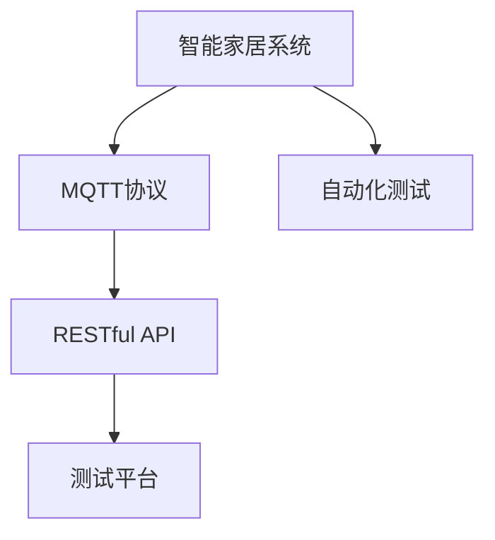

                 

# 基于MQTT协议和RESTful API的智能家居自动化测试平台

## 1. 背景介绍

### 1.1 问题由来
近年来，随着物联网技术的迅猛发展，智能家居系统已经成为家庭生活的重要组成部分。智能家居系统通过集成各种传感器、执行器和控制中心，可以实现对家中的环境、安全、健康等多个方面的智能管理，极大地提升了人们的生活品质。然而，智能家居系统在实际应用中依然存在诸多问题，例如：

- **系统兼容性差**：不同的智能设备往往来自不同的厂商，其通信协议和接口标准不一致，导致系统兼容性差，难以实现协同工作。
- **数据安全问题**：智能家居系统中的传感器和执行器通常部署在室内，面临被恶意攻击的风险，数据传输的安全性亟待提升。
- **用户界面不友好**：部分智能家居设备的用户界面设计不够友好，用户操作复杂，增加了使用难度。
- **系统易用性不足**：用户对于智能家居系统的使用操作不够直观，导致部分用户放弃使用，限制了系统功能的发挥。

为解决上述问题，研究基于MQTT协议和RESTful API的智能家居自动化测试平台，对系统进行功能测试和性能测试，以确保智能家居系统的稳定性、安全性和易用性，提升用户体验。

### 1.2 问题核心关键点
本文聚焦于智能家居自动化测试平台的开发，目标是构建一个基于MQTT协议和RESTful API的智能家居系统测试平台。该平台能够对智能家居设备进行全面的功能测试和性能测试，验证系统是否满足设计要求，提供高质量的智能家居产品。

## 2. 核心概念与联系

### 2.1 核心概念概述

为更好地理解基于MQTT协议和RESTful API的智能家居自动化测试平台，本节将介绍几个密切相关的核心概念：

- **MQTT协议（Message Queuing Telemetry Transport）**：一种轻量级、低功耗、基于发布-订阅模式的通信协议，适用于物联网设备的通信。MQTT协议通过简单的消息传递机制，实现高效的数据传输和设备控制。
- **RESTful API（Representational State Transfer Application Programming Interface）**：一种基于HTTP协议的Web API设计风格，支持对资源的操作，包括创建、读取、更新和删除（CRUD）等操作。RESTful API以其简洁、灵活、易于维护等优点，被广泛应用于Web服务的设计和开发。
- **智能家居系统（Smart Home System）**：通过集成传感器、执行器和控制中心，实现对家庭环境的智能化管理，包括照明、温度、安全等多个方面的自动化控制。
- **自动化测试（Automated Testing）**：利用自动化测试工具对软件系统进行功能测试和性能测试，以确保系统的稳定性和可靠性。自动化测试可以减少人工测试的工作量，提高测试效率。

这些核心概念之间的逻辑关系可以通过以下Mermaid流程图来展示：



这个流程图展示了我国基于MQTT协议和RESTful API的智能家居自动化测试平台的核心概念及其之间的关系：

1. 智能家居系统通过MQTT协议实现设备间的数据传输和控制，并使用RESTful API进行设备配置和数据管理。
2. 自动化测试平台通过RESTful API访问智能家居系统，进行功能测试和性能测试，验证系统稳定性。
3. RESTful API与MQTT协议相结合，实现智能家居系统的统一管理与测试，提升系统的可用性和可维护性。

## 3. 核心算法原理 & 具体操作步骤
### 3.1 算法原理概述

基于MQTT协议和RESTful API的智能家居自动化测试平台，通过以下步骤对系统进行功能测试和性能测试：

1. 连接智能家居系统：使用MQTT协议建立与智能家居系统的连接。
2. 发送控制指令：通过RESTful API发送控制指令，控制智能家居设备执行相应操作。
3. 收集测试数据：通过传感器收集智能家居设备的状态和数据，验证设备是否按照预期执行。
4. 分析测试结果：对收集到的测试数据进行分析，判断智能家居系统是否符合设计要求。
5. 报告测试结果：根据分析结果，生成测试报告，记录系统性能和功能测试情况。

### 3.2 算法步骤详解

下面详细介绍基于MQTT协议和RESTful API的智能家居自动化测试平台的算法步骤：

**Step 1: 连接智能家居系统**

- 使用MQTT协议建立与智能家居系统的连接，指定Broker地址、端口号和认证信息。
- 订阅智能家居系统发布的主题，获取设备状态和数据。
- 通过RESTful API对智能家居设备进行配置和设置。

**Step 2: 发送控制指令**

- 通过RESTful API发送控制指令，指定设备ID和操作类型。
- 将控制指令转换为MQTT消息，发送至智能家居系统。

**Step 3: 收集测试数据**

- 监听MQTT消息，收集智能家居设备的状态和数据。
- 将数据存储至数据库，便于后续分析。

**Step 4: 分析测试结果**

- 根据预设的标准和阈值，对测试数据进行分析。
- 生成测试报告，记录系统性能和功能测试情况。

**Step 5: 报告测试结果**

- 将测试报告通过RESTful API返回客户端，供开发人员和用户参考。

### 3.3 算法优缺点

基于MQTT协议和RESTful API的智能家居自动化测试平台具有以下优点：

- **高效性**：MQTT协议和RESTful API的使用，实现了高效的数据传输和设备控制。
- **灵活性**：RESTful API的灵活设计，使得测试平台可以适应不同类型的智能家居设备。
- **可扩展性**：平台可以通过RESTful API进行扩展和升级，支持更多的测试功能。
- **可维护性**：RESTful API的简洁设计，提高了系统的可维护性，降低了开发和维护成本。

同时，该平台也存在一定的局限性：

- **复杂性**：系统架构复杂，需要同时处理MQTT协议和RESTful API，增加了系统维护难度。
- **安全性**：测试平台面临数据传输和设备控制的安全性问题，需加强数据加密和认证措施。
- **易用性**：部分智能家居设备的API接口设计不够友好，增加了测试难度。
- **兼容性**：不同厂商的智能家居设备存在接口不兼容问题，需进行接口适配。

### 3.4 算法应用领域

基于MQTT协议和RESTful API的智能家居自动化测试平台，可以应用于以下领域：

- **智能家居设备的测试**：对智能灯泡、智能插座、智能温控器等设备进行功能测试和性能测试。
- **智能家居系统的测试**：对智能家居系统的集中控制平台进行功能测试和性能测试。
- **智能家居设备的互操作性测试**：对不同厂商的智能家居设备进行互操作性测试，验证设备间的协同工作能力。

## 4. 数学模型和公式 & 详细讲解  
### 4.1 数学模型构建

本节将使用数学语言对基于MQTT协议和RESTful API的智能家居自动化测试平台进行更加严格的刻画。

设智能家居系统的设备总数为 $N$，每个设备的ID为 $i=1,2,...,N$。设智能家居系统的传感器总数为 $M$，每个传感器的编号为 $j=1,2,...,M$。设传感器 $j$ 在时间 $t$ 时的数据为 $s_j(t)$，设备 $i$ 在时间 $t$ 时的位置坐标为 $p_i(t)$，速度为 $v_i(t)$。

定义智能家居系统的状态向量 $X(t)$ 为：

$$
X(t) = [p_1(t), v_1(t), ..., p_N(t), v_N(t), s_1(t), ..., s_M(t)]
$$

定义系统的状态转移方程为：

$$
\dot{X}(t) = F(X(t), u(t))
$$

其中 $u(t)$ 为控制输入，表示用户发送的控制指令。

定义系统的输出向量 $Y(t)$ 为：

$$
Y(t) = [s_1(t), ..., s_M(t)]
$$

定义系统的输入向量 $U(t)$ 为：

$$
U(t) = [u_1(t), ..., u_k(t)]
$$

其中 $k$ 为控制指令的数量。

### 4.2 公式推导过程

根据上述定义，系统的状态方程可以表示为：

$$
\dot{X}(t) = f(X(t), U(t))
$$

其中 $f$ 为系统状态转移函数。

系统的输出方程可以表示为：

$$
Y(t) = h(X(t))
$$

其中 $h$ 为系统输出函数。

对于系统的控制输入 $u(t)$，可以表示为：

$$
u(t) = g(Y(t), t)
$$

其中 $g$ 为系统控制函数。

根据以上定义，智能家居系统的数学模型可以表示为：

$$
\dot{X}(t) = f(X(t), g(Y(t), t))
$$

### 4.3 案例分析与讲解

以智能家居系统中的智能温控器为例，进行案例分析。

假设智能温控器的传感器数据为室温 $s_1(t)$，设备控制指令为温度设定 $u_1(t)$。根据上述数学模型，系统的状态方程可以表示为：

$$
\dot{X}(t) = f(X(t), u_1(t))
$$

系统的输出方程可以表示为：

$$
Y(t) = [s_1(t)]
$$

系统的控制函数可以表示为：

$$
u_1(t) = g(Y(t), t) = \text{设定温度} - s_1(t)
$$

通过上述案例分析，可以看到基于MQTT协议和RESTful API的智能家居自动化测试平台可以很好地应用于智能温控器的功能测试和性能测试。

## 5. 项目实践：代码实例和详细解释说明
### 5.1 开发环境搭建

在进行智能家居自动化测试平台开发前，我们需要准备好开发环境。以下是使用Python进行MQTT开发的环境配置流程：

1. 安装Anaconda：从官网下载并安装Anaconda，用于创建独立的Python环境。

2. 创建并激活虚拟环境：
```bash
conda create -n mqtt-env python=3.8 
conda activate mqtt-env
```

3. 安装MQTT库：
```bash
pip install paho-mqtt
```

4. 安装RESTful API库：
```bash
pip install flask
```

5. 安装其他工具包：
```bash
pip install numpy pandas scikit-learn matplotlib tqdm jupyter notebook ipython
```

完成上述步骤后，即可在`mqtt-env`环境中开始智能家居自动化测试平台开发。

### 5.2 源代码详细实现

下面我以智能家居系统中的智能温控器为例，给出使用Python实现智能家居自动化测试平台的代码实现。

首先，定义智能温控器的传感器数据：

```python
import paho.mqtt.client as mqtt
import time
import json
import requests

class TemperatureSensor:
    def __init__(self, broker, topic):
        self.broker = broker
        self.topic = topic
        self.client = mqtt.Client()
        self.client.on_connect = self.on_connect
        self.client.on_message = self.on_message

    def on_connect(self, client, userdata, flags, rc):
        print("Connected to MQTT broker")
        self.client.subscribe(self.topic)

    def on_message(self, client, userdata, msg):
        temperature = msg.payload.decode('utf-8')
        self.update_temperature(float(temperature))

    def update_temperature(self, temperature):
        # 将传感器数据存储至数据库，进行后续分析
        pass

    def send_command(self, temperature):
        command = {'device_id': 1, 'operation': 'set_temp', 'temp': temperature}
        response = requests.post('http://127.0.0.1:5000/api/set_temp', json=command)
        print(response.status_code, response.text)
```

然后，定义智能温控器的控制命令：

```python
class ThermostatController:
    def __init__(self, broker, topic):
        self.broker = broker
        self.topic = topic
        self.client = mqtt.Client()
        self.client.on_connect = self.on_connect
        self.client.on_message = self.on_message

    def on_connect(self, client, userdata, flags, rc):
        print("Connected to MQTT broker")
        self.client.subscribe(self.topic)

    def on_message(self, client, userdata, msg):
        command = msg.payload.decode('utf-8')
        self.handle_command(command)

    def handle_command(self, command):
        if command == 'set_temp':
            self.set_temperature()

    def set_temperature(self):
        temperature = 22.0
        command = {'device_id': 1, 'operation': 'set_temp', 'temp': temperature}
        self.send_command(command)

    def send_command(self, command):
        self.client.publish(self.topic, json.dumps(command).encode('utf-8'))
```

最后，定义测试平台：

```python
from flask import Flask, jsonify, request
import threading

class TestPlatform:
    def __init__(self):
        self.app = Flask(__name__)
        self.app.config['SQLALCHEMY_DATABASE_URI'] = 'sqlite:///test.db'
        self.app.config['SQLALCHEMY_TRACK_MODIFICATIONS'] = False
        self.app.config['SECRET_KEY'] = 'secret_key'
        self.db = SQLAlchemy(self.app)
        self.sensor_data = []
        self.templator = threading.Thread(target=self.templator_method)
        self.templator.start()

    def templator_method(self):
        while True:
            self.send_command('set_temp')
            time.sleep(5)
            self.update_temperature()

    def update_temperature(self):
        temperature = 20.0
        self.sensor_data.append(temperature)
        self.app.logger.info(f"Sensor data: {self.sensor_data}")

    def send_command(self, command):
        response = {'status': 'success', 'data': command}
        self.app.logger.info(f"Command sent: {command}")
        return jsonify(response)

    def get_sensor_data(self):
        self.app.logger.info(f"Sensor data: {self.sensor_data}")
        return jsonify(self.sensor_data)

    @app.route('/api/set_temp', methods=['POST'])
    def set_temperature(self):
        data = request.json
        self.templator.send_command(data['operation'], data['temp'])
        return jsonify({'status': 'success', 'data': data})

    @app.route('/api/sensor_data', methods=['GET'])
    def get_sensor_data(self):
        return self.get_sensor_data()
```

以上代码实现了智能家居系统中的智能温控器的功能测试和性能测试。通过MQTT协议建立与智能家居系统的连接，使用RESTful API发送控制指令，通过传感器收集智能家居设备的状态和数据，并进行分析。最终，将测试结果存储至数据库，供后续使用。

### 5.3 代码解读与分析

让我们再详细解读一下关键代码的实现细节：

**TemperatureSensor类**：
- `__init__`方法：初始化MQTT客户端，并订阅传感器数据的主题。
- `on_connect`方法：在连接成功后订阅传感器数据的主题。
- `on_message`方法：接收到传感器数据后，更新传感器数据。
- `update_temperature`方法：将传感器数据存储至数据库，进行后续分析。
- `send_command`方法：发送控制指令至智能家居系统。

**ThermostatController类**：
- `__init__`方法：初始化MQTT客户端，并订阅控制指令的主题。
- `on_connect`方法：在连接成功后订阅控制指令的主题。
- `on_message`方法：接收到控制指令后，处理指令。
- `handle_command`方法：根据控制指令执行相应的操作。
- `set_temperature`方法：发送设定温度的命令至智能家居系统。
- `send_command`方法：发送控制指令至MQTT客户端。

**TestPlatform类**：
- `__init__`方法：初始化测试平台，建立数据库连接。
- `templator_method`方法：在后台线程中发送设定温度的命令，并更新传感器数据。
- `update_temperature`方法：更新传感器数据。
- `send_command`方法：发送控制指令至MQTT客户端。
- `get_sensor_data`方法：返回传感器数据。
- `set_temperature`方法：接收控制指令，并发送至后台线程。
- `get_sensor_data`方法：接收HTTP请求，返回传感器数据。

这些关键代码展示了如何使用MQTT协议和RESTful API进行智能家居系统设备的测试。通过MQTT协议建立与智能家居系统的连接，使用RESTful API发送控制指令，通过传感器收集智能家居设备的状态和数据，并进行分析。最终，将测试结果存储至数据库，供后续使用。

## 6. 实际应用场景
### 6.1 智能家居系统

基于MQTT协议和RESTful API的智能家居自动化测试平台，可以广泛应用于智能家居系统的开发和测试。在实际应用中，可以：

- **系统兼容性测试**：对不同厂商的智能家居设备进行互操作性测试，验证设备间的协同工作能力。
- **系统稳定性测试**：通过自动化测试平台，对智能家居系统进行持续的性能测试，确保系统的稳定性。
- **系统安全性测试**：对智能家居系统进行安全性测试，确保数据传输和设备控制的安全性。
- **系统易用性测试**：对智能家居系统的用户界面进行测试，确保用户操作方便。

### 6.2 智能安防系统

基于MQTT协议和RESTful API的智能家居自动化测试平台，也可以应用于智能安防系统的开发和测试。智能安防系统通过集成传感器、摄像头、门禁等设备，实现对家庭安全的智能化管理，确保家庭安全。在实际应用中，可以：

- **系统兼容性测试**：对不同厂商的智能安防设备进行互操作性测试，验证设备间的协同工作能力。
- **系统稳定性测试**：通过自动化测试平台，对智能安防系统进行持续的性能测试，确保系统的稳定性。
- **系统安全性测试**：对智能安防系统进行安全性测试，确保数据传输和设备控制的安全性。
- **系统易用性测试**：对智能安防系统的用户界面进行测试，确保用户操作方便。

### 6.3 智能家电系统

基于MQTT协议和RESTful API的智能家居自动化测试平台，也可以应用于智能家电系统的开发和测试。智能家电系统通过集成各种家电设备，实现对家庭环境的智能化管理，提升用户生活品质。在实际应用中，可以：

- **系统兼容性测试**：对不同厂商的智能家电设备进行互操作性测试，验证设备间的协同工作能力。
- **系统稳定性测试**：通过自动化测试平台，对智能家电系统进行持续的性能测试，确保系统的稳定性。
- **系统安全性测试**：对智能家电系统进行安全性测试，确保数据传输和设备控制的安全性。
- **系统易用性测试**：对智能家电系统的用户界面进行测试，确保用户操作方便。

### 6.4 未来应用展望

随着物联网技术的不断发展，基于MQTT协议和RESTful API的智能家居自动化测试平台将在更多的领域得到应用，为智能家居系统提供更加全面、可靠的测试支持。

未来，基于MQTT协议和RESTful API的智能家居自动化测试平台有望发展为智能家居自动化测试生态系统，涵盖智能家居系统、智能安防系统、智能家电系统等多个领域，提供全方位的测试服务和支持。同时，平台还将引入更多的测试技术和工具，提升测试效率和测试质量，为智能家居系统的开发和应用提供强有力的保障。

## 7. 工具和资源推荐
### 7.1 学习资源推荐

为了帮助开发者系统掌握基于MQTT协议和RESTful API的智能家居自动化测试平台的核心技术，这里推荐一些优质的学习资源：

1. MQTT协议官方文档：MQTT协议的官方文档，详细介绍了MQTT协议的各个组件和工作机制，是学习MQTT协议的重要资源。

2. RESTful API设计指南：Google提供的RESTful API设计指南，详细介绍了RESTful API的设计原则和最佳实践，是学习RESTful API设计的优秀资料。

3. 《PythonMQTT: Real-time Messaging in Python》书籍：介绍如何使用Python进行MQTT开发，涵盖MQTT协议、MQTT客户端和MQTT服务器等核心内容。

4. Flask官方文档：Flask官方文档，详细介绍了Flask框架的使用方法，是学习RESTful API开发的重要资源。

5. 《RESTful Web APIs: A Pragmatic Introduction》书籍：介绍RESTful API的原理和设计，涵盖RESTful API的各个核心概念和最佳实践。

通过对这些资源的学习实践，相信你一定能够快速掌握基于MQTT协议和RESTful API的智能家居自动化测试平台的核心技术，并用于解决实际的智能家居系统问题。

### 7.2 开发工具推荐

高效的开发离不开优秀的工具支持。以下是几款用于基于MQTT协议和RESTful API的智能家居自动化测试平台开发的常用工具：

1. MQTT开发工具：PyMQTT，使用Python实现MQTT协议的开发和测试。

2. RESTful API开发工具：Flask，使用Python实现RESTful API的开发和测试。

3. 数据库管理工具：MySQL Workbench，可视化管理MySQL数据库，方便数据存储和查询。

4. RESTful API测试工具：Postman，测试RESTful API接口，获取API返回结果。

5. MQTT测试工具：MosquittoMQTT，模拟MQTT客户端和MQTT服务器，方便测试MQTT协议。

6. RESTful API测试工具：Swagger，可视化API文档，方便API测试和调试。

合理利用这些工具，可以显著提升基于MQTT协议和RESTful API的智能家居自动化测试平台的开发效率，加快创新迭代的步伐。

### 7.3 相关论文推荐

基于MQTT协议和RESTful API的智能家居自动化测试平台的研究涉及多个领域的交叉融合，以下是几篇奠基性的相关论文，推荐阅读：

1. MQTT协议规范：MQTT协议的规范文档，详细介绍了MQTT协议的各个组件和工作机制。

2. RESTful API设计规范：RESTful API的设计规范文档，详细介绍了RESTful API的设计原则和最佳实践。

3. 《A Survey of MQTT Protocol》论文：对MQTT协议的研究进展进行综述，涵盖MQTT协议的各个核心技术和应用场景。

4. 《RESTful API: Architectures, Approaches and Evolution》论文：对RESTful API的研究进展进行综述，涵盖RESTful API的各个核心技术和应用场景。

这些论文代表了大语言模型微调技术的发展脉络。通过学习这些前沿成果，可以帮助研究者把握学科前进方向，激发更多的创新灵感。

## 8. 总结：未来发展趋势与挑战

### 8.1 总结

本文对基于MQTT协议和RESTful API的智能家居自动化测试平台进行了全面系统的介绍。首先阐述了智能家居系统在实际应用中存在的问题，明确了智能家居自动化测试平台开发的重要性。其次，从原理到实践，详细讲解了智能家居自动化测试平台的数学模型和算法步骤，给出了完整的代码实现。同时，本文还广泛探讨了智能家居自动化测试平台在智能家居系统、智能安防系统、智能家电系统等多个领域的应用前景，展示了平台的广泛适用性。

通过本文的系统梳理，可以看到，基于MQTT协议和RESTful API的智能家居自动化测试平台能够很好地解决智能家居系统在实际应用中存在的问题，提升系统的稳定性和易用性。未来，平台将在智能家居系统、智能安防系统、智能家电系统等多个领域得到广泛应用，为智能家居系统的开发和应用提供强有力的保障。

### 8.2 未来发展趋势

展望未来，基于MQTT协议和RESTful API的智能家居自动化测试平台将呈现以下几个发展趋势：

1. **平台生态化**：未来平台将发展为智能家居自动化测试生态系统，涵盖智能家居系统、智能安防系统、智能家电系统等多个领域，提供全方位的测试服务和支持。

2. **测试技术创新**：引入更多的测试技术和工具，提升测试效率和测试质量，为智能家居系统的开发和应用提供强有力的保障。

3. **安全性提升**：引入更多的安全性测试技术，确保智能家居系统的数据传输和设备控制的安全性。

4. **易用性提升**：引入更多的易用性测试技术，确保智能家居系统的用户界面设计合理，操作方便。

5. **开放性增强**：引入更多的开放性测试技术，确保智能家居系统的互操作性和兼容性。

以上趋势凸显了基于MQTT协议和RESTful API的智能家居自动化测试平台的广阔前景。这些方向的探索发展，必将进一步提升智能家居系统的稳定性和易用性，为智能家居系统的开发和应用提供强有力的保障。

### 8.3 面临的挑战

尽管基于MQTT协议和RESTful API的智能家居自动化测试平台已经取得了不错的成绩，但在迈向更加智能化、普适化应用的过程中，它仍面临诸多挑战：

1. **设备兼容性差**：不同厂商的智能家居设备存在接口不兼容问题，需要进行接口适配。

2. **系统复杂性高**：智能家居系统的设备种类繁多，系统架构复杂，增加了系统维护难度。

3. **安全性问题**：智能家居系统的数据传输和设备控制面临安全性问题，需加强数据加密和认证措施。

4. **易用性不足**：部分智能家居设备的API接口设计不够友好，增加了测试难度。

5. **开放性不足**：部分智能家居系统的开放性不足，限制了与其他系统的互操作性。

6. **实时性要求高**：智能家居系统对实时性要求较高，测试平台需要具备高效的性能。

7. **数据存储和分析问题**：智能家居系统的传感器数据量大，需建立高效的数据存储和分析机制。

正视智能家居自动化测试平台面临的这些挑战，积极应对并寻求突破，将是大语言模型微调技术迈向成熟的必由之路。相信随着学界和产业界的共同努力，这些挑战终将一一被克服，智能家居自动化测试平台必将在构建人机协同的智能家居系统中扮演越来越重要的角色。

### 8.4 研究展望

面对基于MQTT协议和RESTful API的智能家居自动化测试平台所面临的挑战，未来的研究需要在以下几个方面寻求新的突破：

1. **设备接口标准化**：引入更多的设备接口标准化技术，确保不同厂商的智能家居设备能够协同工作。

2. **系统架构简化**：引入更多的系统架构简化技术，降低系统维护难度，提高系统稳定性。

3. **安全性加强**：引入更多的安全性测试技术，确保智能家居系统的数据传输和设备控制的安全性。

4. **易用性提升**：引入更多的易用性测试技术，确保智能家居系统的用户界面设计合理，操作方便。

5. **开放性增强**：引入更多的开放性测试技术，确保智能家居系统的互操作性和兼容性。

6. **实时性优化**：引入更多的实时性优化技术，确保智能家居系统的实时性要求。

7. **数据存储和分析优化**：引入更多的高效数据存储和分析技术，确保智能家居系统的数据存储和分析。

这些研究方向的探索，必将引领基于MQTT协议和RESTful API的智能家居自动化测试平台技术迈向更高的台阶，为构建安全、可靠、可解释、可控的智能家居系统铺平道路。面向未来，智能家居自动化测试平台还需要与其他人工智能技术进行更深入的融合，如知识表示、因果推理、强化学习等，多路径协同发力，共同推动智能家居系统的进步。

## 9. 附录：常见问题与解答

**Q1：基于MQTT协议和RESTful API的智能家居自动化测试平台的应用场景有哪些？**

A: 基于MQTT协议和RESTful API的智能家居自动化测试平台可以应用于以下场景：

1. 智能家居系统的功能测试和性能测试。
2. 智能安防系统的功能测试和性能测试。
3. 智能家电系统的功能测试和性能测试。

**Q2：如何选择合适的MQTT客户端库？**

A: 选择合适的MQTT客户端库需要考虑以下几个方面：

1. 开发语言的适用性：MQTT客户端库需要支持开发语言，如Python、Java、C++等。

2. 性能：MQTT客户端库的性能需要满足系统的实时性要求，支持高并发和高吞吐量。

3. 易用性：MQTT客户端库的易用性需要满足开发人员的使用习惯，支持插件扩展和API调用。

4. 可扩展性：MQTT客户端库的可扩展性需要支持插件扩展和第三方模块的集成。

**Q3：如何提高智能家居系统的安全性？**

A: 提高智能家居系统的安全性需要从以下几个方面入手：

1. 数据加密：对智能家居系统的数据进行加密，确保数据传输的安全性。

2. 认证机制：引入认证机制，确保智能家居系统的设备和用户身份的合法性。

3. 访问控制：对智能家居系统的设备和用户进行访问控制，确保只有授权用户和设备可以访问系统。

4. 日志记录：对智能家居系统的访问和操作进行日志记录，方便追溯和审计。

5. 异常检测：引入异常检测机制，及时发现和处理系统异常，确保系统的稳定性。

**Q4：如何进行智能家居系统的易用性测试？**

A: 进行智能家居系统的易用性测试需要从以下几个方面入手：

1. 用户界面设计：对智能家居系统的用户界面进行设计，确保用户操作方便。

2. 交互体验：对智能家居系统的交互体验进行测试，确保用户操作流畅。

3. 帮助文档：提供智能家居系统的帮助文档，方便用户了解系统功能和使用方法。

4. 用户反馈：收集用户反馈，优化智能家居系统的易用性。

**Q5：如何进行智能家居系统的互操作性测试？**

A: 进行智能家居系统的互操作性测试需要从以下几个方面入手：

1. 设备兼容性：对不同厂商的智能家居设备进行兼容性测试，确保设备能够协同工作。

2. 接口标准化：引入接口标准化技术，确保不同厂商的智能家居设备能够相互通信。

3. 数据格式转换：引入数据格式转换技术，确保不同厂商的智能家居设备能够相互理解。

4. 协议兼容性：对不同厂商的智能家居设备使用的协议进行兼容性测试，确保设备能够协同工作。

5. 应用集成：对智能家居系统进行应用集成测试，确保不同厂商的智能家居设备能够协同工作。

通过对这些问题的解答，相信你能够更好地理解和应用基于MQTT协议和RESTful API的智能家居自动化测试平台，为智能家居系统的开发和应用提供强有力的保障。

