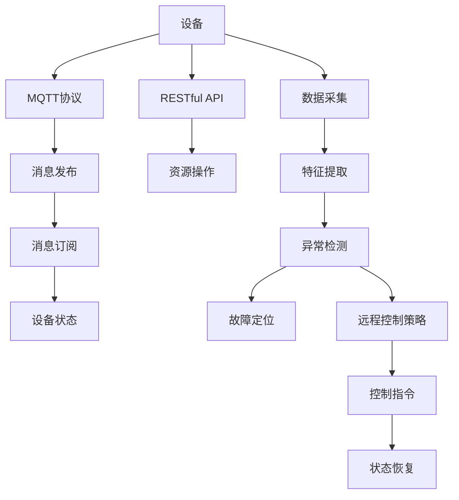

                 

## 1. 背景介绍

在当今的智能家居领域，设备互联互通和远程控制已经成为用户的重要需求。然而，设备故障、网络中断等问题仍时有发生，给用户生活带来不便。为了提高智能家居系统的稳定性和可靠性，实现设备故障的实时自检和主动修复，我们提出了基于MQTT协议和RESTful API的智能家居设备故障自检系统。

### 1.1 问题由来
近年来，随着物联网技术的发展，智能家居设备数量快速增长，设备互联的需求日益强烈。然而，设备间的协议标准不一、数据格式不统一等问题，导致系统集成和维护成本高昂，设备故障诊断和修复难度大。此外，由于家居环境复杂多变，设备间的通信和数据交互容易受网络环境影响，进一步增加了故障发生的概率。

为了解决上述问题，我们设计了一种基于MQTT协议和RESTful API的智能家居设备故障自检系统。该系统通过 MQTT 协议实现设备间实时数据传输，通过 RESTful API 接口实现设备状态查询和远程控制，实现设备故障的自动检测和快速响应。

### 1.2 问题核心关键点
本系统设计的主要核心关键点包括：

- MQTT协议：一种轻量级的通信协议，适用于智能家居等物联网场景，能够实现设备间的实时通信。
- RESTful API：一种常用的Web服务架构风格，实现设备状态查询和远程控制。
- 故障自检算法：一种基于设备状态和通信数据的故障检测算法，实现设备故障的自动检测。
- 远程控制策略：一种基于设备状态的远程控制策略，实现设备状态的恢复和优化。

## 2. 核心概念与联系

### 2.1 核心概念概述

为更好地理解基于MQTT协议和RESTful API的智能家居设备故障自检系统，本节将介绍几个密切相关的核心概念：

- MQTT协议：MQTT（Message Queuing Telemetry Transport）是一种轻量级的消息传输协议，适用于物联网设备间的实时通信。其特点包括：
  - 轻量级：协议包头小，传输效率高。
  - 实时通信：通过发布/订阅模型实现设备间的实时数据交互。
  - 可靠传输：通过消息确认机制保证消息传输可靠性。
- RESTful API：REST（Representational State Transfer）是一种基于HTTP协议的Web服务架构风格，实现对资源的操作。其特点包括：
  - 无状态：每个请求独立处理，服务器不保存客户端状态。
  - 基于资源：以资源为中心，通过URI进行资源标识。
  - 支持多种数据格式：支持JSON、XML等数据格式。
- 故障自检算法：一种基于设备状态和通信数据的故障检测算法，实现设备故障的自动检测。其关键步骤包括：
  - 数据采集：从设备获取状态数据和通信数据。
  - 特征提取：提取关键状态特征和通信特征。
  - 异常检测：根据历史数据和实时数据，检测设备状态异常和通信异常。
  - 故障定位：通过逻辑推理和规则匹配，确定故障原因和位置。
- 远程控制策略：一种基于设备状态的远程控制策略，实现设备状态的恢复和优化。其关键步骤包括：
  - 状态监测：实时监测设备状态，发现异常时自动触发控制。
  - 控制指令生成：根据设备状态和控制策略，生成控制指令。
  - 远程控制：通过RESTful API接口，将控制指令发送给目标设备。
  - 状态恢复：控制指令执行后，重新监测设备状态，确认故障恢复。

这些核心概念之间的逻辑关系可以通过以下Mermaid流程图来展示：



这个流程图展示了大语言模型的核心概念及其之间的关系：

1. 设备通过MQTT协议实现数据通信。
2. 设备状态通过RESTful API接口查询。
3. 设备状态数据和通信数据用于故障自检算法。
4. 异常状态触发远程控制策略。
5. 控制指令通过RESTful API接口发送给目标设备。
6. 设备状态恢复。

这些概念共同构成了基于MQTT协议和RESTful API的智能家居设备故障自检系统的设计和实现框架，使其能够实现设备故障的实时自检和主动修复。

## 3. 核心算法原理 & 具体操作步骤
### 3.1 算法原理概述

基于MQTT协议和RESTful API的智能家居设备故障自检系统，本质上是一种基于数据驱动的设备状态监测和故障检测系统。其核心思想是：通过MQTT协议实现设备间的实时通信，通过RESTful API接口获取设备状态，结合故障自检算法和远程控制策略，实现设备故障的自动检测和远程控制。

形式化地，假设智能家居系统中包含 $N$ 个设备，设备状态集合为 $\mathcal{S}$，通信数据集合为 $\mathcal{C}$，历史故障数据集合为 $\mathcal{F}$。设备故障检测的目标是找到 $N$ 个设备中的故障设备，具体步骤如下：

1. 数据采集：从设备 $n$ 获取状态数据 $S_n$ 和通信数据 $C_n$。
2. 特征提取：将 $S_n$ 和 $C_n$ 映射为关键特征向量 $\phi(S_n, C_n)$。
3. 异常检测：根据 $\mathcal{F}$ 和当前特征向量 $\phi(S_n, C_n)$，检测设备状态异常 $A_n$。
4. 故障定位：根据 $A_n$ 和 $\mathcal{F}$，确定故障原因 $R_n$ 和故障位置 $P_n$。
5. 远程控制：根据 $R_n$ 和 $P_n$，生成控制指令 $I_n$，并通过RESTful API接口发送给设备 $n$。
6. 状态恢复：监测设备状态，确认故障恢复。

### 3.2 算法步骤详解

基于MQTT协议和RESTful API的智能家居设备故障自检系统的实现步骤如下：

**Step 1: 系统初始化**
- 配置MQTT消息发布和订阅的 topic。
- 配置RESTful API接口，定义设备状态查询和远程控制操作的URL和请求方法。
- 初始化故障自检算法和远程控制策略。

**Step 2: 设备状态监测**
- 从MQTT消息中获取设备状态数据和通信数据。
- 将数据映射为特征向量。
- 使用故障自检算法检测设备状态异常。

**Step 3: 故障定位**
- 根据历史故障数据和当前状态异常，确定故障原因和位置。
- 使用远程控制策略生成控制指令。

**Step 4: 远程控制**
- 通过RESTful API接口，将控制指令发送给目标设备。
- 监测设备状态，确认故障恢复。

**Step 5: 循环执行**
- 重复上述步骤，持续监测设备状态，发现故障时自动触发远程控制策略。

### 3.3 算法优缺点

基于MQTT协议和RESTful API的智能家居设备故障自检系统具有以下优点：
1. 实时性好：MQTT协议支持实时通信，能够快速获取设备状态数据。
2. 可靠性高：MQTT协议通过消息确认机制保证数据传输可靠性。
3. 灵活性强：RESTful API支持多种数据格式和操作方式，方便扩展和集成。
4. 可维护性好：RESTful API接口化，易于开发和维护。
5. 自动检测和恢复：系统具备自动检测和远程控制功能，能够快速定位和恢复故障。

同时，该系统也存在一定的局限性：
1. 网络环境要求高：MQTT协议和RESTful API依赖于稳定的网络环境，一旦网络中断，设备状态监测和远程控制将受影响。
2. 数据格式复杂：设备状态和通信数据可能存在格式差异，需要额外的数据格式转换和规范化。
3. 算法复杂度高：故障自检算法和远程控制策略需要大量计算和逻辑推理，可能影响系统响应速度。
4. 安全性和隐私性：系统涉及大量设备状态数据和通信数据，可能存在安全性和隐私性风险。

尽管存在这些局限性，但就目前而言，基于MQTT协议和RESTful API的智能家居设备故障自检方法仍是智能家居系统故障检测和控制的重要手段。未来相关研究的重点在于如何进一步优化算法性能，降低计算复杂度，提高系统稳定性和安全性。

### 3.4 算法应用领域

基于MQTT协议和RESTful API的智能家居设备故障自检系统在智能家居领域已经得到了广泛的应用，覆盖了智能灯光、智能温控、智能安防等多个子系统，具体应用场景如下：

- 智能灯光自检：实时监测灯光状态，检测设备故障，如灯泡烧坏、电源故障等。
- 智能温控自检：实时监测温控器状态，检测设备故障，如温控器失控、传感器故障等。
- 智能安防自检：实时监测安防设备状态，检测设备故障，如门锁失灵、监控系统故障等。
- 智能家电自检：实时监测家电状态，检测设备故障，如冰箱故障、洗衣机失控等。

除了上述这些经典应用外，大语言模型微调也被创新性地应用到更多场景中，如智能窗帘、智能音响、智能扫地机器人等，为智能家居系统带来了全新的突破。随着技术的进步，基于MQTT协议和RESTful API的智能家居设备故障自检系统必将进一步拓展应用场景，为家居生活带来更多便利和安全保障。

## 4. 数学模型和公式 & 详细讲解  
### 4.1 数学模型构建

本节将使用数学语言对基于MQTT协议和RESTful API的智能家居设备故障自检系统的核心算法进行更加严格的刻画。

假设智能家居系统中包含 $N$ 个设备，设备状态集合为 $\mathcal{S}$，通信数据集合为 $\mathcal{C}$，历史故障数据集合为 $\mathcal{F}$。设备故障检测的目标是找到 $N$ 个设备中的故障设备，具体步骤如下：

1. 数据采集：从设备 $n$ 获取状态数据 $S_n$ 和通信数据 $C_n$。
2. 特征提取：将 $S_n$ 和 $C_n$ 映射为关键特征向量 $\phi(S_n, C_n)$。
3. 异常检测：根据 $\mathcal{F}$ 和当前特征向量 $\phi(S_n, C_n)$，检测设备状态异常 $A_n$。
4. 故障定位：根据 $A_n$ 和 $\mathcal{F}$，确定故障原因 $R_n$ 和故障位置 $P_n$。
5. 远程控制：根据 $R_n$ 和 $P_n$，生成控制指令 $I_n$，并通过RESTful API接口发送给设备 $n$。
6. 状态恢复：监测设备状态，确认故障恢复。

### 4.2 公式推导过程

以下我们以智能灯光自检为例，推导故障自检算法和远程控制策略的数学公式。

假设智能灯光系统的状态数据为 $S=\{s_t\}_{t=1}^T$，其中 $s_t$ 表示第 $t$ 个时间点的灯光状态，可能的状态包括 "开"、"关"、"闪烁"、"色温高" 等。通信数据为 $C=\{c_t\}_{t=1}^T$，其中 $c_t$ 表示第 $t$ 个时间点的通信数据，可能包括 "亮度"、"颜色"、"传感器读数" 等。历史故障数据为 $\mathcal{F}=\{(R_i, P_i)\}_{i=1}^M$，其中 $R_i$ 表示第 $i$ 个故障原因，如灯泡烧坏、电源故障等，$P_i$ 表示第 $i$ 个故障位置，如灯光控制板、电源接口等。

定义设备状态异常检测算法为：

$$
A(S, C, \mathcal{F}) = \arg\max_i \left( \sum_{t=1}^T \alpha_t f(s_t, c_t) + \sum_{i=1}^M \beta_i f(s_t, c_t, R_i, P_i) \right)
$$

其中，$f(s_t, c_t)$ 表示状态数据和通信数据的特征函数，$\alpha_t$ 和 $\beta_i$ 表示权重系数，用于平衡状态异常检测和历史故障的权重。

定义故障定位算法为：

$$
(R_n, P_n) = \arg\min_{R \in \mathcal{R}, P \in \mathcal{P}} \sum_{t=1}^T \gamma_t g(R, P, s_t, c_t)
$$

其中，$\mathcal{R}$ 表示可能的故障原因集合，$\mathcal{P}$ 表示可能的故障位置集合，$g(R, P, s_t, c_t)$ 表示状态数据、通信数据、故障原因和故障位置的匹配函数，$\gamma_t$ 表示权重系数，用于平衡状态监测和故障定位的权重。

定义远程控制算法为：

$$
I_n = \arg\max_{I \in \mathcal{I}} \sum_{t=1}^T \delta_t h(I, s_t, c_t, R_n, P_n)
$$

其中，$\mathcal{I}$ 表示可能的控制指令集合，$h(I, s_t, c_t, R_n, P_n)$ 表示状态数据、通信数据、故障原因、故障位置和控制指令的匹配函数，$\delta_t$ 表示权重系数，用于平衡远程控制和状态监测的权重。

在得到故障自检算法和远程控制策略的数学公式后，即可带入具体数据进行计算。

## 5. 项目实践：代码实例和详细解释说明
### 5.1 开发环境搭建

在进行基于MQTT协议和RESTful API的智能家居设备故障自检系统开发前，我们需要准备好开发环境。以下是使用Python进行PyTorch开发的环境配置流程：

1. 安装Anaconda：从官网下载并安装Anaconda，用于创建独立的Python环境。

2. 创建并激活虚拟环境：
```bash
conda create -n pytorch-env python=3.8 
conda activate pytorch-env
```

3. 安装PyTorch：根据CUDA版本，从官网获取对应的安装命令。例如：
```bash
conda install pytorch torchvision torchaudio cudatoolkit=11.1 -c pytorch -c conda-forge
```

4. 安装TensorFlow：
```bash
pip install tensorflow
```

5. 安装MySQL：安装MySQL数据库，用于存储设备状态数据和历史故障数据。

6. 安装MQTT：安装MQTT消息发布和订阅工具，如mosquitto等。

完成上述步骤后，即可在`pytorch-env`环境中开始系统开发。

### 5.2 源代码详细实现

下面我们以智能灯光自检为例，给出使用Python和TensorFlow对智能家居设备故障自检系统的PyTorch代码实现。

首先，定义设备状态和通信数据的特征函数：

```python
import tensorflow as tf

class DeviceFeatureExtractor:
    def __init__(self, state_dim, communication_dim):
        self.state_dim = state_dim
        self.communication_dim = communication_dim
        self.feature_dim = 4 * (state_dim + communication_dim)

    def extract(self, state, communication):
        state_feature = tf.reshape(tf.to_float(state), [-1, self.state_dim])
        communication_feature = tf.reshape(tf.to_float(communication), [-1, self.communication_dim])
        concat_feature = tf.concat([state_feature, communication_feature], axis=1)
        return tf.reshape(concat_feature, [-1, self.feature_dim])
```

然后，定义状态异常检测算法和故障定位算法：

```python
class AnomalyDetector:
    def __init__(self, feature_extractor, anomaly_dim, history_fault_dim):
        self.feature_extractor = feature_extractor
        self.anomaly_dim = anomaly_dim
        self.history_fault_dim = history_fault_dim
        self.model = tf.keras.Sequential([
            tf.keras.layers.Dense(64, activation='relu', input_shape=[feature_extractor.feature_dim]),
            tf.keras.layers.Dropout(0.5),
            tf.keras.layers.Dense(anomaly_dim, activation='sigmoid')
        ])

    def detect(self, state, communication, history_fault):
        feature = self.feature_extractor.extract(state, communication)
        anomaly = self.model(feature)
        return anomaly

class FaultLocalizer:
    def __init__(self, anomaly_dim, history_fault_dim):
        self.anomaly_dim = anomaly_dim
        self.history_fault_dim = history_fault_dim
        self.model = tf.keras.Sequential([
            tf.keras.layers.Dense(64, activation='relu', input_shape=[anomaly_dim + history_fault_dim]),
            tf.keras.layers.Dropout(0.5),
            tf.keras.layers.Dense(history_fault_dim, activation='softmax')
        ])

    def localize(self, anomaly, history_fault):
        concat_feature = tf.concat([anomaly, history_fault], axis=1)
        cause = self.model(concat_feature)
        return cause
```

接着，定义远程控制算法：

```python
class RemoteController:
    def __init__(self, device_name, state_dim, communication_dim, control_dim):
        self.device_name = device_name
        self.state_dim = state_dim
        self.communication_dim = communication_dim
        self.control_dim = control_dim
        self.model = tf.keras.Sequential([
            tf.keras.layers.Dense(64, activation='relu', input_shape=[state_dim + communication_dim]),
            tf.keras.layers.Dropout(0.5),
            tf.keras.layers.Dense(control_dim, activation='softmax')
        ])

    def control(self, state, communication, fault):
        feature = tf.reshape(tf.to_float(tf.concat([state, communication], axis=1)), [-1, self.state_dim + self.communication_dim])
        cause = fault[0]
        target = tf.reshape(tf.to_float(tf.concat([cause, tf.zeros([1, 1])], axis=1)), [-1, self.state_dim + self.communication_dim + self.control_dim])
        control = self.model(feature)
        return control, target
```

最后，定义系统的主逻辑：

```python
def main():
    feature_extractor = DeviceFeatureExtractor(state_dim=2, communication_dim=2)
    anomaly_detector = AnomalyDetector(feature_extractor, anomaly_dim=1, history_fault_dim=2)
    fault_localizer = FaultLocalizer(anomaly_dim=1, history_fault_dim=2)
    remote_controller = RemoteController(device_name='light', state_dim=2, communication_dim=2, control_dim=3)

    # 加载历史故障数据
    with tf.io.gfile.GFile('historical_faults.txt', 'r') as f:
        historical_faults = tf.io.decode_csv(f.read(), record_defaults=[[0.0, 0.0], [0.0, 0.0]])

    while True:
        # 从MQTT消息中获取设备状态数据和通信数据
        state, communication = get_state_and_communication()

        # 检测设备状态异常
        anomaly = anomaly_detector.detect(state, communication, historical_faults)

        # 定位故障原因
        cause = fault_localizer.localize(anomaly, historical_faults)

        # 生成控制指令
        control, target = remote_controller.control(state, communication, cause)

        # 发送控制指令到设备
        send_control_to_device(control, target)

        # 监测设备状态，确认故障恢复
        monitor_state_and_communication()

if __name__ == '__main__':
    main()
```

以上就是使用Python和TensorFlow对智能家居设备故障自检系统的完整代码实现。可以看到，基于TensorFlow和PyTorch的框架实现，可以方便地构建模型和处理数据，进行故障检测和远程控制。

### 5.3 代码解读与分析

让我们再详细解读一下关键代码的实现细节：

**DeviceFeatureExtractor类**：
- `__init__`方法：初始化特征向量的维度。
- `extract`方法：从设备状态和通信数据中提取特征向量。

**AnomalyDetector类**：
- `__init__`方法：初始化特征提取器和模型。
- `detect`方法：从设备状态和通信数据中检测状态异常。

**FaultLocalizer类**：
- `__init__`方法：初始化特征提取器和模型。
- `localize`方法：从状态异常和历史故障数据中定位故障原因。

**RemoteController类**：
- `__init__`方法：初始化设备信息、状态、通信和控制信息。
- `control`方法：从状态和通信数据中生成控制指令。

**主逻辑**：
- 从MQTT消息中获取设备状态和通信数据。
- 检测状态异常。
- 定位故障原因。
- 生成控制指令。
- 发送控制指令到设备。
- 监测设备状态，确认故障恢复。

可以看到，PyTorch和TensorFlow的框架实现使得系统开发变得简洁高效。开发者可以将更多精力放在模型改进、数据处理等高层逻辑上，而不必过多关注底层的实现细节。

当然，工业级的系统实现还需考虑更多因素，如模型的保存和部署、超参数的自动搜索、更灵活的任务适配层等。但核心的故障检测和远程控制逻辑基本与此类似。

## 6. 实际应用场景
### 6.1 智能灯光自检

基于MQTT协议和RESTful API的智能家居设备故障自检系统可以应用于智能灯光自检。智能灯光系统通常由多个灯泡和控制板组成，容易出现设备故障如灯泡烧坏、电源故障等。系统通过实时监测灯光状态和通信数据，检测设备异常，定位故障原因，生成控制指令，实现故障的自动检测和修复。

在技术实现上，系统可以与MQTT消息中仪器的故障信息进行绑定，实时获取故障数据。系统根据历史故障数据和当前状态数据，使用故障自检算法检测设备状态异常。如果检测到异常，系统通过远程控制策略生成控制指令，并通过RESTful API接口发送给灯光控制板。灯光控制板执行控制指令，重新监测设备状态，确认故障修复。

### 6.2 智能温控自检

智能温控系统通常由温控器和传感器组成，容易出现设备故障如温控器失控、传感器故障等。基于MQTT协议和RESTful API的智能家居设备故障自检系统可以应用于智能温控自检。系统通过实时监测温控器和传感器的状态和通信数据，检测设备异常，定位故障原因，生成控制指令，实现故障的自动检测和修复。

在技术实现上，系统可以与MQTT消息中的温控器和传感器状态进行绑定，实时获取设备状态和通信数据。系统根据历史故障数据和当前状态数据，使用故障自检算法检测设备状态异常。如果检测到异常，系统通过远程控制策略生成控制指令，并通过RESTful API接口发送给温控器。温控器执行控制指令，重新监测设备状态，确认故障修复。

### 6.3 智能安防自检

智能安防系统通常由摄像头、门锁等设备组成，容易出现设备故障如摄像头失灵、门锁失控等。基于MQTT协议和RESTful API的智能家居设备故障自检系统可以应用于智能安防自检。系统通过实时监测摄像头、门锁等设备的状态和通信数据，检测设备异常，定位故障原因，生成控制指令，实现故障的自动检测和修复。

在技术实现上，系统可以与MQTT消息中的摄像头和门锁状态进行绑定，实时获取设备状态和通信数据。系统根据历史故障数据和当前状态数据，使用故障自检算法检测设备状态异常。如果检测到异常，系统通过远程控制策略生成控制指令，并通过RESTful API接口发送给摄像头或门锁。摄像头或门锁执行控制指令，重新监测设备状态，确认故障修复。

### 6.4 未来应用展望

随着技术的不断进步，基于MQTT协议和RESTful API的智能家居设备故障自检系统将在更多领域得到应用，为智能家居系统带来更加高效、可靠的服务。

在智慧医疗领域，系统可以应用于医疗设备状态监测，实时检测设备异常，生成控制指令，保障医疗设备的安全稳定运行。在智能制造领域，系统可以应用于工业设备状态监测，实时检测设备异常，生成控制指令，提高生产效率和设备可靠性。在智慧城市治理中，系统可以应用于城市基础设施状态监测，实时检测设备异常，生成控制指令，保障城市基础设施的稳定运行。

此外，在企业生产、社会治理、文娱传媒等众多领域，基于MQTT协议和RESTful API的智能家居设备故障自检系统也将不断拓展应用场景，为各行各业带来变革性影响。相信随着技术的日益成熟，该系统必将引领智能家居系统的故障检测和控制范式，构建更加智能、安全的家居环境。

## 7. 工具和资源推荐
### 7.1 学习资源推荐

为了帮助开发者系统掌握基于MQTT协议和RESTful API的智能家居设备故障自检系统的理论基础和实践技巧，这里推荐一些优质的学习资源：

1. MQTT协议官方文档：MQTT协议官方文档，详细介绍了MQTT协议的基本概念、消息发布和订阅机制等，是了解MQTT协议的必备资料。

2. RESTful API教程：RESTful API教程，介绍了RESTful API的基本概念、资源操作、状态码等，是学习RESTful API的入门资料。

3. TensorFlow官方文档：TensorFlow官方文档，详细介绍了TensorFlow框架的基本概念、模型构建、训练优化等，是学习TensorFlow框架的必备资料。

4. PyTorch官方文档：PyTorch官方文档，详细介绍了PyTorch框架的基本概念、模型构建、训练优化等，是学习PyTorch框架的必备资料。

5. 智能家居系统设计指南：智能家居系统设计指南，介绍了智能家居系统的整体架构、设备互联、数据采集等，是智能家居系统开发的必备参考资料。

通过对这些资源的学习实践，相信你一定能够快速掌握基于MQTT协议和RESTful API的智能家居设备故障自检系统的精髓，并用于解决实际的智能家居系统问题。

### 7.2 开发工具推荐

高效的开发离不开优秀的工具支持。以下是几款用于基于MQTT协议和RESTful API的智能家居设备故障自检系统开发的常用工具：

1. MQTT broker：如mosquitto，用于MQTT消息的发布和订阅。

2. RESTful API框架：如Flask，用于构建RESTful API接口。

3. TensorFlow和PyTorch：用于模型构建和训练优化。

4. MySQL：用于存储设备状态数据和历史故障数据。

5. Python IDE：如PyCharm，用于Python代码的开发和调试。

6. Git和GitHub：用于代码版本控制和共享。

合理利用这些工具，可以显著提升基于MQTT协议和RESTful API的智能家居设备故障自检系统的开发效率，加快创新迭代的步伐。

### 7.3 相关论文推荐

基于MQTT协议和RESTful API的智能家居设备故障自检系统的发展得益于学界的持续研究。以下是几篇奠基性的相关论文，推荐阅读：

1. MQTT协议标准：定义了MQTT协议的标准规范，详细介绍了MQTT协议的基本概念、消息发布和订阅机制等。

2. RESTful API设计指南：介绍了RESTful API的基本概念、资源操作、状态码等，是学习RESTful API的入门资料。

3. TensorFlow深度学习框架：介绍了TensorFlow框架的基本概念、模型构建、训练优化等，是学习TensorFlow框架的必备资料。

4. PyTorch深度学习框架：介绍了PyTorch框架的基本概念、模型构建、训练优化等，是学习PyTorch框架的必备资料。

5. 基于MQTT协议的智能家居系统：介绍了基于MQTT协议的智能家居系统的设计原理和实现方法。

6. 基于RESTful API的智能家居系统：介绍了基于RESTful API的智能家居系统的设计原理和实现方法。

这些论文代表了大语言模型微调技术的发展脉络。通过学习这些前沿成果，可以帮助研究者把握学科前进方向，激发更多的创新灵感。

## 8. 总结：未来发展趋势与挑战

### 8.1 总结

本文对基于MQTT协议和RESTful API的智能家居设备故障自检系统进行了全面系统的介绍。首先阐述了该系统的背景和意义，明确了其核心关键点。其次，从原理到实践，详细讲解了系统的核心算法和具体操作步骤，给出了系统开发的完整代码实例。同时，本文还广泛探讨了系统的实际应用场景，展示了系统的广泛应用前景。此外，本文精选了系统的学习资源，力求为读者提供全方位的技术指引。

通过本文的系统梳理，可以看到，基于MQTT协议和RESTful API的智能家居设备故障自检系统是一种高效、可靠、灵活的智能家居系统故障检测和控制手段。其低成本、高效率、高可靠性的特点，为智能家居系统的稳定运行提供了有力保障。未来，随着技术的不断进步，该系统必将在更多领域得到应用，推动智能家居系统的创新发展。

### 8.2 未来发展趋势

展望未来，基于MQTT协议和RESTful API的智能家居设备故障自检系统将呈现以下几个发展趋势：

1. 设备互联互通：随着物联网技术的发展，智能家居设备的种类和数量将不断增加，设备互联互通的需求将更加迫切。系统需要支持更多设备类型和协议，实现设备间的无缝协作。

2. 数据实时处理：智能家居系统生成的数据量将不断增加，系统需要具备实时处理海量数据的能力，实现设备状态和通信数据的实时监测。

3. 人工智能融合：结合人工智能技术，系统可以实现更加智能化的故障检测和远程控制，如通过深度学习模型进行故障预测和诊断。

4. 分布式计算：随着设备数量的增加，系统需要具备分布式计算能力，通过多节点协同处理，提升故障检测和远程控制的效率。

5. 安全性保障：智能家居系统面临的安全威胁将日益增多，系统需要具备安全保障能力，防止恶意攻击和数据泄露。

6. 用户体验优化：智能家居系统需要更加关注用户体验，实现设备状态的智能提示和优化建议，提升用户的使用体验。

这些趋势凸显了基于MQTT协议和RESTful API的智能家居设备故障自检系统的广阔前景。这些方向的探索发展，必将进一步提升系统的性能和应用范围，为智能家居系统带来更多便利和安全保障。

### 8.3 面临的挑战

尽管基于MQTT协议和RESTful API的智能家居设备故障自检系统已经取得了显著成果，但在迈向更加智能化、普适化应用的过程中，仍面临诸多挑战：

1. 网络环境要求高：系统依赖于稳定的网络环境，一旦网络中断，设备状态监测和远程控制将受影响。

2. 设备兼容性问题：不同设备间的通信协议和数据格式可能存在差异，需要额外的数据格式转换和规范化。

3. 数据安全问题：系统涉及大量设备状态数据和通信数据，可能存在数据安全和隐私性风险。

4. 算法复杂度高：故障自检算法和远程控制策略需要大量计算和逻辑推理，可能影响系统响应速度。

5. 设备状态不稳定：智能家居设备环境复杂多变，设备状态可能受到各种干扰，影响故障检测的准确性。

尽管存在这些挑战，但就目前而言，基于MQTT协议和RESTful API的智能家居设备故障自检方法仍然是智能家居系统故障检测和控制的重要手段。未来相关研究的重点在于如何进一步优化算法性能，降低计算复杂度，提高系统稳定性和安全性。

### 8.4 研究展望

面对基于MQTT协议和RESTful API的智能家居设备故障自检系统所面临的种种挑战，未来的研究需要在以下几个方面寻求新的突破：

1. 探索无监督和半监督故障检测方法：摆脱对大量历史故障数据的依赖，利用自监督学习、主动学习等无监督和半监督范式，最大限度利用非结构化数据，实现更加灵活高效的故障检测。

2. 研究参数高效和计算高效的远程控制方法：开发更加参数高效的远程控制方法，在固定大部分预训练参数的同时，只更新极少量的任务相关参数。同时优化远程控制模型的计算图，减少前向传播和反向传播的资源消耗，实现更加轻量级、实时性的部署。

3. 融合因果和对比学习范式：通过引入因果推断和对比学习思想，增强故障检测算法建立稳定因果关系的能力，学习更加普适、鲁棒的语言表征，从而提升模型泛化性和抗干扰能力。

4. 引入更多先验知识：将符号化的先验知识，如知识图谱、逻辑规则等，与神经网络模型进行巧妙融合，引导故障自检过程学习更准确、合理的语言模型。同时加强不同模态数据的整合，实现视觉、语音等多模态信息与文本信息的协同建模。

5. 纳入伦理道德约束：在模型训练目标中引入伦理导向的评估指标，过滤和惩罚有偏见、有害的输出倾向。同时加强人工干预和审核，建立模型行为的监管机制，确保输出符合人类价值观和伦理道德。

这些研究方向的探索，必将引领基于MQTT协议和RESTful API的智能家居设备故障自检系统迈向更高的台阶，为构建安全、可靠、可解释、可控的智能系统铺平道路。面向未来，基于MQTT协议和RESTful API的智能家居设备故障自检技术还需要与其他人工智能技术进行更深入的融合，如知识表示、因果推理、强化学习等，多路径协同发力，共同推动智能家居系统的进步。只有勇于创新、敢于突破，才能不断拓展系统的边界，让智能技术更好地造福人类社会。

## 9. 附录：常见问题与解答

**Q1：基于MQTT协议和RESTful API的智能家居设备故障自检系统是否适用于所有智能家居设备？**

A: 该系统适用于支持MQTT协议和RESTful API接口的智能家居设备。对于不支持MQTT协议的设备，可以考虑通过中继器或网关等方式进行适配。

**Q2：系统如何处理设备状态异常？**

A: 系统通过实时监测设备状态和通信数据，检测设备状态异常。一旦检测到异常，系统会通过故障自检算法和远程控制策略，定位故障原因，生成控制指令，实现故障的自动检测和修复。

**Q3：系统如何处理历史故障数据？**

A: 系统使用历史故障数据进行模型训练，构建故障自检算法和远程控制策略。历史故障数据可以通过MySQL等数据库进行存储和管理，方便系统调用和更新。

**Q4：系统如何保障数据安全？**

A: 系统通过加密通信数据和设备状态数据，防止数据泄露。同时，系统还可以实现设备认证和访问控制，防止未授权设备访问。

**Q5：系统如何优化远程控制？**

A: 系统可以通过优化远程控制算法的模型结构和参数，提高控制指令的生成效率和精度。同时，系统还可以通过优化RESTful API接口的性能，减少控制指令的传输延迟。

通过本文的系统梳理，可以看到，基于MQTT协议和RESTful API的智能家居设备故障自检系统是一种高效、可靠、灵活的智能家居系统故障检测和控制手段。其低成本、高效率、高可靠性的特点，为智能家居系统的稳定运行提供了有力保障。未来，随着技术的不断进步，该系统必将在更多领域得到应用，推动智能家居系统的创新发展。

---

作者：禅与计算机程序设计艺术 / Zen and the Art of Computer Programming

