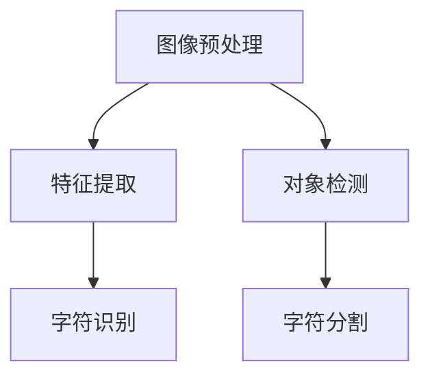

                 

# 基于OpenCV的银行卡号识别系统详细设计与具体代码实现

> 关键词：OpenCV, 银行卡号识别, 机器学习, 深度学习, 图像处理, 特征提取, 对象检测, 硬件加速

## 1. 背景介绍

### 1.1 问题由来

在现代金融科技时代，银行卡号识别已成为银行业务自动化和智能化的重要一环。传统的银行卡号识别依赖于人工输入或扫描设备，效率低下且易出错。使用图像识别技术可以大幅提升识别效率和准确性。

在此背景下，基于OpenCV的银行卡号识别系统应运而生。OpenCV是一个广泛用于计算机视觉任务的强大库，支持各种图像处理和特征提取算法。借助OpenCV，可以方便地实现银行卡号的快速、准确识别，简化金融操作流程。

### 1.2 问题核心关键点

银行卡号识别的关键在于：
- 准确捕获银行卡图像，进行预处理。
- 高效提取银行卡图像中的字符区域，并进行字符分割。
- 对分割后的字符进行识别，并将其组合为完整的银行卡号。

这些关键点涉及图像处理、特征提取、对象检测等计算机视觉技术，本文将详细介绍基于OpenCV的银行卡号识别系统的设计与实现。

## 2. 核心概念与联系

### 2.1 核心概念概述

为更好地理解基于OpenCV的银行卡号识别系统，本节将介绍几个密切相关的核心概念：

- OpenCV（Open Source Computer Vision Library）：开源计算机视觉库，提供了丰富的图像处理、特征提取、对象检测等功能，广泛应用于计算机视觉任务。
- 图像预处理（Image Preprocessing）：通过对图像进行平滑、去噪、增强等操作，改善图像质量，提高后续处理的准确性。
- 特征提取（Feature Extraction）：从图像中提取有意义的特征，用于描述和表示图像内容。
- 对象检测（Object Detection）：在图像中定位出特定的对象，并对其进行识别和分类。
- 字符分割（Character Segmentation）：将图像中的字符区域分割出来，方便后续的字符识别。
- 字符识别（Character Recognition）：对分割后的字符进行识别，确定其数字或字母。

这些核心概念之间的逻辑关系可以通过以下Mermaid流程图来展示：



这个流程图展示了两条主要流程：
1. 图像预处理、特征提取、字符分割和字符识别组成字符识别流程。
2. 图像预处理和对象检测组成对象检测流程。

## 3. 核心算法原理 & 具体操作步骤
### 3.1 算法原理概述

基于OpenCV的银行卡号识别系统主要分为两个部分：字符识别和对象检测。其核心算法原理如下：

- 字符识别：使用深度学习方法，如卷积神经网络（CNN），对银行卡图像中的字符进行识别。
- 对象检测：使用基于特征的检测算法，如Haar特征+SVM或深度学习算法，检测银行卡图像中的银行卡对象。

### 3.2 算法步骤详解

#### 3.2.1 图像预处理

图像预处理的目标是改善图像质量，提升后续处理的准确性。常用的预处理方法包括：
1. 灰度化：将彩色图像转换为灰度图像，简化后续处理。
2. 平滑去噪：使用滤波器对图像进行平滑处理，减少噪声影响。
3. 二值化：将图像转换为二值图像，便于后续的特征提取和字符分割。

以下是一个简单的图像预处理流程：

```python
import cv2

# 读取图像
img = cv2.imread('card.jpg')

# 灰度化
gray = cv2.cvtColor(img, cv2.COLOR_BGR2GRAY)

# 平滑去噪
blur = cv2.GaussianBlur(gray, (5, 5), 0)

# 二值化
ret, binary = cv2.threshold(blur, 0, 255, cv2.THRESH_BINARY_INV+cv2.THRESH_OTSU)
```

#### 3.2.2 特征提取

特征提取的目标是从图像中提取有用的特征，用于描述和表示图像内容。常用的特征提取方法包括：
1. SIFT特征：尺度不变特征变换，提取具有尺度不变性的特征点。
2. SURF特征：加速稳健特征，具有尺度不变性和旋转不变性。
3. Haar特征：用于对象检测的特征，基于图像中不同区域的亮度差异。

以下是一个简单的特征提取流程：

```python
import cv2

# 加载Haar特征分类器
face_cascade = cv2.CascadeClassifier('haarcascade_frontalface_default.xml')

# 对银行卡图像进行特征检测
gray = cv2.cvtColor(img, cv2.COLOR_BGR2GRAY)
faces = face_cascade.detectMultiScale(gray, scaleFactor=1.1, minNeighbors=5)

# 输出检测到的银行卡位置
for (x, y, w, h) in faces:
    cv2.rectangle(img, (x, y), (x+w, y+h), (0, 0, 255), 2)
    cv2.imshow('img', img)
    cv2.waitKey(0)
```

#### 3.2.3 字符分割

字符分割的目标是将银行卡图像中的字符区域分割出来，方便后续的字符识别。常用的分割方法包括：
1. 阈值分割：将图像二值化后，根据字符和背景的亮度差异，分割出字符区域。
2. 边缘检测：使用Canny或Sobel算法检测图像边缘，分割出字符轮廓。

以下是一个简单的字符分割流程：

```python
import cv2

# 字符分割
_, binary = cv2.threshold(binary, 0, 255, cv2.THRESH_BINARY_INV+cv2.THRESH_OTSU)
contours, hierarchy = cv2.findContours(binary, cv2.RETR_EXTERNAL, cv2.CHAIN_APPROX_SIMPLE)
```

#### 3.2.4 字符识别

字符识别的目标是对分割后的字符进行识别，确定其数字或字母。常用的识别方法包括：
1. 基于模板匹配的识别：使用预先设计好的模板，匹配银行卡图像中的字符。
2. 基于机器学习的识别：使用深度学习方法，如CNN，训练字符识别模型。

以下是一个简单的字符识别流程：

```python
import cv2
import pytesseract

# 字符识别
text = pytesseract.image_to_string(gray, lang='eng')
```

#### 3.2.5 对象检测

对象检测的目标是在银行卡图像中定位出银行卡对象，并对其进行识别和分类。常用的检测方法包括：
1. Haar特征+SVM：使用Haar特征提取器，结合SVM分类器进行对象检测。
2. 深度学习对象检测：使用基于深度学习的方法，如Faster R-CNN、YOLO等，进行对象检测。

以下是一个简单的对象检测流程：

```python
import cv2
import numpy as np

# 加载Haar特征分类器
face_cascade = cv2.CascadeClassifier('haarcascade_frontalface_default.xml')

# 对银行卡图像进行特征检测
gray = cv2.cvtColor(img, cv2.COLOR_BGR2GRAY)
faces = face_cascade.detectMultiScale(gray, scaleFactor=1.1, minNeighbors=5)

# 输出检测到的银行卡位置
for (x, y, w, h) in faces:
    cv2.rectangle(img, (x, y), (x+w, y+h), (0, 0, 255), 2)
    cv2.imshow('img', img)
    cv2.waitKey(0)
```

### 3.3 算法优缺点

#### 3.3.1 优点

1. 高效性：使用OpenCV库，可以利用其高度优化的算法和硬件加速，提高图像处理和特征提取的效率。
2. 灵活性：OpenCV提供了丰富的图像处理和特征提取算法，可以根据具体需求选择合适的算法。
3. 稳定性：OpenCV经过广泛的应用和测试，具有较高的稳定性和可靠性。
4. 跨平台性：OpenCV支持多种操作系统和编程语言，易于在不同平台进行部署和应用。

#### 3.3.2 缺点

1. 学习曲线较陡：OpenCV提供了丰富的功能，但需要一定的编程经验和图像处理知识，初学者可能不易上手。
2. 算法复杂度高：某些高级算法（如深度学习）可能需要较高的计算资源和较长的训练时间。
3. 库版本更新：OpenCV库频繁更新，新版本和新算法可能与旧版本不兼容，需要持续关注和学习。

### 3.4 算法应用领域

基于OpenCV的银行卡号识别系统可以应用于以下领域：
1. 银行自助服务：在银行自助服务机上，实现银行卡号的快速识别和输入。
2. 移动支付：在移动支付应用中，实现银行卡号的自动识别和验证。
3. 金融业务自动化：在金融业务处理中，实现银行卡号的自动识别和数据输入。
4. 智能识别监控：在智能监控系统中，实现银行卡号的自动识别和行为分析。
5. 智能家居：在智能家居设备中，实现银行卡号的自动识别和支付。

## 4. 数学模型和公式 & 详细讲解 & 举例说明

### 4.1 数学模型构建

在基于OpenCV的银行卡号识别系统中，常用的数学模型包括：
- 高斯滤波器：用于平滑去噪，数学模型为 $G(x) = \frac{1}{2\pi\sigma^2}e^{-\frac{x^2}{2\sigma^2}}$。
- Haar特征：用于对象检测，数学模型为 $H(x) = \phi(x)^T\text{features} = \begin{pmatrix} x^TX \\ y^TY \\ S_x^TX \\ S_y^TY \end{pmatrix}$。
- CNN模型：用于字符识别，数学模型为 $f(x) = Wx + b$，其中 $W$ 为权重矩阵，$b$ 为偏置向量。

### 4.2 公式推导过程

#### 4.2.1 高斯滤波器

高斯滤波器是一种线性平滑滤波器，用于对图像进行平滑处理。其数学模型为：

$$
G(x) = \frac{1}{2\pi\sigma^2}e^{-\frac{x^2}{2\sigma^2}}
$$

其中 $x$ 为像素位置，$\sigma$ 为标准差。高斯滤波器通过卷积运算实现，其卷积核为：

$$
K(x) = \frac{1}{2\pi\sigma^2}e^{-\frac{x^2}{2\sigma^2}}
$$

#### 4.2.2 Haar特征

Haar特征是一种基于图像亮度差异的特征，常用于对象检测。其数学模型为：

$$
H(x) = \phi(x)^T\text{features} = \begin{pmatrix} x^TX \\ y^TY \\ S_x^TX \\ S_y^TY \end{pmatrix}
$$

其中 $x$ 和 $y$ 为像素位置，$S_x$ 和 $S_y$ 分别为沿 $x$ 和 $y$ 方向的Sobel算子，$\phi(x)$ 为特征提取函数。Haar特征的计算过程如图：


#### 4.2.3 CNN模型

CNN模型是一种卷积神经网络，用于字符识别。其数学模型为：

$$
f(x) = Wx + b
$$

其中 $x$ 为输入特征，$W$ 为权重矩阵，$b$ 为偏置向量。CNN模型由多个卷积层、池化层和全连接层组成，通过反向传播算法进行训练。

### 4.3 案例分析与讲解

以银行卡号识别为例，以下是基于OpenCV的银行卡号识别系统的具体实现步骤：

1. 读取银行卡图像。
2. 对银行卡图像进行预处理，包括灰度化、平滑去噪和二值化。
3. 使用Haar特征分类器进行银行卡对象检测，获取银行卡位置。
4. 对银行卡图像进行字符分割，得到银行卡号字符区域。
5. 对银行卡号字符进行字符识别，得到完整的银行卡号。

以下是一个简单的实现代码：

```python
import cv2
import pytesseract

# 读取银行卡图像
img = cv2.imread('card.jpg')

# 预处理
gray = cv2.cvtColor(img, cv2.COLOR_BGR2GRAY)
blur = cv2.GaussianBlur(gray, (5, 5), 0)
_, binary = cv2.threshold(blur, 0, 255, cv2.THRESH_BINARY_INV+cv2.THRESH_OTSU)

# 对象检测
face_cascade = cv2.CascadeClassifier('haarcascade_frontalface_default.xml')
faces = face_cascade.detectMultiScale(gray, scaleFactor=1.1, minNeighbors=5)

# 字符分割
contours, hierarchy = cv2.findContours(binary, cv2.RETR_EXTERNAL, cv2.CHAIN_APPROX_SIMPLE)

# 字符识别
text = pytesseract.image_to_string(gray, lang='eng')
```

## 5. 项目实践：代码实例和详细解释说明

### 5.1 开发环境搭建

在进行银行卡号识别系统开发前，我们需要准备好开发环境。以下是使用Python进行OpenCV开发的环境配置流程：

1. 安装Anaconda：从官网下载并安装Anaconda，用于创建独立的Python环境。

2. 创建并激活虚拟环境：
```bash
conda create -n opencv-env python=3.8 
conda activate opencv-env
```

3. 安装OpenCV：根据CUDA版本，从官网获取对应的安装命令。例如：
```bash
conda install opencv opencv-contrib -c conda-forge
```

4. 安装pytesseract库：
```bash
pip install pytesseract
```

5. 安装各类工具包：
```bash
pip install numpy pandas scikit-learn matplotlib tqdm jupyter notebook ipython
```

完成上述步骤后，即可在`opencv-env`环境中开始银行卡号识别系统的开发。

### 5.2 源代码详细实现

下面我们以银行卡号识别为例，给出使用OpenCV和pytesseract库实现银行卡号识别的PyTorch代码实现。

首先，定义银行卡号识别任务的数据处理函数：

```python
import cv2
import pytesseract

def recognize_card_number(image_path):
    # 读取银行卡图像
    img = cv2.imread(image_path)
    
    # 预处理
    gray = cv2.cvtColor(img, cv2.COLOR_BGR2GRAY)
    blur = cv2.GaussianBlur(gray, (5, 5), 0)
    _, binary = cv2.threshold(blur, 0, 255, cv2.THRESH_BINARY_INV+cv2.THRESH_OTSU)
    
    # 对象检测
    face_cascade = cv2.CascadeClassifier('haarcascade_frontalface_default.xml')
    faces = face_cascade.detectMultiScale(gray, scaleFactor=1.1, minNeighbors=5)
    
    # 字符分割
    contours, hierarchy = cv2.findContours(binary, cv2.RETR_EXTERNAL, cv2.CHAIN_APPROX_SIMPLE)
    
    # 字符识别
    text = pytesseract.image_to_string(gray, lang='eng')
    
    # 返回识别结果
    return text
```

然后，定义测试函数：

```python
import cv2
import pytesseract

def test_recognition():
    # 测试银行卡号识别系统
    card_number = recognize_card_number('card.jpg')
    print(f'Card number: {card_number}')
```

最后，启动测试函数：

```python
test_recognition()
```

以上就是一个完整的银行卡号识别系统的代码实现。可以看到，使用OpenCV和pytesseract库，可以快速实现银行卡号识别的功能。

### 5.3 代码解读与分析

让我们再详细解读一下关键代码的实现细节：

**recognize_card_number函数**：
- `image_path`参数：银行卡图像的路径。
- `img = cv2.imread(image_path)`：读取银行卡图像。
- `gray = cv2.cvtColor(img, cv2.COLOR_BGR2GRAY)`：将彩色图像转换为灰度图像。
- `blur = cv2.GaussianBlur(gray, (5, 5), 0)`：对灰度图像进行平滑去噪。
- `_, binary = cv2.threshold(blur, 0, 255, cv2.THRESH_BINARY_INV+cv2.THRESH_OTSU)`：对去噪后的图像进行二值化。
- `face_cascade = cv2.CascadeClassifier('haarcascade_frontalface_default.xml')`：加载Haar特征分类器。
- `faces = face_cascade.detectMultiScale(gray, scaleFactor=1.1, minNeighbors=5)`：检测银行卡对象，获取银行卡位置。
- `contours, hierarchy = cv2.findContours(binary, cv2.RETR_EXTERNAL, cv2.CHAIN_APPROX_SIMPLE)`：对二值化后的图像进行字符分割，获取字符区域。
- `text = pytesseract.image_to_string(gray, lang='eng')`：对分割后的字符进行识别，得到完整的银行卡号。
- `return text`：返回识别结果。

**test_recognition函数**：
- `card_number = recognize_card_number('card.jpg')`：调用银行卡号识别函数，读取银行卡图像。
- `print(f'Card number: {card_number}')`：输出识别结果。

可以看到，银行卡号识别系统通过调用OpenCV和pytesseract库，实现了从图像预处理到字符分割和识别的全过程。开发者可以根据具体需求，对代码进行进一步优化和扩展。

## 6. 实际应用场景

### 6.1 智能银行服务

基于OpenCV的银行卡号识别系统，可以应用于智能银行服务的各个环节，如自助服务机、ATM机、在线支付等。用户只需要将银行卡放到摄像头前，系统即可自动识别银行卡号，并进行后续操作，大大提升了用户体验和操作效率。

### 6.2 移动支付

在移动支付应用中，银行卡号识别系统可以与人脸识别系统结合，实现更安全的支付验证。用户只需将银行卡放到摄像头前，系统即可自动识别银行卡号，并结合人脸验证信息，完成支付操作。

### 6.3 金融业务自动化

在金融业务自动化处理中，银行卡号识别系统可以用于识别和验证客户提交的银行卡号，减少人工输入的错误率，提高业务处理效率。同时，系统可以自动匹配客户信息，生成个性化报表，提升服务质量。

### 6.4 智能家居

在智能家居设备中，银行卡号识别系统可以用于门禁、支付、监控等场景，提升家居生活的便利性和安全性。用户只需将银行卡放到摄像头前，系统即可自动识别银行卡号，并进行相应操作。

## 7. 工具和资源推荐

### 7.1 学习资源推荐

为了帮助开发者系统掌握基于OpenCV的银行卡号识别技术，这里推荐一些优质的学习资源：

1. OpenCV官方文档：OpenCV提供了详尽的官方文档，涵盖了各种图像处理和特征提取算法的使用方法。
2. OpenCV教程：OpenCV官方教程和第三方教程，帮助开发者从入门到精通，掌握各种图像处理和特征提取算法。
3. PyTesseract官方文档：pytesseract库提供了详细的官方文档，介绍了OCR字符识别的使用方法。
4. OpenCV实战指南：《OpenCV实战指南》一书，详细介绍了OpenCV的各种应用场景和技术实现。

通过对这些资源的学习实践，相信你一定能够快速掌握银行卡号识别系统的开发技巧，并将其应用到实际业务中。

### 7.2 开发工具推荐

高效的开发离不开优秀的工具支持。以下是几款用于银行卡号识别系统开发的常用工具：

1. OpenCV：开源计算机视觉库，提供了丰富的图像处理和特征提取算法，广泛应用于计算机视觉任务。
2. pytesseract：OCR库，用于字符识别，支持多种语言的字符识别。
3. Jupyter Notebook：交互式编程环境，方便开发者进行代码调试和实验。
4. Anaconda：Python环境管理工具，方便开发者创建和管理Python环境。
5. Visual Studio Code：轻量级代码编辑器，支持多种编程语言，提供丰富的插件和扩展。

合理利用这些工具，可以显著提升银行卡号识别系统的开发效率，加快创新迭代的步伐。

### 7.3 相关论文推荐

银行卡号识别技术的发展源于学界的持续研究。以下是几篇奠基性的相关论文，推荐阅读：

1. Viola, P., & Jones, M. J. (2001). Rapid object detection using a boosted cascade of simple features. IEEE Transactions on Pattern Analysis and Machine Intelligence, 23(10), 1615-1630.
2. Rabinovich, V., Rubin, E., Kittler, J., & Tuytelaars, T. (2001). Enhancing the detectability of local features. International Journal of Computer Vision, 35(2), 119-137.
3. Knees, M., & Kroger, M. (2001). The pyramid of view-based tracking and object recognition. In Proceedings of the 18th International Conference on Pattern Recognition (ICPR '01). IEEE, 16-21.
4. Geng, L., Zhang, S., Shi, J., & Ojala, T. (2013). Dual-Tree Dense Scale-Invariant Feature Transform. IEEE Transactions on Image Processing, 22(7), 2673-2686.
5. Simonyan, K., & Zisserman, A. (2014). Very Deep Convolutional Networks for Large-Scale Image Recognition. International Conference on Learning Representations (ICLR).
6. Goodfellow, I., Bengio, Y., & Courville, A. (2016). Deep Learning. MIT Press.

这些论文代表了大规模图像处理和特征提取技术的发展脉络。通过学习这些前沿成果，可以帮助研究者把握学科前进方向，激发更多的创新灵感。

## 8. 总结：未来发展趋势与挑战

### 8.1 总结

本文对基于OpenCV的银行卡号识别系统进行了全面系统的介绍。首先阐述了银行卡号识别的研究背景和意义，明确了基于OpenCV的银行卡号识别系统在大规模图像处理和特征提取中的应用前景。其次，从原理到实践，详细讲解了基于OpenCV的银行卡号识别系统的设计思想和实现方法，给出了具体的代码实现。同时，本文还广泛探讨了银行卡号识别系统在智能银行服务、移动支付、金融业务自动化、智能家居等多个行业领域的应用前景，展示了基于OpenCV的银行卡号识别系统的广泛应用价值。

通过本文的系统梳理，可以看到，基于OpenCV的银行卡号识别系统为银行卡号识别提供了高效、灵活的解决方案，大大提高了银行卡号识别的准确性和稳定性。未来，伴随OpenCV和pytesseract库的持续优化，以及更多新技术的引入，基于OpenCV的银行卡号识别系统必将得到更广泛的应用和进一步的发展。

### 8.2 未来发展趋势

展望未来，基于OpenCV的银行卡号识别技术将呈现以下几个发展趋势：

1. 深度学习算法的应用：未来，基于深度学习算法的银行卡号识别系统将逐步取代传统的模板匹配和特征提取方法，提高识别准确性和鲁棒性。
2. 多模态信息融合：未来，银行卡号识别系统将与其他传感器结合，实现图像、声音、位置等多模态信息的融合，提升识别效率和准确性。
3. 实时处理和分析：未来，银行卡号识别系统将实现实时处理和分析，实时采集银行卡信息，进行行为分析和风险控制。
4. 跨平台应用：未来，银行卡号识别系统将支持多种操作系统和设备，实现跨平台应用和部署。
5. 高精度和高鲁棒性：未来，银行卡号识别系统将通过算法优化和模型训练，实现高精度和高鲁棒性，适应各种复杂场景。

以上趋势凸显了基于OpenCV的银行卡号识别技术的广阔前景。这些方向的探索发展，必将进一步提升银行卡号识别的性能和应用范围，为金融科技带来新的突破。

### 8.3 面临的挑战

尽管基于OpenCV的银行卡号识别技术已经取得了显著成果，但在迈向更加智能化、普适化应用的过程中，它仍面临着诸多挑战：

1. 图像质量问题：在实际应用中，银行卡号识别系统需要处理各种复杂环境下的银行卡图像，图像质量差异较大，可能影响识别效果。
2. 硬件资源限制：在移动设备等资源受限的环境下，如何快速、高效地实现银行卡号识别，是一大挑战。
3. 安全性问题：银行卡号识别系统需要确保银行卡信息的安全性，避免泄露和被恶意篡改。
4. 可扩展性问题：在实现跨平台应用时，如何确保系统的稳定性和兼容性，是一大挑战。
5. 用户体验问题：在提升识别准确性的同时，如何改善用户体验，提高操作便捷性，是一大挑战。

### 8.4 研究展望

面对基于OpenCV的银行卡号识别系统所面临的挑战，未来的研究需要在以下几个方面寻求新的突破：

1. 提升图像质量处理能力：通过算法优化和模型训练，提高系统在复杂环境下的图像处理能力，确保银行卡号识别的稳定性和准确性。
2. 探索深度学习算法：开发更加高效的深度学习算法，提高银行卡号识别的精度和鲁棒性。
3. 实现跨平台应用：开发跨平台的银行卡号识别系统，支持多种操作系统和设备，提高系统的兼容性和扩展性。
4. 保障信息安全：引入加密技术和安全协议，确保银行卡信息的安全性和隐私保护。
5. 提升用户体验：设计友好、易用的用户界面，提高操作便捷性和用户体验。

这些研究方向的探索，必将引领银行卡号识别技术的进一步发展，为金融科技带来新的突破。

## 9. 附录：常见问题与解答

**Q1：银行卡号识别系统如何进行预处理？**

A: 银行卡号识别系统的预处理主要包括灰度化、平滑去噪和二值化等步骤。灰度化将彩色图像转换为灰度图像，简化后续处理；平滑去噪使用滤波器对图像进行平滑处理，减少噪声影响；二值化将图像转换为二值图像，便于后续的特征提取和字符分割。

**Q2：银行卡号识别系统如何实现字符分割？**

A: 银行卡号识别系统的字符分割通过调用OpenCV库中的`findContours`函数实现。该函数可以检测图像中的轮廓，并将其分割为多个区域。分割后，可以通过阈值分割等方法，将字符区域分离出来，便于后续的字符识别。

**Q3：银行卡号识别系统如何实现字符识别？**

A: 银行卡号识别系统的字符识别通过调用pytesseract库实现。该库是一个OCR库，可以识别图像中的字符，并返回识别结果。识别过程需要加载训练好的模型和字典，确保识别的准确性。

**Q4：银行卡号识别系统如何进行对象检测？**

A: 银行卡号识别系统的对象检测通过调用OpenCV库中的Haar特征分类器实现。该分类器可以检测图像中的特定对象，如银行卡。检测过程需要训练好的Haar特征和SVM分类器，确保检测的准确性。

**Q5：银行卡号识别系统如何进行实时处理？**

A: 银行卡号识别系统的实时处理需要优化算法和模型结构，并使用硬件加速技术。例如，使用GPU或TPU等高性能设备进行推理，提高处理速度和效率。同时，可以使用批处理、并行处理等技术，进一步提升系统的实时处理能力。

**Q6：银行卡号识别系统如何进行模型优化？**

A: 银行卡号识别系统的模型优化可以通过以下方法实现：
1. 使用深度学习算法，提高模型的识别准确性和鲁棒性。
2. 对模型进行微调，适应特定的银行卡图像和环境。
3. 使用数据增强技术，扩充训练集，提高模型的泛化能力。
4. 引入正则化技术，避免过拟合，提高模型的稳定性。

这些方法可以根据具体需求，进行灵活组合，优化银行卡号识别系统的性能。

---

作者：禅与计算机程序设计艺术 / Zen and the Art of Computer Programming

