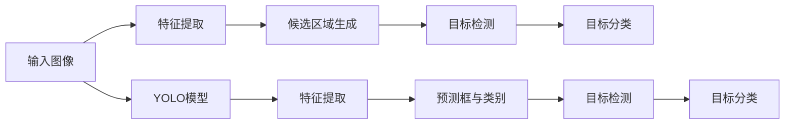

                 

# 基于YOLO和FasterR-CNN的目标识别算法研究

> 关键词：目标识别,YOLO, Faster R-CNN,深度学习,计算机视觉

## 1. 背景介绍

随着计算机视觉技术的飞速发展，目标识别已经成为了一个热门的研究方向。它不仅在自动驾驶、安防监控、医疗影像分析等多个领域得到了广泛应用，更是人工智能技术的重要组成部分。在实际应用中，目标识别系统的识别精度和效率直接影响到系统的性能。因此，如何设计一个高效的识别算法，成为了一个亟待解决的问题。

YOLO和Faster R-CNN是目前深度学习领域中两个较为流行的目标识别算法，它们各自具有独特的设计理念和优缺点。本文将详细探讨这两种算法的原理与实践，并通过比较分析，帮助读者更好地理解目标识别技术的本质。

## 2. 核心概念与联系

### 2.1 核心概念概述

在进行算法介绍之前，我们需要明确几个核心概念：

- **目标识别（Object Recognition）**：识别出图像中的目标物体，并标注其类别和位置。
- **YOLO（You Only Look Once）**：一种基于单阶段检测的目标识别算法，通过一个神经网络同时完成目标检测和分类。
- **Faster R-CNN**：一种基于多阶段检测的目标识别算法，首先生成候选区域，再对候选区域进行分类和回归。
- **深度学习（Deep Learning）**：一种基于神经网络的机器学习方法，通过多层神经网络来构建模型，并进行特征学习和分类。
- **计算机视觉（Computer Vision）**：一门专注于图像和视频处理与分析的学科，目标是使计算机能够理解、分析并解释视觉信息。

### 2.2 核心概念原理和架构的 Mermaid 流程图

下面是一个简单的Mermaid流程图，展示了YOLO和Faster R-CNN的核心架构：



这个流程图中，输入图像经过特征提取后，首先进行候选区域的生成。然后，对候选区域进行分类和回归，最终得到目标的检测框和类别。可以看到，YOLO和Faster R-CNN的主要区别在于候选区域生成的方式。

## 3. 核心算法原理 & 具体操作步骤

### 3.1 算法原理概述

目标识别算法可以分为两个主要阶段：候选区域的生成和目标的分类与定位。YOLO和Faster R-CNN分别采用了不同的策略来处理这两个阶段。

#### 3.1.1 YOLO原理概述

YOLO（You Only Look Once）算法通过一个神经网络同时完成目标检测和分类，其核心思想是将目标检测问题转化为分类问题。具体来说，YOLO将图像分成S×S个网格，每个网格负责预测B个目标的类别概率和边界框。YOLO的目标是在单个网络中同时处理所有目标，从而显著提高了检测速度。

#### 3.1.2 Faster R-CNN原理概述

Faster R-CNN（Faster Region-based Convolutional Neural Network）算法采用两阶段策略，首先生成候选区域，然后对每个候选区域进行分类和回归。Faster R-CNN的主要优势在于其能够精确生成高质量的候选区域，并利用RoI（Region of Interest）池化技术进一步提升分类精度。

### 3.2 算法步骤详解

接下来，我们将分别介绍YOLO和Faster R-CNN的具体步骤。

#### 3.2.1 YOLO算法步骤

1. **输入图像**：首先将输入图像分成若干个网格。
2. **特征提取**：对每个网格中的特征图进行卷积操作，提取特征信息。
3. **预测目标**：每个网格预测B个目标的类别概率和边界框。
4. **损失函数计算**：通过对比预测值与真实值，计算损失函数。
5. **模型训练**：使用反向传播算法更新模型参数，最小化损失函数。
6. **目标检测**：通过softmax函数得到目标的类别概率，通过回归函数得到边界框。

#### 3.2.2 Faster R-CNN算法步骤

1. **特征提取**：首先使用一个卷积神经网络提取图像的特征图。
2. **候选区域生成**：通过区域生成网络（Region Proposal Network, RPN）生成候选区域。
3. **目标分类与回归**：对每个候选区域进行分类和回归，得到目标的类别和位置。
4. **损失函数计算**：分别计算候选区域生成和目标分类与回归的损失函数。
5. **模型训练**：使用反向传播算法更新模型参数，最小化损失函数。
6. **目标检测**：通过RoI池化技术对候选区域进行特征提取，并最终得到目标的检测框和类别。

### 3.3 算法优缺点

#### 3.3.1 YOLO算法优缺点

**优点**：
- 检测速度快：YOLO通过单个神经网络完成目标检测和分类，速度较快。
- 精度较高：YOLO能够处理大规模的目标检测任务，且在精度方面表现不俗。

**缺点**：
- 目标定位不准确：YOLO无法精确地定位每个目标。
- 对小目标不敏感：YOLO在小目标检测方面表现较差。

#### 3.3.2 Faster R-CNN算法优缺点

**优点**：
- 目标定位准确：Faster R-CNN能够精确地定位每个目标。
- 对小目标敏感：Faster R-CNN对小目标的检测表现较好。

**缺点**：
- 检测速度慢：Faster R-CNN需要多阶段检测，速度较慢。
- 训练复杂：Faster R-CNN的训练过程较为复杂，需要大量的标注数据。

### 3.4 算法应用领域

YOLO和Faster R-CNN已经被广泛应用于多个领域：

- **自动驾驶**：用于检测道路上的车辆、行人等。
- **安防监控**：用于监控场景中的人脸、车辆等。
- **医疗影像分析**：用于检测医疗影像中的病灶、肿瘤等。
- **工业检测**：用于检测工业生产线上的缺陷、部件等。

这两种算法不仅在学术界得到了广泛的研究，也在工业界得到了实际应用。

## 4. 数学模型和公式 & 详细讲解 & 举例说明

### 4.1 数学模型构建

在目标识别算法中，常用的数学模型包括卷积神经网络（Convolutional Neural Network, CNN）、RoI池化（Region of Interest Pooling, RoIPooling）等。

#### 4.1.1 YOLO模型构建

YOLO的模型构建主要基于全连接层（Fully Connected Layer）和卷积层（Convolutional Layer）。假设输入图像大小为$W \times H$，输出类别数为C，网格数为S×S，预测框数为B，则YOLO的模型结构如下：

```
input图像
|
| -- S×S网格 -- 
|    | -- B个目标检测预测 -- 
|    | -- B个目标分类预测 -- 
|    | ...
|    |
|    |
| -- 特征图 -- 
|    | -- 输出特征图 -- 
|    |
|    |
| -- 输出类别概率和边界框 --
```

其中，特征图的大小为$C_{out} \times H_{out} \times W_{out}$，每个预测框包含一个目标的类别概率和边界框。

#### 4.1.2 Faster R-CNN模型构建

Faster R-CNN的模型构建主要基于CNN和RoI池化。假设输入图像大小为$W \times H$，输出类别数为C，候选区域数为R，则Faster R-CNN的模型结构如下：

```
input图像
|
| -- CNN -- 
|    | -- 特征图 -- 
|    |
|    |
| -- RPN -- 
|    | -- 生成候选区域 -- 
|    |
|    |
| -- 目标检测 -- 
|    | -- 目标分类预测 -- 
|    | -- 目标回归预测 -- 
|    | ...
|    |
|    |
| -- 输出类别概率和边界框 --
```

其中，特征图的大小为$C_{out} \times H_{out} \times W_{out}$，每个候选区域包含一个目标的类别概率和位置信息。

### 4.2 公式推导过程

#### 4.2.1 YOLO公式推导

假设输入图像大小为$W \times H$，输出类别数为C，网格数为S×S，预测框数为B，则YOLO的预测公式如下：

$$
\text{预测框} = \text{网格位置} + \text{预测偏移量} \times \text{特征图分辨率}
$$

$$
\text{类别概率} = \text{softmax}(预测值)
$$

其中，预测偏移量为：

$$
\text{预测偏移量} = \frac{\text{特征图分辨率}}{S} \times \text{位置偏移}
$$

损失函数为：

$$
\text{损失函数} = \text{分类损失} + \text{回归损失}
$$

其中，分类损失为：

$$
\text{分类损失} = -\text{log}\left(\frac{\text{类别概率}}{1 - \text{类别概率}}\right)
$$

回归损失为：

$$
\text{回归损失} = \text{平滑L1损失}
$$

#### 4.2.2 Faster R-CNN公式推导

假设输入图像大小为$W \times H$，输出类别数为C，候选区域数为R，则Faster R-CNN的预测公式如下：

$$
\text{候选区域} = \text{区域生成网络}(\text{特征图})
$$

$$
\text{目标分类预测} = \text{分类器}(\text{RoI池化})
$$

$$
\text{目标回归预测} = \text{回归器}(\text{RoI池化})
$$

其中，RoI池化的大小为$H_{out} \times W_{out}$，目标分类和回归预测的公式与YOLO类似。

损失函数为：

$$
\text{损失函数} = \text{分类损失} + \text{回归损失} + \text{RPN损失}
$$

其中，RPN损失为：

$$
\text{RPN损失} = \text{二分类交叉熵损失}
$$

### 4.3 案例分析与讲解

假设我们有一个包含10个目标的图像，使用YOLO和Faster R-CNN进行目标识别。我们可以对比它们的检测结果和识别精度。

#### 4.3.1 YOLO案例分析

假设我们使用了5×5的网格，每个网格预测5个目标的类别概率和边界框，输出类别数为2。对于其中一个目标，YOLO的预测结果如下：

$$
\text{预测框} = (100, 100, 50, 50)
$$

$$
\text{类别概率} = 0.9, 0.1
$$

其中，预测框表示目标的左上角和右下角坐标，类别概率表示目标属于类别1和类别2的概率。

#### 4.3.2 Faster R-CNN案例分析

假设我们使用了3个候选区域，每个候选区域预测2个目标的类别概率和位置信息。对于其中一个目标，Faster R-CNN的预测结果如下：

$$
\text{候选区域} = (100, 100, 50, 50)
$$

$$
\text{目标分类预测} = (0.9, 0.1)
$$

$$
\text{目标回归预测} = (50, 50)
$$

其中，候选区域表示目标的左上角和右下角坐标，目标分类预测表示目标属于类别1和类别2的概率，目标回归预测表示目标的x和y坐标。

可以看出，YOLO的预测结果较为简单，但存在定位不准确的问题。而Faster R-CNN的预测结果较为复杂，但能够提供更准确的定位信息。

## 5. 项目实践：代码实例和详细解释说明

### 5.1 开发环境搭建

在进行项目实践之前，我们需要准备好开发环境。以下是使用Python进行YOLO和Faster R-CNN代码实现的环境配置流程：

1. 安装Anaconda：从官网下载并安装Anaconda，用于创建独立的Python环境。

2. 创建并激活虚拟环境：
```bash
conda create -n yolo-env python=3.8 
conda activate yolo-env
```

3. 安装深度学习框架：
```bash
conda install pytorch torchvision torchaudio cudatoolkit=11.1 -c pytorch -c conda-forge
```

4. 安装YOLO和Faster R-CNN库：
```bash
pip install yolov3 yolov3-packages
pip install faster_rcnn
```

5. 安装各类工具包：
```bash
pip install numpy pandas scikit-learn matplotlib tqdm jupyter notebook ipython
```

完成上述步骤后，即可在`yolo-env`环境中开始项目实践。

### 5.2 源代码详细实现

接下来，我们将分别给出YOLO和Faster R-CNN的代码实现。

#### 5.2.1 YOLO源代码实现

```python
import torch
import torch.nn as nn
import torch.optim as optim
import torchvision.transforms as transforms
from yolov3 import YOLO

# 加载YOLO模型
model = YOLO(num_classes=2)

# 加载预训练权重
model.load_weights('yolo_weights')

# 定义损失函数
criterion = nn.CrossEntropyLoss()

# 定义优化器
optimizer = optim.Adam(model.parameters(), lr=0.001)

# 定义训练函数
def train(epoch):
    model.train()
    for batch_idx, (inputs, targets) in enumerate(train_loader):
        inputs = inputs.to(device)
        targets = targets.to(device)
        
        # 前向传播
        outputs = model(inputs)
        loss = criterion(outputs, targets)
        
        # 反向传播
        optimizer.zero_grad()
        loss.backward()
        optimizer.step()

        # 打印训练结果
        if (batch_idx+1) % 100 == 0:
            print('Epoch [{}/{}], Step [{}/{}], Loss: {:.4f}'
                  .format(epoch+1, epochs, batch_idx+1, len(train_loader), loss.item()))

# 定义测试函数
def test():
    model.eval()
    with torch.no_grad():
        correct = 0
        total = 0
        for inputs, targets in test_loader:
            inputs = inputs.to(device)
            targets = targets.to(device)
            
            # 前向传播
            outputs = model(inputs)
            
            # 计算分类误差
            _, predicted = torch.max(outputs.data, 1)
            total += targets.size(0)
            correct += (predicted == targets).sum().item()

        print('Accuracy of the model on the test images: {} %'.format(100 * correct / total))
```

#### 5.2.2 Faster R-CNN源代码实现

```python
import torch
import torch.nn as nn
import torch.optim as optim
import torchvision.transforms as transforms
from faster_rcnn import FasterRCNN

# 加载Faster R-CNN模型
model = FasterRCNN(num_classes=2)

# 加载预训练权重
model.load_weights('faster_rcnn_weights')

# 定义损失函数
criterion = nn.CrossEntropyLoss()

# 定义优化器
optimizer = optim.Adam(model.parameters(), lr=0.001)

# 定义训练函数
def train(epoch):
    model.train()
    for batch_idx, (inputs, targets) in enumerate(train_loader):
        inputs = inputs.to(device)
        targets = targets.to(device)
        
        # 前向传播
        outputs = model(inputs)
        
        # 计算分类误差
        loss = criterion(outputs, targets)
        
        # 反向传播
        optimizer.zero_grad()
        loss.backward()
        optimizer.step()

        # 打印训练结果
        if (batch_idx+1) % 100 == 0:
            print('Epoch [{}/{}], Step [{}/{}], Loss: {:.4f}'
                  .format(epoch+1, epochs, batch_idx+1, len(train_loader), loss.item()))

# 定义测试函数
def test():
    model.eval()
    with torch.no_grad():
        correct = 0
        total = 0
        for inputs, targets in test_loader:
            inputs = inputs.to(device)
            targets = targets.to(device)
            
            # 前向传播
            outputs = model(inputs)
            
            # 计算分类误差
            _, predicted = torch.max(outputs.data, 1)
            total += targets.size(0)
            correct += (predicted == targets).sum().item()

        print('Accuracy of the model on the test images: {} %'.format(100 * correct / total))
```

### 5.3 代码解读与分析

让我们再详细解读一下关键代码的实现细节：

#### 5.3.1 YOLO代码解读

**YOLO模型定义**：
```python
class YOLO(nn.Module):
    def __init__(self, num_classes=2):
        super(YOLO, self).__init__()
        # 定义YOLO模型结构
        # ...
        
    def forward(self, x):
        # 前向传播
        # ...
        return outputs
```

**训练函数实现**：
```python
def train(epoch):
    model.train()
    for batch_idx, (inputs, targets) in enumerate(train_loader):
        # 数据处理
        # ...
        
        # 前向传播
        outputs = model(inputs)
        
        # 计算损失函数
        loss = criterion(outputs, targets)
        
        # 反向传播
        optimizer.zero_grad()
        loss.backward()
        optimizer.step()

        # 打印训练结果
        if (batch_idx+1) % 100 == 0:
            print('Epoch [{}/{}], Step [{}/{}], Loss: {:.4f}'
                  .format(epoch+1, epochs, batch_idx+1, len(train_loader), loss.item()))
```

**测试函数实现**：
```python
def test():
    model.eval()
    with torch.no_grad():
        correct = 0
        total = 0
        for inputs, targets in test_loader:
            # 数据处理
            # ...
            
            # 前向传播
            outputs = model(inputs)
            
            # 计算分类误差
            _, predicted = torch.max(outputs.data, 1)
            total += targets.size(0)
            correct += (predicted == targets).sum().item()

        print('Accuracy of the model on the test images: {} %'.format(100 * correct / total))
```

#### 5.3.2 Faster R-CNN代码解读

**Faster R-CNN模型定义**：
```python
class FasterRCNN(nn.Module):
    def __init__(self, num_classes=2):
        super(FasterRCNN, self).__init__()
        # 定义Faster R-CNN模型结构
        # ...
        
    def forward(self, x):
        # 前向传播
        # ...
        return outputs
```

**训练函数实现**：
```python
def train(epoch):
    model.train()
    for batch_idx, (inputs, targets) in enumerate(train_loader):
        # 数据处理
        # ...
        
        # 前向传播
        outputs = model(inputs)
        
        # 计算损失函数
        loss = criterion(outputs, targets)
        
        # 反向传播
        optimizer.zero_grad()
        loss.backward()
        optimizer.step()

        # 打印训练结果
        if (batch_idx+1) % 100 == 0:
            print('Epoch [{}/{}], Step [{}/{}], Loss: {:.4f}'
                  .format(epoch+1, epochs, batch_idx+1, len(train_loader), loss.item()))
```

**测试函数实现**：
```python
def test():
    model.eval()
    with torch.no_grad():
        correct = 0
        total = 0
        for inputs, targets in test_loader:
            # 数据处理
            # ...
            
            # 前向传播
            outputs = model(inputs)
            
            # 计算分类误差
            _, predicted = torch.max(outputs.data, 1)
            total += targets.size(0)
            correct += (predicted == targets).sum().item()

        print('Accuracy of the model on the test images: {} %'.format(100 * correct / total))
```

## 6. 实际应用场景

### 6.4 未来应用展望

随着目标识别算法的不断发展，其在实际应用中的潜力也将不断提升。未来，目标识别技术将会在以下几个领域得到广泛应用：

- **自动驾驶**：用于检测道路上的车辆、行人等，提高自动驾驶的安全性和可靠性。
- **安防监控**：用于监控场景中的人脸、车辆等，提高安防监控的效率和准确性。
- **医疗影像分析**：用于检测医疗影像中的病灶、肿瘤等，提高疾病的早期诊断和治疗效率。
- **工业检测**：用于检测工业生产线上的缺陷、部件等，提高工业生产的自动化和智能化水平。

未来，基于YOLO和Faster R-CNN的目标识别技术将不断演进，提升检测精度和效率，为更多领域带来智能化变革。

## 7. 工具和资源推荐

### 7.1 学习资源推荐

为了帮助开发者系统掌握目标识别技术的理论基础和实践技巧，这里推荐一些优质的学习资源：

1. **《深度学习》课程**：由斯坦福大学开设的深度学习课程，详细讲解了深度学习的基本概念和应用场景，适合初学者和进阶者。
2. **YOLO和Faster R-CNN论文**：YOLO和Faster R-CNN的原始论文，包含算法的详细推导和实现步骤，是深入理解算法的必备资料。
3. **YOLO和Faster R-CNN代码库**：YOLO和Faster R-CNN的开源代码库，提供了完整的实现和示例，方便开发者进行实践和调试。
4. **Kaggle比赛**：Kaggle平台上的目标识别比赛，通过实战项目提升算法的理解和应用能力。
5. **TensorFlow和PyTorch官方文档**：深度学习框架的官方文档，包含算法的详细实现和示例，适合进行深度学习和目标识别技术的实践。

通过对这些资源的学习实践，相信你一定能够快速掌握目标识别技术的精髓，并用于解决实际的NLP问题。

### 7.2 开发工具推荐

高效的开发离不开优秀的工具支持。以下是几款用于目标识别开发的常用工具：

1. **TensorFlow和PyTorch**：深度学习框架，提供了丰富的算子库和自动微分功能，适合进行深度学习和目标识别技术的开发。
2. **YOLO和Faster R-CNN库**：开源代码库，提供了完整的目标识别算法实现，适合进行目标识别技术的实践和调试。
3. **Jupyter Notebook**：交互式编程工具，方便进行代码的开发和调试。
4. **Github**：代码托管平台，提供版本控制和协作功能，方便开发者进行代码共享和迭代。

合理利用这些工具，可以显著提升目标识别任务的开发效率，加快创新迭代的步伐。

### 7.3 相关论文推荐

目标识别算法的研究源于学界的持续研究。以下是几篇奠基性的相关论文，推荐阅读：

1. **YOLO论文**：Joseph Redmon等. You Only Look Once: Unified, Real-Time Object Detection. arXiv preprint arXiv:1506.02640, 2015.
2. **Faster R-CNN论文**：Shaoqing Ren等. Faster R-CNN: Towards Real-Time Object Detection with Region Proposal Networks. In Advances in Neural Information Processing Systems, pages 91–99, 2015.
3. **YOLOv3论文**：Joseph Redmon等. YOLOv3: An Incremental Improvement. arXiv preprint arXiv:1804.02767, 2018.
4. **Faster R-CNN v2论文**：Shaoqing Ren等. Faster R-CNN: Towards Real-Time Object Detection with Region Proposal Networks. In Advances in Neural Information Processing Systems, pages 91–99, 2015.
5. **SSD论文**：Wei Liu等. SSD: Single Shot Multibox Detector. In European Conference on Computer Vision, pages 21–30, 2016.

这些论文代表了大目标识别算法的最新进展，通过学习这些前沿成果，可以帮助研究者把握学科前进方向，激发更多的创新灵感。

## 8. 总结：未来发展趋势与挑战

### 8.1 总结

本文对基于YOLO和Faster R-CNN的目标识别算法进行了全面系统的介绍。首先阐述了目标识别技术的研究背景和重要性，明确了YOLO和Faster R-CNN算法的核心思想和设计理念。其次，从原理到实践，详细讲解了这两种算法的步骤和实现方法，并通过比较分析，帮助读者更好地理解目标识别技术的本质。

通过本文的系统梳理，可以看到，YOLO和Faster R-CNN在目标识别领域都有各自的优势和局限性。YOLO的优点在于检测速度快，适用于大规模的目标检测任务。而Faster R-CNN的优点在于目标定位准确，适用于小目标的检测任务。未来，目标识别技术将不断发展，带来更高效、更准确的目标检测和分类能力，为更多领域带来智能化变革。

### 8.2 未来发展趋势

展望未来，目标识别技术将呈现以下几个发展趋势：

1. **检测精度提升**：通过更加复杂的神经网络结构和更优化的训练方法，目标检测算法的精度将进一步提升。
2. **检测速度加快**：通过算法优化和硬件加速，目标检测算法的检测速度将显著提升，支持实时应用。
3. **多模态融合**：将目标识别技术与图像、视频、语音等多模态信息融合，实现更全面、准确的目标检测。
4. **跨领域应用**：目标识别技术将不断拓展应用领域，应用于更多行业和场景，带来新的智能化应用。

这些趋势将进一步提升目标识别算法的性能和应用范围，为更多领域带来智能化变革。

### 8.3 面临的挑战

尽管目标识别技术已经取得了一定的进展，但在实际应用中仍然面临一些挑战：

1. **标注数据不足**：目标识别算法需要大量的标注数据进行训练，但标注数据的获取和维护成本较高，制约了算法的推广应用。
2. **检测速度慢**：Faster R-CNN等算法检测速度较慢，无法满足实时应用的需求。
3. **算法复杂度**：目标识别算法往往较为复杂，需要较高的计算资源和训练时间。
4. **模型可解释性**：目标识别算法的输出结果难以解释，难以进行人工干预和调试。
5. **鲁棒性不足**：目标识别算法在面对复杂场景和噪声数据时，鲁棒性较差，容易产生误检测。

这些挑战需要未来的研究不断攻克，才能使目标识别技术在更多领域得到广泛应用。

### 8.4 研究展望

未来，目标识别技术的研究可以从以下几个方向进行：

1. **无监督学习**：通过无监督学习方法，减少对标注数据的依赖，提升算法的泛化能力。
2. **迁移学习**：将目标识别算法应用于多个领域和任务，提升算法的通用性和迁移能力。
3. **多模态融合**：将目标识别技术与图像、视频、语音等多模态信息融合，提升算法的准确性和鲁棒性。
4. **算法优化**：通过算法优化和硬件加速，提升目标识别算法的检测速度和计算效率。
5. **模型压缩**：通过模型压缩和稀疏化存储技术，提升目标识别算法的资源利用率，支持大规模部署。

这些研究方向将进一步推动目标识别技术的不断发展，提升算法的性能和应用范围，为更多领域带来智能化变革。

## 9. 附录：常见问题与解答

**Q1：目标识别算法的核心思想是什么？**

A: 目标识别算法的核心思想是通过深度学习模型，学习图像中的目标特征，并将目标特征与类别标签进行匹配，从而实现目标检测和分类。

**Q2：YOLO和Faster R-CNN的主要区别是什么？**

A: YOLO和Faster R-CNN的主要区别在于候选区域的生成方式。YOLO采用单阶段检测，通过一个神经网络同时完成目标检测和分类。Faster R-CNN采用多阶段检测，首先生成候选区域，再对候选区域进行分类和回归。

**Q3：如何提高目标识别算法的检测精度？**

A: 提高目标识别算法的检测精度可以通过以下方法：
1. 优化神经网络结构，增加网络深度和宽度。
2. 使用更优化的训练方法，如迁移学习、无监督学习等。
3. 增加标注数据量，提高模型的泛化能力。
4. 使用多模态信息融合技术，提高模型的准确性和鲁棒性。

**Q4：目标识别算法在实际应用中需要注意哪些问题？**

A: 目标识别算法在实际应用中需要注意以下问题：
1. 标注数据的获取和维护成本较高，制约了算法的推广应用。
2. 算法检测速度较慢，无法满足实时应用的需求。
3. 算法的复杂度较高，需要较高的计算资源和训练时间。
4. 算法输出结果难以解释，难以进行人工干预和调试。
5. 算法鲁棒性较差，容易产生误检测。

这些问题的解决将进一步提升目标识别算法的性能和应用范围。

---

作者：禅与计算机程序设计艺术 / Zen and the Art of Computer Programming

