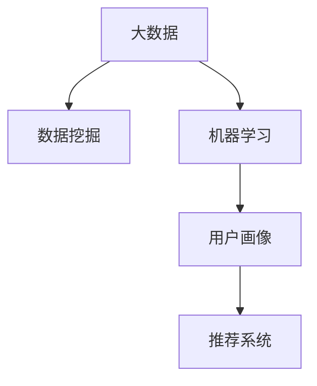

                 

# 基于大数据的电子产品购买消费行为的分析研究

> 关键词：大数据, 电子产品, 消费行为, 用户画像, 推荐系统

## 1. 背景介绍

随着互联网和电子商务的迅猛发展，大数据已经成为商业决策的重要依据。特别是对于电子产品市场，海量的用户数据蕴含着丰富的消费行为信息，可以对用户购买偏好、消费动机、市场趋势等进行深入分析，从而帮助商家制定精准的市场策略，提升用户体验。

本文将探讨如何通过大数据技术，结合机器学习、数据挖掘等手段，对电子产品购买消费行为进行深度分析，并提供相应的用户画像和推荐系统设计思路。

## 2. 核心概念与联系

### 2.1 核心概念概述

为了更好地理解大数据分析在电子产品购买消费行为研究中的应用，本节将介绍几个核心概念：

- **大数据（Big Data）**：指规模巨大、结构复杂、类型多样的数据集合，通常难以在传统数据库或数据处理技术上实时分析和处理。
- **数据挖掘（Data Mining）**：指从大数据中自动提取有用信息，发现隐藏在数据背后的知识和规律。
- **机器学习（Machine Learning）**：指使用数据训练模型，使其具备自动学习和预测能力的技术。
- **用户画像（User Persona）**：指对用户特征的全面描述，包括基本信息、行为偏好、消费能力等。
- **推荐系统（Recommendation System）**：指通过用户历史行为、消费偏好等信息，为其推荐感兴趣的产品或内容的技术。

这些概念之间的逻辑关系可以通过以下Mermaid流程图来展示：



这个流程图展示了大数据分析在电子产品购买消费行为研究中的应用路径：

1. 收集海量的用户数据。
2. 使用数据挖掘技术发现其中的有用信息。
3. 通过机器学习构建预测模型，识别用户特征和消费行为规律。
4. 根据用户画像设计推荐系统，为用户提供个性化产品推荐。

## 3. 核心算法原理 & 具体操作步骤
### 3.1 算法原理概述

基于大数据的电子产品购买消费行为分析，本质上是一个数据驱动的建模与预测过程。其核心思想是：

- **数据采集与预处理**：收集用户在电商平台上购买、浏览、评价等行为数据，并进行清洗和预处理，构建适合分析的数据集。
- **特征提取与选择**：从预处理后的数据中提取用户行为特征，如购买频率、浏览时长、点击率、评价情感等，并根据特征的相关性和重要性进行筛选。
- **建模与预测**：使用机器学习算法（如随机森林、逻辑回归、神经网络等）对用户数据进行建模，建立消费行为预测模型，如用户购买意向、偏好产品类别等。
- **用户画像构建**：结合建模结果和电商平台的已有用户信息，综合构建完整的用户画像，为个性化推荐提供依据。
- **推荐系统优化**：根据用户画像，设计推荐算法，为每位用户生成个性化推荐列表，提升用户满意度和销售额。

### 3.2 算法步骤详解

以下是基于大数据的电子产品购买消费行为分析的具体步骤：

**Step 1: 数据采集与预处理**

1. **数据源选择**：根据研究目标，选择合适的电商平台数据，如阿里巴巴、京东、亚马逊等。
2. **数据收集**：使用API接口或爬虫工具，自动抓取电商平台的订单、浏览、评价等数据。
3. **数据清洗**：去除无效数据、异常值和重复数据，处理缺失值和噪声。

**Step 2: 特征提取与选择**

1. **数据特征**：从订单数据中提取用户购买行为特征，如购买时间、金额、频率等；从浏览数据中提取用户兴趣特征，如浏览商品类别、页面停留时间等；从评价数据中提取用户情感特征，如评分、评论内容等。
2. **特征选择**：使用特征选择方法（如相关系数、卡方检验、L1正则化等）选择与预测目标最相关的特征。

**Step 3: 建模与预测**

1. **模型选择**：根据数据特点和研究目标，选择合适的机器学习模型，如线性回归、决策树、随机森林、神经网络等。
2. **模型训练**：使用训练数据集训练预测模型，选择适当的超参数，如学习率、正则化系数等。
3. **模型评估**：在验证数据集上评估模型的性能，使用准确率、召回率、F1分数等指标。

**Step 4: 用户画像构建**

1. **用户信息**：结合电商平台的用户基本信息，如年龄、性别、地域等，丰富用户画像。
2. **用户行为**：将建模结果中的用户特征与电商平台行为数据结合，构建综合性的用户画像。
3. **画像更新**：定期更新用户画像，确保其时效性和准确性。

**Step 5: 推荐系统优化**

1. **推荐算法**：根据用户画像设计推荐算法，如协同过滤、基于内容的推荐、混合推荐等。
2. **推荐优化**：在推荐结果中加入相关性、多样性、时效性等因素，优化推荐效果。
3. **系统部署**：将推荐系统集成到电商平台的用户界面，实现个性化推荐功能。

### 3.3 算法优缺点

基于大数据的电子产品购买消费行为分析方法具有以下优点：

- **数据量大**：电商平台上积累了大量的用户行为数据，能够提供丰富的分析依据。
- **多样性高**：数据类型多样，涵盖订单、浏览、评价等多种信息，便于全面分析。
- **实时性**：通过实时数据分析，能够及时发现市场趋势和用户需求变化，快速响应。
- **可解释性**：基于机器学习模型的预测结果具有可解释性，能够为决策提供依据。

同时，该方法也存在一些局限性：

- **隐私问题**：收集和分析用户数据可能涉及隐私问题，需确保数据使用符合法律法规。
- **数据质量**：电商平台数据可能存在不一致性、噪音等质量问题，影响分析结果。
- **计算资源**：大数据分析需要较高的计算资源，处理大规模数据集时可能面临性能瓶颈。
- **模型复杂性**：复杂的机器学习模型可能需要较长的训练时间和较高的计算资源。
- **用户多样性**：不同用户群体的需求和行为差异较大，单一模型难以全面覆盖。

尽管存在这些局限性，但大数据分析在电子产品购买消费行为研究中的应用前景广阔，能够为商家提供深刻的洞见，提升用户体验和销售业绩。

### 3.4 算法应用领域

基于大数据的电子产品购买消费行为分析方法，在以下领域有着广泛的应用：

- **电商营销**：通过用户画像和推荐系统，优化广告投放策略，提升点击率和转化率。
- **库存管理**：分析产品销售趋势，优化库存结构，减少库存积压和缺货风险。
- **用户服务**：根据用户行为数据，提供个性化客服，提升客户满意度和忠诚度。
- **产品设计**：了解用户需求和市场趋势，指导新产品的开发和优化。
- **竞争分析**：分析竞争对手的销售数据，发现市场机会和差距。

## 4. 数学模型和公式 & 详细讲解 & 举例说明

### 4.1 数学模型构建

在基于大数据的电子产品购买消费行为分析中，常用的数学模型包括线性回归、逻辑回归、决策树、随机森林和神经网络等。以下以线性回归模型为例，进行详细讲解。

**线性回归模型**：
假设有一个简单的线性回归模型 $y = \beta_0 + \beta_1x_1 + \beta_2x_2 + \cdots + \beta_nx_n + \epsilon$，其中 $y$ 表示用户购买行为，$x_i$ 表示对应的特征变量，$\beta_i$ 表示回归系数，$\epsilon$ 表示误差项。

### 4.2 公式推导过程

根据最小二乘法，线性回归模型的参数估计公式为：

$$
\hat{\beta} = (X^TX)^{-1}X^Ty
$$

其中，$X$ 为特征矩阵，$y$ 为目标向量，$\hat{\beta}$ 为回归系数估计值。

### 4.3 案例分析与讲解

**案例**：分析用户购买电子产品的时间与金额之间的关系。

1. **数据准备**：收集用户购买电子产品的数据，包含时间戳和金额。
2. **特征提取**：提取时间戳和金额作为特征，时间戳经过归一化处理。
3. **模型训练**：使用训练数据集训练线性回归模型，得到时间与金额之间的回归系数。
4. **结果分析**：分析回归系数，发现用户购买金额随着购买时间的增加呈递增趋势。

## 5. 项目实践：代码实例和详细解释说明
### 5.1 开发环境搭建

在进行项目实践前，我们需要准备好开发环境。以下是使用Python进行大数据分析的开发环境配置流程：

1. **安装Python**：从官网下载并安装Python，建议在3.6以上版本。
2. **安装pandas**：用于数据处理，可以安装最新版本。
3. **安装numpy**：用于数值计算，可以安装最新版本。
4. **安装scikit-learn**：用于机器学习，可以安装最新版本。
5. **安装matplotlib**：用于数据可视化，可以安装最新版本。
6. **安装seaborn**：用于美化图表，可以安装最新版本。
7. **安装jupyter notebook**：用于编写和运行Python代码，可以安装最新版本。

完成上述步骤后，即可在Jupyter Notebook中开始项目实践。

### 5.2 源代码详细实现

以下是一个简单的Python代码示例，用于基于大数据的电子产品购买消费行为分析：

```python
import pandas as pd
import numpy as np
from sklearn.linear_model import LinearRegression
import matplotlib.pyplot as plt
import seaborn as sns

# 读取数据
data = pd.read_csv('purchase_data.csv')

# 特征工程
X = data[['time', 'amount']]
y = data['purchase']

# 数据标准化
X = (X - X.mean()) / X.std()

# 模型训练
model = LinearRegression()
model.fit(X, y)

# 模型评估
X_test = X_test[['time', 'amount']]
y_test = y_test['purchase']
predictions = model.predict(X_test)

# 结果可视化
plt.scatter(X_test['time'], y_test)
plt.plot(X_test['time'], predictions, color='red')
plt.show()
```

### 5.3 代码解读与分析

让我们再详细解读一下关键代码的实现细节：

**数据读取与特征工程**：
- `pd.read_csv`：从CSV文件中读取数据。
- `X = data[['time', 'amount']]`：选择时间戳和金额作为特征。
- `X = (X - X.mean()) / X.std()`：对特征进行标准化处理，避免数据量级不一致影响结果。

**模型训练与评估**：
- `model = LinearRegression()`：创建线性回归模型。
- `model.fit(X, y)`：训练模型。
- `predictions = model.predict(X_test)`：在测试数据上生成预测结果。

**结果可视化**：
- `plt.scatter(X_test['time'], y_test)`：绘制散点图。
- `plt.plot(X_test['time'], predictions, color='red')`：绘制预测曲线。
- `plt.show()`：显示图表。

可以看到，通过简单的Python代码，我们实现了基于线性回归模型的大数据分析。虽然这是一个简化示例，但它展示了数据处理、模型训练和结果可视化的基本流程。

## 6. 实际应用场景
### 6.1 电商营销优化

电商平台可以通过大数据分析，了解用户购买行为和偏好，优化广告投放策略，提高点击率和转化率。具体应用场景包括：

- **个性化广告**：根据用户画像和行为数据，设计个性化广告内容，提升广告效果。
- **广告投放优化**：分析广告效果，优化投放渠道和时间，提升广告ROI。
- **销售预测**：预测未来的销售趋势，指导库存管理和采购决策。

### 6.2 库存管理优化

电商平台的库存管理需要实时掌握产品销售情况，避免积压或缺货。大数据分析可以帮助商家实现以下优化：

- **销售预测**：根据历史销售数据，预测未来的销售趋势，优化库存结构。
- **动态补货**：实时监控库存水平，根据预测结果动态补货，减少缺货风险。
- **需求分析**：分析用户购买行为，识别热销和滞销产品，优化产品组合。

### 6.3 用户服务优化

电商平台的客户服务需要根据用户反馈和行为数据，提供个性化和及时的服务。大数据分析可以用于：

- **客户画像**：构建详细的用户画像，了解用户需求和行为特征。
- **问题预测**：分析用户行为数据，预测可能出现的问题，提前做好准备。
- **服务改进**：根据用户反馈和行为数据，优化客服策略，提升用户满意度。

### 6.4 产品设计优化

电商平台的品牌和产品设计需要紧密结合市场趋势和用户需求，大数据分析可以帮助实现以下优化：

- **市场需求分析**：分析用户行为数据，了解市场需求变化趋势，指导产品设计和研发。
- **竞争分析**：分析竞争对手的产品和营销策略，发现市场机会和差距。
- **用户反馈**：根据用户反馈和行为数据，优化产品设计和用户体验。

### 6.5 未来应用展望

随着大数据技术的不断进步，基于大数据的电子产品购买消费行为分析将迎来更广阔的应用前景：

- **实时分析**：通过实时数据流处理技术，实现实时分析和预测，及时响应市场变化。
- **多模态数据融合**：结合用户的多模态数据（如视频、图片、文本等），提升分析的全面性和准确性。
- **自动化决策**：引入自动化决策技术，将分析结果直接应用于电商平台决策过程中，提升效率和效果。
- **个性化推荐**：通过更精确的用户画像和推荐算法，提供个性化的产品推荐，提升用户体验和销售转化率。
- **用户行为分析**：结合行为数据分析，了解用户购买决策过程，优化用户体验和销售策略。

## 7. 工具和资源推荐
### 7.1 学习资源推荐

为了帮助开发者系统掌握基于大数据的电子产品购买消费行为分析，这里推荐一些优质的学习资源：

1. **《Python数据科学手册》**：详细介绍Python数据科学库的使用，包括pandas、numpy、scikit-learn等。
2. **《机器学习实战》**：深入讲解机器学习的基本概念和常见算法，适合初学者入门。
3. **《Python数据可视化》**：讲解如何使用matplotlib、seaborn等库进行数据可视化，展示分析结果。
4. **《大数据技术与应用》**：介绍大数据技术和实践，涵盖数据采集、存储、处理、分析等环节。
5. **《大数据技术实战》**：结合真实项目案例，讲解大数据技术的应用，适合实践操作。

通过对这些资源的学习实践，相信你一定能够快速掌握大数据分析的精髓，并用于解决实际的电子产品购买消费行为问题。

### 7.2 开发工具推荐

高效的数据分析离不开优秀的工具支持。以下是几款用于大数据分析的常用工具：

1. **Python**：基于Python的开源数据分析语言，功能强大，生态丰富，适合大数据处理和分析。
2. **R语言**：专注于统计分析和数据可视化，拥有丰富的统计包和图表库。
3. **Hadoop**：开源的大数据处理框架，支持大规模数据存储和处理。
4. **Spark**：快速的大数据处理引擎，支持内存计算和分布式处理。
5. **Hive**：基于Hadoop的数据仓库工具，支持SQL查询和数据管理。
6. **Presto**：实时大数据查询引擎，支持快速数据探索和分析。

合理利用这些工具，可以显著提升大数据分析的开发效率，加快创新迭代的步伐。

### 7.3 相关论文推荐

大数据分析在电子产品购买消费行为研究中的应用，吸引了众多学者的关注。以下是几篇奠基性的相关论文，推荐阅读：

1. **《基于大数据的消费行为分析》**：探讨了大数据技术在消费行为分析中的应用，提出了多种数据分析方法和工具。
2. **《大数据驱动的个性化推荐系统》**：介绍了大数据技术在个性化推荐系统中的应用，探讨了推荐算法的实现。
3. **《用户行为分析与电子商务》**：分析了用户行为数据在电子商务中的应用，提出了基于行为数据的销售预测模型。
4. **《电商平台的大数据分析与优化》**：介绍了电商平台的大数据处理技术，探讨了数据驱动的电商优化方法。
5. **《基于大数据的库存管理优化》**：探讨了大数据技术在库存管理中的应用，提出了库存优化模型和算法。

这些论文代表了大数据分析在电子产品购买消费行为研究中的前沿进展，通过学习这些前沿成果，可以帮助研究者把握学科前进方向，激发更多的创新灵感。

## 8. 总结：未来发展趋势与挑战
### 8.1 研究成果总结

本文从大数据分析的角度，探讨了电子产品购买消费行为的深度挖掘和优化。通过数据采集、特征提取、模型训练、用户画像构建和推荐系统设计，详细介绍了基于大数据的电子产品购买消费行为分析的全过程。该方法在电商营销、库存管理、用户服务、产品设计和市场竞争等领域有着广泛的应用前景，能够显著提升电商平台的用户体验和销售业绩。

### 8.2 未来发展趋势

展望未来，基于大数据的电子产品购买消费行为分析将呈现以下几个发展趋势：

1. **多模态融合**：结合用户的多模态数据（如视频、图片、文本等），提升分析的全面性和准确性。
2. **实时分析**：通过实时数据流处理技术，实现实时分析和预测，及时响应市场变化。
3. **自动化决策**：引入自动化决策技术，将分析结果直接应用于电商平台决策过程中，提升效率和效果。
4. **个性化推荐**：通过更精确的用户画像和推荐算法，提供个性化的产品推荐，提升用户体验和销售转化率。
5. **用户行为分析**：结合行为数据分析，了解用户购买决策过程，优化用户体验和销售策略。
6. **数据隐私保护**：结合数据隐私保护技术，确保用户数据的安全性和隐私性。

### 8.3 面临的挑战

尽管基于大数据的电子产品购买消费行为分析已经取得显著成效，但在其发展的过程中，仍面临以下挑战：

1. **数据质量**：电商平台的原始数据可能存在噪音、不一致等问题，影响分析结果的准确性。
2. **数据隐私**：用户数据的隐私保护是一个重要问题，需要确保数据使用的合法性和合规性。
3. **计算资源**：大数据分析需要较高的计算资源，处理大规模数据集时可能面临性能瓶颈。
4. **模型复杂性**：复杂的机器学习模型可能需要较长的训练时间和较高的计算资源。
5. **用户多样性**：不同用户群体的需求和行为差异较大，单一模型难以全面覆盖。

尽管存在这些挑战，但大数据分析在电子产品购买消费行为研究中的应用前景广阔，能够为商家提供深刻的洞见，提升用户体验和销售业绩。

### 8.4 研究展望

面向未来，基于大数据的电子产品购买消费行为分析需要在以下几个方面进行突破：

1. **数据质量提升**：引入数据清洗和质量控制技术，确保数据的准确性和一致性。
2. **隐私保护**：结合数据隐私保护技术，确保用户数据的安全性和隐私性。
3. **计算资源优化**：引入分布式计算和并行处理技术，优化大数据分析的计算效率。
4. **模型简化**：设计更简单、更高效的机器学习模型，提升模型的训练速度和预测效果。
5. **用户画像细化**：结合用户行为数据和个性化信息，构建更全面、更精细的用户画像。
6. **推荐系统优化**：引入更高级的推荐算法，提升推荐系统的准确性和个性化程度。

这些研究方向将为基于大数据的电子产品购买消费行为分析带来新的突破，推动相关技术的发展和应用。

## 9. 附录：常见问题与解答

**Q1：大数据分析需要哪些数据源？**

A: 大数据分析需要从多个渠道收集用户数据，包括电商平台订单数据、浏览数据、评价数据、社交媒体数据等。这些数据源提供了丰富的用户行为信息，能够全面反映用户的购买消费行为。

**Q2：如何处理大数据中的噪音数据？**

A: 大数据中常常存在噪音数据，需要通过数据清洗和预处理技术进行处理。常用的方法包括去除异常值、填补缺失值、平滑数据等。使用Python的pandas库，可以进行高效的数据清洗和预处理。

**Q3：如何构建用户画像？**

A: 用户画像的构建需要结合电商平台的已有用户信息，如年龄、性别、地域等，再结合建模结果中的用户特征，综合构建。可以使用Python的pandas库进行数据处理，使用matplotlib、seaborn库进行数据可视化，辅助构建用户画像。

**Q4：如何优化推荐系统？**

A: 推荐系统的优化需要结合用户画像和建模结果，设计合适的推荐算法。常用的推荐算法包括协同过滤、基于内容的推荐、混合推荐等。通过调整算法参数和优化模型结构，可以提升推荐系统的准确性和个性化程度。

**Q5：如何确保数据隐私保护？**

A: 数据隐私保护是大数据分析中的重要问题，需要采用多种技术手段，如数据匿名化、差分隐私、数据加密等。在数据采集和处理过程中，需要遵守相关的法律法规，确保用户数据的合法性和合规性。

---

作者：禅与计算机程序设计艺术 / Zen and the Art of Computer Programming

