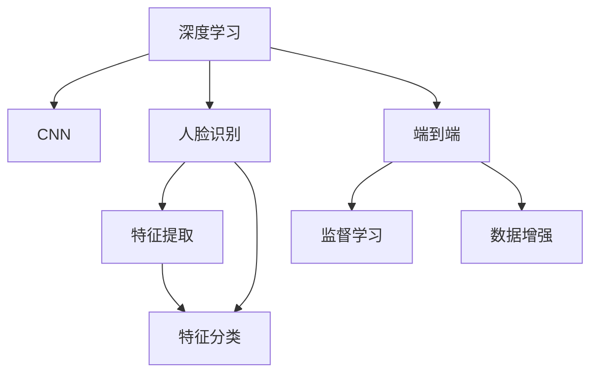

                 

# 基于深度学习的人脸识别

## 1. 背景介绍

### 1.1 问题由来
人脸识别（Face Recognition），作为计算机视觉领域的重要研究方向，正逐渐应用于公共安全、门禁考勤、智能客服等多个场景。其核心在于从数字图像中提取人脸特征，并将其与已知数据进行比对，以实现身份验证和识别功能。传统的基于特征提取和机器学习的方法存在精度低、计算量大等问题，难以满足实际应用需求。

近年来，随着深度学习技术的快速发展，基于卷积神经网络（Convolutional Neural Network, CNN）的深度学习模型在人脸识别任务上取得了显著进展。深度模型通过大量训练数据，自动提取图像中的多层次抽象特征，能够以更高的精度和更小的计算成本完成人脸识别任务，成为主流的人脸识别方法。

### 1.2 问题核心关键点
基于深度学习的人脸识别，本质上是一个端到端的图像识别问题，即通过深度模型直接将原始图像映射到识别结果。其核心在于如何设计高效、泛化能力强的模型架构，以及如何充分利用标注数据进行有效的监督学习，使得模型能够精确地识别和区分不同的人脸。

人脸识别技术的发展经历了特征提取、特征匹配、特征分类等多个阶段，目前已经逐步走向以深度学习为主的“特征+分类”联合训练范式。关键在于选择合适的网络结构、损失函数、优化器等参数，以及如何避免过拟合、提高泛化性能等。

## 2. 核心概念与联系

### 2.1 核心概念概述

为更好地理解基于深度学习的人脸识别，本节将介绍几个密切相关的核心概念：

- 深度学习（Deep Learning）：一种通过多层神经网络逼近复杂函数映射的机器学习技术。
- 卷积神经网络（Convolutional Neural Network, CNN）：一种专门处理图像、语音等结构化数据的深度学习模型。
- 人脸识别（Face Recognition）：通过深度模型实现从数字图像中提取人脸特征并进行比对的身份验证技术。
- 端到端（End-to-End）：将问题直接从输入数据映射到输出结果，中间不经过中间变量。
- 特征提取（Feature Extraction）：通过深度模型自动学习图像中的多层次抽象特征，用于区分不同类别的对象。
- 特征分类（Feature Classification）：在提取的特征上进行分类，得到最终的识别结果。
- 监督学习（Supervised Learning）：利用标注数据训练模型，使其能够精确预测未标注数据。
- 数据增强（Data Augmentation）：通过对原始数据进行各种变换，生成新的训练样本，以扩充训练数据集。

这些核心概念之间的逻辑关系可以通过以下Mermaid流程图来展示：



这个流程图展示了大语言模型的核心概念及其之间的关系：

1. 深度学习提供了强有力的特征提取和表示能力。
2. CNN模型专门用于处理图像数据，能够自动学习图像的特征。
3. 人脸识别是深度模型在特定领域的应用，通过特征提取和特征分类实现身份验证。
4. 端到端模型直接从输入数据映射到输出结果，省略了中间变量。
5. 监督学习利用标注数据训练模型，使得模型能够泛化到未见过的数据。
6. 数据增强通过各种变换生成更多训练样本，提升模型的鲁棒性。

## 3. 核心算法原理 & 具体操作步骤
### 3.1 算法原理概述

基于深度学习的人脸识别，主要通过构建卷积神经网络模型，自动学习图像中的特征，并进行分类，从而实现人脸识别。其核心思想是：通过大量训练数据，让模型自动学习图像中的复杂特征，并利用监督学习的方式，使其能够精确地将输入图像映射到对应的标签。

具体的，深度学习模型由多个卷积层、池化层、全连接层等组件构成。其中，卷积层用于提取图像的局部特征，池化层用于降低特征维度，全连接层用于分类。训练过程中，模型通过反向传播算法不断优化网络权重，使其在损失函数最小化的情况下，更好地拟合训练数据。最终，通过在验证集上的表现，评估模型的泛化性能。

### 3.2 算法步骤详解

基于深度学习的人脸识别一般包括以下几个关键步骤：

**Step 1: 准备数据集**
- 收集并标注人脸图像数据集，如LFW、CelebA、CASIA-WebFace等公开数据集。
- 将图像数据和标签进行划分，构建训练集、验证集和测试集。

**Step 2: 构建CNN模型**
- 选择合适的CNN架构，如VGG、ResNet、Inception等。
- 定义模型输入、卷积层、池化层、全连接层等组件。
- 使用softmax层定义输出，进行多分类预测。

**Step 3: 设置超参数**
- 选择合适的优化器（如Adam、SGD等），设置学习率、批大小等超参数。
- 应用正则化技术（如L2正则、Dropout等），防止过拟合。
- 设置数据增强策略，如随机裁剪、翻转、旋转等，扩充数据集。

**Step 4: 执行训练**
- 将训练集数据分批次输入模型，前向传播计算损失函数。
- 反向传播计算参数梯度，根据设定的优化器更新模型参数。
- 周期性在验证集上评估模型性能，根据性能指标决定是否触发Early Stopping。
- 重复上述步骤直到满足预设的迭代轮数或Early Stopping条件。

**Step 5: 测试和部署**
- 在测试集上评估微调后模型，对比微调前后的精度提升。
- 使用微调后的模型对新样本进行推理预测，集成到实际的应用系统中。
- 持续收集新的数据，定期重新微调模型，以适应数据分布的变化。

以上是基于深度学习的人脸识别的一般流程。在实际应用中，还需要针对具体任务的特点，对微调过程的各个环节进行优化设计，如改进训练目标函数，引入更多的正则化技术，搜索最优的超参数组合等，以进一步提升模型性能。

### 3.3 算法优缺点

基于深度学习的人脸识别方法具有以下优点：
1. 精度高：通过多层神经网络自动学习特征，能够精确地区分不同人脸。
2. 泛化能力强：通过大量数据训练，模型能够泛化到未见过的数据。
3. 鲁棒性好：通过数据增强等技术，模型能够抵抗各种图像变换。
4. 实时性好：深度模型可以进行端到端训练，能够实时处理图像。

同时，该方法也存在一定的局限性：
1. 计算成本高：深度模型参数量大，计算资源需求高。
2. 数据依赖性强：模型性能依赖于大量标注数据，数据标注成本高。
3. 模型复杂度高：深度模型结构复杂，难以解释和调试。
4. 数据隐私问题：人脸图像涉及隐私问题，需要严格的隐私保护措施。

尽管存在这些局限性，但就目前而言，基于深度学习的人脸识别方法仍是人脸识别领域的主流范式。未来相关研究的重点在于如何进一步降低计算成本，提高泛化性能，同时兼顾隐私保护和可解释性等因素。

### 3.4 算法应用领域

基于深度学习的人脸识别技术，在众多领域中得到了广泛应用：

- 公共安全：在机场、车站等公共场所进行人脸验证，防止非法人员进入。
- 门禁考勤：在企业、学校等场所进行人脸识别，简化考勤流程。
- 智能客服：通过人脸识别技术，结合自然语言处理（NLP）技术，实现更加智能的客服系统。
- 身份验证：在金融、银行等场景中，进行身份验证，提高安全性。
- 娱乐互动：在游戏、影视等娱乐场景中，实现人脸识别和互动。

除了上述这些应用外，人脸识别技术还在智能家居、移动支付、安防监控等多个领域中发挥着重要作用。随着深度学习技术的不断进步，基于深度学习的人脸识别方法将会在更广泛的场景中得到应用。

## 4. 数学模型和公式 & 详细讲解  
### 4.1 数学模型构建

本节将使用数学语言对基于深度学习的人脸识别过程进行更加严格的刻画。

记CNN模型为 $M_{\theta}:\mathcal{X} \rightarrow \mathcal{Y}$，其中 $\mathcal{X}$ 为输入空间，$\mathcal{Y}$ 为输出空间，$\theta \in \mathbb{R}^d$ 为模型参数。假设人脸识别任务的训练集为 $D=\{(x_i,y_i)\}_{i=1}^N, x_i \in \mathcal{X}, y_i \in \mathcal{Y}$。

定义模型 $M_{\theta}$ 在输入 $x$ 上的损失函数为 $\ell(M_{\theta}(x),y)$，则在数据集 $D$ 上的经验风险为：

$$
\mathcal{L}(\theta) = \frac{1}{N} \sum_{i=1}^N \ell(M_{\theta}(x_i),y_i)
$$

其中 $\ell$ 为交叉熵损失函数，用于衡量模型输出和真实标签之间的差异。

在训练过程中，模型通过反向传播算法不断更新参数 $\theta$，最小化经验风险，使得模型在测试集上的泛化误差最小化。具体的，对于一个批次的训练样本 $(x_i,y_i)$，模型前向传播计算输出 $\hat{y}=M_{\theta}(x_i)$，损失函数为：

$$
\ell(M_{\theta}(x_i),y_i) = -\sum_{j=1}^K y_{ij} \log M_{\theta}(x_i)[j]
$$

其中 $K$ 为类别数，$y_{ij}$ 为标签向量，$j$ 表示第 $j$ 个类别的标签。

在反向传播过程中，模型通过链式法则计算梯度 $\frac{\partial \mathcal{L}(\theta)}{\partial \theta_k}$，并使用优化器（如Adam、SGD等）更新模型参数。最终的训练过程如下：

1. 前向传播：输入训练样本 $x_i$，计算模型输出 $\hat{y}$。
2. 计算损失函数 $\ell(\hat{y},y_i)$。
3. 反向传播：计算梯度 $\frac{\partial \ell}{\partial \theta}$。
4. 优化器更新：更新模型参数 $\theta \leftarrow \theta - \eta \frac{\partial \ell}{\partial \theta}$。
5. 重复上述步骤直至满足预设的迭代轮数或Early Stopping条件。

### 4.2 公式推导过程

以下我们以二分类任务为例，推导交叉熵损失函数及其梯度的计算公式。

假设模型 $M_{\theta}$ 在输入 $x$ 上的输出为 $\hat{y}=M_{\theta}(x) \in [0,1]$，表示样本属于正类的概率。真实标签 $y \in \{0,1\}$。则二分类交叉熵损失函数定义为：

$$
\ell(M_{\theta}(x),y) = -[y\log \hat{y} + (1-y)\log (1-\hat{y})]
$$

将其代入经验风险公式，得：

$$
\mathcal{L}(\theta) = -\frac{1}{N}\sum_{i=1}^N [y_i\log M_{\theta}(x_i)+(1-y_i)\log(1-M_{\theta}(x_i))]
$$

根据链式法则，损失函数对参数 $\theta_k$ 的梯度为：

$$
\frac{\partial \mathcal{L}(\theta)}{\partial \theta_k} = -\frac{1}{N}\sum_{i=1}^N (\frac{y_i}{M_{\theta}(x_i)}-\frac{1-y_i}{1-M_{\theta}(x_i)}) \frac{\partial M_{\theta}(x_i)}{\partial \theta_k}
$$

其中 $\frac{\partial M_{\theta}(x_i)}{\partial \theta_k}$ 可进一步递归展开，利用自动微分技术完成计算。

在得到损失函数的梯度后，即可带入参数更新公式，完成模型的迭代优化。重复上述过程直至收敛，最终得到适应人脸识别任务的最优模型参数 $\theta^*$。

## 5. 项目实践：代码实例和详细解释说明
### 5.1 开发环境搭建

在进行人脸识别实践前，我们需要准备好开发环境。以下是使用Python进行TensorFlow开发的环境配置流程：

1. 安装Anaconda：从官网下载并安装Anaconda，用于创建独立的Python环境。

2. 创建并激活虚拟环境：
```bash
conda create -n tensorflow-env python=3.8 
conda activate tensorflow-env
```

3. 安装TensorFlow：根据CUDA版本，从官网获取对应的安装命令。例如：
```bash
conda install tensorflow -c pytorch -c conda-forge
```

4. 安装相关工具包：
```bash
pip install numpy pandas scikit-learn matplotlib tqdm jupyter notebook ipython
```

完成上述步骤后，即可在`tensorflow-env`环境中开始人脸识别实践。

### 5.2 源代码详细实现

这里我们以基于卷积神经网络（CNN）的人脸识别任务为例，给出使用TensorFlow进行CNN模型训练的代码实现。

首先，定义数据处理函数：

```python
import tensorflow as tf
from tensorflow.keras.preprocessing.image import ImageDataGenerator

train_datagen = ImageDataGenerator(
    rescale=1./255,
    shear_range=0.2,
    zoom_range=0.2,
    horizontal_flip=True
)

test_datagen = ImageDataGenerator(rescale=1./255)

train_generator = train_datagen.flow_from_directory(
    'train',
    target_size=(224, 224),
    batch_size=32,
    class_mode='categorical'
)

test_generator = test_datagen.flow_from_directory(
    'test',
    target_size=(224, 224),
    batch_size=32,
    class_mode='categorical'
)
```

然后，定义模型和损失函数：

```python
from tensorflow.keras import models, layers, optimizers

model = models.Sequential()

# 卷积层
model.add(layers.Conv2D(32, (3,3), activation='relu', input_shape=(224,224,3)))
model.add(layers.MaxPooling2D((2,2)))

# 卷积层
model.add(layers.Conv2D(64, (3,3), activation='relu'))
model.add(layers.MaxPooling2D((2,2)))

# 卷积层
model.add(layers.Conv2D(128, (3,3), activation='relu'))
model.add(layers.MaxPooling2D((2,2)))

# 全连接层
model.add(layers.Flatten())
model.add(layers.Dense(128, activation='relu'))
model.add(layers.Dense(2, activation='softmax'))

# 定义损失函数和优化器
model.compile(optimizer='adam', loss='categorical_crossentropy', metrics=['accuracy'])
```

接着，定义训练和评估函数：

```python
epochs = 10

model.fit(
    train_generator,
    steps_per_epoch=train_generator.n // train_generator.batch_size,
    epochs=epochs,
    validation_data=test_generator,
    validation_steps=test_generator.n // test_generator.batch_size
)

model.evaluate(test_generator)
```

最后，启动训练流程并在测试集上评估：

```python
train_generator = ImageDataGenerator(
    rescale=1./255,
    shear_range=0.2,
    zoom_range=0.2,
    horizontal_flip=True
)

test_generator = ImageDataGenerator(rescale=1./255)

train_generator.fit(train_generator)
test_generator.fit(test_generator)

model.fit(
    train_generator,
    steps_per_epoch=train_generator.n // train_generator.batch_size,
    epochs=epochs,
    validation_data=test_generator,
    validation_steps=test_generator.n // test_generator.batch_size
)

model.evaluate(test_generator)
```

以上就是使用TensorFlow对CNN模型进行人脸识别训练的完整代码实现。可以看到，得益于TensorFlow的强大封装，我们可以用相对简洁的代码完成CNN模型的训练。

### 5.3 代码解读与分析

让我们再详细解读一下关键代码的实现细节：

**ImageDataGenerator类**：
- `__init__`方法：初始化图像数据生成器，进行数据增强。
- `flow_from_directory`方法：从指定目录下生成图像数据流，进行批次化加载。

**Sequential模型**：
- `add`方法：添加卷积层、池化层、全连接层等组件。
- `Flatten`方法：将多维张量展平为一维数组。
- `Dense`方法：定义全连接层。
- `compile`方法：配置模型的损失函数、优化器和评估指标。

**fit方法**：
- 使用ImageDataGenerator生成的数据流进行批次化加载，对模型进行训练。
- 定义训练步骤和验证步骤，控制批次大小和迭代轮数。

在训练过程中，TensorFlow自动进行反向传播和优化器更新，不断调整模型参数，最小化损失函数。重复上述过程直至满足预设的迭代轮数或Early Stopping条件。

可以看到，TensorFlow提供了强大的模型训练功能，使得深度学习模型的开发和训练变得简单高效。开发者可以将更多精力放在模型设计、数据处理等高层逻辑上，而不必过多关注底层实现细节。

## 6. 实际应用场景
### 6.1 智能门禁系统

基于CNN模型的人脸识别技术，可以广泛应用于智能门禁系统的构建。传统的门禁系统往往依赖于用户卡片或密码，存在丢卡、忘记密码等问题。而使用人脸识别技术，可以无需携带任何物品，直接通过摄像头识别身份，实现自动门禁。

在技术实现上，可以安装高清摄像头，记录用户的人脸信息，并将数据标注和存储到数据库中。在用户靠近门禁处时，系统自动触发人脸识别功能，将实时拍摄的图像输入CNN模型进行比对。如果识别成功，系统自动打开门禁。对于未识别成功的情况，可以手动输入验证码进行验证，提高系统的鲁棒性。

### 6.2 自动签到系统

在企业、学校等场景中，考勤签到是常见的人脸识别应用。传统的考勤方式依赖于手动签到、纸笔记录等，存在统计难、数据错等问题。而使用人脸识别技术，可以实时记录员工考勤情况，提高考勤管理的效率和准确性。

在技术实现上，可以安装摄像头，记录员工进入、离开的时间戳和对应的图像信息。在后台系统中，将实时拍摄的图像输入CNN模型进行识别，得到员工的考勤状态。系统自动将考勤信息更新到数据库中，并进行可视化展示，方便管理者进行统计和分析。

### 6.3 智能监控系统

基于CNN模型的人脸识别技术，还可以应用于智能监控系统中，提高安防监控的智能化水平。传统监控系统主要依靠人工识别和报警，存在误报率高、响应时间长等问题。而使用人脸识别技术，可以实现人脸识别和事件检测，提高监控系统的效率和准确性。

在技术实现上，可以安装摄像头，实时拍摄监控区域的视频图像。系统将视频帧输入CNN模型进行识别，检测出人脸信息并记录到数据库中。对于异常行为或可疑人员，系统自动触发警报，并推送到手机APP或监控中心，提高安防监控的自动化水平。

### 6.4 未来应用展望

随着CNN模型和数据增强技术的不断发展，基于深度学习的人脸识别技术将呈现以下几个发展趋势：

1. 模型规模持续增大。随着算力成本的下降和数据规模的扩张，CNN模型的参数量还将持续增长。超大批次的训练和推理可能会遇到硬件瓶颈，需要采用分布式训练、模型压缩等技术进行优化。

2. 微调方法日趋多样。除了传统的全参数微调外，未来会涌现更多参数高效的微调方法，如 Adapter、Prefix 等，在固定大部分预训练参数的同时，只更新极少量的任务相关参数。同时，模型的结构也会更加轻量级，提高推理速度。

3. 实时性不断提升。CNN模型的推理速度较快，适合实时性要求高的场景，如智能客服、智能监控等。通过硬件加速、推理优化等技术，可以实现更高效的推理。

4. 跨模态融合增强。未来的CNN模型将更好地与其他模态数据融合，如视频、语音、传感器数据等，实现更全面的信息提取和融合。

5. 模型通用性增强。经过海量数据的预训练和微调，未来的CNN模型将具备更强大的泛化能力和跨领域迁移能力，逐步迈向通用人工智能(AGI)的目标。

6. 隐私保护更加严格。人脸识别涉及个人隐私问题，未来的系统需要更加注重数据隐私和安全保护。通过差分隐私、联邦学习等技术，确保数据安全和隐私保护。

以上趋势凸显了CNN模型和深度学习技术在人脸识别领域的应用前景。这些方向的探索发展，必将进一步提升人脸识别系统的性能和应用范围，为智能安防、智能监控、智能客服等多个行业带来变革性影响。

## 7. 工具和资源推荐
### 7.1 学习资源推荐

为了帮助开发者系统掌握CNN模型和深度学习技术的人脸识别理论基础和实践技巧，这里推荐一些优质的学习资源：

1. 《深度学习》书籍：Ian Goodfellow等著，全面介绍了深度学习的原理和应用，是学习深度学习的经典教材。

2. CS231n《卷积神经网络》课程：斯坦福大学开设的计算机视觉课程，有Lecture视频和配套作业，带你入门CNN模型和图像识别技术。

3. PyTorch官方文档：PyTorch深度学习框架的官方文档，提供了大量预训练模型和完整的微调样例代码，是上手实践的必备资料。

4. TensorFlow官方文档：TensorFlow深度学习框架的官方文档，提供了丰富的API和工具，方便开发者进行模型训练和推理。

5. 《Hands-On Machine Learning with Scikit-Learn and TensorFlow》书籍：Aurélien Géron著，介绍了使用Scikit-Learn和TensorFlow进行机器学习和深度学习的实践方法。

6. GitHub开源项目：GitHub上大量的人脸识别项目，包含了各种预训练模型和微调样例，可以方便学习和应用。

通过对这些资源的学习实践，相信你一定能够快速掌握CNN模型和深度学习技术的人脸识别精髓，并用于解决实际的图像识别问题。

### 7.2 开发工具推荐

高效的开发离不开优秀的工具支持。以下是几款用于CNN模型和深度学习技术的人脸识别开发的常用工具：

1. PyTorch：基于Python的开源深度学习框架，灵活动态的计算图，适合快速迭代研究。大部分预训练模型都有PyTorch版本的实现。

2. TensorFlow：由Google主导开发的开源深度学习框架，生产部署方便，适合大规模工程应用。同样有丰富的预训练模型资源。

3. Keras：高层深度学习API，方便快速搭建模型和进行实验，适合初学者和快速原型设计。

4. OpenCV：开源计算机视觉库，提供了丰富的图像处理和计算机视觉功能，适合进行图像增强和预处理。

5. OpenVINO：英特尔的开源深度学习推理平台，提供高效的模型优化和推理加速，适合部署到嵌入式设备和移动端。

6. NVIDIA CUDA：NVIDIA提供的图形处理加速技术，适合进行高性能计算和深度学习模型的训练和推理。

合理利用这些工具，可以显著提升CNN模型和深度学习技术的人脸识别开发的效率，加快创新迭代的步伐。

### 7.3 相关论文推荐

CNN模型和深度学习技术的人脸识别研究始于上世纪80年代，近年来随着深度学习的兴起，相关技术得到了快速发展。以下是几篇奠基性的相关论文，推荐阅读：

1. LeCun等《Convolutional Neural Networks for Images, Pattern Recognition and Retrieval》：该论文详细介绍了CNN模型在图像处理和图像识别中的应用，奠定了CNN模型的基础。

2. Farukki等《Face Recognition using Local Binary Patterns (LBP) and Deep Neural Network》：该论文首次将LBP特征与CNN模型结合，实现了高效的人脸识别。

3. DeepFace：2015年Facebook提出的基于CNN模型的人脸识别技术，首次实现了高精度的百万人脸识别，引发了业界对于深度学习在人脸识别领域应用的广泛关注。

4. Taylor等《Learning face recognition in the wild》：该论文使用随机拍摄的人脸图像进行训练，提高了模型在复杂环境下的鲁棒性。

5. Peduzzi等《MetaFace: Towards Meta-Learning Face Recognition》：该论文首次提出了基于Meta-Learning的人脸识别方法，能够快速适应新的任务和数据分布。

6. Liu等《Single-Shot Person Re-identification》：该论文首次将单张图像中多目标识别任务引入人脸识别，提高了模型的准确率和鲁棒性。

这些论文代表了大语言模型微调技术的发展脉络。通过学习这些前沿成果，可以帮助研究者把握学科前进方向，激发更多的创新灵感。

## 8. 总结：未来发展趋势与挑战

### 8.1 总结

本文对基于深度学习的人脸识别方法进行了全面系统的介绍。首先阐述了CNN模型和深度学习技术的研究背景和意义，明确了深度学习在人脸识别任务中的重要地位。其次，从原理到实践，详细讲解了CNN模型的数学原理和关键步骤，给出了CNN模型和深度学习技术的人脸识别完整代码实现。同时，本文还广泛探讨了CNN模型和深度学习技术在智能门禁、自动签到、智能监控等多个领域的应用前景，展示了CNN模型的巨大潜力。

通过本文的系统梳理，可以看到，基于CNN模型和深度学习的人脸识别方法已经成为人脸识别领域的重要范式，极大地拓展了CNN模型和深度学习技术的应用边界，催生了更多的落地场景。受益于深度学习技术的不断进步，基于CNN模型的人脸识别方法将继续在更广泛的场景中得到应用。

### 8.2 未来发展趋势

展望未来，CNN模型和深度学习技术在人脸识别领域将呈现以下几个发展趋势：

1. 模型规模持续增大。随着算力成本的下降和数据规模的扩张，CNN模型的参数量还将持续增长。超大批次的训练和推理可能会遇到硬件瓶颈，需要采用分布式训练、模型压缩等技术进行优化。

2. 微调方法日趋多样。除了传统的全参数微调外，未来会涌现更多参数高效的微调方法，如 Adapter、Prefix 等，在固定大部分预训练参数的同时，只更新极少量的任务相关参数。同时，模型的结构也会更加轻量级，提高推理速度。

3. 实时性不断提升。CNN模型的推理速度较快，适合实时性要求高的场景，如智能客服、智能监控等。通过硬件加速、推理优化等技术，可以实现更高效的推理。

4. 跨模态融合增强。未来的CNN模型将更好地与其他模态数据融合，如视频、语音、传感器数据等，实现更全面的信息提取和融合。

5. 模型通用性增强。经过海量数据的预训练和微调，未来的CNN模型将具备更强大的泛化能力和跨领域迁移能力，逐步迈向通用人工智能(AGI)的目标。

6. 隐私保护更加严格。人脸识别涉及个人隐私问题，未来的系统需要更加注重数据隐私和安全保护。通过差分隐私、联邦学习等技术，确保数据安全和隐私保护。

以上趋势凸显了CNN模型和深度学习技术在人脸识别领域的应用前景。这些方向的探索发展，必将进一步提升人脸识别系统的性能和应用范围，为智能安防、智能监控、智能客服等多个行业带来变革性影响。

### 8.3 面临的挑战

尽管CNN模型和深度学习技术在人脸识别领域取得了显著进展，但在迈向更加智能化、普适化应用的过程中，它仍面临着诸多挑战：

1. 标注成本瓶颈。虽然CNN模型可以通过数据增强等技术提升泛化性能，但标注数据的质量和数量仍是制约其性能提升的重要因素。如何进一步降低数据标注成本，是未来的研究方向之一。

2. 计算成本高昂。CNN模型参数量较大，训练和推理所需计算资源较多，成本较高。如何在降低模型规模的同时，保持高精度的识别效果，是一个重要挑战。

3. 模型鲁棒性不足。尽管CNN模型在各种变换下具有较好的泛化性能，但在极端光照、遮挡、表情变化等情况下，识别效果仍存在不足。如何提高模型的鲁棒性，增强对复杂场景的适应能力，是未来研究方向之一。

4. 数据隐私问题。人脸识别涉及个人隐私问题，如何在数据收集、存储、使用等各个环节保障隐私安全，是一个重要问题。如何设计安全的隐私保护机制，防止数据泄露和滥用，也是未来研究的重要方向。

5. 模型复杂度高。CNN模型结构复杂，难以解释和调试。如何在保证识别精度的前提下，简化模型结构，增强可解释性，也是一个重要问题。

6. 模型跨领域迁移能力不足。虽然CNN模型在某些领域表现优异，但在其他领域如医疗、金融等，仍然存在识别精度不足的问题。如何提高模型的跨领域迁移能力，是未来研究方向之一。

面对这些挑战，未来的研究需要在多个方向上进行深入探索和优化，才能真正实现CNN模型和深度学习技术在人脸识别领域的广泛应用。

### 8.4 研究展望

面对CNN模型和深度学习技术在人脸识别领域面临的诸多挑战，未来的研究需要在以下几个方向上进行探索和突破：

1. 探索无监督和半监督微调方法。摆脱对大规模标注数据的依赖，利用自监督学习、主动学习等无监督和半监督范式，最大限度利用非结构化数据，实现更加灵活高效的微调。

2. 研究参数高效和计算高效的微调范式。开发更加参数高效的微调方法，在固定大部分预训练参数的同时，只更新极少量的任务相关参数。同时优化微调模型的计算图，减少前向传播和反向传播的资源消耗，实现更加轻量级、实时性的部署。

3. 引入更多先验知识。将符号化的先验知识，如知识图谱、逻辑规则等，与神经网络模型进行巧妙融合，引导微调过程学习更准确、合理的语言模型。同时加强不同模态数据的整合，实现视觉、语音等多模态信息与文本信息的协同建模。

4. 结合因果分析和博弈论工具。将因果分析方法引入微调模型，识别出模型决策的关键特征，增强输出解释的因果性和逻辑性。借助博弈论工具刻画人机交互过程，主动探索并规避模型的脆弱点，提高系统稳定性。

5. 纳入伦理道德约束。在模型训练目标中引入伦理导向的评估指标，过滤和惩罚有偏见、有害的输出倾向。同时加强人工干预和审核，建立模型行为的监管机制，确保输出符合人类价值观和伦理道德。

这些研究方向将引领CNN模型和深度学习技术在人脸识别领域的进一步发展，为构建安全、可靠、可解释、可控的智能系统铺平道路。面向未来，CNN模型和深度学习技术的人脸识别还需要与其他人工智能技术进行更深入的融合，如知识表示、因果推理、强化学习等，多路径协同发力，共同推动自然语言理解和智能交互系统的进步。只有勇于创新、敢于突破，才能不断拓展CNN模型和深度学习技术的边界，让智能技术更好地造福人类社会。

## 9. 附录：常见问题与解答
**Q1：CNN模型和深度学习技术在人脸识别中是否比传统方法更准确？**

A: 是的。CNN模型和深度学习技术通过多层神经网络自动学习特征，能够精确地区分不同的人脸。与传统的特征提取和机器学习方法相比，CNN模型在人脸识别任务上表现更为出色。

**Q2：如何避免CNN模型在人脸识别中的过拟合问题？**

A: 过拟合是深度学习模型训练中常见的问题。为避免过拟合，可以采用以下方法：
1. 数据增强：通过随机裁剪、翻转、旋转等变换，生成更多的训练样本。
2. 正则化：使用L2正则、Dropout等技术，防止模型过度拟合。
3. Early Stopping：在验证集上监控模型性能，一旦性能不再提升，及时停止训练。
4. 批归一化：在网络中间层加入批归一化层，稳定训练过程。

**Q3：CNN模型和深度学习技术在人脸识别中的计算成本如何？**

A: 相对于传统的机器学习方法，CNN模型和深度学习技术在计算成本上较高。这主要是由于其参数量较大，训练和推理所需计算资源较多。未来需要采用分布式训练、模型压缩等技术，进一步降低计算成本。

**Q4：CNN模型和深度学习技术在人脸识别中的数据隐私问题如何处理？**

A: 人脸识别涉及个人隐私问题，需要在数据收集、存储、使用等各个环节保障隐私安全。可以采用以下方法：
1. 数据匿名化：在数据收集阶段，去除可能泄露隐私的信息。
2. 差分隐私：在数据使用阶段，采用差分隐私技术，确保数据隐私不被泄露。
3. 联邦学习：在模型训练阶段，采用联邦学习技术，在本地训练模型，确保数据不离开本地。
4. 加密技术：在数据传输阶段，采用加密技术，保护数据传输过程中的隐私。

**Q5：CNN模型和深度学习技术在人脸识别中的鲁棒性如何？**

A: 尽管CNN模型在各种变换下具有较好的泛化性能，但在极端光照、遮挡、表情变化等情况下，识别效果仍存在不足。未来可以通过以下方法提高模型的鲁棒性：
1. 数据增强：通过各种变换生成更多的训练样本。
2. 模型融合：将多个模型的识别结果进行融合，提高鲁棒性。
3. 迁移学习：在特定领域数据上进行微调，提高对特定场景的适应能力。

**Q6：CNN模型和深度学习技术在人脸识别中的模型结构如何优化？**

A: 为优化CNN模型和深度学习技术在人脸识别中的模型结构，可以采用以下方法：
1. 参数共享：通过参数共享，减少模型参数量。
2. 网络剪枝：通过剪枝技术，去除冗余的参数。
3. 模型压缩：通过模型压缩技术，减小模型尺寸。
4. 模型量化：通过量化技术，减少模型计算量。

通过上述方法，可以在保证识别精度的前提下，简化模型结构，增强可解释性，提高推理速度，降低计算成本。

**Q7：CNN模型和深度学习技术在人脸识别中的跨领域迁移能力如何提升？**

A: 为了提升CNN模型和深度学习技术在人脸识别中的跨领域迁移能力，可以采用以下方法：
1. 多任务学习：在训练阶段同时进行多个任务，提升模型的泛化能力。
2. 迁移学习：在不同领域数据上进行微调，提升模型的迁移能力。
3. 模型融合：将多个模型的识别结果进行融合，提高泛化能力。
4. 知识融合：将符号化的先验知识，如知识图谱、逻辑规则等，与神经网络模型进行巧妙融合，提高模型的泛化能力。

通过这些方法，可以提升CNN模型和深度学习技术在人脸识别中的跨领域迁移能力，使其能够更好地适应不同领域的识别任务。

---

作者：禅与计算机程序设计艺术 / Zen and the Art of Computer Programming

