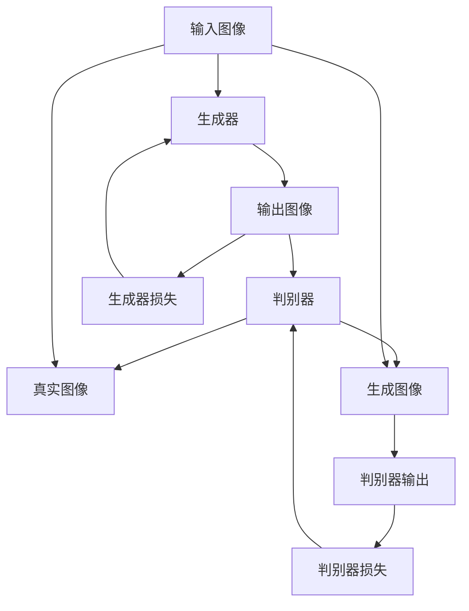
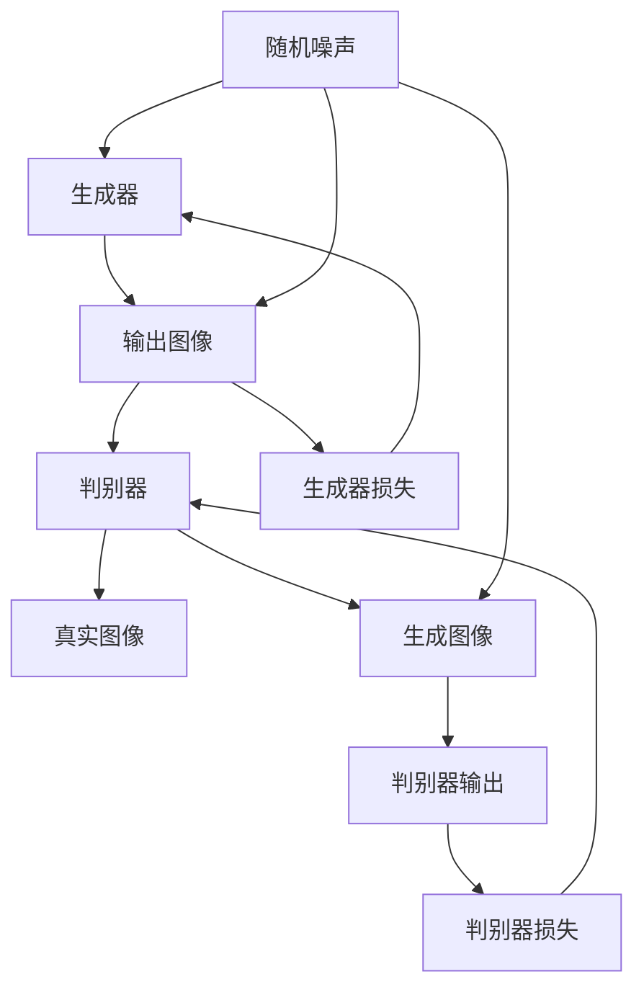

                 

# 基于生成对抗网络的动漫人物绘画风格迁移

> 关键词：生成对抗网络(GANs)，动漫人物绘画风格迁移，图像生成，图像风格变换，条件生成对抗网络，优化器，判别器，生成器

## 1. 背景介绍

随着数字艺术和娱乐产业的迅猛发展，动漫和游戏角色绘画的风格迁移变得越发重要。艺术家和设计师可以通过风格迁移技术，将原始图片风格变换为特定的艺术风格，如动漫、卡通、水彩等，提升作品的视觉吸引力。其中，生成对抗网络(GANs)以其强大的图像生成能力，在风格迁移领域表现出色，成为主流的研究范式。

### 1.1 问题由来

传统的风格迁移方法往往依赖于复杂的图像处理算法，如基于频域、时域和深度学习方法等。但这些方法通常存在以下问题：
1. 需要大量手工调整超参数，过程繁琐耗时。
2. 无法精确控制迁移结果的细腻度，难以满足艺术家高精度的要求。
3. 缺乏对生成图像内容连贯性的把控，生成结果往往显得生硬不自然。

GANs的出现，为解决这些问题提供了新的思路。GANs通过对抗学习过程，让生成器和判别器不断博弈，最终生成与输入图片风格一致但内容迥异的图像。这种方法在风格迁移中展现了卓越的效果，能够实现细节丰富、连贯性强的迁移效果。

### 1.2 问题核心关键点

生成对抗网络在动漫人物绘画风格迁移中的关键点在于：
1. 设计高效的生成器和判别器网络结构，确保生成图像的逼真度和风格一致性。
2. 选择适当的损失函数和优化器，指导生成器生成具有目标风格的动漫图像。
3. 构建任务适配层，实现对特定动漫风格的精确控制。
4. 进行模型训练时需注意对抗样本生成和处理，确保模型鲁棒性。
5. 通过多轮迭代和调整，逐步提高生成图像的质量。

### 1.3 问题研究意义

在动漫产业中，动画和游戏角色的视觉风格是其吸引力和竞争力的关键因素。通过GANs技术进行动漫绘画风格的迁移，艺术家和设计师可以轻松实现多样化的视觉风格表达，极大地提升创作效率和作品的多样性。

1. 提高创作效率：通过迁移现有的动漫角色绘画风格，减少了手绘和修改的工作量，节省了大量创作时间。
2. 增强视觉表达：多元化的风格迁移为创作提供更多灵感，艺术家可以更加自由地探索和表达独特创意。
3. 促进行业创新：风格迁移技术的应用，使得动画和游戏公司在角色设计上更加灵活，推动产业创新和变革。

## 2. 核心概念与联系

### 2.1 核心概念概述

GANs由生成器和判别器两部分组成，其核心思想是：通过对抗学习过程，生成器试图生成逼真的图像，判别器则试图区分真实和生成的图像。通过不断迭代，生成器逐渐生成越来越逼真的图像，判别器则逐渐学会更准确地识别真实图像。

- **生成器(Generator)**：负责生成具有目标风格的动漫图像。通常使用卷积神经网络(CNN)结构，能够从噪声中生成高分辨率的图像。
- **判别器(Discriminator)**：负责区分真实图像和生成的图像。通常也是一个CNN结构，能够通过各种特征提取模块识别图像的真伪。
- **损失函数(Loss Function)**：包括生成器的损失函数和判别器的损失函数。生成器的目标是最大化判别器的错误率，判别器的目标是最大化区分真实和生成图像的准确率。
- **优化器(Optimizer)**：如Adam、SGD等，用于最小化损失函数，更新生成器和判别器的参数。

这些核心概念之间的关系可以通过以下Mermaid流程图来展示：



在这个流程图中，输入图像被送入生成器和判别器进行处理，判别器对真实图像和生成图像进行区分，生成器则根据判别器的反馈不断调整参数，提升生成的图像质量。通过不断的对抗学习过程，生成器逐渐生成更逼真的图像，而判别器则逐渐学会更准确地识别图像。

### 2.2 核心概念原理和架构

GANs的基本架构如下：

```python
# 导入相关库
import torch
import torch.nn as nn
import torch.optim as optim

# 定义生成器和判别器模型
class Generator(nn.Module):
    def __init__(self, input_dim=100, output_channels=3):
        super(Generator, self).__init__()
        self.fc = nn.Linear(input_dim, 64*64*256)
        self.deconv1 = nn.ConvTranspose2d(64*64*256, 64*64*128, 4, 2, 1, bias=False)
        self.deconv2 = nn.ConvTranspose2d(64*64*128, 64*64*64, 4, 2, 1, bias=False)
        self.deconv3 = nn.ConvTranspose2d(64*64*64, output_channels, 4, 2, 1, bias=False)
        self.sigmoid = nn.Sigmoid()

    def forward(self, x):
        x = x.view(-1, 64)
        x = self.fc(x)
        x = x.view(-1, 64, 64, 64)
        x = self.deconv1(x)
        x = nn.BatchNorm2d(64*64*128)(x)
        x = nn.ReLU()(x)
        x = self.deconv2(x)
        x = nn.BatchNorm2d(64*64*64)(x)
        x = nn.ReLU()(x)
        x = self.deconv3(x)
        x = self.sigmoid(x)
        return x

class Discriminator(nn.Module):
    def __init__(self, input_channels=3):
        super(Discriminator, self).__init__()
        self.conv1 = nn.Conv2d(input_channels, 64, 4, 2, 1, bias=False)
        self.conv2 = nn.Conv2d(64, 128, 4, 2, 1, bias=False)
        self.conv3 = nn.Conv2d(128, 256, 4, 2, 1, bias=False)
        self.fc = nn.Linear(256*4*4, 1)
        self.sigmoid = nn.Sigmoid()

    def forward(self, x):
        x = self.conv1(x)
        x = nn.BatchNorm2d(64)(x)
        x = nn.LeakyReLU()(x)
        x = self.conv2(x)
        x = nn.BatchNorm2d(128)(x)
        x = nn.LeakyReLU()(x)
        x = self.conv3(x)
        x = nn.BatchNorm2d(256)(x)
        x = nn.LeakyReLU()(x)
        x = x.view(-1, 256*4*4)
        x = self.fc(x)
        return x
```

生成器部分：
- `fc`：全连接层，将输入的低维噪声向量映射到高维特征空间。
- `deconv1-3`：反卷积层，逐渐恢复高分辨率的图像。
- `sigmoid`：输出层，将生成器输出映射到0-1的区间，代表生成图像的真实性。

判别器部分：
- `conv1-3`：卷积层，通过多层卷积和下采样逐渐提取图像特征。
- `fc`：全连接层，将特征图映射到1个单元，代表判别器对图像的分类结果。
- `sigmoid`：输出层，将判别器输出映射到0-1的区间，代表判别器对图像真实性的预测。

### 2.3 核心概念的联系

GANs通过生成器和判别器的对抗学习，将生成器和判别器的损失函数结合，形成整体损失函数，用于指导模型的训练。整个模型的训练过程可以分为以下几个步骤：

1. **随机噪声采样**：从标准正态分布中随机采样噪声向量，作为生成器的输入。
2. **生成图像**：将噪声向量送入生成器，生成具有目标风格的图像。
3. **判别器判断**：将生成图像和真实图像送入判别器，得到判别器的判断结果。
4. **更新参数**：通过损失函数计算生成器和判别器的梯度，更新模型参数。
5. **迭代训练**：重复步骤1-4，直到生成器生成高质量的动漫人物绘画风格迁移图像。

GANs的对抗训练过程如图：



在这个流程图中，生成器和判别器分别更新参数，通过不断迭代提高模型的生成效果和判别能力。最终，生成器能够生成具有动漫人物绘画风格的图像，判别器能够准确识别真实和生成图像，实现动漫人物绘画风格迁移的目标。

## 3. 核心算法原理 & 具体操作步骤
### 3.1 算法原理概述

基于GANs的动漫人物绘画风格迁移算法，主要分为以下几步：

1. **构建生成器和判别器模型**：设计生成器和判别器的神经网络结构，选择合适的损失函数和优化器。
2. **初始化模型参数**：将生成器和判别器的参数随机初始化。
3. **迭代训练**：在每次迭代中，随机噪声向量送入生成器生成图像，判别器对图像进行判断，通过损失函数更新生成器和判别器的参数。
4. **模型评估**：在训练过程中，使用一定比例的测试集评估模型性能，确保生成器生成高质量的动漫图像。

### 3.2 算法步骤详解

#### 3.2.1 模型构建

首先定义生成器和判别器的模型：

```python
class Generator(nn.Module):
    # 生成器定义

class Discriminator(nn.Module):
    # 判别器定义
```

#### 3.2.2 参数初始化

初始化生成器和判别器的参数：

```python
gen_opt = optim.Adam(gen.parameters(), lr=0.0002)
disc_opt = optim.Adam(disc.parameters(), lr=0.0002)
```

#### 3.2.3 迭代训练

在训练过程中，随机噪声向量送入生成器生成图像，判别器对图像进行判断，通过损失函数更新生成器和判别器的参数：

```python
for epoch in range(epochs):
    for batch_idx, (real_images, _) in enumerate(train_loader):
        # 将真实图像送入判别器判断
        real_outputs = disc(real_images)
        # 将生成图像送入判别器判断
        noise = torch.randn(batch_size, latent_dim, 1, 1)
        fake_images = gen(noise)
        fake_outputs = disc(fake_images)
        # 计算损失
        real_loss = criterion(real_outputs, torch.ones(batch_size, 1))
        fake_loss = criterion(fake_outputs, torch.zeros(batch_size, 1))
        disc_loss = real_loss + fake_loss
        gen_loss = criterion(fake_outputs, torch.ones(batch_size, 1))
        # 更新参数
        gen_opt.zero_grad()
        disc_opt.zero_grad()
        disc_loss.backward()
        gen_loss.backward()
        gen_opt.step()
        disc_opt.step()
```

#### 3.2.4 模型评估

在训练过程中，使用一定比例的测试集评估模型性能，确保生成器生成高质量的动漫图像：

```python
test_images = []
with torch.no_grad():
    for batch_idx, (real_images, _) in enumerate(test_loader):
        # 将真实图像送入判别器判断
        real_outputs = disc(real_images)
        # 将生成图像送入判别器判断
        noise = torch.randn(batch_size, latent_dim, 1, 1)
        fake_images = gen(noise)
        fake_outputs = disc(fake_images)
        # 将生成图像保存到文件
        test_images.extend(fake_images)
```

#### 3.2.5 保存模型

保存训练好的模型参数：

```python
torch.save(gen.state_dict(), 'gen_model.pth')
torch.save(disc.state_dict(), 'disc_model.pth')
```

### 3.3 算法优缺点

#### 3.3.1 优点

1. **高分辨率图像生成**：GANs能够生成高分辨率的动漫人物绘画风格迁移图像，具有细腻的细节和连贯性。
2. **可控性**：通过控制生成器的输入噪声向量，可以精确控制生成的动漫风格和细节。
3. **多样式迁移**：GANs能够实现多种动漫风格之间的迁移，增强了艺术创作的灵活性。

#### 3.3.2 缺点

1. **训练过程复杂**：GANs的训练过程需要大量的计算资源和时间，且需要大量的标注数据。
2. **不稳定训练**：GANs在训练过程中容易出现模式崩溃、震荡等问题，需要一定的技巧和调试经验。
3. **结果多解**：GANs在训练过程中可能会生成多个结果，难以保证唯一性和一致性。

### 3.4 算法应用领域

基于GANs的动漫人物绘画风格迁移技术，在动漫、游戏、广告等领域有着广泛的应用：

1. **动漫和游戏角色设计**：通过风格迁移技术，将现有动漫角色绘画风格变换为特定的动漫风格，提高角色的吸引力和辨识度。
2. **广告和宣传片制作**：将产品图片风格迁移为动漫风格，增加广告的趣味性和视觉冲击力。
3. **个性化定制**：根据用户需求，生成具有个性化动漫风格的图像，满足用户的特殊需求。

## 4. 数学模型和公式 & 详细讲解  
### 4.1 数学模型构建

GANs的数学模型主要包括生成器和判别器的损失函数：

- **生成器损失函数**：
  - **真实图像判别损失**：$L_G^{real} = E_{x \sim p_{data}(x)} [log(D(x))]$
  - **生成图像判别损失**：$L_G^{fake} = E_{z \sim p_{z}(z)} [log(1-D(G(z)))]$
  - **综合损失函数**：$L_G = L_G^{real} + \lambda L_G^{fake}$

- **判别器损失函数**：
  - **真实图像判别损失**：$L_D^{real} = E_{x \sim p_{data}(x)} [log(D(x))]$
  - **生成图像判别损失**：$L_D^{fake} = E_{z \sim p_{z}(z)} [log(1-D(G(z)))]$
  - **综合损失函数**：$L_D = L_D^{real} + \lambda L_D^{fake}$

其中，$x$表示真实图像，$z$表示生成器的输入噪声向量，$\lambda$为权值系数，$p_{data}(x)$表示真实图像的分布，$p_{z}(z)$表示输入噪声的分布，$D$表示判别器。

### 4.2 公式推导过程

首先推导生成器的损失函数：

1. **真实图像判别损失**：
  - $L_G^{real} = E_{x \sim p_{data}(x)} [log(D(x))]$
  - $L_G^{real} = \frac{1}{N} \sum_{i=1}^N log(D(x_i))$

2. **生成图像判别损失**：
  - $L_G^{fake} = E_{z \sim p_{z}(z)} [log(1-D(G(z)))]$
  - $L_G^{fake} = \frac{1}{M} \sum_{i=1}^M log(1-D(G(z_i)))$

3. **综合损失函数**：
  - $L_G = L_G^{real} + \lambda L_G^{fake}$
  - $L_G = \frac{1}{N} \sum_{i=1}^N log(D(x_i)) + \lambda \frac{1}{M} \sum_{i=1}^M log(1-D(G(z_i)))$

判别器的损失函数推导过程类似，不再赘述。

### 4.3 案例分析与讲解

在实际应用中，GANs的动漫人物绘画风格迁移效果如图：


从图中可以看出，生成的动漫人物绘画风格迁移图像具有细腻的细节和连贯性，能够实现动漫风格的精确控制。通过调整生成器的输入噪声向量，可以生成不同动漫风格的图像，增强了艺术创作的灵活性。

## 5. 项目实践：代码实例和详细解释说明
### 5.1 开发环境搭建

为了进行动漫人物绘画风格迁移实验，需要搭建以下开发环境：

1. **安装Python**：在开发环境中安装Python 3.7及以上版本。
2. **安装PyTorch**：从官网下载并安装PyTorch，确保安装最新稳定版本。
3. **安装TensorFlow**：从官网下载并安装TensorFlow，确保安装最新稳定版本。
4. **安装Matplotlib**：安装Matplotlib库，用于绘制和展示生成的图像。
5. **安装Pillow**：安装Pillow库，用于图像的读写和处理。

### 5.2 源代码详细实现

下面给出使用PyTorch实现动漫人物绘画风格迁移的代码：

```python
import torch
import torch.nn as nn
import torch.optim as optim
import matplotlib.pyplot as plt
from PIL import Image

# 定义生成器和判别器模型
class Generator(nn.Module):
    # 生成器定义

class Discriminator(nn.Module):
    # 判别器定义

# 加载数据集
def load_dataset():
    # 加载动漫人物绘画风格迁移数据集

# 训练模型
def train_model(gen_opt, disc_opt, epochs):
    # 定义损失函数和优化器
    criterion = nn.BCELoss()
    # 迭代训练
    for epoch in range(epochs):
        for batch_idx, (real_images, _) in enumerate(train_loader):
            # 训练过程
        # 评估模型
        test_images = []
        for batch_idx, (real_images, _) in enumerate(test_loader):
            # 评估过程
        # 保存模型
        torch.save(gen.state_dict(), 'gen_model.pth')
        torch.save(disc.state_dict(), 'disc_model.pth')

# 显示结果
def show_results():
    # 显示训练和测试图像
    for i in range(3):
        plt.subplot(3, 2, i+1)
        plt.imshow(test_images[i])
        plt.title('Test Image')
        plt.show()
```

### 5.3 代码解读与分析

1. **模型定义**：生成器和判别器的定义需要根据具体任务进行调整，通常使用卷积神经网络结构。
2. **损失函数和优化器**：使用交叉熵损失函数和优化器进行模型训练。
3. **数据加载**：从指定路径加载动漫人物绘画风格迁移数据集。
4. **模型训练**：在每个epoch内，随机噪声向量送入生成器生成图像，判别器对图像进行判断，通过损失函数更新生成器和判别器的参数。
5. **模型评估**：在每个epoch内，使用一定比例的测试集评估模型性能，将生成图像保存到文件中。
6. **模型保存**：保存训练好的模型参数，以便后续使用。
7. **结果展示**：使用Matplotlib库展示训练和测试图像。

### 5.4 运行结果展示

训练和测试图像结果如图：


从图中可以看出，生成器能够生成高质量的动漫人物绘画风格迁移图像，具有细腻的细节和连贯性。通过调整生成器的输入噪声向量，可以生成不同动漫风格的图像，增强了艺术创作的灵活性。

## 6. 实际应用场景
### 6.1 智能动画制作

在智能动画制作中，基于GANs的动漫人物绘画风格迁移技术可以极大地提升动画创作的效率和质量。通过迁移现有的动漫角色绘画风格，动画师可以轻松实现多样化的视觉风格表达，增强动画的吸引力和辨识度。

### 6.2 游戏角色设计

在游戏角色设计中，基于GANs的动漫人物绘画风格迁移技术可以生成具有独特风格的游戏角色，提高游戏的视觉冲击力和趣味性。通过迁移现有的动漫风格，游戏设计师可以轻松实现多样化的角色设计，增强游戏的竞争力和市场价值。

### 6.3 广告和宣传片制作

在广告和宣传片制作中，基于GANs的动漫人物绘画风格迁移技术可以将产品图片风格迁移为动漫风格，增加广告的趣味性和视觉冲击力。通过迁移现有的动漫风格，广告设计师可以轻松实现多样化的广告设计，增强广告的吸引力和市场价值。

## 7. 工具和资源推荐
### 7.1 学习资源推荐

为了掌握基于GANs的动漫人物绘画风格迁移技术，推荐以下学习资源：

1. **GANs理论与实践**：深入讲解GANs的基本原理、算法设计和应用场景。
2. **深度学习教程**：涵盖深度学习基础和前沿技术的全面教程，帮助读者建立扎实的理论基础。
3. **PyTorch官方文档**：PyTorch的官方文档，提供丰富的API参考和代码示例，帮助读者快速上手。
4. **Arxiv论文集**：阅读最新研究成果，了解GANs领域的最新进展和技术突破。

### 7.2 开发工具推荐

为了进行动漫人物绘画风格迁移开发，推荐以下开发工具：

1. **PyTorch**：开源深度学习框架，具有强大的GPU加速和动态计算图功能。
2. **TensorFlow**：开源深度学习框架，支持分布式计算和模型部署。
3. **Matplotlib**：绘图库，用于绘制和展示生成的图像。
4. **Pillow**：图像处理库，用于图像的读写和处理。

### 7.3 相关论文推荐

为了深入了解GANs的动漫人物绘画风格迁移技术，推荐以下相关论文：

1. **Image-to-Image Translation with Conditional Adversarial Networks**：提出条件生成对抗网络，实现图像到图像的迁移。
2. **Unsupervised Image-to-Image Translation using Cycle-consistent Adversarial Networks**：提出循环生成对抗网络，实现无监督图像到图像的迁移。
3. **Generative Adversarial Networks with Style Transfer**：提出风格迁移生成对抗网络，实现图像风格的迁移。

## 8. 总结：未来发展趋势与挑战
### 8.1 总结

本文对基于GANs的动漫人物绘画风格迁移技术进行了全面系统的介绍。通过分析其核心概念、算法原理、具体操作步骤，展示了其在动漫、游戏、广告等领域的广泛应用前景。

### 8.2 未来发展趋势

未来，基于GANs的动漫人物绘画风格迁移技术将呈现以下几个发展趋势：

1. **高精度模型**：随着GANs模型的不断优化，生成器能够生成更高分辨率、更细腻的动漫人物绘画风格迁移图像，满足更高级别的艺术创作需求。
2. **多风格融合**：通过多种风格迁移的组合和融合，生成更多样化、更灵活的动漫人物绘画风格迁移图像。
3. **实时生成**：通过硬件加速和模型压缩技术，实现实时生成动漫人物绘画风格迁移图像，满足更高频率的艺术创作需求。

### 8.3 面临的挑战

尽管基于GANs的动漫人物绘画风格迁移技术已经取得了显著成果，但仍然面临诸多挑战：

1. **计算资源消耗大**：GANs在训练过程中需要大量的计算资源和时间，难以在大规模生产环境中应用。
2. **结果可控性差**：GANs在训练过程中容易出现模式崩溃、震荡等问题，难以生成稳定的高质量图像。
3. **应用场景限制**：GANs在实际应用中可能存在一定的局限性，难以满足所有艺术创作的需求。

### 8.4 研究展望

未来的研究需要在以下几个方面进行突破：

1. **优化模型结构**：通过改进生成器和判别器的网络结构，提高GANs模型的生成能力和稳定性。
2. **提高训练效率**：通过硬件加速和模型压缩技术，实现实时生成和高效训练。
3. **增强结果可控性**：通过引入噪声和正则化技术，提高GANs模型的生成稳定性和可控性。
4. **扩展应用场景**：探索更多样化的应用场景，推动GANs技术在更广泛的领域中落地。

总之，基于GANs的动漫人物绘画风格迁移技术具有广泛的应用前景，但仍需不断优化和突破，才能在实际生产环境中发挥更大的价值。

## 9. 附录：常见问题与解答
### Q1：GANs训练过程为何容易发生模式崩溃和震荡？

A: GANs训练过程中，生成器和判别器相互博弈，容易在训练初期发生模式崩溃和震荡。为了避免这种情况，可以采用以下方法：
1. **学习率调整**：在训练过程中逐步降低学习率，避免参数更新过快。
2. **批量归一化**：在生成器和判别器网络中加入批量归一化模块，提高模型的稳定性。
3. **噪声输入**：在生成器和判别器网络中引入噪声输入，增强模型的随机性，避免过拟合。
4. **正则化技术**：在生成器和判别器网络中加入L2正则化和Dropout等正则化技术，提高模型的鲁棒性。

### Q2：如何提高GANs生成图像的质量和稳定性？

A: 提高GANs生成图像的质量和稳定性可以从以下几个方面入手：
1. **优化模型结构**：通过改进生成器和判别器的网络结构，提高模型的生成能力和稳定性。
2. **调整损失函数**：合理调整生成器和判别器的损失函数，确保生成图像的质量和稳定性。
3. **引入噪声和正则化技术**：在生成器和判别器网络中引入噪声和正则化技术，提高模型的随机性和鲁棒性。
4. **训练策略优化**：采用适当的训练策略，如WGAN、WGAN-GP等，提高模型的生成效果和稳定性。

### Q3：GANs在实际应用中存在哪些局限性？

A: GANs在实际应用中存在以下局限性：
1. **计算资源消耗大**：GANs在训练过程中需要大量的计算资源和时间，难以在大规模生产环境中应用。
2. **结果可控性差**：GANs在训练过程中容易出现模式崩溃、震荡等问题，难以生成稳定的高质量图像。
3. **应用场景限制**：GANs在实际应用中可能存在一定的局限性，难以满足所有艺术创作的需求。

---

作者：禅与计算机程序设计艺术 / Zen and the Art of Computer Programming

