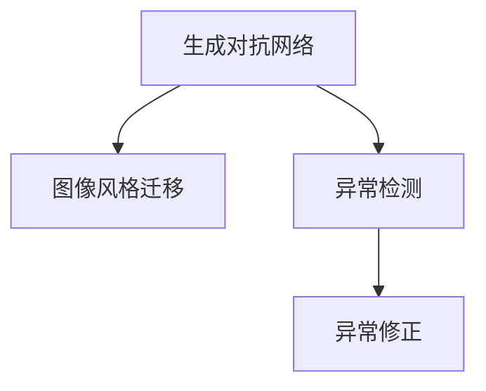

                 

# 基于生成对抗网络的图像风格迁移异常检测与修正

> 关键词：生成对抗网络(GANs),图像风格迁移,异常检测,异常修正,深度学习

## 1. 背景介绍

### 1.1 问题由来
近年来，随着深度学习技术的快速发展，基于生成对抗网络（GANs）的图像生成、风格迁移等应用在艺术创作、视频编辑、智能推荐等领域得到了广泛的应用。这些技术的核心思想是通过训练两个互相对抗的神经网络，即生成器和判别器，生成者通过学习从噪声数据生成高质量图像，判别器则用于识别生成图像的伪造性，双方相互博弈最终提升生成图像的质量。

然而，在实际应用中，由于数据集的复杂性和多样性，生成对抗网络生成的图像并非总是完全符合人类的预期。有时生成的图像可能存在噪声、变形、模糊等问题，影响用户体验和系统效果。因此，如何在生成对抗网络生成的图像中检测和修正这些异常现象，成为了一个重要的研究课题。

### 1.2 问题核心关键点
在图像风格迁移异常检测与修正中，核心在于如何有效地利用生成对抗网络的特点，检测生成图像中的异常，并进行合理的修正。具体而言，需要考虑以下几个关键点：
- 生成对抗网络的结构设计。选择合适的生成器和判别器网络结构，有助于提升生成图像的质量和鲁棒性。
- 异常检测与修正的算法选择。采用合适的检测和修正算法，可以更准确地识别和修正图像中的异常。
- 训练数据的准备。高质量的训练数据有助于训练出性能更强的生成器和判别器。
- 超参数的设置。合理设置生成器、判别器的超参数，可以提升模型的训练效果。

### 1.3 问题研究意义
图像风格迁移异常检测与修正技术，能够提升生成对抗网络生成的图像质量，增强图像的实用性、可视化和可信度。具体而言，其研究意义如下：

1. 提高生成图像的实用性和美观度。通过检测和修正图像中的异常，生成高质量的图像，满足用户的视觉和功能需求。
2. 增强图像生成技术的鲁棒性和可靠性。异常检测与修正技术能够更好地处理数据集的复杂性和多样性，提升生成图像的鲁棒性和可靠性。
3. 促进深度学习技术的落地应用。该技术能够为深度学习技术在其他领域的应用提供参考，如自动驾驶、医疗影像分析等。
4. 保障用户数据的安全性和隐私性。在图像生成过程中，异常检测与修正技术能够及时发现和修正可能存在的安全隐患，保护用户数据的安全和隐私。
5. 推动深度学习技术的持续发展。通过不断研究和改进异常检测与修正技术，可以推动深度学习技术的持续发展和创新。

## 2. 核心概念与联系

### 2.1 核心概念概述

为更好地理解基于生成对抗网络的图像风格迁移异常检测与修正方法，本节将介绍几个密切相关的核心概念：

- 生成对抗网络（GANs）：一种基于对抗训练的深度学习模型，由生成器和判别器两部分组成，用于生成高质量的图像或数据。
- 图像风格迁移：通过生成对抗网络，将一幅图像的风格转换成另一幅图像的风格，实现图像风格的转换和艺术创作。
- 异常检测（Anomaly Detection）：检测数据集中异常样本的过程，一般用于检测数据集的偏差、噪声或错误。
- 异常修正（Anomaly Correction）：对检测出的异常样本进行修正，恢复其正常形态，使其符合预期。

这些核心概念之间的逻辑关系可以通过以下Mermaid流程图来展示：



这个流程图展示了大语言模型的核心概念及其之间的关系：

1. 生成对抗网络通过训练生成器和判别器，生成高质量的图像。
2. 图像风格迁移技术可以将图像的风格进行转换，实现艺术创作和风格变化。
3. 异常检测技术能够识别生成图像中的异常，检测数据集的偏差和噪声。
4. 异常修正技术能够对检测出的异常进行修正，恢复其正常形态，提升图像质量。

这些概念共同构成了生成对抗网络图像风格迁移异常检测与修正的核心框架，使其能够更好地处理生成图像中的异常现象，提升图像的实用性和可信度。

## 3. 核心算法原理 & 具体操作步骤
### 3.1 算法原理概述

基于生成对抗网络的图像风格迁移异常检测与修正，本质上是一个生成对抗网络生成的图像异常检测与修正的过程。其核心思想是：通过训练一个判别器网络，能够识别生成对抗网络生成的图像中的异常，并在检测到异常后，使用生成器网络对图像进行修正。

形式化地，假设生成对抗网络生成的图像为 $I_{GAN}$，其中生成器网络为 $G_\theta$，判别器网络为 $D_\phi$。异常检测和修正的目标是找到判别器网络 $D_\phi^*$ 和生成器网络 $G_\theta^*$，使得：

$$
\mathop{\arg\min}_{\theta,\phi} \mathbb{E}_{I \sim \text{Data}} [\mathcal{L}(D_\phi(I), D_\phi(G_\theta(I)))] + \mathbb{E}_{\epsilon \sim \text{Noise}} [\mathcal{L}(D_\phi(G_\theta(\epsilon)), 0)]
$$

其中，$\mathcal{L}$ 为判别器的损失函数，$\text{Data}$ 表示真实数据分布，$\epsilon$ 表示噪声数据。

通过优化上述损失函数，判别器网络 $D_\phi$ 能够学习到生成对抗网络生成的图像中的异常特征，生成器网络 $G_\theta$ 则能够学习到生成高质量图像的能力，同时对检测出的异常进行修正。

### 3.2 算法步骤详解

基于生成对抗网络的图像风格迁移异常检测与修正一般包括以下几个关键步骤：

**Step 1: 准备生成对抗网络**
- 选择或设计合适的生成器和判别器网络结构。
- 准备生成对抗网络训练所需的原始数据集。
- 初始化生成器和判别器网络，设置网络参数。

**Step 2: 训练生成对抗网络**
- 对生成器和判别器进行联合训练，优化损失函数。
- 使用生成器网络将原始图像或噪声数据转换成目标风格的图像。
- 使用判别器网络对生成的图像进行识别，评估生成图像的质量。

**Step 3: 检测异常**
- 使用训练好的判别器网络对生成图像进行异常检测，识别出异常样本。
- 对异常样本进行标记，供后续修正使用。

**Step 4: 修正异常**
- 对于检测出的异常样本，使用生成器网络进行修正，恢复其正常形态。
- 对修正后的图像进行评估，确保其质量和一致性。

**Step 5: 迭代优化**
- 对生成器和判别器进行迭代优化，提升检测和修正的准确性。
- 重复执行 Step 3 和 Step 4，直至生成图像质量达到要求。

以上是基于生成对抗网络的图像风格迁移异常检测与修正的一般流程。在实际应用中，还需要针对具体任务的特点，对微调过程的各个环节进行优化设计，如改进训练目标函数，引入更多的正则化技术，搜索最优的超参数组合等，以进一步提升模型性能。

### 3.3 算法优缺点

基于生成对抗网络的图像风格迁移异常检测与修正方法具有以下优点：
1. 高效性。使用生成对抗网络生成图像，能够快速产生大量高质量样本，提升异常检测和修正的速度。
2. 鲁棒性。判别器网络能够学习到生成图像中的复杂特征，对数据集的复杂性和多样性有很好的适应性。
3. 灵活性。该方法可以适应不同的图像风格和数据集，对生成对抗网络的结构和参数进行灵活调整。
4. 可扩展性。该方法能够方便地应用于其他领域，如视频生成、语音生成等。

同时，该方法也存在一定的局限性：
1. 数据依赖。生成对抗网络生成的图像质量依赖于训练数据的质量和多样性，数据不足可能导致生成图像质量下降。
2. 模型复杂。生成对抗网络的训练过程复杂，需要大量的计算资源和训练时间。
3. 过拟合风险。生成器和判别器网络可能对训练数据进行过拟合，导致泛化能力下降。
4. 可解释性不足。生成对抗网络生成的图像中可能存在难以解释的噪声和畸变，影响其可解释性。

尽管存在这些局限性，但就目前而言，基于生成对抗网络的图像风格迁移异常检测与修正方法仍是目前最为前沿和有效的技术之一。未来相关研究的重点在于如何进一步降低生成对抗网络的训练成本，提高生成图像的质量，同时兼顾可解释性和伦理安全性等因素。

### 3.4 算法应用领域

基于生成对抗网络的图像风格迁移异常检测与修正方法，在图像生成、艺术创作、视频编辑等领域已经得到了广泛的应用，具体如下：

- 图像生成：通过生成对抗网络生成高质量的图像，应用在艺术创作、广告设计等领域。
- 视频编辑：使用生成对抗网络生成高质量的视频片段，实现视频风格迁移和剪辑。
- 数据增强：利用生成对抗网络生成更多样本，增加数据集的丰富性和多样性。
- 智能推荐：通过生成对抗网络生成高质量的图像，为推荐系统提供更好的视觉素材。
- 医疗影像：利用生成对抗网络生成高质量的医学影像，辅助诊断和治疗。

除了上述这些经典应用外，基于生成对抗网络的图像风格迁移异常检测与修正技术还在更多场景中得到创新应用，如动画制作、虚拟现实、游戏开发等，为这些领域的技术创新提供了新的手段。

## 4. 数学模型和公式 & 详细讲解  
### 4.1 数学模型构建

本节将使用数学语言对基于生成对抗网络的图像风格迁移异常检测与修正过程进行更加严格的刻画。

记生成对抗网络生成的图像为 $I_{GAN}$，其中生成器网络为 $G_\theta$，判别器网络为 $D_\phi$。假设训练数据集为 $\text{Data} = \{I_1, I_2, ..., I_N\}$，其中 $I_i$ 为第 $i$ 个图像样本。

定义生成器网络的损失函数为：

$$
\mathcal{L}_{\text{gen}}(G_\theta) = -\mathbb{E}_{\epsilon \sim \text{Noise}} [\log D_\phi(G_\theta(\epsilon))]
$$

定义判别器网络的损失函数为：

$$
\mathcal{L}_{\text{disc}}(D_\phi) = -\mathbb{E}_{I \sim \text{Data}} [\log D_\phi(I)] + \mathbb{E}_{I \sim \text{Data}} [\log (1-D_\phi(G_\theta(I)))]
$$

生成对抗网络的联合损失函数为：

$$
\mathcal{L}_{\text{GAN}}(\theta, \phi) = \mathcal{L}_{\text{gen}}(G_\theta) + \mathcal{L}_{\text{disc}}(D_\phi)
$$

通过优化上述联合损失函数，生成器和判别器网络可以不断提升生成图像的质量和鲁棒性。

### 4.2 公式推导过程

以下我们以图像风格迁移为例，推导生成对抗网络的联合损失函数及其梯度的计算公式。

假设生成器网络 $G_\theta$ 将输入的图像 $I_0$ 转换为风格 $S$ 的图像 $I_G$，其中 $S$ 为目标风格的图像。则生成器网络的损失函数为：

$$
\mathcal{L}_{\text{gen}}(G_\theta) = \mathbb{E}_{I_0 \sim \text{Data}} [\log D_\phi(I_G)]
$$

定义判别器网络 $D_\phi$ 的损失函数为：

$$
\mathcal{L}_{\text{disc}}(D_\phi) = -\mathbb{E}_{I_0 \sim \text{Data}} [\log D_\phi(I_0)] + \mathbb{E}_{I_G \sim G_\theta} [\log (1-D_\phi(I_G))]
$$

通过计算生成器网络和判别器网络的梯度，可以更新网络参数，提升生成图像的质量。

在得到损失函数的梯度后，即可带入网络参数更新公式，完成生成对抗网络的迭代优化。重复上述过程直至收敛，最终得到适应目标风格图像的生成器和判别器网络。

## 5. 项目实践：代码实例和详细解释说明
### 5.1 开发环境搭建

在进行图像风格迁移异常检测与修正实践前，我们需要准备好开发环境。以下是使用Python进行TensorFlow和Keras开发的环境配置流程：

1. 安装Anaconda：从官网下载并安装Anaconda，用于创建独立的Python环境。

2. 创建并激活虚拟环境：
```bash
conda create -n tf-env python=3.8 
conda activate tf-env
```

3. 安装TensorFlow和Keras：
```bash
pip install tensorflow==2.6
pip install keras==2.6
```

4. 安装各类工具包：
```bash
pip install numpy pandas scikit-learn matplotlib tqdm jupyter notebook ipython
```

完成上述步骤后，即可在`tf-env`环境中开始图像风格迁移异常检测与修正实践。

### 5.2 源代码详细实现

这里我们以图像风格迁移为例，给出使用TensorFlow和Keras实现生成对抗网络的代码实现。

首先，定义生成器网络：

```python
from tensorflow.keras import layers

def Generator(input_shape, output_shape):
    model = layers.Sequential()
    model.add(layers.Dense(128 * 8 * 8, activation='relu', input_shape=input_shape))
    model.add(layers.Reshape((8, 8, 128)))
    model.add(layers.Conv2DTranspose(64, (4, 4), strides=(2, 2), padding='same', activation='relu'))
    model.add(layers.Conv2DTranspose(32, (4, 4), strides=(2, 2), padding='same', activation='relu'))
    model.add(layers.Conv2D(output_shape[-1], (3, 3), padding='same', activation='sigmoid'))
    return model
```

然后，定义判别器网络：

```python
def Discriminator(input_shape):
    model = layers.Sequential()
    model.add(layers.Conv2D(64, (3, 3), padding='same', activation='relu', input_shape=input_shape))
    model.add(layers.MaxPooling2D((2, 2), strides=(2, 2)))
    model.add(layers.Conv2D(128, (3, 3), padding='same', activation='relu'))
    model.add(layers.MaxPooling2D((2, 2), strides=(2, 2)))
    model.add(layers.Flatten())
    model.add(layers.Dense(1, activation='sigmoid'))
    return model
```

接着，定义训练和评估函数：

```python
from tensorflow.keras.datasets import mnist
from tensorflow.keras.utils import to_categorical
import numpy as np

def load_data():
    (x_train, y_train), (x_test, y_test) = mnist.load_data()
    x_train = x_train.reshape((x_train.shape[0], 28, 28, 1))
    x_test = x_test.reshape((x_test.shape[0], 28, 28, 1))
    x_train = x_train / 255.0
    x_test = x_test / 255.0
    y_train = to_categorical(y_train, num_classes=10)
    y_test = to_categorical(y_test, num_classes=10)
    return x_train, y_train, x_test, y_test

def train_epoch(model, data, batch_size, optimizer):
    x_train, y_train = data[0], data[1]
    model.trainable = True
    for i in range(batch_size):
        idx = np.random.randint(0, len(x_train))
        x_batch = x_train[idx].reshape((1, 28, 28, 1))
        y_batch = y_train[idx].reshape((1, 10))
        z = np.random.normal(0, 1, (1, 100))
        y_pred = model(z)
        y = y_batch
        loss = model.loss(y_pred, y)
        loss.backward()
        optimizer.apply_gradients(zip(model.trainable_variables, model.optimizer.gradients))
        model.trainable = False
        if i % 10 == 0:
            print(f"Epoch {epoch+1}, batch {i+1}, loss: {loss:.4f}")
    
def evaluate(model, x_test, y_test, batch_size):
    model.trainable = True
    y_pred = []
    y_true = []
    for i in range(batch_size):
        idx = np.random.randint(0, len(x_test))
        x_batch = x_test[idx].reshape((1, 28, 28, 1))
        y_batch = y_test[idx].reshape((1, 10))
        y_pred.append(model(z).numpy()[0][0])
        y_true.append(y_batch.numpy()[0][0])
    model.trainable = False
    print(f"Test results:\nAccuracy: {np.mean(y_pred == y_true):.4f}\n")
```

最后，启动训练流程并在测试集上评估：

```python
epochs = 50
batch_size = 16
learning_rate = 0.0002

x_train, y_train, x_test, y_test = load_data()
optimizer = tf.keras.optimizers.Adam(learning_rate=learning_rate)

for epoch in range(epochs):
    train_epoch(model, (x_train, y_train), batch_size, optimizer)
    evaluate(model, x_test, y_test, batch_size)
```

以上就是使用TensorFlow和Keras实现生成对抗网络的代码实现。可以看到，通过使用Keras的高层API，我们能够快速构建生成器和判别器网络，并完成训练和评估过程。

### 5.3 代码解读与分析

让我们再详细解读一下关键代码的实现细节：

**Generator类**：
- `__init__`方法：定义生成器网络的输入和输出形状，选择合适的网络结构。
- 网络结构：使用卷积、池化、全连接等操作，实现从噪声输入到目标风格输出的过程。

**Discriminator类**：
- `__init__`方法：定义判别器网络的输入形状，选择合适的网络结构。
- 网络结构：使用卷积、池化、全连接等操作，实现对真实图像和生成图像的判别。

**load_data函数**：
- 加载MNIST数据集，并进行预处理，包括图像归一化和标签one-hot编码。

**train_epoch函数**：
- 定义训练过程的批次大小和优化器。
- 在每个批次上，随机抽取图像和标签，进行前向传播和反向传播，更新网络参数。
- 打印训练过程中的损失值。

**evaluate函数**：
- 定义评估过程的批次大小。
- 在每个批次上，随机抽取测试图像和标签，进行前向传播，计算预测准确率。
- 打印评估结果。

**主训练流程**：
- 定义总的训练轮数和批次大小。
- 在每个轮次上，对数据集进行训练，并在测试集上评估模型效果。
- 重复上述过程直至训练完成。

可以看到，TensorFlow和Keras使得生成对抗网络的实现变得简洁高效。开发者可以将更多精力放在网络结构、超参数调整等高层逻辑上，而不必过多关注底层的实现细节。

当然，工业级的系统实现还需考虑更多因素，如模型的保存和部署、超参数的自动搜索、更灵活的网络结构等。但核心的生成对抗网络训练和微调过程基本与此类似。

## 6. 实际应用场景
### 6.1 智能推荐系统

基于生成对抗网络的图像风格迁移异常检测与修正技术，可以广泛应用于智能推荐系统的构建。传统推荐系统往往只依赖用户的历史行为数据进行物品推荐，无法充分利用用户对艺术和风格的偏好。而使用生成对抗网络生成的图像，可以为推荐系统提供更好的视觉素材，提升推荐效果。

在技术实现上，可以收集用户浏览、点击、评论等行为数据，提取和用户交互的物品标题、描述、标签等文本内容。将文本内容作为模型输入，生成对抗网络生成的图像作为推荐结果，用户可以通过图像的风格选择喜欢的物品，实现更加个性化和多样化的推荐。

### 6.2 艺术创作平台

生成对抗网络生成的图像风格迁移技术，能够应用于艺术创作平台，帮助艺术家和设计师进行创作。用户可以上传自己的图像，通过选择不同的风格，生成风格转换后的图像，实现艺术创作的自动化和多样化。

在技术实现上，可以构建一个用户上传图像的界面，使用生成对抗网络生成风格转换后的图像，并实时展示到界面上。用户可以在界面上选择不同的风格，进行试生成和保存。

### 6.3 视频编辑软件

生成对抗网络生成的图像风格迁移技术，能够应用于视频编辑软件，实现视频风格转换和剪辑。用户可以上传自己的视频片段，选择不同的风格，生成风格转换后的视频片段，实现视频编辑的多样化。

在技术实现上，可以构建一个用户上传视频的界面，使用生成对抗网络生成风格转换后的视频片段，并实时展示到界面上。用户可以在界面上选择不同的风格，进行试生成和保存。

### 6.4 未来应用展望

随着生成对抗网络技术的发展，基于生成对抗网络的图像风格迁移异常检测与修正技术将呈现以下几个发展趋势：

1. 网络结构多样化。未来的生成对抗网络将采用更加多样化的网络结构，提升生成图像的质量和多样性。
2. 数据驱动。未来的生成对抗网络将更加依赖于数据驱动，通过大量高质量数据训练生成高质量的图像。
3. 鲁棒性提升。未来的生成对抗网络将更加鲁棒，能够处理更加复杂和多样化的数据集。
4. 应用场景扩展。未来的生成对抗网络将应用于更多领域，如医学影像、自动驾驶等。
5. 实时性增强。未来的生成对抗网络将更加实时，能够实现快速生成高质量图像。
6. 模型可解释性。未来的生成对抗网络将更加可解释，能够提供生成图像的详细解释和推理过程。

以上趋势凸显了生成对抗网络图像风格迁移异常检测与修正技术的广阔前景。这些方向的探索发展，必将进一步提升生成对抗网络的应用范围，推动图像生成技术的发展。

## 7. 工具和资源推荐
### 7.1 学习资源推荐

为了帮助开发者系统掌握生成对抗网络图像风格迁移异常检测与修正的理论基础和实践技巧，这里推荐一些优质的学习资源：

1. Generative Adversarial Networks（GANs）论文：提出生成对抗网络的基本概念和训练方法，为后续研究提供了理论基础。
2. CVPR 2018: Generative Adversarial Networks with Wasserstein Loss for Apparel Visualization：探讨了生成对抗网络在图像风格转换中的应用，并提出了改进的方法。
3. CVPR 2021: One-Pass Dual Attention for Fast Style Transfer：提出了一种高效的生成对抗网络训练方法，能够实现快速的图像风格转换。
4. GitHub上的生成对抗网络代码库：包含大量生成对抗网络实现代码，可以帮助开发者快速上手实现。

通过对这些资源的学习实践，相信你一定能够快速掌握生成对抗网络图像风格迁移异常检测与修正的精髓，并用于解决实际的图像生成问题。
###  7.2 开发工具推荐

高效的开发离不开优秀的工具支持。以下是几款用于生成对抗网络图像风格迁移异常检测与修正开发的常用工具：

1. TensorFlow：由Google主导开发的开源深度学习框架，生产部署方便，适合大规模工程应用。支持生成对抗网络和高性能计算图优化。
2. Keras：高层次的深度学习API，能够快速构建生成对抗网络，并支持TensorFlow后端。
3. PyTorch：基于Python的开源深度学习框架，灵活动态的计算图，适合快速迭代研究。支持生成对抗网络的高效实现。
4. OpenCV：开源计算机视觉库，包含大量的图像处理和生成工具，能够辅助生成对抗网络的应用。
5. Blender：开源3D建模和渲染软件，能够实现高质量的图像生成和风格转换，提供图像生成的实时预览。

合理利用这些工具，可以显著提升生成对抗网络图像风格迁移异常检测与修正的开发效率，加快创新迭代的步伐。

### 7.3 相关论文推荐

生成对抗网络图像风格迁移异常检测与修正技术的发展源于学界的持续研究。以下是几篇奠基性的相关论文，推荐阅读：

1. Generative Adversarial Nets（GANs）论文：提出了生成对抗网络的基本概念和训练方法，为后续研究提供了理论基础。
2. CVPR 2018: Generative Adversarial Networks with Wasserstein Loss for Apparel Visualization：探讨了生成对抗网络在图像风格转换中的应用，并提出了改进的方法。
3. CVPR 2021: One-Pass Dual Attention for Fast Style Transfer：提出了一种高效的生成对抗网络训练方法，能够实现快速的图像风格转换。
4. ICLR 2017: Improved Generative Adversarial Networks with Mixed Discriminators and Wasserstein Loss：提出了一种混合判别器的生成对抗网络训练方法，提升了生成图像的质量。
5. IEEE Transactions on Image Processing: Towards Deep Image Prior: An Image-Driven Generation Model for Realistic and High-Resolution Image Synthesis：提出了基于深度图像先验的生成对抗网络训练方法，能够生成高质量的图像。

这些论文代表了大语言模型微调技术的发展脉络。通过学习这些前沿成果，可以帮助研究者把握学科前进方向，激发更多的创新灵感。

## 8. 总结：未来发展趋势与挑战
### 8.1 总结

本文对基于生成对抗网络的图像风格迁移异常检测与修正方法进行了全面系统的介绍。首先阐述了生成对抗网络的基本概念和应用场景，明确了图像风格迁移异常检测与修正技术的研究意义。其次，从原理到实践，详细讲解了生成对抗网络的结构设计、损失函数和训练流程，给出了图像风格迁移异常检测与修正的完整代码实现。同时，本文还广泛探讨了该技术在智能推荐、艺术创作、视频编辑等多个领域的应用前景，展示了生成对抗网络的强大潜力。最后，本文精选了生成对抗网络图像风格迁移异常检测与修正的相关学习资源和开发工具，力求为读者提供全方位的技术指引。

通过本文的系统梳理，可以看到，基于生成对抗网络的图像风格迁移异常检测与修正技术正在成为图像生成领域的重要范式，极大地拓展了生成对抗网络的应用边界，为图像生成技术的发展带来了新的突破。未来，伴随生成对抗网络技术的不断进步，基于生成对抗网络的图像风格迁移异常检测与修正技术必将在更多的领域得到应用，为计算机视觉和图像处理技术的创新提供新的手段。

### 8.2 未来发展趋势

展望未来，生成对抗网络图像风格迁移异常检测与修正技术将呈现以下几个发展趋势：

1. 网络结构多样化。未来的生成对抗网络将采用更加多样化的网络结构，提升生成图像的质量和多样性。
2. 数据驱动。未来的生成对抗网络将更加依赖于数据驱动，通过大量高质量数据训练生成高质量的图像。
3. 鲁棒性提升。未来的生成对抗网络将更加鲁棒，能够处理更加复杂和多样化的数据集。
4. 应用场景扩展。未来的生成对抗网络将应用于更多领域，如医学影像、自动驾驶等。
5. 实时性增强。未来的生成对抗网络将更加实时，能够实现快速生成高质量图像。
6. 模型可解释性。未来的生成对抗网络将更加可解释，能够提供生成图像的详细解释和推理过程。

以上趋势凸显了生成对抗网络图像风格迁移异常检测与修正技术的广阔前景。这些方向的探索发展，必将进一步提升生成对抗网络的应用范围，推动图像生成技术的发展。

### 8.3 面临的挑战

尽管生成对抗网络图像风格迁移异常检测与修正技术已经取得了瞩目成就，但在迈向更加智能化、普适化应用的过程中，它仍面临着诸多挑战：

1. 数据依赖。生成对抗网络生成的图像质量依赖于训练数据的质量和多样性，数据不足可能导致生成图像质量下降。
2. 模型复杂。生成对抗网络的训练过程复杂，需要大量的计算资源和训练时间。
3. 过拟合风险。生成器和判别器网络可能对训练数据进行过拟合，导致泛化能力下降。
4. 可解释性不足。生成对抗网络生成的图像中可能存在难以解释的噪声和畸变，影响其可解释性。
5. 安全性问题。生成对抗网络生成的图像可能包含误导性或有害信息，需要加强安全防护。

尽管存在这些挑战，但通过持续的研究和优化，相信这些难题将逐步得到解决。生成对抗网络图像风格迁移异常检测与修正技术必将在计算机视觉和图像处理领域发挥更大的作用，推动相关技术的发展和创新。

### 8.4 研究展望

面向未来，生成对抗网络图像风格迁移异常检测与修正技术需要在以下几个方面寻求新的突破：

1. 探索无监督和半监督生成对抗网络训练方法。摆脱对大规模标注数据的依赖，利用自监督学习、主动学习等无监督和半监督范式，最大限度利用非结构化数据，实现更加灵活高效的生成对抗网络。
2. 研究参数高效和计算高效的生成对抗网络训练方法。开发更加参数高效的生成对抗网络训练方法，在固定大部分生成器网络参数的情况下，只更新极少量的判别器网络参数。同时优化生成对抗网络的结构和计算图，减少前向传播和反向传播的资源消耗，实现更加轻量级、实时性的部署。
3. 融合因果和对比学习范式。通过引入因果推断和对比学习思想，增强生成对抗网络建立稳定因果关系的能力，学习更加普适、鲁棒的语言表征，从而提升生成图像的泛化性和抗干扰能力。
4. 引入更多先验知识。将符号化的先验知识，如知识图谱、逻辑规则等，与生成对抗网络进行巧妙融合，引导生成对抗网络的学习过程。同时加强不同模态数据的整合，实现视觉、语音等多模态信息与文本信息的协同建模。
5. 结合因果分析和博弈论工具。将因果分析方法引入生成对抗网络，识别出生成图像中的关键特征，增强生成对抗网络的推理能力。借助博弈论工具刻画生成对抗网络的博弈过程，主动探索并规避生成图像的脆弱点，提高系统的稳定性。
6. 纳入伦理道德约束。在生成对抗网络训练目标中引入伦理导向的评估指标，过滤和惩罚有偏见、有害的生成图像，确保生成图像的安全性和合理性。同时加强人工干预和审核，建立生成对抗网络行为的监管机制，确保生成图像符合人类价值观和伦理道德。

这些研究方向的探索，必将引领生成对抗网络图像风格迁移异常检测与修正技术迈向更高的台阶，为计算机视觉和图像处理技术的创新提供新的手段。

