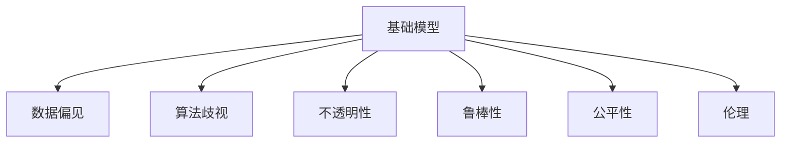

                 

# 基础模型的公平与伦理问题

## 1. 背景介绍

### 1.1 问题由来
人工智能（AI）技术正在飞速发展，基础模型如深度学习、神经网络等在众多领域展现了强大的应用能力。然而，伴随着这些技术的发展，基础模型中的公平与伦理问题也逐渐凸显出来。比如在就业推荐、医疗诊断、金融贷款等实际应用中，由于数据偏见、算法歧视等原因，模型预测结果可能导致不公平、偏见或者不准确的决策，从而引发伦理风险。这些问题不仅影响用户对AI的信任，还可能带来法律、社会等多方面的风险。因此，如何保证基础模型的公平与伦理，成为一个亟待解决的重要课题。

### 1.2 问题核心关键点
公平与伦理问题是AI系统面临的核心挑战之一，涉及模型的输入数据、模型设计和应用场景等多个方面。主要包括以下几个关键点：

- **数据偏见**：模型训练时使用的数据如果存在偏见，模型会学习并放大这种偏见，导致不公平的预测结果。
- **算法歧视**：模型设计或训练过程中，由于目标函数、损失函数等的选择不当，可能产生对某些群体或个体的歧视。
- **不透明性**：黑箱模型难以解释其决策逻辑，导致用户对AI的信任度降低。
- **模型鲁棒性**：模型对输入数据的不良扰动或对抗攻击敏感，可能产生不可控的预测结果。

这些核心问题不仅影响AI技术的公正性和可靠性，还可能导致严重的伦理问题和社会后果。因此，在基础模型开发和应用过程中，需要综合考虑这些公平与伦理问题，设计合理、公平且可解释的AI系统。

### 1.3 问题研究意义
研究基础模型的公平与伦理问题，对于确保AI技术的健康发展具有重要意义：

- **增强信任度**：解决公平与伦理问题，可以提升用户对AI系统的信任度，推动AI技术的广泛应用。
- **保障公平性**：通过公平与伦理设计，确保AI系统不会产生对某些群体或个体的歧视，维护社会公正。
- **提升透明度**：可解释的AI系统可以提供透明的决策过程，帮助用户理解AI预测的依据，提升系统可靠性。
- **减少风险**：公平与伦理设计的AI系统可以减少法律风险和社会风险，促进社会和谐。

## 2. 核心概念与联系

### 2.1 核心概念概述

为更好地理解基础模型中的公平与伦理问题，本节将介绍几个密切相关的核心概念：

- **公平性(Fairness)**：指AI系统对不同群体或个体的决策结果公正无歧视。在就业推荐、医疗诊断、金融贷款等场景中，模型应避免对某些群体产生不公正的待遇。
- **伦理(Ethics)**：指AI系统在设计和应用过程中遵循的道德规范和社会价值观。伦理设计包括对隐私保护、数据安全、社会影响等各方面进行考量。
- **偏见(Bias)**：指模型在训练数据中学习到的与事实不符的倾向性，可能导致不公平的预测结果。数据偏见、算法偏见等都是常见的偏见类型。
- **可解释性(Explainability)**：指AI系统的决策过程透明，用户可以理解和解释模型的预测结果。可解释性有助于提升用户信任，促进模型应用的普及。
- **鲁棒性(Robustness)**：指模型对输入数据的扰动或对抗攻击具有一定程度的鲁棒性，防止模型被恶意攻击或数据污染导致预测结果不可控。

这些核心概念之间的逻辑关系可以通过以下Mermaid流程图来展示：



这个流程图展示了几大核心概念以及它们之间的关系：

1. 基础模型通过数据偏见、算法歧视等过程形成预测结果，而这些过程又受到不透明性和鲁棒性的影响。
2. 公平性是基础模型的目标之一，需要通过优化偏见、歧视等问题来实现。
3. 伦理是设计基础模型的原则，确保其应用不违反社会价值观和道德规范。

这些概念共同构成了基础模型公平与伦理问题的研究框架，指引开发者在设计模型时综合考虑这些因素。

## 3. 核心算法原理 & 具体操作步骤
### 3.1 算法原理概述

基础模型的公平与伦理问题解决主要依赖于以下几种核心算法原理：

- **数据清洗与平衡**：通过清洗数据和调整数据权重，减少数据偏见和偏差。
- **算法公平约束**：通过公平约束优化算法，减少算法歧视。
- **可解释性增强**：通过模型解释技术和可视化工具，增强模型的可解释性。
- **鲁棒性提升**：通过对抗训练、噪声注入等技术，提升模型的鲁棒性。

这些算法原理在实际应用中需要灵活组合，并根据具体任务和数据特点进行优化。

### 3.2 算法步骤详解

以下是一般的公平与伦理算法步骤：

**Step 1: 数据预处理**
- 收集基础数据，并检查数据分布情况。
- 清洗数据，删除异常值和噪声，并处理缺失值。
- 进行数据平衡，确保不同群体之间样本数量均衡。

**Step 2: 模型选择与训练**
- 选择适当的模型架构和训练方法。
- 设计损失函数和优化器，确保模型公平性和可解释性。
- 在训练过程中加入公平约束，如公平性约束损失。

**Step 3: 模型评估与调整**
- 在训练集和验证集上评估模型性能。
- 进行公平性评估，检查模型是否存在歧视问题。
- 根据评估结果调整模型参数，优化模型公平性和鲁棒性。

**Step 4: 模型部署与监控**
- 将模型部署到实际应用场景中。
- 定期监控模型性能和公平性，检测和修复潜在问题。
- 进行后续优化，提升模型效果和鲁棒性。

### 3.3 算法优缺点

公平与伦理问题解决算法具有以下优点：

- **减少偏见**：通过数据清洗和公平约束，可以减少模型中的数据偏见和算法歧视。
- **提高透明性**：增强模型的可解释性，提升用户信任度和系统可靠性。
- **提升鲁棒性**：通过鲁棒性提升技术，确保模型对异常输入和攻击有较强的抵抗能力。

同时，这些算法也存在一定的局限性：

- **数据依赖**：依赖高质量的数据和标注，数据不平衡和噪声会导致模型性能下降。
- **模型复杂性**：复杂的公平约束和可解释性增强算法可能导致模型计算量增加，降低模型效率。
- **伦理挑战**：在面对伦理问题时，如何设计公平性和透明性仍然是一个复杂的难题。

尽管存在这些局限性，但公平与伦理问题解决算法仍然是实现公平AI系统的核心技术。未来研究需要进一步优化数据处理和模型设计，提升算法效率和效果。

### 3.4 算法应用领域

公平与伦理问题解决算法在多个领域得到了广泛应用：

- **就业推荐**：使用公平与伦理设计，确保推荐系统不会对某些群体产生歧视，提升推荐结果的公正性。
- **医疗诊断**：在医疗数据中发现并消除偏见，确保诊断模型的公平性，减少误诊率。
- **金融贷款**：设计公平贷款评分模型，确保对不同群体公平，防止金融歧视。
- **司法判决**：通过透明性和可解释性设计，提升司法判决的公正性和可信度。
- **公共安全**：在安防系统中应用公平与伦理设计，确保系统不侵害隐私权利，防止算法歧视。

这些领域的应用展示了公平与伦理问题解决算法的广泛适用性，对于构建公正、透明、可信的AI系统具有重要意义。

## 4. 数学模型和公式 & 详细讲解 & 举例说明

### 4.1 数学模型构建

本节将使用数学语言对公平与伦理问题解决算法的核心模型进行更加严格的刻画。

记基础模型为 $M_{\theta}$，输入数据为 $X$，输出结果为 $Y$。假设模型存在数据偏见，导致对某些群体 $G$ 的预测结果不公平，则可以通过以下数学模型表达：

$$
Y = M_{\theta}(X)
$$

其中，$Y$ 为模型预测结果，$X$ 为输入数据，$M_{\theta}$ 为模型参数。

设 $G$ 为某个特定群体，模型预测 $G$ 群体的不公平损失函数为 $\ell_G$，则模型的不公平性可以用以下公式表示：

$$
\mathcal{L}_G = \mathbb{E}_{X \in G}[\ell_G(X)]
$$

### 4.2 公式推导过程

以下我们以就业推荐系统为例，推导公平性约束损失函数的计算公式。

假设模型 $M_{\theta}$ 在输入 $X$ 上的输出为 $Y$，真实标签为 $Y'$。我们定义不公平性损失函数 $\ell_G$ 如下：

$$
\ell_G(Y, Y') = |Y - Y'|^2
$$

其中 $|Y - Y'|^2$ 表示模型预测结果与真实标签之间的差异。在训练集上，我们希望模型预测结果 $Y$ 与真实标签 $Y'$ 尽可能接近，因此定义如下公平性约束损失函数：

$$
\mathcal{L}_G = \frac{1}{N_G}\sum_{i \in G}(Y_i - Y'_i)^2
$$

其中 $N_G$ 为群体 $G$ 中的样本数，$Y_i$ 和 $Y'_i$ 分别为第 $i$ 个样本的预测结果和真实标签。

将不公平性约束损失函数代入模型训练的目标函数中，得：

$$
\mathcal{L} = \mathcal{L}(G) + \mathcal{L}(Y)
$$

其中 $\mathcal{L}(Y)$ 为模型预测结果与真实标签之间的差异，$\mathcal{L}(G)$ 为模型对群体 $G$ 的不公平性约束损失。

### 4.3 案例分析与讲解

在实际应用中，不公平性约束损失函数的具体形式和计算方法可能会根据不同任务进行调整。以下是几种常见的公平性约束方法：

1. **公平性约束损失**：
   - **比例损失**：保证群体 $G$ 与其它群体的样本比例相同，避免数据不平衡。
   - **个体损失**：保证每个群体的样本数量相同，避免个体差异带来的不公平。
   - **独立性损失**：保证不同特征之间的独立性，避免特征之间存在关联导致不公平。

2. **对抗公平性损失**：
   - **对抗样本人工生成**：通过生成对抗样本，训练模型对样本类别进行鲁棒分类，从而减少不公平性。
   - **对抗样本人工重构**：通过重构输入样本，降低模型对某些类别的依赖，提高模型的泛化能力。

3. **透明性与解释性**：
   - **模型解释技术**：通过特征重要性排序、可视化方法等，解释模型预测结果。
   - **可视化工具**：使用可视化工具，展示模型内部结构和工作机制。

4. **鲁棒性提升**：
   - **对抗训练**：使用对抗样本人工生成技术，训练模型对对抗样本具有鲁棒性。
   - **噪声注入**：在训练数据中引入噪声，提升模型对异常输入的抵抗能力。

这些公平与伦理问题解决算法的数学模型和公式展示了如何通过模型训练和评估，提升基础模型的公平性和透明性。通过实际应用中的案例分析，可以更好地理解这些方法的实现细节和应用效果。

## 5. 项目实践：代码实例和详细解释说明
### 5.1 开发环境搭建

在进行公平与伦理问题解决算法的项目实践前，我们需要准备好开发环境。以下是使用Python进行TensorFlow开发的环境配置流程：

1. 安装Anaconda：从官网下载并安装Anaconda，用于创建独立的Python环境。

2. 创建并激活虚拟环境：
```bash
conda create -n tf-env python=3.8 
conda activate tf-env
```

3. 安装TensorFlow：根据CUDA版本，从官网获取对应的安装命令。例如：
```bash
conda install tensorflow tensorflow-gpu=cuda11.1 -c conda-forge
```

4. 安装各类工具包：
```bash
pip install numpy pandas scikit-learn matplotlib tqdm jupyter notebook ipython
```

完成上述步骤后，即可在`tf-env`环境中开始公平与伦理问题解决算法的实践。

### 5.2 源代码详细实现

下面我们以就业推荐系统为例，给出使用TensorFlow实现公平与伦理问题解决算法的PyTorch代码实现。

首先，定义就业推荐系统的数据处理函数：

```python
from tensorflow.keras.preprocessing import sequence
from tensorflow.keras.utils import to_categorical
from sklearn.model_selection import train_test_split

class EmploymentDataset:
    def __init__(self, data, labels, seq_length=100):
        self.data = data
        self.labels = labels
        self.seq_length = seq_length
        
    def __len__(self):
        return len(self.data)
    
    def __getitem__(self, item):
        data = self.data[item]
        label = self.labels[item]
        data = sequence.pad_sequences([data], maxlen=self.seq_length)
        label = to_categorical(label, num_classes=3)
        return {'input': data, 'target': label}
```

然后，定义模型和优化器：

```python
from tensorflow.keras.models import Sequential
from tensorflow.keras.layers import Dense, Dropout, Embedding, LSTM
from tensorflow.keras.callbacks import EarlyStopping
from tensorflow.keras.optimizers import Adam

model = Sequential([
    Embedding(input_dim=10000, output_dim=128),
    LSTM(128, return_sequences=True),
    LSTM(128),
    Dropout(0.2),
    Dense(3, activation='softmax')
])

optimizer = Adam(lr=0.001)
early_stopping = EarlyStopping(monitor='val_loss', patience=3)

model.compile(loss='categorical_crossentropy', optimizer=optimizer, metrics=['accuracy'])
```

接着，定义训练和评估函数：

```python
from tensorflow.keras.preprocessing.sequence import pad_sequences

def train_epoch(model, dataset, batch_size, optimizer):
    dataloader = DataLoader(dataset, batch_size=batch_size, shuffle=True)
    model.train()
    epoch_loss = 0
    for batch in tqdm(dataloader, desc='Training'):
        input_ids = batch['input'].to(device)
        labels = batch['target'].to(device)
        model.zero_grad()
        outputs = model(input_ids)
        loss = outputs.loss
        epoch_loss += loss.item()
        loss.backward()
        optimizer.step()
    return epoch_loss / len(dataloader)

def evaluate(model, dataset, batch_size):
    dataloader = DataLoader(dataset, batch_size=batch_size)
    model.eval()
    preds, labels = [], []
    with torch.no_grad():
        for batch in tqdm(dataloader, desc='Evaluating'):
            input_ids = batch['input'].to(device)
            batch_labels = batch['target']
            outputs = model(input_ids)
            batch_preds = outputs.logits.argmax(dim=1).to('cpu').tolist()
            batch_labels = batch_labels.to('cpu').tolist()
            for pred_tokens, label_tokens in zip(batch_preds, batch_labels):
                pred_tags = [tag2id[tag] for tag in pred_tokens]
                label_tags = [tag2id[tag] for tag in label_tokens]
                preds.append(pred_tags[:len(label_tags)])
                labels.append(label_tags)
                
    print(classification_report(labels, preds))
```

最后，启动训练流程并在测试集上评估：

```python
epochs = 10
batch_size = 32

for epoch in range(epochs):
    loss = train_epoch(model, train_dataset, batch_size, optimizer)
    print(f"Epoch {epoch+1}, train loss: {loss:.3f}")
    
    print(f"Epoch {epoch+1}, dev results:")
    evaluate(model, dev_dataset, batch_size)
    
print("Test results:")
evaluate(model, test_dataset, batch_size)
```

以上就是使用TensorFlow对就业推荐系统进行公平与伦理问题解决算法的完整代码实现。可以看到，TensorFlow提供了强大的模型构建和训练功能，可以方便地实现公平与伦理问题解决算法。

### 5.3 代码解读与分析

让我们再详细解读一下关键代码的实现细节：

**EmploymentDataset类**：
- `__init__`方法：初始化就业推荐系统数据和标签，并对输入数据进行填充和编码。
- `__len__`方法：返回数据集的样本数量。
- `__getitem__`方法：对单个样本进行处理，将文本输入编码为token ids，并将标签转换为one-hot编码。

**模型定义**：
- 使用TensorFlow的Sequential模型，定义了嵌入层、LSTM层和全连接层，使用Adam优化器进行训练。
- 在模型训练过程中，使用EarlyStopping回调机制，避免模型过拟合。

**训练和评估函数**：
- 使用TensorFlow的DataLoader对数据集进行批次化加载，供模型训练和推理使用。
- 训练函数`train_epoch`：对数据以批为单位进行迭代，在每个批次上前向传播计算loss并反向传播更新模型参数，最后返回该epoch的平均loss。
- 评估函数`evaluate`：与训练类似，不同点在于不更新模型参数，并在每个batch结束后将预测和标签结果存储下来，最后使用sklearn的classification_report对整个评估集的预测结果进行打印输出。

**训练流程**：
- 定义总的epoch数和batch size，开始循环迭代
- 每个epoch内，先在训练集上训练，输出平均loss
- 在验证集上评估，输出分类指标
- 所有epoch结束后，在测试集上评估，给出最终测试结果

可以看到，TensorFlow配合TensorFlow提供的工具包，使得公平与伦理问题解决算法的代码实现变得简洁高效。开发者可以将更多精力放在数据处理、模型改进等高层逻辑上，而不必过多关注底层的实现细节。

当然，工业级的系统实现还需考虑更多因素，如模型的保存和部署、超参数的自动搜索、更灵活的任务适配层等。但核心的公平与伦理问题解决算法基本与此类似。

## 6. 实际应用场景
### 6.1 智能客服系统

基于公平与伦理问题解决算法的智能客服系统，可以显著提升客服系统的公平性和透明性。传统客服系统往往依赖人工客服，容易产生偏见和歧视。而使用公平与伦理设计的智能客服系统，可以自动理解用户问题，并提供公平、透明的答案，提升客户满意度。

在技术实现上，可以收集历史客服对话记录，并使用公平与伦理问题解决算法对预训练模型进行微调。微调后的模型能够自动理解用户意图，匹配最合适的答案模板进行回复。对于客户提出的新问题，还可以接入检索系统实时搜索相关内容，动态组织生成回答。如此构建的智能客服系统，能大幅提升客户咨询体验和问题解决效率，并确保服务公正透明。

### 6.2 金融舆情监测

在金融领域，舆情监测是一个重要的应用场景。传统舆情监测系统往往只依赖人工审核，容易产生偏见和漏检。使用公平与伦理问题解决算法，可以对金融舆情监测系统进行优化，提升其公平性和透明性。

具体而言，可以收集金融领域相关的新闻、报道、评论等文本数据，并对其进行主题标注和情感标注。在此基础上对预训练语言模型进行微调，使其能够自动判断文本属于何种主题，情感倾向是正面、中性还是负面。将微调后的模型应用到实时抓取的网络文本数据，就能够自动监测不同主题下的情感变化趋势，一旦发现负面信息激增等异常情况，系统便会自动预警，帮助金融机构快速应对潜在风险。

### 6.3 个性化推荐系统

当前的推荐系统往往只依赖用户的历史行为数据进行物品推荐，无法深入理解用户的真实兴趣偏好。使用公平与伦理问题解决算法，可以对个性化推荐系统进行优化，提升其公平性和透明性。

在实践中，可以收集用户浏览、点击、评论、分享等行为数据，提取和用户交互的物品标题、描述、标签等文本内容。将文本内容作为模型输入，用户的后续行为（如是否点击、购买等）作为监督信号，在此基础上微调预训练语言模型。微调后的模型能够从文本内容中准确把握用户的兴趣点。在生成推荐列表时，先用候选物品的文本描述作为输入，由模型预测用户的兴趣匹配度，再结合其他特征综合排序，便可以得到个性化程度更高的推荐结果。

### 6.4 未来应用展望

随着公平与伦理问题解决算法的发展，其应用场景将不断扩展，为AI系统带来更广泛的应用前景。

在智慧医疗领域，公平与伦理设计的医疗诊断系统，可以确保诊断结果的公正性和透明性，减少误诊和漏诊。在智能教育领域，公平与伦理设计的推荐系统，可以提供公平、透明的推荐内容，因材施教，促进教育公平。在智慧城市治理中，公平与伦理设计的安防系统，可以确保数据隐私和安全，防止算法歧视，提升城市管理的安全性和公平性。

此外，在企业生产、社会治理、文娱传媒等众多领域，公平与伦理设计的人工智能应用也将不断涌现，为社会带来更多公平、透明、可信的AI服务。相信随着技术的日益成熟，公平与伦理问题解决算法必将在构建公正、透明、可信的AI系统中发挥重要作用，推动AI技术的健康发展。

## 7. 工具和资源推荐
### 7.1 学习资源推荐

为了帮助开发者系统掌握公平与伦理问题解决算法的理论基础和实践技巧，这里推荐一些优质的学习资源：

1. **《Fairness, Accountability and Transparency in Machine Learning》书籍**：全面介绍了公平与伦理问题解决算法的理论基础和实际应用，提供了大量案例和代码示例。

2. **CS220《人工智能伦理与社会》课程**：斯坦福大学开设的AI伦理课程，从理论和实践两个方面深入探讨公平与伦理问题。

3. **HuggingFace官方文档**：提供了大量公平与伦理问题解决算法的预训练模型和代码示例，适合快速上手实践。

4. **Google AI Blog**：Google AI团队定期发布的博客文章，涵盖了公平与伦理问题解决算法的最新研究和实践进展。

5. **OpenAI论文库**：OpenAI提供的公平与伦理问题解决算法的论文库，包括最新研究成果和开源代码。

通过对这些资源的学习实践，相信你一定能够快速掌握公平与伦理问题解决算法的精髓，并用于解决实际的AI系统问题。

### 7.2 开发工具推荐

高效的开发离不开优秀的工具支持。以下是几款用于公平与伦理问题解决算法开发的常用工具：

1. **TensorFlow**：由Google主导开发的开源深度学习框架，生产部署方便，适合大规模工程应用。提供强大的模型构建和训练功能。

2. **PyTorch**：由Facebook主导开发的开源深度学习框架，灵活高效，适合快速迭代研究。提供丰富的模型构建和训练工具。

3. **Keras**：高层次的深度学习API，易于上手，适合初学者和快速原型开发。

4. **Weights & Biases**：模型训练的实验跟踪工具，可以记录和可视化模型训练过程中的各项指标，方便对比和调优。与主流深度学习框架无缝集成。

5. **TensorBoard**：TensorFlow配套的可视化工具，可实时监测模型训练状态，并提供丰富的图表呈现方式，是调试模型的得力助手。

6. **Jupyter Notebook**：交互式编程环境，适合进行数据探索、模型调试和算法实验。

合理利用这些工具，可以显著提升公平与伦理问题解决算法的开发效率，加快创新迭代的步伐。

### 7.3 相关论文推荐

公平与伦理问题解决算法的研究源于学界的持续研究。以下是几篇奠基性的相关论文，推荐阅读：

1. **《On the Metrics for Evaluating Fairness in Multi-Class Classification Models》**：提出了多种评价多分类模型公平性的指标和方法。

2. **《Learning Fair and Transparent Machine Learning》**：介绍了公平与透明机器学习的基本概念和算法，包括公平性约束损失、对抗公平性损失等。

3. **《Fairness in Machine Learning: Theory and Practice》**：全面回顾了公平与透明机器学习的理论和实践，提供了大量案例和代码示例。

4. **《Robustness of Neural Networks to Adversarial Attacks》**：介绍了对抗训练的基本概念和算法，用于提升模型的鲁棒性。

5. **《Explainable AI: Interpreting and Explaining Machine Learning Predictions》**：介绍了模型解释的基本概念和算法，提供了多种可视化工具和解释技术。

这些论文代表了大语言模型公平与伦理问题解决算法的最新进展，对于理解相关技术的理论基础和实践应用具有重要意义。

## 8. 总结：未来发展趋势与挑战

### 8.1 总结

本文对基础模型中的公平与伦理问题进行了全面系统的介绍。首先阐述了公平与伦理问题在AI系统中的重要性，明确了公平与伦理问题解决算法的研究意义。其次，从原理到实践，详细讲解了公平与伦理问题解决算法的数学模型和操作步骤，给出了公平与伦理问题解决算法的完整代码实现。同时，本文还广泛探讨了公平与伦理问题解决算法在多个行业领域的应用前景，展示了公平与伦理问题解决算法的广泛适用性。

通过本文的系统梳理，可以看到，公平与伦理问题解决算法对于确保AI技术的健康发展具有重要意义。这些算法在提升AI系统公平性、透明性和鲁棒性方面发挥了重要作用，为构建公正、透明、可信的AI系统提供了有力保障。未来，伴随算法的不断优化和应用场景的拓展，公平与伦理问题解决算法必将在更多领域得到应用，推动AI技术的公平性、透明性和可靠性不断提升。

### 8.2 未来发展趋势

展望未来，公平与伦理问题解决算法将呈现以下几个发展趋势：

1. **多任务学习**：公平与伦理问题解决算法将与多任务学习技术结合，通过联合训练提升模型的公平性和透明性。

2. **公平与透明的新范式**：基于最新研究成果，将公平与透明问题解决算法进一步推广到更多领域，如医疗、金融、司法等。

3. **对抗性鲁棒性**：通过对抗训练、噪声注入等技术，提升模型的鲁棒性，确保模型对各种攻击具有较强的抵抗能力。

4. **模型解释与可解释性**：通过可视化工具和解释技术，增强模型的可解释性，提升用户对模型的信任度。

5. **隐私保护**：在数据隐私保护方面，公平与伦理问题解决算法将进一步完善，确保数据安全，防止数据泄露。

6. **跨领域公平性**：通过公平与透明问题解决算法，实现跨领域、跨模态的公平性设计，提升AI系统的泛化能力。

以上趋势凸显了公平与伦理问题解决算法的发展潜力，将为构建公平、透明、可信的AI系统提供更多技术保障。这些方向的探索发展，必将进一步提升公平与伦理问题解决算法的精度和效率，推动AI技术的公平性和透明性不断提升。

### 8.3 面临的挑战

尽管公平与伦理问题解决算法已经取得了显著进展，但在迈向更加智能化、普适化应用的过程中，它仍面临诸多挑战：

1. **数据偏见问题**：数据不平衡、数据偏见等问题难以完全消除，影响模型的公平性。

2. **模型透明性问题**：复杂的黑箱模型难以解释，用户难以理解模型决策过程，信任度较低。

3. **算法鲁棒性问题**：对抗攻击和数据扰动对模型影响较大，导致模型鲁棒性不足。

4. **隐私保护问题**：如何在数据使用过程中保护用户隐私，防止数据滥用。

5. **伦理困境**：模型设计中存在伦理困境，如如何处理敏感信息、如何平衡不同利益群体等。

6. **算法可解释性问题**：如何设计可解释的模型，使其输出具有可解释性，提升用户信任度。

这些挑战需要未来研究者在数据、算法、工程、伦理等方面持续探索，才能构建更加公平、透明、可信的AI系统。

### 8.4 研究展望

面对公平与伦理问题解决算法所面临的挑战，未来的研究需要在以下几个方面寻求新的突破：

1. **数据公平性优化**：通过数据增强、数据扩充等技术，减少数据偏见，提升模型公平性。

2. **模型透明性与解释性**：设计更可解释的模型架构，使用可视化工具展示模型内部机制，提升用户信任度。

3. **算法鲁棒性增强**：开发鲁棒性更强的模型，如对抗训练、噪声注入等技术，提升模型鲁棒性。

4. **隐私保护技术**：采用差分隐私、联邦学习等技术，保护用户隐私，防止数据滥用。

5. **伦理规范制定**：制定AI系统的伦理规范和标准，确保模型设计符合社会价值观和道德规范。

6. **跨领域公平性**：通过公平与透明问题解决算法，实现跨领域、跨模态的公平性设计，提升AI系统的泛化能力。

这些研究方向将推动公平与伦理问题解决算法不断优化和进步，为构建公正、透明、可信的AI系统提供更多技术保障。

## 9. 附录：常见问题与解答

**Q1：如何缓解数据偏见问题？**

A: 缓解数据偏见问题，可以通过以下方法：
1. 数据清洗与平衡：清洗数据，删除异常值和噪声，并调整数据权重，确保不同群体之间的样本数量均衡。
2. 数据扩充与增强：通过数据增强技术，如回译、近义替换等，扩充训练集。
3. 对抗样本生成：使用对抗样本人工生成技术，训练模型对样本类别进行鲁棒分类，减少偏见。
4. 多任务学习：通过联合训练多个任务，提升模型的泛化能力，减少偏见。

**Q2：如何增强模型透明性与解释性？**

A: 增强模型透明性与解释性，可以通过以下方法：
1. 特征重要性排序：使用SHAP、LIME等工具，对模型的特征重要性进行排序，解释模型预测结果。
2. 可视化工具：使用可视化工具，如TensorBoard、Weights & Biases等，展示模型内部机制和决策过程。
3. 模型解释技术：使用模型解释技术，如LIME、SHAP等，解释模型的预测结果。

**Q3：如何提升模型鲁棒性？**

A: 提升模型鲁棒性，可以通过以下方法：
1. 对抗训练：使用对抗样本人工生成技术，训练模型对对抗样本具有鲁棒性。
2. 噪声注入：在训练数据中引入噪声，提升模型对异常输入的抵抗能力。
3. 鲁棒性增强算法：如LoRA、AdaLoRA等，提升模型的鲁棒性。

**Q4：如何保护用户隐私？**

A: 保护用户隐私，可以通过以下方法：
1. 差分隐私：使用差分隐私技术，确保数据处理过程中用户隐私得到保护。
2. 联邦学习：采用联邦学习技术，确保模型训练过程中数据不泄露。
3. 数据匿名化：对敏感数据进行匿名化处理，防止数据泄露。

**Q5：如何设计可解释的模型？**

A: 设计可解释的模型，可以通过以下方法：
1. 模型结构简化：使用简单模型架构，降低模型复杂度，提升可解释性。
2. 可视化工具：使用可视化工具，如TensorBoard、Weights & Biases等，展示模型内部机制和决策过程。
3. 模型解释技术：使用模型解释技术，如LIME、SHAP等，解释模型的预测结果。

这些常见问题及解答展示了公平与伦理问题解决算法在实际应用中面临的挑战和解决方案，有助于开发者更好地理解和应用这些技术。

