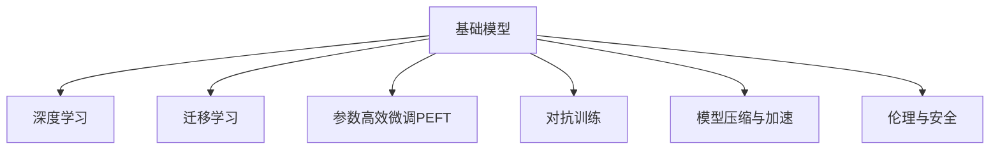

                 

# 基础模型的未来技术与社会影响

## 1. 背景介绍

### 1.1 问题由来
随着人工智能技术的迅速发展，基础模型的影响日益深远。基础模型（如深度学习中的神经网络模型）在图像识别、自然语言处理、语音识别等领域展现了强大的能力，推动了科技、经济、社会各领域的变革。然而，基础模型也带来了诸多挑战，如模型偏见、安全性问题、计算资源需求大等，亟需进一步探索其未来的技术走向与社会影响。

### 1.2 问题核心关键点
基础模型技术的未来发展方向与社会影响涵盖了多个方面：

- **技术演进：**包括算法创新、模型架构改进、计算资源的优化等。
- **应用场景：**如何进一步拓展基础模型在各个行业中的应用，提高其对现实问题的解决能力。
- **伦理与社会影响：**基础模型应用过程中应遵循的伦理准则，对社会公平、隐私保护等方面的影响。

这些关键点不仅决定了基础模型的未来走向，也影响着其在社会中的接受度和应用效果。

## 2. 核心概念与联系

### 2.1 核心概念概述

为更好地理解基础模型的未来技术走向与社会影响，本节将介绍几个核心概念：

- **基础模型（基础算法）：**如神经网络、卷积神经网络（CNN）、循环神经网络（RNN）、自回归模型（如Transformer）等，是实现复杂任务的基础。
- **深度学习：**通过多个层次的抽象和特征学习，从原始数据中提取高层次的特征表示，解决复杂的任务，如图像识别、自然语言处理、语音识别等。
- **迁移学习：**利用一个任务的模型知识，对另一个任务进行迁移学习，提高模型在新任务上的泛化能力。
- **参数高效微调（PEFT）：**通过只更新少量模型参数，减少计算资源需求，同时保持模型的性能。
- **对抗训练：**通过在模型训练中加入对抗样本，提高模型的鲁棒性和泛化能力。
- **模型压缩与加速：**通过模型压缩、剪枝、量化等技术，减小模型规模，提高计算效率。
- **伦理与安全：**基础模型应用中涉及的伦理问题，如隐私保护、模型偏见、安全性等。

这些概念共同构成了基础模型未来的技术框架，对其在实际应用中的表现和影响具有重要意义。

### 2.2 核心概念原理和架构的 Mermaid 流程图



这个流程图展示了基础模型与深度学习、迁移学习、PEFT、对抗训练、模型压缩加速和伦理安全之间的关系：

1. **深度学习**：是基础模型技术的重要基础，通过多层神经网络实现复杂任务。
2. **迁移学习**：利用已有模型解决新任务，提高模型泛化能力。
3. **参数高效微调（PEFT）**：在不增加大量计算资源的情况下，提升模型性能。
4. **对抗训练**：提高模型鲁棒性和泛化能力。
5. **模型压缩与加速**：减小模型规模，提高计算效率。
6. **伦理与安全**：确保模型应用中的伦理和安全问题得到有效处理。

## 3. 核心算法原理 & 具体操作步骤
### 3.1 算法原理概述

基础模型的未来技术走向主要体现在算法创新和模型架构改进上，其核心在于如何更好地从原始数据中提取高层次的特征表示，解决复杂的任务，同时提高模型的泛化能力和计算效率。

### 3.2 算法步骤详解

基础模型的未来发展可以从以下几个关键步骤入手：

**Step 1: 算法创新与模型优化**
- 开发新的神经网络结构或改进现有结构，提高模型的表达能力和泛化能力。
- 引入新的损失函数、优化算法或正则化方法，提高模型的训练效率和效果。

**Step 2: 数据增强与迁移学习**
- 收集更多的数据或引入数据增强技术，扩大训练集，提高模型的泛化能力。
- 利用迁移学习技术，在已有模型上微调，适应新任务。

**Step 3: 参数高效微调和对抗训练**
- 使用参数高效微调技术，只更新少量参数，提高模型的计算效率。
- 引入对抗训练，提高模型的鲁棒性和泛化能力。

**Step 4: 模型压缩与加速**
- 采用模型压缩技术，如剪枝、量化等，减小模型规模。
- 优化计算图，提高模型推理速度，支持实时计算。

**Step 5: 伦理与安全**
- 建立模型应用中的伦理准则，确保模型公平性、透明性。
- 加入隐私保护措施，保护用户隐私数据。

### 3.3 算法优缺点

基础模型未来的技术发展具有以下优点：
- **泛化能力强：**通过迁移学习和数据增强，基础模型可以在新任务上快速适应。
- **计算高效：**参数高效微调和模型压缩加速，减小了计算资源需求。
- **鲁棒性强：**对抗训练提高了模型的鲁棒性和泛化能力。

同时，也存在一些局限性：
- **数据需求高：**需要大量的标注数据才能进行有效的迁移学习。
- **模型复杂：**复杂的模型结构可能带来较高的计算和存储成本。
- **伦理问题：**模型应用中可能存在隐私泄露、偏见等问题。

### 3.4 算法应用领域

基础模型的未来应用领域广泛，涉及多个行业和技术领域：

- **图像识别：**用于医学影像分析、自动驾驶、安防监控等。
- **自然语言处理：**用于机器翻译、智能客服、文本生成等。
- **语音识别：**用于智能音箱、语音助手、语音导航等。
- **智能制造：**用于工业机器人、生产过程监控、质量检测等。
- **生物医学：**用于疾病诊断、药物研发、基因分析等。

## 4. 数学模型和公式 & 详细讲解 & 举例说明

### 4.1 数学模型构建

基础模型通常通过多层神经网络实现，包括输入层、隐藏层和输出层。以深度卷积神经网络（CNN）为例，其结构如图1所示。


### 4.2 公式推导过程

以卷积神经网络为例，其前向传播过程的计算公式为：

$$
y = g(\sigma(\sum_{i=1}^{K} w_i x_i + b))
$$

其中 $x_i$ 为输入特征，$w_i$ 为卷积核权重，$b$ 为偏置，$\sigma$ 为激活函数，$g$ 为非线性变换。

### 4.3 案例分析与讲解

以图像分类任务为例，CNN通过多层卷积和池化层提取特征，最后通过全连接层进行分类。使用MNIST数据集进行训练，其交叉熵损失函数的计算公式为：

$$
\mathcal{L} = -\frac{1}{N} \sum_{i=1}^{N} y_i \log p_i
$$

其中 $y_i$ 为真实标签，$p_i$ 为模型预测的概率。

## 5. 项目实践：代码实例和详细解释说明
### 5.1 开发环境搭建

在进行基础模型实践前，需要准备好开发环境。以下是使用Python进行TensorFlow开发的环境配置流程：

1. 安装Anaconda：从官网下载并安装Anaconda，用于创建独立的Python环境。
2. 创建并激活虚拟环境：
```bash
conda create -n tf-env python=3.8 
conda activate tf-env
```

3. 安装TensorFlow：根据CUDA版本，从官网获取对应的安装命令。例如：
```bash
pip install tensorflow
```

4. 安装各类工具包：
```bash
pip install numpy pandas scikit-learn matplotlib tqdm jupyter notebook ipython
```

完成上述步骤后，即可在`tf-env`环境中开始基础模型实践。

### 5.2 源代码详细实现

下面我们以图像分类任务为例，给出使用TensorFlow对卷积神经网络进行训练的PyTorch代码实现。

```python
import tensorflow as tf
from tensorflow.keras import layers, models

# 定义卷积神经网络模型
model = models.Sequential([
    layers.Conv2D(32, (3,3), activation='relu', input_shape=(28, 28, 1)),
    layers.MaxPooling2D((2,2)),
    layers.Conv2D(64, (3,3), activation='relu'),
    layers.MaxPooling2D((2,2)),
    layers.Conv2D(64, (3,3), activation='relu'),
    layers.Flatten(),
    layers.Dense(64, activation='relu'),
    layers.Dense(10)
])

# 编译模型
model.compile(optimizer='adam',
              loss=tf.keras.losses.SparseCategoricalCrossentropy(from_logits=True),
              metrics=['accuracy'])

# 加载数据集
mnist = tf.keras.datasets.mnist
(x_train, y_train), (x_test, y_test) = mnist.load_data()

# 数据预处理
x_train = x_train.reshape(-1, 28, 28, 1).astype('float32') / 255.0
x_test = x_test.reshape(-1, 28, 28, 1).astype('float32') / 255.0

# 训练模型
model.fit(x_train, y_train, epochs=5, validation_data=(x_test, y_test))
```

以上就是使用TensorFlow对卷积神经网络进行图像分类任务微调的完整代码实现。可以看到，利用TensorFlow和Keras框架，可以方便快捷地实现基础模型的训练与微调。

### 5.3 代码解读与分析

**定义模型结构**：首先使用Keras定义了卷积神经网络的结构，包括卷积层、池化层和全连接层。

**编译模型**：通过`model.compile`函数设置优化器、损失函数和评价指标，用于模型训练。

**加载数据集**：使用TensorFlow内置的MNIST数据集，包含手写数字图像和对应的标签。

**数据预处理**：将数据集转换为适合模型输入的格式，并进行归一化处理。

**训练模型**：使用`model.fit`函数进行模型训练，设定训练轮数和验证数据集，输出训练过程中的损失和准确率。

## 6. 实际应用场景
### 6.1 智能医疗

基础模型在智能医疗领域的应用非常广泛，如图像诊断、病理分析、基因测序等。通过基础模型与医学知识库的结合，可以实现自动化的医疗诊断和治疗方案推荐。例如，使用卷积神经网络对医学影像进行分类，辅助医生进行早期癌症筛查；使用循环神经网络对病历进行文本分析，提供个性化的治疗建议。

### 6.2 自动驾驶

自动驾驶是基础模型在智能交通领域的重要应用。通过基础模型对车辆周围环境进行实时感知和决策，可以显著提升驾驶安全性和效率。例如，使用卷积神经网络对摄像头拍摄的图像进行实时处理，识别行人、车辆、交通标志等对象；使用循环神经网络对传感器数据进行时间序列分析，预测交通流量和路况。

### 6.3 智能制造

基础模型在智能制造领域的应用主要包括质量检测、生产过程优化等。例如，使用卷积神经网络对生产设备采集的图像进行检测，发现生产缺陷；使用循环神经网络对生产数据进行预测，优化生产计划和资源配置。

### 6.4 未来应用展望

随着基础模型技术的不断进步，未来将在更多领域得到应用，带来深远的社会影响：

- **医疗健康：**基础模型在医疗诊断、治疗方案推荐、个性化医疗等领域的应用将提升医疗服务的质量和效率，降低医疗成本。
- **交通出行：**基础模型在自动驾驶、智慧交通等领域的应用将提升交通安全性、效率和舒适性，改变人们的出行方式。
- **制造业：**基础模型在智能制造、质量检测、生产优化等领域的应用将推动制造业的数字化转型，提高生产效率和产品质量。
- **金融服务：**基础模型在金融风险控制、智能投顾、客户服务等领域的应用将提升金融服务的智能化水平，提升客户体验和金融产品的竞争力。
- **智能家居：**基础模型在智能家居、家庭健康、智慧安防等领域的应用将提升家庭生活的便利性和安全性，带来更好的居住体验。

## 7. 工具和资源推荐
### 7.1 学习资源推荐

为了帮助开发者系统掌握基础模型的技术基础与应用实践，这里推荐一些优质的学习资源：

1. 《深度学习》系列书籍：由多位知名学者联合撰写，全面介绍了深度学习的基本原理和经典模型，适合初学者和进阶者阅读。
2. CS231n《深度学习在计算机视觉中的应用》课程：斯坦福大学开设的计算机视觉经典课程，涵盖深度学习在图像识别、图像生成等领域的应用。
3. 《自然语言处理综述》书籍：介绍自然语言处理的基本概念、方法和应用，适合深度学习爱好者学习。
4. Google Colab：谷歌提供的免费在线Jupyter Notebook环境，支持Python和TensorFlow，适合快速上手实验最新模型，分享学习笔记。
5. GitHub上的开源项目：如TensorFlow、Keras、PyTorch等，提供了丰富的代码库和文档，是学习和实践基础模型的宝贵资源。

通过对这些资源的学习实践，相信你一定能够系统掌握基础模型的技术原理与应用方法，并用于解决实际的AI问题。

### 7.2 开发工具推荐

高效的开发离不开优秀的工具支持。以下是几款用于基础模型开发的关键工具：

1. TensorFlow：由Google主导开发的开源深度学习框架，支持分布式计算，适合大规模工程应用。
2. PyTorch：由Facebook开发的开源深度学习框架，灵活高效，适合研究和原型开发。
3. Keras：高层次的深度学习框架，易于上手，适合初学者入门。
4. Jupyter Notebook：基于Web的交互式笔记本，支持多种编程语言，适合记录实验过程和分享代码。
5. Git：版本控制系统，支持多人协作开发，保证代码版本的安全性和可追溯性。

合理利用这些工具，可以显著提升基础模型开发的效率和质量，加速AI技术的创新迭代。

### 7.3 相关论文推荐

基础模型技术的发展源于学界的持续研究。以下是几篇奠基性的相关论文，推荐阅读：

1. AlexNet: ImageNet Classification with Deep Convolutional Neural Networks（ImageNet图像分类）：展示了深度卷积神经网络在图像识别任务上的强大能力。
2. ResNet: Deep Residual Learning for Image Recognition（残差网络）：提出残差网络结构，解决了深度网络训练中的梯度消失问题。
3. Transformer：Attention Is All You Need（自注意力机制）：提出了Transformer结构，实现了序列到序列的建模，推动了自然语言处理的发展。
4. BERT: Pre-training of Deep Bidirectional Transformers for Language Understanding（BERT模型）：提出BERT模型，通过自监督预训练，显著提高了语言模型的性能。
5. GAN: Generative Adversarial Nets（生成对抗网络）：提出了生成对抗网络，实现了高质量的图像生成和样式迁移。

这些论文代表了基础模型技术的发展脉络，通过学习这些前沿成果，可以帮助研究者把握学科前进方向，激发更多的创新灵感。

## 8. 总结：未来发展趋势与挑战
### 8.1 总结

本文对基础模型的未来技术走向与社会影响进行了全面系统的介绍。首先阐述了基础模型的重要性和未来发展的方向，明确了基础模型在智能医疗、自动驾驶、智能制造等众多领域的重要作用。其次，从原理到实践，详细讲解了基础模型的构建和训练过程，给出了基于TensorFlow的卷积神经网络实现示例。同时，本文还广泛探讨了基础模型在实际应用中的未来展望和面临的挑战，展示了基础模型技术的广阔前景。

通过本文的系统梳理，可以看到，基础模型作为AI技术的核心基础，将继续引领技术创新，推动各行业的数字化转型。未来，伴随算法创新和模型架构的不断优化，基础模型必将在更多领域大放异彩，为人类社会带来深远影响。

### 8.2 未来发展趋势

展望未来，基础模型的技术发展将呈现以下几个趋势：

1. **算法创新：**开发新的神经网络结构或改进现有结构，提高模型的表达能力和泛化能力。
2. **模型优化：**引入新的损失函数、优化算法或正则化方法，提高模型的训练效率和效果。
3. **数据增强：**收集更多的数据或引入数据增强技术，扩大训练集，提高模型的泛化能力。
4. **迁移学习：**利用已有模型对新任务进行迁移学习，提高模型在新任务上的泛化能力。
5. **参数高效微调（PEFT）：**只更新少量参数，提高模型的计算效率。
6. **对抗训练：**提高模型的鲁棒性和泛化能力。
7. **模型压缩与加速：**减小模型规模，提高计算效率，支持实时计算。

以上趋势凸显了基础模型技术的进步和应用前景，将进一步提升其在各领域的表现和效果。

### 8.3 面临的挑战

尽管基础模型技术已经取得了显著进展，但在迈向更加智能化、普适化应用的过程中，仍面临诸多挑战：

1. **数据需求高：**需要大量的标注数据才能进行有效的迁移学习。
2. **模型复杂：**复杂的模型结构可能带来较高的计算和存储成本。
3. **伦理问题：**模型应用中可能存在隐私泄露、偏见等问题。
4. **模型鲁棒性：**面对域外数据时，模型的泛化性能可能大打折扣。
5. **计算资源需求：**大规模基础模型的训练和推理需要大量计算资源。

这些挑战需要进一步探索和解决，才能使基础模型技术更好地服务于社会。

### 8.4 研究展望

未来研究需要在以下几个方面寻求新的突破：

1. **数据增强与迁移学习：**开发更有效的数据增强技术和迁移学习方法，降低对标注数据的依赖。
2. **参数高效微调（PEFT）：**开发更加参数高效的微调方法，减小计算资源需求。
3. **对抗训练：**提高模型的鲁棒性和泛化能力，避免模型在对抗样本上的失效。
4. **模型压缩与加速：**减小模型规模，提高计算效率，支持实时计算。
5. **伦理与安全：**确保基础模型应用中的伦理和安全问题得到有效处理。

这些研究方向将引领基础模型技术的进步，推动其在更广泛领域的应用和发展。

## 9. 附录：常见问题与解答

**Q1：基础模型为何需要大量的标注数据？**

A: 基础模型通常依赖大量的标注数据进行迁移学习，标注数据提供了模型所需的任务标签，帮助模型学习任务的特征表示。但大量标注数据获取成本高，可以通过数据增强和半监督学习方法减少对标注数据的依赖。

**Q2：如何提高基础模型的计算效率？**

A: 提高基础模型的计算效率可以通过以下方法实现：
1. 参数高效微调（PEFT）：只更新少量参数，减小计算资源需求。
2. 模型压缩与加速：采用剪枝、量化等技术，减小模型规模，提高计算效率。
3. 分布式计算：利用分布式计算资源，并行处理大规模数据，提高计算效率。

**Q3：基础模型在实际应用中如何保证伦理与安全？**

A: 基础模型应用中需遵循以下伦理准则：
1. 隐私保护：对用户数据进行脱敏处理，保护用户隐私。
2. 公平性：确保模型输出不带有偏见，对不同群体公平对待。
3. 透明度：公开模型训练和推理过程，确保模型行为的透明性和可解释性。
4. 安全防护：对模型进行检测和防护，防止恶意攻击和滥用。

这些伦理准则确保基础模型应用的安全性和可靠性。

---

作者：禅与计算机程序设计艺术 / Zen and the Art of Computer Programming

