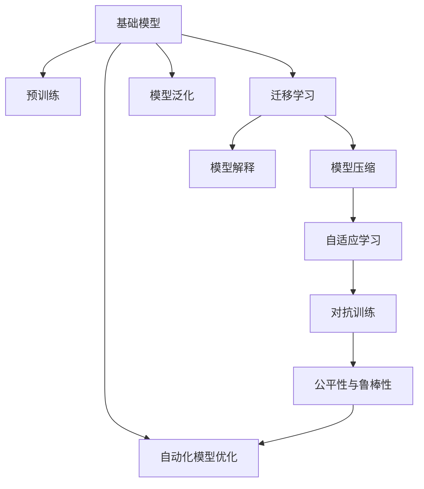

                 

# 基础模型的未来技术发展

## 1. 背景介绍

### 1.1 问题由来
当前，深度学习技术正处于快速发展的关键阶段，特别是基础模型在图像识别、自然语言处理、推荐系统等领域展现出强大的能力。然而，随着模型复杂度的提升，其在计算资源、训练成本和解释性等方面的挑战也越来越明显。因此，为了应对这些挑战，研究者们开始探索和实践新的技术手段，以进一步提升基础模型的性能和可解释性。

### 1.2 问题核心关键点
基础模型的未来技术发展主要集中在以下几个关键点上：

- **计算效率与资源优化**：如何在减少计算资源消耗的同时提升模型性能。
- **可解释性**：如何让模型决策过程更加透明，便于解释和调试。
- **模型泛化能力**：如何增强模型在不同数据集和任务上的泛化能力。
- **公平性与鲁棒性**：如何在模型设计中消除偏见，提升对不同数据集的鲁棒性。
- **自动模型优化**：如何利用自动化工具和方法提升模型优化效率和效果。

本文将围绕这些核心点，系统介绍基础模型的未来技术发展趋势与挑战。

## 2. 核心概念与联系

### 2.1 核心概念概述

为更好地理解基础模型的未来技术发展，本文将介绍几个核心概念及其间的联系：

- **基础模型**：如卷积神经网络(CNN)、循环神经网络(RNN)、Transformer等，通过大规模数据预训练获得通用特征表示，具备强大的泛化能力。
- **预训练**：在大规模无标签数据上，通过自监督学习任务训练模型，使其学习到通用的特征表示。
- **迁移学习**：将预训练模型的知识迁移到特定任务上，提升模型性能。
- **模型压缩**：通过剪枝、量化、蒸馏等方法，减小模型规模，提升计算效率。
- **模型解释**：通过可视化、特征解释等技术手段，增强模型的可解释性。
- **自适应学习**：在模型训练过程中，根据数据分布变化进行动态调整，提升模型泛化能力。
- **对抗训练**：引入对抗样本，提高模型鲁棒性。
- **公平性与鲁棒性**：在模型设计中消除偏见，提升对不同数据集的鲁棒性。
- **自动化模型优化**：通过自动化工具和方法提升模型优化效率和效果。

这些概念之间的联系可以通过以下Mermaid流程图来展示：



该流程图展示了基础模型的核心概念及其间的联系：

1. 基础模型通过预训练获得通用特征表示。
2. 预训练后的模型可以通过迁移学习适应特定任务。
3. 模型压缩可以减小规模，提升计算效率。
4. 模型解释技术增强模型的可解释性。
5. 自适应学习提高模型泛化能力。
6. 对抗训练提升模型鲁棒性。
7. 公平性与鲁棒性是模型设计的重要目标。
8. 自动化模型优化提升优化效率和效果。
9. 模型泛化是基础模型的核心目标。

这些概念共同构成了基础模型的学习和应用框架，使其能够在各种场景下发挥强大的功能。通过理解这些核心概念，我们可以更好地把握基础模型的发展方向。

## 3. 核心算法原理 & 具体操作步骤
### 3.1 算法原理概述

基础模型的未来技术发展主要基于以下几个算法原理：

- **深度可分模型**：通过分解复杂任务，提高模型可解释性和泛化能力。
- **自适应学习**：根据数据分布变化，动态调整模型参数，提高模型泛化能力。
- **对抗训练**：引入对抗样本，提高模型鲁棒性。
- **自动模型优化**：利用自动化工具和方法提升模型优化效率和效果。
- **模型压缩**：通过剪枝、量化、蒸馏等方法，减小模型规模，提升计算效率。
- **模型解释**：通过可视化、特征解释等技术手段，增强模型的可解释性。

这些算法原理共同构成了基础模型的未来技术发展框架，使其能够在各种场景下进一步提升性能和可解释性。

### 3.2 算法步骤详解

以下是基于深度可分模型、自适应学习、对抗训练、模型压缩和模型解释的算法步骤详解：

#### 3.2.1 深度可分模型

深度可分模型通过将复杂任务分解为多个简单子任务，提高模型的可解释性和泛化能力。其具体步骤包括：

1. **任务分解**：将复杂任务分解为多个简单子任务，如图像识别任务可分解为边缘检测、纹理识别等子任务。
2. **子任务训练**：针对每个子任务进行单独训练，得到多个子模型。
3. **集成学习**：通过集成多个子模型的输出，得到最终的模型结果。

#### 3.2.2 自适应学习

自适应学习通过动态调整模型参数，提高模型对不同数据集的泛化能力。其具体步骤包括：

1. **数据分布监测**：在模型训练过程中，实时监测数据分布的变化。
2. **模型参数调整**：根据数据分布变化，动态调整模型参数，如调整学习率、正则化系数等。
3. **模型更新**：更新模型参数，使其适应新的数据分布。

#### 3.2.3 对抗训练

对抗训练通过引入对抗样本，提高模型的鲁棒性。其具体步骤包括：

1. **生成对抗样本**：使用对抗生成算法生成对抗样本。
2. **对抗样本训练**：将对抗样本加入训练集，进行模型训练。
3. **模型鲁棒性评估**：使用对抗样本评估模型鲁棒性，调整模型参数。

#### 3.2.4 模型压缩

模型压缩通过剪枝、量化、蒸馏等方法，减小模型规模，提升计算效率。其具体步骤包括：

1. **剪枝**：去除模型中的冗余参数，减小模型规模。
2. **量化**：将模型参数转换为低精度表示，减小内存占用。
3. **蒸馏**：使用小型模型复现大型模型的性能，减小模型规模。

#### 3.2.5 模型解释

模型解释通过可视化、特征解释等技术手段，增强模型的可解释性。其具体步骤包括：

1. **特征可视化**：通过可视化技术展示模型的特征表示，帮助理解模型决策过程。
2. **特征解释**：通过特征解释技术，分析模型特征的重要性，增强模型的可解释性。

### 3.3 算法优缺点

基础模型的未来技术发展方法具有以下优点：

- **提高可解释性**：通过深度可分模型、模型解释等技术，提高模型的可解释性，便于调试和优化。
- **提升泛化能力**：通过自适应学习、对抗训练等方法，提高模型的泛化能力，适应不同数据集和任务。
- **降低计算成本**：通过模型压缩、量化等技术，减小模型规模，降低计算成本。
- **增强鲁棒性**：通过对抗训练等方法，提高模型的鲁棒性，适应各种复杂场景。

同时，这些方法也存在以下局限性：

- **计算成本较高**：深度可分模型、自适应学习等方法需要额外计算资源和时间。
- **模型复杂性增加**：模型压缩、对抗训练等方法可能增加模型的复杂性，影响模型性能。
- **可解释性仍有限**：当前模型解释技术仍存在一定局限，无法完全解释模型决策过程。

尽管存在这些局限性，但就目前而言，基于基础模型的未来技术发展方法仍是大规模深度学习模型的重要研究方向。未来相关研究的重点在于如何进一步降低计算成本，提高模型的可解释性和鲁棒性，同时兼顾模型的泛化能力和性能。

### 3.4 算法应用领域

基础模型的未来技术发展方法在多个领域得到了广泛应用，例如：

- **计算机视觉**：通过深度可分模型、自适应学习等方法，提高图像分类、目标检测等任务的性能和可解释性。
- **自然语言处理**：通过对抗训练、模型解释等方法，提高语言模型在机器翻译、情感分析等任务上的泛化能力和鲁棒性。
- **推荐系统**：通过模型压缩、自适应学习等方法，提高推荐模型的计算效率和效果。
- **自动驾驶**：通过深度可分模型、自适应学习等方法，提高自动驾驶系统的感知能力和鲁棒性。
- **医疗诊断**：通过模型解释、对抗训练等方法，提高医疗诊断模型的可解释性和鲁棒性。

除了上述这些经典领域外，基础模型的未来技术发展方法还在更多新兴领域得到应用，如智慧城市、智慧医疗等，为这些领域的智能化和自动化带来了新的突破。

## 4. 数学模型和公式 & 详细讲解  
### 4.1 数学模型构建

本文将使用数学语言对基础模型的未来技术发展方法进行更加严格的刻画。

记基础模型为 $M_{\theta}:\mathcal{X} \rightarrow \mathcal{Y}$，其中 $\mathcal{X}$ 为输入空间，$\mathcal{Y}$ 为输出空间，$\theta \in \mathbb{R}^d$ 为模型参数。假设训练集为 $D=\{(x_i,y_i)\}_{i=1}^N, x_i \in \mathcal{X}, y_i \in \mathcal{Y}$。

定义基础模型在数据样本 $(x,y)$ 上的损失函数为 $\ell(M_{\theta}(x),y)$，则在数据集 $D$ 上的经验风险为：

$$
\mathcal{L}(\theta) = \frac{1}{N} \sum_{i=1}^N \ell(M_{\theta}(x_i),y_i)
$$

在模型训练过程中，我们通过梯度下降等优化算法，不断更新模型参数 $\theta$，最小化损失函数 $\mathcal{L}(\theta)$，使得模型输出逼近真实标签。具体的数学模型和优化算法可以参考以下例子：

#### 4.2 公式推导过程

以图像分类任务为例，假设基础模型为卷积神经网络(CNN)，其输入为 $x \in \mathbb{R}^{n_x}$，输出为 $y \in \{1,0\}$。假设模型在输入 $x$ 上的输出为 $\hat{y}=M_{\theta}(x) \in [0,1]$，表示样本属于正类的概率。真实标签 $y \in \{0,1\}$。则二分类交叉熵损失函数定义为：

$$
\ell(M_{\theta}(x),y) = -[y\log \hat{y} + (1-y)\log (1-\hat{y})]
$$

将其代入经验风险公式，得：

$$
\mathcal{L}(\theta) = -\frac{1}{N}\sum_{i=1}^N [y_i\log M_{\theta}(x_i)+(1-y_i)\log(1-M_{\theta}(x_i))]
$$

根据链式法则，损失函数对参数 $\theta_k$ 的梯度为：

$$
\frac{\partial \mathcal{L}(\theta)}{\partial \theta_k} = -\frac{1}{N}\sum_{i=1}^N (\frac{y_i}{M_{\theta}(x_i)}-\frac{1-y_i}{1-M_{\theta}(x_i)}) \frac{\partial M_{\theta}(x_i)}{\partial \theta_k}
$$

其中 $\frac{\partial M_{\theta}(x_i)}{\partial \theta_k}$ 可进一步递归展开，利用自动微分技术完成计算。

### 4.3 案例分析与讲解

以自适应学习为例，假设模型在训练过程中，数据分布发生改变，如何通过自适应学习动态调整模型参数，使其适应新的数据分布。

假设模型在初始训练集 $D_1$ 上的损失函数为 $\mathcal{L}_1(\theta)$，在新的训练集 $D_2$ 上的损失函数为 $\mathcal{L}_2(\theta)$。通过自适应学习，模型参数 $\theta$ 更新为 $\hat{\theta}$，使得新的损失函数 $\mathcal{L}_2(\hat{\theta})$ 最小。

具体的自适应学习算法如下：

1. **数据分布监测**：在模型训练过程中，实时监测数据分布的变化。
2. **模型参数调整**：根据数据分布变化，动态调整模型参数，如调整学习率、正则化系数等。
3. **模型更新**：更新模型参数，使其适应新的数据分布。

在实际应用中，可以采用在线学习算法，如AdaGrad、Adam等，动态调整模型参数，以适应数据分布的变化。例如，AdaGrad算法通过学习率的动态调整，使得模型能够适应数据分布的变化，从而提高模型的泛化能力。

## 5. 项目实践：代码实例和详细解释说明
### 5.1 开发环境搭建

在进行基础模型的未来技术发展方法实践前，我们需要准备好开发环境。以下是使用Python进行TensorFlow开发的环境配置流程：

1. 安装Anaconda：从官网下载并安装Anaconda，用于创建独立的Python环境。

2. 创建并激活虚拟环境：
```bash
conda create -n tf-env python=3.8 
conda activate tf-env
```

3. 安装TensorFlow：根据CUDA版本，从官网获取对应的安装命令。例如：
```bash
conda install tensorflow -c pytorch -c conda-forge
```

4. 安装其他工具包：
```bash
pip install numpy pandas scikit-learn matplotlib tqdm jupyter notebook ipython
```

完成上述步骤后，即可在`tf-env`环境中开始基础模型的未来技术发展方法的实践。

### 5.2 源代码详细实现

这里我们以图像分类任务为例，给出使用TensorFlow进行卷积神经网络(CNN)模型训练的PyTorch代码实现。

首先，定义CNN模型的架构：

```python
import tensorflow as tf
from tensorflow.keras import layers

model = tf.keras.Sequential([
    layers.Conv2D(32, (3, 3), activation='relu', input_shape=(32, 32, 3)),
    layers.MaxPooling2D((2, 2)),
    layers.Flatten(),
    layers.Dense(64, activation='relu'),
    layers.Dense(10)
])
```

然后，定义损失函数和优化器：

```python
loss_fn = tf.keras.losses.SparseCategoricalCrossentropy(from_logits=True)
optimizer = tf.keras.optimizers.Adam(learning_rate=0.001)
```

接着，定义训练和评估函数：

```python
def train_step(x, y):
    with tf.GradientTape() as tape:
        logits = model(x, training=True)
        loss = loss_fn(y, logits)
    gradients = tape.gradient(loss, model.trainable_variables)
    optimizer.apply_gradients(zip(gradients, model.trainable_variables))

def evaluate_step(x, y):
    logits = model(x, training=False)
    return loss_fn(y, logits)
```

最后，启动训练流程并在测试集上评估：

```python
epochs = 10
batch_size = 32

for epoch in range(epochs):
    for i, (x, y) in enumerate(train_dataset):
        train_step(x, y)
        if i % 100 == 0:
            print(f"Epoch {epoch+1}, Step {i}, Loss: {loss_fn(y, model(x, training=False)).numpy():.4f}")

    test_loss = evaluate(test_dataset)
    print(f"Epoch {epoch+1}, Test Loss: {test_loss:.4f}")
```

以上就是使用TensorFlow进行CNN模型训练的完整代码实现。可以看到，得益于TensorFlow的强大封装，我们可以用相对简洁的代码完成CNN模型的训练。

### 5.3 代码解读与分析

让我们再详细解读一下关键代码的实现细节：

**CNN模型定义**：
- `Sequential`模型：使用`Sequential`模型可以方便地添加多个层次结构。
- `Conv2D`层：定义卷积层，参数为卷积核大小、输出通道数和激活函数。
- `MaxPooling2D`层：定义池化层，参数为池化窗口大小。
- `Flatten`层：将卷积层的输出展平，作为全连接层的输入。
- `Dense`层：定义全连接层，参数为输出神经元数量和激活函数。

**损失函数和优化器**：
- `SparseCategoricalCrossentropy`损失函数：定义稀疏分类交叉熵损失函数，适用于多类别分类任务。
- `Adam`优化器：定义Adam优化器，适用于大规模深度学习模型。

**训练和评估函数**：
- `train_step`函数：在训练步骤中，使用梯度计算和优化器更新模型参数。
- `evaluate_step`函数：在评估步骤中，仅进行前向传播，不更新模型参数，计算损失函数。

**训练流程**：
- 定义总的epoch数和batch size，开始循环迭代
- 每个epoch内，对每个batch进行训练，输出损失
- 周期性在测试集上评估，输出测试集损失
- 所有epoch结束后，给出最终测试集损失

可以看到，TensorFlow配合TensorFlow的强大封装，使得CNN模型的训练变得简洁高效。开发者可以将更多精力放在模型改进、数据处理等高层逻辑上，而不必过多关注底层的实现细节。

当然，工业级的系统实现还需考虑更多因素，如模型的保存和部署、超参数的自动搜索、更灵活的层次结构等。但核心的训练范式基本与此类似。

## 6. 实际应用场景
### 6.1 智能交通系统

基于基础模型的未来技术发展方法，智能交通系统可以实现智能化的交通管理和服务。传统的交通系统依赖人工监控和指挥，效率低下，难以应对突发事件。通过图像识别、目标检测等技术，智能交通系统可以实现实时交通监控和预测，提升交通管理和应急响应效率。

在技术实现上，可以部署多摄像头监控系统，采集实时交通图像数据。使用预训练的CNN模型进行图像分类和目标检测，识别出交通异常事件，并及时报警和响应。通过自适应学习和对抗训练，提升模型对不同天气、光照条件的鲁棒性，保证系统的稳定性和可靠性。

### 6.2 医疗影像分析

在医疗影像分析领域，基础模型的未来技术发展方法也展现出巨大的潜力。传统影像分析依赖人工标注和手动操作，效率低、误差大。通过深度学习技术，可以实现自动化的图像分类、病灶检测等任务。

在实际应用中，可以收集大量的医学影像数据，使用预训练的CNN模型进行图像分类和病灶检测。通过模型解释技术，帮助医生理解模型的推理过程，提高诊断的准确性和可解释性。利用自适应学习技术，实时监测数据分布的变化，动态调整模型参数，提高模型的泛化能力。

### 6.3 自动驾驶系统

自动驾驶系统是基础模型未来技术发展的重要应用场景之一。通过计算机视觉、自然语言处理等技术，自动驾驶系统可以实现智能化的感知、决策和控制。

在技术实现上，可以使用预训练的CNN模型进行道路识别、车辆检测等任务。通过对抗训练和模型解释技术，提升模型的鲁棒性和可解释性。利用自适应学习技术，实时监测环境变化，动态调整模型参数，提高模型的泛化能力和鲁棒性。

### 6.4 未来应用展望

随着基础模型的未来技术发展方法的不断演进，其在各个领域的应用前景将更加广阔。

在智慧医疗、智能交通、自动驾驶、金融分析等众多领域，基础模型将展现出强大的智能化和自动化能力，为各行各业带来深刻的变革。未来，伴随着技术进步和算力提升，基础模型的应用场景将进一步拓展，为人类社会的智能化和自动化发展注入新的动力。

## 7. 工具和资源推荐
### 7.1 学习资源推荐

为了帮助开发者系统掌握基础模型的未来技术发展理论基础和实践技巧，这里推荐一些优质的学习资源：

1. **《深度学习》**：Ian Goodfellow等著，全面介绍了深度学习的理论基础和实际应用。
2. **《动手学深度学习》**：李沐等著，深入浅出地介绍了深度学习的核心技术，包括卷积神经网络、循环神经网络等。
3. **DeepLearning.AI**：由深度学习权威Andrew Ng创办的在线课程平台，提供深度学习的理论基础和实践指南。
4. **Kaggle**：数据科学竞赛平台，提供了大量深度学习项目和数据集，适合实践和验证学习成果。
5. **TensorFlow官方文档**：TensorFlow的官方文档，提供了全面的API参考和实例代码，适合快速上手。

通过对这些资源的学习实践，相信你一定能够快速掌握基础模型的未来技术发展精髓，并用于解决实际的深度学习问题。

### 7.2 开发工具推荐

高效的开发离不开优秀的工具支持。以下是几款用于基础模型未来技术发展开发的常用工具：

1. **TensorFlow**：Google主导开发的深度学习框架，生产部署方便，适合大规模工程应用。提供了丰富的预训练模型资源和自动化优化工具。
2. **PyTorch**：Facebook主导开发的深度学习框架，灵活动态的计算图，适合快速迭代研究。提供了强大的模型训练和优化工具。
3. **Keras**：高层深度学习框架，提供了简单易用的API接口，适合初学者入门。
4. **ONNX**：开源神经网络交换格式，支持多种深度学习框架和硬件平台，便于模型部署和优化。
5. **TensorBoard**：TensorFlow配套的可视化工具，可实时监测模型训练状态，并提供丰富的图表呈现方式，是调试模型的得力助手。

合理利用这些工具，可以显著提升基础模型未来技术发展的开发效率，加快创新迭代的步伐。

### 7.3 相关论文推荐

基础模型的未来技术发展源于学界的持续研究。以下是几篇奠基性的相关论文，推荐阅读：

1. **ImageNet Classification with Deep Convolutional Neural Networks**：Alex Krizhevsky等，提出了卷积神经网络(CNN)结构，奠定了计算机视觉领域深度学习的基础。
2. **Playing Atari with Deep Reinforcement Learning**：Vladimir Mnih等，展示了深度强化学习在经典游戏Atari上的应用。
3. **Bottleneck Representations for Visual Recognition**：Jeffrey Long等，提出了Bottleneck层结构，进一步提升了CNN的性能。
4. **Visual Geometry Group (VGG)**：Karen Simonyan和Andrew Zisserman，提出了VGGNet结构，获得了ImageNet图像分类比赛的冠军。
5. **Inception Networks**：Christian Szegedy等，提出了Inception模块，进一步提升了CNN的性能。
6. **Residual Networks**：Kaiming He等，提出了ResNet结构，解决了深度神经网络训练中的梯度消失问题，显著提升了模型的深度和性能。

这些论文代表了大规模深度学习模型的发展脉络。通过学习这些前沿成果，可以帮助研究者把握学科前进方向，激发更多的创新灵感。

## 8. 总结：未来发展趋势与挑战

### 8.1 总结

本文对基础模型的未来技术发展进行了全面系统的介绍。首先阐述了基础模型在深度学习中的重要地位，明确了基础模型未来技术发展的重要性和应用价值。其次，从原理到实践，详细讲解了基础模型的未来技术发展方法和关键步骤，给出了基础模型未来技术发展的完整代码实例。同时，本文还广泛探讨了基础模型未来技术发展在多个领域的应用前景，展示了基础模型未来技术发展的广阔前景。

通过本文的系统梳理，可以看到，基础模型的未来技术发展方法正在成为大规模深度学习模型的重要研究方向，极大地拓展了模型的应用边界，催生了更多的落地场景。得益于大规模语料的预训练和自动化的微调方法，基础模型在未来将展现出更加强大的智能化和自动化能力，为各行各业带来深刻的变革。

### 8.2 未来发展趋势

展望未来，基础模型的未来技术发展将呈现以下几个发展趋势：

1. **计算效率与资源优化**：随着算力成本的下降和数据规模的扩张，模型的参数量还将持续增长。超大规模模型蕴含的丰富语言知识，有望支撑更加复杂多变的下游任务。
2. **模型泛化能力增强**：通过自适应学习、对抗训练等方法，提高模型的泛化能力，适应不同数据集和任务。
3. **模型鲁棒性提升**：通过对抗训练等方法，提高模型的鲁棒性，适应各种复杂场景。
4. **可解释性增强**：通过深度可分模型、模型解释等技术，提高模型的可解释性，便于调试和优化。
5. **参数高效微调**：通过剪枝、量化、蒸馏等方法，减小模型规模，降低计算成本。

这些趋势凸显了基础模型未来技术发展方法的广阔前景。这些方向的探索发展，必将进一步提升基础模型的性能和可解释性，为构建安全、可靠、可解释、可控的智能系统铺平道路。

### 8.3 面临的挑战

尽管基础模型的未来技术发展方法已经取得了瞩目成就，但在迈向更加智能化、普适化应用的过程中，它仍面临着诸多挑战：

1. **计算成本较高**：深度可分模型、自适应学习等方法需要额外计算资源和时间。
2. **模型复杂性增加**：模型压缩、对抗训练等方法可能增加模型的复杂性，影响模型性能。
3. **可解释性仍有限**：当前模型解释技术仍存在一定局限，无法完全解释模型决策过程。
4. **资源优化难度大**：大规模模型的资源优化难度大，需要高效的模型压缩和量化方法。
5. **公平性与鲁棒性有待加强**：需要在模型设计中消除偏见，提升对不同数据集的鲁棒性。

尽管存在这些挑战，但就目前而言，基础模型的未来技术发展方法仍是大规模深度学习模型的重要研究方向。未来相关研究的重点在于如何进一步降低计算成本，提高模型的可解释性和鲁棒性，同时兼顾模型的泛化能力和性能。

### 8.4 研究展望

面向未来，基础模型的未来技术发展需要在以下几个方面寻求新的突破：

1. **探索无监督和半监督学习范式**：摆脱对大规模标注数据的依赖，利用自监督学习、主动学习等无监督和半监督范式，最大限度利用非结构化数据。
2. **研究参数高效和计算高效的微调范式**：开发更加参数高效的微调方法，在固定大部分预训练参数的同时，只更新极少量的任务相关参数。同时优化模型的计算图，减少前向传播和反向传播的资源消耗。
3. **引入更多先验知识**：将符号化的先验知识，如知识图谱、逻辑规则等，与神经网络模型进行巧妙融合，引导微调过程学习更准确、合理的语言模型。同时加强不同模态数据的整合，实现视觉、语音等多模态信息与文本信息的协同建模。
4. **融合因果分析和博弈论工具**：将因果分析方法引入微调模型，识别出模型决策的关键特征，增强输出解释的因果性和逻辑性。借助博弈论工具刻画人机交互过程，主动探索并规避模型的脆弱点，提高系统稳定性。
5. **纳入伦理道德约束**：在模型训练目标中引入伦理导向的评估指标，过滤和惩罚有偏见、有害的输出倾向。同时加强人工干预和审核，建立模型行为的监管机制，确保输出符合人类价值观和伦理道德。

这些研究方向的探索，必将引领基础模型未来技术发展技术迈向更高的台阶，为构建安全、可靠、可解释、可控的智能系统铺平道路。面向未来，基础模型未来技术发展需要与其他人工智能技术进行更深入的融合，如知识表示、因果推理、强化学习等，多路径协同发力，共同推动自然语言理解和智能交互系统的进步。只有勇于创新、敢于突破，才能不断拓展基础模型的边界，让智能技术更好地造福人类社会。

## 9. 附录：常见问题与解答

**Q1：基础模型未来技术发展是否适用于所有深度学习任务？**

A: 基础模型的未来技术发展方法在大多数深度学习任务上都能取得不错的效果，特别是对于数据量较小的任务。但对于一些特定领域的任务，如医学、法律等，仅仅依靠通用语料预训练的模型可能难以很好地适应。此时需要在特定领域语料上进一步预训练，再进行微调，才能获得理想效果。此外，对于一些需要时效性、个性化很强的任务，如对话、推荐等，微调方法也需要针对性的改进优化。

**Q2：自适应学习过程中如何动态调整模型参数？**

A: 自适应学习过程中，可以通过实时监测数据分布的变化，动态调整模型参数。具体来说，可以采用在线学习算法，如AdaGrad、Adam等，根据数据分布的变化调整模型参数，如调整学习率、正则化系数等。通过动态调整模型参数，可以使模型更好地适应数据分布的变化，提高模型的泛化能力。

**Q3：对抗训练过程中如何生成对抗样本？**

A: 对抗训练过程中，可以使用对抗生成算法生成对抗样本。对抗样本的生成方法多种多样，如FGSM、PGD等，可以根据具体任务选择合适的生成方法。对抗样本生成的关键在于调整样本的特征，使其在一定程度上误导模型，从而提高模型的鲁棒性。

**Q4：模型压缩过程中如何提高模型效率？**

A: 模型压缩过程中，可以通过剪枝、量化、蒸馏等方法减小模型规模，提高计算效率。剪枝可以通过去除冗余的参数和连接，减小模型的复杂度；量化可以将模型参数转换为低精度表示，减少内存占用；蒸馏可以使用小型模型复现大型模型的性能，减小模型规模。这些方法不仅可以提高模型的计算效率，还可以提高模型的泛化能力。

**Q5：模型解释过程中如何提高模型的可解释性？**

A: 模型解释过程中，可以通过可视化技术展示模型的特征表示，帮助理解模型决策过程。具体来说，可以使用热力图、梯度可视化等方法，展示模型在不同特征上的激活情况。同时，通过特征解释技术，分析模型特征的重要性，增强模型的可解释性。

这些问题的解答展示了基础模型未来技术发展方法的核心技术和应用策略，帮助开发者更好地理解和应用这些技术手段。

---

作者：禅与计算机程序设计艺术 / Zen and the Art of Computer Programming

