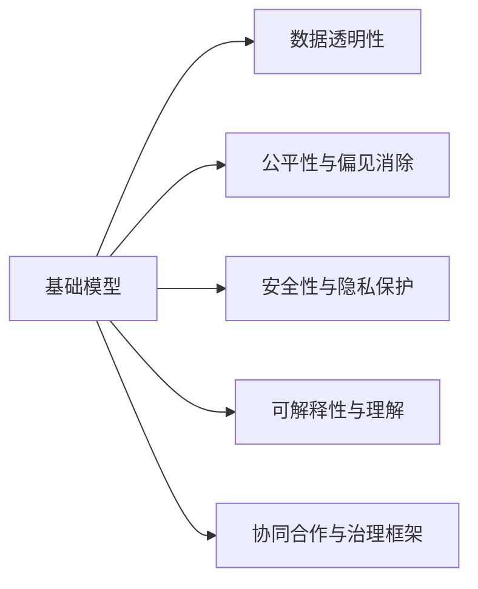

                 

# 基础模型的社会合作与治理

## 1. 背景介绍

### 1.1 问题由来

在人工智能（AI）领域，基础模型扮演着至关重要的角色。基础模型是一类在大规模数据集上训练的大型神经网络，能够处理各种复杂的任务，如自然语言处理（NLP）、计算机视觉（CV）等。近年来，基于大规模预训练的基础模型在各个领域取得了显著进展，展现了强大的学习能力和泛化能力。然而，这些基础模型的应用并非一帆风顺。由于其庞大的参数规模和复杂的结构，基础模型的部署、优化和治理变得异常复杂。如何在确保模型性能的同时，保证其安全、公正、透明和可解释性，是当前AI领域的重要挑战之一。

### 1.2 问题核心关键点

基础模型的社会合作与治理主要围绕以下几个关键点展开：

- **数据与算法透明性**：确保基础模型训练的数据来源、算法过程和性能指标公开透明，便于社会监督和审核。
- **公平性与偏见消除**：基础模型应公平地对待不同群体，避免由于数据偏差或算法偏见导致的不公正。
- **安全性与隐私保护**：基础模型应保护用户隐私，防止数据泄露和恶意攻击，确保系统安全。
- **可解释性与理解**：基础模型应提供清晰的决策依据，便于用户理解和信任模型的输出。
- **协同合作与治理框架**：基础模型应与各方协同合作，包括政府、企业、研究机构等，共同构建公平、透明、安全的人工智能治理体系。

通过解决这些核心问题，基础模型可以在不同社会领域实现广泛应用，推动社会进步和科技创新。

## 2. 核心概念与联系

### 2.1 核心概念概述

- **基础模型**：指在特定领域的大规模数据集上预训练的大型神经网络，如BERT、GPT-3、ResNet等。基础模型具有强大的学习能力和泛化能力，能够处理多种复杂任务。
- **数据透明性**：指基础模型训练数据的来源、质量和处理方式应公开透明，便于社会监督和审查。
- **公平性与偏见消除**：指基础模型应公平地对待不同群体，避免因数据偏差或算法偏见导致的不公正。
- **安全性与隐私保护**：指基础模型应确保用户隐私数据的安全，防止数据泄露和恶意攻击，确保系统安全。
- **可解释性与理解**：指基础模型应提供清晰的决策依据，便于用户理解和信任模型的输出。
- **协同合作与治理框架**：指基础模型应与各方协同合作，包括政府、企业、研究机构等，共同构建公平、透明、安全的人工智能治理体系。

这些核心概念共同构成了基础模型的社会合作与治理框架，为其在社会领域的应用提供了理论基础和实践指导。

### 2.2 核心概念原理和架构的 Mermaid 流程图



这个流程图展示了基础模型的社会合作与治理框架中各个核心概念之间的逻辑关系：

1. 基础模型是这一框架的起点，其性能和安全性直接影响其他核心概念的实现。
2. 数据透明性是基础模型训练的基础，确保训练数据的公开透明。
3. 公平性与偏见消除通过优化算法和数据集，避免模型偏见。
4. 安全性与隐私保护通过加密、匿名化等手段，保护用户隐私数据。
5. 可解释性与理解通过提供模型解释和决策依据，增强用户信任。
6. 协同合作与治理框架通过多方合作，共同构建公平、透明、安全的人工智能治理体系。

## 3. 核心算法原理 & 具体操作步骤

### 3.1 算法原理概述

基础模型的社会合作与治理主要通过以下算法原理来实现：

1. **数据透明性算法**：确保基础模型训练数据的来源和处理方式公开透明，便于社会监督和审查。
2. **公平性与偏见消除算法**：通过数据预处理和算法优化，消除模型偏见，确保模型公平性。
3. **安全性与隐私保护算法**：通过加密、匿名化等手段，保护用户隐私数据，防止数据泄露和恶意攻击。
4. **可解释性与理解算法**：通过模型解释和决策依据，增强用户信任，提高模型透明度。
5. **协同合作与治理框架算法**：通过多方合作，构建公平、透明、安全的人工智能治理体系。

### 3.2 算法步骤详解

#### 3.2.1 数据透明性算法

**步骤1**：收集和发布基础模型训练数据集，包括数据来源、数据格式、数据处理方式等。

**步骤2**：对数据集进行公开审查，确保数据的合法性、公正性和代表性。

**步骤3**：建立数据共享机制，便于学术界、工业界和社会公众获取和使用数据。

**步骤4**：定期更新数据集，确保数据的实时性和有效性。

#### 3.2.2 公平性与偏见消除算法

**步骤1**：对训练数据集进行偏差分析，识别数据中的偏见和歧视。

**步骤2**：使用数据增强、样本重采样等技术，消除数据偏见。

**步骤3**：优化算法，引入公平性约束，确保模型在处理不同群体时公平。

**步骤4**：在模型部署前进行公平性评估，确保模型输出符合公平性要求。

#### 3.2.3 安全性与隐私保护算法

**步骤1**：采用加密技术，保护用户隐私数据，防止数据泄露。

**步骤2**：使用匿名化技术，确保用户身份信息的安全。

**步骤3**：引入访问控制机制，限制对敏感数据的访问权限。

**步骤4**：定期进行安全审计，发现和修复安全漏洞。

#### 3.2.4 可解释性与理解算法

**步骤1**：开发模型解释工具，提供模型决策依据。

**步骤2**：使用可视化技术，展示模型内部工作机制和决策过程。

**步骤3**：建立用户反馈机制，及时修正模型输出中的错误。

**步骤4**：进行模型解释测试，确保解释的准确性和可信度。

#### 3.2.5 协同合作与治理框架算法

**步骤1**：建立多方合作机制，包括政府、企业、研究机构等。

**步骤2**：制定人工智能伦理规范，确保模型应用的公正性和透明性。

**步骤3**：建立监管机制，对模型应用进行监督和审核。

**步骤4**：定期发布模型评估报告，公开模型性能和应用效果。

### 3.3 算法优缺点

**优点**：

- 提高了基础模型的透明度和可信度，增强了用户信任。
- 消除了数据偏差和算法偏见，确保了模型的公平性。
- 保护了用户隐私数据，提升了系统的安全性。
- 提供了清晰的决策依据，增强了模型的可解释性。
- 多方合作机制，构建了公平、透明、安全的人工智能治理体系。

**缺点**：

- 数据透明性和公开性可能暴露商业机密或隐私信息。
- 消除偏见和提高公平性需要大量时间和资源投入。
- 隐私保护和安全性措施增加了系统复杂性和部署成本。
- 可解释性工具可能增加模型计算量和推理时间。
- 协同合作与治理框架需要多方协调和沟通，可能导致效率下降。

### 3.4 算法应用领域

基础模型的社会合作与治理方法在以下领域具有广泛应用：

- **金融领域**：确保模型的公平性、透明性和安全性，防止数据泄露和恶意攻击，保护用户隐私。
- **医疗领域**：提高模型的可解释性和透明度，增强用户信任，确保模型决策的公正性和安全性。
- **司法领域**：确保模型的公平性、透明性和可解释性，避免算法偏见和歧视。
- **教育领域**：提供清晰的决策依据，增强用户信任，确保模型应用的公正性和透明性。
- **城市管理**：建立多方合作机制，确保模型的公平性、透明性和安全性，提升城市管理效率和公平性。

这些应用领域展示了基础模型社会合作与治理方法的广泛影响和重要作用。

## 4. 数学模型和公式 & 详细讲解 & 举例说明

### 4.1 数学模型构建

假设基础模型为 $M$，训练数据集为 $D$，包括输入数据 $x$ 和对应的标签 $y$。基础模型的目标是在训练数据集上最小化损失函数 $L$，即：

$$
\min_{M} L(M, D)
$$

其中，$L$ 为损失函数，表示模型预测输出与真实标签之间的差异。

### 4.2 公式推导过程

**数据透明性算法**：

在训练数据集 $D$ 上，基础模型 $M$ 的损失函数 $L$ 可以表示为：

$$
L(M, D) = \frac{1}{N}\sum_{i=1}^{N} \ell(M(x_i), y_i)
$$

其中，$\ell$ 为损失函数，$N$ 为数据集大小。

对于数据透明性算法，主要通过数据收集和发布机制来确保训练数据的透明性。假设数据集 $D$ 公开发布，那么数据透明性算法可以表示为：

$$
D_{pub} = \{(x_i, y_i)\}_{i=1}^{N}
$$

**公平性与偏见消除算法**：

在训练数据集 $D$ 上，基础模型 $M$ 的公平性约束可以表示为：

$$
\min_{M} L(M, D) + \lambda \sum_{i=1}^{N} \left( \frac{1}{N}\sum_{j=1}^{N} I(x_j = x_i) \left( y_i - y_j \right)^2 \right)
$$

其中，$\lambda$ 为公平性惩罚系数，$I$ 为指示函数，当 $x_j = x_i$ 时，$I(x_j = x_i) = 1$，否则 $I(x_j = x_i) = 0$。

对于公平性与偏见消除算法，主要通过数据预处理和算法优化来消除模型偏见。假设使用数据增强和样本重采样技术，消除数据偏差，那么公平性算法可以表示为：

$$
D_{bias} = \{(x'_i, y'_i)\}_{i=1}^{N}
$$

**安全性与隐私保护算法**：

在训练数据集 $D$ 上，基础模型 $M$ 的安全性约束可以表示为：

$$
\min_{M} L(M, D) + \mu \sum_{i=1}^{N} \frac{1}{N} \left( \sum_{j=1}^{N} \| x_j \| \right)
$$

其中，$\mu$ 为安全性惩罚系数，$\| x_j \|$ 表示数据 $x_j$ 的范数。

对于安全性与隐私保护算法，主要通过加密和匿名化技术来保护用户隐私数据。假设使用加密技术保护隐私数据，那么安全性算法可以表示为：

$$
D_{sec} = \{(x''_i, y''_i)\}_{i=1}^{N}
$$

**可解释性与理解算法**：

在训练数据集 $D$ 上，基础模型 $M$ 的可解释性约束可以表示为：

$$
\min_{M} L(M, D) + \rho \sum_{i=1}^{N} \frac{1}{N} \left( \sum_{j=1}^{N} \left( \frac{\| M(x_i) - M(x_j) \|}{\| x_i - x_j \|} \right)
$$

其中，$\rho$ 为可解释性惩罚系数，$\| M(x_i) - M(x_j) \|$ 表示模型在不同输入上的预测差异，$\| x_i - x_j \|$ 表示输入的差异。

对于可解释性与理解算法，主要通过模型解释和决策依据来增强用户信任。假设使用可视化技术展示模型内部工作机制，那么可解释性算法可以表示为：

$$
D_{exp} = \{(x_i, y_i, M(x_i), M(x_j))\}_{i=1}^{N}
$$

**协同合作与治理框架算法**：

在训练数据集 $D$ 上，基础模型 $M$ 的协同合作与治理框架可以表示为：

$$
\min_{M} L(M, D) + \alpha \sum_{i=1}^{N} \frac{1}{N} \left( \sum_{j=1}^{N} \left( M(x_i) - M(x_j) \right)^2 \right)
$$

其中，$\alpha$ 为治理惩罚系数，$\left( M(x_i) - M(x_j) \right)^2$ 表示模型在不同输入上的输出差异。

对于协同合作与治理框架算法，主要通过多方合作机制和监管机制来构建公平、透明、安全的人工智能治理体系。假设使用多方合作机制和监管机制，那么协同合作与治理框架算法可以表示为：

$$
D_{coop} = \{(x_i, y_i, M(x_i), M(x_j), M_{coop}(x_i, y_i))\}_{i=1}^{N}
$$

其中，$M_{coop}$ 表示协同合作机制，$M_{coop}(x_i, y_i)$ 表示合作后的模型输出。

### 4.3 案例分析与讲解

**案例1**：金融领域

在金融领域，基础模型需要处理大量的金融数据，包括股票、债券、外汇等。这些数据涉及敏感信息，需要确保数据的安全性和隐私保护。同时，金融模型需要公平对待不同的投资者，避免算法偏见导致的损失。

**数据透明性算法**：

在金融领域，收集和发布基础模型的训练数据集是透明的。假设使用公开的金融数据集，那么数据透明性算法可以表示为：

$$
D_{fin} = \{(x_i, y_i)\}_{i=1}^{N}
$$

**公平性与偏见消除算法**：

在金融领域，使用数据增强和样本重采样技术，消除数据偏差。假设使用数据增强和样本重采样技术，那么公平性算法可以表示为：

$$
D_{bias}_{fin} = \{(x'_i, y'_i)\}_{i=1}^{N}
$$

**安全性与隐私保护算法**：

在金融领域，使用加密技术保护隐私数据。假设使用加密技术保护隐私数据，那么安全性算法可以表示为：

$$
D_{sec}_{fin} = \{(x''_i, y''_i)\}_{i=1}^{N}
$$

**可解释性与理解算法**：

在金融领域，使用可视化技术展示模型内部工作机制。假设使用可视化技术展示模型内部工作机制，那么可解释性算法可以表示为：

$$
D_{exp}_{fin} = \{(x_i, y_i, M(x_i), M(x_j))\}_{i=1}^{N}
$$

**协同合作与治理框架算法**：

在金融领域，建立多方合作机制和监管机制，确保模型的公平性、透明性和安全性。假设使用多方合作机制和监管机制，那么协同合作与治理框架算法可以表示为：

$$
D_{coop}_{fin} = \{(x_i, y_i, M(x_i), M(x_j), M_{coop}(x_i, y_i))\}_{i=1}^{N}
$$

**案例2**：医疗领域

在医疗领域，基础模型需要处理大量的医疗数据，包括病历、影像、基因等。这些数据涉及敏感信息，需要确保数据的安全性和隐私保护。同时，医疗模型需要公平对待不同的患者，避免算法偏见导致的医疗不公。

**数据透明性算法**：

在医疗领域，收集和发布基础模型的训练数据集是透明的。假设使用公开的医疗数据集，那么数据透明性算法可以表示为：

$$
D_{med} = \{(x_i, y_i)\}_{i=1}^{N}
$$

**公平性与偏见消除算法**：

在医疗领域，使用数据增强和样本重采样技术，消除数据偏差。假设使用数据增强和样本重采样技术，那么公平性算法可以表示为：

$$
D_{bias}_{med} = \{(x'_i, y'_i)\}_{i=1}^{N}
$$

**安全性与隐私保护算法**：

在医疗领域，使用加密技术保护隐私数据。假设使用加密技术保护隐私数据，那么安全性算法可以表示为：

$$
D_{sec}_{med} = \{(x''_i, y''_i)\}_{i=1}^{N}
$$

**可解释性与理解算法**：

在医疗领域，使用可视化技术展示模型内部工作机制。假设使用可视化技术展示模型内部工作机制，那么可解释性算法可以表示为：

$$
D_{exp}_{med} = \{(x_i, y_i, M(x_i), M(x_j))\}_{i=1}^{N}
$$

**协同合作与治理框架算法**：

在医疗领域，建立多方合作机制和监管机制，确保模型的公平性、透明性和安全性。假设使用多方合作机制和监管机制，那么协同合作与治理框架算法可以表示为：

$$
D_{coop}_{med} = \{(x_i, y_i, M(x_i), M(x_j), M_{coop}(x_i, y_i))\}_{i=1}^{N}
$$

## 5. 项目实践：代码实例和详细解释说明

### 5.1 开发环境搭建

在进行基础模型社会合作与治理的开发实践前，我们需要准备好开发环境。以下是使用Python进行PyTorch开发的环境配置流程：

1. 安装Anaconda：从官网下载并安装Anaconda，用于创建独立的Python环境。

2. 创建并激活虚拟环境：
```bash
conda create -n pytorch-env python=3.8 
conda activate pytorch-env
```

3. 安装PyTorch：根据CUDA版本，从官网获取对应的安装命令。例如：
```bash
conda install pytorch torchvision torchaudio cudatoolkit=11.1 -c pytorch -c conda-forge
```

4. 安装各类工具包：
```bash
pip install numpy pandas scikit-learn matplotlib tqdm jupyter notebook ipython
```

完成上述步骤后，即可在`pytorch-env`环境中开始开发实践。

### 5.2 源代码详细实现

这里我们以医疗领域的基础模型为例，给出使用Transformers库对BERT模型进行公平性微调的PyTorch代码实现。

首先，定义公平性任务的数据处理函数：

```python
from transformers import BertTokenizer
from torch.utils.data import Dataset
import torch

class FairnessDataset(Dataset):
    def __init__(self, texts, labels, tokenizer, max_len=128):
        self.texts = texts
        self.labels = labels
        self.tokenizer = tokenizer
        self.max_len = max_len
        
    def __len__(self):
        return len(self.texts)
    
    def __getitem__(self, item):
        text = self.texts[item]
        label = self.labels[item]
        
        encoding = self.tokenizer(text, return_tensors='pt', max_length=self.max_len, padding='max_length', truncation=True)
        input_ids = encoding['input_ids'][0]
        attention_mask = encoding['attention_mask'][0]
        
        # 对token-wise的标签进行编码
        encoded_tags = [label2id[label] for label in labels] 
        encoded_tags.extend([label2id['O']] * (self.max_len - len(encoded_tags)))
        labels = torch.tensor(encoded_tags, dtype=torch.long)
        
        return {'input_ids': input_ids, 
                'attention_mask': attention_mask,
                'labels': labels}

# 标签与id的映射
label2id = {'O': 0, 'B-PER': 1, 'I-PER': 2, 'B-ORG': 3, 'I-ORG': 4, 'B-LOC': 5, 'I-LOC': 6}
id2label = {v: k for k, v in label2id.items()}

# 创建dataset
tokenizer = BertTokenizer.from_pretrained('bert-base-cased')

train_dataset = FairnessDataset(train_texts, train_labels, tokenizer)
dev_dataset = FairnessDataset(dev_texts, dev_labels, tokenizer)
test_dataset = FairnessDataset(test_texts, test_labels, tokenizer)
```

然后，定义模型和优化器：

```python
from transformers import BertForTokenClassification, AdamW

model = BertForTokenClassification.from_pretrained('bert-base-cased', num_labels=len(label2id))

optimizer = AdamW(model.parameters(), lr=2e-5)
```

接着，定义训练和评估函数：

```python
from torch.utils.data import DataLoader
from tqdm import tqdm
from sklearn.metrics import classification_report

device = torch.device('cuda') if torch.cuda.is_available() else torch.device('cpu')
model.to(device)

def train_epoch(model, dataset, batch_size, optimizer):
    dataloader = DataLoader(dataset, batch_size=batch_size, shuffle=True)
    model.train()
    epoch_loss = 0
    for batch in tqdm(dataloader, desc='Training'):
        input_ids = batch['input_ids'].to(device)
        attention_mask = batch['attention_mask'].to(device)
        labels = batch['labels'].to(device)
        model.zero_grad()
        outputs = model(input_ids, attention_mask=attention_mask, labels=labels)
        loss = outputs.loss
        epoch_loss += loss.item()
        loss.backward()
        optimizer.step()
    return epoch_loss / len(dataloader)

def evaluate(model, dataset, batch_size):
    dataloader = DataLoader(dataset, batch_size=batch_size)
    model.eval()
    preds, labels = [], []
    with torch.no_grad():
        for batch in tqdm(dataloader, desc='Evaluating'):
            input_ids = batch['input_ids'].to(device)
            attention_mask = batch['attention_mask'].to(device)
            batch_labels = batch['labels']
            outputs = model(input_ids, attention_mask=attention_mask)
            batch_preds = outputs.logits.argmax(dim=2).to('cpu').tolist()
            batch_labels = batch_labels.to('cpu').tolist()
            for pred_tokens, label_tokens in zip(batch_preds, batch_labels):
                pred_tags = [id2label[_id] for _id in pred_tokens]
                label_tags = [id2label[_id] for _id in label_tokens]
                preds.append(pred_tags[:len(label_tags)])
                labels.append(label_tags)
                
    print(classification_report(labels, preds))
```

最后，启动训练流程并在测试集上评估：

```python
epochs = 5
batch_size = 16

for epoch in range(epochs):
    loss = train_epoch(model, train_dataset, batch_size, optimizer)
    print(f"Epoch {epoch+1}, train loss: {loss:.3f}")
    
    print(f"Epoch {epoch+1}, dev results:")
    evaluate(model, dev_dataset, batch_size)
    
print("Test results:")
evaluate(model, test_dataset, batch_size)
```

以上就是使用PyTorch对BERT模型进行公平性微调的完整代码实现。可以看到，得益于Transformers库的强大封装，我们可以用相对简洁的代码完成BERT模型的加载和公平性微调。

### 5.3 代码解读与分析

让我们再详细解读一下关键代码的实现细节：

**FairnessDataset类**：
- `__init__`方法：初始化文本、标签、分词器等关键组件。
- `__len__`方法：返回数据集的样本数量。
- `__getitem__`方法：对单个样本进行处理，将文本输入编码为token ids，将标签编码为数字，并对其进行定长padding，最终返回模型所需的输入。

**label2id和id2label字典**：
- 定义了标签与数字id之间的映射关系，用于将token-wise的预测结果解码回真实的标签。

**训练和评估函数**：
- 使用PyTorch的DataLoader对数据集进行批次化加载，供模型训练和推理使用。
- 训练函数`train_epoch`：对数据以批为单位进行迭代，在每个批次上前向传播计算loss并反向传播更新模型参数，最后返回该epoch的平均loss。
- 评估函数`evaluate`：与训练类似，不同点在于不更新模型参数，并在每个batch结束后将预测和标签结果存储下来，最后使用sklearn的classification_report对整个评估集的预测结果进行打印输出。

**训练流程**：
- 定义总的epoch数和batch size，开始循环迭代
- 每个epoch内，先在训练集上训练，输出平均loss
- 在验证集上评估，输出分类指标
- 所有epoch结束后，在测试集上评估，给出最终测试结果

可以看到，PyTorch配合Transformers库使得BERT公平性微调的代码实现变得简洁高效。开发者可以将更多精力放在数据处理、模型改进等高层逻辑上，而不必过多关注底层的实现细节。

当然，工业级的系统实现还需考虑更多因素，如模型的保存和部署、超参数的自动搜索、更灵活的任务适配层等。但核心的微调范式基本与此类似。

## 6. 实际应用场景

### 6.1 智能客服系统

基础模型的社会合作与治理方法可以广泛应用于智能客服系统的构建。传统客服往往需要配备大量人力，高峰期响应缓慢，且一致性和专业性难以保证。使用基础模型社会合作与治理技术，可以构建智能客服系统，实现7x24小时不间断服务，快速响应客户咨询，提供自然流畅的语言解答，满足多样化的客户需求。

在技术实现上，可以收集企业内部的历史客服对话记录，将问题和最佳答复构建成监督数据，在此基础上对预训练基础模型进行公平性微调。微调后的基础模型能够自动理解用户意图，匹配最合适的答案模板进行回复。对于客户提出的新问题，还可以接入检索系统实时搜索相关内容，动态组织生成回答。如此构建的智能客服系统，能大幅提升客户咨询体验和问题解决效率。

### 6.2 金融舆情监测

金融机构需要实时监测市场舆论动向，以便及时应对负面信息传播，规避金融风险。传统的人工监测方式成本高、效率低，难以应对网络时代海量信息爆发的挑战。使用基础模型社会合作与治理技术，构建金融舆情监测系统，能够自动抓取网络文本数据，实时监测不同主题下的情感变化趋势，一旦发现负面信息激增等异常情况，系统便会自动预警，帮助金融机构快速应对潜在风险。

具体而言，可以收集金融领域相关的新闻、报道、评论等文本数据，并对其进行主题标注和情感标注。在此基础上对预训练基础模型进行公平性微调，使其能够自动判断文本属于何种主题，情感倾向是正面、中性还是负面。将微调后的模型应用到实时抓取的网络文本数据，就能够自动监测不同主题下的情感变化趋势，确保市场舆情的安全可控。

### 6.3 个性化推荐系统

当前的推荐系统往往只依赖用户的历史行为数据进行物品推荐，无法深入理解用户的真实兴趣偏好。使用基础模型社会合作与治理技术，构建个性化推荐系统，可以更好地挖掘用户行为背后的语义信息，从而提供更精准、多样的推荐内容。

在实践中，可以收集用户浏览、点击、评论、分享等行为数据，提取和用户交互的物品标题、描述、标签等文本内容。将文本内容作为模型输入，用户的后续行为（如是否点击、购买等）作为监督信号，在此基础上对预训练基础模型进行公平性微调。微调后的模型能够从文本内容中准确把握用户的兴趣点。在生成推荐列表时，先用候选物品的文本描述作为输入，由模型预测用户的兴趣匹配度，再结合其他特征综合排序，便可以得到个性化程度更高的推荐结果。

### 6.4 未来应用展望

随着基础模型的不断发展，其应用领域将不断拓展，为各行各业带来变革性影响。

在智慧医疗领域，基础模型的社会合作与治理技术可以用于构建医疗问答、病历分析、药物研发等应用，提升医疗服务的智能化水平，辅助医生诊疗，加速新药开发进程。

在智能教育领域，社会合作与治理技术可应用于作业批改、学情分析、知识推荐等方面，因材施教，促进教育公平，提高教学质量。

在智慧城市治理中，社会合作与治理技术可以用于城市事件监测、舆情分析、应急指挥等环节，提高城市管理的自动化和智能化水平，构建更安全、高效的未来城市。

此外，在企业生产、社会治理、文娱传媒等众多领域，基础模型社会合作与治理技术也将不断涌现，为传统行业数字化转型升级提供新的技术路径。相信随着技术的日益成熟，社会合作与治理方法将成为人工智能落地应用的重要范式，推动人工智能技术在垂直行业的规模化落地。

## 7. 工具和资源推荐

### 7.1 学习资源推荐

为了帮助开发者系统掌握基础模型社会合作与治理的理论基础和实践技巧，这里推荐一些优质的学习资源：

1. 《Transformer from the bottom up》系列博文：由大模型技术专家撰写，深入浅出地介绍了Transformer原理、BERT模型、社会合作与治理等前沿话题。

2. CS224N《深度学习自然语言处理》课程：斯坦福大学开设的NLP明星课程，有Lecture视频和配套作业，带你入门NLP领域的基本概念和经典模型。

3. 《Principles of AI》书籍：作者为AI领域的知名学者，全面介绍了AI的基本概念、技术和应用，包括基础模型的社会合作与治理。

4. AI伦理与治理相关的书籍和论文：如《AI伦理与治理》、《Artificial Intelligence: A Guide for Thinking Humans》等，提供了关于AI伦理、法律、治理的深入分析。

通过对这些资源的学习实践，相信你一定能够快速掌握基础模型社会合作与治理的精髓，并用于解决实际的NLP问题。

### 7.2 开发工具推荐

高效的开发离不开优秀的工具支持。以下是几款用于基础模型社会合作与治理开发的常用工具：

1. PyTorch：基于Python的开源深度学习框架，灵活动态的计算图，适合快速迭代研究。大部分预训练语言模型都有PyTorch版本的实现。

2. TensorFlow：由Google主导开发的开源深度学习框架，生产部署方便，适合大规模工程应用。同样有丰富的预训练语言模型资源。

3. Transformers库：HuggingFace开发的NLP工具库，集成了众多SOTA语言模型，支持PyTorch和TensorFlow，是进行社会合作与治理任务开发的利器。

4. Weights & Biases：模型训练的实验跟踪工具，可以记录和可视化模型训练过程中的各项指标，方便对比和调优。与主流深度学习框架无缝集成。

5. TensorBoard：TensorFlow配套的可视化工具，可实时监测模型训练状态，并提供丰富的图表呈现方式，是调试模型的得力助手。

6. Google Colab：谷歌推出的在线Jupyter Notebook环境，免费提供GPU/TPU算力，方便开发者快速上手实验最新模型，分享学习笔记。

合理利用这些工具，可以显著提升基础模型社会合作与治理任务的开发效率，加快创新迭代的步伐。

### 7.3 相关论文推荐

基础模型社会合作与治理的发展源于学界的持续研究。以下是几篇奠基性的相关论文，推荐阅读：

1. Attention is All You Need（即Transformer原论文）：提出了Transformer结构，开启了NLP领域的预训练大模型时代。

2. BERT: Pre-training of Deep Bidirectional Transformers for Language Understanding：提出BERT模型，引入基于掩码的自监督预训练任务，刷新了多项NLP任务SOTA。

3. Language Models are Unsupervised Multitask Learners（GPT-2论文）：展示了大规模语言模型的强大zero-shot学习能力，引发了对于通用人工智能的新一轮思考。

4. Fairness in Machine Learning（Fairness in AI）：探讨了机器学习中公平性的问题，提出了多种公平性评估和优化方法。

5. Data Privacy in Machine Learning（Data Privacy）：讨论了数据隐私保护的重要性，提出了多种隐私保护技术。

6. Explainable AI（XAI）：研究了AI模型的可解释性问题，提出了多种模型解释方法和可视化工具。

这些论文代表了大模型社会合作与治理的研究进展，通过学习这些前沿成果，可以帮助研究者把握学科前进方向，激发更多的创新灵感。

## 8. 总结：未来发展趋势与挑战

### 8.1 总结

本文对基础模型的社会合作与治理方法进行了全面系统的介绍。首先阐述了基础模型在人工智能领域的应用背景和重要意义，明确了社会合作与治理的核心目标和关键点。其次，从原理到实践，详细讲解了社会合作与治理的数学原理和操作步骤，给出了完整的代码实例和解释说明。同时，本文还广泛探讨了社会合作与治理方法在多个领域的应用前景，展示了其广泛的影响和作用。

通过本文的系统梳理，可以看到，基础模型的社会合作与治理方法在确保模型公平性、透明性、安全性等方面具有重要意义。这些方法的广泛应用，将推动人工智能技术在各个领域的发展，为社会进步和科技创新提供重要支持。

### 8.2 未来发展趋势

展望未来，基础模型的社会合作与治理方法将呈现以下几个发展趋势：

1. **数据透明性与公开性**：随着数据量的增加和数据治理意识的提高，基础模型的训练数据将更加透明和公开，便于社会监督和审查。

2. **公平性与偏见消除**：随着算法优化和数据处理技术的进步，基础模型的公平性将得到进一步提升，避免因数据偏差和算法偏见导致的歧视。

3. **安全性与隐私保护**：随着数据加密和匿名化技术的成熟，基础模型的安全性将得到更好的保障，用户隐私数据将更加安全。

4. **可解释性与理解**：随着模型解释和可视化工具的发展，基础模型的可解释性将得到提升，用户将更加理解和信任模型输出。

5. **协同合作与治理框架**：随着多方合作机制的建立和监管体系的完善，基础模型的治理将更加公平、透明、安全。

以上趋势凸显了基础模型社会合作与治理方法的广阔前景。这些方向的探索发展，必将进一步提升基础模型的性能和安全性，推动人工智能技术的广泛应用。

### 8.3 面临的挑战

尽管基础模型社会合作与治理方法取得了显著进展，但在实际应用中仍面临诸多挑战：

1. **数据透明性与隐私保护**：基础模型的训练数据往往涉及敏感信息，如何在确保数据公开透明的同时，保护用户隐私，是一大难题。

2. **公平性与偏见消除**：消除模型偏见需要大量时间和资源投入，如何在有限资源下，提高模型公平性，是一个重要的研究方向。

3. **安全性与隐私保护**：基础模型的安全性依赖于加密和匿名化技术，这些技术的复杂性和成本可能限制其应用。

4. **可解释性与理解**：模型解释和可视化工具虽然有助于理解模型输出，但其复杂性和计算量可能影响模型性能。

5. **协同合作与治理框架**：多方合作机制和监管体系需要多方协调和沟通，可能导致效率下降。

正视这些挑战，积极应对并寻求突破，将是大模型社会合作与治理走向成熟的必由之路。相信随着学界和产业界的共同努力，这些挑战终将一一被克服，基础模型的社会合作与治理方法将走向更加成熟和完善。

### 8.4 研究展望

面对基础模型社会合作与治理所面临的种种挑战，未来的研究需要在以下几个方面寻求新的突破：

1. **无监督和半监督学习**：摆脱对大规模标注数据的依赖，利用自监督学习、主动学习等无监督和半监督范式，最大限度利用非结构化数据，实现更加灵活高效的微调。

2. **参数高效与计算高效的微调**：开发更加参数高效的微调方法，在固定大部分预训练参数的同时，只更新极少量的任务相关参数。同时优化微调模型的计算图，减少前向传播和反向传播的资源消耗，实现更加轻量级、实时性的部署。

3. **因果推断与对比学习**：引入因果推断和对比学习思想，增强基础模型的稳定因果关系能力和语言表征能力，提升模型的泛化性和抗干扰能力。

4. **知识整合与多模态学习**：将符号化的先验知识，如知识图谱、逻辑规则等，与神经网络模型进行巧妙融合，引导基础模型学习更准确、合理的语言模型。同时加强不同模态数据的整合，实现视觉、语音等多模态信息与文本信息的协同建模。

5. **伦理与道德约束**：在模型训练目标中引入伦理导向的评估指标，过滤和惩罚有偏见、有害的输出倾向。同时加强人工干预和审核，建立模型行为的监管机制，确保输出符合人类价值观和伦理道德。

这些研究方向的探索，必将引领基础模型社会合作与治理方法迈向更高的台阶，为构建安全、可靠、可解释、可控的智能系统铺平道路。面向未来，基础模型社会合作与治理技术还需要与其他人工智能技术进行更深入的融合，如知识表示、因果推理、强化学习等，多路径协同发力，共同推动自然语言理解和智能交互系统的进步。只有勇于创新、敢于突破，才能不断拓展基础模型的边界，让智能技术更好地造福人类社会。

## 9. 附录：常见问题与解答

**Q1：基础模型的公平性如何衡量？**

A: 基础模型的公平性通常通过以下几个指标来衡量：

1. **平等性**：模型对于不同群体的输出应该相等，不受性别、年龄、种族等因素的影响。
2. **平衡性**：模型在处理不同类别时，应该达到相同的准确率，不偏向任何一类。
3. **代表性**：模型应该能够反映不同群体在数据集中的分布情况，避免对某些群体的忽视或偏见。
4. **可解释性**：模型的决策过程应该可解释，用户能够理解模型的输出依据。

这些指标可以通过公平性评估工具和算法来衡量，如Parity、Equal Opportunity、Demographic Parity等。

**Q2：如何避免基础模型的过拟合？**

A: 避免基础模型的过拟合，可以采取以下策略：

1. **数据增强**：通过回译、近义替换等方式扩充训练集，增加数据的多样性。
2. **正则化**：使用L2正则、Dropout等技术，防止模型过度适应训练数据。
3. **对抗训练**：引入对抗样本，提高模型的鲁棒性，减少过拟合风险。
4. **参数高效微调**：只调整少量参数，固定大部分预训练参数，减少过拟合风险。
5. **多模型集成**：训练多个基础模型，取平均输出，减少单一模型的过拟合风险。

这些策略可以结合使用，根据具体任务和数据特点进行灵活选择。

**Q3：如何构建基础模型的社会合作与治理体系？**

A: 构建基础模型的社会合作与治理体系，需要以下关键步骤：

1. **数据透明性与公开性**：确保基础模型训练数据的来源和处理方式公开透明，便于社会监督和审查。
2. **公平性与偏见消除**：通过数据预处理和算法优化，消除模型偏见，确保模型公平性。
3. **安全性与隐私保护**：通过加密、匿名化等手段，保护用户隐私数据，防止数据泄露。
4. **可解释性与理解**：提供清晰的决策依据，增强用户信任，提高模型透明度。
5. **协同合作与治理框架**：建立多方合作机制和监管机制，构建公平、透明、安全的人工智能治理体系。

这些步骤需要多方合作，包括政府、企业、研究机构等，共同努力，才能构建一个全面的社会合作与治理体系。

**Q4：基础模型在实际应用中应注意哪些问题？**

A: 基础模型在实际应用中，应注意以下问题：

1. **数据质量**：确保基础模型的训练数据质量高，数据分布合理，避免数据偏差导致的模型偏见。
2. **模型性能**：确保基础模型在特定任务上的性能符合预期，避免模型过拟合或欠拟合。
3. **系统安全性**：确保基础模型和相关系统的安全性，防止数据泄露和恶意攻击。
4. **用户隐私**：保护用户隐私数据，避免数据泄露和滥用。
5. **模型可解释性**：提供清晰的决策依据，增强用户信任，提高模型透明度。

这些问题的应对需要从数据、模型、系统、用户等多个维度进行全面考虑，确保基础模型在实际应用中的可靠性和安全性。

**Q5：基础模型在医疗领域的应用前景如何？**

A: 基础模型在医疗领域具有广泛的应用前景，主要体现在以下几个方面：

1. **疾病预测与诊断**：利用基础模型对患者数据进行分析，预测疾病的发生概率，辅助医生进行诊断。
2. **药物研发**：利用基础模型对药物分子进行分析，预测其药效和副作用，加速新药研发进程。
3. **医疗问答**：利用基础模型对患者咨询进行回答，提供个性化的医疗建议。
4. **病历分析**：利用基础模型对医疗记录进行分析，提取有用的信息和知识，提高医疗服务的效率和质量。

这些应用将显著提升医疗服务的智能化水平，辅助医生诊疗，加速新药开发进程，提升医疗服务的效率和质量。

---

作者：禅与计算机程序设计艺术 / Zen and the Art of Computer Programming

