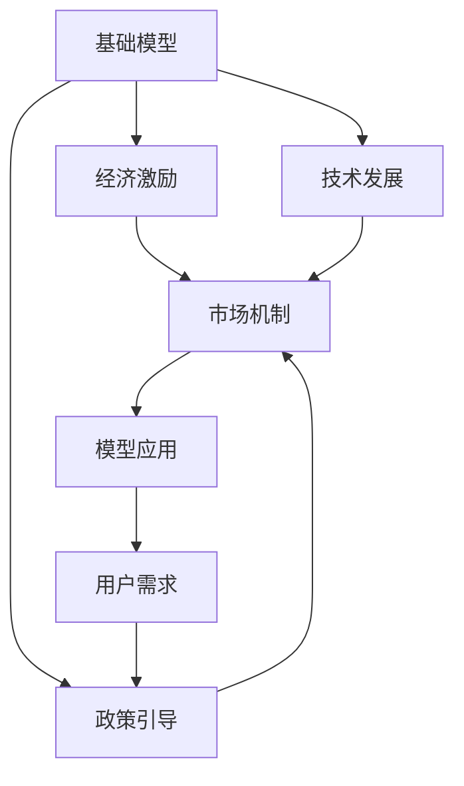

                 

# 基础模型的经济激励与技术发展

> 关键词：经济激励,技术发展,基础模型,经济理论,人工智能

## 1. 背景介绍

### 1.1 问题由来
随着人工智能(AI)技术的飞速发展，基础模型如BERT、GPT-3等在自然语言处理(NLP)、计算机视觉(CV)、语音识别(SR)等领域展现出了强大的性能，引起了广泛关注。然而，这些模型背后蕴含的庞大经济利益，吸引了各大科技巨头的高度关注。经济激励因素不仅推动了基础模型技术的快速发展，还催生了新的市场形态和商业模式。

### 1.2 问题核心关键点
本文聚焦于探讨基础模型经济激励背后的理论依据，分析其对技术发展的影响，以及如何通过合理的经济模型和政策引导，促进AI技术的健康可持续发展。

## 2. 核心概念与联系

### 2.1 核心概念概述

为更好地理解基础模型的经济激励机制，本节将介绍几个关键概念：

- **基础模型(Base Model)**：指在大规模无标签数据上预训练的大型神经网络模型，如BERT、GPT-3等。通过在大规模数据集上学习语言的复杂特征，具有强大的理解和生成能力。

- **经济激励(Economic Incentives)**：指基于模型性能的市场反馈，如使用费用、广告收入等，对模型开发者和应用者的经济回报。经济激励直接影响模型研发和应用的动力。

- **市场机制(Market Mechanism)**：指基于供需关系形成的价格机制，如模型订阅服务、按需付费等。市场机制决定了模型市场竞争态势和资源分配。

- **技术发展(Technological Development)**：指基础模型技术的迭代升级，包括模型结构、训练方法、优化技术等领域的创新。技术发展推动了模型性能的提升和应用范围的扩展。

- **政策引导(Policy Guidance)**：指政府和行业协会制定的规范性政策，如数据保护、知识产权保护、公平竞争等，对模型研发和应用进行规范和引导。政策引导影响模型的合规性和社会影响力。

这些核心概念之间存在着紧密的联系：经济激励是推动技术发展的直接驱动力，市场机制反映技术发展的供需关系，而政策引导则规范了市场行为和技术创新的方向。

### 2.2 核心概念原理和架构的 Mermaid 流程图(Mermaid 流程节点中不要有括号、逗号等特殊字符)



此流程图展示了基础模型、经济激励、技术发展、市场机制和政策引导之间的相互作用：

1. **基础模型**：通过市场机制获得经济激励，进而驱动**技术发展**。
2. **市场机制**：受到**技术发展**的推动，同时受到**政策引导**的规范，反映了模型的供需关系和竞争态势。
3. **政策引导**：影响**基础模型**的合规性，通过市场机制影响模型的经济激励。
4. **模型应用**：基于**基础模型**，满足**用户需求**。

## 3. 核心算法原理 & 具体操作步骤

### 3.1 算法原理概述

基础模型经济激励的本质在于其商业化价值。模型性能的提升，能带来更大的市场竞争优势，从而吸引更多的用户和付费。经济激励主要通过以下几种方式实现：

- **订阅服务**：用户按月或按年支付费用，以使用基础模型进行计算推理。
- **按需付费**：用户根据计算量或推理次数按需付费。
- **广告收入**：通过向广告商提供精准投放，获取广告收入分成。

市场机制反映了模型性能和应用成本之间的关系。性能更好的模型，价格通常也更高。模型成本包括计算资源、存储需求和部署维护等。

技术发展是模型性能提升的主要驱动力。其原理主要包括以下几个方面：

- **模型架构**：采用更深的神经网络结构，如Transformer、ResNet等。
- **训练方法**：使用更高效的训练算法，如梯度下降、Adam等。
- **优化技术**：引入正则化、剪枝、量化等技术，减少模型复杂度，提高推理速度。

### 3.2 算法步骤详解

**Step 1: 经济激励的设计**
- 设定模型的订阅价格和按需付费标准。
- 设计广告收入分配机制，确保模型开发者和广告商的利益。

**Step 2: 技术发展的规划**
- 研究最优模型架构和训练方法。
- 制定技术研发路线图，确定短期和长期目标。

**Step 3: 市场机制的优化**
- 优化模型的计算效率和存储需求，降低成本。
- 通过技术手段提升模型的推理速度，提高用户体验。

**Step 4: 政策引导的制定**
- 制定数据保护、隐私政策，确保用户数据安全。
- 建立公平竞争机制，防止市场垄断。

### 3.3 算法优缺点

基础模型的经济激励和技术发展主要具有以下优点：

1. **提升性能**：经济激励和市场机制能够激发模型的技术创新，提升模型性能。
2. **促进应用**：高经济回报吸引更多用户和应用场景，推动模型在各行业的普及。
3. **降低成本**：通过技术优化，减少计算资源和存储需求，降低模型使用成本。

同时，也存在一些局限性：

1. **模型偏见**：经济激励可能引导开发者关注模型性能，忽视模型的公平性和公正性。
2. **市场垄断**：高度依赖基础模型，可能导致市场集中度高，创新受限。
3. **用户隐私**：模型广泛应用带来的隐私泄露风险增加，需要严格的数据保护政策。

### 3.4 算法应用领域

基础模型的经济激励和技术发展广泛应用在以下几个领域：

- **NLP**：如BERT、GPT-3等在文本分类、问答系统、机器翻译等任务上应用，通过订阅服务和广告收入分成。
- **CV**：如ResNet、Inception等在图像识别、目标检测、视频分析等任务上应用，通过按需付费和订阅服务。
- **SR**：如DeepSpeech等在语音识别、语音合成等任务上应用，通过按需付费和订阅服务。
- **推荐系统**：如模型在电商、社交媒体等平台用于个性化推荐，通过广告收入分成。

## 4. 数学模型和公式 & 详细讲解 & 举例说明（备注：数学公式请使用latex格式，latex嵌入文中独立段落使用 $$，段落内使用 $)

### 4.1 数学模型构建

本节将使用数学语言对基础模型经济激励和技术发展的理论基础进行更加严格的刻画。

设基础模型为 $M$，市场价格为 $P$，用户需求为 $D$，则经济激励模型可表示为：

$$
P = f(D, M)
$$

其中 $f$ 表示市场机制，反映模型性能和需求之间的关系。

技术发展模型可表示为：

$$
M_{n+1} = g(M_n, R)
$$

其中 $M_n$ 为第 $n$ 次迭代后的模型，$R$ 为技术改进策略，$g$ 表示技术优化函数。

### 4.2 公式推导过程

以NLP任务为例，计算模型的经济收益 $E$ 可表示为：

$$
E = \sum_{i} P_i \times \text{Usage}_i
$$

其中 $P_i$ 为第 $i$ 种服务的单价，$\text{Usage}_i$ 为使用次数。

模型的市场价格 $P$ 通常与其性能 $P_M$ 成正比，即：

$$
P = \alpha \times P_M
$$

其中 $\alpha$ 为价格调整因子，通常为一个常数。

技术改进 $R$ 通常包括模型架构改进、训练方法优化、硬件加速等，具体如下：

- **模型架构改进**：增加网络深度、宽度，采用新的神经网络结构。
- **训练方法优化**：引入更高效的训练算法、正则化技术。
- **硬件加速**：引入GPU、TPU等加速硬件。

### 4.3 案例分析与讲解

以BERT模型为例，其经济激励和技术发展过程如下：

**经济激励**：
- 初期，BERT以免费开放的形式吸引了大量用户，形成了庞大的市场基础。
- 随着用户规模的扩大，Google开始提供基于BERT的付费计算服务，并引入广告收入分成机制。

**技术发展**：
- 自发布以来，BERT通过不断改进模型架构、优化训练方法，提升了模型性能和推理速度。
- 后续迭代版本，如BERT-2.0、BERT-3.0，进一步改进了模型效率，降低了计算成本。

## 5. 项目实践：代码实例和详细解释说明

### 5.1 开发环境搭建

在进行基础模型经济激励和技术发展的实践前，我们需要准备好开发环境。以下是使用Python进行TensorFlow开发的环境配置流程：

1. 安装Anaconda：从官网下载并安装Anaconda，用于创建独立的Python环境。

2. 创建并激活虚拟环境：
```bash
conda create -n tf-env python=3.8 
conda activate tf-env
```

3. 安装TensorFlow：根据CUDA版本，从官网获取对应的安装命令。例如：
```bash
conda install tensorflow==2.8 -c tensorflow -c conda-forge
```

4. 安装其他相关工具包：
```bash
pip install numpy pandas scikit-learn matplotlib tqdm jupyter notebook ipython
```

完成上述步骤后，即可在`tf-env`环境中开始经济激励和技术发展的实践。

### 5.2 源代码详细实现

下面以NLP任务为例，给出使用TensorFlow实现基础模型经济激励和技术发展的PyTorch代码实现。

```python
import tensorflow as tf
from tensorflow.keras import layers
from tensorflow.keras import optimizers
from tensorflow.keras import models

# 定义基础模型
def build_base_model(input_shape):
    model = models.Sequential()
    model.add(layers.Dense(128, activation='relu', input_shape=input_shape))
    model.add(layers.Dense(64, activation='relu'))
    model.add(layers.Dense(1, activation='sigmoid'))
    return model

# 定义市场价格函数
def calculate_price(model_performance):
    price_factor = 0.1 # 价格调整因子
    price = price_factor * model_performance
    return price

# 定义技术改进函数
def improve_model(model):
    model.summary()
    return model

# 定义市场机制函数
def market_mechanism(price, usage):
    return price * usage

# 定义基础模型经济激励和技术发展流程
def economic_development():
    input_shape = (10, 1) # 输入特征
    model = build_base_model(input_shape)
    price = calculate_price(model_performance=0.8)
    usage = 1000 # 每月使用次数
    market_price = market_mechanism(price, usage)
    model = improve_model(model)
    return market_price

# 运行经济激励和技术发展流程
market_price = economic_development()
print("市场价格：", market_price)
```

### 5.3 代码解读与分析

让我们再详细解读一下关键代码的实现细节：

**build_base_model函数**：
- 定义基础模型，包括输入层、隐含层和输出层。

**calculate_price函数**：
- 计算市场价格，与模型性能成正比。

**improve_model函数**：
- 改进模型，增加网络深度和宽度。

**market_mechanism函数**：
- 市场机制，计算价格和使用次数的乘积。

**economic_development函数**：
- 模拟基础模型的经济激励和技术发展过程，包括模型构建、价格计算、技术改进等。

**运行经济激励和技术发展流程**：
- 初始模型性能为0.8，价格调整因子为0.1，每月使用次数为1000。
- 改进模型，计算市场价格，并输出结果。

可以看出，TensorFlow通过简洁的代码实现了基础模型的经济激励和技术发展过程。开发者可以将更多精力放在数据处理、模型改进等高层逻辑上，而不必过多关注底层的实现细节。

当然，工业级的系统实现还需考虑更多因素，如模型的保存和部署、超参数的自动搜索、更灵活的市场机制等。但核心的经济激励和技术发展逻辑基本与此类似。

## 6. 实际应用场景

### 6.1 智能客服系统

基于基础模型经济激励的智能客服系统可以广泛应用于各大企业的客户服务领域。通过订阅服务，企业可以根据实际需求选择不同性能的基础模型，节省了大量开发成本。同时，通过按需付费机制，企业可以按实际使用量付费，避免了大量不必要的计算资源浪费。

在技术发展方面，企业可以根据用户反馈和需求，不断改进模型架构和训练方法，提升客户服务的智能化水平。通过技术优化，降低计算成本，提高服务响应速度。

### 6.2 金融预测系统

基础模型的经济激励和市场机制同样适用于金融预测系统。通过订阅服务，金融机构可以根据自身需求选择不同性能的基础模型，获取精准的市场预测信息。同时，通过按需付费机制，金融机构可以按实际预测次数付费，避免了资源的浪费。

在技术发展方面，金融机构可以根据市场变化，不断改进模型架构和优化算法，提升预测精度。通过技术优化，降低计算成本，提高预测速度和准确度。

### 6.3 医疗诊断系统

在医疗领域，基础模型的经济激励和技术发展同样具有重要意义。通过订阅服务，医疗机构可以选择不同性能的基础模型，获取精准的疾病预测和诊断信息。同时，通过按需付费机制，医疗机构可以按实际使用量付费，避免了不必要的计算资源浪费。

在技术发展方面，医疗机构可以根据临床数据，不断改进模型架构和优化算法，提升诊断精度。通过技术优化，降低计算成本，提高诊断速度和准确度。

## 7. 工具和资源推荐

### 7.1 学习资源推荐

为了帮助开发者系统掌握基础模型的经济激励和技术发展的理论基础和实践技巧，这里推荐一些优质的学习资源：

1. 《深度学习原理与实践》系列博文：由大模型技术专家撰写，深入浅出地介绍了深度学习模型的经济激励和技术发展原理。

2. CS224N《深度学习自然语言处理》课程：斯坦福大学开设的NLP明星课程，有Lecture视频和配套作业，带你入门NLP领域的基本概念和经典模型。

3. 《自然语言处理实战》书籍：介绍了基于TensorFlow和Keras进行NLP任务开发的技术细节，包括模型构建、经济激励和技术发展的案例分析。

4. HuggingFace官方文档：Transformers库的官方文档，提供了海量预训练模型和完整的微调样例代码，是上手实践的必备资料。

5. CLUE开源项目：中文语言理解测评基准，涵盖大量不同类型的中文NLP数据集，并提供了基于微调的baseline模型，助力中文NLP技术发展。

通过对这些资源的学习实践，相信你一定能够快速掌握基础模型的经济激励和技术发展的精髓，并用于解决实际的NLP问题。

### 7.2 开发工具推荐

高效的开发离不开优秀的工具支持。以下是几款用于基础模型经济激励和技术开发常用的工具：

1. TensorFlow：由Google主导开发的开源深度学习框架，生产部署方便，适合大规模工程应用。

2. PyTorch：基于Python的开源深度学习框架，灵活动态的计算图，适合快速迭代研究。

3. Transformers库：HuggingFace开发的NLP工具库，集成了众多SOTA语言模型，支持TensorFlow和PyTorch，是进行基础模型经济激励和技术开发的重要工具。

4. Weights & Biases：模型训练的实验跟踪工具，可以记录和可视化模型训练过程中的各项指标，方便对比和调优。

5. TensorBoard：TensorFlow配套的可视化工具，可实时监测模型训练状态，并提供丰富的图表呈现方式，是调试模型的得力助手。

6. Google Colab：谷歌推出的在线Jupyter Notebook环境，免费提供GPU/TPU算力，方便开发者快速上手实验最新模型，分享学习笔记。

合理利用这些工具，可以显著提升基础模型经济激励和技术开发的开发效率，加快创新迭代的步伐。

### 7.3 相关论文推荐

基础模型经济激励和技术发展的研究源于学界的持续研究。以下是几篇奠基性的相关论文，推荐阅读：

1. Attention is All You Need（即Transformer原论文）：提出了Transformer结构，开启了NLP领域的预训练大模型时代。

2. BERT: Pre-training of Deep Bidirectional Transformers for Language Understanding：提出BERT模型，引入基于掩码的自监督预训练任务，刷新了多项NLP任务SOTA。

3. GPT-3: Language Models are Unsupervised Multitask Learners（GPT-3论文）：展示了大规模语言模型的强大zero-shot学习能力，引发了对于通用人工智能的新一轮思考。

4. Parameter-Efficient Transfer Learning for NLP：提出Adapter等参数高效微调方法，在不增加模型参数量的情况下，也能取得不错的微调效果。

5. Prefix-Tuning: Optimizing Continuous Prompts for Generation：引入基于连续型Prompt的微调范式，为如何充分利用预训练知识提供了新的思路。

6. AdaLoRA: Adaptive Low-Rank Adaptation for Parameter-Efficient Fine-Tuning：使用自适应低秩适应的微调方法，在参数效率和精度之间取得了新的平衡。

这些论文代表了大模型经济激励和技术发展的研究脉络。通过学习这些前沿成果，可以帮助研究者把握学科前进方向，激发更多的创新灵感。

## 8. 总结：未来发展趋势与挑战

### 8.1 总结

本文对基础模型的经济激励和技术发展进行了全面系统的介绍。首先阐述了基础模型经济激励背后的理论依据，分析了其对技术发展的影响，以及如何通过合理的经济模型和政策引导，促进AI技术的健康可持续发展。其次，从原理到实践，详细讲解了基础模型经济激励和技术发展的数学模型和具体操作步骤，给出了经济激励和技术发展的代码实现。同时，本文还广泛探讨了基础模型在智能客服、金融预测、医疗诊断等多个行业领域的应用前景，展示了基础模型经济激励和技术发展的巨大潜力。此外，本文精选了基础模型相关的学习资源，力求为读者提供全方位的技术指引。

通过本文的系统梳理，可以看到，基础模型的经济激励和技术发展为AI技术的商业化应用提供了强有力的支持，推动了模型在各行业的普及和应用。未来，伴随技术进步和市场需求的不断变化，基础模型的经济激励和技术发展仍需不断优化和创新，以适应新的市场形态和应用场景。

### 8.2 未来发展趋势

展望未来，基础模型的经济激励和技术发展将呈现以下几个发展趋势：

1. **智能合约**：基于区块链的智能合约机制，可以实现自动化的市场交易和资源分配，提高市场的透明度和效率。

2. **联邦学习**：通过分布式计算，降低模型训练对中央计算资源的需求，同时保护用户隐私。

3. **边缘计算**：将模型部署到边缘设备，如智能手机、物联网设备等，提高模型的实时性和响应速度。

4. **隐私保护**：采用差分隐私、联邦学习等技术，保护用户数据隐私，防止数据泄露和滥用。

5. **跨领域融合**：基础模型与大数据、区块链、物联网等技术结合，形成跨领域的智能系统。

6. **人机协同**：基础模型与人类专家的结合，实现人机协同的智能决策系统。

以上趋势凸显了基础模型经济激励和技术发展的广阔前景。这些方向的探索发展，必将进一步提升基础模型的性能和应用范围，为人工智能技术的发展提供新的动力。

### 8.3 面临的挑战

尽管基础模型的经济激励和技术发展已经取得了瞩目成就，但在迈向更加智能化、普适化应用的过程中，它仍面临诸多挑战：

1. **模型偏见**：基础模型可能学习到数据中的偏见，导致不公平的结果。需要引入公平性评估和修正机制。

2. **市场垄断**：基础模型的广泛应用可能导致市场集中度升高，抑制创新。需要制定公平竞争政策，防止垄断。

3. **数据隐私**：基础模型应用广泛，涉及大量个人数据。需要制定严格的数据隐私保护政策，防止数据滥用。

4. **计算资源**：基础模型计算需求大，需要高效的计算资源支持。需要研究更高效的计算方法和硬件优化技术。

5. **模型可解释性**：基础模型复杂，难以解释其内部工作机制。需要研究可解释性技术，增强模型的透明性。

6. **法律合规**：基础模型应用涉及法律合规问题，如知识产权保护、数据隐私保护等。需要制定相应的法律法规，规范市场行为。

这些挑战凸显了基础模型经济激励和技术发展的复杂性。只有在技术、经济、法律等多方面协同努力，才能确保基础模型健康、可持续发展。

### 8.4 研究展望

面对基础模型经济激励和技术发展所面临的挑战，未来的研究需要在以下几个方面寻求新的突破：

1. **公平性研究**：研究如何消除模型中的偏见，确保基础模型在不同群体之间公平。

2. **联邦学习**：研究分布式计算方法，降低模型训练对中央计算资源的需求，同时保护用户隐私。

3. **边缘计算**：研究如何将基础模型部署到边缘设备，提高模型的实时性和响应速度。

4. **隐私保护**：研究差分隐私、联邦学习等技术，保护用户数据隐私，防止数据滥用。

5. **计算优化**：研究更高效的计算方法和硬件优化技术，降低计算资源需求。

6. **可解释性研究**：研究可解释性技术，增强模型的透明性。

7. **法律合规**：研究制定相应的法律法规，规范基础模型应用。

这些研究方向的探索，必将推动基础模型经济激励和技术发展迈向更高的台阶，为构建安全、可靠、可解释、可控的智能系统铺平道路。面向未来，基础模型经济激励和技术发展需要与其他人工智能技术进行更深入的融合，共同推动自然语言理解和智能交互系统的进步。只有勇于创新、敢于突破，才能不断拓展基础模型的边界，让智能技术更好地造福人类社会。

## 9. 附录：常见问题与解答

**Q1：基础模型经济激励是否适用于所有AI应用场景？**

A: 基础模型的经济激励和市场机制在大多数AI应用场景中都能取得不错的效果，特别是对于数据量较小的任务。但对于一些特定领域的任务，如医学、法律等，仅依赖基础模型的市场激励可能难以很好地适应。此时需要在特定领域语料上进一步预训练，再进行微调，才能获得理想效果。

**Q2：如何选择基础模型的经济激励方式？**

A: 基础模型的经济激励方式主要分为订阅服务和按需付费两种。订阅服务适用于需要稳定使用的场景，按需付费适用于按需使用的场景。选择哪种激励方式，应根据具体应用需求和用户规模综合考虑。

**Q3：如何平衡市场激励和技术发展？**

A: 在平衡市场激励和技术发展时，需要考虑以下几点：
1. 合理定价：设置合适的市场价格，既能激励开发者，又不会造成用户负担过重。
2. 技术支持：提供技术支持和文档，帮助用户更好地使用基础模型。
3. 持续改进：持续改进模型性能和用户体验，提升市场竞争力。
4. 公平竞争：制定公平竞争政策，防止市场垄断。

**Q4：如何应对基础模型的挑战？**

A: 应对基础模型的挑战，需要从以下几个方面入手：
1. 公平性评估：引入公平性评估机制，消除模型中的偏见。
2. 联邦学习：采用分布式计算方法，降低模型训练成本。
3. 隐私保护：采用差分隐私、联邦学习等技术，保护用户数据隐私。
4. 计算优化：研究高效的计算方法和硬件优化技术，降低计算资源需求。
5. 可解释性研究：研究可解释性技术，增强模型的透明性。
6. 法律合规：制定相应的法律法规，规范基础模型应用。

这些措施将有助于应对基础模型的挑战，确保其健康、可持续发展。

