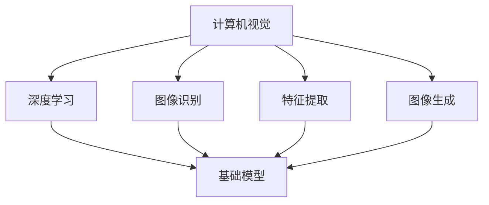

                 

# 基础模型的视觉处理能力

> 关键词：基础模型,视觉处理,计算机视觉,深度学习,图像识别,特征提取

## 1. 背景介绍

### 1.1 问题由来
近年来，计算机视觉(CV)领域的快速发展，尤其是深度学习技术的广泛应用，使得计算机对图像的理解和处理能力大幅提升。视觉处理任务包括但不限于图像分类、物体检测、人脸识别、图像生成等。这些任务依赖于基础的视觉模型作为后端支持，以保证处理效果和效率。

基础模型是指预训练得到的视觉模型，通常基于大规模数据集如ImageNet，通过自监督学习任务如自回归预测、掩码预测等进行训练，并最终获得通用的图像特征表示。这些基础模型通常作为组件或模块，被集成到下游任务中，进行特定的视觉处理。

本节将围绕基础模型在视觉处理中的角色和应用进行阐述，介绍其核心概念和前沿进展，并展望未来发展趋势。

## 2. 核心概念与联系

### 2.1 核心概念概述

为更好地理解基础模型在视觉处理中的应用，本节将介绍几个密切相关的核心概念：

- 计算机视觉(Computer Vision)：研究如何使计算机理解、处理和解释图像信息，旨在让计算机具备与人类相似的视觉感知能力。
- 深度学习(Deep Learning)：基于多层神经网络结构的机器学习技术，通过学习大量数据，进行特征提取和任务预测。
- 图像识别(Image Recognition)：计算机视觉中的重要任务，涉及识别图像中的物体、场景和行为等，通常用于图像分类、物体检测等场景。
- 特征提取(Feature Extraction)：通过视觉模型学习到的低维特征表示，用于提升下游任务的精度和效率。
- 图像生成(Image Generation)：通过学习大量图像数据，生成高质量的新图像，涉及生成对抗网络(GANs)、变分自编码器(VAEs)等技术。
- 基础模型(Foundation Model)：通过大规模数据集预训练得到的通用视觉模型，为各种视觉任务提供高效的特征提取和处理能力。

这些核心概念之间的逻辑关系可以通过以下Mermaid流程图来展示：



这个流程图展示了几者之间的关联：

1. 计算机视觉的核心任务包括图像识别、特征提取和图像生成等。
2. 深度学习是实现计算机视觉任务的主要方法，通过神经网络结构进行特征提取和学习。
3. 基础模型是预训练得到的通用视觉模型，提供高效的特征提取和处理能力。
4. 图像识别、特征提取、图像生成等任务，都依赖于基础模型的处理能力。

## 3. 核心算法原理 & 具体操作步骤
### 3.1 算法原理概述

基础模型通过在大规模数据集上自监督学习，学习到通用的图像特征表示。这些特征表示被广泛应用于各种计算机视觉任务中，包括但不限于图像分类、物体检测、人脸识别等。

基础模型的训练通常包括以下几个步骤：
1. 数据预处理：对原始图像数据进行增强、归一化等预处理。
2. 网络设计：设计包含卷积层、池化层、全连接层等的多层神经网络结构。
3. 模型训练：在图像数据集上使用反向传播算法进行训练，优化模型参数。
4. 模型评估：在验证集上评估模型性能，调整超参数，以提升模型精度。
5. 模型保存：保存训练好的模型，以备后续使用。

### 3.2 算法步骤详解

以下将详细介绍基础模型的训练流程：

**Step 1: 数据预处理**
- 原始图像数据通常需要做预处理，以提升模型训练效果。常见的预处理方法包括：
  - 缩放和归一化：将图像尺寸调整为合适的大小，并进行像素值的归一化。
  - 随机裁剪：对图像进行随机裁剪，增加样本的多样性。
  - 翻转和旋转：对图像进行随机翻转和旋转，进一步增加样本的多样性。
  - 数据增强：通过一系列的变换方法，生成更多的训练样本。

**Step 2: 网络设计**
- 基础模型通常使用卷积神经网络(CNN)作为基本结构。CNN包括卷积层、池化层和全连接层等，用于提取图像特征。
  - 卷积层：通过卷积操作提取图像局部特征。
  - 池化层：对卷积层输出的特征图进行下采样，减少特征维度。
  - 全连接层：将池化层输出的特征向量映射到最终输出类别。

**Step 3: 模型训练**
- 在预处理后的图像数据集上，使用反向传播算法进行模型训练。反向传播算法计算模型在每个样本上的损失，并根据损失梯度更新模型参数。
  - 前向传播：将图像数据输入模型，计算预测结果。
  - 损失计算：计算预测结果与真实标签之间的差异。
  - 反向传播：根据损失梯度更新模型参数。

**Step 4: 模型评估**
- 在验证集上评估模型性能，常见的评估指标包括准确率、召回率、F1值等。
  - 准确率：预测结果正确的样本占总样本的比例。
  - 召回率：预测结果正确的正样本占所有正样本的比例。
  - F1值：准确率和召回率的调和平均数，综合评估模型的性能。

**Step 5: 模型保存**
- 保存训练好的模型，以便后续使用。模型通常包括模型参数、优化器状态等。

### 3.3 算法优缺点

基础模型在计算机视觉任务中具有以下优点：
1. 通用性强：预训练得到的通用特征表示，可以用于多种计算机视觉任务，减少了任务的开发成本。
2. 可迁移性好：基础模型在不同任务上的迁移能力较强，通过微调即可适应新的视觉任务。
3. 处理能力强：基础模型通常拥有较多的参数和层数，能够处理复杂图像。
4. 精度高：由于大量的数据训练，基础模型的特征表示具有较高的精度。

然而，基础模型也存在一些缺点：
1. 资源消耗大：基础模型需要较大的内存和计算资源进行训练和推理。
2. 数据依赖性强：基础模型的性能高度依赖于训练数据的质量和多样性。
3. 难以解释：基础模型通常被视为"黑盒"，难以解释其内部工作机制。
4. 预测慢：基础模型的推理速度较慢，对于大规模数据集的处理较为耗时。

尽管存在这些缺点，但基础模型仍然是目前计算机视觉任务中最常用的模型之一。

### 3.4 算法应用领域

基础模型在计算机视觉领域具有广泛的应用，覆盖了从图像分类到图像生成等各个方面：

- 图像分类：将图像分为不同类别，如猫、狗、车等。基础模型通过提取图像特征，并使用分类器进行预测。
- 物体检测：识别图像中的物体位置和类别，如人脸检测、物体分割等。基础模型通过提取特征并使用检测器进行定位。
- 人脸识别：对图像中的人脸进行识别，用于安全认证、身份验证等场景。基础模型通过提取人脸特征，并使用分类器进行匹配。
- 图像生成：生成高质量的新图像，如图像生成、图像修复等。基础模型通过生成对抗网络(GANs)等方法，生成与训练数据分布一致的新图像。
- 图像分割：将图像分成不同的区域，用于医学图像、遥感图像等场景。基础模型通过提取特征并进行区域分割。
- 图像配准：将不同时间或空间下的图像进行对齐，用于医学影像、遥感影像等场景。基础模型通过提取特征并进行图像对齐。

除了上述这些经典任务外，基础模型还被创新性地应用到更多场景中，如图像风格迁移、图像超分辨率、图像字幕生成等，为计算机视觉技术带来了新的突破。

## 4. 数学模型和公式 & 详细讲解 & 举例说明

### 4.1 数学模型构建

基础模型的数学模型通常包括两个部分：特征提取部分和任务适配部分。

- 特征提取部分：使用卷积神经网络(CNN)提取图像特征，通常包括卷积层、池化层和全连接层等。
- 任务适配部分：根据具体任务，设计任务适配层，进行特定的预测。

以图像分类任务为例，基础模型的数学模型可以表示为：

$$
y = M_{\theta}(x)
$$

其中，$M_{\theta}$ 为预训练得到的卷积神经网络，$x$ 为输入图像，$y$ 为分类预测结果。

### 4.2 公式推导过程

以下我们将以图像分类任务为例，推导基础模型的训练公式。

假设输入图像 $x$ 的特征表示为 $f(x)$，分类器输出为 $y$。模型的损失函数为：

$$
\mathcal{L}(\theta) = -\frac{1}{N}\sum_{i=1}^N [y_i \log \hat{y}_i + (1-y_i) \log (1-\hat{y}_i)]
$$

其中，$N$ 为训练样本数，$y_i$ 为第 $i$ 个样本的真实标签，$\hat{y}_i$ 为模型对第 $i$ 个样本的预测结果。

在训练过程中，模型的参数 $\theta$ 通过梯度下降算法进行优化，以最小化损失函数：

$$
\theta \leftarrow \theta - \eta \nabla_{\theta} \mathcal{L}(\theta)
$$

其中，$\eta$ 为学习率，$\nabla_{\theta} \mathcal{L}(\theta)$ 为损失函数对模型参数的梯度。

### 4.3 案例分析与讲解

**案例：图像分类任务**

假设我们使用预训练的ResNet模型，对其进行图像分类任务的微调。

**Step 1: 数据预处理**
- 加载图像数据集，并对图像进行预处理，如缩放、归一化、翻转等。
- 将图像数据划分为训练集、验证集和测试集。

**Step 2: 网络设计**
- 加载预训练的ResNet模型，并冻结其卷积层和池化层的参数，仅训练全连接层的权重。
- 在全连接层上添加一个线性层，用于分类预测。

**Step 3: 模型训练**
- 使用AdamW优化器进行模型训练，并在训练集上进行多次迭代。
- 在验证集上评估模型性能，调整学习率和正则化系数等超参数。
- 保存训练好的模型，以便后续使用。

## 5. 项目实践：代码实例和详细解释说明

### 5.1 开发环境搭建

在进行基础模型训练和微调实践前，我们需要准备好开发环境。以下是使用PyTorch开发的环境配置流程：

1. 安装Anaconda：从官网下载并安装Anaconda，用于创建独立的Python环境。

2. 创建并激活虚拟环境：
```bash
conda create -n pytorch-env python=3.8 
conda activate pytorch-env
```

3. 安装PyTorch：根据CUDA版本，从官网获取对应的安装命令。例如：
```bash
conda install pytorch torchvision torchaudio cudatoolkit=11.1 -c pytorch -c conda-forge
```

4. 安装相关库：
```bash
pip install torch torchvision transformers
```

完成上述步骤后，即可在`pytorch-env`环境中开始训练和微调实践。

### 5.2 源代码详细实现

下面我们以ImageNet图像分类任务为例，给出使用PyTorch进行基础模型训练的完整代码实现。

首先，导入必要的库和数据集：

```python
import torch
import torch.nn as nn
from torchvision import datasets, transforms
from torch.utils.data import DataLoader
```

然后，定义数据预处理和模型：

```python
# 数据预处理
train_transforms = transforms.Compose([
    transforms.RandomResizedCrop(224),
    transforms.RandomHorizontalFlip(),
    transforms.ToTensor(),
    transforms.Normalize(mean=[0.485, 0.456, 0.406], std=[0.229, 0.224, 0.225])
])

test_transforms = transforms.Compose([
    transforms.Resize(256),
    transforms.CenterCrop(224),
    transforms.ToTensor(),
    transforms.Normalize(mean=[0.485, 0.456, 0.406], std=[0.229, 0.224, 0.225])
])

train_dataset = datasets.ImageNet(train_dir, train_transforms)
test_dataset = datasets.ImageNet(test_dir, test_transforms)

# 定义模型
model = torchvision.models.resnet50(pretrained=True)
num_ftrs = model.fc.in_features
model.fc = nn.Linear(num_ftrs, num_classes)
```

接着，定义训练和评估函数：

```python
# 训练函数
def train(model, device, train_loader, optimizer, epoch):
    model.train()
    for batch_idx, (data, target) in enumerate(train_loader):
        data, target = data.to(device), target.to(device)
        optimizer.zero_grad()
        output = model(data)
        loss = nn.functional.cross_entropy(output, target)
        loss.backward()
        optimizer.step()

# 评估函数
def evaluate(model, device, test_loader):
    model.eval()
    correct = 0
    total = 0
    with torch.no_grad():
        for data, target in test_loader:
            data, target = data.to(device), target.to(device)
            output = model(data)
            _, predicted = torch.max(output.data, 1)
            total += target.size(0)
            correct += (predicted == target).sum().item()
    print('Accuracy of the network on the test images: {} %'.format(100 * correct / total))
```

最后，启动训练流程：

```python
# 设置超参数
batch_size = 64
learning_rate = 0.001
num_epochs = 10

# 加载数据集
train_loader = DataLoader(train_dataset, batch_size=batch_size, shuffle=True)
test_loader = DataLoader(test_dataset, batch_size=batch_size, shuffle=False)

# 定义优化器
optimizer = torch.optim.Adam(model.fc.parameters(), lr=learning_rate)

# 开始训练
device = torch.device('cuda' if torch.cuda.is_available() else 'cpu')
model.to(device)
for epoch in range(num_epochs):
    train(model, device, train_loader, optimizer, epoch)
    evaluate(model, device, test_loader)
```

以上就是使用PyTorch对ImageNet图像分类任务进行基础模型训练的完整代码实现。可以看到，通过简单的配置和调用，便可以实现一个高效的基础模型训练流程。

### 5.3 代码解读与分析

让我们再详细解读一下关键代码的实现细节：

**数据预处理和模型定义**
- 定义了用于训练和测试的图像预处理方式，包括随机裁剪、随机翻转、归一化等。
- 加载预训练的ResNet模型，并替换其全连接层为新的分类器。

**训练和评估函数**
- 训练函数在每个epoch内进行一次前向传播和反向传播，更新模型参数。
- 评估函数在测试集上计算模型的准确率。

**训练流程**
- 设置训练超参数，如批大小、学习率等。
- 加载训练集和测试集，创建数据加载器。
- 定义优化器，并将模型迁移到指定设备上。
- 循环训练多次epoch，并定期在测试集上评估模型性能。

## 6. 实际应用场景

### 6.1 智能安防系统

基础模型在智能安防系统中具有广泛的应用，用于实时监测视频画面，检测异常行为和物体。安防系统通常需要处理大量的实时视频流，基础模型通过提取关键帧的特征表示，进行实时分析和推理，及时发现和响应异常事件。

在技术实现上，可以集成基础模型到安防系统中，对实时采集的视频流进行特征提取和行为检测。模型输出的结果可以实时显示在监控屏幕上，或者通过告警系统自动通知安保人员。此外，基础模型还可以与视频编解码、人脸识别等技术结合，形成更加综合的智能安防解决方案。

### 6.2 医疗影像分析

医疗影像分析是基础模型的典型应用场景之一。通过预训练得到的图像特征表示，基础模型可以高效地进行影像分类、分割和诊断。例如，在肺部CT影像中，基础模型可以自动检测出病灶位置和大小，辅助医生进行诊断和治疗。

在技术实现上，可以将基础模型集成到医疗影像分析系统中，对输入的CT、MRI等影像进行特征提取和分析。模型输出的结果可以与临床数据结合，形成综合的诊断报告，为医生提供决策支持。

### 6.3 自动驾驶系统

自动驾驶系统中的视觉感知能力至关重要。基础模型可以用于识别道路标志、行人、车辆等关键对象，为自动驾驶算法提供重要的视觉信息。

在技术实现上，可以将基础模型集成到自动驾驶系统中，对摄像头采集的实时视频流进行特征提取和对象检测。模型输出的结果可以与传感器数据结合，形成综合的决策信息，用于自动驾驶控制和导航。

### 6.4 未来应用展望

随着基础模型和深度学习技术的不断进步，其在计算机视觉领域的应用将更加广泛。未来可能的发展方向包括：

1. 多模态视觉处理：基础模型可以与其他传感器数据结合，实现更加全面的视觉感知。
2. 实时处理能力提升：通过优化算法和硬件设备，提升基础模型的推理速度，实现实时处理。
3. 模型压缩与加速：通过模型压缩和加速技术，减少资源消耗，提高计算效率。
4. 更加全面的应用场景：基础模型将被应用于更多垂直行业，如智能家居、智能办公、智能交通等。
5. 更加普适的模型结构：未来的基础模型将更加灵活和普适，适应各种复杂的视觉任务。

## 7. 工具和资源推荐
### 7.1 学习资源推荐

为了帮助开发者系统掌握基础模型的原理和实践，这里推荐一些优质的学习资源：

1. 《深度学习》（Ian Goodfellow等著）：深度学习领域的经典教材，详细介绍了深度学习的基本原理和常用技术。
2. CS231n《Convolutional Neural Networks for Visual Recognition》：斯坦福大学开设的计算机视觉课程，系统介绍了视觉处理的基本概念和技术。
3. PyTorch官方文档：PyTorch的官方文档，提供了丰富的学习资源和样例代码，帮助开发者快速上手。
4. Fast.ai课程：fast.ai提供的深度学习课程，涵盖图像分类、目标检测、图像生成等计算机视觉任务。
5. Google Colab：谷歌提供的在线Jupyter Notebook环境，免费提供GPU/TPU算力，方便开发者快速实验。

通过这些资源的学习，相信你一定能够系统掌握基础模型的原理和实践，并将其应用到实际项目中。

### 7.2 开发工具推荐

高效的开发离不开优秀的工具支持。以下是几款用于基础模型开发的常用工具：

1. PyTorch：基于Python的开源深度学习框架，灵活动态的计算图，适合快速迭代研究。
2. TensorFlow：由Google主导开发的开源深度学习框架，生产部署方便，适合大规模工程应用。
3. OpenCV：开源的计算机视觉库，提供了丰富的图像处理和计算机视觉算法。
4. FastAPI：基于PyTorch的轻量级Web框架，方便构建RESTful API服务。
5. NVIDIA DeepLearning SDK：NVIDIA提供的深度学习开发工具，支持GPU加速，适合高性能计算环境。

合理利用这些工具，可以显著提升基础模型开发和部署的效率，加速创新迭代的步伐。

### 7.3 相关论文推荐

基础模型和计算机视觉技术的发展离不开学界的持续研究。以下是几篇奠基性的相关论文，推荐阅读：

1. AlexNet：2012年ImageNet比赛冠军模型，首次展示了深度学习在图像分类中的潜力。
2. VGGNet：2014年ImageNet比赛冠军模型，提出卷积神经网络中卷积层和池化层的多样性设计。
3. ResNet：2015年ImageNet比赛冠军模型，通过残差连接解决了深度神经网络训练中的梯度消失问题。
4. InceptionNet：2014年ImageNet比赛亚军模型，通过多尺度卷积层设计提高了网络性能。
5. Mask R-CNN：2017年COCO比赛冠军模型，结合区域提议网络和掩码预测，实现了目标检测和实例分割。
6. EfficientNet：2019年ImageNet比赛冠军模型，通过自动设计网络结构提升了网络性能和参数效率。

这些论文代表了大模型和计算机视觉技术的发展脉络。通过学习这些前沿成果，可以帮助研究者把握学科前进方向，激发更多的创新灵感。

## 8. 总结：未来发展趋势与挑战

### 8.1 总结

本文对基础模型在视觉处理中的应用进行了全面系统的介绍。首先阐述了基础模型在计算机视觉中的重要角色，明确了其在图像分类、物体检测、人脸识别等任务中的高效性能。其次，从原理到实践，详细讲解了基础模型的训练流程和关键步骤，给出了基础模型训练的完整代码实现。同时，本文还广泛探讨了基础模型在智能安防、医疗影像、自动驾驶等多个领域的应用前景，展示了基础模型的巨大潜力。

通过本文的系统梳理，可以看到，基础模型已成为计算机视觉任务中最常用的模型之一。它在各种垂直行业中的应用，将带来颠覆性的变革，推动计算机视觉技术进入更加智能化、普适化的新阶段。

### 8.2 未来发展趋势

展望未来，基础模型在计算机视觉领域将呈现以下几个发展趋势：

1. 多模态融合：基础模型将与其他传感器数据结合，实现更加全面的视觉感知。
2. 实时处理能力提升：通过优化算法和硬件设备，提升基础模型的推理速度，实现实时处理。
3. 模型压缩与加速：通过模型压缩和加速技术，减少资源消耗，提高计算效率。
4. 更加全面的应用场景：基础模型将被应用于更多垂直行业，如智能家居、智能办公、智能交通等。
5. 更加普适的模型结构：未来的基础模型将更加灵活和普适，适应各种复杂的视觉任务。

以上趋势凸显了基础模型在计算机视觉领域的广阔前景。这些方向的探索发展，将进一步提升计算机视觉系统的性能和应用范围，为计算机视觉技术带来新的突破。

### 8.3 面临的挑战

尽管基础模型在计算机视觉领域取得了显著进展，但在迈向更加智能化、普适化应用的过程中，仍面临诸多挑战：

1. 数据依赖性：基础模型的性能高度依赖于训练数据的质量和多样性，获取高质量的数据成本较高。
2. 鲁棒性问题：基础模型面对噪声、遮挡等干扰时，容易出现误检测或漏检。
3. 计算资源消耗：基础模型通常需要较大的计算资源进行训练和推理，资源消耗较大。
4. 推理速度慢：基础模型的推理速度较慢，对于大规模数据集的处理较为耗时。
5. 可解释性不足：基础模型通常被视为"黑盒"，难以解释其内部工作机制和决策逻辑。
6. 安全性问题：基础模型可能会学习到有害信息或偏见，导致输出错误或不公平。

这些挑战需要在未来研究中逐步解决，以进一步推动基础模型在计算机视觉领域的应用。

### 8.4 研究展望

面对基础模型面临的挑战，未来的研究需要在以下几个方面寻求新的突破：

1. 数据生成与增强：通过生成对抗网络(GANs)和数据增强技术，获取高质量的训练数据，提升模型的泛化能力。
2. 模型鲁棒性提升：通过鲁棒学习、对抗训练等技术，提高基础模型的鲁棒性，减少噪声和干扰的影响。
3. 模型压缩与加速：通过量化、剪枝等技术，减少模型参数和计算资源消耗，提升模型的推理速度。
4. 模型可解释性增强：通过可视化工具和可解释AI技术，增强基础模型的可解释性，提升用户信任。
5. 安全性保障：通过数据过滤、对抗样本训练等技术，保障基础模型的安全性，避免有害输出。
6. 多模态融合：将基础模型与其他传感器数据结合，实现更加全面的视觉感知和理解。

这些研究方向的探索，将推动基础模型向更高性能、更普适化、更可靠的方向发展，为计算机视觉技术带来更多的创新和突破。面向未来，基础模型将在构建智能视觉系统、提升人类视觉体验等方面发挥更加重要的作用。

## 9. 附录：常见问题与解答

**Q1：什么是基础模型？**

A: 基础模型是指通过大规模数据集预训练得到的通用视觉模型，用于提取图像特征，并进行各种计算机视觉任务。

**Q2：基础模型如何进行图像分类？**

A: 基础模型通过提取图像特征，并使用全连接层进行分类预测。在训练过程中，模型参数通过反向传播算法进行优化，以最小化损失函数。在测试过程中，输入图像经过特征提取层后，使用分类器进行预测。

**Q3：基础模型的训练过程包括哪些步骤？**

A: 基础模型的训练过程包括数据预处理、网络设计、模型训练、模型评估和模型保存。数据预处理包括图像缩放、归一化等操作；网络设计包括卷积层、池化层和全连接层等；模型训练包括反向传播算法和优化器；模型评估包括计算损失函数和准确率；模型保存包括保存模型参数和优化器状态。

**Q4：基础模型有哪些应用场景？**

A: 基础模型在计算机视觉领域具有广泛的应用，包括图像分类、物体检测、人脸识别、图像生成等。具体应用场景包括智能安防、医疗影像、自动驾驶等。

**Q5：基础模型和深度学习模型有什么不同？**

A: 基础模型和深度学习模型都是基于神经网络结构的模型，但基础模型强调通用性和可迁移性，而深度学习模型则更加专注于特定任务。基础模型通过大规模数据集预训练得到通用特征表示，而深度学习模型则针对特定任务进行训练。

---

作者：禅与计算机程序设计艺术 / Zen and the Art of Computer Programming

