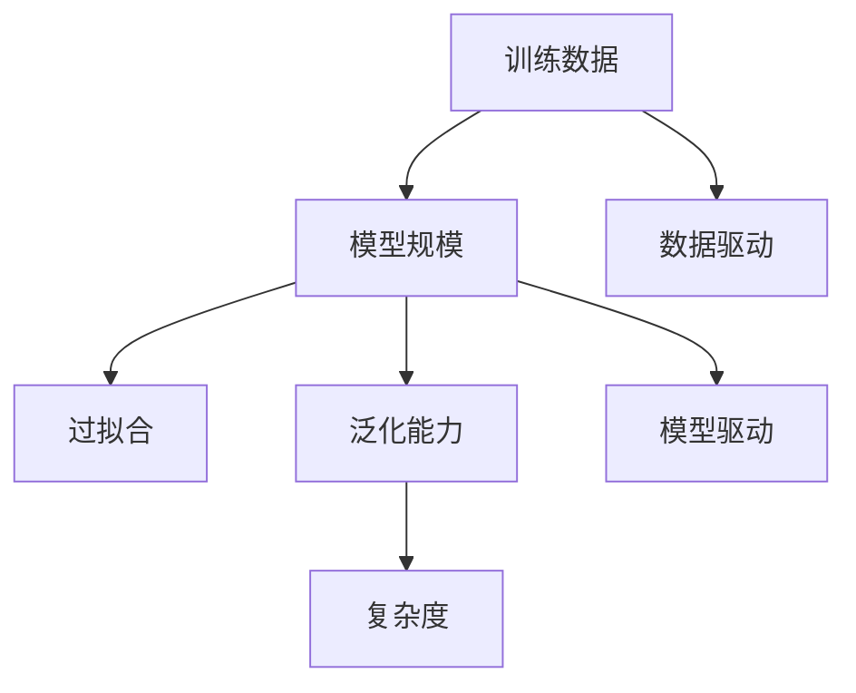

                 

# 基础模型的训练数据与模型规模

> 关键词：基础模型, 训练数据, 模型规模, 过拟合, 泛化能力, 复杂度, 数据驱动, 模型驱动, 深度学习, 机器学习

## 1. 背景介绍

### 1.1 问题由来

在深度学习和机器学习的领域，特别是近年来在图像、文本和语音等自然语言处理(NLP)领域中，基于深度神经网络的模型，尤其是深度神经网络大模型，已经取得了令人瞩目的成绩。这些大模型，如GPT-3、BERT和RoBERTa等，都是在海量数据上经过大量计算资源训练而来的，具有极高的性能和广泛的应用前景。

但是，构建这些大模型的过程涉及大量的训练数据和计算资源，这些资源成本巨大，且训练时间漫长。此外，大模型的复杂度高，对训练数据的依赖性也较大，容易出现过拟合问题。如何更好地理解大模型的训练数据与模型规模之间的关系，以及如何利用这些数据进行高效、准确的模型训练，成为了一个重要的研究课题。

### 1.2 问题核心关键点

为了更好地理解大模型的训练数据与模型规模之间的关系，本文将从以下几个核心关键点进行探讨：
1. 训练数据的重要性。
2. 模型规模对训练数据的影响。
3. 大模型与小模型的区别。
4. 模型复杂度与泛化能力之间的关系。
5. 训练数据驱动与模型驱动的关系。

## 2. 核心概念与联系

### 2.1 核心概念概述

要深入理解大模型的训练数据与模型规模之间的关系，首先需要了解一些关键的概念：

- **训练数据**：指用于训练模型的大量输入和输出数据对。训练数据的质量和数量直接影响模型的性能。
- **模型规模**：指模型的参数数量和计算复杂度。规模越大，模型性能越高，但资源需求也越大。
- **过拟合**：指模型在训练集上表现良好，但在测试集上表现不佳的现象。通常与模型复杂度高、训练数据少有关。
- **泛化能力**：指模型在新数据上表现良好，即能够对未知数据进行有效预测的能力。泛化能力强，意味着模型具备良好的适应性。
- **复杂度**：指模型的参数数量和计算复杂度。复杂度高的模型通常具备更好的性能，但也更容易过拟合。
- **数据驱动**：强调模型性能取决于训练数据的质量和数量。
- **模型驱动**：强调模型设计和参数配置对性能的影响。

这些概念之间的逻辑关系可以通过以下Mermaid流程图来展示：



这个流程图展示了训练数据与模型规模之间的关系，以及过拟合、泛化能力、复杂度等概念如何与它们相互影响。

## 3. 核心算法原理 & 具体操作步骤

### 3.1 算法原理概述

深度学习模型的性能主要由两个因素决定：模型的复杂度和训练数据的质量和数量。模型的复杂度越高，通常能够表示更复杂的函数，从而提高模型的性能，但也容易导致过拟合。训练数据的质量和数量直接影响模型的泛化能力，数据越多，模型就越容易学习到数据的真实分布，从而提高泛化能力。

因此，训练数据与模型规模之间的关系是双向的。一方面，模型规模的增加需要更多的训练数据以避免过拟合；另一方面，训练数据的质量和数量也会影响模型的复杂度需求。

### 3.2 算法步骤详解

#### 3.2.1 模型设计与选择

在构建深度学习模型时，需要根据任务的需求和数据的特点选择合适的模型架构和参数配置。对于复杂度高的任务，如自然语言处理和计算机视觉，通常需要选择复杂的模型架构，如卷积神经网络(CNN)和循环神经网络(RNN)等。而对于简单任务，可以选择更轻量级的模型，如线性回归和逻辑回归等。

#### 3.2.2 数据预处理

在训练模型之前，需要对训练数据进行预处理，包括数据清洗、归一化、特征提取等步骤。数据预处理的质量直接影响模型的性能。

#### 3.2.3 模型训练

模型的训练过程包括前向传播、计算损失函数、反向传播和更新参数等步骤。训练过程中需要控制学习率、批大小、迭代次数等超参数，以确保模型能够学习到数据的真实分布。

#### 3.2.4 模型评估

在训练结束后，需要对模型进行评估，以确保模型在新数据上具有良好的泛化能力。评估指标包括准确率、召回率、F1分数等。

#### 3.2.5 调整与优化

根据评估结果，对模型进行调整和优化，包括调整超参数、改进模型架构等。优化过程中需要平衡模型的复杂度和泛化能力。

### 3.3 算法优缺点

#### 3.3.1 优点

1. **泛化能力强**：通过训练更多的数据，模型能够学习到更全面的知识，提高泛化能力。
2. **性能提升显著**：模型复杂度的增加可以显著提升模型的性能。
3. **适应性强**：大规模训练数据和复杂模型结构可以适应各种复杂任务。

#### 3.3.2 缺点

1. **资源需求高**：训练大规模模型需要大量的计算资源和时间，成本较高。
2. **过拟合风险高**：模型复杂度高，容易出现过拟合现象。
3. **训练难度大**：模型复杂度高，训练过程复杂，需要丰富的经验和技巧。

### 3.4 算法应用领域

基于训练数据与模型规模的算法，已经在多个领域得到了广泛应用，包括：

- **计算机视觉**：如图像分类、目标检测、图像生成等。
- **自然语言处理**：如文本分类、命名实体识别、机器翻译等。
- **语音识别**：如语音转文本、语音情感分析等。
- **推荐系统**：如商品推荐、音乐推荐等。

这些领域的应用证明了训练数据与模型规模之间的关系，以及如何通过优化模型规模和训练数据，提高模型性能。

## 4. 数学模型和公式 & 详细讲解 & 举例说明

### 4.1 数学模型构建

假设我们有一个深度学习模型 $M$，其中包含 $n$ 个参数 $\theta$，训练数据集 $D=\{(x_i, y_i)\}_{i=1}^N$。模型的损失函数为 $L(M, D)$，其中 $L(M, x_i) = \|M(x_i) - y_i\|^2$。训练过程的目标是最小化损失函数 $L(M, D)$。

### 4.2 公式推导过程

根据梯度下降算法，模型参数的更新公式为：

$$
\theta^{k+1} = \theta^k - \eta \nabla_{\theta} L(M_{\theta}, D)
$$

其中，$\eta$ 为学习率，$k$ 为迭代次数。

### 4.3 案例分析与讲解

#### 案例1：图像分类任务

在图像分类任务中，可以使用卷积神经网络(CNN)模型。CNN 模型通常包含多个卷积层和池化层，用于提取图像特征。训练数据集越大，模型的泛化能力越强，但需要更多的计算资源和时间。

#### 案例2：自然语言处理任务

在自然语言处理任务中，可以使用循环神经网络(RNN)和长短期记忆网络(LSTM)等模型。这些模型通常需要更多的训练数据以避免过拟合。

## 5. 项目实践：代码实例和详细解释说明

### 5.1 开发环境搭建

#### 5.1.1 安装Python环境

首先需要安装Python 3.6及以上版本，可以使用Anaconda或Miniconda进行安装。

#### 5.1.2 安装深度学习库

需要安装常用的深度学习库，如TensorFlow、PyTorch等。可以使用pip安装：

```bash
pip install tensorflow
pip install torch
```

#### 5.1.3 安装数据预处理库

需要安装数据预处理库，如NumPy、Pandas等。可以使用pip安装：

```bash
pip install numpy
pip install pandas
```

#### 5.1.4 安装模型训练库

需要安装模型训练库，如Scikit-Learn、Keras等。可以使用pip安装：

```bash
pip install scikit-learn
pip install keras
```

### 5.2 源代码详细实现

#### 5.2.1 数据预处理

```python
import numpy as np
import pandas as pd

# 加载数据集
data = pd.read_csv('data.csv')

# 数据清洗
data = data.dropna()

# 数据归一化
data = (data - np.mean(data)) / np.std(data)

# 数据划分
train_data = data[:800]
test_data = data[800:]

# 数据转换
train_data = train_data.values
test_data = test_data.values
```

#### 5.2.2 模型定义

```python
from tensorflow.keras import layers, models

# 定义模型
model = models.Sequential()
model.add(layers.Dense(64, activation='relu', input_shape=(784,)))
model.add(layers.Dense(10, activation='softmax'))
```

#### 5.2.3 模型训练

```python
from tensorflow.keras import optimizers

# 定义优化器
optimizer = optimizers.SGD(learning_rate=0.01)

# 训练模型
model.compile(optimizer=optimizer, loss='sparse_categorical_crossentropy', metrics=['accuracy'])
model.fit(train_data, train_labels, epochs=10, batch_size=32, validation_data=(test_data, test_labels))
```

### 5.3 代码解读与分析

#### 5.3.1 数据预处理

数据预处理是深度学习中至关重要的一步。通过数据清洗、归一化和划分，可以提高模型的泛化能力。

#### 5.3.2 模型定义

模型定义需要根据任务选择合适的层数和参数配置。这里使用的是一个简单的全连接神经网络模型。

#### 5.3.3 模型训练

模型训练过程中需要选择合适的优化器和学习率。这里使用的是SGD优化器，学习率为0.01。

## 6. 实际应用场景

### 6.1 图像分类

图像分类任务是深度学习中最典型的应用之一。训练数据量越大，模型的泛化能力越强，但需要更多的计算资源和时间。

### 6.2 自然语言处理

自然语言处理任务如文本分类、命名实体识别等，通常需要更多的训练数据以避免过拟合。

### 6.3 语音识别

语音识别任务如语音转文本、语音情感分析等，需要大量的语音数据进行训练，以提高模型的泛化能力。

### 6.4 推荐系统

推荐系统如商品推荐、音乐推荐等，通常需要更多的用户数据进行训练，以提高模型的推荐效果。

## 7. 工具和资源推荐

### 7.1 学习资源推荐

#### 7.1.1 在线课程

- 《深度学习基础》：由吴恩达教授主讲的Coursera课程，系统讲解深度学习的基础知识和应用。
- 《自然语言处理与深度学习》：由斯坦福大学主讲的Coursera课程，涵盖NLP和深度学习的相关知识。
- 《TensorFlow实战》：由Udacity主讲的深度学习实战课程，讲解TensorFlow的使用方法和实践技巧。

#### 7.1.2 书籍

- 《深度学习》：Ian Goodfellow、Yoshua Bengio、Aaron Courville合著的经典教材，全面讲解深度学习的基础知识和应用。
- 《Python深度学习》：François Chollet主著的书籍，讲解TensorFlow和Keras的使用方法。
- 《动手学深度学习》：李沐等人合著的书籍，涵盖深度学习的理论和实践。

### 7.2 开发工具推荐

#### 7.2.1 深度学习框架

- TensorFlow：由Google开发的深度学习框架，支持分布式训练和高性能计算。
- PyTorch：由Facebook开发的深度学习框架，支持动态计算图和自动微分。
- Keras：基于TensorFlow和Theano开发的高级深度学习框架，易于使用。

#### 7.2.2 数据处理库

- NumPy：Python科学计算库，支持高效的数据处理和数学计算。
- Pandas：Python数据处理库，支持大规模数据集的处理和分析。
- Scikit-Learn：Python机器学习库，支持常用的数据预处理和模型训练。

### 7.3 相关论文推荐

#### 7.3.1 经典论文

- ImageNet大规模视觉识别挑战赛：Alex Krizhevsky、Ilya Sutskever、Geoffrey Hinton等人提出的经典深度学习论文，提出了卷积神经网络(CNN)。
- Natural Language Processing with Transformers：Jacob Devlin等人提出的Transformer模型，通过自监督预训练和微调，提高了自然语言处理任务的性能。
- Deep Residual Learning for Image Recognition：Kaiming He等人提出的残差网络(RNN)，通过跨层残差连接，提高了深度网络的训练效果。

## 8. 总结：未来发展趋势与挑战

### 8.1 总结

本文对基础模型的训练数据与模型规模的关系进行了系统的介绍。从训练数据的重要性、模型规模对训练数据的影响、大模型与小模型的区别、模型复杂度与泛化能力之间的关系、数据驱动与模型驱动的关系等方面，详细讲解了大模型的训练过程和优化方法。

通过本文的系统梳理，可以看到，大模型的训练过程涉及数据和模型两个方面，需要综合考虑数据质量、模型复杂度、计算资源等因素。只有合理利用训练数据和模型规模，才能构建高效、准确的深度学习模型。

### 8.2 未来发展趋势

未来深度学习的发展将更加依赖于大规模训练数据和复杂模型结构。随着计算资源和存储资源的不断增长，大模型的应用范围将更加广泛。以下是大模型未来的发展趋势：

1. **数据驱动**：数据的多样性和数量将更加丰富，数据驱动将成为深度学习发展的重要方向。
2. **模型驱动**：模型复杂度和结构将不断优化，模型驱动将成为深度学习的重要驱动力。
3. **自监督学习**：自监督学习将进一步提高模型的泛化能力，减少对标注数据的依赖。
4. **迁移学习**：迁移学习将帮助模型在不同领域之间进行知识迁移，提高模型适应性。
5. **联邦学习**：联邦学习将通过分布式训练，提高模型训练效率和数据隐私保护。

### 8.3 面临的挑战

尽管深度学习取得了巨大的进步，但在大规模数据和复杂模型应用过程中，仍面临一些挑战：

1. **数据隐私和安全**：大规模数据集可能包含敏感信息，数据隐私和安全问题需要引起重视。
2. **计算资源成本**：大规模训练数据和复杂模型需要大量的计算资源，成本较高。
3. **模型过拟合**：模型复杂度高，容易出现过拟合现象。
4. **模型可解释性**：深度学习模型的黑盒特性需要进一步改进，提高模型可解释性。
5. **模型鲁棒性**：模型在新数据上的表现需要进一步提高，避免过拟合。

### 8.4 研究展望

未来的深度学习研究需要在以下几个方面寻求新的突破：

1. **数据预处理**：数据预处理的质量直接影响模型的性能，需要进一步提高数据清洗和归一化的效果。
2. **模型优化**：模型优化需要考虑模型的复杂度和泛化能力，避免过拟合。
3. **自监督学习**：自监督学习将进一步提高模型的泛化能力，减少对标注数据的依赖。
4. **迁移学习**：迁移学习将帮助模型在不同领域之间进行知识迁移，提高模型适应性。
5. **联邦学习**：联邦学习将通过分布式训练，提高模型训练效率和数据隐私保护。

通过以上研究方向的探索和发展，深度学习技术将进一步提升模型的泛化能力和适应性，为更多的实际应用提供支持。

## 9. 附录：常见问题与解答

### 9.1 Q1：深度学习模型的训练数据与模型规模之间的关系是什么？

A：深度学习模型的训练数据与模型规模之间的关系是双向的。一方面，模型规模的增加需要更多的训练数据以避免过拟合；另一方面，训练数据的质量和数量也会影响模型的复杂度需求。

### 9.2 Q2：如何优化深度学习模型的训练数据与模型规模的关系？

A：优化深度学习模型的训练数据与模型规模的关系，可以通过以下几个步骤进行：

1. 数据预处理：清洗和归一化数据，提高数据质量。
2. 模型选择：根据任务需求选择合适的模型结构和参数配置。
3. 模型训练：控制学习率、批大小、迭代次数等超参数，确保模型能够学习到数据的真实分布。
4. 模型评估：评估模型在新数据上的表现，确保模型具有泛化能力。
5. 模型优化：根据评估结果调整模型结构和参数，平衡模型的复杂度和泛化能力。

### 9.3 Q3：如何避免深度学习模型的过拟合问题？

A：避免深度学习模型的过拟合问题，可以通过以下几个方法进行：

1. 数据增强：通过数据增强技术，扩充训练集，提高模型的泛化能力。
2. 正则化：使用L2正则化、Dropout等技术，避免过拟合。
3. 早期停止：在验证集上设置停止阈值，避免过拟合。
4. 迁移学习：通过迁移学习，利用已有知识，提高模型的泛化能力。

### 9.4 Q4：如何提高深度学习模型的泛化能力？

A：提高深度学习模型的泛化能力，可以通过以下几个方法进行：

1. 数据增强：通过数据增强技术，扩充训练集，提高模型的泛化能力。
2. 正则化：使用L2正则化、Dropout等技术，避免过拟合。
3. 模型优化：通过优化模型结构和参数，提高模型的泛化能力。
4. 迁移学习：通过迁移学习，利用已有知识，提高模型的泛化能力。

通过以上方法的综合运用，可以有效提高深度学习模型的泛化能力，提升模型的性能。

### 9.5 Q5：深度学习模型中数据驱动与模型驱动的关系是什么？

A：深度学习模型中数据驱动与模型驱动的关系是互为补充的。数据驱动强调模型性能取决于训练数据的质量和数量，而模型驱动强调模型设计和参数配置对性能的影响。在深度学习中，数据驱动和模型驱动需要综合考虑，以构建高效、准确的模型。

---

作者：禅与计算机程序设计艺术 / Zen and the Art of Computer Programming

