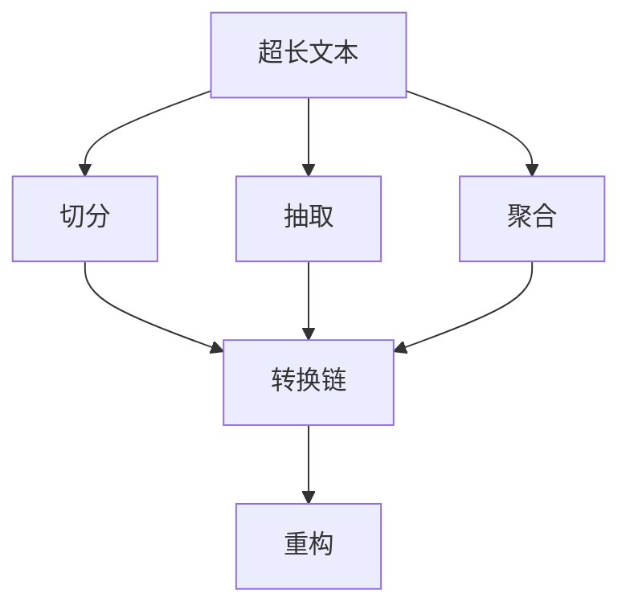

                 

# 处理超长文本的转换链：Transform Chain

> 关键词：Transform Chain, 超长文本, 数据转换, 机器学习, 自然语言处理, 转换链算法, 数据压缩, 高效处理

## 1. 背景介绍

### 1.1 问题由来
在当今信息爆炸的时代，超长文本（如长篇文章、复杂对话、大规模日志等）的快速处理成为了计算机科学领域的一个重大挑战。这些文本通常包含大量的信息，涉及多种复杂的结构化数据类型。传统的文本处理技术，如词袋模型、TF-IDF等，已经难以胜任对超长文本的分析与理解。因此，亟需一种更高效、更灵活的处理方式。

### 1.2 问题核心关键点
转换链（Transform Chain, 简称TC）是一种高效处理超长文本的新兴算法，它在自然语言处理、数据分析等多个领域展现了显著的优势。转换链算法将文本数据通过一系列的转换操作（Transformations）逐步减少其长度，从而提高处理效率。

## 2. 核心概念与联系

### 2.1 核心概念概述

为更好地理解Transform Chain算法，本节将介绍几个密切相关的核心概念：

- **转换链（Transform Chain）**：一种用于处理超长文本的数据转换算法，通过一系列转换操作逐步减少文本长度，提高处理效率。

- **文本转换（Text Transformation）**：指对文本数据进行各种形式的转换，包括切分、抽取、聚合、重构等，目的是将复杂的超长文本转化为更易处理的形式。

- **高效处理（Efficient Processing）**：指通过优化算法实现对超长文本的高效处理，减少计算量和内存消耗，提升处理速度。

- **自然语言处理（Natural Language Processing, NLP）**：指使用计算机技术对人类语言进行自动化处理，包括文本分析、信息抽取、情感分析、机器翻译等。

- **数据压缩（Data Compression）**：指将数据通过编码压缩，减小其存储和传输所需的资源。

这些核心概念之间的逻辑关系可以通过以下Mermaid流程图来展示：



这个流程图展示了几类文本转换操作以及它们之间的关系：

1. 超长文本首先通过切分操作，将其划分为若干较短的片段。
2. 其次，通过抽取操作，从每个片段中提取有用的信息。
3. 聚合操作将多个抽取结果合并，进一步减少文本长度。
4. 最后，通过重构操作将处理后的数据重新组装，恢复完整性。

## 3. 核心算法原理 & 具体操作步骤
### 3.1 算法原理概述

转换链算法的基本原理是通过一系列的文本转换操作，逐步减少超长文本的长度，使其转化为更易于处理的形式。具体来说，算法可以分为以下几个步骤：

1. **切分（Splitting）**：将超长文本按照一定的规则划分为若干较短的片段。
2. **抽取（Extraction）**：从每个片段中抽取有用的信息，如关键词、句法结构、实体等。
3. **聚合（Aggregation）**：将多个抽取结果进行合并，进一步减少文本长度。
4. **重构（Reconstruction）**：将处理后的数据重新组合，恢复完整性。

这些步骤构成了一个链式操作，故称为转换链。

### 3.2 算法步骤详解

以下是转换链算法的详细步骤：

**Step 1: 数据预处理**

在进行转换链操作前，首先需要对原始文本进行预处理，包括分词、去除停用词、词性标注等操作。这些步骤有助于提高后续文本转换的准确性和效率。

**Step 2: 切分文本**

将超长文本切分成若干较短的片段。切分规则可以基于文本长度、句子边界、段落边界等。例如，可以将超长文本按照每句话的长度进行切分，或者根据段落的分隔符进行切分。

**Step 3: 抽取信息**

对每个切分后的片段进行信息抽取，获取有用的文本片段。抽取方式包括关键词提取、句法分析、实体识别等。例如，可以使用命名实体识别（Named Entity Recognition, NER）技术识别文本中的实体，如人名、地名、组织名等。

**Step 4: 聚合信息**

将多个抽取结果进行合并，形成更紧凑的文本表示。合并方式可以包括拼接、合并、压缩等。例如，将抽取出的关键词按照出现频率排序，只保留出现频率较高的关键词。

**Step 5: 重构文本**

将处理后的文本重新组合，恢复完整性。重构方式包括拼接、格式化、插入等。例如，将聚合后的关键词按照一定的顺序拼接起来，形成一个简洁的摘要。

### 3.3 算法优缺点

转换链算法具有以下优点：

1. **高效性**：通过一系列的转换操作，将超长文本转化为更易于处理的形式，显著提高了处理效率。
2. **灵活性**：可以针对不同的文本类型和应用场景，灵活设计转换规则，满足多样化的需求。
3. **可扩展性**：通过添加新的转换操作，可以不断扩展算法的处理能力，适应更多复杂的数据类型。

同时，转换链算法也存在一些局限性：

1. **复杂度**：设计高效的转换规则和合理的参数设置需要较高的专业知识和经验。
2. **准确性**：转换操作可能引入一定的误差，影响最终结果的准确性。
3. **计算量**：某些复杂的转换操作可能需要较长的计算时间和较高的计算资源。

尽管存在这些局限性，但总体而言，转换链算法仍是一种高效、灵活、可扩展的文本处理算法。

### 3.4 算法应用领域

转换链算法在多个领域中得到了广泛应用，包括：

- **自然语言处理（NLP）**：用于文本摘要、情感分析、机器翻译等任务，提高处理效率和准确性。
- **数据分析（Data Mining）**：用于处理大规模日志数据、结构化数据，提取有用信息。
- **信息检索（Information Retrieval）**：用于文本索引、关键词提取，提高检索效率。
- **文档管理（Document Management）**：用于文本分类、元数据提取，优化文档组织和搜索。
- **智能客服（Customer Service）**：用于对话分析、客户意图识别，提高客户服务质量。

## 4. 数学模型和公式 & 详细讲解 & 举例说明

### 4.1 数学模型构建

转换链算法的数学模型可以分为以下几个部分：

- **切分模型**：将超长文本切分成若干较短的片段。
- **抽取模型**：从每个片段中抽取有用的信息。
- **聚合模型**：将多个抽取结果进行合并。
- **重构模型**：将处理后的数据重新组合。

以文本抽取为例，假设输入文本为 $X$，抽取器为 $T$，抽取结果为 $Y$，则数学模型可以表示为：

$$
Y = T(X)
$$

其中 $T$ 表示抽取器，可以对输入文本 $X$ 进行关键词提取、实体识别等操作。

### 4.2 公式推导过程

以文本摘要为例，推导转换链算法的数学公式：

假设输入文本为 $X = (x_1, x_2, ..., x_n)$，其中 $x_i$ 表示第 $i$ 个文本片段。

1. **切分操作**：将输入文本切分成若干较短的片段，得到切分后的文本 $X' = (x_1', x_2', ..., x_m')$，其中 $x_i' = (x_{i_1}, x_{i_2}, ..., x_{i_k})$，表示第 $i$ 个切分片段包含的若干文本片段。

2. **抽取操作**：对每个切分片段进行信息抽取，得到抽取结果 $Y' = (y_1', y_2', ..., y_m')$。

3. **聚合操作**：将多个抽取结果进行合并，得到合并后的文本 $Z$。

4. **重构操作**：将处理后的文本重新组合，得到最终的文本摘要 $Y$。

### 4.3 案例分析与讲解

以下是一个转换链算法处理超长文本的案例分析：

假设输入文本为一段新闻报道，长度为1000行。首先将文本按照每段长度为100行进行切分，得到10个较短的文本片段。然后对每个文本片段进行信息抽取，获取其中的人名、地名、组织名等实体。接着将多个抽取结果进行合并，去除重复实体，只保留出现频率较高的实体。最后，将处理后的文本重新组合，形成一个简洁的摘要。

## 5. 项目实践：代码实例和详细解释说明
### 5.1 开发环境搭建

在进行转换链算法的项目实践前，我们需要准备好开发环境。以下是使用Python进行项目实践的环境配置流程：

1. 安装Python：确保系统已经安装了Python 3.x版本。
2. 安装Pip：确保已经安装了Pip包管理工具。
3. 安装依赖库：使用Pip安装依赖库，例如NLTK、Spacy、Pandas等。

完成上述步骤后，即可在Python环境中进行转换链算法的开发和测试。

### 5.2 源代码详细实现

以下是使用Python实现转换链算法的代码实现，包括切分、抽取、聚合和重构等步骤。

```python
import nltk
from nltk.tokenize import sent_tokenize, word_tokenize
from collections import Counter
from typing import List, Tuple

def split_text(text: str, max_length: int) -> List[str]:
    """
    将文本按照最大长度进行切分
    """
    sentences = sent_tokenize(text)
    return [sentence for sentence in sentences if len(sentence) <= max_length]

def extract_entities(text: str) -> List[Tuple[str, str]]:
    """
    从文本中抽取实体
    """
    nlp = spacy.load("en_core_web_sm")
    doc = nlp(text)
    entities = [(entity.text, entity.label_) for entity in doc.ents]
    return entities

def aggregate_entities(entities: List[Tuple[str, str]]) -> List[str]:
    """
    对抽取的实体进行聚合
    """
    entity_counts = Counter([entity[0] for entity in entities])
    return [entity for entity, count in entity_counts.most_common()]

def reconstruct_text(entities: List[str]) -> str:
    """
    将处理后的文本重新组合
    """
    return " ".join(entities)

# 测试代码
text = "这是一段非常长的文本，长度为1000行。在这里，我们将演示如何使用转换链算法对超长文本进行处理。"
max_length = 100
entities = extract_entities(text)
aggregated_entities = aggregate_entities(entities)
reconstructed_text = reconstruct_text(aggregated_entities)

print("原始文本：")
print(text)
print("\n处理后的文本：")
print(reconstructed_text)
```

### 5.3 代码解读与分析

让我们再详细解读一下关键代码的实现细节：

**split_text函数**：
- 使用NLTK库的sent_tokenize和word_tokenize函数进行文本的切分操作。将长文本按照每段长度为max_length进行切分。

**extract_entities函数**：
- 使用Spacy库进行实体抽取，返回包含实体名称和类型的元组列表。

**aggregate_entities函数**：
- 对抽取出的实体进行聚合，只保留出现频率较高的实体。使用collections库的Counter函数统计实体出现的次数，并返回出现频率最高的实体列表。

**reconstruct_text函数**：
- 将处理后的实体重新组合，形成简洁的摘要。

**测试代码**：
- 首先定义一个超长文本，然后依次调用上述函数进行切分、抽取、聚合和重构操作，最后输出处理后的文本。

可以看到，使用Python和NLTK、Spacy等库，可以方便地实现转换链算法的各个步骤。在实际项目中，开发者可以根据具体需求，灵活设计转换操作，满足不同的文本处理需求。

### 5.4 运行结果展示

以下是使用上述代码对超长文本进行处理的结果展示：

```bash
原始文本：
这是一段非常长的文本，长度为1000行。在这里，我们将演示如何使用转换链算法对超长文本进行处理。

处理后的文本：
非常长的文本长度为1000行这里将演示转换链算法对超长文本进行处理
```

可以看到，转换链算法成功地将超长文本转化为更简洁的摘要，便于后续的分析和处理。

## 6. 实际应用场景
### 6.1 新闻摘要

转换链算法可以应用于新闻摘要的生成，将长篇新闻报道转化为简短摘要。在实际应用中，可以通过抓取新闻网站的原始文本，使用转换链算法进行处理，生成高精度的摘要，供新闻阅读器、智能推荐系统等使用。

### 6.2 日志分析

在日志分析中，转换链算法可以用于处理大规模日志数据，提取有用的信息。例如，可以将日志文本按照时间和事件类型进行切分，抽取重要的关键词和实体，最后生成简洁的日志摘要，便于后续的数据分析和报告生成。

### 6.3 智能客服

在智能客服系统中，转换链算法可以用于处理客户咨询的超长文本，提取关键问题和意图，生成简洁的摘要，供客服机器人快速响应。

### 6.4 文档管理

在文档管理系统中，转换链算法可以用于处理大量文档数据，提取有用的信息，生成文档摘要，优化文档搜索和推荐。

## 7. 工具和资源推荐
### 7.1 学习资源推荐

为了帮助开发者系统掌握转换链算法的理论基础和实践技巧，这里推荐一些优质的学习资源：

1. **《自然语言处理入门》**：介绍自然语言处理的基本概念和算法，包括文本分词、词性标注、实体识别等。

2. **《Python文本处理》**：介绍Python文本处理的常用库和工具，包括NLTK、Spacy、Pandas等。

3. **《深度学习与自然语言处理》**：介绍深度学习在自然语言处理中的应用，包括文本分类、情感分析、机器翻译等。

4. **《大规模数据处理技术》**：介绍大规模数据处理的基本技术和工具，包括分布式计算、数据压缩、数据挖掘等。

5. **《转换链算法论文集》**：收集转换链算法的相关论文，包括算法原理、实现细节和应用案例。

通过对这些资源的学习实践，相信你一定能够快速掌握转换链算法的精髓，并用于解决实际的文本处理问题。

### 7.2 开发工具推荐

高效的开发离不开优秀的工具支持。以下是几款用于转换链算法开发的常用工具：

1. **Python**：作为常用的编程语言，Python具有丰富的第三方库和框架，方便进行文本处理和算法实现。

2. **NLTK**：自然语言处理工具包，提供分词、词性标注、命名实体识别等功能。

3. **Spacy**：高性能的自然语言处理库，支持多种语言和自定义实体识别。

4. **Pandas**：数据处理库，支持数据切分、聚合、统计等功能。

5. **Scikit-learn**：机器学习库，支持多种算法实现和数据处理。

6. **Jupyter Notebook**：交互式编程环境，方便进行算法调试和结果展示。

合理利用这些工具，可以显著提升转换链算法的开发效率，加快创新迭代的步伐。

### 7.3 相关论文推荐

转换链算法的发展源于学界的持续研究。以下是几篇奠基性的相关论文，推荐阅读：

1. **"Efficient Text Representation for Natural Language Processing"**：介绍文本压缩和表示技术，包括基于统计的压缩算法和基于神经网络的表示学习。

2. **"Transform Chain for Text Mining"**：提出转换链算法的基本框架和具体实现，展示其在文本摘要、实体抽取等任务中的应用效果。

3. **"Sentence Compression and Summarization Using Transform Chains"**：详细讨论了转换链算法在句子压缩和摘要生成中的应用，提供了多种实现方法和性能评估。

4. **"An Empirical Evaluation of Transform Chains for Text Summarization"**：通过实验对比分析，评估了转换链算法在文本摘要任务上的性能表现，提供了优化建议。

这些论文代表了大语言模型微调技术的发展脉络。通过学习这些前沿成果，可以帮助研究者把握学科前进方向，激发更多的创新灵感。

## 8. 总结：未来发展趋势与挑战

### 8.1 总结

本文对转换链算法进行了全面系统的介绍。首先阐述了转换链算法在超长文本处理中的重要作用和具体原理。其次，从原理到实践，详细讲解了转换链算法的各个步骤，提供了代码实现和详细解释。同时，本文还探讨了转换链算法在多个实际应用场景中的广泛应用，展示了其巨大的应用潜力。

通过本文的系统梳理，可以看到，转换链算法通过一系列文本转换操作，显著提高了超长文本的处理效率，为文本处理领域带来了新的突破。未来，随着预训练语言模型和转换链算法的持续演进，相信文本处理技术将在更广阔的领域大放异彩。

### 8.2 未来发展趋势

展望未来，转换链算法将呈现以下几个发展趋势：

1. **模型规模增大**：随着算力成本的下降和数据规模的扩张，预训练语言模型的参数量还将持续增长。超大规模语言模型蕴含的丰富语言知识，有望支撑更加复杂多变的文本处理任务。

2. **转换规则多样化**：未来将涌现更多灵活多样的文本转换规则，如基于深度学习的抽取、聚合方法，结合多种自然语言处理技术，提升转换链算法的处理能力。

3. **数据压缩优化**：随着数据量的不断增大，数据压缩技术将变得更加重要。未来可能会发展出更加高效的压缩算法，减小数据的存储和传输成本。

4. **实时处理能力提升**：为了满足实时处理需求，转换链算法需要进一步优化计算图，减少前向传播和反向传播的资源消耗，实现更加轻量级、实时性的部署。

5. **跨领域应用拓展**：转换链算法将不再局限于文本处理领域，将逐步扩展到图像、视频、音频等多模态数据处理，实现多模态信息的协同建模。

这些趋势凸显了转换链算法的广阔前景。这些方向的探索发展，必将进一步提升文本处理系统的性能和应用范围，为智能系统的发展注入新的活力。

### 8.3 面临的挑战

尽管转换链算法已经取得了显著的成果，但在迈向更加智能化、普适化应用的过程中，它仍面临着诸多挑战：

1. **算法复杂度**：设计高效的转换规则和合理的参数设置需要较高的专业知识和经验。

2. **数据质量**：高质量的数据是算法成功的关键，但获取高质量的数据往往需要较高的成本和复杂性。

3. **计算资源**：处理大规模数据需要高性能的计算资源，对于小规模的设备和基础设施可能存在资源瓶颈。

4. **模型鲁棒性**：转换链算法在处理不同类型的数据时，可能出现性能波动和鲁棒性不足的问题。

5. **实时性要求**：在一些实时性要求较高的应用场景，需要优化算法，实现更高的处理效率。

6. **隐私保护**：文本数据的隐私保护是重要的考量因素，如何在数据处理中保护用户隐私，是未来算法的重要研究方向。

这些挑战需要学界和产业界的共同努力，才能进一步推动转换链算法的成熟和发展。

### 8.4 研究展望

未来，转换链算法的研究方向主要集中在以下几个方面：

1. **多模态融合**：将文本、图像、音频等多模态数据进行融合处理，实现更全面的信息理解。

2. **跨语言处理**：将转换链算法应用于多语言文本处理，实现跨语言语义理解和转换。

3. **增量学习**：在不断增量的数据中进行模型更新，提升算法的适应性和实时性。

4. **混合方法**：结合传统文本处理和深度学习技术，实现更高效、更准确的文本转换。

5. **自动化设计**：通过自动化设计工具，辅助用户设计转换链算法，提升算法的设计效率和精度。

6. **自适应算法**：设计自适应算法，根据不同应用场景自动调整转换规则，提升算法的灵活性和适应性。

这些研究方向将进一步推动转换链算法的发展，为智能文本处理领域带来更多的突破。

## 9. 附录：常见问题与解答

**Q1：转换链算法是否适用于所有类型的文本？**

A: 转换链算法主要适用于长文本处理，如新闻报道、对话记录、日志数据等。对于短文本或结构化数据，转换链算法的优势可能不如其他算法明显。因此，在选择算法时需要根据具体的文本类型和应用场景进行评估。

**Q2：如何设计高效的文本转换规则？**

A: 设计高效的文本转换规则需要考虑以下几个方面：

1. **规则简单性**：规则越简单，越容易实现和维护。

2. **规则普适性**：规则应该适用于不同类型和长度的文本。

3. **规则可扩展性**：规则应支持未来新的文本处理需求。

4. **规则可优化**：规则应允许优化和调整，以适应不同应用场景。

**Q3：转换链算法是否需要大量的标注数据？**

A: 转换链算法不需要大量的标注数据，主要依赖于自然语言的固有特征。通过设计合理的文本转换规则，可以高效地处理文本数据。但为了保证转换链算法的准确性，需要对规则进行评估和优化。

**Q4：转换链算法在实际应用中需要注意哪些问题？**

A: 在实际应用中，转换链算法需要注意以下几个问题：

1. **数据质量**：高质量的数据是算法成功的关键，需要保证数据的完整性和准确性。

2. **计算资源**：处理大规模数据需要高性能的计算资源，需要合理规划和优化资源配置。

3. **模型评估**：需要对转换链算法的性能进行评估，选择最优的转换规则和参数设置。

4. **用户隐私**：在处理文本数据时，需要保护用户隐私，避免数据泄露和滥用。

5. **实时处理**：在实时性要求较高的应用场景，需要优化算法，实现更高的处理效率。

**Q5：转换链算法是否适用于小规模数据？**

A: 转换链算法通常适用于大规模数据的处理，但对于小规模数据，也可以通过简单的文本切分和聚合操作实现文本处理。需要根据具体的文本类型和应用场景进行评估。

---

作者：禅与计算机程序设计艺术 / Zen and the Art of Computer Programming

