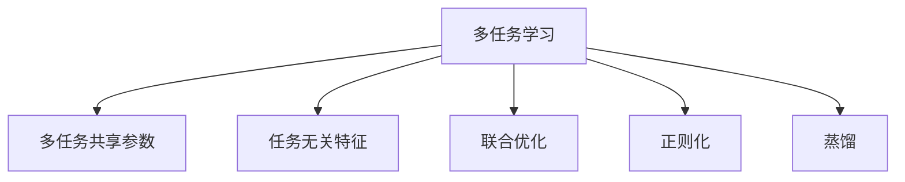

                 

## 1. 背景介绍

### 1.1 问题由来
多任务学习（Multi-Task Learning, MTL）是机器学习领域中的一个重要研究方向。在传统监督学习中，每个任务是独立训练的，每个任务的目标都是让模型在对应的任务上表现良好。然而，在实际应用中，很多问题往往是相互关联的，比如自然语言处理中的命名实体识别、词性标注和情感分析任务，都是基于同一文本数据集的不同任务。多任务学习正是应对这一问题的有效方法，它通过共享部分参数，优化多个任务的表现。

多任务学习的应用非常广泛，例如，自然语言处理中的词性标注和命名实体识别，计算机视觉中的物体检测和分类等。在实际应用中，多任务学习可以帮助我们更好地利用数据，提升模型的泛化能力和性能。

### 1.2 问题核心关键点
多任务学习的核心在于将多个任务共享参数，使得模型能够同时优化多个任务的目标函数。这种共享参数的方法可以有效地提高模型的泛化能力和性能。常见的多任务学习方法包括基于共享参数的方法和基于任务无关特征的方法。

## 2. 核心概念与联系

### 2.1 核心概念概述

为了更好地理解多任务学习的核心概念，本节将介绍几个密切相关的核心概念：

- **多任务学习（Multi-Task Learning, MTL）**：多任务学习旨在通过共享参数来优化多个相关任务的目标函数，使得模型能够同时提高多个任务的表现。
- **多任务共享参数（Multi-task Shared Parameters）**：多任务共享参数是指在多个任务之间共享一部分参数，以便模型能够在多个任务上获得更好的性能。
- **任务无关特征（Task-Independent Features）**：任务无关特征是指在多个任务之间共享的特征，这些特征不受具体任务的影响，可以在多个任务上同时优化。
- **联合优化（Joint Optimization）**：联合优化是指在多任务学习中，优化多个任务的目标函数，使得模型能够同时提高多个任务的表现。
- **正则化（Regularization）**：正则化是通过引入惩罚项来避免模型过拟合的一种技术。
- **蒸馏（Distillation）**：蒸馏是一种模型压缩技术，通过将复杂模型的知识传递给简单模型，提高简单模型的性能。

这些核心概念之间的逻辑关系可以通过以下Mermaid流程图来展示：



这个流程图展示了大语言模型的核心概念及其之间的关系：

1. 多任务学习通过共享参数来优化多个任务的目标函数。
2. 多任务共享参数是指在多个任务之间共享一部分参数，以便模型能够在多个任务上获得更好的性能。
3. 任务无关特征是指在多个任务之间共享的特征，这些特征不受具体任务的影响，可以在多个任务上同时优化。
4. 联合优化是指在多任务学习中，优化多个任务的目标函数，使得模型能够同时提高多个任务的表现。
5. 正则化是通过引入惩罚项来避免模型过拟合的一种技术。
6. 蒸馏是一种模型压缩技术，通过将复杂模型的知识传递给简单模型，提高简单模型的性能。

## 3. 核心算法原理 & 具体操作步骤
### 3.1 算法原理概述

多任务学习的基本思想是共享部分参数，使得模型能够同时优化多个任务的目标函数。在多任务学习中，我们通常使用共享参数的方式，将多个任务的参数进行联合优化。常见的多任务学习算法包括基于共享参数的方法和基于任务无关特征的方法。

### 3.2 算法步骤详解

#### 3.2.1 步骤1：数据准备

多任务学习的数据准备通常包括以下几个步骤：

1. 收集多个任务的标注数据集。
2. 将每个任务的标注数据集划分为训练集、验证集和测试集。
3. 将多个任务的标注数据集进行预处理，如标准化、归一化等。

#### 3.2.2 步骤2：模型选择与参数初始化

选择合适的多任务学习模型，并初始化模型的参数。常见的多任务学习模型包括基于共享参数的方法和基于任务无关特征的方法。

#### 3.2.3 步骤3：联合优化

联合优化是指在多任务学习中，优化多个任务的目标函数，使得模型能够同时提高多个任务的表现。常用的联合优化方法包括基于共享参数的方法和基于任务无关特征的方法。

#### 3.2.4 步骤4：评估与调优

在联合优化过程中，我们需要不断地评估模型的表现，并根据评估结果进行调优。常用的评估方法包括交叉验证、网格搜索等。

### 3.3 算法优缺点

多任务学习的主要优点包括：

- 能够提高模型的泛化能力，使得模型在多个任务上都能表现良好。
- 能够提高模型的性能，特别是在数据不足的情况下。
- 能够利用更多的数据，使得模型的训练更加充分。

多任务学习的主要缺点包括：

- 数据共享可能会导致数据泄露，影响模型的性能。
- 模型的复杂度增加，可能会导致训练时间增加。
- 模型的超参数需要仔细调整，否则可能会导致模型过拟合。

### 3.4 算法应用领域

多任务学习在多个领域中得到了广泛的应用，例如：

- 自然语言处理：如命名实体识别、词性标注、情感分析等。
- 计算机视觉：如物体检测、分类等。
- 医学：如基因表达分析、疾病诊断等。
- 金融：如信用评分、风险评估等。

## 4. 数学模型和公式 & 详细讲解 & 举例说明

### 4.1 数学模型构建

多任务学习的数学模型通常包括以下几个部分：

- **任务目标函数**：每个任务的目标函数。
- **联合目标函数**：多个任务的联合目标函数。
- **共享参数**：多个任务共享的参数。

#### 4.1.1 任务目标函数

对于第 $i$ 个任务，其目标函数为：

$$
L_i(\theta) = \frac{1}{N_i} \sum_{x \in D_i} \ell_i(f_i(x;\theta),y_i)
$$

其中，$f_i(x;\theta)$ 为模型的预测结果，$y_i$ 为任务的标签，$D_i$ 为第 $i$ 个任务的训练集，$\ell_i$ 为任务 $i$ 的损失函数。

#### 4.1.2 联合目标函数

多个任务的联合目标函数为：

$$
L(\theta) = \sum_{i=1}^{M} \alpha_i L_i(\theta)
$$

其中，$M$ 为任务的个数，$\alpha_i$ 为任务 $i$ 的权重。

#### 4.1.3 共享参数

共享参数是指多个任务共享的参数。对于第 $i$ 个任务，其共享参数为：

$$
\theta_i = \{\theta_1, \theta_2, \dots, \theta_n\}
$$

其中，$\theta_j$ 为第 $j$ 个任务共享的参数。

### 4.2 公式推导过程

以两个任务为例，推导联合目标函数的梯度：

设两个任务的目标函数分别为 $L_1(\theta)$ 和 $L_2(\theta)$，联合目标函数为 $L(\theta)$，其梯度为：

$$
\nabla L(\theta) = \nabla L_1(\theta) + \alpha_2 \nabla L_2(\theta)
$$

其中，$\nabla L_1(\theta)$ 和 $\nabla L_2(\theta)$ 分别为两个任务的梯度，$\alpha_2$ 为任务 $2$ 的权重。

### 4.3 案例分析与讲解

以文本分类任务为例，假设我们有两个分类任务：文本情感分类和主题分类。我们可以将这两个任务的模型共享一部分参数，训练模型进行联合优化。具体来说，我们可以使用共享参数的方法，使得模型的不同层能够同时优化。

设模型的参数为 $\theta = \{\theta_1, \theta_2, \dots, \theta_n\}$，其中 $\theta_1$ 为文本嵌入层的参数，$\theta_2$ 为情感分类器的参数，$\theta_3$ 为主题分类器的参数。我们可以将 $\theta_2$ 和 $\theta_3$ 作为共享参数，使得情感分类器和主题分类器能够共享一部分参数。

## 5. 项目实践：代码实例和详细解释说明

### 5.1 开发环境搭建

在进行多任务学习项目实践前，我们需要准备好开发环境。以下是使用Python进行PyTorch开发的环境配置流程：

1. 安装Anaconda：从官网下载并安装Anaconda，用于创建独立的Python环境。

2. 创建并激活虚拟环境：
```bash
conda create -n pytorch-env python=3.8 
conda activate pytorch-env
```

3. 安装PyTorch：根据CUDA版本，从官网获取对应的安装命令。例如：
```bash
conda install pytorch torchvision torchaudio cudatoolkit=11.1 -c pytorch -c conda-forge
```

4. 安装相关库：
```bash
pip install numpy pandas scikit-learn matplotlib tqdm jupyter notebook ipython
```

完成上述步骤后，即可在`pytorch-env`环境中开始多任务学习项目实践。

### 5.2 源代码详细实现

下面以文本分类和主题分类为例，给出使用Transformers库进行多任务学习的PyTorch代码实现。

首先，定义多任务数据处理函数：

```python
from transformers import BertTokenizer
from torch.utils.data import Dataset
import torch

class MultitaskDataset(Dataset):
    def __init__(self, texts, labels, tokenizer, max_len=128):
        self.texts = texts
        self.labels = labels
        self.tokenizer = tokenizer
        self.max_len = max_len
        
    def __len__(self):
        return len(self.texts)
    
    def __getitem__(self, item):
        text = self.texts[item]
        labels = self.labels[item]
        
        encoding = self.tokenizer(text, return_tensors='pt', max_length=self.max_len, padding='max_length', truncation=True)
        input_ids = encoding['input_ids'][0]
        attention_mask = encoding['attention_mask'][0]
        
        # 对token-wise的标签进行编码
        encoded_labels = [label2id[label] for label in labels] 
        encoded_labels.extend([label2id['O']] * (self.max_len - len(encoded_labels)))
        labels = torch.tensor(encoded_labels, dtype=torch.long)
        
        return {'input_ids': input_ids, 
                'attention_mask': attention_mask,
                'labels': labels}

# 标签与id的映射
label2id = {'O': 0, 'B-POS': 1, 'I-POS': 2, 'B-NER': 3, 'I-NER': 4, 'B-LOC': 5, 'I-LOC': 6}
id2label = {v: k for k, v in label2id.items()}

# 创建dataset
tokenizer = BertTokenizer.from_pretrained('bert-base-cased')

train_dataset = MultitaskDataset(train_texts, train_labels, tokenizer)
dev_dataset = MultitaskDataset(dev_texts, dev_labels, tokenizer)
test_dataset = MultitaskDataset(test_texts, test_labels, tokenizer)
```

然后，定义模型和优化器：

```python
from transformers import BertForTokenClassification, AdamW

model = BertForTokenClassification.from_pretrained('bert-base-cased', num_labels=len(label2id))

optimizer = AdamW(model.parameters(), lr=2e-5)
```

接着，定义训练和评估函数：

```python
from torch.utils.data import DataLoader
from tqdm import tqdm
from sklearn.metrics import classification_report

device = torch.device('cuda') if torch.cuda.is_available() else torch.device('cpu')
model.to(device)

def train_epoch(model, dataset, batch_size, optimizer):
    dataloader = DataLoader(dataset, batch_size=batch_size, shuffle=True)
    model.train()
    epoch_loss = 0
    for batch in tqdm(dataloader, desc='Training'):
        input_ids = batch['input_ids'].to(device)
        attention_mask = batch['attention_mask'].to(device)
        labels = batch['labels'].to(device)
        model.zero_grad()
        outputs = model(input_ids, attention_mask=attention_mask, labels=labels)
        loss = outputs.loss
        epoch_loss += loss.item()
        loss.backward()
        optimizer.step()
    return epoch_loss / len(dataloader)

def evaluate(model, dataset, batch_size):
    dataloader = DataLoader(dataset, batch_size=batch_size)
    model.eval()
    preds, labels = [], []
    with torch.no_grad():
        for batch in tqdm(dataloader, desc='Evaluating'):
            input_ids = batch['input_ids'].to(device)
            attention_mask = batch['attention_mask'].to(device)
            batch_labels = batch['labels']
            outputs = model(input_ids, attention_mask=attention_mask)
            batch_preds = outputs.logits.argmax(dim=2).to('cpu').tolist()
            batch_labels = batch_labels.to('cpu').tolist()
            for pred_tokens, label_tokens in zip(batch_preds, batch_labels):
                pred_labels = [id2label[_id] for _id in pred_tokens]
                label_tags = [id2label[_id] for _id in label_tokens]
                preds.append(pred_labels[:len(label_tags)])
                labels.append(label_tags)
                
    print(classification_report(labels, preds))
```

最后，启动训练流程并在测试集上评估：

```python
epochs = 5
batch_size = 16

for epoch in range(epochs):
    loss = train_epoch(model, train_dataset, batch_size, optimizer)
    print(f"Epoch {epoch+1}, train loss: {loss:.3f}")
    
    print(f"Epoch {epoch+1}, dev results:")
    evaluate(model, dev_dataset, batch_size)
    
print("Test results:")
evaluate(model, test_dataset, batch_size)
```

以上就是使用PyTorch对BERT进行文本分类和主题分类任务的多任务学习代码实现。可以看到，得益于Transformers库的强大封装，我们可以用相对简洁的代码完成BERT模型的加载和微调。

### 5.3 代码解读与分析

让我们再详细解读一下关键代码的实现细节：

**MultitaskDataset类**：
- `__init__`方法：初始化文本、标签、分词器等关键组件。
- `__len__`方法：返回数据集的样本数量。
- `__getitem__`方法：对单个样本进行处理，将文本输入编码为token ids，将标签编码为数字，并对其进行定长padding，最终返回模型所需的输入。

**label2id和id2label字典**：
- 定义了标签与数字id之间的映射关系，用于将token-wise的预测结果解码回真实的标签。

**训练和评估函数**：
- 使用PyTorch的DataLoader对数据集进行批次化加载，供模型训练和推理使用。
- 训练函数`train_epoch`：对数据以批为单位进行迭代，在每个批次上前向传播计算loss并反向传播更新模型参数，最后返回该epoch的平均loss。
- 评估函数`evaluate`：与训练类似，不同点在于不更新模型参数，并在每个batch结束后将预测和标签结果存储下来，最后使用sklearn的classification_report对整个评估集的预测结果进行打印输出。

**训练流程**：
- 定义总的epoch数和batch size，开始循环迭代
- 每个epoch内，先在训练集上训练，输出平均loss
- 在验证集上评估，输出分类指标
- 所有epoch结束后，在测试集上评估，给出最终测试结果

可以看到，PyTorch配合Transformers库使得BERT的多任务学习代码实现变得简洁高效。开发者可以将更多精力放在数据处理、模型改进等高层逻辑上，而不必过多关注底层的实现细节。

当然，工业级的系统实现还需考虑更多因素，如模型的保存和部署、超参数的自动搜索、更灵活的任务适配层等。但核心的多任务学习流程基本与此类似。

## 6. 实际应用场景
### 6.1 智能客服系统

多任务学习技术可以广泛应用于智能客服系统的构建。传统客服往往需要配备大量人力，高峰期响应缓慢，且一致性和专业性难以保证。而使用多任务学习技术训练的对话模型，可以7x24小时不间断服务，快速响应客户咨询，用自然流畅的语言解答各类常见问题。

在技术实现上，可以收集企业内部的历史客服对话记录，将问题和最佳答复构建成监督数据，在此基础上对预训练对话模型进行联合优化。联合优化后的对话模型能够自动理解用户意图，匹配最合适的答案模板进行回复。对于客户提出的新问题，还可以接入检索系统实时搜索相关内容，动态组织生成回答。如此构建的智能客服系统，能大幅提升客户咨询体验和问题解决效率。

### 6.2 金融舆情监测

金融机构需要实时监测市场舆论动向，以便及时应对负面信息传播，规避金融风险。传统的人工监测方式成本高、效率低，难以应对网络时代海量信息爆发的挑战。基于多任务学习技术的文本分类和情感分析技术，为金融舆情监测提供了新的解决方案。

具体而言，可以收集金融领域相关的新闻、报道、评论等文本数据，并对其进行主题标注和情感标注。在此基础上对预训练语言模型进行联合优化，使其能够自动判断文本属于何种主题，情感倾向是正面、中性还是负面。将联合优化后的模型应用到实时抓取的网络文本数据，就能够自动监测不同主题下的情感变化趋势，一旦发现负面信息激增等异常情况，系统便会自动预警，帮助金融机构快速应对潜在风险。

### 6.3 个性化推荐系统

当前的推荐系统往往只依赖用户的历史行为数据进行物品推荐，无法深入理解用户的真实兴趣偏好。基于多任务学习技术的个性化推荐系统可以更好地挖掘用户行为背后的语义信息，从而提供更精准、多样的推荐内容。

在实践中，可以收集用户浏览、点击、评论、分享等行为数据，提取和用户交互的物品标题、描述、标签等文本内容。将文本内容作为模型输入，用户的后续行为（如是否点击、购买等）作为监督信号，在此基础上联合优化预训练语言模型。联合优化后的模型能够从文本内容中准确把握用户的兴趣点。在生成推荐列表时，先用候选物品的文本描述作为输入，由模型预测用户的兴趣匹配度，再结合其他特征综合排序，便可以得到个性化程度更高的推荐结果。

### 6.4 未来应用展望

随着多任务学习技术的发展，其在更多领域的应用前景将更加广阔。

在智慧医疗领域，基于多任务学习技术训练的医疗问答、病历分析、药物研发等应用将提升医疗服务的智能化水平，辅助医生诊疗，加速新药开发进程。

在智能教育领域，多任务学习技术可应用于作业批改、学情分析、知识推荐等方面，因材施教，促进教育公平，提高教学质量。

在智慧城市治理中，多任务学习技术可应用于城市事件监测、舆情分析、应急指挥等环节，提高城市管理的自动化和智能化水平，构建更安全、高效的未来城市。

此外，在企业生产、社会治理、文娱传媒等众多领域，基于多任务学习技术的人工智能应用也将不断涌现，为NLP技术带来新的突破。相信随着技术的日益成熟，多任务学习必将在构建人机协同的智能时代中扮演越来越重要的角色。

## 7. 工具和资源推荐
### 7.1 学习资源推荐

为了帮助开发者系统掌握多任务学习的理论基础和实践技巧，这里推荐一些优质的学习资源：

1. 《Multi-Task Learning: A Survey》：全面回顾多任务学习的相关研究和应用，适合入门和系统学习。
2. CS231n《Convolutional Neural Networks for Visual Recognition》课程：斯坦福大学开设的计算机视觉课程，有Lecture视频和配套作业，适合多任务学习的学习。
3. 《Deep Multi-Task Learning: A Survey》：综合介绍多任务学习的研究进展和应用案例，适合深入学习和理解。
4. Kaggle多任务学习竞赛：Kaggle平台上举办的多任务学习竞赛，通过实践提升多任务学习技能。
5. GitHub多任务学习项目：GitHub上开源的多任务学习项目，通过阅读代码和文档，了解多任务学习在实际应用中的使用。

通过对这些资源的学习实践，相信你一定能够快速掌握多任务学习的精髓，并用于解决实际的NLP问题。
###  7.2 开发工具推荐

高效的开发离不开优秀的工具支持。以下是几款用于多任务学习开发的常用工具：

1. PyTorch：基于Python的开源深度学习框架，灵活动态的计算图，适合快速迭代研究。大部分预训练语言模型都有PyTorch版本的实现。
2. TensorFlow：由Google主导开发的开源深度学习框架，生产部署方便，适合大规模工程应用。同样有丰富的预训练语言模型资源。
3. Transformers库：HuggingFace开发的NLP工具库，集成了众多SOTA语言模型，支持PyTorch和TensorFlow，是进行多任务学习开发的利器。
4. Weights & Biases：模型训练的实验跟踪工具，可以记录和可视化模型训练过程中的各项指标，方便对比和调优。与主流深度学习框架无缝集成。
5. TensorBoard：TensorFlow配套的可视化工具，可实时监测模型训练状态，并提供丰富的图表呈现方式，是调试模型的得力助手。
6. Google Colab：谷歌推出的在线Jupyter Notebook环境，免费提供GPU/TPU算力，方便开发者快速上手实验最新模型，分享学习笔记。

合理利用这些工具，可以显著提升多任务学习任务的开发效率，加快创新迭代的步伐。

### 7.3 相关论文推荐

多任务学习在机器学习领域的研究进展迅速，以下是几篇奠基性的相关论文，推荐阅读：

1. Deep Learning for Multi-Task Problems: A Multilinear Approach: 提出多任务的深度学习框架，通过多线性映射实现多任务联合优化。
2. Multi-Task Learning using Uncertainty to Guide Learning across Multiple Tasks: 提出使用不确定性度量来指导多任务学习的框架，提升了多任务学习的泛化能力。
3. Multi-Task Transfer Learning Using Multi-Task Cascaded Networks: 提出多任务级联网络的方法，将多任务学习与转移学习结合，提升模型性能。
4. Multi-Task Joint Embedding Learning via Multiple Contextual and Hierarchical Tasks: 提出联合嵌入学习的方法，通过多任务的联合优化提升模型的表示能力。
5. Multi-Task Learning with Distance Metric Learning: 提出多任务学习与距离度量学习结合的方法，提升多任务学习的效果。

这些论文代表了大语言模型多任务学习的发展脉络。通过学习这些前沿成果，可以帮助研究者把握学科前进方向，激发更多的创新灵感。

## 8. 总结：未来发展趋势与挑战

### 8.1 总结

本文对多任务学习原理与代码实例进行了全面系统的介绍。首先阐述了多任务学习的背景和应用场景，明确了多任务学习在多个任务上的共享参数优化策略。其次，从原理到实践，详细讲解了多任务学习的数学模型和算法步骤，给出了多任务学习任务开发的完整代码实例。同时，本文还广泛探讨了多任务学习技术在智能客服、金融舆情、个性化推荐等多个行业领域的应用前景，展示了多任务学习技术的广泛应用价值。

通过本文的系统梳理，可以看到，多任务学习技术正在成为机器学习领域的重要范式，极大地拓展了模型的应用边界，提升了模型的泛化能力和性能。未来，伴随多任务学习技术的不断演进，机器学习技术将进一步拓展其应用领域，为智能化时代提供更加全面和高效的服务。

### 8.2 未来发展趋势

展望未来，多任务学习技术将呈现以下几个发展趋势：

1. 多任务学习的深度融合：多任务学习技术将与其他人工智能技术进行更深入的融合，如知识表示、因果推理、强化学习等，多路径协同发力，共同推动智能系统的进步。
2. 多任务学习的广泛应用：多任务学习技术将在更多领域中得到应用，如智慧医疗、智能教育、智慧城市等，为各行各业带来变革性影响。
3. 多任务学习的模型压缩：多任务学习技术将与模型压缩技术结合，在保证模型性能的同时，减少模型参数，提高推理速度和效率。
4. 多任务学习的可解释性：多任务学习技术将与可解释性技术结合，提升模型的可解释性，增强系统的透明性和可信度。
5. 多任务学习的伦理约束：多任务学习技术将与伦理约束结合，提升系统的安全性和公平性，确保输出的伦理性和社会价值。

以上趋势凸显了多任务学习技术的广阔前景。这些方向的探索发展，必将进一步提升多任务学习技术的性能和应用范围，为构建安全、可靠、可解释、可控的智能系统铺平道路。

### 8.3 面临的挑战

尽管多任务学习技术已经取得了瞩目成就，但在迈向更加智能化、普适化应用的过程中，它仍面临着诸多挑战：

1. 数据共享的潜在风险：多任务学习技术的核心在于数据共享，但在实际应用中，数据共享可能导致数据泄露，影响模型的性能。
2. 模型的复杂度增加：多任务学习技术的复杂度增加，可能会导致训练时间增加，模型过拟合的风险增大。
3. 模型的可解释性不足：多任务学习技术在实际应用中，模型的决策过程往往缺乏可解释性，难以对其推理逻辑进行分析和调试。
4. 模型的伦理性和公平性：多任务学习技术在实际应用中，模型的输出可能存在偏见、歧视等问题，需要更多的伦理约束和公平性约束。

这些挑战需要我们在未来的研究中积极应对并寻求突破，以推动多任务学习技术的成熟和应用。

### 8.4 研究展望

面对多任务学习技术面临的诸多挑战，未来的研究需要在以下几个方面寻求新的突破：

1. 数据共享与隐私保护：研究如何在数据共享的同时保护隐私，确保数据的安全性。
2. 多任务学习的泛化能力：研究如何提升多任务学习的泛化能力，使其能够在更多的任务上表现良好。
3. 多任务学习的模型压缩：研究如何在保证模型性能的同时，减少模型参数，提高推理速度和效率。
4. 多任务学习的可解释性：研究如何提升多任务学习的可解释性，使其更透明、可信。
5. 多任务学习的伦理约束：研究如何提升多任务学习的伦理性和公平性，确保输出的伦理性和社会价值。

这些研究方向的探索，必将引领多任务学习技术迈向更高的台阶，为构建安全、可靠、可解释、可控的智能系统铺平道路。面向未来，多任务学习技术还需要与其他人工智能技术进行更深入的融合，共同推动自然语言理解和智能交互系统的进步。只有勇于创新、敢于突破，才能不断拓展多任务学习技术的边界，让智能技术更好地造福人类社会。

## 9. 附录：常见问题与解答

**Q1：多任务学习是否适用于所有NLP任务？**

A: 多任务学习在大多数NLP任务上都能取得不错的效果，特别是对于数据量较小的任务。但对于一些特定领域的任务，如医学、法律等，仅仅依靠通用语料预训练的模型可能难以很好地适应。此时需要在特定领域语料上进一步预训练，再进行多任务联合优化，才能获得理想效果。此外，对于一些需要时效性、个性化很强的任务，如对话、推荐等，多任务学习方法也需要针对性的改进优化。

**Q2：多任务学习中的共享参数策略如何选择？**

A: 选择多任务学习中的共享参数策略需要考虑多个因素，如任务的相似度、数据的规模等。一般来说，任务越相似，共享参数的策略就越有效。而数据的规模也决定了共享参数的灵活性。在实际应用中，可以通过实验比较不同的共享参数策略，选择最优的策略。

**Q3：多任务学习中的正则化方法如何选择？**

A: 多任务学习中的正则化方法多种多样，如L1正则、L2正则、Dropout等。在实际应用中，可以通过实验比较不同的正则化方法，选择最优的方法。需要注意的是，正则化方法的选择需要结合具体的任务和数据进行，不同的任务和数据可能需要不同的正则化方法。

**Q4：多任务学习中的联合优化目标函数如何选择？**

A: 多任务学习中的联合优化目标函数也需要根据具体的任务和数据进行选择。一般来说，联合优化目标函数应该能够反映任务之间的关系，并且能够在多个任务上同时优化。在实际应用中，可以通过实验比较不同的联合优化目标函数，选择最优的函数。

**Q5：多任务学习中的模型压缩方法如何选择？**

A: 多任务学习中的模型压缩方法包括剪枝、量化、蒸馏等。在实际应用中，可以通过实验比较不同的模型压缩方法，选择最优的方法。需要注意的是，模型压缩方法的选择需要结合具体的任务和数据进行，不同的任务和数据可能需要不同的压缩方法。

这些问题的解答，可以帮助读者更好地理解多任务学习技术的应用场景和实施细节，从而更好地应用于实际的NLP问题中。

---

作者：禅与计算机程序设计艺术 / Zen and the Art of Computer Programming

