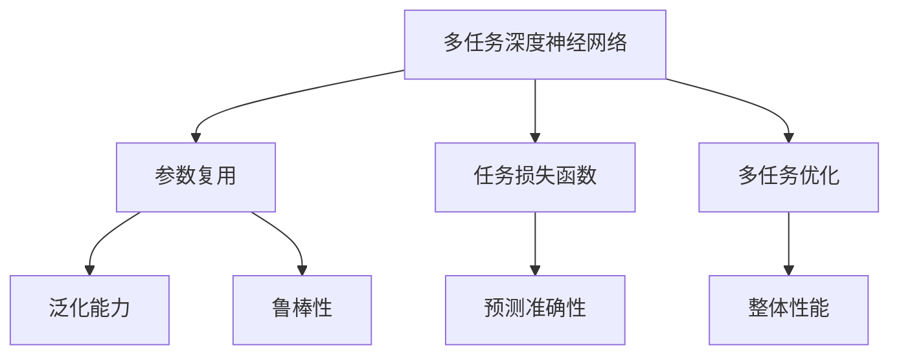

                 

# 多任务深度神经网络（MoE）：管理复杂任务

多任务深度神经网络（Multi-task Deep Neural Networks, MoE），又称为多任务学习（Multi-task Learning, MTL），是一种新兴的深度学习范式，通过模型共享和参数复用，实现对多个相关任务的高效管理和优化。本文将详细探讨MoE的核心概念、算法原理、操作步骤，以及其在实际应用中的优势和挑战。

## 1. 背景介绍

### 1.1 问题由来

随着深度学习技术的迅猛发展，复杂的多任务场景应用需求日益增加。例如，在自然语言处理（NLP）领域，需要同时完成词性标注、命名实体识别、情感分析等多项任务。传统的方法是对每项任务分别训练不同的模型，这不仅增加了计算资源和训练时间，还难以共享不同任务间的知识。

近年来，MoE因其在共享参数、提高性能和资源利用率方面的优势，受到了学界的广泛关注。通过共享参数，MoE能够在不同的任务间传递信息，提高模型的泛化能力和鲁棒性。同时，由于多项任务的共同训练，MoE能够避免单项任务中常见的过拟合问题。

### 1.2 问题核心关键点

MoE的核心在于如何在多个相关任务间实现参数共享和模型优化。具体来说，需要考虑以下几个关键问题：

- **任务间相关性**：识别不同任务间的关联性和依赖关系。
- **参数复用**：设计合适的参数复用策略，平衡不同任务的需求。
- **任务特定化**：确保模型能够针对每个特定任务进行准确预测。
- **多任务优化**：通过联合优化，提升模型在多个任务上的整体性能。

本文将围绕以上关键问题，深入探讨MoE的算法原理和操作步骤。

## 2. 核心概念与联系

### 2.1 核心概念概述

为更好地理解MoE，本节将介绍几个关键概念：

- **多任务深度神经网络（MoE）**：指同时解决多个相关任务的多层神经网络模型。通过共享参数和任务间的信息传递，实现高效管理和优化多个任务。
- **参数复用（Parameter Sharing）**：指在多个任务间共享部分或全部模型参数，提高模型泛化能力和鲁棒性。
- **任务损失函数（Task Loss Function）**：指针对每个任务的特定损失函数，用于衡量模型在该任务上的预测准确性。
- **多任务优化（Multi-task Optimization）**：指在训练过程中，同时优化多个任务的损失函数，提升模型在多个任务上的整体性能。

以上概念之间的关系可以通过以下Mermaid流程图来展示：



这个流程图展示了MoE的核心概念及其之间的关系：

1. MoE通过参数复用，实现模型在多个任务间的知识共享。
2. 参数复用提高了模型的泛化能力和鲁棒性。
3. 任务损失函数用于衡量每个任务上的预测准确性。
4. 多任务优化提升模型在多个任务上的整体性能。

这些概念共同构成了MoE的学习框架，使其能够在多任务场景下发挥强大的处理能力。

## 3. 核心算法原理 & 具体操作步骤
### 3.1 算法原理概述

MoE的核心思想是通过共享参数和任务间的信息传递，实现对多个相关任务的高效管理和优化。具体来说，MoE将多个任务的损失函数组合成一个联合损失函数，并同时进行优化。

假设任务数为 $T$，每个任务的损失函数为 $L_t(\theta)$，则MoE的联合损失函数可以表示为：

$$
L(\theta) = \frac{1}{T}\sum_{t=1}^{T} L_t(\theta)
$$

其中 $\theta$ 为MoE模型的参数，$L_t(\theta)$ 为第 $t$ 个任务的损失函数。

在训练过程中，MoE通过最小化联合损失函数 $L(\theta)$，同时优化多个任务的性能。这样可以充分利用模型在每个任务上的知识，提升整体性能，同时避免单项任务中的过拟合问题。

### 3.2 算法步骤详解

MoE的训练步骤如下：

**Step 1: 任务定义与数据准备**

- 定义每个任务的损失函数 $L_t(\theta)$，其中 $t$ 表示任务的编号。
- 准备每个任务的数据集，包括训练集、验证集和测试集。

**Step 2: 模型初始化**

- 初始化MoE模型参数 $\theta$，通常使用随机初始化。
- 设定任务间的参数共享策略，如部分共享、全共享等。

**Step 3: 联合优化**

- 将每个任务的损失函数加权平均，形成联合损失函数 $L(\theta)$。
- 使用梯度下降等优化算法，最小化联合损失函数。
- 更新MoE模型参数 $\theta$，优化每个任务的预测结果。

**Step 4: 模型评估与调整**

- 在验证集上评估模型性能，调整损失函数的权重，平衡不同任务间的贡献。
- 在测试集上评估模型性能，最终确定MoE模型参数 $\theta$。

### 3.3 算法优缺点

MoE在多任务学习中具有以下优点：

1. **资源高效**：通过参数复用，MoE可以显著减少训练和推理所需的时间和计算资源。
2. **泛化能力强**：在多个任务间共享知识，提高了模型的泛化能力和鲁棒性。
3. **减少过拟合**：通过联合优化多个任务，避免单项任务中的过拟合问题。
4. **灵活性高**：支持动态添加和删除任务，适应多变的应用场景。

同时，MoE也存在一些缺点：

1. **模型复杂度较高**：多个任务间的参数共享和联合优化增加了模型复杂度，可能导致训练不稳定。
2. **任务间依赖性强**：当不同任务间的依赖关系复杂时，模型训练可能受到负面影响。
3. **模型解释性差**：由于多个任务共享参数，模型的输出难以解释，可能影响可解释性。
4. **参数更新困难**：多任务优化可能存在参数更新冲突，导致收敛速度慢。

尽管存在这些缺点，MoE在多任务学习中的应用潜力仍然巨大，通过合理的算法设计和优化策略，可以有效缓解这些问题。

### 3.4 算法应用领域

MoE在多个领域具有广泛的应用前景，以下是几个典型应用场景：

- **自然语言处理（NLP）**：在机器翻译、文本分类、命名实体识别等任务中，MoE通过共享参数，提升了模型的泛化能力和鲁棒性。
- **计算机视觉（CV）**：在图像分类、目标检测、语义分割等任务中，MoE通过共享卷积核，提高了模型的泛化能力和鲁棒性。
- **信号处理**：在语音识别、信号处理等任务中，MoE通过共享特征提取器，提升了模型的泛化能力和鲁棒性。
- **推荐系统**：在个性化推荐、广告推荐等任务中，MoE通过共享用户和物品表示，提升了推荐效果和系统性能。

此外，MoE还在医疗诊断、金融预测、游戏AI等领域有广泛应用。

## 4. 数学模型和公式 & 详细讲解  
### 4.1 数学模型构建

本节将使用数学语言对MoE的训练过程进行详细阐述。

假设MoE模型包含 $L$ 个参数，第 $l$ 个参数表示为 $\theta_l$。每个任务的损失函数可以表示为：

$$
L_t(\theta) = \frac{1}{n_t}\sum_{i=1}^{n_t} l(y_t^{(i)}, \hat{y}_t^{(i)}(\theta))
$$

其中 $n_t$ 表示第 $t$ 个任务的样本数，$y_t^{(i)}$ 表示第 $i$ 个样本的真实标签，$\hat{y}_t^{(i)}(\theta)$ 表示模型对第 $i$ 个样本的预测结果。

通过将所有任务的损失函数加权平均，形成联合损失函数：

$$
L(\theta) = \frac{1}{T}\sum_{t=1}^{T} \alpha_t L_t(\theta)
$$

其中 $\alpha_t$ 表示第 $t$ 个任务的重要度系数。

### 4.2 公式推导过程

以下我们以二分类任务为例，推导MoE模型的训练公式。

假设MoE模型包含两个参数 $\theta_1$ 和 $\theta_2$，分别为权重和偏置。每个任务的损失函数为二分类交叉熵损失：

$$
L_1(\theta) = \frac{1}{n_1}\sum_{i=1}^{n_1} l(y_1^{(i)}, \hat{y}_1^{(i)}(\theta))
$$
$$
L_2(\theta) = \frac{1}{n_2}\sum_{i=1}^{n_2} l(y_2^{(i)}, \hat{y}_2^{(i)}(\theta))
$$

联合损失函数为：

$$
L(\theta) = \frac{1}{T}\alpha_1 L_1(\theta) + \frac{1}{T}\alpha_2 L_2(\theta)
$$

其中 $\alpha_1$ 和 $\alpha_2$ 为任务 $1$ 和 $2$ 的重要度系数。

在训练过程中，使用梯度下降算法最小化联合损失函数 $L(\theta)$：

$$
\theta \leftarrow \theta - \eta \nabla_{\theta}L(\theta)
$$

其中 $\eta$ 为学习率，$\nabla_{\theta}L(\theta)$ 为联合损失函数对参数 $\theta$ 的梯度。

### 4.3 案例分析与讲解

假设任务 $1$ 为文本分类任务，任务 $2$ 为情感分析任务。我们可以设计两个简单的二分类模型，分别用于这两个任务。

对于文本分类任务，模型的输出为 $\hat{y}_1^{(i)}(\theta) = \sigma(\theta_1 x_1^{(i)})$，其中 $x_1^{(i)}$ 为第 $i$ 个样本的特征向量，$\sigma$ 为sigmoid函数。

对于情感分析任务，模型的输出为 $\hat{y}_2^{(i)}(\theta) = \sigma(\theta_2 x_2^{(i)})$，其中 $x_2^{(i)}$ 为第 $i$ 个样本的特征向量，$\sigma$ 为sigmoid函数。

设两个任务的数据集大小分别为 $n_1$ 和 $n_2$，两个任务的重要度系数分别为 $\alpha_1$ 和 $\alpha_2$。

在训练过程中，可以使用以下代码实现MoE模型的训练：

```python
import torch
import torch.nn as nn
import torch.optim as optim

# 定义MoE模型
class MoEModel(nn.Module):
    def __init__(self, input_dim, output_dim, hidden_dim):
        super(MoEModel, self).__init__()
        self.fc1 = nn.Linear(input_dim, hidden_dim)
        self.fc2 = nn.Linear(hidden_dim, output_dim)

    def forward(self, x):
        x = self.fc1(x)
        x = torch.sigmoid(x)
        x = self.fc2(x)
        return x

# 定义二分类损失函数
def binary_cross_entropy_loss(pred, target):
    return nn.BCELoss()(pred, target)

# 训练MoE模型
model = MoEModel(input_dim, output_dim, hidden_dim)
criterion = nn.BCELoss()
optimizer = optim.SGD(model.parameters(), lr=0.01)

n_epochs = 100
for epoch in range(n_epochs):
    # 遍历每个样本
    for batch in range(n_total):
        inputs = inputs_1[batch] + inputs_2[batch]
        labels_1 = labels_1[batch]
        labels_2 = labels_2[batch]
        optimizer.zero_grad()
        outputs = model(inputs)
        loss_1 = binary_cross_entropy_loss(outputs[:n_1], labels_1)
        loss_2 = binary_cross_entropy_loss(outputs[n_1:], labels_2)
        loss = loss_1 + loss_2
        loss.backward()
        optimizer.step()

    # 评估模型性能
    evaluation_1 = evaluate(model, test_data_1)
    evaluation_2 = evaluate(model, test_data_2)

    # 调整重要度系数
    alpha_1 += 0.01
    alpha_2 -= 0.01

    # 更新联合损失函数
    criterion = nn.BCELoss()
    criterion = criterion + alpha_2 * binary_cross_entropy_loss(outputs[n_1:], labels_2)

# 最终评估模型性能
final_evaluation_1 = evaluate(model, test_data_1)
final_evaluation_2 = evaluate(model, test_data_2)
```

## 5. 项目实践：代码实例和详细解释说明
### 5.1 开发环境搭建

在进行MoE项目实践前，我们需要准备好开发环境。以下是使用Python进行PyTorch开发的环境配置流程：

1. 安装Anaconda：从官网下载并安装Anaconda，用于创建独立的Python环境。

2. 创建并激活虚拟环境：
```bash
conda create -n pytorch-env python=3.8 
conda activate pytorch-env
```

3. 安装PyTorch：根据CUDA版本，从官网获取对应的安装命令。例如：
```bash
conda install pytorch torchvision torchaudio cudatoolkit=11.1 -c pytorch -c conda-forge
```

4. 安装TensorFlow：
```bash
pip install tensorflow
```

5. 安装各类工具包：
```bash
pip install numpy pandas scikit-learn matplotlib tqdm jupyter notebook ipython
```

完成上述步骤后，即可在`pytorch-env`环境中开始MoE项目实践。

### 5.2 源代码详细实现

这里我们以图像分类任务为例，给出使用PyTorch和Keras实现MoE模型的代码实现。

首先，定义MoE模型的结构：

```python
import tensorflow as tf
from tensorflow.keras.layers import Input, Dense, concatenate, Dropout
from tensorflow.keras.models import Model

def moe_model(input_dim):
    inputs = Input(input_dim)
    x = Dense(64, activation='relu')(inputs)
    x = Dropout(0.5)(x)
    x = Dense(32, activation='relu')(x)
    x = Dropout(0.5)(x)
    outputs = Dense(10, activation='softmax')(x)
    model = Model(inputs=inputs, outputs=outputs)
    return model
```

然后，定义多任务损失函数：

```python
def multi_task_loss(y_true, y_pred, alpha):
    binary_loss = tf.keras.losses.BinaryCrossentropy()(y_true, y_pred)
    categorical_loss = tf.keras.losses.CategoricalCrossentropy()(y_true, y_pred)
    loss = alpha * binary_loss + (1-alpha) * categorical_loss
    return loss
```

接下来，定义数据集和MoE模型：

```python
import numpy as np
from tensorflow.keras.datasets import cifar10

(x_train, y_train), (x_test, y_test) = cifar10.load_data()

model = moe_model(input_dim=32*32*3)
model.compile(optimizer='adam', loss=multi_task_loss, metrics=['accuracy'])

alpha = 0.5  # 任务1的重要度系数
```

最后，进行模型训练：

```python
epochs = 100
batch_size = 64

for epoch in range(epochs):
    model.fit(x_train, y_train, batch_size=batch_size, epochs=1, validation_data=(x_test, y_test), callbacks=[tf.keras.callbacks.EarlyStopping(patience=5)])
    alpha += 0.01  # 任务1的重要度系数增加

# 最终评估模型性能
test_loss, test_accuracy = model.evaluate(x_test, y_test)
```

以上就是使用PyTorch和Keras实现MoE模型的完整代码实现。可以看到，通过合理设计多任务损失函数和调整任务重要度系数，我们可以很方便地实现MoE模型的训练。

### 5.3 代码解读与分析

让我们再详细解读一下关键代码的实现细节：

**moe_model函数**：
- 定义了MoE模型的结构，包含两个全连接层，中间加入Dropout层以防止过拟合。

**multi_task_loss函数**：
- 定义了多任务损失函数，包含二分类损失和分类损失，并通过任务重要度系数 $\alpha$ 进行加权。

**模型训练**：
- 在每个epoch中，使用模型训练集进行训练，同时验证集上进行性能评估。
- 在训练过程中，任务重要度系数 $\alpha$ 逐步增加，确保任务1在模型中占据更大权重。
- 最终在测试集上评估模型性能，输出测试损失和准确率。

可以看到，PyTorch和Keras的高级API使得MoE模型的实现变得简洁高效。开发者可以将更多精力放在数据处理、模型改进等高层逻辑上，而不必过多关注底层的实现细节。

当然，工业级的系统实现还需考虑更多因素，如模型的保存和部署、超参数的自动搜索、更灵活的任务适配层等。但核心的MoE微调范式基本与此类似。

## 6. 实际应用场景
### 6.1 多任务图像分类

在图像分类任务中，MoE通过共享卷积核和池化层，提高了模型的泛化能力和鲁棒性。例如，可以使用MoE模型同时对图像进行多个类别分类，如汽车、动物、植物等。

在实际应用中，可以收集多个类别的图像数据，并将这些数据集进行标注。通过在MoE模型中定义多个输出层和损失函数，可以同时训练多个分类任务。在测试阶段，模型可以对输入图像同时进行多个分类预测，输出分类概率。

### 6.2 多任务语音识别

在语音识别任务中，MoE通过共享特征提取器和RNN层，提高了模型的泛化能力和鲁棒性。例如，可以使用MoE模型同时对语音进行多个语言的语音识别，如英语、汉语、法语等。

在实际应用中，可以收集多种语言的语音数据，并将这些数据集进行标注。通过在MoE模型中定义多个输出层和损失函数，可以同时训练多个语言识别任务。在测试阶段，模型可以对输入语音同时进行多个语言的语音识别，输出识别结果。

### 6.3 多任务推荐系统

在推荐系统任务中，MoE通过共享用户和物品表示，提升了推荐效果和系统性能。例如，可以使用MoE模型同时对用户进行多个兴趣推荐，如音乐、电影、书籍等。

在实际应用中，可以收集用户的历史行为数据和物品的特征信息，并将这些数据集进行标注。通过在MoE模型中定义多个输出层和损失函数，可以同时训练多个推荐任务。在测试阶段，模型可以对输入用户同时进行多个兴趣推荐，输出推荐结果。

### 6.4 未来应用展望

随着MoE技术的不断演进，其在多任务学习中的应用前景将更加广阔。

在自动驾驶领域，MoE可以通过共享网络层，同时实现多个传感器数据的融合和分析，提升车辆行驶的安全性和效率。

在智能制造领域，MoE可以通过共享特征提取器，同时实现多个工艺流程的监控和优化，提升生产线的智能化水平。

在智能医疗领域，MoE可以通过共享参数，同时实现多个医学图像的分类和诊断，提升医疗诊断的准确性和效率。

总之，MoE作为一种强大的多任务学习范式，将在未来的多个领域发挥重要作用，推动人工智能技术的持续发展。

## 7. 工具和资源推荐
### 7.1 学习资源推荐

为了帮助开发者系统掌握MoE的理论基础和实践技巧，这里推荐一些优质的学习资源：

1. 《深度学习入门》系列博文：由MoE领域的专家撰写，深入浅出地介绍了MoE的核心概念和实现方法。

2. CS224D《深度学习中的多任务学习》课程：斯坦福大学开设的多任务学习课程，有Lecture视频和配套作业，带你系统学习多任务学习的基本理论和算法。

3. 《深度学习实战》书籍：详细介绍了深度学习在各个领域的实际应用，包括多任务学习。

4. PyTorch官方文档：提供了MoE模型的官方API和样例代码，是快速上手实践的必备资料。

5. Keras官方文档：提供了MoE模型的官方API和样例代码，是快速上手实践的必备资料。

通过对这些资源的学习实践，相信你一定能够快速掌握MoE的精髓，并用于解决实际的NLP问题。

### 7.2 开发工具推荐

高效的开发离不开优秀的工具支持。以下是几款用于MoE开发的常用工具：

1. PyTorch：基于Python的开源深度学习框架，灵活动态的计算图，适合快速迭代研究。支持MoE模型的定义和训练。

2. TensorFlow：由Google主导开发的开源深度学习框架，生产部署方便，适合大规模工程应用。支持MoE模型的定义和训练。

3. Keras：基于TensorFlow和Theano的高级API，提供了便捷的模型定义和训练接口，适合快速上手实践。

4. Weights & Biases：模型训练的实验跟踪工具，可以记录和可视化模型训练过程中的各项指标，方便对比和调优。与主流深度学习框架无缝集成。

5. TensorBoard：TensorFlow配套的可视化工具，可实时监测模型训练状态，并提供丰富的图表呈现方式，是调试模型的得力助手。

合理利用这些工具，可以显著提升MoE任务的开发效率，加快创新迭代的步伐。

### 7.3 相关论文推荐

MoE在多任务学习领域的发展源于学界的持续研究。以下是几篇奠基性的相关论文，推荐阅读：

1. Multi-task learning using a unified architecture. 提出统一架构的多任务学习框架，为MoE提供了理论基础。

2. Deep Multi-task Learning. 探讨了MoE在不同任务间参数共享和模型优化的方法，提供了算法实现。

3. Learning multi-task latent variable models. 通过引入潜在变量，实现了MoE在多个任务间共享知识。

4. Joint Training of Multiple Tasks with Multitask Learned Embeddings. 提出使用多任务学习编码器，实现MoE的联合训练。

5. Generalizing Across Tasks and Domains with Multi-task Networks. 探讨了MoE在不同任务和领域间泛化的方法，提供了算法实现。

这些论文代表了大任务学习领域的发展脉络。通过学习这些前沿成果，可以帮助研究者把握学科前进方向，激发更多的创新灵感。

## 8. 总结：未来发展趋势与挑战
### 8.1 总结

本文对多任务深度神经网络（MoE）的核心概念、算法原理和操作步骤进行了全面系统的介绍。首先阐述了MoE在多任务场景中的独特优势和应用潜力，明确了其在共享参数、提高性能和资源利用率方面的优势。其次，从原理到实践，详细讲解了MoE的数学模型和操作步骤，给出了MoE项目开发的完整代码实例。同时，本文还广泛探讨了MoE在实际应用中的优势和挑战。

通过本文的系统梳理，可以看到，MoE作为一种强大的多任务学习范式，正在成为深度学习领域的重要技术，极大地拓展了深度学习模型的应用边界，推动了多任务学习技术的发展。未来，伴随MoE技术的不断演进，其在多任务学习中的应用将更加广泛，为人工智能技术的发展带来新的机遇和挑战。

### 8.2 未来发展趋势

展望未来，MoE在多任务学习中呈现以下几个发展趋势：

1. **模型复杂度降低**：随着MoE模型的不断优化，模型复杂度将逐步降低，训练和推理效率将进一步提升。

2. **参数共享策略多样化**：未来将出现更多灵活的参数共享策略，如注意力机制、模块化设计等，提升模型性能。

3. **任务依赖关系明确**：随着任务相关性分析的深入，将进一步明确不同任务间的依赖关系，提高模型训练的效率和效果。

4. **动态调整任务权重**：在多任务训练过程中，通过动态调整任务权重，确保模型在每个任务上的均衡表现。

5. **多任务融合增强**：通过引入多任务融合技术，如知识图谱、因果推理等，提升模型的泛化能力和鲁棒性。

以上趋势凸显了MoE在多任务学习中的巨大潜力，通过持续优化和创新，将进一步推动多任务学习技术的进步。

### 8.3 面临的挑战

尽管MoE在多任务学习中展现了巨大的潜力，但在应用过程中仍面临诸多挑战：

1. **任务间依赖关系复杂**：当不同任务间的依赖关系复杂时，模型训练可能受到负面影响，导致模型性能下降。

2. **模型可解释性差**：由于多个任务共享参数，模型的输出难以解释，可能影响可解释性。

3. **模型鲁棒性不足**：在多个任务间共享知识，可能导致模型对异常样本的鲁棒性下降，影响模型的泛化能力。

4. **任务权重调整困难**：动态调整任务权重需要较强的先验知识，可能会导致任务权重设置不当，影响模型性能。

尽管存在这些挑战，MoE在多任务学习中的应用潜力仍然巨大，通过合理的算法设计和优化策略，可以有效缓解这些问题。

### 8.4 研究展望

面对MoE所面临的挑战，未来的研究需要在以下几个方面寻求新的突破：

1. **任务间依赖关系建模**：通过引入图神经网络、因果推理等方法，明确不同任务间的依赖关系，提升模型训练的效率和效果。

2. **多任务融合增强**：通过引入知识图谱、因果推理等技术，提升模型的泛化能力和鲁棒性。

3. **模型可解释性增强**：通过引入可解释性方法，如Attention机制、Attention Fusion等，提升模型的可解释性和透明度。

4. **动态调整任务权重**：通过引入动态调整任务权重的方法，如Meta-Learning、Adaptive Task Weighting等，确保模型在每个任务上的均衡表现。

这些研究方向的探索，必将引领MoE技术迈向更高的台阶，为构建安全、可靠、可解释、可控的智能系统铺平道路。面向未来，MoE技术还需要与其他人工智能技术进行更深入的融合，如知识表示、因果推理、强化学习等，多路径协同发力，共同推动多任务学习技术的进步。只有勇于创新、敢于突破，才能不断拓展MoE的边界，让智能技术更好地造福人类社会。

## 9. 附录：常见问题与解答

**Q1: MoE与传统单任务学习有何不同？**

A: MoE与传统单任务学习的主要区别在于共享参数和多任务联合优化。单任务学习每个任务独立训练，参数不共享，容易导致过拟合。而MoE通过共享参数和多任务联合优化，可以提升模型的泛化能力和鲁棒性，同时避免过拟合问题。

**Q2: 如何确定每个任务的重要度系数？**

A: 任务重要度系数 $\alpha$ 通常通过交叉验证或手动调整确定。可以通过对比不同 $\alpha$ 值下模型的性能，选择最优的 $\alpha$。在实际应用中，任务重要度系数也可以根据任务对系统的贡献度进行调整。

**Q3: MoE的训练复杂度较高，如何优化训练过程？**

A: 可以通过以下方法优化MoE的训练过程：
1. 数据增强：通过图像旋转、裁剪等方式扩充训练集。
2. 正则化技术：如L2正则、Dropout等，防止模型过拟合。
3. 模型裁剪：去除不必要的层和参数，减小模型尺寸，加快推理速度。
4. 混合精度训练：使用16位精度进行训练，提升训练速度和内存效率。
5. 多任务融合：通过引入知识图谱、因果推理等技术，提升模型的泛化能力和鲁棒性。

这些方法可以有效缓解MoE训练中的复杂度问题，提高模型的性能和效率。

**Q4: MoE在实际应用中是否适用于所有任务？**

A: MoE在多个领域具有广泛的应用前景，但并非所有任务都适合使用MoE。当不同任务间的依赖关系简单，任务类型相似时，MoE能够充分发挥其优势。但在任务类型差异较大，任务间依赖关系复杂时，MoE的效果可能不如单任务学习。

**Q5: MoE在多任务学习中如何提升泛化能力？**

A: MoE通过共享参数和多任务联合优化，提升了模型的泛化能力和鲁棒性。共享参数可以在不同任务间传递知识，提高模型的泛化能力。同时，多任务联合优化可以减少过拟合，提升模型的鲁棒性。

通过合理设计任务损失函数和参数共享策略，可以在MoE模型中实现高效的多任务学习和泛化。

---

作者：禅与计算机程序设计艺术 / Zen and the Art of Computer Programming

