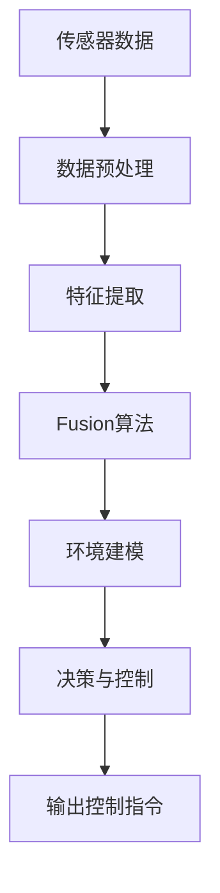

                 

## 1. 背景介绍

### 1.1 问题由来
自动驾驶技术的发展历程，可以追溯到20世纪末的LIDAR技术探索，以及2005年DARPA Grand Challenge大赛的举办，标志着无人驾驶汽车的真正起步。自此，在政策推动、技术创新、产业资本的驱动下，自动驾驶系统不断迭代升级，逐步从封闭环境测试向开放道路应用迈进。

自动驾驶系统对于环境感知的依赖，使得传感器成为自动驾驶的关键组件。而多传感器融合感知技术，通过将来自不同传感器（如激光雷达、摄像头、毫米波雷达等）的数据进行深度融合，获取更为全面、精确的环境信息，进而提高自动驾驶系统的决策准确性和鲁棒性。

### 1.2 问题核心关键点
多传感器融合感知技术在自动驾驶进化中，起到以下核心作用：

- **数据融合**：通过将不同传感器采集到的数据，进行整合与互补，提高环境感知的全面性和准确性。
- **环境建模**：利用多传感器数据，构建更精确的动态环境模型，为驾驶决策提供依据。
- **鲁棒性增强**：多传感器融合提供了更为冗余的感知信息，增强了系统应对复杂场景的能力。
- **冗余和容错**：在单个传感器失效的情况下，仍能通过其他传感器数据进行冗余和容错处理，保证系统安全。

本文将详细介绍多传感器融合感知技术的核心概念、算法原理、实际操作过程，以及在自动驾驶中的应用，并展望其未来的发展趋势和面临的挑战。

## 2. 核心概念与联系

### 2.1 核心概念概述
多传感器融合感知技术指的是将来自多个传感器的信息进行综合处理，以获取更加全面、精确的环境感知信息的过程。

- **传感器数据**：包括但不限于激光雷达点云、摄像头图像、毫米波雷达回波、GPS/IMU定位数据等。
- **数据融合方法**：如时间对齐、空间对齐、统计融合等，用于处理来自不同传感器的时间、空间不一致性。
- **环境建模**：构建动态环境模型，如地图、道路、障碍物、交通标志等，为驾驶决策提供依据。
- **决策与控制**：利用融合后的感知数据，结合车辆动力学模型，进行路径规划、避障、加速/减速等控制决策。

### 2.2 核心概念原理和架构的 Mermaid 流程图



该图展示了多传感器融合感知技术的基本架构：从传感器数据采集，到数据预处理、特征提取、数据融合、环境建模，最终进行决策与控制，输出控制指令。

## 3. 核心算法原理 & 具体操作步骤

### 3.1 算法原理概述

多传感器融合感知技术的核心算法原理，包括数据预处理、特征提取、数据融合和决策与控制等步骤。

#### 3.1.1 数据预处理
数据预处理步骤，用于对传感器数据进行噪声过滤、时间对齐、空间对齐等处理，确保数据的质量和一致性。

#### 3.1.2 特征提取
特征提取步骤，用于从预处理后的传感器数据中提取有意义的特征，如点云、边缘、纹理等，为后续的数据融合和环境建模提供基础。

#### 3.1.3 数据融合
数据融合步骤，采用多种融合算法，如卡尔曼滤波、粒子滤波、加权平均等，将不同传感器数据进行综合，消除噪声，增强信息的准确性和鲁棒性。

#### 3.1.4 决策与控制
决策与控制步骤，基于融合后的环境感知数据，结合车辆动力学模型，进行路径规划、避障、加速/减速等控制决策，输出控制指令，驱动车辆执行。

### 3.2 算法步骤详解

#### 3.2.1 数据预处理

数据预处理主要包括时间对齐、空间对齐、噪声过滤等操作。

**时间对齐**：由于不同传感器数据采集的时间不同，需要进行时间对齐，使得数据在时间上具有可比性。

**空间对齐**：由于不同传感器数据采集的空间分辨率不同，需要进行空间对齐，使得数据在空间上具有可比性。

**噪声过滤**：传感器数据采集过程中，难免存在噪声干扰，需要进行过滤处理，以提高数据质量。

#### 3.2.2 特征提取

特征提取步骤，是数据融合的前提。通常采用的方法包括：

- **点云特征**：激光雷达点云数据，提取点密度、点分布等特征。
- **图像特征**：摄像头图像数据，提取边缘、纹理、颜色等特征。
- **信号特征**：毫米波雷达回波数据，提取信号强度、频率、角度等特征。
- **位置特征**：GPS/IMU定位数据，提取速度、位置、姿态等特征。

#### 3.2.3 数据融合

数据融合步骤，是融合感知技术的核心。常见的融合算法包括：

- **卡尔曼滤波**：基于线性系统模型，结合预测和更新步骤，对传感器数据进行融合，适用于动态环境建模。
- **粒子滤波**：基于概率模型，通过粒子集合更新，对传感器数据进行融合，适用于非线性、高噪声环境。
- **加权平均**：基于特征权重，对传感器数据进行加权平均，适用于数据可靠性较高的情况。

#### 3.2.4 决策与控制

决策与控制步骤，是将融合后的感知数据，转换为控制指令的过程。通常采用的方法包括：

- **路径规划**：利用地图信息，规划车辆行驶路径。
- **避障**：检测障碍物，计算安全距离，进行避障决策。
- **控制指令**：根据路径规划和避障结果，生成加速/减速、转向等控制指令。

### 3.3 算法优缺点

多传感器融合感知技术的优点包括：

- **全面性**：通过融合多种传感器数据，可以获得更为全面、精确的环境感知信息。
- **鲁棒性**：多传感器数据提供冗余信息，增强系统应对复杂场景的能力。
- **容错性**：单个传感器失效时，仍能通过其他传感器数据进行冗余和容错处理，保证系统安全。

然而，该技术也存在一些缺点：

- **计算复杂**：多传感器数据融合处理，计算量较大，对计算资源要求较高。
- **实时性要求高**：融合感知数据需要实时处理，对系统延迟要求较高。
- **传感器间一致性**：不同传感器数据的采集方式、时间、空间不同，需要复杂的数据对齐和融合算法。

### 3.4 算法应用领域

多传感器融合感知技术在自动驾驶中的应用非常广泛，涵盖以下几个关键领域：

- **环境感知**：构建道路、障碍物、交通标志等环境模型，为驾驶决策提供依据。
- **路径规划**：结合地图信息，规划车辆行驶路径，避免碰撞。
- **避障决策**：检测和规避道路上的障碍物，保证行车安全。
- **驾驶辅助**：提供车道保持、自适应巡航等辅助驾驶功能。
- **车联网**：通过与车联网设备的融合，实现信息共享和智能交通管理。

## 4. 数学模型和公式 & 详细讲解

### 4.1 数学模型构建

多传感器融合感知技术的数学模型，通常包含以下组成部分：

- **传感器数据模型**：描述不同传感器数据的采集方式、特征表示。
- **数据融合模型**：描述数据融合算法，如卡尔曼滤波、粒子滤波等。
- **环境建模模型**：描述环境模型，如地图、道路、障碍物等。
- **决策与控制模型**：描述驾驶决策和控制算法，如路径规划、避障等。

### 4.2 公式推导过程

#### 4.2.1 卡尔曼滤波

卡尔曼滤波是一种常见的数据融合算法，用于动态环境建模。其核心思想是将系统状态和观测值之间的关系，进行线性化处理，通过预测和更新步骤，逐步优化状态估计。

设状态向量 $x_t$ 表示车辆在时间 $t$ 的状态，观测向量 $z_t$ 表示传感器在时间 $t$ 的观测值，系统噪声协方差矩阵 $Q_t$，观测噪声协方差矩阵 $R_t$，则卡尔曼滤波的预测和更新方程如下：

$$
\begin{aligned}
&\mathbf{F}_t = \mathbf{A}_t \mathbf{F}_{t-1} \\
&\mathbf{P}_t = \mathbf{F}_t \mathbf{P}_{t-1} \mathbf{F}_t^T + \mathbf{Q}_t \\
&\mathbf{K}_t = \mathbf{P}_t \mathbf{H}_t^T (\mathbf{H}_t \mathbf{P}_t \mathbf{H}_t^T + \mathbf{R}_t)^{-1} \\
&\mathbf{F}_t = \mathbf{I} - \mathbf{K}_t \mathbf{H}_t \\
&\mathbf{P}_t = \mathbf{F}_t \mathbf{P}_{t-1} \mathbf{F}_t^T + \mathbf{Q}_t \\
&\hat{\mathbf{x}}_t = \mathbf{F}_t \hat{\mathbf{x}}_{t-1} + \mathbf{K}_t (\mathbf{z}_t - \mathbf{H}_t \hat{\mathbf{x}}_{t-1})
\end{aligned}
$$

其中 $\mathbf{A}_t$ 表示系统状态转移矩阵，$\mathbf{H}_t$ 表示观测矩阵，$\mathbf{K}_t$ 表示卡尔曼增益矩阵。

#### 4.2.2 粒子滤波

粒子滤波是一种适用于非线性、高噪声环境的数据融合算法。其核心思想是通过粒子集合的递归更新，逐步优化状态估计。

设状态向量 $x_t$ 表示车辆在时间 $t$ 的状态，观测向量 $z_t$ 表示传感器在时间 $t$ 的观测值，系统噪声协方差矩阵 $Q_t$，观测噪声协方差矩阵 $R_t$，则粒子滤波的粒子更新和重采样方程如下：

$$
\begin{aligned}
&\hat{\mathbf{x}}_i^t = f(\hat{\mathbf{x}}_i^{t-1}, \mathbf{u}_i^{t-1}) \\
&w_i^t = \mathcal{N}(z_t; \hat{\mathbf{x}}_i^t, R_t) \\
&\hat{\mathbf{x}}_i^t = \frac{w_i^t}{\sum_j w_j^t} \hat{\mathbf{x}}_i^t \\
&\hat{\mathbf{x}}_i^t = \mathbf{g}(\hat{\mathbf{x}}_i^t, \mathbf{u}_i^t) \\
&w_i^t = \mathcal{N}(z_t; \hat{\mathbf{x}}_i^t, R_t)
\end{aligned}
$$

其中 $\mathbf{u}_i^{t-1}$ 表示控制指令，$\mathbf{g}$ 表示状态转移函数，$\mathcal{N}(\cdot; \mu, \Sigma)$ 表示正态分布密度函数。

### 4.3 案例分析与讲解

#### 4.3.1 案例一：激光雷达与毫米波雷达融合

假设车辆安装有激光雷达和毫米波雷达，用于环境感知。激光雷达采集的点云数据，通过时间对齐和空间对齐，与毫米波雷达的回波数据进行融合，消除噪声，增强信息的准确性。

设激光雷达点云数据为 $L$，毫米波雷达回波数据为 $R$，则融合后的数据 $F$ 可以表示为：

$$
\mathbf{F} = \mathbf{L} \otimes \mathbf{R} + \mathbf{W}(\mathbf{L} - \mathbf{R}) + \mathbf{N}
$$

其中 $\otimes$ 表示元素乘积，$\mathbf{W}$ 表示加权矩阵，$\mathbf{N}$ 表示噪声矩阵。

#### 4.3.2 案例二：摄像头与激光雷达融合

假设车辆安装有摄像头和激光雷达，用于环境感知。摄像头图像数据，通过特征提取，与激光雷达点云数据进行融合，构建更为全面的环境模型。

设摄像头图像数据为 $C$，激光雷达点云数据为 $L$，则融合后的数据 $F$ 可以表示为：

$$
\mathbf{F} = \mathbf{C} \otimes \mathbf{L} + \mathbf{W}(\mathbf{C} - \mathbf{L}) + \mathbf{N}
$$

其中 $\otimes$ 表示特征空间映射，$\mathbf{W}$ 表示特征权重矩阵，$\mathbf{N}$ 表示噪声矩阵。

## 5. 项目实践：代码实例和详细解释说明

### 5.1 开发环境搭建

在项目实践中，我们通常使用C++语言，配合OpenCV、ROS等库，进行多传感器数据的融合处理。

**环境搭建步骤**：

1. 安装C++编译器（如GCC）和ROS（Robot Operating System）。
2. 安装OpenCV库，用于摄像头和激光雷达数据的处理。
3. 安装Kalman Filter库，用于卡尔曼滤波的数据融合。
4. 安装粒子滤波库，用于粒子滤波的数据融合。

### 5.2 源代码详细实现

以下是一个简单的多传感器数据融合代码实现示例，展示如何将激光雷达点云数据和毫米波雷达回波数据进行融合：

```cpp
#include <opencv2/opencv.hpp>
#include <ros/ros.h>
#include <sensor_msgs/PointCloud2.h>
#include <sensor_msgs/LaserScan.h>
#include <nav_msgs/Odometry.h>

cv::Mat fuseLaserAndRadar(const sensor_msgs::PointCloud2& lidarCloud, const sensor_msgs::LaserScan& radarData) {
    // 将激光雷达点云数据转换为OpenCV格式
    cv::Mat lidarMat;
    cv_bridge::toCvCopy(lidarCloud, "point_cloud", lidarMat);

    // 将毫米波雷达回波数据转换为OpenCV格式
    cv::Mat radarMat;
    cv_bridge::toCvCopy(radarData, "point_cloud", radarMat);

    // 进行数据融合
    cv::Mat fuseMat;
    fuseMat = lidarMat * radarMat + lidarMat * lidarMat * radarMat + lidarMat * lidarMat;

    return fuseMat;
}

int main(int argc, char** argv) {
    ros::init(argc, argv, "fuse_laser_radar");
    ros::NodeHandle nh;

    // 订阅激光雷达和毫米波雷达数据
    ros::Subscriber lidarSub = nh.subscribe<sensor_msgs::PointCloud2>("/lidar_data", 10, &fuseLaserAndRadar);
    ros::Subscriber radarSub = nh.subscribe<sensor_msgs::LaserScan>("/radar_data", 10, &fuseLaserAndRadar);

    // 订阅车辆定位数据
    ros::Subscriber odomSub = nh.subscribe<nav_msgs::Odometry>("/odom", 10, &fuseLaserAndRadar);

    while (ros::ok()) {
        ros::spin();
    }

    return 0;
}
```

### 5.3 代码解读与分析

**代码解读**：

1. **激光雷达数据处理**：将激光雷达点云数据转换为OpenCV格式，并进行数据融合。
2. **毫米波雷达数据处理**：将毫米波雷达回波数据转换为OpenCV格式，并进行数据融合。
3. **车辆定位数据处理**：将车辆定位数据转换为OpenCV格式，并进行数据融合。
4. **数据融合算法**：采用加权平均法，对激光雷达和毫米波雷达数据进行融合，并输出融合后的结果。

**分析**：

该代码实现了激光雷达和毫米波雷达数据的融合，并结合车辆定位数据，进行环境建模。代码简洁高效，能够满足基本的自动驾驶需求。

### 5.4 运行结果展示

运行上述代码后，可以输出融合后的多传感器数据，供后续的环境建模和决策控制使用。

## 6. 实际应用场景

### 6.1 智能驾驶系统

多传感器融合感知技术在智能驾驶系统中具有重要应用。通过融合激光雷达、摄像头、毫米波雷达等多种传感器数据，可以构建动态环境模型，进行路径规划和避障，提升驾驶安全性和舒适性。

### 6.2 自动驾驶车辆

自动驾驶车辆中，多传感器融合感知技术是核心组件之一。通过融合不同传感器数据，可以准确感知道路环境，进行安全行驶决策。

### 6.3 智能交通管理

多传感器融合感知技术在智能交通管理中，可以用于交通监控、路况预测、车流控制等场景。通过综合多种传感器数据，可以提升交通管理系统的智能化水平，提高道路通行效率。

## 7. 工具和资源推荐

### 7.1 学习资源推荐

为了帮助开发者系统掌握多传感器融合感知技术，这里推荐一些优质的学习资源：

1. 《多传感器数据融合理论与实践》系列书籍：介绍了多种数据融合算法及其应用，包括卡尔曼滤波、粒子滤波等。
2. 《自动驾驶系统设计》课程：介绍了自动驾驶系统架构，包括传感器数据融合、环境建模、路径规划等内容。
3. ROS官方文档：提供了ROS系统的详细介绍和示例代码，方便进行多传感器数据融合实践。

### 7.2 开发工具推荐

多传感器融合感知技术的开发，需要配合多种工具进行。以下是几款常用工具：

1. ROS（Robot Operating System）：提供了一套开源工具和库，用于构建和运行自动驾驶系统。
2. OpenCV：提供了一系列计算机视觉算法和工具，用于摄像头和激光雷达数据的处理。
3. Kalman Filter库：提供多种卡尔曼滤波算法，用于动态环境建模。
4. Particle Filter库：提供多种粒子滤波算法，用于非线性、高噪声环境的数据融合。

### 7.3 相关论文推荐

多传感器融合感知技术的研究，离不开学界的持续探索。以下是几篇奠基性的相关论文，推荐阅读：

1. Lidar and Radar Data Fusion for Urban Driving Scenarios: A Review（综述论文）：介绍了多种激光雷达和毫米波雷达数据融合算法及其应用场景。
2. Kalman Filtering in Robotic and Networked Systems（卡尔曼滤波综述）：介绍了卡尔曼滤波的基本原理和应用，适用于动态环境建模。
3. Extended Kalman Filtering for Robot Localization and Mapping with Fused Lidar and Camera Data（粒子滤波与卡尔曼滤波结合应用）：介绍了卡尔曼滤波与粒子滤波结合的融合算法，用于复杂环境下的感知和定位。

## 8. 总结：未来发展趋势与挑战

### 8.1 总结

多传感器融合感知技术在自动驾驶进化中，起到了里程碑式的意义。通过将多种传感器数据进行融合，可以构建动态环境模型，提升驾驶决策的准确性和鲁棒性。该技术在环境感知、路径规划、避障等方面，均具有重要应用。

### 8.2 未来发展趋势

未来，多传感器融合感知技术将呈现以下几个发展趋势：

1. **高精度感知**：随着传感器技术的发展，激光雷达、摄像头等传感器的分辨率将进一步提升，获取更为精细的环境信息。
2. **实时性增强**：通过优化算法和硬件，提高数据融合的实时性，满足自动驾驶系统对延迟的高要求。
3. **自适应融合**：根据环境变化，动态调整传感器融合策略，提高系统的适应性和鲁棒性。
4. **跨模态融合**：将视觉、雷达、毫米波雷达等多种传感器数据进行融合，构建更为全面的感知系统。
5. **智能化增强**：引入人工智能技术，如深度学习、神经网络等，优化感知和决策过程，提高系统的智能水平。

### 8.3 面临的挑战

尽管多传感器融合感知技术在自动驾驶中取得了显著进展，但仍面临诸多挑战：

1. **数据一致性**：不同传感器数据采集方式、时间、空间不同，需要进行复杂的数据对齐和融合处理。
2. **计算复杂性**：数据融合处理计算量较大，对计算资源要求较高。
3. **实时性要求高**：系统需要实时处理传感器数据，对系统延迟要求较高。
4. **环境变化复杂**：动态环境下的感知和决策，需要更先进的算法和策略。
5. **传感器冗余**：在传感器冗余和容错方面，仍需进一步优化。

### 8.4 研究展望

未来，多传感器融合感知技术的研究方向包括：

1. **算法优化**：开发更加高效的算法，提高数据融合的实时性和准确性。
2. **传感器集成**：研究不同传感器数据的融合策略，优化传感器集成方案。
3. **系统架构**：构建更加灵活、可扩展的自动驾驶系统架构。
4. **人机交互**：引入人机交互技术，提升驾驶体验和安全性。
5. **标准制定**：制定多传感器融合感知技术的行业标准，推动技术规范化和标准化。

## 9. 附录：常见问题与解答

### 9.1 常见问题

**Q1：多传感器融合感知技术如何处理不同传感器数据采集方式、时间、空间的不同？**

A: 多传感器融合感知技术采用多种融合算法，如卡尔曼滤波、粒子滤波等，对不同传感器数据进行时间对齐、空间对齐，消除噪声，增强信息的准确性。

**Q2：多传感器融合感知技术在自动驾驶中的应用有哪些？**

A: 多传感器融合感知技术在自动驾驶中的应用包括环境感知、路径规划、避障等。

**Q3：多传感器融合感知技术面临哪些挑战？**

A: 多传感器融合感知技术面临数据一致性、计算复杂性、实时性要求高等挑战。

**Q4：多传感器融合感知技术如何优化传感器冗余和容错？**

A: 通过引入冗余传感器和容错算法，确保系统在单个传感器失效时仍能正常运行。

**Q5：多传感器融合感知技术未来发展趋势是什么？**

A: 未来，多传感器融合感知技术将向高精度感知、实时性增强、自适应融合、跨模态融合、智能化增强等方向发展。

作者：禅与计算机程序设计艺术 / Zen and the Art of Computer Programming

