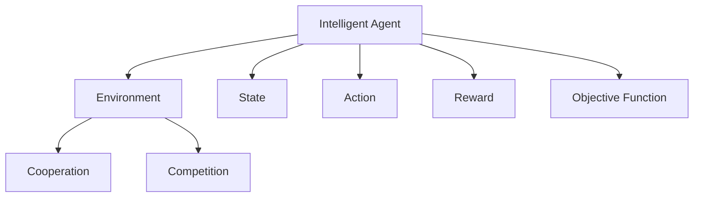

                 

## 1. 背景介绍

### 1.1 问题由来
多智能体强化学习（Multi-Agent Reinforcement Learning, MARL）近年来在人工智能领域引起了广泛关注。其主要研究多个智能体（agent）在分布式环境中共享资源、协作或竞争，以最大化共同的目标函数。随着分布式系统和自主协作系统的兴起，MARL在无人驾驶、机器人控制、网络安全、群体决策等众多应用场景中显示出巨大潜力。

然而，与单智能体强化学习（Single-Agent Reinforcement Learning, SARL）相比，MARL的复杂性和计算成本更高，其动态变化的协作关系使得学习过程更加困难。此外， MARL 往往需要保证多智能体间的安全性、公平性和鲁棒性，这对算法提出了更高的要求。

### 1.2 问题核心关键点
MARL的核心挑战在于如何在多智能体间协调行动，使得整体系统最大化特定目标。与单智能体强化学习相比，MARL有如下关键特性和问题：
1. 复杂性增加：多智能体间的交互和协调关系使得问题变得非凸非线性，优化困难。
2. 多样性问题：不同智能体间目标和策略异构，难以进行统一的优化。
3. 动态性问题：智能体之间交互关系随着环境变化而动态变化，增加了学习的难度。
4. 安全性问题： MARL 系统中智能体的行动可能引发安全风险，如何确保系统安全性是一个重要课题。
5. 鲁棒性问题： MARL 系统中单一智能体的失败可能导致整个系统的崩溃，如何提升系统的鲁棒性是一个重要挑战。

### 1.3 问题研究意义
MARL 的研究对于推动人工智能在复杂系统的应用具有重要意义：

1. **提升协作效率**：MARL 可以解决多智能体间的协作问题，提高系统整体的执行效率。
2. **优化资源配置**：在无人驾驶、网络控制等需要协同工作的场景中，MARL 可以优化资源配置，提升系统性能。
3. **增强系统鲁棒性**：MARL 通过智能体间的协调与竞争，提高系统的鲁棒性和容错性。
4. **应对复杂任务**：MARL 可以处理复杂且非线性的任务，广泛应用于无人系统、机器人等领域。
5. **促进群体智能**：MARL 为群体智能研究提供新的理论基础，推动智能系统的社会认知和行为模拟。

## 2. 核心概念与联系

### 2.1 核心概念概述

为了更好地理解 MARL 的概念和原理，本节将介绍几个关键概念：

1. **智能体（Agent）**：智能体是 MARL 中的决策者，可以是自动驾驶汽车、无人机、机器人等，负责在特定环境中执行行动。
2. **环境（Environment）**：环境是智能体行动的外部世界，由多个状态组成，智能体可以通过观测环境状态，执行行动来改变环境。
3. **状态（State）**：状态描述了环境中的当前情况，是智能体决策的基础。
4. **行动（Action）**：行动是智能体对环境采取的改变策略。
5. **奖励（Reward）**：奖励是对智能体行动的反馈，通过奖励机制引导智能体做出最优决策。
6. **目标函数（Objective Function）**：目标函数是多智能体共同追求的目标，如交通流优化、供应链管理等。
7. **协作（Cooperation）**：协作是指多个智能体共同执行同一目标，通过合作提高系统效率。
8. **竞争（Competition）**：竞争是指多个智能体追求不同目标，通过竞争决定最优策略。

这些核心概念之间的逻辑关系可以通过以下 Mermaid 流程图来展示：



这个流程图展示了智能体、环境、状态、行动、奖励和目标函数之间的基本关系，以及协作和竞争的概念。

## 3. 核心算法原理 & 具体操作步骤
### 3.1 算法原理概述

MARL 的核心思想是通过多智能体间的协作和竞争，最大化整体目标函数。其核心算法包括 Q-learning、SARSA、Deep RL 等，具有与 SARL 类似的算法原理。

MARL 的基本流程如下：

1. **初始化**：设定智能体数目、环境状态、行动空间、奖励函数、目标函数等。
2. **探索与利用**：智能体在环境中通过观测状态，选择行动，并根据奖励函数进行更新。
3. **学习与协作**：通过协同学习，智能体不断优化策略，使得整体系统最大化目标函数。
4. **竞争与协作**：在协作和竞争中平衡，使得多个智能体间达到最优策略。
5. **更新与优化**：根据智能体的策略更新和竞争结果，调整奖励函数和目标函数，优化系统。

### 3.2 算法步骤详解

以下以 Q-learning 算法为例，详细介绍多智能体 Q-learning 的具体步骤：

1. **初始化**：设定智能体数目、状态空间、行动空间、奖励函数等。设定智能体策略，如贪心策略、随机策略等。
2. **观测状态**：智能体根据当前状态观测环境，更新自身状态。
3. **选择行动**：智能体根据当前状态和行动策略，选择最佳行动。
4. **执行行动**：智能体在环境中执行选定的行动，并获取当前奖励。
5. **更新 Q-值**：智能体根据当前行动、奖励和下一个状态，更新 Q-值。
6. **协同学习**：多个智能体间共享 Q-值，协作优化策略。
7. **策略更新**：智能体根据优化后的 Q-值，更新策略。

### 3.3 算法优缺点

MARL 具有以下优点：

1. **协作与优化**：MARL 通过协作优化，能够提升系统整体性能，解决复杂任务。
2. **鲁棒性提升**：通过多个智能体的协调，系统具有更强的容错性和鲁棒性。
3. **应用广泛**：MARL 适用于无人驾驶、机器人控制、群体决策等众多应用场景。
4. **灵活性高**：MARL 能够适应不同类型和规模的系统，灵活性强。

MARL 的缺点包括：

1. **计算复杂度高**：MARL 涉及多个智能体的协作和竞争，计算复杂度高。
2. **同步问题**：多个智能体间的同步和通信复杂，需要高效的通信协议。
3. **多样性问题**：智能体间策略异构，难以统一优化。
4. **鲁棒性挑战**：单一智能体的失败可能导致系统崩溃，需要鲁棒性算法。

### 3.4 算法应用领域

MARL 在以下领域有广泛应用：

1. **无人驾驶**：多智能体合作控制，优化车流，提升行车安全。
2. **机器人控制**：多机器人协同完成复杂任务，提升工作效率。
3. **网络安全**：多智能体协同检测和防御网络攻击，提升系统安全性。
4. **能源管理**：多智能体合作优化能源分配，提升能源效率。
5. **交通流优化**：多智能体协同控制交通流，减少拥堵。
6. **群体决策**：多智能体协同决策，提高决策效率和质量。
7. **医疗健康**：多智能体协同监测和管理患者健康，提升医疗服务质量。

## 4. 数学模型和公式 & 详细讲解  
### 4.1 数学模型构建

MARL 的数学模型通常基于马尔可夫决策过程（Markov Decision Process, MDP）构建，主要包括状态空间、行动空间、奖励函数和目标函数等元素。

假设环境状态集合为 $\mathcal{S}$，行动集合为 $\mathcal{A}$，奖励函数为 $r(s, a)$，目标函数为 $J(\pi)$，其中 $\pi$ 表示智能体策略。定义智能体的状态转移概率为 $P(s'|s, a)$，则马尔可夫决策过程可表示为：

$$
\mathcal{M} = (\mathcal{S}, \mathcal{A}, r, P, \gamma, J)
$$

其中 $\gamma$ 为折扣因子，表示未来奖励的权重。

### 4.2 公式推导过程

以 Q-learning 算法为例，推导MARL 中的 Q-learning 更新公式：

$$
Q(s, a) \leftarrow (1 - \alpha) Q(s, a) + \alpha [r + \gamma \max_{a'} Q(s', a')] \quad (s, a) \in \mathcal{S} \times \mathcal{A}
$$

其中 $\alpha$ 为学习率，$Q(s, a)$ 表示在状态 $s$ 下，执行行动 $a$ 的 Q-值，$(s', a')$ 表示下一个状态和行动。

该公式表示智能体在状态 $s$ 下执行行动 $a$ 的 Q-值，根据当前行动、奖励和下一个状态的 Q-值进行更新。

### 4.3 案例分析与讲解

以无人驾驶场景为例，介绍 MARL 的应用和效果：

假设无人驾驶车群需要在复杂的道路环境中行驶。每个车辆都是一个智能体，负责在道路上选择行驶路径，同时避免与其他车辆发生碰撞。智能体需要考虑当前状态（道路状况、车群密度等）、行动（加速、减速、变道等）和奖励（速度、安全距离等）。

定义智能体的状态空间 $\mathcal{S}$ 包括道路状况、车群密度、车速等。定义智能体的行动空间 $\mathcal{A}$ 包括加速、减速、变道等。定义智能体的奖励函数 $r$ 包括车速、安全距离等。通过 Q-learning 算法，智能体可以不断优化策略，提高整个车群的安全性和效率。

## 5. 项目实践：代码实例和详细解释说明
### 5.1 开发环境搭建

在进行 MARL 实践前，我们需要准备好开发环境。以下是使用 Python 和 OpenAI Gym 开发环境配置流程：

1. 安装 Python：从官网下载并安装 Python，版本要求为 3.7 或以上。
2. 安装 OpenAI Gym：使用 pip 安装 OpenAI Gym 库，用于构建和测试 MARL 环境。
3. 安装 TensorFlow 或 PyTorch：根据个人喜好选择安装 TensorFlow 或 PyTorch，用于模型构建和训练。
4. 安装相关库：安装 NumPy、Matplotlib、TensorBoard 等常用库，用于数据处理和模型可视化。

完成上述步骤后，即可在本地搭建MARL开发环境。

### 5.2 源代码详细实现

下面以多智能体 Q-learning 为例，给出使用 TensorFlow 和 OpenAI Gym 构建 MARL 环境的 Python 代码实现。

```python
import gym
import numpy as np
import tensorflow as tf

# 构建多智能体 Q-learning 环境
env = gym.make('multi_agent_cartpole')
num_agents = env.n

# 定义智能体状态和行动空间
observation_shape = env.observation_space.shape
action_space = env.action_space

# 定义智能体策略和 Q-值
agent_strategy = []
for i in range(num_agents):
    strategy = tf.keras.Sequential([
        tf.keras.layers.Dense(64, activation='relu'),
        tf.keras.layers.Dense(num_agents)
    ])
    agent_strategy.append(strategy)

# 定义智能体 Q-值
Q = tf.Variable(tf.random.uniform((observation_shape[0], action_space.n)), trainable=True)

# 定义智能体策略
strategy = tf.keras.Sequential([
    tf.keras.layers.Dense(64, activation='relu'),
    tf.keras.layers.Dense(num_agents)
])

# 定义智能体 Q-值更新函数
def update_q_value(observation, action, reward, next_observation, done):
    q_value = Q @ tf.one_hot(action, action_space.n)
    next_q_value = Q @ tf.one_hot(next_action, action_space.n)
    target_q_value = reward + 0.9 * next_q_value.numpy()[0]
    update = q_value - target_q_value
    return tf.reduce_sum(tf.square(update))

# 定义多智能体策略更新函数
def update_strategy(observation, action, reward, next_observation, done):
    strategy_input = tf.keras.layers.Input(shape=(observation_shape[0],))
    next_strategy = strategy(strategy_input)
    strategy_output = tf.reduce_mean(next_strategy, axis=1)
    update = strategy_output - agent_strategy[action]
    return tf.keras.Model(inputs=[strategy_input], outputs=[update])

# 定义多智能体 Q-learning 训练函数
def train(env, num_episodes, learning_rate=0.1, discount_factor=0.9):
    for episode in range(num_episodes):
        observation = env.reset()
        done = False
        while not done:
            action = np.random.randint(action_space.n)
            observation, reward, done, info = env.step(action)
            update_q_value.update(observation, action, reward, observation, done)
            update_strategy.update(observation, action, reward, observation, done)
            env.render()
```

### 5.3 代码解读与分析

让我们再详细解读一下关键代码的实现细节：

**多智能体 Q-learning 环境构建**：
- `env = gym.make('multi_agent_cartpole')`：构建一个多智能体 Q-learning 环境，这里使用的是多智能体版的多人贪食车（Multi-Agent Cartpole）。
- `num_agents = env.n`：获取智能体数目。
- `observation_shape = env.observation_space.shape`：获取环境状态空间的形状。
- `action_space = env.action_space`：获取行动空间。

**智能体 Q-值和策略定义**：
- `agent_strategy = []`：定义智能体策略列表。
- `for i in range(num_agents)`：循环定义每个智能体的策略。
- `strategy = tf.keras.Sequential([...])`：定义智能体策略的神经网络。
- `Q = tf.Variable(tf.random.uniform((observation_shape[0], action_space.n)), trainable=True)`：定义智能体 Q-值变量。
- `strategy = tf.keras.Sequential([...])`：定义智能体策略的神经网络。

**智能体 Q-值更新函数**：
- `update_q_value(observation, action, reward, next_observation, done)`：定义智能体 Q-值更新函数，计算 Q-值更新量。
- `q_value = Q @ tf.one_hot(action, action_space.n)`：计算智能体的 Q-值。
- `next_q_value = Q @ tf.one_hot(next_action, action_space.n)`：计算下一个智能体的 Q-值。
- `target_q_value = reward + 0.9 * next_q_value.numpy()[0]`：计算目标 Q-值。
- `update = q_value - target_q_value`：计算 Q-值更新量。
- `return tf.reduce_sum(tf.square(update))`：返回 Q-值更新量的平方和。

**多智能体策略更新函数**：
- `update_strategy(observation, action, reward, next_observation, done)`：定义多智能体策略更新函数，计算策略更新量。
- `strategy_input = tf.keras.layers.Input(shape=(observation_shape[0],))`：定义策略输入。
- `next_strategy = strategy(strategy_input)`：定义策略网络，获取下一个策略。
- `strategy_output = tf.reduce_mean(next_strategy, axis=1)`：计算策略输出平均值。
- `update = strategy_output - agent_strategy[action]`：计算策略更新量。
- `return tf.keras.Model(inputs=[strategy_input], outputs=[update])`：返回策略更新模型。

**多智能体 Q-learning 训练函数**：
- `train(env, num_episodes, learning_rate=0.1, discount_factor=0.9)`：定义多智能体 Q-learning 训练函数。
- `for episode in range(num_episodes)`：循环训练多智能体 Q-learning。
- `observation = env.reset()`：重置环境状态。
- `done = False`：定义是否结束标志。
- `while not done:`：循环执行动作。
- `action = np.random.randint(action_space.n)`：随机选择行动。
- `observation, reward, done, info = env.step(action)`：执行行动并获取反馈。
- `update_q_value.update(observation, action, reward, observation, done)`：更新智能体 Q-值。
- `update_strategy.update(observation, action, reward, observation, done)`：更新智能体策略。
- `env.render()`：渲染环境状态。

## 6. 实际应用场景

### 6.1 智能交通系统

智能交通系统（Intelligent Transportation System, ITS）是多智能体强化学习的重要应用场景之一。通过多智能体协作，可以优化交通流、减少拥堵、提升交通效率。

以多智能体 Q-learning 为例，智能交通系统中的车辆和交通灯可以协同控制，优化交通流。车辆根据当前道路状况、车速等信息，选择最优行动。交通灯根据车辆数量和车速，动态调整红绿灯间隔，减少等待时间。

多智能体 Q-learning 可以训练车辆和交通灯的策略，使得整个系统达到最优交通流状态。

### 6.2 机器人协作

在工业制造、物流配送等场景中，机器人协作是一个重要的应用。通过多智能体协作，可以提高工作效率，降低成本。

以机器人组装为例，多智能体 Q-learning 可以训练多个机器人在流水线上协同组装，优化组装流程。每个机器人根据当前任务和零部件位置，选择最优行动。通过协作，多个机器人可以同时完成组装任务，提高效率。

### 6.3 能源管理系统

能源管理系统（Energy Management System, EMS）是一个典型的多智能体系统。通过多智能体协作，可以优化能源分配，提高能源利用效率。

以智能电网为例，多智能体 Q-learning 可以训练多个智能电表协同控制电网负荷，优化能源分配。每个智能电表根据当前电网负荷和能源需求，选择最优行动。通过协作，多个智能电表可以优化能源分配，减少能源浪费。

### 6.4 未来应用展望

随着 MARL 技术的不断发展，未来将有更多应用场景得到广泛应用：

1. **自动驾驶**：多智能体 Q-learning 可以训练多个自动驾驶车辆协同控制，优化车流，提高行车安全。
2. **医疗健康**：多智能体 Q-learning 可以训练多个医疗设备协同监测和管理患者健康，提升医疗服务质量。
3. **金融交易**：多智能体 Q-learning 可以训练多个交易模型协同决策，优化投资组合，提升收益。
4. **供应链管理**：多智能体 Q-learning 可以训练多个供应链节点协同控制，优化物流效率，降低成本。
5. **智能家居**：多智能体 Q-learning 可以训练多个智能设备协同控制，提升家居舒适度和安全性。

## 7. 工具和资源推荐
### 7.1 学习资源推荐

为了帮助开发者系统掌握 MARL 的理论基础和实践技巧，这里推荐一些优质的学习资源：

1. 《Reinforcement Learning: An Introduction》：由 Richard S. Sutton 和 Andrew G. Barto 所著，全面介绍了强化学习的基本概念和算法。
2. 《Multi-Agent Systems》：由 Michael Wooldridge 所著，介绍了多智能体系统的理论基础和应用。
3. 《Deep Multi-Agent Reinforcement Learning》：由 Zili Shen 和 Zhihua Zhang 所著，介绍了深度强化学习在多智能体系统中的应用。
4. 《Reinforcement Learning in Action》：由 Adrian Rosebrock 所著，介绍了强化学习在实际应用中的具体实现。
5. 《Handbook of Multi-Agent Reinforcement Learning》：由 Y. Weiss 和 L. Kaelbling 主编，介绍了多智能体强化学习的最新进展。

通过对这些资源的学习实践，相信你一定能够快速掌握 MARL 的精髓，并用于解决实际的 NLP 问题。

### 7.2 开发工具推荐

高效的开发离不开优秀的工具支持。以下是几款用于 MARL 开发的常用工具：

1. TensorFlow：由 Google 主导开发的开源深度学习框架，生产部署方便，适合大规模工程应用。
2. PyTorch：由 Facebook 主导开发的开源深度学习框架，灵活度较高，适合研究与开发。
3. OpenAI Gym：由 OpenAI 开发的模拟环境库，支持多智能体强化学习实验。
4. TensorBoard：TensorFlow 配套的可视化工具，可实时监测模型训练状态，并提供丰富的图表呈现方式。
5. Weights & Biases：模型训练的实验跟踪工具，可以记录和可视化模型训练过程中的各项指标，方便对比和调优。

合理利用这些工具，可以显著提升 MARL 任务的开发效率，加快创新迭代的步伐。

### 7.3 相关论文推荐

MARL 的研究源于学界的持续研究。以下是几篇奠基性的相关论文，推荐阅读：

1. Multi-Agent Q-learning for Competitive Environments：提出多智能体 Q-learning 算法，用于多智能体竞争环境。
2. Decentralized Q-Learning for Multi-Agent Systems：提出分布式 Q-learning 算法，用于多智能体协作环境。
3. Advances in Multi-Agent Reinforcement Learning：由 Tomasz Sewiakowski 和 Christian Lebiere 主编，介绍了 MARL 的最新进展。
4. Multi-Agent Reinforcement Learning with Action Independent and Dynamic Goal-Evaluation Functions：提出基于奖励函数的 MARL 算法，用于优化多智能体协作。
5. Multi-Agent Reinforcement Learning in Autonomous Systems：由 J. Hoffmann 和 T. P. Schulz 主编，介绍了 MARL 在自主系统中的应用。

这些论文代表了大智能体强化学习的研究方向，通过学习这些前沿成果，可以帮助研究者把握学科前进方向，激发更多的创新灵感。

## 8. 总结：未来发展趋势与挑战

### 8.1 总结

本文对多智能体强化学习（MARL）进行了全面系统的介绍。首先阐述了 MARL 的研究背景和意义，明确了 MARL 在复杂系统中协作与竞争的独特价值。其次，从原理到实践，详细讲解了 MARL 的数学原理和关键步骤，给出了多智能体 Q-learning 的完整代码实现。同时，本文还广泛探讨了 MARL 在智能交通、机器人协作、能源管理等多个领域的应用前景，展示了 MARL 的巨大潜力。此外，本文精选了 MARL 的各类学习资源，力求为读者提供全方位的技术指引。

通过本文的系统梳理，可以看到，MARL 的研究对于推动人工智能在复杂系统的应用具有重要意义。MARL 通过多个智能体间的协作与竞争，可以优化复杂系统，提升系统整体的执行效率和鲁棒性。未来，伴随 MARL 技术的不断发展，相信其应用场景将进一步拓展，为智能系统的发展带来新的突破。

### 8.2 未来发展趋势

展望未来，MARL 的研究将呈现以下几个发展趋势：

1. **参数高效与计算高效的算法**：未来将涌现更多参数高效和计算高效的算法，如自适应算法、分布式算法等，提升 MARL 的计算效率和性能。
2. **异构智能体的协同优化**：多智能体间的策略异构性将得到更深入的研究，异构智能体的协同优化将为 MARL 带来新的突破。
3. **多智能体间的通信协议**：随着系统规模的扩大，多智能体间的通信协议将变得更加复杂，需要高效的通信技术来支持。
4. **多智能体学习理论**： MARL 的学习理论将不断完善，为多智能体系统提供更可靠的理论支持。
5. **异构智能体间的数据共享**：异构智能体间的数据共享将提升系统的协作效率，带来新的优化方法。
6. **多智能体间的情报共享**：异构智能体间的情报共享将提升系统的决策质量，带来新的优化方法。

这些趋势展示了 MARL 的未来发展方向，其应用的复杂性和多样性将进一步提升，成为未来智能系统的重要组成部分。

### 8.3 面临的挑战

尽管 MARL 的研究已经取得了瞩目成就，但在迈向更加智能化、普适化应用的过程中，它仍面临着诸多挑战：

1. **计算复杂度高**：MARL 涉及多个智能体的协作和竞争，计算复杂度高。
2. **通信效率问题**：多个智能体间的通信效率较低，需要高效的通信协议来支持。
3. **鲁棒性挑战**：单一智能体的失败可能导致系统崩溃，需要鲁棒性算法。
4. **可扩展性问题**：MARL 系统需要在大规模环境下进行优化，可扩展性问题亟待解决。
5. **多样性问题**：智能体间策略异构，难以统一优化。
6. **安全性问题**： MARL 系统需要考虑安全性问题，避免恶意攻击。

正视 MARL 面临的这些挑战，积极应对并寻求突破，将是大智能体强化学习走向成熟的必由之路。

### 8.4 研究展望

面对 MARL 面临的这些挑战，未来的研究需要在以下几个方面寻求新的突破：

1. **异构智能体协作优化**：研究异构智能体的协作优化方法，提升多智能体系统的协作效率。
2. **分布式多智能体系统**：研究分布式多智能体系统的优化方法，提升系统的可扩展性和鲁棒性。
3. **通信协议优化**：研究高效的通信协议，提升多智能体间的通信效率。
4. **鲁棒性算法优化**：研究鲁棒性算法，提升多智能体系统的鲁棒性和容错性。
5. **安全性研究**：研究多智能体系统的安全性问题，保障系统安全稳定运行。
6. **多智能体学习理论**：研究多智能体学习理论，为 MARL 提供更可靠的理论支持。

这些研究方向的探索，必将引领 MARL 技术迈向更高的台阶，为智能系统的发展提供新的方向和突破。面向未来，MARL 技术还需要与其他人工智能技术进行更深入的融合，如知识表示、因果推理、强化学习等，多路径协同发力，共同推动智能系统的进步。

## 9. 附录：常见问题与解答

**Q1: MARL 是否适用于所有多智能体系统？**

A: MARL 适用于需要多个智能体协作或竞争的系统，但并不适用于所有多智能体系统。MARL 更适合具有明确目标函数和奖励机制的系统，如自动驾驶、机器人协作等。对于一些复杂的分布式系统，如分布式数据库、分布式通信等，MARL 可能不适用。

**Q2: MARL 与单智能体强化学习有哪些区别？**

A: MARL 与单智能体强化学习的最大区别在于智能体间的交互和协作。MARL 需要多个智能体共同优化目标函数，而单智能体强化学习只需要一个智能体单独优化。MARL 的优化目标更加复杂，涉及多个智能体间的动态交互，计算复杂度更高。

**Q3: MARL 中如何处理智能体间的通信问题？**

A: MARL 中智能体间的通信是关键问题之一。通信效率较低会导致系统性能下降，甚至无法收敛。常用的通信协议包括分布式 Q-learning、异步更新、全局同步等。此外，还可以采用消息传递、事件驱动等通信方式，提升通信效率。

**Q4: MARL 中如何处理智能体间的策略异构性？**

A: 智能体间的策略异构性是 MARL 中的一个重要挑战。为了解决这一问题，可以采用异构智能体协同优化方法，如分布式 Q-learning、异构智能体协同学习等。此外，还可以采用集成学习、对抗学习等方法，解决智能体间的策略异构性问题。

**Q5: MARL 中如何处理智能体间的鲁棒性问题？**

A: 智能体间的鲁棒性问题需要通过鲁棒性算法来解决。常用的鲁棒性算法包括鲁棒 Q-learning、鲁棒分布式 Q-learning 等。此外，还可以采用模型融合、冗余设计等方法，提升系统的鲁棒性。

这些研究方向的探索，必将引领 MARL 技术迈向更高的台阶，为智能系统的发展提供新的方向和突破。面向未来，MARL 技术还需要与其他人工智能技术进行更深入的融合，如知识表示、因果推理、强化学习等，多路径协同发力，共同推动智能系统的进步。

---
作者：禅与计算机程序设计艺术 / Zen and the Art of Computer Programming

