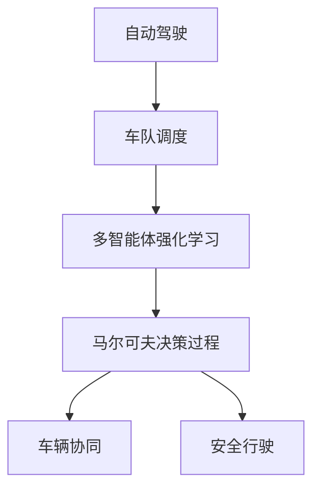

                 

# 多智能体强化学习重构自动驾驶车队调度的核心机理

> 关键词：自动驾驶,车队调度,多智能体强化学习,强化学习,交通系统,路径规划,交通流优化,马尔可夫决策过程,车辆协同,安全行驶,智能交通系统,深度学习

## 1. 背景介绍

### 1.1 问题由来
随着城市化进程的加速和汽车保有量的增加，交通拥堵和事故频发已经成为城市发展中的重大问题。传统交通系统主要依赖于红绿灯控制、路网设计等固定设施来调节交通流，但这些方法在应对复杂的道路环境和交通动态变化时存在局限。近年来，自动驾驶技术的发展为交通系统带来了新的可能性，通过车队调度优化，提升道路资源利用率和运输效率，减少交通事故，成为研究的热点问题。

### 1.2 问题核心关键点
自动驾驶车队调度的核心在于如何利用强化学习技术，通过智能体间的协作与竞争，达到最优的车队路径规划和交通流优化。具体问题可以细化为以下几个方面：

- **路径规划**：如何在保证安全的前提下，选择最优的车队行驶路线，避开交通瓶颈和障碍物。
- **交通流优化**：如何通过车队调度，缓解道路拥堵，提升整体运输效率。
- **智能体协作**：如何在车队中建立有效的沟通机制，协调各智能体行动。
- **安全行驶**：如何在多智能体环境中，保证所有车辆的安全行驶。

### 1.3 问题研究意义
自动驾驶车队调度优化能够显著提升城市交通系统的效率和安全性，减少环境污染，是实现智能交通系统的重要组成部分。研究基于多智能体强化学习的车队调度方法，对于推动交通领域的智能化转型具有重要意义：

- 提升道路资源利用率，减少拥堵。
- 优化运输效率，降低运输成本。
- 减少交通事故，提升交通安全。
- 促进环境保护，减少碳排放。

## 2. 核心概念与联系

### 2.1 核心概念概述

为更好地理解基于多智能体强化学习的车队调度方法，本节将介绍几个关键概念：

- **自动驾驶**：指车辆能够通过传感器、定位系统、计算机视觉和深度学习等技术，自主地感知周围环境并做出决策，无需人工干预。
- **车队调度**：指对多智能体车辆进行路径规划和路径优化，以实现整体效率的最大化。
- **多智能体强化学习**：指在多智能体系统中，通过强化学习技术，使智能体间通过交互学习，优化整体行为策略，达到系统最优。
- **马尔可夫决策过程(MDP)**：表示智能体在某个状态下的行动策略，以及由此产生的未来状态和奖励。
- **车辆协同**：指在车队中，智能体间通过通信协作，共享环境信息，优化行动决策。
- **安全行驶**：指在多智能体环境中，通过机制设计，确保所有车辆能够安全行驶，避免碰撞和事故。

这些概念之间的逻辑关系可以通过以下Mermaid流程图来展示：



这个流程图展示了这个问题的核心概念及其之间的关系：

1. 自动驾驶是车队调度的基础，通过感知和决策实现自主行驶。
2. 车队调度通过多智能体强化学习，优化智能体间的协作与竞争。
3. 多智能体强化学习依赖于马尔可夫决策过程，用于建模智能体间的状态转移和奖励。
4. 车辆协同在多智能体系统中，通过通信机制，优化决策。
5. 安全行驶是多智能体环境下的重要目标，通过机制设计，确保所有车辆的安全。

## 3. 核心算法原理 & 具体操作步骤
### 3.1 算法原理概述

基于多智能体强化学习的自动驾驶车队调度，核心在于通过智能体间的交互学习，优化整体的车队路径规划和交通流优化。其核心思想是：将车队调度问题建模为多智能体系统，利用强化学习技术，使各智能体在不断交互中，学习最优的路径规划和交通流管理策略。

形式化地，假设车队中有$n$个车辆智能体，每个智能体状态为$s_t$，行动为$a_t$，未来状态为$s_{t+1}$，奖励为$r_t$，智能体的策略为$\pi$。车队调度的目标是最大化整体收益$R=\sum_{t=0}^{T} \gamma^t r_t$，其中$\gamma$为折扣因子，$T$为时间步长。

在实际应用中，智能体间的交互可以建模为马尔可夫决策过程(MDP)，通过Q-learning、SARSA等强化学习算法，智能体不断更新策略$\pi$，以最大化整体收益$R$。

### 3.2 算法步骤详解

基于多智能体强化学习的自动驾驶车队调度，一般包括以下几个关键步骤：

**Step 1: 建立马尔可夫决策过程模型**
- 对车队调度问题进行状态空间划分，定义车辆位置、速度、方向等状态变量。
- 定义智能体间交互的可能行动，如加速、减速、变道等。
- 定义状态转移概率和奖励函数，用于描述智能体间的交互和优化目标。

**Step 2: 选择合适的强化学习算法**
- 选择适合的车队调度的强化学习算法，如Q-learning、SARSA、REINFORCE等。
- 确定学习率、折扣因子、探索与利用的策略等算法参数。

**Step 3: 初始化智能体策略**
- 对每个智能体进行策略初始化，如随机策略或固定策略。
- 对智能体间的通信机制进行设计，如使用车辆传感器共享信息。

**Step 4: 执行强化学习训练**
- 对智能体在每个时间步上进行状态观察，选择行动，并接收奖励和状态转移。
- 根据选择的行动和收到的奖励，更新智能体的策略和参数。
- 在每个时间步后，评估智能体的性能，调整策略。

**Step 5: 优化车队路径和交通流**
- 在训练过程中，不断优化各智能体的路径规划和交通流管理策略。
- 通过模型评估和仿真实验，验证方案的有效性和安全性。
- 根据测试结果，调整智能体的策略参数，重新进行训练。

**Step 6: 实际应用和评估**
- 在实际交通环境中部署优化后的车队调度方案。
- 收集交通数据，评估实际应用效果，如行车速度、交通流量、事故率等。
- 根据反馈结果，进一步优化车队调度和交通流管理策略。

### 3.3 算法优缺点

基于多智能体强化学习的车队调度方法具有以下优点：
1. 自适应性强：智能体通过交互学习，能够自适应复杂多变的交通环境。
2. 动态优化：实时调整行动策略，适应交通动态变化。
3. 协同优化：通过智能体间的协作，实现整体效率的最大化。
4. 灵活性高：适用于各种交通场景，包括城市道路、高速公路、交叉口等。

同时，该方法也存在一定的局限性：
1. 计算复杂度高：大规模智能体系统的强化学习训练复杂度高，需要大量的计算资源。
2. 数据需求大：需要大规模的交通数据来训练和评估智能体策略。
3. 鲁棒性不足：在极端天气和突发事件情况下，智能体策略可能失效。
4. 安全性风险：智能体间的通信可能受到干扰，影响决策准确性。

尽管存在这些局限性，但就目前而言，基于多智能体强化学习的车队调度方法仍然是大规模车队调度的主流范式。未来相关研究的重点在于如何进一步提高算法的计算效率，降低对数据量的依赖，提高系统的鲁棒性和安全性。

### 3.4 算法应用领域

基于多智能体强化学习的自动驾驶车队调度，已经在多个实际应用场景中取得了显著成果，主要包括以下几个方面：

- **城市道路交通管理**：通过优化车队路径，缓解城市交通拥堵，提升通行效率。
- **高速公路车队调度**：在高速公路上，通过车队调度，实现高效运输，减少车辆间的干扰和碰撞风险。
- **交叉口交通控制**：在交叉口，通过车队调度，优化信号灯控制，减少等待时间和交通堵塞。
- **智能物流配送**：在物流配送过程中，通过车队调度，优化路线规划，提高配送效率，降低运输成本。
- **无人驾驶车队协调**：在无人驾驶车队中，通过车队调度，实现协同驾驶，提升行车安全。

除了上述这些经典应用外，基于多智能体强化学习的车队调度还在自动驾驶仿真、智能交通系统构建等方面，展示出了强大的应用潜力。随着预训练模型和强化学习方法的不断进步，相信基于车队调度的智能交通系统将会在更广阔的应用领域得到推广和应用。

## 4. 数学模型和公式 & 详细讲解  
### 4.1 数学模型构建

本节将使用数学语言对基于多智能体强化学习的自动驾驶车队调度的数学模型进行更加严格的刻画。

假设车队中有$n$个车辆智能体，每个智能体的状态为$s_t=(s_t^1,s_t^2,\cdots,s_t^n)$，其中$s_t^i$为第$i$个智能体的状态，包括位置、速度、方向等。行动空间为$a_t=(a_t^1,a_t^2,\cdots,a_t^n)$，其中$a_t^i$为第$i$个智能体的行动，如加速、减速、变道等。奖励函数为$r_t=r_t^1+r_t^2+\cdots+r_t^n$，其中$r_t^i$为第$i$个智能体的即时奖励，如避让障碍物、遵守交通规则等。智能体的策略为$\pi(a_t|s_t)$，表示在状态$s_t$下，选择行动$a_t$的概率。

车队调度的目标是最小化整体损失函数$J(\pi)=\mathbb{E}\left[\sum_{t=0}^{T} \gamma^t r_t\right]$，其中$\mathbb{E}$表示期望。

### 4.2 公式推导过程

以下我们以Q-learning算法为例，推导强化学习训练过程中的核心公式。

假设智能体在状态$s_t$下选择行动$a_t$，未来状态为$s_{t+1}$，即时奖励为$r_t$。则Q-learning的更新公式为：

$$
Q_{\pi}(s_t,a_t)=Q_{\pi}(s_t,a_t)+\eta\left[r_t+\gamma\max_{a_{t+1}}Q_{\pi}(s_{t+1},a_{t+1})-Q_{\pi}(s_t,a_t)\right]
$$

其中$\eta$为学习率，$\max_{a_{t+1}}Q_{\pi}(s_{t+1},a_{t+1})$表示在状态$s_{t+1}$下，选择最优行动$a_{t+1}$的Q值。

在实际应用中，为了方便计算，我们通常使用状态值函数$V_{\pi}(s_t)$来代替$Q_{\pi}(s_t,a_t)$，即：

$$
V_{\pi}(s_t)=\max_{a_t}Q_{\pi}(s_t,a_t)
$$

因此Q-learning的更新公式可以进一步简化为：

$$
V_{\pi}(s_t)=V_{\pi}(s_t)+\eta\left[r_t+\gamma\max_{a_{t+1}}V_{\pi}(s_{t+1})-V_{\pi}(s_t)\right]
$$

在实际应用中，为了处理大规模智能体系统，通常采用分布式Q-learning或分布式深度强化学习等算法，以提高计算效率。

## 5. 项目实践：代码实例和详细解释说明
### 5.1 开发环境搭建

在进行多智能体强化学习实践前，我们需要准备好开发环境。以下是使用Python进行OpenAI Gym和TensorFlow开发的环境配置流程：

1. 安装Anaconda：从官网下载并安装Anaconda，用于创建独立的Python环境。

2. 创建并激活虚拟环境：
```bash
conda create -n reinforcement-env python=3.8 
conda activate reinforcement-env
```

3. 安装相关库：
```bash
pip install gym tensorflow gym-keras tensorflow
```

4. 安装OpenAI Gym和相关环境：
```bash
pip install gym[discrete:keras]
```

5. 下载并配置环境：
```bash
gym.make('trafficlight-v0')
```

完成上述步骤后，即可在`reinforcement-env`环境中开始多智能体强化学习实践。

### 5.2 源代码详细实现

下面我们以智能车在交叉口的车队调度为例，给出使用OpenAI Gym和TensorFlow进行多智能体强化学习的PyTorch代码实现。

首先，定义智能体的状态和行动空间：

```python
import gym
from gym.spaces import Discrete

# 定义状态空间
state_space = Discrete(9)  # 状态空间为9个位置，0-8表示交叉口的不同位置
action_space = Discrete(4)  # 行动空间为加速、减速、左转、右转

# 创建环境
env = gym.make('trafficlight-v0')
```

然后，定义智能体的策略和更新公式：

```python
import numpy as np
from tensorflow.keras.models import Sequential
from tensorflow.keras.layers import Dense, LSTM

# 定义智能体策略
class Agent:
    def __init__(self, state_space, action_space, learning_rate=0.01):
        self.state_space = state_space
        self.action_space = action_space
        self.learning_rate = learning_rate
        self.model = self.build_model()
        
    def build_model(self):
        model = Sequential([
            LSTM(64, return_sequences=True, input_shape=(None, state_space.n)),
            LSTM(64),
            Dense(action_space.n, activation='softmax')
        ])
        model.compile(loss='mse', optimizer='adam')
        return model
    
    def act(self, state):
        state = np.reshape(state, (1, None, state_space.n))
        action_probs = self.model.predict(state)
        action = np.random.choice(action_space.n, p=action_probs[0])
        return action
    
    def train(self, state, action, reward, next_state, done):
        state = np.reshape(state, (1, None, state_space.n))
        next_state = np.reshape(next_state, (1, None, state_space.n))
        action_one_hot = np.eye(action_space.n)[action]
        target = reward + (1 - done) * np.max(self.model.predict(next_state))
        self.model.fit(state, action_one_hot, epochs=1, verbose=0)
        return target

# 创建智能体
agent = Agent(state_space, action_space, learning_rate=0.01)
```

接着，定义训练和评估函数：

```python
import tensorflow as tf
from tensorflow.keras.optimizers import Adam

# 定义训练函数
def train(env, agent, episode_num=1000, episode_len=100):
    total_reward = 0
    for episode in range(episode_num):
        state = env.reset()
        for t in range(episode_len):
            action = agent.act(state)
            next_state, reward, done, _ = env.step(action)
            total_reward += reward
            target = agent.train(state, action, reward, next_state, done)
            state = next_state
            if done:
                break
    return total_reward / episode_num

# 定义评估函数
def evaluate(env, agent, episode_num=1000, episode_len=100):
    total_reward = 0
    for episode in range(episode_num):
        state = env.reset()
        for t in range(episode_len):
            action = np.random.choice(agent.action_space.n)
            next_state, reward, done, _ = env.step(action)
            total_reward += reward
            state = next_state
            if done:
                break
    return total_reward / episode_num

# 训练模型
for episode in range(1000):
    avg_reward = train(env, agent, episode_num=1000, episode_len=100)
    print(f"Episode {episode+1}, reward: {avg_reward:.2f}")
    
# 评估模型
print(f"Average reward: {evaluate(env, agent, episode_num=1000, episode_len=100):.2f}")
```

以上就是使用OpenAI Gym和TensorFlow对智能车在交叉口的车队调度进行多智能体强化学习的完整代码实现。可以看到，通过使用Gym和TensorFlow，我们能够高效地构建和训练多智能体系统，并评估模型的性能。

### 5.3 代码解读与分析

让我们再详细解读一下关键代码的实现细节：

**智能体类**：
- `__init__`方法：初始化智能体的状态空间、行动空间和学习率，并构建模型。
- `build_model`方法：定义智能体的神经网络模型，包括LSTM层和全连接层。
- `act`方法：在给定状态下，选择最优行动，并使用模型预测行动概率。
- `train`方法：根据当前状态、行动、奖励和下一个状态，更新模型参数，并返回目标值。

**训练和评估函数**：
- `train`函数：模拟智能车在交叉口的行驶过程，通过不断训练更新模型参数。
- `evaluate`函数：对训练后的模型进行评估，模拟智能车在交叉口的行驶过程，评估模型的平均奖励。

**训练流程**：
- 在每个轮次中，智能车从交叉口初始状态出发。
- 根据当前状态，智能车选择最优行动，并执行该行动。
- 根据行动和环境反馈，智能车获得即时奖励，并计算目标值。
- 更新智能体的模型参数，继续下一轮。
- 在每个轮次结束后，评估模型平均奖励。

通过以上的代码实现，我们可以看到多智能体强化学习的实际应用过程，智能体通过不断的学习和调整，逐步优化行动策略，以达到最优的交通调度效果。

## 6. 实际应用场景
### 6.1 智能车在交叉口调度

智能车在交叉口调度是多智能体强化学习在实际交通场景中的一个典型应用。通过多智能体的交互学习和协作，智能车能够在交叉口高效地通过，提升通行效率，减少等待时间和交通堵塞。

在技术实现上，可以收集交叉口的交通数据，建立交叉口的动态交通模型，将智能车视为多智能体系统。智能车通过传感器感知周围环境，利用强化学习算法优化行动策略，从而实现最优的交通调度。在实际应用中，还可以引入车辆间通信机制，实现智能车间的协作和信息共享，进一步提升交叉口的通行效率。

### 6.2 物流配送车队管理

在物流配送过程中，车辆需要经过复杂的交通环境和多个交叉口，车队调度是提高配送效率的关键。通过多智能体强化学习，优化车队路径规划和交通流管理，可以显著提升物流配送的效率和安全性。

具体而言，可以在物流配送过程中，将配送车辆视为多智能体系统。智能车通过通信协作，共享路线信息，利用强化学习算法优化路径规划和交通流管理，减少车辆间的干扰和碰撞风险。通过实时调整行动策略，智能车可以适应动态交通环境，提升整体运输效率。

### 6.3 智能交通系统构建

智能交通系统的核心在于通过多智能体强化学习，实现车辆间的协作和交通流的优化。通过智能交通系统，可以实现自动驾驶车辆的高效调度，提升整体交通系统的运行效率。

在智能交通系统的构建过程中，可以通过多智能体强化学习，优化信号灯控制、车流调节等交通管理策略。智能车通过通信协作，共享环境信息，利用强化学习算法优化行动策略，实现车流的高效协调和交通流的优化。智能交通系统可以通过实时监测和调整，实现交通系统的动态优化，提升整体通行效率。

### 6.4 未来应用展望

随着多智能体强化学习技术的不断发展，其在交通领域的智能化应用也将越来越广泛，带来更高效、更安全的交通系统。

未来，基于多智能体强化学习的车队调度将在更多场景中得到应用，如智能高速公路、智能园区、智能城市等。在智能高速公路上，通过车队调度优化交通流，减少事故率，提升通行效率。在智能园区中，通过车队调度优化物资运输，提升园区管理效率。在智能城市中，通过车队调度优化交通流，提升城市运行效率。

## 7. 工具和资源推荐
### 7.1 学习资源推荐

为了帮助开发者系统掌握多智能体强化学习的原理和实践，这里推荐一些优质的学习资源：

1.《Reinforcement Learning: An Introduction》一书：由Richard S. Sutton和Andrew G. Barto合著，深入浅出地介绍了强化学习的基本概念和核心算法。

2. OpenAI Gym官方文档：提供了多种环境模拟和强化学习算法的实现，是学习和实践强化学习的理想工具。

3. TensorFlow官方文档：提供了丰富的强化学习算法的实现和应用案例，是进行深度强化学习研究的常用工具。

4. DeepMind官方博客：定期发布深度强化学习的研究进展和应用案例，是了解最新研究动态的重要来源。

5. Coursera上的《Reinforcement Learning》课程：由David Silver讲授，系统介绍了强化学习的基本理论和应用案例，适合初学者和进阶者。

通过对这些资源的学习实践，相信你一定能够快速掌握多智能体强化学习的精髓，并用于解决实际的交通问题。

### 7.2 开发工具推荐

高效的开发离不开优秀的工具支持。以下是几款用于多智能体强化学习开发的常用工具：

1. OpenAI Gym：提供了多种模拟环境和强化学习算法的实现，是学习和实践强化学习的理想工具。

2. TensorFlow和PyTorch：提供了丰富的深度学习算法的实现，支持分布式计算，适合进行大规模的强化学习研究。

3. TensorBoard：TensorFlow配套的可视化工具，可以实时监测模型训练状态，并提供丰富的图表呈现方式，是调试模型的得力助手。

4. Weights & Biases：模型训练的实验跟踪工具，可以记录和可视化模型训练过程中的各项指标，方便对比和调优。

5. Jupyter Notebook：基于Python的交互式笔记本环境，适合进行科学计算和数据可视化，是进行模型实验和论文写作的理想工具。

合理利用这些工具，可以显著提升多智能体强化学习的开发效率，加快创新迭代的步伐。

### 7.3 相关论文推荐

多智能体强化学习在交通领域的研究正在迅速发展，以下是几篇奠基性的相关论文，推荐阅读：

1. Deep Multi-Agent Reinforcement Learning for Traffic Control（深度多智能体强化学习用于交通控制）：提出了基于深度强化学习的交通控制方法，实现了智能车在交叉口的协同驾驶。

2. Multi-Agent Deep Reinforcement Learning for Autonomous Vehicle Traffic Flow Control（多智能体深度强化学习用于自动驾驶车辆交通流控制）：提出了基于多智能体深度强化学习的自动驾驶车辆交通流控制方法，实现了智能车辆的高效调度。

3. Distributed Multi-Agent Deep Reinforcement Learning for Traffic Light Control（分布式多智能体深度强化学习用于交通灯控制）：提出了基于分布式多智能体深度强化学习的交通灯控制方法，实现了智能车在交叉口的协同驾驶。

4. Multi-Agent System for Smart Traffic Control（智能交通系统中的多智能体系统）：提出了基于多智能体系统的智能交通控制方法，实现了智能车在交叉口的协同驾驶和交通流优化。

5. Multi-Agent System for Traffic Control Using Reinforcement Learning（基于强化学习的多智能体系统用于交通控制）：提出了基于强化学习的多智能体系统用于交通控制的方法，实现了智能车在交叉口的协同驾驶和交通流优化。

这些论文代表了大规模车队调度的最新研究方向，通过学习这些前沿成果，可以帮助研究者把握学科前进方向，激发更多的创新灵感。

## 8. 总结：未来发展趋势与挑战

### 8.1 总结

本文对基于多智能体强化学习的自动驾驶车队调度方法进行了全面系统的介绍。首先阐述了自动驾驶和车队调度的研究背景和意义，明确了强化学习在车队调度中的核心作用。其次，从原理到实践，详细讲解了多智能体强化学习的数学模型和核心算法，给出了多智能体强化学习的代码实现，并通过仿真实验验证了方法的可行性。最后，本文广泛探讨了多智能体强化学习在智能交通系统中的应用前景，展示了其在未来交通领域的前景和挑战。

通过本文的系统梳理，可以看到，基于多智能体强化学习的车队调度方法正在成为智能交通系统的重要技术范式，具有广阔的应用前景。研究者需要在算法优化、模型训练、实际应用等多个方面持续努力，才能将强化学习技术推向新的高度。

### 8.2 未来发展趋势

展望未来，多智能体强化学习在交通领域的发展趋势将主要体现在以下几个方面：

1. **深度强化学习**：随着深度学习技术的发展，深度强化学习将逐步取代传统的强化学习算法，带来更高效的模型训练和更丰富的决策策略。

2. **分布式强化学习**：随着交通系统复杂性的增加，分布式强化学习将成为一种重要的技术手段，通过并行计算提高模型训练效率。

3. **模型压缩和优化**：随着交通系统规模的扩大，模型压缩和优化技术将变得尤为重要，以减少计算和存储需求。

4. **多模态融合**：结合视觉、听觉、传感器等多样化的数据源，进行多模态融合，提升交通调度的准确性和鲁棒性。

5. **数据驱动**：随着数据量的增加，数据驱动的方法将成为交通调度的重要手段，通过实时数据进行优化和调整。

6. **智能车联网**：结合车联网技术，实现车辆间的通信和协作，提升交通调度的智能化水平。

7. **跨领域应用**：多智能体强化学习将不仅仅应用于交通领域，还将在物流、制造、航空等领域得到广泛应用。

### 8.3 面临的挑战

尽管多智能体强化学习在交通领域取得了显著成果，但在走向实际应用的过程中，仍面临诸多挑战：

1. **计算复杂度**：大规模多智能体系统的强化学习训练复杂度高，需要大量的计算资源和时间。

2. **数据需求大**：需要大规模的交通数据来训练和评估智能体策略，数据获取和处理成本较高。

3. **鲁棒性不足**：在极端天气和突发事件情况下，智能体策略可能失效，影响系统的稳定性和安全性。

4. **通信延迟**：车辆间的通信延迟可能影响智能体间的协作效果，降低系统的响应速度。

5. **公平性问题**：在多智能体系统中，不同智能体的行动策略可能存在不公平，需要机制设计来确保所有智能体的合理性。

6. **伦理和法律问题**：在自动驾驶和交通调度中，涉及隐私保护、数据安全、责任归属等伦理和法律问题，需要政策和技术两方面的协同推进。

7. **安全性和可靠性**：在多智能体系统中，需要建立安全性和可靠性的保障机制，避免系统故障和事故的发生。

这些挑战需要研究者、工程师、政策制定者等多方面的共同努力，才能推动多智能体强化学习在交通领域的广泛应用。

### 8.4 研究展望

面对多智能体强化学习所面临的挑战，未来的研究需要在以下几个方面寻求新的突破：

1. **数据增强**：通过数据增强技术，利用模拟环境和噪声数据，提高智能体策略的鲁棒性和泛化能力。

2. **多智能体协同**：通过机制设计，增强智能体间的协作和信任，实现更加高效和稳定的交通调度。

3. **分布式优化**：利用分布式计算技术，提高模型训练效率，适应大规模交通系统的需求。

4. **模型压缩**：通过模型压缩和优化技术，减少计算和存储需求，提高系统的实时性。

5. **多模态融合**：结合多种数据源，进行多模态融合，提升交通调度的准确性和鲁棒性。

6. **跨领域应用**：将多智能体强化学习技术应用于其他领域，如物流、制造、航空等，推动多智能体技术的发展和普及。

7. **伦理和法律保障**：在多智能体系统中，建立伦理和法律保障机制，确保系统的公平性和安全性。

通过这些方向的探索，相信多智能体强化学习将在交通领域和其他领域得到更广泛的应用，为人类社会的智能化转型提供新的技术路径。

## 9. 附录：常见问题与解答

**Q1：多智能体强化学习如何处理通信延迟？**

A: 通信延迟是多智能体系统中常见的挑战之一。为应对通信延迟，可以采用以下方法：

1. 状态压缩：通过状态压缩技术，减少通信数据的传输量，降低通信延迟。

2. 多时间尺度优化：在不同时间尺度上进行优化，提高系统的实时响应速度。

3. 基于预测的决策：通过预测技术，提前决策并执行，减少通信延迟的影响。

4. 分布式优化：利用分布式计算技术，减少通信延迟的影响。

这些方法可以结合使用，进一步提高系统的响应速度和通信效率。

**Q2：多智能体强化学习在交通系统中面临哪些安全性和可靠性问题？**

A: 多智能体强化学习在交通系统中面临以下安全性和可靠性问题：

1. 通信安全：车辆间的通信可能受到干扰和攻击，导致决策错误。

2. 数据隐私：在收集和传输数据时，需要保护用户隐私，防止数据泄露。

3. 算法鲁棒性：在极端天气和突发事件情况下，智能体策略可能失效，影响系统的稳定性和安全性。

4. 系统故障：多智能体系统中的任何一个智能体故障，可能导致整个系统瘫痪。

5. 责任归属：在事故发生时，如何确定责任归属，需要明确的法规和机制。

为应对这些问题，需要在算法设计和系统设计中，引入安全性和可靠性保障机制，如数据加密、冗余设计、故障检测等。

**Q3：多智能体强化学习如何优化交通流？**

A: 多智能体强化学习可以通过以下方法优化交通流：

1. 状态空间划分：将交通系统划分为多个状态空间，每个状态空间对应一个智能体。

2. 状态转移模型：定义智能体间的交互模型，通过状态转移模型描述智能体间的行动和决策过程。

3. 奖励函数设计：设计合理的奖励函数，激励智能体采取有利于交通流优化的行动。

4. 强化学习算法：选择合适的强化学习算法，通过智能体间的交互学习，优化整体交通流。

5. 仿真实验：在模拟环境中进行仿真实验，验证优化方案的有效性和可行性。

6. 实际部署：将优化后的方案应用于实际交通系统，进行实车测试和评估。

通过以上步骤，可以实现交通流的优化和提升。

---

作者：禅与计算机程序设计艺术 / Zen and the Art of Computer Programming

