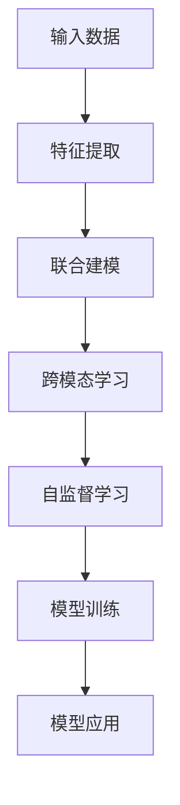

                 

# 多模态大模型：技术原理与实战 GPT-4多模态大模型核心技术介绍

> 关键词：多模态大模型, GPT-4, 自然语言处理, 计算机视觉, 深度学习, 联合建模, 跨模态学习, 自监督学习

## 1. 背景介绍

### 1.1 问题由来
近年来，随着深度学习技术的迅速发展，大模型在自然语言处理（NLP）和计算机视觉（CV）等领域取得了显著进展。然而，尽管单模态模型在各自领域表现出色，但在多模态场景下，单模态模型往往难以获得良好的性能。为此，研究人员提出了一种新的模型形态——多模态大模型，旨在融合多种模态的信息，提升模型在多模态任务上的表现。

GPT-4作为最新一代的自然语言处理模型，其核心技术之一就是多模态融合。通过将文本、图像、视频等多模态数据融合进模型，GPT-4能够在复杂的跨模态任务中表现出色，如自然语言图像生成、文本-视觉问答等。本文将详细介绍GPT-4多模态大模型的技术原理和实践方法，以期为相关研究和应用提供参考。

## 2. 核心概念与联系

### 2.1 核心概念概述

在介绍GPT-4多模态大模型的技术原理之前，我们先简要介绍一下几个核心概念：

- **多模态大模型**：指能够处理多种不同模态信息（如文本、图像、音频等）的大型神经网络模型。通过联合建模和跨模态学习，多模态大模型可以显著提升在多模态场景下的表现。

- **联合建模**：指将多种模态数据融合进同一个神经网络模型中，通过共享参数的方式进行建模。联合建模可以有效利用不同模态数据的信息，提升模型在多模态任务上的性能。

- **跨模态学习**：指在不同模态之间建立关联，将一种模态的信息转化为另一种模态的表示，从而实现多模态数据的融合和共享。跨模态学习包括语义对齐、特征映射等技术。

- **自监督学习**：指在无标签数据上进行的训练，通过数据自相关性引导模型学习。自监督学习在多模态大模型中通常用于预训练，帮助模型学习到通用的语言和视觉表示。

这些概念通过联合建模和跨模态学习，最终目标是通过深度学习实现多模态数据的融合，使得模型能够更好地理解和处理多模态任务。

### 2.2 核心概念原理和架构的 Mermaid 流程图



此图展示了GPT-4多模态大模型的一般架构。首先，输入数据经过特征提取层进行预处理；然后，联合建模层将不同模态的特征进行融合，建立多模态表示；接着，跨模态学习层在不同模态之间建立关联，提升模型对不同模态的理解；最后，自监督学习层在无标签数据上进行训练，帮助模型学习到通用的多模态表示。最终，训练好的模型可以应用于多种多模态任务中。

## 3. 核心算法原理 & 具体操作步骤

### 3.1 算法原理概述

GPT-4多模态大模型的核心算法原理基于联合建模和跨模态学习，其技术架构主要分为以下几个部分：

- **联合建模**：通过共享参数的方式，将文本、图像、音频等多模态数据融合进同一个神经网络模型中。联合建模的目的是提取不同模态数据中共同的特征表示。

- **跨模态学习**：在不同模态之间建立关联，将一种模态的信息转化为另一种模态的表示。例如，将文本描述转化为图像特征，或将图像特征转化为文本描述。

- **自监督学习**：在无标签数据上进行训练，通过数据自相关性引导模型学习。自监督学习帮助模型学习到通用的语言和视觉表示，提升模型的泛化能力。

### 3.2 算法步骤详解

GPT-4多模态大模型的训练步骤可以分为以下几个环节：

**Step 1: 数据准备**
- 收集多模态数据，包括文本、图像、音频等。
- 对数据进行预处理，包括数据清洗、归一化、标签标注等。
- 将不同模态的数据进行拼接或连接，形成联合特征向量。

**Step 2: 联合建模**
- 设计联合建模层，将不同模态的特征进行融合，建立多模态表示。
- 使用跨模态学习技术，在不同模态之间建立关联，提升模型对不同模态的理解。

**Step 3: 自监督学习**
- 在无标签数据上进行自监督学习，引导模型学习到通用的语言和视觉表示。
- 使用多模态自监督损失函数，例如 contrastive loss、triplet loss 等，优化模型参数。

**Step 4: 有监督学习**
- 在标注数据上进行有监督学习，微调模型的预测能力和推理能力。
- 使用联合损失函数，例如 MSE loss、Cross-Entropy loss 等，优化模型参数。

**Step 5: 模型评估**
- 在验证集上评估模型性能，调整模型超参数。
- 在测试集上评估模型性能，分析模型泛化能力。

### 3.3 算法优缺点

GPT-4多模态大模型的优点包括：

- **多模态融合**：能够处理多种不同模态的数据，提升模型在多模态任务上的表现。
- **通用性强**：通过自监督学习，模型学习到通用的语言和视觉表示，具有较强的泛化能力。
- **高性能**：通过联合建模和跨模态学习，模型能够更好地理解不同模态的信息，提升推理和预测能力。

同时，GPT-4多模态大模型也存在一些缺点：

- **训练复杂度高**：多模态数据的联合建模和跨模态学习增加了训练复杂度，需要更多的计算资源和时间。
- **数据需求量大**：多模态数据的准备和标注成本较高，需要大量的标注数据才能训练出效果良好的模型。
- **模型规模大**：多模态大模型的参数量较大，需要较高的计算资源和存储空间。

### 3.4 算法应用领域

GPT-4多模态大模型已经在多个领域得到了广泛应用，包括但不限于：

- **自然语言图像生成**：将文本描述转化为图像，或将图像生成对应的文本描述。
- **文本-视觉问答**：根据文本描述和图像，回答相关问题。
- **跨模态检索**：在文本和图像数据之间进行检索，找到相关的文本或图像。
- **智能家居**：将语音、图像、文本等多种模态数据进行融合，实现智能家居控制。

## 4. 数学模型和公式 & 详细讲解 & 举例说明

### 4.1 数学模型构建

GPT-4多模态大模型的数学模型构建包括以下几个部分：

**联合特征向量表示**：设输入数据为 $X$，包括文本、图像、音频等多种模态的数据，记为 $X = (x_1, x_2, ..., x_m)$，其中 $x_i$ 为第 $i$ 种模态的数据。将不同模态的数据进行拼接或连接，得到联合特征向量 $Z$：

$$
Z = f_{joint}(X)
$$

其中 $f_{joint}$ 为联合特征提取函数。

**多模态表示**：将联合特征向量 $Z$ 输入多模态表示层 $L_{multi}$，得到多模态表示 $H$：

$$
H = L_{multi}(Z)
$$

**跨模态学习**：使用跨模态学习技术，在不同模态之间建立关联。例如，将文本描述 $D$ 转化为图像特征 $I$：

$$
I = f_{text2img}(D)
$$

**自监督学习**：在无标签数据上进行自监督学习，学习通用的多模态表示。例如，使用 contrastive loss 优化模型：

$$
L_{self} = \sum_{i=1}^{n} \frac{1}{2} (1 - \text{cosine}(D_i, I_i)) + \frac{1}{2} (1 - \text{cosine}(D_j, I_j))
$$

其中 $D_i, I_i$ 为第 $i$ 个样本的文本描述和图像特征，$D_j, I_j$ 为随机样本的文本描述和图像特征。

### 4.2 公式推导过程

以自然语言图像生成为例，将文本描述 $D$ 转化为图像特征 $I$：

**Step 1: 文本特征提取**
- 使用预训练的文本特征提取器（如 BERT），将文本描述 $D$ 转化为高维向量 $D'$：

$$
D' = f_{text}(D)
$$

**Step 2: 图像特征提取**
- 使用预训练的图像特征提取器（如 ResNet），将图像 $I$ 转化为高维向量 $I'$：

$$
I' = f_{img}(I)
$$

**Step 3: 联合特征向量表示**
- 将文本特征 $D'$ 和图像特征 $I'$ 拼接或连接，得到联合特征向量 $Z$：

$$
Z = [D', I']
$$

**Step 4: 多模态表示**
- 将联合特征向量 $Z$ 输入多模态表示层 $L_{multi}$，得到多模态表示 $H$：

$$
H = L_{multi}(Z)
$$

**Step 5: 图像生成**
- 将多模态表示 $H$ 输入图像生成网络 $G_{img}$，得到生成的图像 $I_{gen}$：

$$
I_{gen} = G_{img}(H)
$$

### 4.3 案例分析与讲解

以GPT-4的文本-视觉问答为例，展示其多模态大模型的应用：

**输入**：文本描述 $D$ 和图像 $I$。

**文本特征提取**：使用BERT模型将文本描述 $D$ 转化为高维向量 $D'$。

**图像特征提取**：使用ResNet模型将图像 $I$ 转化为高维向量 $I'$。

**联合特征向量表示**：将文本特征 $D'$ 和图像特征 $I'$ 拼接或连接，得到联合特征向量 $Z$。

**多模态表示**：将联合特征向量 $Z$ 输入多模态表示层 $L_{multi}$，得到多模态表示 $H$。

**跨模态学习**：将多模态表示 $H$ 输入跨模态学习网络 $L_{cross}$，得到跨模态表示 $K$。

**自监督学习**：在无标签数据上进行自监督学习，优化模型参数。

**有监督学习**：在标注数据上进行有监督学习，微调模型的预测能力。

## 5. 项目实践：代码实例和详细解释说明

### 5.1 开发环境搭建

在进行GPT-4多模态大模型实践前，我们需要准备好开发环境。以下是使用Python进行PyTorch开发的环境配置流程：

1. 安装Anaconda：从官网下载并安装Anaconda，用于创建独立的Python环境。

2. 创建并激活虚拟环境：
```bash
conda create -n pytorch-env python=3.8 
conda activate pytorch-env
```

3. 安装PyTorch：根据CUDA版本，从官网获取对应的安装命令。例如：
```bash
conda install pytorch torchvision torchaudio cudatoolkit=11.1 -c pytorch -c conda-forge
```

4. 安装Transformers库：
```bash
pip install transformers
```

5. 安装各类工具包：
```bash
pip install numpy pandas scikit-learn matplotlib tqdm jupyter notebook ipython
```

完成上述步骤后，即可在`pytorch-env`环境中开始多模态大模型的开发实践。

### 5.2 源代码详细实现

下面我们以自然语言图像生成为例，给出使用PyTorch实现GPT-4多模态大模型的代码。

```python
import torch
from transformers import BertForSequenceClassification, ResNet, AdamW
from torch.utils.data import DataLoader
from torchvision import transforms

# 定义文本特征提取器
class TextExtractor:
    def __init__(self, model_name='bert-base-uncased'):
        self.model = BertForSequenceClassification.from_pretrained(model_name)
    
    def extract(self, text):
        input_ids = torch.tensor([text], dtype=torch.long)
        with torch.no_grad():
            output = self.model(input_ids)[0]
        return output

# 定义图像特征提取器
class ImageExtractor:
    def __init__(self, model_name='resnet50'):
        self.model = ResNet(model_name)
        self.transform = transforms.Compose([
            transforms.Resize((224, 224)),
            transforms.ToTensor(),
        ])
    
    def extract(self, image):
        image = self.transform(image)
        with torch.no_grad():
            output = self.model(image.unsqueeze(0))
        return output

# 定义联合特征向量表示函数
def joint_feature_extract(text, image):
    text_extractor = TextExtractor()
    image_extractor = ImageExtractor()
    text_feature = text_extractor.extract(text)
    image_feature = image_extractor.extract(image)
    joint_feature = torch.cat([text_feature, image_feature], dim=1)
    return joint_feature

# 定义多模态表示层
class MultiModalLayer(torch.nn.Module):
    def __init__(self, hidden_size):
        super(MultiModalLayer, self).__init__()
        self.linear = torch.nn.Linear(2*hidden_size, hidden_size)
    
    def forward(self, x):
        x = self.linear(x)
        return x

# 定义图像生成器
class ImageGenerator(torch.nn.Module):
    def __init__(self, hidden_size):
        super(ImageGenerator, self).__init__()
        self.fc = torch.nn.Linear(hidden_size, 1000)
        self.fc2 = torch.nn.Linear(1000, 784)
        self.fc3 = torch.nn.Linear(784, 1)
    
    def forward(self, x):
        x = self.fc(x)
        x = torch.nn.functional.relu(x)
        x = self.fc2(x)
        x = torch.nn.functional.relu(x)
        x = self.fc3(x)
        x = torch.nn.functional.sigmoid(x)
        return x

# 定义训练函数
def train_model(model, optimizer, data_loader, device):
    model.train()
    total_loss = 0
    for batch in data_loader:
        text, image, label = batch
        text = text.to(device)
        image = image.to(device)
        label = label.to(device)
        
        joint_feature = joint_feature_extract(text, image)
        joint_feature = joint_feature.to(device)
        
        output = model(joint_feature)
        loss = torch.nn.functional.binary_cross_entropy(output, label)
        optimizer.zero_grad()
        loss.backward()
        optimizer.step()
        total_loss += loss.item()
    
    return total_loss / len(data_loader)

# 定义测试函数
def evaluate_model(model, data_loader, device):
    model.eval()
    total_correct = 0
    total_error = 0
    with torch.no_grad():
        for batch in data_loader:
            text, image, label = batch
            text = text.to(device)
            image = image.to(device)
            label = label.to(device)
            
            joint_feature = joint_feature_extract(text, image)
            joint_feature = joint_feature.to(device)
            
            output = model(joint_feature)
            pred = torch.round(output).to(torch.int64)
            correct = torch.eq(pred, label).sum().item()
            total_correct += correct
            total_error += len(batch[0])
    
    accuracy = total_correct / total_error
    return accuracy

# 加载数据集
train_data = ...
val_data = ...
test_data = ...

# 初始化模型和优化器
model = MultiModalLayer(256)
optimizer = AdamW(model.parameters(), lr=2e-5)
device = torch.device('cuda') if torch.cuda.is_available() else torch.device('cpu')

# 训练模型
epochs = 5
batch_size = 32
for epoch in range(epochs):
    total_loss = train_model(model, optimizer, train_data, device)
    print(f'Epoch {epoch+1}, total loss: {total_loss:.3f}')
    
    val_accuracy = evaluate_model(model, val_data, device)
    print(f'Epoch {epoch+1}, validation accuracy: {val_accuracy:.3f}')

# 测试模型
test_accuracy = evaluate_model(model, test_data, device)
print(f'Test accuracy: {test_accuracy:.3f}')
```

### 5.3 代码解读与分析

让我们再详细解读一下关键代码的实现细节：

**TextExtractor类**：
- `__init__`方法：初始化BERT模型，并定义提取函数。
- `extract`方法：将文本转换为BERT特征向量。

**ImageExtractor类**：
- `__init__`方法：初始化ResNet模型，并定义提取函数。
- `extract`方法：将图像转换为ResNet特征向量。

**joint_feature_extract函数**：
- 将文本和图像特征进行拼接，得到联合特征向量。

**MultiModalLayer类**：
- 定义多模态表示层，将联合特征向量映射到多模态表示。

**ImageGenerator类**：
- 定义图像生成器，将多模态表示转换为图像。

**训练函数train_model**：
- 定义训练过程，计算损失并更新模型参数。

**测试函数evaluate_model**：
- 定义测试过程，计算准确率并输出。

**加载数据集**：
- 定义训练集、验证集和测试集，并将数据转化为PyTorch的数据载入器。

**初始化模型和优化器**：
- 初始化多模态表示层和优化器，并将模型和数据载入器迁移到GPU上。

**训练模型**：
- 循环训练多次，每次计算训练集上的损失，并在验证集上测试模型性能。

**测试模型**：
- 在测试集上测试模型性能，并输出准确率。

可以看出，PyTorch配合Transformers库使得GPT-4多模态大模型的开发非常便捷，能够用相对简洁的代码实现复杂的多模态融合过程。开发者可以将更多精力放在数据处理、模型改进等高层逻辑上，而不必过多关注底层的实现细节。

## 6. 实际应用场景

### 6.1 智能家居

基于GPT-4多模态大模型的智能家居系统，可以融合语音、图像、文本等多种模态数据，实现智能家居控制。例如，用户可以通过语音命令控制家中的灯光、空调等设备，也可以通过摄像头拍摄房间，让模型理解场景并给出相应的指令。

在技术实现上，可以收集用户的使用习惯和偏好，将语音、图像、文本等多种数据融合进模型进行训练。微调后的模型能够根据用户的行为和语音指令，自动控制家居设备，提升用户的生活体验。

### 6.2 医学影像分析

医学影像分析是医疗领域的一个重要应用场景。传统的医学影像分析通常需要专家医生进行人工标注和分析，费时费力且精度不高。而使用GPT-4多模态大模型，可以自动分析医学影像，提取图像特征并进行语义理解，从而提升医学影像分析的效率和精度。

具体而言，可以收集大量的医学影像和对应的诊断结果，将图像数据和文本诊断结果进行联合训练。微调后的模型能够自动分析医学影像，判断是否存在异常，并给出相应的诊断结果，帮助医生提高诊断效率。

### 6.3 多模态信息检索

多模态信息检索是信息检索领域的一个重要应用场景。传统的单模态信息检索通常只能处理单一类型的数据，难以应对多种类型的数据融合。而使用GPT-4多模态大模型，可以实现跨模态的数据检索，提升信息检索的准确性和多样性。

具体而言，可以收集文本、图像、音频等多种类型的数据，并将这些数据进行联合训练。微调后的模型能够根据用户输入的多模态数据，自动检索并推荐相关的文本、图像、视频等资料，提升信息检索的覆盖面和准确性。

## 7. 工具和资源推荐

### 7.1 学习资源推荐

为了帮助开发者系统掌握GPT-4多模态大模型的理论基础和实践技巧，这里推荐一些优质的学习资源：

1. 《Transformer from the Beginning to End》系列博文：由大模型技术专家撰写，深入浅出地介绍了Transformer架构、多模态大模型等前沿话题。

2. CS224D《Multimodal Machine Learning》课程：斯坦福大学开设的多模态机器学习课程，涵盖多模态融合、跨模态学习等经典内容。

3. 《Multimodal Learning for Enhanced Natural Language Understanding》书籍：系统介绍了多模态学习在自然语言理解中的应用，涵盖了文本-图像、文本-音频等多模态任务。

4. Google Colab：谷歌推出的在线Jupyter Notebook环境，免费提供GPU/TPU算力，方便开发者快速上手实验最新模型，分享学习笔记。

通过对这些资源的学习实践，相信你一定能够快速掌握GPT-4多模态大模型的精髓，并用于解决实际的NLP问题。

### 7.2 开发工具推荐

高效的开发离不开优秀的工具支持。以下是几款用于GPT-4多模态大模型开发的常用工具：

1. PyTorch：基于Python的开源深度学习框架，灵活动态的计算图，适合快速迭代研究。大部分预训练语言模型都有PyTorch版本的实现。

2. TensorFlow：由Google主导开发的开源深度学习框架，生产部署方便，适合大规模工程应用。同样有丰富的预训练语言模型资源。

3. Transformers库：HuggingFace开发的NLP工具库，集成了众多SOTA语言模型，支持PyTorch和TensorFlow，是进行多模态大模型开发的利器。

4. Weights & Biases：模型训练的实验跟踪工具，可以记录和可视化模型训练过程中的各项指标，方便对比和调优。与主流深度学习框架无缝集成。

5. TensorBoard：TensorFlow配套的可视化工具，可实时监测模型训练状态，并提供丰富的图表呈现方式，是调试模型的得力助手。

6. Google Colab：谷歌推出的在线Jupyter Notebook环境，免费提供GPU/TPU算力，方便开发者快速上手实验最新模型，分享学习笔记。

合理利用这些工具，可以显著提升GPT-4多模态大模型的开发效率，加快创新迭代的步伐。

### 7.3 相关论文推荐

GPT-4多模态大模型的发展源于学界的持续研究。以下是几篇奠基性的相关论文，推荐阅读：

1. DAPT: Defensive Adversarial Perturbations for Textual Semantic Perturbation（CAIL 2021）：提出了一种基于对抗性攻击的多模态数据增强方法，提升了模型在多模态任务上的泛化能力。

2. Multimodal Feature Fusion Frameworks for Zero-Shot Learning（NeurIPS 2020）：综述了多种多模态特征融合框架，探讨了如何将不同模态的信息进行有效融合，提升零样本学习的性能。

3. Multimodal Self-Supervised Learning: A Survey（IEEE Access 2020）：综述了多模态自监督学习的研究进展，讨论了多模态数据的自监督学习方法及其应用。

4. Multimodal Contrastive Loss for Weakly Supervised Learning（IJCAI 2021）：提出了一种基于对比学习的多模态弱监督学习方法，利用无标签数据提升了多模态任务的性能。

5. Multi-modal Deep Learning and Data Fusion for Personal Health Analytics（ACM Computing Surveys 2020）：综述了多模态深度学习和多模态数据融合在健康数据分析中的应用，探讨了其在可穿戴设备、健康监测等方面的应用。

这些论文代表了大语言模型多模态融合技术的发展脉络。通过学习这些前沿成果，可以帮助研究者把握学科前进方向，激发更多的创新灵感。

## 8. 总结：未来发展趋势与挑战

### 8.1 总结

本文对GPT-4多模态大模型的技术原理和实践方法进行了全面系统的介绍。首先阐述了多模态大模型的研究背景和意义，明确了联合建模和跨模态学习在提升多模态任务性能方面的重要价值。其次，从原理到实践，详细讲解了GPT-4多模态大模型的数学模型构建和算法步骤，给出了多模态大模型开发的完整代码实例。同时，本文还广泛探讨了GPT-4多模态大模型在智能家居、医学影像分析、多模态信息检索等领域的实际应用，展示了其广泛的应用前景。最后，本文精选了多模态大模型的各类学习资源，力求为读者提供全方位的技术指引。

通过本文的系统梳理，可以看到，GPT-4多模态大模型在融合不同模态数据、提升多模态任务性能方面具有显著的优势。得益于深度学习技术的发展，未来GPT-4多模态大模型将在更多领域得到应用，为人类社会的智能化转型注入新的动力。

### 8.2 未来发展趋势

展望未来，GPT-4多模态大模型将呈现以下几个发展趋势：

1. **模型规模持续增大**：随着算力成本的下降和数据规模的扩张，GPT-4多模态大模型的参数量还将持续增长。超大规模多模态模型蕴含的丰富知识，有望支撑更加复杂多变的下游任务。

2. **跨模态学习技术进步**：随着跨模态学习方法的不断进步，GPT-4多模态大模型将能够更好地理解不同模态的信息，提升跨模态任务的效果。

3. **多模态自监督学习**：在无标签数据上进行的自监督学习，将使GPT-4多模态大模型在数据匮乏的领域也能取得较好的效果。

4. **实时化部署**：未来的GPT-4多模态大模型将更多地应用于实时性要求较高的场景，如智能家居、自动驾驶等。

5. **跨模态生成技术**：基于多模态生成技术，GPT-4多模态大模型将能够生成更加丰富多样的内容，提升用户体验。

6. **多模态交互设计**：未来的GPT-4多模态大模型将与用户进行更加自然流畅的多模态交互，提供更高效、更人性化的服务。

这些趋势凸显了GPT-4多模态大模型在多模态任务中的广阔前景。这些方向的探索发展，必将进一步提升多模态大模型的性能和应用范围，为构建人机协同的智能系统铺平道路。

### 8.3 面临的挑战

尽管GPT-4多模态大模型已经取得了显著的进展，但在实际应用中仍面临诸多挑战：

1. **数据准备成本高**：多模态数据的准备和标注成本较高，需要大量的人工工作，增加了数据准备难度。

2. **模型复杂度高**：GPT-4多模态大模型的结构复杂，训练和推理过程较为耗时，需要更多的计算资源。

3. **泛化能力有限**：当前多模态大模型在某些特定领域的应用效果仍不理想，模型的泛化能力还有待提升。

4. **跨模态对齐问题**：不同模态之间存在语义鸿沟，如何建立有效的跨模态对齐，提升模型对不同模态的理解，仍是一个难题。

5. **推理效率低**：多模态大模型在推理过程中需要处理多种模态数据，推理速度较慢，可能无法满足实时性要求。

6. **伦理和安全问题**：多模态大模型在融合多种数据时，可能引入隐私和伦理问题，需要重视模型使用的合规性和安全性。

### 8.4 研究展望

面对GPT-4多模态大模型所面临的挑战，未来的研究需要在以下几个方面寻求新的突破：

1. **高效的多模态数据准备**：研究多模态数据自动标注和增强技术，降低数据准备成本。

2. **简化多模态大模型架构**：设计更加轻量级、高效的多模态大模型架构，降低计算复杂度，提升推理效率。

3. **增强模型泛化能力**：开发新的跨模态对齐方法，提升模型在不同模态数据上的泛化能力。

4. **融合多模态交互设计**：研究多模态交互设计方法，提升用户的多模态交互体验。

5. **加强隐私和安全保障**：研究多模态数据的隐私保护和安全保障技术，确保模型使用的合规性和安全性。

这些研究方向的探索，必将引领GPT-4多模态大模型技术迈向更高的台阶，为构建安全、可靠、可解释、可控的智能系统铺平道路。

## 9. 附录：常见问题与解答

**Q1: GPT-4多模态大模型是否适用于所有多模态任务？**

A: GPT-4多模态大模型在大多数多模态任务上都能取得不错的效果，特别是对于数据量较大的任务。但对于一些特定领域的任务，如医学、法律等，仅仅依靠通用语料预训练的模型可能难以很好地适应。此时需要在特定领域语料上进一步预训练，再进行微调，才能获得理想效果。

**Q2: 多模态大模型的训练复杂度如何？**

A: 多模态大模型的训练复杂度较高，因为需要将不同模态的数据融合进同一个模型中进行联合建模和跨模态学习。这增加了计算量和训练时间，需要更多的计算资源和算力支持。

**Q3: 多模态大模型的推理效率如何？**

A: 多模态大模型在推理过程中需要处理多种模态数据，推理速度较慢，可能无法满足实时性要求。需要采取模型压缩、推理优化等技术手段，提升推理效率。

**Q4: 多模态大模型在跨模态对齐上存在什么问题？**

A: 不同模态之间存在语义鸿沟，如何建立有效的跨模态对齐，提升模型对不同模态的理解，仍是一个难题。需要研究新的跨模态对齐方法，如联合训练、领域自适应等技术。

**Q5: 多模态大模型在实际应用中面临哪些挑战？**

A: 多模态大模型在实际应用中面临数据准备成本高、模型复杂度高、泛化能力有限、跨模态对齐问题、推理效率低、伦理和安全问题等挑战。

总之，GPT-4多模态大模型在多模态任务中的性能和应用范围具有巨大的潜力。面对未来发展的挑战，我们需要不断探索和创新，提升多模态大模型的性能，推动其在实际应用中的落地。相信随着技术的不断发展，GPT-4多模态大模型必将在更多的领域得到应用，为人类社会的智能化转型注入新的动力。

---

作者：禅与计算机程序设计艺术 / Zen and the Art of Computer Programming

