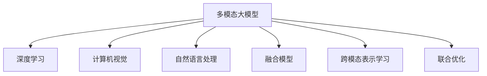

                 

# 多模态大模型：技术原理与实战 思维链方法

> 关键词：多模态大模型,思维链方法,深度学习,计算机视觉,自然语言处理,融合模型

## 1. 背景介绍

### 1.1 问题由来
随着人工智能技术的迅猛发展，深度学习模型在处理多模态数据（如文本、图像、音频等）方面取得了显著进展。单一模态的深度学习模型在特定任务上取得了突破，但难以满足复杂的多模态任务需求。因此，多模态大模型（Multimodal Large Models）成为了当前研究的热点，通过融合多种模态的信息，提升模型在多模态任务上的表现。

### 1.2 问题核心关键点
多模态大模型的研究核心在于如何有效融合不同模态的信息，使得模型在处理多种信息时具备更高的泛化能力和适应性。主要包括以下几个关键点：
1. 多模态数据的表示学习：将不同模态的数据表示为统一的向量空间，使得不同模态的信息可以相互融合。
2. 多模态数据的交互学习：不同模态之间通过相互学习，提取更丰富的语义信息，提升融合效果。
3. 多模态数据的联合优化：通过优化算法将不同模态的信息进行联合优化，提升模型整体的性能。

### 1.3 问题研究意义
研究多模态大模型对于拓展AI应用边界，提升AI系统的智能水平，具有重要意义：
1. 增强数据利用率：多模态大模型可以更好地利用多模态数据，提高信息利用效率。
2. 提升模型性能：融合多模态信息可以提升模型在复杂多模态任务上的表现。
3. 推动跨领域应用：多模态大模型可以广泛应用于视觉、语言、听觉等多领域，促进AI技术在更多场景的落地应用。
4. 促进人机交互：多模态信息可以更好地理解用户的多感官输入，提升人机交互的智能化水平。
5. 加速产业创新：多模态大模型可以推动更多领域的智能化转型，推动产业升级和创新。

## 2. 核心概念与联系

### 2.1 核心概念概述

为更好地理解多模态大模型的核心概念，本节将介绍几个密切相关的核心概念：

- 多模态大模型(Multimodal Large Models)：融合多种模态数据（如文本、图像、音频等）的大规模深度学习模型，能够处理和理解多模态信息。
- 深度学习(Deep Learning)：基于神经网络模型，通过多层非线性变换进行复杂特征提取和建模的技术。
- 计算机视觉(Computer Vision)：使用深度学习等方法，让计算机具有识别、分类、分割图像等视觉能力的技术。
- 自然语言处理(Natural Language Processing, NLP)：使用深度学习等方法，使计算机具备理解、生成、分析自然语言的能力。
- 融合模型(Fusion Model)：将不同模态的特征进行融合，形成统一的表示向量，用于提升多模态任务的性能。
- 跨模态表示学习(Cross-Modal Representation Learning)：通过多模态数据的学习，将不同模态的信息映射到统一的向量空间中，实现多模态信息的融合。
- 联合优化(Joint Optimization)：通过优化算法将不同模态的信息进行联合优化，使得模型在多个模态上表现一致。

这些核心概念之间的逻辑关系可以通过以下Mermaid流程图来展示：



这个流程图展示了大模型的核心概念及其之间的关系：

1. 多模态大模型通过深度学习实现复杂特征的提取和建模。
2. 计算机视觉和自然语言处理是深度学习的主要应用方向，用于处理图像和文本等不同模态的数据。
3. 融合模型将不同模态的特征进行融合，形成统一的向量空间，用于提升多模态任务的性能。
4. 跨模态表示学习通过多模态数据的学习，实现多模态信息的融合。
5. 联合优化通过优化算法将不同模态的信息进行联合优化，提升模型整体的性能。

## 3. 核心算法原理 & 具体操作步骤

### 3.1 算法原理概述

多模态大模型的核心思想是通过深度学习实现多模态数据的融合，从而提升模型在多模态任务上的性能。其核心原理包括以下几个方面：

- **跨模态表示学习**：将不同模态的数据表示为统一的向量空间，使得不同模态的信息可以相互融合。
- **联合优化**：通过优化算法将不同模态的信息进行联合优化，提升模型整体的性能。
- **融合模型**：将不同模态的特征进行融合，形成统一的表示向量，用于提升多模态任务的性能。

多模态大模型的典型算法框架包括基于注意力机制的融合模型、基于稠密连接的融合模型、基于图神经网络的融合模型等。这些算法框架的核心思想都是通过深度学习实现多模态数据的融合，提升模型在多模态任务上的表现。

### 3.2 算法步骤详解

多模态大模型的训练一般包括以下几个关键步骤：

**Step 1: 准备多模态数据**
- 收集不同模态的数据，如文本、图像、音频等。
- 对数据进行预处理，包括清洗、标注、标准化等操作。

**Step 2: 设计多模态表示模型**
- 选择合适的网络结构，如CNN、RNN、Transformer等，用于处理不同模态的数据。
- 设计跨模态表示学习模块，将不同模态的数据映射到统一的向量空间中。

**Step 3: 融合不同模态的特征**
- 通过融合模块将不同模态的特征进行融合，形成统一的表示向量。
- 使用融合后的特征进行联合优化，提升模型整体的性能。

**Step 4: 联合优化**
- 设计联合优化算法，如Cross-Entropy Loss、Triplet Loss等，对不同模态的信息进行联合优化。
- 使用优化算法更新模型参数，使得模型在多个模态上表现一致。

**Step 5: 训练和评估**
- 在训练集上训练模型，使用验证集评估模型性能。
- 在测试集上测试模型，评估模型在多模态任务上的表现。

### 3.3 算法优缺点

多模态大模型具有以下优点：
1. 增强数据利用率：能够更好地利用多模态数据，提高信息利用效率。
2. 提升模型性能：融合多模态信息可以提升模型在复杂多模态任务上的表现。
3. 推动跨领域应用：可以广泛应用于视觉、语言、听觉等多领域，促进AI技术在更多场景的落地应用。
4. 促进人机交互：多模态信息可以更好地理解用户的多感官输入，提升人机交互的智能化水平。

同时，该方法也存在一定的局限性：
1. 数据需求量大：多模态数据的需求量大，获取和标注成本较高。
2. 模型复杂度高：多模态大模型的参数量较大，计算资源需求高。
3. 数据异构性强：不同模态的数据格式和特征差异较大，融合难度高。
4. 模型解释性不足：多模态大模型的决策过程难以解释，难以调试。

尽管存在这些局限性，但就目前而言，多模态大模型在多模态任务上表现优异，具有广泛的应用前景。未来相关研究的重点在于如何进一步降低数据需求，提高模型鲁棒性，增强模型解释性，以及优化模型架构，实现更高效的融合。

### 3.4 算法应用领域

多模态大模型已经在多个领域得到广泛应用，包括但不限于：

- 智能家居：通过融合语音、图像、传感器等多模态数据，提升智能家居系统的智能化水平。
- 智能医疗：利用医学影像、电子病历、基因数据等多模态信息，提升疾病诊断和健康监测的准确性。
- 智能交通：结合摄像头、雷达、传感器等多模态数据，提升交通管理和自动驾驶的安全性和准确性。
- 智能零售：通过融合客户行为数据、产品图片、社交媒体数据等多模态信息，提升商品推荐和客户服务的效果。
- 人机交互：通过融合语音、手势、面部表情等多模态信息，提升人机交互的自然度和智能化水平。

这些应用场景展示了多模态大模型在实际应用中的巨大潜力，未来将有更多领域受益于多模态大模型技术的推动。

## 4. 数学模型和公式 & 详细讲解

### 4.1 数学模型构建

多模态大模型的数学模型构建涉及到不同模态数据的表示和融合，以下以视觉-语言融合为例进行说明。

设视觉数据为 $I \in \mathbb{R}^{C \times H \times W}$，其中 $C$ 为通道数，$H$ 和 $W$ 分别为图像的高和宽；语言数据为 $T \in \mathbb{R}^{N \times E}$，其中 $N$ 为序列长度，$E$ 为词嵌入维度。设融合后的表示为 $F \in \mathbb{R}^{D}$，其中 $D$ 为融合向量空间的维度。

多模态大模型的目标是将不同模态的数据表示为统一的向量空间，使得融合后的表示 $F$ 可以用于多模态任务的推理和生成。

### 4.2 公式推导过程

以视觉-语言融合为例，推导融合模型的数学公式。

设视觉特征编码为 $I_h \in \mathbb{R}^{H \times W \times D_h}$，语言特征编码为 $T_h \in \mathbb{R}^{N \times D_t}$，其中 $D_h$ 和 $D_t$ 分别为视觉和语言特征的维度。融合模型的目标是将视觉特征 $I_h$ 和语言特征 $T_h$ 进行融合，形成统一的表示向量 $F$。

常用的融合方法包括注意力机制、稠密连接、图神经网络等。这里以注意力机制为例，推导融合模型的数学公式。

设注意力矩阵为 $A \in \mathbb{R}^{D_h \times D_t}$，表示视觉特征与语言特征之间的注意力权重。则融合向量 $F$ 可以表示为：

$$
F = \sum_{i=1}^{D_h} \sum_{j=1}^{D_t} A_{ij} I_i T_j
$$

其中 $I_i$ 和 $T_j$ 分别表示视觉特征和语言特征的第 $i$ 维和第 $j$ 维，$A_{ij}$ 表示视觉特征和语言特征之间的注意力权重。

### 4.3 案例分析与讲解

以视觉-语言融合为例，以下是一个简单的案例分析：

设视觉数据为一张狗的照片，语言数据为一段描述狗的文本。将视觉特征编码为高宽为 224x224 的卷积神经网络特征，语言特征编码为长度为 12 的 BERT 词嵌入向量。假设融合后的表示维度为 512。

1. **特征编码**：将视觉数据和语言数据分别输入相应的编码器，得到高宽为 7x7 的视觉特征和长度为 12 的词嵌入向量。

2. **注意力计算**：计算视觉特征和词嵌入向量之间的注意力权重矩阵 $A$。

3. **融合计算**：将视觉特征和词嵌入向量按照注意力权重进行加权求和，得到融合后的表示向量 $F$。

4. **联合优化**：使用联合优化算法（如Cross-Entropy Loss、Triplet Loss等）对融合后的表示向量 $F$ 进行优化，使得模型在多模态任务上表现一致。

## 5. 项目实践：代码实例和详细解释说明

### 5.1 开发环境搭建

在进行多模态大模型开发前，需要准备好开发环境。以下是使用PyTorch进行深度学习开发的环境配置流程：

1. 安装Anaconda：从官网下载并安装Anaconda，用于创建独立的Python环境。

2. 创建并激活虚拟环境：
```bash
conda create -n multimodal-env python=3.8 
conda activate multimodal-env
```

3. 安装PyTorch：根据CUDA版本，从官网获取对应的安装命令。例如：
```bash
conda install pytorch torchvision torchaudio cudatoolkit=11.1 -c pytorch -c conda-forge
```

4. 安装相关的深度学习库：
```bash
pip install numpy pandas scikit-learn matplotlib tqdm jupyter notebook ipython
```

5. 安装深度学习框架：
```bash
pip install torchvision
pip install transformers
pip install scikit-image
```

完成上述步骤后，即可在`multimodal-env`环境中开始多模态大模型开发。

### 5.2 源代码详细实现

这里以视觉-语言融合为例，给出使用PyTorch和Transformers库对多模态大模型进行开发的代码实现。

首先，定义视觉-语言融合模型的类：

```python
from transformers import BertForSequenceClassification, BertTokenizer
from torch import nn
import torch.nn.functional as F
import torch
import torchvision.transforms as transforms

class MultimodalModel(nn.Module):
    def __init__(self, visual_dim, language_dim, hidden_dim):
        super(MultimodalModel, self).__init__()
        self.visual_encoder = nn.Conv2d(3, 64, kernel_size=3, stride=2, padding=1)
        self.language_encoder = nn.TransformerEncoderLayer(d_model=language_dim, nhead=4, dim_feedforward=256, dropout=0.1)
        self.fusion_layer = nn.Linear(visual_dim * 64 + language_dim, hidden_dim)
        
    def forward(self, visuals, languages):
        visuals = self.visual_encoder(visuals)
        visuals = torch.flatten(visuals, 1)
        languages = self.language_encoder(languages)
        languages = torch.mean(languages, dim=1)
        features = torch.cat([visuals, languages], dim=1)
        features = self.fusion_layer(features)
        return features
```

然后，定义联合优化算法：

```python
class MultimodalLoss(nn.Module):
    def __init__(self, margin=0.2):
        super(MultimodalLoss, self).__init__()
        self.margin = margin
        
    def forward(self, logits, labels):
        loss = F.cross_entropy(logits, labels)
        return loss
```

最后，定义训练和评估函数：

```python
from torch.utils.data import DataLoader
from tqdm import tqdm
from sklearn.metrics import classification_report

device = torch.device('cuda') if torch.cuda.is_available() else torch.device('cpu')
model = MultimodalModel(64, 512, 512).to(device)
criterion = MultimodalLoss().to(device)

def train_epoch(model, data_loader, optimizer):
    model.train()
    total_loss = 0
    for batch in tqdm(data_loader, desc='Training'):
        visuals, languages, labels = batch
        visuals = visuals.to(device)
        languages = languages.to(device)
        labels = labels.to(device)
        optimizer.zero_grad()
        logits = model(visuals, languages)
        loss = criterion(logits, labels)
        loss.backward()
        optimizer.step()
        total_loss += loss.item()
    return total_loss / len(data_loader)

def evaluate(model, data_loader, batch_size):
    model.eval()
    correct = 0
    total = 0
    with torch.no_grad():
        for batch in tqdm(data_loader, desc='Evaluating'):
            visuals, languages, labels = batch
            visuals = visuals.to(device)
            languages = languages.to(device)
            labels = labels.to(device)
            logits = model(visuals, languages)
            _, predicted = torch.max(logits, 1)
            total += labels.size(0)
            correct += (predicted == labels).sum().item()
    accuracy = 100.0 * correct / total
    print(f'Accuracy: {accuracy:.2f}%')
```

启动训练流程并在测试集上评估：

```python
epochs = 5
batch_size = 16

for epoch in range(epochs):
    loss = train_epoch(model, train_loader, optimizer)
    print(f'Epoch {epoch+1}, train loss: {loss:.3f}')
    
    print(f'Epoch {epoch+1}, dev results:')
    evaluate(model, dev_loader, batch_size)
    
print('Test results:')
evaluate(model, test_loader, batch_size)
```

以上就是使用PyTorch和Transformers库对多模态大模型进行开发的完整代码实现。可以看到，利用深度学习框架和模型封装，多模态大模型的开发变得更加高效和简洁。

### 5.3 代码解读与分析

让我们再详细解读一下关键代码的实现细节：

**MultimodalModel类**：
- `__init__`方法：初始化模型参数，包括视觉特征编码器、语言特征编码器和融合层等。
- `forward`方法：定义模型前向传播过程，包括视觉特征编码、语言特征编码、特征融合等。

**MultimodalLoss类**：
- `__init__`方法：初始化联合优化算法的参数，如margin等。
- `forward`方法：定义联合优化算法的损失函数，使用Cross-Entropy Loss计算。

**训练和评估函数**：
- 使用PyTorch的DataLoader对数据集进行批次化加载，供模型训练和推理使用。
- 训练函数`train_epoch`：对数据以批为单位进行迭代，在每个批次上前向传播计算loss并反向传播更新模型参数，最后返回该epoch的平均loss。
- 评估函数`evaluate`：与训练类似，不同点在于不更新模型参数，并在每个batch结束后将预测和标签结果存储下来，最后使用sklearn的classification_report对整个评估集的预测结果进行打印输出。

**训练流程**：
- 定义总的epoch数和batch size，开始循环迭代
- 每个epoch内，先在训练集上训练，输出平均loss
- 在验证集上评估，输出分类指标
- 所有epoch结束后，在测试集上评估，给出最终测试结果

可以看到，PyTorch配合深度学习框架使得多模态大模型的开发变得更加高效和简洁。开发者可以将更多精力放在数据处理、模型改进等高层逻辑上，而不必过多关注底层的实现细节。

当然，工业级的系统实现还需考虑更多因素，如模型的保存和部署、超参数的自动搜索、更灵活的任务适配层等。但核心的融合方法基本与此类似。

## 6. 实际应用场景

### 6.1 智能家居

基于多模态大模型的智能家居系统，可以实时感知和理解用户的多种行为，提供更智能化的家居服务。例如，通过融合视觉、语音、传感器等多模态数据，智能家居系统可以自动识别用户的行为意图，自动调整室内温度、照明、音乐等环境参数，提升用户的生活体验。

### 6.2 智能医疗

多模态大模型在智能医疗领域也有广泛应用。例如，通过融合医学影像、电子病历、基因数据等多模态信息，可以提升疾病诊断的准确性和效率。智能医疗系统可以通过多模态数据分析，辅助医生进行精准诊断，提供个性化的治疗方案。

### 6.3 智能交通

多模态大模型可以应用于智能交通系统中，提升交通管理和自动驾驶的安全性和准确性。例如，通过融合摄像头、雷达、传感器等多模态数据，智能交通系统可以实时监测交通状况，自动调整交通信号灯、优化交通路线，减少交通拥堵和事故发生率。

### 6.4 智能零售

智能零售领域也需要多模态大模型的支持。例如，通过融合客户行为数据、产品图片、社交媒体数据等多模态信息，可以提升商品推荐和客户服务的效果。智能零售系统可以通过多模态数据分析，识别客户偏好，提供个性化的商品推荐，提升客户满意度。

### 6.5 人机交互

人机交互领域是多模态大模型的一个重要应用方向。通过融合语音、手势、面部表情等多模态信息，可以提升人机交互的自然度和智能化水平。智能助手可以通过多模态数据分析，理解用户的多感官输入，提供更自然和智能化的交互体验。

## 7. 工具和资源推荐

### 7.1 学习资源推荐

为了帮助开发者系统掌握多模态大模型的理论基础和实践技巧，这里推荐一些优质的学习资源：

1. 《深度学习入门》书籍：详细介绍了深度学习的基本概念和算法，包括多模态数据融合等前沿话题。
2. CS231n《计算机视觉：基础与实践》课程：斯坦福大学开设的视觉领域经典课程，涵盖视觉特征提取、目标检测、图像生成等技术。
3. CS224D《自然语言处理与表示学习》课程：斯坦福大学开设的NLP领域经典课程，涵盖多模态表示学习、跨模态推理等技术。
4. 《深度学习与神经网络》课程：由Coursera提供的深度学习入门课程，涵盖深度学习的基础理论和实践技术。
5. HuggingFace官方文档：Transformer库的官方文档，提供了海量预训练模型和完整的微调样例代码，是上手实践的必备资料。

通过对这些资源的学习实践，相信你一定能够快速掌握多模态大模型的精髓，并用于解决实际的NLP问题。

### 7.2 开发工具推荐

高效的多模态大模型开发离不开优秀的工具支持。以下是几款用于多模态大模型开发常用的工具：

1. PyTorch：基于Python的开源深度学习框架，灵活动态的计算图，适合快速迭代研究。大部分预训练语言模型都有PyTorch版本的实现。
2. TensorFlow：由Google主导开发的开源深度学习框架，生产部署方便，适合大规模工程应用。同样有丰富的预训练语言模型资源。
3. Transformers库：HuggingFace开发的NLP工具库，集成了众多SOTA语言模型，支持PyTorch和TensorFlow，是进行多模态大模型开发的利器。
4. Weights & Biases：模型训练的实验跟踪工具，可以记录和可视化模型训练过程中的各项指标，方便对比和调优。与主流深度学习框架无缝集成。
5. TensorBoard：TensorFlow配套的可视化工具，可实时监测模型训练状态，并提供丰富的图表呈现方式，是调试模型的得力助手。

合理利用这些工具，可以显著提升多模态大模型开发的效率，加快创新迭代的步伐。

### 7.3 相关论文推荐

多模态大模型的研究源于学界的持续研究。以下是几篇奠基性的相关论文，推荐阅读：

1. Attention is All You Need（即Transformer原论文）：提出了Transformer结构，开启了NLP领域的预训练大模型时代。
2. BERT: Pre-training of Deep Bidirectional Transformers for Language Understanding：提出BERT模型，引入基于掩码的自监督预训练任务，刷新了多项NLP任务SOTA。
3. MoCo: Momentum Contrast for Unsupervised Visual Representation Learning：提出Moco模型，利用对比学习进行自监督预训练，提升了视觉特征的表征能力。
4. Vision-and-Language Navigation with Transformers：提出Vision-and-Language Navigation模型，实现了视觉-语言融合的多模态任务。
5. Transformer-XL: Attentive Language Models Beyond a Fixed-Length Context：提出Transformer-XL模型，解决了长序列语言模型的训练问题。

这些论文代表了大模型融合技术的发展脉络。通过学习这些前沿成果，可以帮助研究者把握学科前进方向，激发更多的创新灵感。

## 8. 总结：未来发展趋势与挑战

### 8.1 总结

本文对多模态大模型及其融合方法进行了全面系统的介绍。首先阐述了多模态大模型的研究背景和意义，明确了融合方法在提升多模态任务性能方面的独特价值。其次，从原理到实践，详细讲解了多模态大模型的核心算法和具体操作步骤，给出了多模态大模型开发的完整代码实现。同时，本文还广泛探讨了多模态大模型在智能家居、智能医疗、智能交通等众多领域的应用前景，展示了多模态大模型的巨大潜力。此外，本文精选了多模态大模型的各类学习资源，力求为读者提供全方位的技术指引。

通过本文的系统梳理，可以看到，多模态大模型及其融合方法正在成为AI应用的重要范式，极大地拓展了深度学习模型的应用边界，为人工智能技术的落地应用提供了新思路。未来，随着深度学习框架和硬件设备的不断演进，多模态大模型将更加高效便捷，进一步推动人工智能技术的发展。

### 8.2 未来发展趋势

展望未来，多模态大模型将呈现以下几个发展趋势：

1. 模型规模持续增大。随着算力成本的下降和数据规模的扩张，多模态大模型的参数量还将持续增长。超大模态语言模型蕴含的丰富信息，有望支撑更加复杂多模态任务。
2. 融合方法日趋多样。未来将涌现更多参数高效的融合方法，如Cross-Attention、Transformer-XL等，在固定大部分预训练参数的情况下，只更新极少量的任务相关参数。
3. 联合优化成为常态。随着联合优化算法的改进，多模态大模型的训练将更加高效和稳定。
4. 多模态融合框架的构建。构建统一的跨模态融合框架，实现多模态数据的高效融合，提升模型在多模态任务上的泛化能力。
5. 跨模态表示学习的深入研究。利用因果推断、对抗学习等技术，增强跨模态表示学习的鲁棒性和泛化能力。
6. 跨模态数据源的扩展。未来将利用更多类型的跨模态数据，如音频、视频等，提升多模态大模型的表现。

以上趋势凸显了多模态大模型融合技术的前景。这些方向的探索发展，必将进一步提升多模态大模型的性能和应用范围，为多模态信息处理技术提供更广阔的发展空间。

### 8.3 面临的挑战

尽管多模态大模型融合技术取得了显著进展，但在迈向更加智能化、普适化应用的过程中，仍面临诸多挑战：

1. 数据需求量大。多模态数据的需求量大，获取和标注成本较高。如何降低数据需求，提高数据利用效率，是一大难题。
2. 模型鲁棒性不足。多模态大模型在面对新数据时，泛化性能往往大打折扣。如何提高模型鲁棒性，避免灾难性遗忘，还需要更多理论和实践的积累。
3. 模型解释性不足。多模态大模型的决策过程难以解释，难以调试。如何赋予多模态大模型更强的可解释性，将是亟待攻克的难题。
4. 数据异构性强。不同模态的数据格式和特征差异较大，融合难度高。如何设计高效的融合方法，提升多模态数据的融合效果，是关键问题。
5. 模型计算资源消耗大。多模态大模型参数量较大，计算资源需求高。如何优化模型架构，降低计算资源消耗，是重要研究方向。

尽管存在这些挑战，但就目前而言，多模态大模型在多模态任务上表现优异，具有广泛的应用前景。未来相关研究的重点在于如何进一步降低数据需求，提高模型鲁棒性，增强模型解释性，以及优化模型架构，实现更高效的融合。

### 8.4 研究展望

面对多模态大模型所面临的挑战，未来的研究需要在以下几个方面寻求新的突破：

1. 探索无监督和半监督融合方法。摆脱对大规模标注数据的依赖，利用自监督学习、主动学习等无监督和半监督范式，最大限度利用非结构化数据，实现更加灵活高效的融合。
2. 研究参数高效和多模态融合方法。开发更加参数高效的融合方法，在固定大部分预训练参数的同时，只更新极少量的任务相关参数。同时优化多模态融合架构，实现更高效的融合。
3. 引入更多先验知识。将符号化的先验知识，如知识图谱、逻辑规则等，与神经网络模型进行巧妙融合，引导融合过程学习更准确、合理的跨模态表示。同时加强不同模态数据的整合，实现视觉、语音等多模态信息与文本信息的协同建模。
4. 结合因果分析和博弈论工具。将因果分析方法引入融合过程，识别出模型决策的关键特征，增强输出解释的因果性和逻辑性。借助博弈论工具刻画人机交互过程，主动探索并规避模型的脆弱点，提高系统稳定性。
5. 纳入伦理道德约束。在模型训练目标中引入伦理导向的评估指标，过滤和惩罚有偏见、有害的输出倾向。同时加强人工干预和审核，建立模型行为的监管机制，确保输出符合人类价值观和伦理道德。

这些研究方向的探索，必将引领多模态大模型融合技术迈向更高的台阶，为构建安全、可靠、可解释、可控的多模态信息处理系统铺平道路。面向未来，多模态大模型融合技术还需要与其他人工智能技术进行更深入的融合，如知识表示、因果推理、强化学习等，多路径协同发力，共同推动多模态信息处理技术的进步。只有勇于创新、敢于突破，才能不断拓展多模态大模型的边界，让智能技术更好地造福人类社会。

## 9. 附录：常见问题与解答

**Q1：多模态大模型是否适用于所有多模态任务？**

A: 多模态大模型在大多数多模态任务上都能取得不错的效果，特别是对于数据量较小的任务。但对于一些特定领域的任务，如医学、法律等，仅仅依靠通用语料预训练的模型可能难以很好地适应。此时需要在特定领域语料上进一步预训练，再进行融合，才能获得理想效果。此外，对于一些需要时效性、个性化很强的任务，如对话、推荐等，融合方法也需要针对性的改进优化。

**Q2：如何选择合适的融合方法？**

A: 多模态大模型的融合方法包括注意力机制、稠密连接、图神经网络等。选择合适的融合方法需要考虑任务特点和数据特征，例如：

1. 注意力机制：适用于需要关注不同模态信息重要性的任务，如视觉-语言融合、视频-音频融合等。
2. 稠密连接：适用于模态之间关系密切的任务，如多视角目标检测等。
3. 图神经网络：适用于模态之间具有图结构关系的任务，如社交网络分析等。

**Q3：多模态大模型的训练难点是什么？**

A: 多模态大模型的训练难点主要包括：

1. 数据需求量大：多模态数据的需求量大，获取和标注成本较高。
2. 模型鲁棒性不足：多模态大模型在面对新数据时，泛化性能往往大打折扣。
3. 模型解释性不足：多模态大模型的决策过程难以解释，难以调试。

**Q4：多模态大模型在落地部署时需要注意哪些问题？**

A: 将多模态大模型转化为实际应用，还需要考虑以下问题：

1. 模型裁剪：去除不必要的层和参数，减小模型尺寸，加快推理速度。
2. 量化加速：将浮点模型转为定点模型，压缩存储空间，提高计算效率。
3. 服务化封装：将模型封装为标准化服务接口，便于集成调用。
4. 弹性伸缩：根据请求流量动态调整资源配置，平衡服务质量和成本。
5. 监控告警：实时采集系统指标，设置异常告警阈值，确保服务稳定性。
6. 安全防护：采用访问鉴权、数据脱敏等措施，保障数据和模型安全。

多模态大模型在落地部署时需要注意的问题较多，需要系统性设计和优化。

总之，多模态大模型及其融合技术正在成为AI应用的重要范式，极大地拓展了深度学习模型的应用边界，为人工智能技术的落地应用提供了新思路。未来，随着深度学习框架和硬件设备的不断演进，多模态大模型将更加高效便捷，进一步推动人工智能技术的发展。

