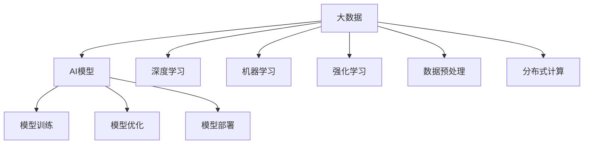

                 

# 大数据对AI学习的重要性

在大数据时代，人工智能（AI）的学习和应用已经成为了推动科技进步和社会发展的关键力量。大数据不仅是AI的重要基础，更是其学习和优化的核心推动力。本文将深入探讨大数据在AI学习中的重要性，并分析其对AI模型的构建、优化和应用的影响。

## 1. 背景介绍

### 1.1 问题由来

随着互联网的快速发展，数据量呈爆炸式增长，大数据技术应运而生。大数据不仅包含了海量的结构化数据，还涵盖了图像、语音、视频等多种非结构化数据。这些数据为AI模型的学习提供了丰富的资源。然而，尽管大数据带来了巨大的机遇，AI模型的学习和应用仍面临着诸多挑战，如数据质量问题、模型训练效率和资源消耗等问题。

### 1.2 问题核心关键点

大数据对AI学习的重要性主要体现在以下几个方面：

- **数据质量**：高质量的数据是AI学习的基础，大数据能够提供更全面、更丰富的数据，但同时也带来了数据质量管理的问题。
- **模型训练效率**：大数据能够显著提升AI模型的训练效率，但同时也需要高效的计算资源和算法。
- **资源消耗**：大数据的存储和处理需要大量的计算和存储资源，这对AI模型的部署和应用带来了挑战。

## 2. 核心概念与联系

### 2.1 核心概念概述

为了更好地理解大数据在AI学习中的重要性，本文将介绍几个密切相关的核心概念：

- **大数据**：指海量、多源、多维度的数据集合。
- **AI模型**：通过学习大数据，构建出的用于特定任务的算法模型。
- **深度学习**：利用神经网络等方法，通过多层结构进行非线性建模的AI技术。
- **机器学习**：基于数据和算法，使机器能够自动学习和改进的AI技术。
- **强化学习**：通过智能体与环境交互，不断优化策略以最大化回报的AI技术。
- **数据预处理**：对原始数据进行清洗、归一化等处理，以提高数据质量。
- **分布式计算**：利用多台计算机协同计算，提升大数据处理的效率。

这些概念之间的逻辑关系可以通过以下Mermaid流程图来展示：



这个流程图展示了大数据与AI模型构建和优化的关系：

1. 大数据提供丰富的学习资源，作为AI模型构建的基础。
2. 深度学习、机器学习和强化学习等技术对大数据进行建模和优化。
3. 数据预处理和分布式计算技术提升大数据处理效率，支持AI模型的训练和优化。
4. 优化后的AI模型部署到实际应用场景中，进一步优化和迭代。

## 3. 核心算法原理 & 具体操作步骤

### 3.1 算法原理概述

基于大数据的AI学习，本质上是一个通过数据驱动的模型构建和优化的过程。其核心思想是：利用大数据中的复杂结构、关联性以及多样性，构建出能够有效学习、理解和应用这些数据的AI模型。

形式化地，假设一个大数据集为 $D=\{(x_i, y_i)\}_{i=1}^N$，其中 $x_i$ 为输入特征，$y_i$ 为对应的输出标签。AI模型的目标是通过训练，学习出最优的映射函数 $f: \mathcal{X} \rightarrow \mathcal{Y}$，使得 $f(x_i) \approx y_i$，其中 $\mathcal{X}$ 为输入空间，$\mathcal{Y}$ 为输出空间。

### 3.2 算法步骤详解

基于大数据的AI学习一般包括以下几个关键步骤：

**Step 1: 数据采集与预处理**
- 收集并整合多源数据，保证数据的多样性和完备性。
- 对数据进行清洗、归一化、缺失值处理等预处理操作，提升数据质量。

**Step 2: 选择模型架构**
- 根据任务特点选择合适的AI模型架构，如神经网络、决策树、随机森林等。
- 对于深度学习模型，选择合适的层数、激活函数、优化器等超参数。

**Step 3: 模型训练**
- 将预处理后的数据划分为训练集、验证集和测试集。
- 使用训练集对模型进行迭代训练，最小化损失函数。
- 周期性在验证集上评估模型性能，防止过拟合。

**Step 4: 模型优化**
- 根据测试集结果，对模型进行调整和优化。
- 使用正则化技术、模型压缩、超参数调优等手段提升模型泛化性能。
- 引入更多的先验知识，如领域知识、规则库等，增强模型解释性。

**Step 5: 模型部署与应用**
- 将优化后的模型部署到实际应用场景中。
- 根据应用需求进行微调，提升模型在特定场景下的性能。
- 持续收集反馈数据，进行模型迭代和更新。

### 3.3 算法优缺点

基于大数据的AI学习具有以下优点：

1. **数据丰富性**：大数据提供了丰富的数据资源，能够支持复杂模型的构建和优化。
2. **泛化能力强**：大数据能够帮助模型学习更普遍的规律和知识，提高模型的泛化性能。
3. **高效优化**：大数据能够利用分布式计算技术，显著提升模型训练和优化效率。
4. **应用广泛**：大数据支持的AI模型可以应用于各种领域，如金融、医疗、交通等。

同时，该方法也存在一定的局限性：

1. **数据质量管理**：大数据中的噪声和错误数据可能对模型学习产生干扰。
2. **资源消耗高**：大数据存储和处理需要大量的计算和存储资源。
3. **隐私与安全**：大数据涉及敏感信息，数据隐私和安全问题需要特别关注。
4. **模型解释性不足**：大数据支持的AI模型往往难以解释其内部工作机制。

尽管存在这些局限性，但就目前而言，基于大数据的AI学习范式仍然是最主流的方法。未来相关研究的重点在于如何进一步提升数据质量管理、降低资源消耗、增强模型解释性和隐私保护等方面。

### 3.4 算法应用领域

基于大数据的AI学习已经在多个领域得到了广泛的应用，包括但不限于：

- **金融风控**：利用大数据对客户行为进行建模，预测违约风险，优化信贷策略。
- **医疗诊断**：通过分析海量医疗数据，辅助医生进行疾病诊断，提高诊疗效率。
- **智能推荐**：利用用户行为数据进行建模，个性化推荐商品、内容等，提升用户体验。
- **智能交通**：利用交通数据进行建模，优化交通信号控制，缓解交通拥堵。
- **自然语言处理**：利用文本数据进行建模，实现文本分类、情感分析、机器翻译等任务。

这些应用展示了大数据在AI学习中的强大潜力和广泛应用前景。

## 4. 数学模型和公式 & 详细讲解 & 举例说明

### 4.1 数学模型构建

本节将使用数学语言对基于大数据的AI学习过程进行更加严格的刻画。

假设一个大数据集为 $D=\{(x_i, y_i)\}_{i=1}^N, x_i \in \mathcal{X}, y_i \in \mathcal{Y}$，其中 $\mathcal{X}$ 为输入空间，$\mathcal{Y}$ 为输出空间。

定义模型 $f: \mathcal{X} \rightarrow \mathcal{Y}$ 在数据样本 $(x,y)$ 上的损失函数为 $\ell(f(x),y)$，则在数据集 $D$ 上的经验风险为：

$$
\mathcal{L}(f) = \frac{1}{N} \sum_{i=1}^N \ell(f(x_i),y_i)
$$

模型的目标是最小化经验风险，即找到最优函数：

$$
f^* = \mathop{\arg\min}_{f} \mathcal{L}(f)
$$

在实践中，我们通常使用基于梯度的优化算法（如SGD、Adam等）来近似求解上述最优化问题。设 $\eta$ 为学习率，则参数的更新公式为：

$$
\theta \leftarrow \theta - \eta \nabla_{\theta}\mathcal{L}(\theta)
$$

其中 $\nabla_{\theta}\mathcal{L}(\theta)$ 为损失函数对参数 $\theta$ 的梯度，可通过反向传播算法高效计算。

### 4.2 公式推导过程

以下我们以分类任务为例，推导交叉熵损失函数及其梯度的计算公式。

假设模型 $f$ 在输入 $x$ 上的输出为 $\hat{y}=f(x) \in [0,1]$，表示样本属于正类的概率。真实标签 $y \in \{0,1\}$。则二分类交叉熵损失函数定义为：

$$
\ell(f(x),y) = -[y\log \hat{y} + (1-y)\log (1-\hat{y})]
$$

将其代入经验风险公式，得：

$$
\mathcal{L}(f) = -\frac{1}{N}\sum_{i=1}^N [y_i\log f(x_i)+(1-y_i)\log(1-f(x_i))]
$$

根据链式法则，损失函数对参数 $\theta_k$ 的梯度为：

$$
\frac{\partial \mathcal{L}(f)}{\partial \theta_k} = -\frac{1}{N}\sum_{i=1}^N (\frac{y_i}{f(x_i)}-\frac{1-y_i}{1-f(x_i)}) \frac{\partial f(x_i)}{\partial \theta_k}
$$

其中 $\frac{\partial f(x_i)}{\partial \theta_k}$ 可进一步递归展开，利用自动微分技术完成计算。

### 4.3 案例分析与讲解

假设我们有一个包含两特征的数据集，用于预测用户的购买行为。特征 $x_1$ 表示用户的年龄，特征 $x_2$ 表示用户的月收入。我们希望构建一个二分类模型，预测用户是否会购买某个商品。

首先，我们将数据集划分为训练集和测试集，对数据进行标准化处理。然后，我们选择一个简单的逻辑回归模型，作为我们的假设函数 $f(x)$。接下来，我们将训练集输入模型，通过反向传播计算梯度，并使用梯度下降算法更新模型参数，直到损失函数达到最小值。

假设我们的模型为 $f(x) = \theta_0 + \theta_1x_1 + \theta_2x_2$，则损失函数为：

$$
\mathcal{L}(\theta) = -\frac{1}{N}\sum_{i=1}^N [y_i\log \sigma(\theta_0 + \theta_1x_{1,i} + \theta_2x_{2,i})+(1-y_i)\log(1-\sigma(\theta_0 + \theta_1x_{1,i} + \theta_2x_{2,i}))]
$$

其中 $\sigma(x) = \frac{1}{1+e^{-x}}$ 为 sigmoid 函数。

通过梯度下降算法，我们更新参数 $\theta_0$、$\theta_1$ 和 $\theta_2$，直到损失函数收敛。最终，我们得到一个用于预测用户购买行为的逻辑回归模型。

## 5. 项目实践：代码实例和详细解释说明

### 5.1 开发环境搭建

在进行AI学习实践前，我们需要准备好开发环境。以下是使用Python进行TensorFlow开发的环境配置流程：

1. 安装Anaconda：从官网下载并安装Anaconda，用于创建独立的Python环境。

2. 创建并激活虚拟环境：
```bash
conda create -n tf-env python=3.8 
conda activate tf-env
```

3. 安装TensorFlow：根据CUDA版本，从官网获取对应的安装命令。例如：
```bash
conda install tensorflow-gpu -c conda-forge -c pytorch -c pytorch -c pypi -c conda-forge
```

4. 安装各类工具包：
```bash
pip install numpy pandas scikit-learn matplotlib tqdm jupyter notebook ipython
```

完成上述步骤后，即可在`tf-env`环境中开始AI学习实践。

### 5.2 源代码详细实现

这里我们以一个简单的逻辑回归模型为例，展示如何使用TensorFlow进行AI学习。

首先，定义数据处理函数：

```python
import tensorflow as tf
import numpy as np

def load_data():
    x_train = np.array([[0, 1], [1, 2], [2, 3], [3, 4], [4, 5]])
    y_train = np.array([0, 0, 1, 1, 1])
    return x_train, y_train

def preprocess_data(x_train, y_train):
    x_train = (x_train - x_train.mean(axis=0)) / x_train.std(axis=0)
    y_train = tf.keras.utils.to_categorical(y_train)
    return x_train, y_train
```

然后，定义模型和优化器：

```python
def create_model(input_dim, output_dim):
    model = tf.keras.models.Sequential([
        tf.keras.layers.Dense(10, activation='relu', input_shape=(input_dim,)),
        tf.keras.layers.Dense(output_dim, activation='sigmoid')
    ])
    return model

x_train, y_train = load_data()
x_train, y_train = preprocess_data(x_train, y_train)

input_dim = x_train.shape[1]
output_dim = y_train.shape[1]
model = create_model(input_dim, output_dim)

optimizer = tf.keras.optimizers.Adam(lr=0.01)
```

接着，定义训练和评估函数：

```python
def train_model(model, x_train, y_train, epochs, batch_size):
    model.compile(optimizer=optimizer, loss='binary_crossentropy', metrics=['accuracy'])
    model.fit(x_train, y_train, epochs=epochs, batch_size=batch_size, validation_split=0.2)

def evaluate_model(model, x_test, y_test):
    loss, accuracy = model.evaluate(x_test, y_test)
    print(f"Loss: {loss:.4f}, Accuracy: {accuracy:.4f}")
```

最后，启动训练流程并在测试集上评估：

```python
epochs = 100
batch_size = 32

x_test, y_test = load_data()
x_test, y_test = preprocess_data(x_test, y_test)

train_model(model, x_train, y_train, epochs, batch_size)
evaluate_model(model, x_test, y_test)
```

以上就是使用TensorFlow进行简单的逻辑回归模型训练的完整代码实现。可以看到，TensorFlow的API设计简洁高效，能够快速实现AI模型训练和评估。

### 5.3 代码解读与分析

让我们再详细解读一下关键代码的实现细节：

**load_data()和preprocess_data()函数**：
- `load_data()`函数用于加载和划分数据集。
- `preprocess_data()`函数用于对数据进行标准化处理和标签编码。

**create_model()函数**：
- `create_model()`函数用于构建逻辑回归模型。该模型包含一个全连接层和一个sigmoid激活函数，用于二分类任务。

**train_model()函数**：
- `train_model()`函数用于模型训练。使用Adam优化器和交叉熵损失函数，对模型进行梯度下降优化。

**evaluate_model()函数**：
- `evaluate_model()`函数用于模型评估。计算模型在测试集上的损失和准确率，并输出结果。

**训练流程**：
- 定义总的epoch数和batch size，开始循环迭代
- 每个epoch内，在训练集上训练模型，输出平均loss和acc
- 在验证集上评估，输出验证集的结果
- 所有epoch结束后，在测试集上评估，输出测试集的结果

可以看到，TensorFlow提供了丰富的API和工具，使得AI模型的构建和训练变得简单易行。利用TensorFlow，开发者可以更加专注于模型设计和优化，而不必过多关注底层实现细节。

当然，工业级的系统实现还需考虑更多因素，如模型的保存和部署、超参数的自动搜索、更灵活的任务适配层等。但核心的AI学习过程基本与此类似。

## 6. 实际应用场景

### 6.1 智能推荐系统

基于大数据的AI学习在智能推荐系统中得到了广泛应用。推荐系统通过分析用户行为数据，为用户推荐个性化商品或内容。在推荐系统中，大数据提供了丰富的用户行为数据，能够支持复杂模型的构建和优化。

在实践中，我们收集用户的浏览记录、购买记录、评分数据等，使用这些数据对推荐模型进行训练和优化。微调后的推荐模型能够根据用户的历史行为，预测其可能感兴趣的商品或内容，实现个性化推荐。

### 6.2 金融风险预测

金融领域对大数据的应用尤为重视。通过分析海量金融数据，可以预测客户的违约风险，优化信贷策略，降低金融风险。

在金融风险预测中，我们收集客户的信用记录、收入水平、消费行为等数据，使用这些数据对模型进行训练和优化。微调后的模型能够根据客户的特征，预测其违约概率，辅助银行和金融机构做出决策。

### 6.3 医疗诊断

医疗领域的数据量巨大，包括患者的病历、实验室检测结果、影像数据等。通过分析这些数据，可以帮助医生进行疾病诊断，提高诊疗效率。

在医疗诊断中，我们使用病人的病历和检查结果对模型进行训练和优化。微调后的模型能够根据病人的症状和病史，预测可能的疾病类型，辅助医生进行诊断和治疗。

### 6.4 未来应用展望

随着大数据技术的不断进步，基于大数据的AI学习将有更广阔的应用前景。未来，大数据支持的AI模型将在更多领域得到应用，如智慧城市、智能交通、智能制造等，为各行各业带来新的发展机遇。

## 7. 工具和资源推荐

### 7.1 学习资源推荐

为了帮助开发者系统掌握大数据在AI学习中的应用，这里推荐一些优质的学习资源：

1. 《深度学习》书籍：Ian Goodfellow、Yoshua Bengio和Aaron Courville合著的经典教材，详细介绍了深度学习的基本原理和应用。

2. TensorFlow官方文档：TensorFlow的官方文档，提供了丰富的教程和样例代码，是学习TensorFlow的最佳资源。

3. PyTorch官方文档：PyTorch的官方文档，提供了详细的API介绍和教程，是学习PyTorch的必备资料。

4. Kaggle：数据科学和机器学习竞赛平台，提供大量开源数据集和竞赛任务，有助于实际应用能力的提升。

5. Coursera和Udacity等在线课程：提供深度学习和AI相关课程，覆盖从入门到高级的各种主题。

通过对这些资源的学习实践，相信你一定能够快速掌握大数据在AI学习中的应用，并用于解决实际的AI问题。

### 7.2 开发工具推荐

高效的开发离不开优秀的工具支持。以下是几款用于AI学习开发的常用工具：

1. TensorFlow：由Google主导开发的开源深度学习框架，生产部署方便，适合大规模工程应用。

2. PyTorch：基于Python的开源深度学习框架，灵活易用，适合快速迭代研究。

3. Keras：高级神经网络API，易于上手，能够快速实现各种神经网络模型。

4. Scikit-learn：Python机器学习库，提供了多种常用的机器学习算法和工具。

5. Jupyter Notebook：交互式的Python编程环境，支持代码编写和数据可视化，非常适合科学研究。

合理利用这些工具，可以显著提升AI模型的开发效率，加快创新迭代的步伐。

### 7.3 相关论文推荐

大数据在AI学习中的应用一直是学界的热点研究领域，以下是几篇奠基性的相关论文，推荐阅读：

1. Deep Learning: A Tutorial by Yann LeCun, Yoshua Bengio and Geoffrey Hinton（深度学习教程）：深度学习领域的经典教程，介绍了深度学习的基本原理和应用。

2. TensorFlow: A Systematic Guide by Rajat Monga和Jurgen Schmid.de（TensorFlow系统性指南）：TensorFlow的权威指南，涵盖了TensorFlow的各个方面，包括API使用、优化技巧等。

3. PyTorch: An Overview by Guido R. Ott（PyTorch概述）：PyTorch的详细介绍，涵盖了PyTorch的基本原理和应用。

4. Keras: An Overview by Florian Ruder（Keras概述）：Keras的详细介绍，介绍了Keras的API设计和使用方法。

5. Scikit-learn: An Overview by Aurélien Géron（Scikit-learn概述）：Scikit-learn的详细介绍，介绍了Scikit-learn的算法和工具。

这些论文代表了大数据在AI学习领域的最新研究进展，有助于深入理解大数据对AI模型的影响和应用。

## 8. 总结：未来发展趋势与挑战

### 8.1 总结

本文对基于大数据的AI学习进行了全面系统的介绍。首先阐述了大数据在AI学习中的重要性，明确了大数据提供的丰富数据资源和高效计算能力，是AI模型构建和优化的关键基础。其次，从原理到实践，详细讲解了大数据支持的AI模型构建和优化过程，给出了AI模型训练和评估的完整代码实现。同时，本文还广泛探讨了大数据支持的AI模型在多个行业领域的应用前景，展示了大数据在AI学习中的强大潜力和广泛应用前景。

通过本文的系统梳理，可以看到，基于大数据的AI学习技术正在成为推动AI应用发展的重要力量。大数据支持的AI模型能够充分利用数据的丰富性和多样性，提升模型的泛化性能和应用效率，为各行各业带来了新的发展机遇。未来，随着大数据技术的不断进步和AI模型的不断发展，大数据在AI学习中的应用将更加广泛，推动AI技术在更多领域落地应用。

### 8.2 未来发展趋势

展望未来，基于大数据的AI学习技术将呈现以下几个发展趋势：

1. **数据质量管理**：随着数据量的增加，数据质量管理将变得尤为重要。未来将出现更多数据清洗、数据增强等技术，进一步提升数据质量。

2. **分布式计算**：分布式计算将是大数据处理的核心技术。未来的AI模型将进一步利用分布式计算技术，提升模型训练和优化的效率。

3. **模型压缩**：随着数据量的增加，模型的存储和计算需求将不断提升。未来的AI模型将采用更多模型压缩技术，如剪枝、量化等，提升模型的计算效率。

4. **隐私与安全**：数据隐私和安全问题将愈发重要。未来将出现更多数据隐私保护技术和方法，确保数据的安全性和隐私性。

5. **模型解释性**：未来的AI模型将更加注重模型的解释性，增强模型的可解释性和可控性。

6. **多模态学习**：未来的AI模型将更加注重多模态学习，利用多种数据源进行协同建模，提升模型的泛化性能。

以上趋势凸显了大数据在AI学习中的重要地位，这些方向的探索发展，将进一步提升AI模型的性能和应用范围，为各行各业带来新的发展机遇。

### 8.3 面临的挑战

尽管基于大数据的AI学习技术已经取得了显著进展，但仍面临诸多挑战：

1. **数据质量管理**：大数据中的噪声和错误数据可能对模型学习产生干扰，数据质量管理需要进一步提升。

2. **资源消耗高**：大数据存储和处理需要大量的计算和存储资源，资源消耗问题需要进一步解决。

3. **模型解释性不足**：大数据支持的AI模型往往难以解释其内部工作机制，模型的可解释性和可控性需要进一步增强。

4. **隐私与安全**：数据隐私和安全问题需要特别关注，如何确保数据的安全性和隐私性，是一个重要的研究方向。

5. **计算效率低**：大数据支持的AI模型计算效率较低，需要进一步提升计算效率和优化模型结构。

6. **模型泛化性能不足**：大数据支持的AI模型往往难以应对新数据和新任务，泛化性能需要进一步提升。

这些挑战将推动大数据在AI学习领域的进一步发展，推动AI技术在更多领域落地应用。

### 8.4 研究展望

未来，大数据在AI学习领域的研究方向将包括以下几个方面：

1. **数据质量管理**：开发更多数据清洗、数据增强等技术，提升数据质量。

2. **分布式计算**：进一步利用分布式计算技术，提升模型训练和优化的效率。

3. **模型压缩**：采用更多模型压缩技术，如剪枝、量化等，提升模型的计算效率。

4. **隐私与安全**：开发更多数据隐私保护技术和方法，确保数据的安全性和隐私性。

5. **模型解释性**：增强模型的可解释性和可控性，增强模型的解释性和可控性。

6. **多模态学习**：利用多种数据源进行协同建模，提升模型的泛化性能。

通过这些研究方向的研究和探索，将进一步提升基于大数据的AI学习技术的性能和应用范围，推动AI技术在更多领域落地应用。

## 9. 附录：常见问题与解答

**Q1：大数据对AI学习的影响主要体现在哪些方面？**

A: 大数据对AI学习的影响主要体现在以下几个方面：

1. **数据质量管理**：大数据提供了丰富的数据资源，但也带来了数据质量管理的问题。数据清洗、数据增强等技术可以提升数据质量。

2. **模型训练效率**：大数据能够显著提升AI模型的训练效率，但同时也需要高效的计算资源和算法。分布式计算和模型压缩等技术可以提升计算效率。

3. **资源消耗**：大数据存储和处理需要大量的计算和存储资源，资源消耗问题需要进一步解决。

4. **模型泛化性能**：大数据支持的AI模型能够提升模型的泛化性能，但也可能面临过拟合问题。正则化、对抗训练等技术可以提升模型的泛化性能。

5. **隐私与安全**：数据隐私和安全问题需要特别关注，开发更多数据隐私保护技术和方法。

6. **模型解释性**：大数据支持的AI模型往往难以解释其内部工作机制，需要进一步增强模型的可解释性和可控性。

**Q2：如何有效地进行数据质量管理？**

A: 数据质量管理是保证AI模型性能的关键。以下是一些有效的数据质量管理方法：

1. **数据清洗**：对数据进行去重、去噪、填补缺失值等处理，提升数据质量。

2. **数据增强**：通过数据增强技术，如数据扩充、数据合成等，提升数据的多样性和丰富性。

3. **异常检测**：利用异常检测技术，发现和处理异常数据点。

4. **数据标注**：对数据进行标注，确保标注数据的准确性和一致性。

5. **数据校验**：通过数据校验技术，检测数据中的错误和异常。

6. **数据融合**：利用数据融合技术，将多源数据进行整合和协同分析，提升数据的质量和价值。

通过这些方法，可以有效地进行数据质量管理，提升AI模型的性能和可靠性。

**Q3：如何进行分布式计算？**

A: 分布式计算是处理大数据的核心技术。以下是一些常用的分布式计算框架和方法：

1. **Apache Hadoop**：Apache Hadoop是一个分布式计算框架，用于处理大规模数据。它包括Hadoop分布式文件系统(HDFS)和MapReduce计算模型。

2. **Apache Spark**：Apache Spark是一个快速、通用的大数据处理引擎，支持多种编程语言和数据处理框架。

3. **Apache Flink**：Apache Flink是一个流处理框架，支持高吞吐量的数据流处理和批处理。

4. **TensorFlow**：TensorFlow支持分布式计算，可以在多个计算节点上进行模型训练和优化。

5. **PyTorch**：PyTorch支持分布式计算，可以在多个计算节点上进行模型训练和优化。

通过这些分布式计算框架和方法，可以高效地处理大规模数据，提升AI模型的训练和优化效率。

**Q4：如何提升AI模型的计算效率？**

A: 提升AI模型的计算效率是优化AI模型性能的重要手段。以下是一些常用的方法：

1. **模型压缩**：通过剪枝、量化等方法，减少模型参数和计算量。

2. **混合精度训练**：使用混合精度训练技术，降低计算精度，提升计算效率。

3. **分布式计算**：利用分布式计算技术，将计算任务分布到多个计算节点上进行并行计算。

4. **模型并行**：采用模型并行技术，将模型分解成多个子模型，并行计算，提升计算效率。

5. **硬件加速**：利用GPU、TPU等硬件加速技术，提升计算速度和效率。

通过这些方法，可以显著提升AI模型的计算效率，优化AI模型的性能。

**Q5：如何提升AI模型的泛化性能？**

A: 提升AI模型的泛化性能是优化AI模型性能的重要目标。以下是一些常用的方法：

1. **数据增强**：通过数据增强技术，如数据扩充、数据合成等，提升数据的多样性和丰富性，减少过拟合风险。

2. **正则化**：使用L2正则、Dropout等技术，防止模型过拟合，提升模型泛化性能。

3. **对抗训练**：通过对抗训练技术，提高模型对对抗样本的鲁棒性，提升模型泛化性能。

4. **模型融合**：通过模型融合技术，将多个模型的预测结果进行融合，提升模型的泛化性能。

5. **迁移学习**：通过迁移学习技术，将一个领域学到的知识迁移到另一个领域，提升模型泛化性能。

通过这些方法，可以显著提升AI模型的泛化性能，增强模型在实际应用中的鲁棒性和可靠性。

**Q6：如何增强AI模型的可解释性？**

A: 增强AI模型的可解释性是优化AI模型性能的重要目标。以下是一些常用的方法：

1. **特征重要性分析**：通过特征重要性分析，了解模型中各个特征的重要性，增强模型的可解释性。

2. **模型可视化**：通过模型可视化技术，展示模型的内部工作机制，增强模型的可解释性。

3. **可解释性算法**：使用可解释性算法，如LIME、SHAP等，解释模型的预测结果。

4. **规则库**：引入规则库，将符号化的先验知识与模型结合，增强模型的可解释性和可控性。

5. **数据可视化**：通过数据可视化技术，展示数据特征和分布，增强模型的可解释性。

通过这些方法，可以显著增强AI模型的可解释性，提升模型的可解释性和可控性。

**Q7：如何确保数据隐私和安全？**

A: 确保数据隐私和安全是优化AI模型性能的重要目标。以下是一些常用的方法：

1. **数据脱敏**：通过数据脱敏技术，去除敏感信息，保护数据隐私。

2. **差分隐私**：通过差分隐私技术，保护个体隐私，确保数据匿名性。

3. **加密存储**：使用加密技术，对数据进行加密存储，保护数据安全。

4. **访问控制**：通过访问控制技术，限制数据的访问权限，保护数据安全。

5. **安全计算**：使用安全计算技术，如多方计算、同态加密等，确保数据安全。

通过这些方法，可以显著确保数据隐私和安全，提升AI模型在实际应用中的安全性和可靠性。

---

作者：禅与计算机程序设计艺术 / Zen and the Art of Computer Programming

