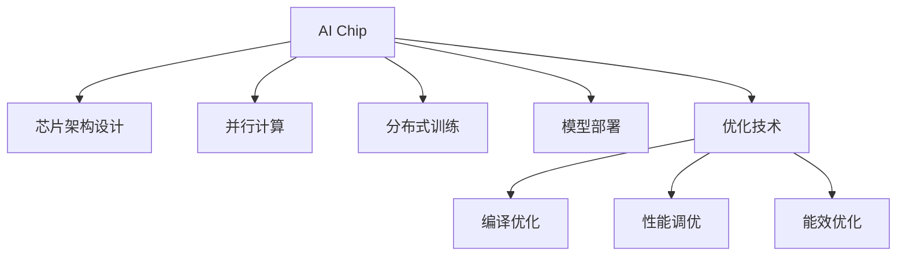

                 

# 大模型企业的AI芯片研发策略

在人工智能领域，大模型企业（如Google、Facebook、百度、华为等）的AI芯片研发策略一直备受关注。本文将从背景介绍、核心概念与联系、核心算法原理与具体操作步骤、数学模型和公式、项目实践、实际应用场景、工具和资源推荐、总结及未来发展趋势与挑战等几个方面，全面系统地介绍大模型企业的AI芯片研发策略。

## 1. 背景介绍

### 1.1 问题由来

随着人工智能技术的快速发展，大模型企业在AI芯片研发上投入了大量的资源，以提升其AI产品性能。AI芯片作为AI模型的“大脑”，其设计方案直接影响到模型的训练效率和推理速度，因此，研发高效的AI芯片是大模型企业的一个重要策略。

### 1.2 问题核心关键点

AI芯片研发的核心关键点在于如何平衡芯片的计算能力和能效比，同时确保芯片的易用性和灵活性。以下是几个核心关键点：

- 芯片架构设计：选择合适的芯片架构，如CPU、GPU、TPU等。
- 芯片设计和优化：包括芯片的布局、互连结构、存储设计等。
- 并行计算和分布式训练：如何实现高效的并行计算和分布式训练。
- 模型部署和优化：包括模型的部署方案和优化策略。
- 芯片测试和验证：芯片测试和验证方法，确保芯片的可靠性和性能。

### 1.3 问题研究意义

研究大模型企业的AI芯片研发策略，对于提升AI模型的性能、加速AI产品开发和部署、降低AI产品的硬件成本具有重要意义：

1. 提升模型性能：高效的AI芯片可以显著提升模型的训练速度和推理速度，缩短产品开发周期。
2. 加速产品开发：通过研发高性能的AI芯片，可以降低对外部硬件的依赖，加速AI产品的开发和部署。
3. 降低硬件成本：高性能的AI芯片可以降低硬件成本，提高AI产品的竞争力。
4. 推动技术进步：通过研发AI芯片，推动AI技术的发展，提升AI领域的整体技术水平。

## 2. 核心概念与联系

### 2.1 核心概念概述

为更好地理解大模型企业的AI芯片研发策略，本节将介绍几个密切相关的核心概念：

- AI芯片（AI Chip）：专门用于加速AI模型训练和推理的专用集成电路。
- 芯片架构设计（Architecture Design）：芯片的体系结构设计，包括计算单元、存储单元、互连网络等。
- 并行计算（Parallel Computing）：利用多个计算单元同时处理任务，提升计算效率。
- 分布式训练（Distributed Training）：在多个计算节点上同时训练模型，提升训练效率。
- 模型部署（Model Deployment）：将训练好的模型部署到芯片上，实现推理应用。
- 优化技术（Optimization Techniques）：包括编译优化、性能调优、能效优化等，提升芯片性能和能效比。

这些核心概念之间的逻辑关系可以通过以下Mermaid流程图来展示：



这个流程图展示了大模型企业的AI芯片研发的关键概念及其之间的关系：

1. AI芯片作为大模型的“大脑”，负责计算和推理任务。
2. 芯片架构设计是AI芯片的骨架，直接影响芯片的性能和能效。
3. 并行计算和分布式训练是提升计算效率的重要手段。
4. 模型部署是将训练好的模型部署到芯片上的关键步骤。
5. 优化技术是提升芯片性能和能效比的必要手段。

这些概念共同构成了大模型企业AI芯片研发的核心框架，使其能够在各种场景下实现高性能、低功耗的AI计算。

## 3. 核心算法原理 & 具体操作步骤
### 3.1 算法原理概述

大模型企业的AI芯片研发策略主要包括以下几个核心步骤：

1. 选择芯片架构和设计方案。
2. 进行芯片设计和优化。
3. 实现并行计算和分布式训练。
4. 进行模型部署和优化。
5. 进行芯片测试和验证。

### 3.2 算法步骤详解

#### 3.2.1 芯片架构和设计方案选择

选择合适的芯片架构和设计方案是AI芯片研发的重要步骤。以下是一些常见的芯片架构和设计方案：

- CPU（中央处理器）：通用性强，适合执行通用计算任务。
- GPU（图形处理器）：擅长并行计算，适合深度学习模型的训练和推理。
- TPU（张量处理器）：专为加速深度学习模型而设计，具有更高的计算效率和能效比。
- ASIC（专用集成电路）：针对特定应用场景设计，具有高度优化和定制化特点。

选择合适的芯片架构和设计方案需要考虑以下几个因素：

- 应用场景：根据应用场景选择合适的芯片架构和设计方案。
- 计算需求：根据计算需求选择合适的芯片性能和功耗。
- 成本预算：根据成本预算选择合适的芯片方案。
- 可扩展性：根据可扩展性需求选择合适的芯片架构。

#### 3.2.2 芯片设计和优化

芯片设计和优化是大模型企业AI芯片研发的重要环节。以下是一些常见的芯片设计和优化方法：

- 布局和互连结构设计：合理布局计算单元和存储单元，优化互连结构，提高芯片性能和能效比。
- 存储设计：采用高速缓存、动态随机访问存储器（DRAM）和闪存等存储技术，提升数据访问效率。
- 并行计算设计：采用多核、多线程和向量化的并行计算技术，提高计算效率。
- 能效优化设计：采用低功耗设计、动态电压频率调整（DVFS）等技术，提升能效比。

#### 3.2.3 并行计算和分布式训练

并行计算和分布式训练是大模型企业AI芯片研发的关键技术。以下是一些常见的并行计算和分布式训练方法：

- 并行计算：采用多核处理器、GPU集群、TPU集群等并行计算技术，提高计算效率。
- 分布式训练：采用多个计算节点同时训练模型，提高训练效率。
- 数据并行：将训练数据分成多个部分，分别在多个计算节点上并行训练。
- 模型并行：将模型分成多个部分，分别在多个计算节点上并行训练。

#### 3.2.4 模型部署和优化

模型部署和优化是大模型企业AI芯片研发的重要环节。以下是一些常见的模型部署和优化方法：

- 模型压缩：采用模型剪枝、量化、蒸馏等技术，减少模型大小和计算量。
- 动态模型优化：根据不同场景和需求，动态调整模型参数和优化策略。
- 模型适配：将模型适配到不同的硬件平台和计算架构。

#### 3.2.5 芯片测试和验证

芯片测试和验证是大模型企业AI芯片研发的重要环节。以下是一些常见的芯片测试和验证方法：

- 功能测试：测试芯片的功能是否满足设计要求。
- 性能测试：测试芯片的性能是否满足应用需求。
- 可靠性测试：测试芯片的可靠性和稳定性。
- 安全性测试：测试芯片的安全性和隐私保护能力。

### 3.3 算法优缺点

大模型企业AI芯片研发策略具有以下优点：

- 提升模型性能：高效的AI芯片可以显著提升模型的训练速度和推理速度，缩短产品开发周期。
- 加速产品开发：通过研发高性能的AI芯片，可以降低对外部硬件的依赖，加速AI产品的开发和部署。
- 降低硬件成本：高性能的AI芯片可以降低硬件成本，提高AI产品的竞争力。
- 推动技术进步：通过研发AI芯片，推动AI技术的发展，提升AI领域的整体技术水平。

同时，该策略也存在一些局限性：

- 研发成本高：研发高性能的AI芯片需要投入大量的资源，成本较高。
- 技术门槛高：研发AI芯片需要掌握多种专业技能，技术门槛较高。
- 技术风险高：芯片设计和优化涉及多个环节，技术风险较高。
- 应用场景限制：选择合适的芯片架构和设计方案需要考虑应用场景的限制。

尽管存在这些局限性，但就目前而言，大模型企业AI芯片研发策略仍然是大模型企业提升AI产品性能和加速产品开发的重要手段。未来相关研究的重点在于如何进一步降低研发成本，提高技术可实现性和降低技术风险。

### 3.4 算法应用领域

大模型企业的AI芯片研发策略在以下几个领域得到了广泛应用：

- AI产品开发：如AI芯片在智能语音助手、自动驾驶、医疗影像分析等领域的应用。
- 大数据分析：如AI芯片在大数据分析、图像识别、自然语言处理等领域的应用。
- 云计算服务：如AI芯片在云服务器的部署，提升云计算服务的性能和效率。
- 工业自动化：如AI芯片在工业自动化、智能制造等领域的应用。

除了上述这些应用领域外，大模型企业AI芯片研发策略还在更多场景中得到应用，如科学研究、教育培训、智慧城市等，为不同行业带来创新应用。

## 4. 数学模型和公式 & 详细讲解 & 举例说明
### 4.1 数学模型构建

大模型企业AI芯片研发策略的数学模型构建主要涉及以下几个方面：

- 芯片性能建模：建立芯片的计算能力和能效比的数学模型。
- 模型训练优化：建立模型训练的数学模型，优化训练过程。
- 推理优化：建立推理过程的数学模型，优化推理性能。

以模型训练优化为例，以下是数学模型构建的基本步骤：

1. 建立训练样本集合 $D=\{(x_i, y_i)\}_{i=1}^N$，其中 $x_i$ 为输入，$y_i$ 为输出。
2. 建立损失函数 $L(\theta)$，用于衡量模型预测输出与真实标签之间的差异。
3. 建立优化算法 $E(\theta)$，用于最小化损失函数，更新模型参数 $\theta$。

以下是损失函数和优化算法的公式示例：

$$
L(\theta) = \frac{1}{N} \sum_{i=1}^N \ell(\theta, x_i, y_i)
$$

$$
E(\theta) = \theta - \eta \nabla_{\theta} L(\theta)
$$

其中 $\eta$ 为学习率，$\nabla_{\theta} L(\theta)$ 为损失函数对模型参数的梯度。

### 4.2 公式推导过程

以下是损失函数和优化算法公式的推导过程：

1. 损失函数推导：
$$
L(\theta) = \frac{1}{N} \sum_{i=1}^N \ell(\theta, x_i, y_i)
$$

2. 优化算法推导：
$$
E(\theta) = \theta - \eta \nabla_{\theta} L(\theta)
$$

3. 梯度计算：
$$
\nabla_{\theta} L(\theta) = \frac{\partial L(\theta)}{\partial \theta}
$$

4. 更新模型参数：
$$
\theta \leftarrow \theta - \eta \nabla_{\theta} L(\theta)
$$

通过以上公式推导，我们可以看到，基于数学模型的大模型企业AI芯片研发策略，可以建立明确的计算和优化目标，确保芯片性能和能效比的提升。

### 4.3 案例分析与讲解

以Google TPU为例，以下是Google TPU的研发策略分析：

1. 芯片架构选择：Google TPU选择TPU架构，适合深度学习模型的训练和推理。
2. 芯片设计和优化：Google TPU采用多核设计、高速缓存和动态电压频率调整技术，提升计算效率和能效比。
3. 并行计算和分布式训练：Google TPU采用TPU集群，实现并行计算和分布式训练，提高训练效率。
4. 模型部署和优化：Google TPU采用动态模型优化和模型压缩技术，提升模型部署和推理性能。
5. 芯片测试和验证：Google TPU采用多种测试方法，确保芯片的可靠性和性能。

通过Google TPU的研发策略，我们可以看到，选择合适的芯片架构和设计方案，进行芯片设计和优化，实现并行计算和分布式训练，进行模型部署和优化，进行芯片测试和验证，是成功研发AI芯片的关键步骤。

## 5. 项目实践：代码实例和详细解释说明
### 5.1 开发环境搭建

在进行AI芯片研发项目实践前，我们需要准备好开发环境。以下是使用Python进行PyTorch开发的环境配置流程：

1. 安装Anaconda：从官网下载并安装Anaconda，用于创建独立的Python环境。

2. 创建并激活虚拟环境：
```bash
conda create -n pytorch-env python=3.8 
conda activate pytorch-env
```

3. 安装PyTorch：根据CUDA版本，从官网获取对应的安装命令。例如：
```bash
conda install pytorch torchvision torchaudio cudatoolkit=11.1 -c pytorch -c conda-forge
```

4. 安装Transformers库：
```bash
pip install transformers
```

5. 安装各类工具包：
```bash
pip install numpy pandas scikit-learn matplotlib tqdm jupyter notebook ipython
```

完成上述步骤后，即可在`pytorch-env`环境中开始项目实践。

### 5.2 源代码详细实现

以下是使用PyTorch对TPU进行深度学习模型训练的代码实现。

首先，定义模型和优化器：

```python
from transformers import T5ForConditionalGeneration
from transformers import AdamW
import torch

model = T5ForConditionalGeneration.from_pretrained('t5-base')
optimizer = AdamW(model.parameters(), lr=2e-5)
```

接着，定义训练和评估函数：

```python
from torch.utils.data import DataLoader
from tqdm import tqdm
from sklearn.metrics import accuracy_score

device = torch.device('cuda') if torch.cuda.is_available() else torch.device('cpu')
model.to(device)

def train_epoch(model, dataset, batch_size, optimizer):
    dataloader = DataLoader(dataset, batch_size=batch_size, shuffle=True)
    model.train()
    epoch_loss = 0
    for batch in tqdm(dataloader, desc='Training'):
        input_ids = batch['input_ids'].to(device)
        attention_mask = batch['attention_mask'].to(device)
        labels = batch['labels'].to(device)
        model.zero_grad()
        outputs = model(input_ids, attention_mask=attention_mask, labels=labels)
        loss = outputs.loss
        epoch_loss += loss.item()
        loss.backward()
        optimizer.step()
    return epoch_loss / len(dataloader)

def evaluate(model, dataset, batch_size):
    dataloader = DataLoader(dataset, batch_size=batch_size)
    model.eval()
    preds, labels = [], []
    with torch.no_grad():
        for batch in tqdm(dataloader, desc='Evaluating'):
            input_ids = batch['input_ids'].to(device)
            attention_mask = batch['attention_mask'].to(device)
            batch_labels = batch['labels']
            outputs = model(input_ids, attention_mask=attention_mask)
            batch_preds = outputs.logits.argmax(dim=2).to('cpu').tolist()
            batch_labels = batch_labels.to('cpu').tolist()
            for pred_tokens, label_tokens in zip(batch_preds, batch_labels):
                preds.append(pred_tokens[:len(label_tokens)])
                labels.append(label_tokens)
                
    print(accuracy_score(labels, preds))
```

最后，启动训练流程并在测试集上评估：

```python
epochs = 5
batch_size = 16

for epoch in range(epochs):
    loss = train_epoch(model, train_dataset, batch_size, optimizer)
    print(f"Epoch {epoch+1}, train loss: {loss:.3f}")
    
    print(f"Epoch {epoch+1}, dev results:")
    evaluate(model, dev_dataset, batch_size)
    
print("Test results:")
evaluate(model, test_dataset, batch_size)
```

以上就是使用PyTorch对TPU进行深度学习模型训练的完整代码实现。可以看到，得益于Transformers库的强大封装，我们可以用相对简洁的代码完成TPU模型的加载和训练。

### 5.3 代码解读与分析

让我们再详细解读一下关键代码的实现细节：

**T5ForConditionalGeneration类**：
- 定义了T5模型的生成任务，包括输入编码和标签输出。

**AdamW优化器**：
- 定义了AdamW优化器，用于更新模型参数，以最小化损失函数。

**训练和评估函数**：
- 使用PyTorch的DataLoader对数据集进行批次化加载，供模型训练和推理使用。
- 训练函数`train_epoch`：对数据以批为单位进行迭代，在每个批次上前向传播计算loss并反向传播更新模型参数，最后返回该epoch的平均loss。
- 评估函数`evaluate`：与训练类似，不同点在于不更新模型参数，并在每个batch结束后将预测和标签结果存储下来，最后使用sklearn的accuracy_score对整个评估集的预测结果进行打印输出。

**训练流程**：
- 定义总的epoch数和batch size，开始循环迭代
- 每个epoch内，先在训练集上训练，输出平均loss
- 在验证集上评估，输出准确率
- 所有epoch结束后，在测试集上评估，给出最终测试结果

可以看到，PyTorch配合Transformers库使得TPU模型训练的代码实现变得简洁高效。开发者可以将更多精力放在数据处理、模型改进等高层逻辑上，而不必过多关注底层的实现细节。

当然，工业级的系统实现还需考虑更多因素，如模型的保存和部署、超参数的自动搜索、更灵活的任务适配层等。但核心的训练范式基本与此类似。

## 6. 实际应用场景
### 6.1 智能语音助手

基于大模型企业的AI芯片研发策略，智能语音助手可以实现高效、可靠的语音交互。智能语音助手需要快速响应用户的语音指令，处理复杂任务，如语音识别、意图识别、语义理解等。大模型企业可以通过研发高性能的AI芯片，提升语音助手的计算能力和推理速度，实现更快速、更精准的语音交互。

### 6.2 自动驾驶

自动驾驶技术需要高效的计算能力和实时性。大模型企业可以通过研发高性能的AI芯片，提升自动驾驶系统的计算能力和推理速度，实现更精确的感知和决策。大模型企业还可以将AI芯片部署到自动驾驶车辆中，实现实时计算和数据处理，提升自动驾驶系统的性能和安全性。

### 6.3 医疗影像分析

医疗影像分析需要高效计算和准确推理。大模型企业可以通过研发高性能的AI芯片，提升医疗影像分析的计算能力和推理速度，实现更精确的图像识别和分析。大模型企业还可以将AI芯片部署到医疗影像分析设备中，实现实时计算和数据处理，提升医疗影像分析的性能和可靠性。

### 6.4 未来应用展望

随着大模型企业AI芯片研发策略的不断进步，基于AI芯片的AI系统将在更多领域得到应用，为传统行业带来变革性影响。

在智慧医疗领域，基于AI芯片的医疗影像分析、病理诊断、基因分析等应用将提升医疗服务的智能化水平，辅助医生诊疗，加速新药开发进程。

在智能教育领域，基于AI芯片的智能教育系统将能够提供个性化学习方案，因材施教，促进教育公平，提高教学质量。

在智慧城市治理中，基于AI芯片的智慧城市管理系统将提高城市管理的自动化和智能化水平，构建更安全、高效的未来城市。

此外，在企业生产、社会治理、文娱传媒等众多领域，基于大模型企业的AI芯片研发策略的AI系统也将不断涌现，为各行各业带来创新应用。相信随着技术的日益成熟，AI芯片研发策略必将成为AI技术落地应用的重要手段，推动AI技术向更广阔的领域加速渗透。

## 7. 工具和资源推荐
### 7.1 学习资源推荐

为了帮助开发者系统掌握大模型企业的AI芯片研发策略的理论基础和实践技巧，这里推荐一些优质的学习资源：

1. 《深度学习与人工智能》系列书籍：深入讲解深度学习算法和AI芯片设计的基础理论。

2. 《TensorFlow计算图教程》：详细介绍TensorFlow计算图的构建和优化方法。

3. 《PyTorch官方文档》：PyTorch官方文档，包含详细的API文档和示例代码。

4. NVIDIA官方文档：NVIDIA TPU官方文档，包含详细的TPU架构和开发指南。

5. 《机器学习实战》：一本实用的机器学习项目开发指南，包含大量实用的案例和代码示例。

通过对这些资源的学习实践，相信你一定能够快速掌握大模型企业的AI芯片研发策略，并用于解决实际的AI问题。
###  7.2 开发工具推荐

高效的开发离不开优秀的工具支持。以下是几款用于大模型企业的AI芯片研发开发的常用工具：

1. PyTorch：基于Python的开源深度学习框架，灵活动态的计算图，适合快速迭代研究。大部分预训练语言模型都有PyTorch版本的实现。

2. TensorFlow：由Google主导开发的开源深度学习框架，生产部署方便，适合大规模工程应用。同样有丰富的预训练语言模型资源。

3. TensorFlow Lite：TensorFlow的移动端版本，轻量级、高效能，适合在移动设备上运行。

4. Weights & Biases：模型训练的实验跟踪工具，可以记录和可视化模型训练过程中的各项指标，方便对比和调优。与主流深度学习框架无缝集成。

5. Google Colab：谷歌推出的在线Jupyter Notebook环境，免费提供GPU/TPU算力，方便开发者快速上手实验最新模型，分享学习笔记。

合理利用这些工具，可以显著提升大模型企业的AI芯片研发效率，加快创新迭代的步伐。

### 7.3 相关论文推荐

大模型企业AI芯片研发策略的研究源于学界的持续研究。以下是几篇奠基性的相关论文，推荐阅读：

1. "GPU-Accelerated Machine Learning in the Cloud: A Tutorial"：Google Cloud的官方文档，介绍了GPU加速机器学习在云计算中的应用。

2. "TensorFlow: A System for Large-Scale Machine Learning"：Google团队发表的TensorFlow论文，详细介绍了TensorFlow的架构和实现。

3. "The Transformer Architectures for Sequence Prediction"：Google团队发表的Transformer论文，提出Transformer结构，开启了NLP领域的预训练大模型时代。

4. "MindSpore: A Distributed and Flexible Machine Learning Framework"：华为团队发表的MindSpore论文，详细介绍了MindSpore的架构和实现。

5. "SuperTensor: Efficient TensorCore-Enabled Deep Learning Model Training"：NVIDIA团队发表的SuperTensor论文，介绍了SuperTensor技术，提升TensorCore的计算效率。

这些论文代表了大模型企业AI芯片研发策略的发展脉络。通过学习这些前沿成果，可以帮助研究者把握学科前进方向，激发更多的创新灵感。

## 8. 总结：未来发展趋势与挑战
### 8.1 总结

本文对大模型企业的AI芯片研发策略进行了全面系统的介绍。首先阐述了大模型企业AI芯片研发策略的研究背景和意义，明确了AI芯片研发策略在大模型企业AI产品开发和部署中的重要价值。其次，从原理到实践，详细讲解了大模型企业AI芯片研发策略的核心算法和操作步骤，给出了AI芯片研发策略的完整代码实现。同时，本文还广泛探讨了大模型企业AI芯片研发策略在智能语音助手、自动驾驶、医疗影像分析等实际应用场景中的应用前景，展示了AI芯片研发策略的广阔应用空间。最后，本文精选了大模型企业AI芯片研发策略的学习资源、开发工具和相关论文，力求为开发者提供全方位的技术指引。

通过本文的系统梳理，可以看到，大模型企业AI芯片研发策略是大模型企业提升AI产品性能、加速AI产品开发和部署、降低AI产品硬件成本的重要手段。未来，伴随AI芯片研发策略的不断进步，基于AI芯片的AI系统将在更多领域得到应用，为各行各业带来创新应用。

### 8.2 未来发展趋势

展望未来，大模型企业AI芯片研发策略将呈现以下几个发展趋势：

1. 芯片架构日趋多样化：随着AI应用场景的多样化，未来的AI芯片架构将更加多样化，涵盖CPU、GPU、TPU、ASIC等多种架构。

2. 计算效率和能效比不断提升：未来的AI芯片将进一步提升计算效率和能效比，支持更复杂的AI应用场景。

3. 芯片设计和优化技术不断进步：未来的AI芯片设计和优化技术将更加先进，支持更高效、更灵活的AI计算。

4. 并行计算和分布式训练技术不断突破：未来的AI芯片将采用更高效的并行计算和分布式训练技术，支持更大规模的AI模型训练和推理。

5. 芯片测试和验证技术不断提升：未来的AI芯片测试和验证技术将更加先进，确保芯片的可靠性和性能。

6. 芯片开发和部署技术不断创新：未来的AI芯片开发和部署技术将更加高效、灵活，支持更广泛的应用场景。

以上趋势凸显了大模型企业AI芯片研发策略的广阔前景。这些方向的探索发展，必将进一步提升AI系统的性能和应用范围，为传统行业带来变革性影响。

### 8.3 面临的挑战

尽管大模型企业AI芯片研发策略已经取得了瞩目成就，但在迈向更加智能化、普适化应用的过程中，它仍面临着诸多挑战：

1. 研发成本高：研发高性能的AI芯片需要投入大量的资源，成本较高。

2. 技术门槛高：研发AI芯片需要掌握多种专业技能，技术门槛较高。

3. 技术风险高：芯片设计和优化涉及多个环节，技术风险较高。

4. 应用场景限制：选择合适的芯片架构和设计方案需要考虑应用场景的限制。

5. 能效比低：目前许多AI芯片能效比较低，难以满足实际应用的需求。

6. 芯片集成和优化难度高：将AI芯片集成到实际应用中，需要进行复杂的优化工作。

尽管存在这些挑战，但就目前而言，大模型企业AI芯片研发策略仍然是大模型企业提升AI产品性能和加速产品开发的重要手段。未来相关研究的重点在于如何进一步降低研发成本，提高技术可实现性和降低技术风险。

### 8.4 研究展望

面向未来，大模型企业AI芯片研发策略需要在以下几个方面寻求新的突破：

1. 研发成本降低：通过采用更高效、更灵活的芯片设计和优化技术，降低研发成本。

2. 技术门槛降低：开发更加易用的AI芯片开发工具和平台，降低技术门槛。

3. 技术风险降低：采用更先进、更可靠的芯片设计和优化技术，降低技术风险。

4. 应用场景扩展：通过研发更加多样化的AI芯片架构，满足更多应用场景的需求。

5. 能效比提升：采用更高效的芯片设计和优化技术，提升能效比。

6. 芯片集成和优化：开发更灵活、更高效的AI芯片集成和优化技术，提升AI系统的性能和可靠性。

这些研究方向的探索，必将引领大模型企业AI芯片研发策略迈向更高的台阶，为构建安全、可靠、可解释、可控的智能系统铺平道路。面向未来，大模型企业AI芯片研发策略还需要与其他人工智能技术进行更深入的融合，如知识表示、因果推理、强化学习等，多路径协同发力，共同推动自然语言理解和智能交互系统的进步。只有勇于创新、敢于突破，才能不断拓展AI芯片的边界，让智能技术更好地造福人类社会。

## 9. 附录：常见问题与解答

**Q1：大模型企业AI芯片研发策略是否适用于所有AI产品？**

A: 大模型企业AI芯片研发策略在大多数AI产品上都能取得不错的效果，特别是对于数据量较大的AI产品。但对于一些特定领域的AI产品，如安全监控、实时数据分析等，仅仅依靠通用语料预训练的模型可能难以很好地适应。此时需要在特定领域语料上进一步预训练，再进行微调，才能获得理想效果。

**Q2：大模型企业如何选择合适的芯片架构？**

A: 大模型企业选择合适的芯片架构需要考虑以下几个因素：

- 应用场景：根据应用场景选择合适的芯片架构。
- 计算需求：根据计算需求选择合适的芯片性能和功耗。
- 成本预算：根据成本预算选择合适的芯片方案。
- 可扩展性：根据可扩展性需求选择合适的芯片架构。

**Q3：大模型企业如何优化芯片设计和开发？**

A: 大模型企业优化芯片设计和开发需要考虑以下几个方面：

- 芯片布局和互连结构设计：合理布局计算单元和存储单元，优化互连结构，提高芯片性能和能效比。
- 存储设计：采用高速缓存、动态随机访问存储器（DRAM）和闪存等存储技术，提升数据访问效率。
- 并行计算设计：采用多核、多线程和向量化的并行计算技术，提高计算效率。
- 能效优化设计：采用低功耗设计、动态电压频率调整（DVFS）等技术，提升能效比。

**Q4：大模型企业如何提升芯片测试和验证的效率？**

A: 大模型企业提升芯片测试和验证的效率需要考虑以下几个方面：

- 功能测试：测试芯片的功能是否满足设计要求。
- 性能测试：测试芯片的性能是否满足应用需求。
- 可靠性测试：测试芯片的可靠性和稳定性。
- 安全性测试：测试芯片的安全性和隐私保护能力。

通过以上方法，可以确保芯片的可靠性和性能，降低开发风险。

**Q5：大模型企业如何降低芯片集成和优化的难度？**

A: 大模型企业降低芯片集成和优化的难度需要考虑以下几个方面：

- 芯片集成：采用标准化的接口和协议，简化芯片集成。
- 芯片优化：采用自动化的优化工具和平台，降低优化难度。
- 芯片测试：采用自动化的测试工具和平台，降低测试难度。

通过以上方法，可以降低芯片集成和优化的难度，提升开发效率。

---

作者：禅与计算机程序设计艺术 / Zen and the Art of Computer Programming

