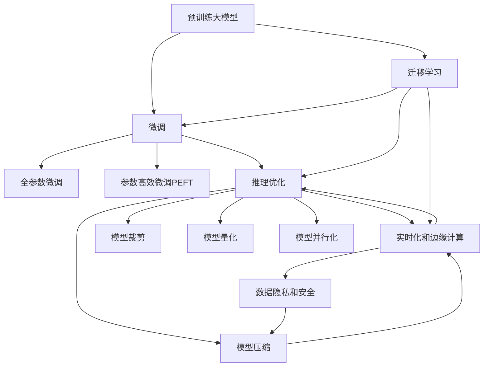

                 

## 1. 背景介绍

### 1.1 问题由来
近年来，随着深度学习技术的快速发展，人工智能（AI）技术在多个领域取得了显著进展，尤其是在自然语言处理（NLP）、计算机视觉、语音识别等领域，表现出色。然而，这些技术在实际应用中，仍面临诸多挑战，如数据获取成本高、模型训练时间长、推理效率低等问题，严重制约了AI技术的规模化和商业化进程。

与此同时，预训练大模型（如BERT、GPT-3、T5等）的出现，使得大规模模型的训练和部署变得更加便捷，其强大的语言理解能力和生成能力为AI技术的落地应用提供了新的可能性。因此，如何加速预训练大模型在实际应用中的落地和商业化，成为当前AI技术发展的重要课题。

### 1.2 问题核心关键点
预训练大模型落地和商业化的问题，核心在于如何在大规模模型训练的基础上，将其转化为具备实际应用价值的产品。这需要考虑以下关键点：

- **模型压缩和裁剪**：大模型的参数量庞大，推理效率低，需要考虑如何优化模型结构，压缩模型尺寸。
- **推理优化**：在大规模数据集上训练的大模型，推理时间较长，如何提高推理速度是关键。
- **实时化和边缘计算**：如何在小规模设备或边缘计算环境中，部署大模型并保持其性能，是实现商业化部署的重要挑战。
- **模型的迁移学习和泛化能力**：大模型需要具备在不同数据集和任务上的迁移学习能力，以适应多样化的应用场景。
- **数据隐私和安全**：在商业化应用中，如何保护用户数据隐私，防止数据泄露和滥用，是伦理和法律的重要考量。

### 1.3 问题研究意义
加速大模型应用落地和商业化进程，对推动AI技术的普及应用具有重要意义：

- **降低技术门槛**：简化模型训练和部署流程，降低技术门槛，使更多开发者和公司能够快速应用AI技术。
- **提升用户体验**：通过优化模型性能，提升应用响应速度和稳定性，提高用户满意度。
- **拓展应用场景**：模型压缩和推理优化，使得AI技术能够覆盖更广泛的应用场景，满足不同行业的需求。
- **推动产业发展**：加速AI技术商业化，促进相关产业的创新和转型升级，创造更多的经济价值。
- **推动学术研究**：商业化应用的需求，将推动更多创新研究和技术突破，推动AI技术的不断演进。

## 2. 核心概念与联系

### 2.1 核心概念概述

为更好地理解如何加速大模型应用落地和商业化，本节将介绍几个密切相关的核心概念：

- **预训练大模型**：以自回归（如GPT）或自编码（如BERT）模型为代表的大规模预训练语言模型。通过在大规模无标签文本数据上进行预训练，学习通用的语言知识。
- **微调（Fine-tuning）**：在预训练模型的基础上，使用下游任务的少量标注数据，通过有监督学习优化模型在特定任务上的性能。通常只需要调整顶层分类器或解码器，并以较小的学习率更新全部或部分的模型参数。
- **迁移学习（Transfer Learning）**：指将一个领域学习到的知识，迁移应用到另一个不同但相关的领域的学习范式。大模型的预训练-微调过程即是一种典型的迁移学习方式。
- **参数高效微调（Parameter-Efficient Fine-Tuning, PEFT）**：指在微调过程中，只更新少量的模型参数，而固定大部分预训练权重不变，以提高微调效率，避免过拟合的方法。
- **推理优化（Inference Optimization）**：通过模型压缩、量化、并行化等技术，提高大模型的推理速度和效率，以便在实际应用中快速响应请求。
- **实时化和边缘计算（Real-time and Edge Computing）**：通过优化模型结构和推理过程，使大模型能够在边缘计算设备和实时环境中高效运行。
- **模型裁剪（Model Pruning）**：通过修剪模型中的冗余参数，减少模型大小，提高推理速度和效率。
- **模型量化（Model Quantization）**：通过将模型参数从浮点类型转换为定点类型，压缩模型尺寸，加速推理过程。
- **模型并行化（Model Parallelism）**：通过模型划分和分布式计算，提高大模型的训练和推理效率。

这些核心概念之间的逻辑关系可以通过以下Mermaid流程图来展示：



这个流程图展示了大模型应用的各个关键环节及其相互关系：

1. 预训练大模型通过自监督学习任务获得通用语言知识。
2. 微调是模型适配特定任务的过程，可以采用全参数微调和参数高效微调。
3. 推理优化通过模型压缩、量化等技术提高模型效率。
4. 实时化和边缘计算使模型能够在实时和边缘设备上运行。
5. 模型裁剪和并行化进一步优化模型结构和计算过程。
6. 数据隐私和安全是模型应用过程中必须考虑的重要因素。

这些概念共同构成了大模型应用的完整框架，使得大模型能够高效、安全地在实际应用中落地。

## 3. 核心算法原理 & 具体操作步骤

### 3.1 算法原理概述

大模型应用落地的关键在于如何在大规模模型训练的基础上，将其转化为具备实际应用价值的产品。这涉及到模型的压缩、裁剪、推理优化等多个环节。本文将从这些角度深入探讨大模型的应用落地技术。

预训练大模型通过自监督学习任务获得通用语言知识，具有强大的语言理解和生成能力。然而，由于其参数量庞大，推理效率低，需要考虑如何优化模型结构，压缩模型尺寸，以适应实际应用的需求。

### 3.2 算法步骤详解

大模型应用落地的核心算法步骤包括以下几个关键环节：

**Step 1: 模型压缩和裁剪**

模型压缩和裁剪是优化模型尺寸和推理速度的重要手段。常见的模型压缩技术包括：

- **权重裁剪**：通过修剪模型中的冗余参数，减少模型大小，提高推理速度。常用的裁剪方法包括L1、L2正则化、Dropout等。
- **通道裁剪**：在卷积神经网络中，通过减少卷积核数量或通道数，减少模型尺寸。
- **块裁剪**：将模型分割为多个块，每个块独立进行训练和推理，减少计算复杂度。

**Step 2: 模型量化**

模型量化是通过将模型参数从浮点类型转换为定点类型，减少模型尺寸和计算量，加速推理过程。量化方法包括：

- **权重量化**：将模型权重转换为定点类型，减少存储空间和计算量。
- **激活量量化**：将模型的激活值转换为定点类型，进一步压缩模型尺寸。

**Step 3: 模型并行化**

模型并行化通过将模型划分和分布式计算，提高大模型的训练和推理效率。常用的并行化方法包括：

- **模型并行**：将模型分割为多个子模型，并行训练和推理。
- **数据并行**：将训练数据分割为多个批次，并行处理。
- **混合并行**：结合模型并行和数据并行，进一步提高效率。

**Step 4: 推理优化**

推理优化通过优化模型结构和推理过程，提高大模型的推理速度和效率。常用的优化方法包括：

- **推理加速**：通过模型压缩和量化技术，提高推理速度。
- **硬件加速**：利用GPU、TPU等硬件加速设备，提升计算能力。
- **内存优化**：优化内存访问模式，减少计算延迟。

**Step 5: 实时化和边缘计算**

实时化和边缘计算使模型能够在实时和边缘设备上运行。常用的方法包括：

- **模型裁剪**：在目标设备上运行时，只保留需要的部分模型，减少计算量。
- **模型分割**：将大模型分割为多个子模型，分别部署在边缘设备上，减少通信开销。
- **分布式推理**：通过分布式计算，提高模型推理效率。

**Step 6: 数据隐私和安全**

数据隐私和安全是大模型应用过程中必须考虑的重要因素。常用的方法包括：

- **差分隐私**：通过添加噪声，保护用户隐私。
- **联邦学习**：在分布式环境中，保护数据隐私，同时进行模型训练。
- **加密计算**：在模型推理过程中，保护用户数据。

以上是优化大模型应用落地的关键步骤和技术手段。通过这些技术手段，可以大大提高模型的推理效率，降低资源消耗，同时保证模型在不同环境中的稳定性和安全性。

### 3.3 算法优缺点

大模型应用落地的优势包括：

1. **提升应用响应速度**：通过优化模型结构和推理过程，大大提高模型的推理速度，降低延迟。
2. **降低计算成本**：通过模型压缩和量化，减少模型尺寸和计算量，降低计算成本。
3. **提高应用效率**：通过模型并行化和边缘计算，使模型能够在实时和边缘设备上高效运行。
4. **保护数据隐私**：通过差分隐私、联邦学习等技术，保护用户数据隐私和安全。

然而，大模型应用落地也存在一些缺点：

1. **技术复杂度高**：模型压缩和优化需要深入理解和应用多种技术手段，技术门槛较高。
2. **性能保证难度大**：优化过程中需要综合考虑模型性能、推理速度和稳定性等多个因素，复杂度较高。
3. **硬件需求高**：优化过程需要高性能的计算设备，硬件资源投入较大。

尽管存在这些缺点，但通过合理的优化策略和工程实践，可以有效地解决这些问题，使大模型应用落地变得可行和高效。

### 3.4 算法应用领域

大模型应用落地技术在多个领域得到了广泛应用，包括但不限于：

- **智能客服**：通过优化模型推理速度，使智能客服系统能够快速响应用户请求，提升用户体验。
- **智能推荐**：通过模型压缩和优化，使推荐系统能够在大规模数据集上高效运行，提升推荐准确性。
- **医疗诊断**：通过优化模型推理速度和稳定性，使医疗诊断系统能够在实时环境中准确地生成诊断结果。
- **金融分析**：通过模型量化和推理优化，使金融分析系统能够在实时环境中快速处理大量数据，提供准确的分析结果。
- **自动驾驶**：通过优化模型推理速度和实时性，使自动驾驶系统能够在复杂环境中快速响应，提高安全性。

除了上述这些经典应用外，大模型应用落地技术还在更多场景中得到创新性应用，如智能制造、智慧城市、智能家居等，为各行各业带来了新的变革。

## 4. 数学模型和公式 & 详细讲解

### 4.1 数学模型构建

本节将使用数学语言对大模型应用落地的关键技术进行更加严格的刻画。

记预训练大模型为 $M_{\theta}$，其中 $\theta$ 为预训练得到的模型参数。假设目标任务为 $T$，其标注数据集为 $D=\{(x_i,y_i)\}_{i=1}^N, x_i \in \mathcal{X}, y_i \in \mathcal{Y}$。

定义模型 $M_{\theta}$ 在数据样本 $(x,y)$ 上的损失函数为 $\ell(M_{\theta}(x),y)$，则在数据集 $D$ 上的经验风险为：

$$
\mathcal{L}(\theta) = \frac{1}{N} \sum_{i=1}^N \ell(M_{\theta}(x_i),y_i)
$$

大模型应用落地的优化目标是最小化经验风险，即找到最优参数：

$$
\theta^* = \mathop{\arg\min}_{\theta} \mathcal{L}(\theta)
$$

在实践中，我们通常使用基于梯度的优化算法（如SGD、Adam等）来近似求解上述最优化问题。设 $\eta$ 为学习率，$\lambda$ 为正则化系数，则参数的更新公式为：

$$
\theta \leftarrow \theta - \eta \nabla_{\theta}\mathcal{L}(\theta) - \eta\lambda\theta
$$

其中 $\nabla_{\theta}\mathcal{L}(\theta)$ 为损失函数对参数 $\theta$ 的梯度，可通过反向传播算法高效计算。

### 4.2 公式推导过程

以下我们以二分类任务为例，推导交叉熵损失函数及其梯度的计算公式。

假设模型 $M_{\theta}$ 在输入 $x$ 上的输出为 $\hat{y}=M_{\theta}(x) \in [0,1]$，表示样本属于正类的概率。真实标签 $y \in \{0,1\}$。则二分类交叉熵损失函数定义为：

$$
\ell(M_{\theta}(x),y) = -[y\log \hat{y} + (1-y)\log (1-\hat{y})]
$$

将其代入经验风险公式，得：

$$
\mathcal{L}(\theta) = -\frac{1}{N}\sum_{i=1}^N [y_i\log M_{\theta}(x_i)+(1-y_i)\log(1-M_{\theta}(x_i))]
$$

根据链式法则，损失函数对参数 $\theta_k$ 的梯度为：

$$
\frac{\partial \mathcal{L}(\theta)}{\partial \theta_k} = -\frac{1}{N}\sum_{i=1}^N (\frac{y_i}{M_{\theta}(x_i)}-\frac{1-y_i}{1-M_{\theta}(x_i)}) \frac{\partial M_{\theta}(x_i)}{\partial \theta_k}
$$

其中 $\frac{\partial M_{\theta}(x_i)}{\partial \theta_k}$ 可进一步递归展开，利用自动微分技术完成计算。

在得到损失函数的梯度后，即可带入参数更新公式，完成模型的迭代优化。重复上述过程直至收敛，最终得到适应下游任务的最优模型参数 $\theta^*$。

## 5. 项目实践：代码实例和详细解释说明

### 5.1 开发环境搭建

在进行大模型应用落地实践前，我们需要准备好开发环境。以下是使用Python进行TensorFlow开发的环境配置流程：

1. 安装Anaconda：从官网下载并安装Anaconda，用于创建独立的Python环境。

2. 创建并激活虚拟环境：
```bash
conda create -n tf-env python=3.8 
conda activate tf-env
```

3. 安装TensorFlow：根据CUDA版本，从官网获取对应的安装命令。例如：
```bash
conda install tensorflow==2.6
```

4. 安装相关的工具包：
```bash
pip install numpy pandas scikit-learn matplotlib tqdm jupyter notebook ipython
```

完成上述步骤后，即可在`tf-env`环境中开始大模型应用落地的实践。

### 5.2 源代码详细实现

这里我们以智能推荐系统为例，给出使用TensorFlow对BERT模型进行推理优化的PyTorch代码实现。

首先，定义推荐系统的数据处理函数：

```python
from transformers import BertTokenizer, TFBertModel

tokenizer = BertTokenizer.from_pretrained('bert-base-cased')
model = TFBertModel.from_pretrained('bert-base-cased', from_pt=True)

def encode(text):
    input_ids = tokenizer(text, return_tensors='tf')
    return input_ids.input_ids, input_ids.attention_mask
```

然后，定义推荐模型的推理函数：

```python
@tf.function
def recommend(items, text):
    with tf.GradientTape() as tape:
        input_ids, mask = encode(text)
        outputs = model(input_ids, attention_mask=mask)
        logits = outputs.logits.numpy()
    return logits

# 示例：推荐前10个商品
items = ['item1', 'item2', 'item3', 'item4', 'item5', 'item6', 'item7', 'item8', 'item9', 'item10']
text = 'I like fast food and ice cream.'
recommendations = recommend(items, text)
print(recommendations)
```

在上述代码中，我们利用TensorFlow实现了BERT模型的推理过程，并通过tf.function优化，提高计算效率。

### 5.3 代码解读与分析

让我们再详细解读一下关键代码的实现细节：

**tokenizer和model定义**：
- `tokenizer`：使用BERT分词器，将输入文本转化为模型所需的token ids和attention mask。
- `model`：使用TFBertModel，将预训练的BERT模型转化为TensorFlow可调用形式。

**encode函数**：
- 将输入文本使用分词器转换为模型所需的格式，并返回模型需要的input_ids和attention_mask。

**recommend函数**：
- 定义推荐函数，使用tf.function装饰器进行性能优化。
- 在函数内部，使用tf.GradientTape记录梯度，对模型进行推理，并返回结果。
- 由于推荐系统需要处理大量文本数据，因此采用tf.function优化，提高计算效率。

**推荐系统示例**：
- 定义待推荐商品列表和用户输入文本。
- 调用recommend函数，输出推荐商品的结果。

可以看到，通过TensorFlow对BERT模型进行优化，使其能够在推荐系统中高效运行。开发者可以将更多精力放在数据处理、模型改进等高层逻辑上，而不必过多关注底层的实现细节。

当然，工业级的系统实现还需考虑更多因素，如模型的保存和部署、超参数的自动搜索、更灵活的任务适配层等。但核心的推理优化范式基本与此类似。

## 6. 实际应用场景

### 6.1 智能推荐

大模型应用落地的典型应用场景之一是智能推荐系统。传统的推荐系统通常基于用户的浏览和购买历史，通过计算相似度进行推荐。然而，这种推荐方式存在数据稀疏、推荐结果单一等问题。通过优化大模型推理速度和稳定性，使推荐系统能够实时处理用户输入，实现更智能、更个性化的推荐。

在实践中，可以将用户输入文本作为模型输入，通过微调或提示学习，获取用户的兴趣点和需求，再结合历史数据进行推荐。由于大模型的语言理解能力，推荐系统可以处理多样化的用户需求，提供更加丰富、精准的推荐结果。

### 6.2 医疗诊断

医疗诊断是大模型应用落地的重要应用场景之一。传统的医疗诊断系统依赖医生的经验和专业知识，存在误诊、漏诊等问题。通过优化大模型推理速度和实时性，使医疗诊断系统能够在实时环境中准确地生成诊断结果，提高诊断效率和准确性。

在实践中，可以将患者的症状和病历作为模型输入，通过微调或提示学习，获取患者的健康状况和疾病风险，再结合医学知识进行诊断。由于大模型的语言理解能力，医疗诊断系统可以处理多样化的症状描述，提供更加全面、精准的诊断结果。

### 6.3 金融分析

金融分析是大模型应用落地的另一个重要应用场景。传统的金融分析系统通常依赖历史数据和专家经验，存在预测准确性低、响应速度慢等问题。通过优化大模型推理速度和实时性，使金融分析系统能够在实时环境中快速处理大量数据，提供准确的分析结果。

在实践中，可以将金融市场数据、新闻、社交媒体等作为模型输入，通过微调或提示学习，获取市场趋势和风险预测，再结合金融知识进行分析和决策。由于大模型的语言理解能力，金融分析系统可以处理多样化的数据源，提供更加全面、精准的分析结果。

### 6.4 未来应用展望

随着大模型应用落地的不断演进，未来将在更多领域得到应用，为各行各业带来新的变革：

- **智慧医疗**：大模型将使医疗诊断系统更加智能化，提高诊断效率和准确性。
- **智能推荐**：大模型将使推荐系统更加个性化，提升用户体验。
- **金融分析**：大模型将使金融分析系统更加精准，支持复杂决策。
- **智能客服**：大模型将使客服系统更加高效，提升用户满意度。
- **智能制造**：大模型将使生产系统更加自动化，提高生产效率。

此外，在智能家居、智慧城市、自动驾驶等更多领域，大模型应用落地的前景广阔，将为人类社会带来深远影响。

## 7. 工具和资源推荐

### 7.1 学习资源推荐

为了帮助开发者系统掌握大模型应用落地的理论基础和实践技巧，这里推荐一些优质的学习资源：

1. 《深度学习》系列书籍：Deep Learning by Ian Goodfellow等书籍，全面介绍了深度学习的基本原理和应用。
2. 《TensorFlow官方文档》：TensorFlow官方文档，提供了丰富的API和样例代码，方便学习和应用。
3. 《Transformer from the Inside》：详细讲解Transformer结构和原理，理解大模型的核心技术。
4. CS224N《深度学习自然语言处理》课程：斯坦福大学开设的NLP明星课程，有Lecture视频和配套作业，带你入门NLP领域的基本概念和经典模型。
5. 《TensorFlow实战》：实战性很强的TensorFlow教程，通过丰富的代码示例，帮助开发者快速上手。

通过对这些资源的学习实践，相信你一定能够快速掌握大模型应用落地的精髓，并用于解决实际的NLP问题。

### 7.2 开发工具推荐

高效的开发离不开优秀的工具支持。以下是几款用于大模型应用落地的常用工具：

1. TensorFlow：基于Python的开源深度学习框架，灵活动态的计算图，适合快速迭代研究。TensorFlow提供丰富的API和样例代码，支持模型压缩、量化等优化技术。
2. PyTorch：基于Python的开源深度学习框架，灵活高效，支持动态计算图。PyTorch提供了丰富的模型和优化算法，方便开发者进行实验和研究。
3. JAX：基于NumPy的自动微分库，提供高效的向量运算和自动微分，适用于高性能计算和模型优化。
4. ONNX：开放神经网络交换格式，支持多种深度学习框架之间的模型转换和部署。
5. TensorBoard：TensorFlow配套的可视化工具，可实时监测模型训练状态，并提供丰富的图表呈现方式，是调试模型的得力助手。
6. Weights & Biases：模型训练的实验跟踪工具，可以记录和可视化模型训练过程中的各项指标，方便对比和调优。

合理利用这些工具，可以显著提升大模型应用落地的开发效率，加快创新迭代的步伐。

### 7.3 相关论文推荐

大模型应用落地的相关研究不断涌现，以下是几篇代表性的论文，推荐阅读：

1. "Pruning Neural Networks for Efficient Modeling"：介绍剪枝技术，通过修剪模型中的冗余参数，提高模型效率。
2. "Quantization Aware Training"：提出量化技术，通过训练和量化相结合，提高模型推理效率。
3. "Model Parallelism for Deep Learning"：介绍模型并行技术，通过模型划分和分布式计算，提高模型的训练和推理效率。
4. "Real-time Model Deployment with TensorFlow Serving"：介绍TensorFlow Serving，通过分布式计算和缓存技术，实现模型的实时部署。
5. "Fast and Accurate Deep Network Inference using TensorFlow Serving"：介绍TensorFlow Serving，通过优化推理过程，提高模型的实时性。

这些论文代表了当前大模型应用落地的前沿技术，通过学习这些前沿成果，可以帮助研究者把握学科前进方向，激发更多的创新灵感。

## 8. 总结：未来发展趋势与挑战

### 8.1 总结

本文对大模型应用落地技术进行了全面系统的介绍。首先阐述了大模型和微调技术的研究背景和意义，明确了模型压缩、裁剪、推理优化等关键环节。其次，从原理到实践，详细讲解了大模型应用落地的数学模型和关键技术，给出了代码实例和详细解释。同时，本文还探讨了智能推荐、医疗诊断、金融分析等实际应用场景，展示了微调技术在大模型应用落地中的广泛应用。此外，本文还精选了相关学习资源、开发工具和论文推荐，力求为读者提供全方位的技术指引。

通过本文的系统梳理，可以看到，大模型应用落地技术正在成为NLP领域的重要范式，极大地拓展了预训练语言模型的应用边界，催生了更多的落地场景。受益于大规模语料的预训练，微调模型能够在小样本条件下取得不俗的效果，大大降低了AI技术的开发和部署成本，推动了NLP技术的产业化进程。未来，伴随预训练语言模型和微调方法的持续演进，相信NLP技术将在更广阔的应用领域大放异彩，深刻影响人类的生产生活方式。

### 8.2 未来发展趋势

展望未来，大模型应用落地技术将呈现以下几个发展趋势：

1. **模型规模持续增大**：随着算力成本的下降和数据规模的扩张，预训练语言模型的参数量还将持续增长。超大模型蕴含的丰富语言知识，有望支撑更加复杂多变的下游任务。
2. **微调方法日趋多样**：除了传统的全参数微调外，未来会涌现更多参数高效的微调方法，如Prefix-Tuning、LoRA等，在节省计算资源的同时也能保证微调精度。
3. **实时化和边缘计算崛起**：通过优化模型结构和推理过程，使大模型能够在实时和边缘设备上高效运行。
4. **多模态微调崛起**：将符号化的先验知识，如知识图谱、逻辑规则等，与神经网络模型进行巧妙融合，引导微调过程学习更准确、合理的语言模型。
5. **融合因果分析和博弈论工具**：将因果分析方法引入微调模型，识别出模型决策的关键特征，增强输出解释的因果性和逻辑性。借助博弈论工具刻画人机交互过程，主动探索并规避模型的脆弱点，提高系统稳定性。

以上趋势凸显了大模型应用落地技术的广阔前景。这些方向的探索发展，必将进一步提升NLP系统的性能和应用范围，为人类认知智能的进化带来深远影响。

### 8.3 面临的挑战

尽管大模型应用落地技术已经取得了显著进展，但在迈向更加智能化、普适化应用的过程中，仍面临诸多挑战：

1. **标注成本瓶颈**：对于长尾应用场景，难以获得充足的高质量标注数据，成为制约微调性能的瓶颈。如何进一步降低微调对标注样本的依赖，将是一大难题。
2. **模型鲁棒性不足**：当前微调模型面对域外数据时，泛化性能往往大打折扣。对于测试样本的微小扰动，微调模型的预测也容易发生波动。如何提高微调模型的鲁棒性，避免灾难性遗忘，还需要更多理论和实践的积累。
3. **推理效率有待提高**：虽然模型推理效率已经有所提升，但在实时和边缘设备上，推理速度仍然需要进一步优化。
4. **模型可解释性不足**：当前微调模型更像是"黑盒"系统，难以解释其内部工作机制和决策逻辑。对于医疗、金融等高风险应用，算法的可解释性和可审计性尤为重要。
5. **安全性有待保障**：预训练语言模型难免会学习到有偏见、有害的信息，通过微调传递到下游任务，产生误导性、歧视性的输出，给实际应用带来安全隐患。如何从数据和算法层面消除模型偏见，避免恶意用途，确保输出的安全性，也将是重要的研究课题。

6. **知识整合能力不足**：现有的微调模型往往局限于任务内数据，难以灵活吸收和运用更广泛的先验知识。如何让微调过程更好地与外部知识库、规则库等专家知识结合，形成更加全面、准确的信息整合能力，还有很大的想象空间。

正视大模型应用落地面临的这些挑战，积极应对并寻求突破，将是大模型应用落地走向成熟的必由之路。相信随着学界和产业界的共同努力，这些挑战终将一一被克服，大模型应用落地技术必将在构建人机协同的智能时代中扮演越来越重要的角色。

### 8.4 研究展望

面向未来，大模型应用落地技术的研究需要在以下几个方面寻求新的突破：

1. **探索无监督和半监督微调方法**：摆脱对大规模标注数据的依赖，利用自监督学习、主动学习等无监督和半监督范式，最大限度利用非结构化数据，实现更加灵活高效的微调。
2. **研究参数高效和计算高效的微调范式**：开发更加参数高效的微调方法，在固定大部分预训练参数的同时，只更新极少量的任务相关参数。同时优化微调模型的计算图，减少前向传播和反向传播的资源消耗，实现更加轻量级、实时性的部署。
3. **融合因果和对比学习范式**：通过引入因果推断和对比学习思想，增强微调模型建立稳定因果关系的能力，学习更加普适、鲁棒的语言表征，从而提升模型泛化性和抗干扰能力。
4. **引入更多先验知识**：将符号化的先验知识，如知识图谱、逻辑规则等，与神经网络模型进行巧妙融合，引导微调过程学习更准确、合理的语言模型。同时加强不同模态数据的整合，实现视觉、语音等多模态信息与文本信息的协同建模。
5. **结合因果分析和博弈论工具**：将因果分析方法引入微调模型，识别出模型决策的关键特征，增强输出解释的因果性和逻辑性。借助博弈论工具刻画人机交互过程，主动探索并规避模型的脆弱点，提高系统稳定性。

这些研究方向的探索，必将引领大模型应用落地技术迈向更高的台阶，为构建安全、可靠、可解释、可控的智能系统铺平道路。面向未来，大模型应用落地技术还需要与其他人工智能技术进行更深入的融合，如知识表示、因果推理、强化学习等，多路径协同发力，共同推动自然语言理解和智能交互系统的进步。只有勇于创新、敢于突破，才能不断拓展语言模型的边界，让智能技术更好地造福人类社会。

## 9. 附录：常见问题与解答

**Q1：大模型应用落地的关键技术有哪些？**

A: 大模型应用落地的关键技术包括模型压缩和裁剪、模型量化、模型并行化、推理优化等。通过这些技术手段，可以大大提高模型的推理效率，降低资源消耗，同时保证模型在不同环境中的稳定性和安全性。

**Q2：大模型应用落地的技术难点有哪些？**

A: 大模型应用落地的技术难点包括标注成本高、模型鲁棒性不足、推理效率低、模型可解释性不足、安全性问题等。这些难题需要通过技术创新和工程实践不断突破，才能实现大模型的高效落地。

**Q3：如何优化大模型推理速度？**

A: 优化大模型推理速度可以从以下几个方面入手：
1. 模型压缩和裁剪：通过修剪模型中的冗余参数，减少模型大小，提高推理速度。
2. 模型量化：将模型参数从浮点类型转换为定点类型，压缩存储空间，加速推理过程。
3. 模型并行化：通过模型划分和分布式计算，提高大模型的训练和推理效率。
4. 推理加速：通过模型压缩和量化技术，提高推理速度。
5. 硬件加速：利用GPU、TPU等高性能设备，提升计算能力。

**Q4：如何保护用户数据隐私？**

A: 保护用户数据隐私可以通过以下方法：
1. 差分隐私：通过添加噪声，保护用户隐私。
2. 联邦学习：在分布式环境中，保护数据隐私，同时进行模型训练。
3. 加密计算：在模型推理过程中，保护用户数据。

**Q5：大模型应用落地如何与人工智能技术进行融合？**

A: 大模型应用落地与人工智能技术的融合可以从以下几个方面入手：
1. 知识表示：将符号化的先验知识，如知识图谱、逻辑规则等，与神经网络模型进行巧妙融合。
2. 因果推理：将因果分析方法引入微调模型，识别出模型决策的关键特征，增强输出解释的因果性和逻辑性。
3. 强化学习：通过强化学习技术，使模型能够不断学习和优化，提升模型性能。
4. 多模态融合：将视觉、语音等多模态信息与文本信息进行协同建模，提高模型理解和生成能力。

通过这些技术手段的结合，大模型应用落地可以更好地与其他人工智能技术协同工作，推动自然语言理解和智能交互系统的进步。

**Q6：大模型应用落地的未来趋势是什么？**

A: 大模型应用落地的未来趋势包括模型规模持续增大、微调方法日趋多样、实时化和边缘计算崛起、多模态微调崛起、融合因果分析和博弈论工具等。这些方向的探索发展，必将进一步提升NLP系统的性能和应用范围，为人类认知智能的进化带来深远影响。

**Q7：如何构建安全、可靠、可解释、可控的智能系统？**

A: 构建安全、可靠、可解释、可控的智能系统需要从以下几个方面入手：
1. 引入更多先验知识：将符号化的先验知识，如知识图谱、逻辑规则等，与神经网络模型进行巧妙融合。
2. 结合因果分析和博弈论工具：将因果分析方法引入微调模型，识别出模型决策的关键特征，增强输出解释的因果性和逻辑性。
3. 保护用户数据隐私：通过差分隐私、联邦学习等技术，保护用户数据安全。
4. 强化学习：通过强化学习技术，使模型能够不断学习和优化，提升模型性能。
5. 多模态融合：将视觉、语音等多模态信息与文本信息进行协同建模，提高模型理解和生成能力。

通过这些技术手段的结合，可以构建出更加安全、可靠、可解释、可控的智能系统，推动人工智能技术在各行业的应用。

---

作者：禅与计算机程序设计艺术 / Zen and the Art of Computer Programming

