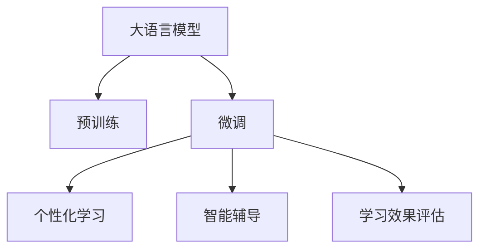

                 

# 大模型时代下教育行业的变革

在AI和大数据迅猛发展的今天，教育行业正经历着一场深刻的变革。从传统的知识传递者，到智慧的引领者，教育机构正运用先进的人工智能技术，赋能教师和学生，提升教学质量，打造个性化学习体验。大语言模型作为当前AI领域最热门的技术之一，正逐步渗透到教育行业的各个环节，驱动着教育模式的创新与升级。本文将系统介绍大语言模型在教育行业的具体应用，分析其优缺点，并展望其未来发展趋势。

## 1. 背景介绍

### 1.1 问题由来

随着全球化和互联网技术的不断进步，教育资源的获取方式和教育模式发生了巨大变化。传统的教师讲授、学生听记的教学方式已经不能满足学生的多样化需求。而且，随着知识更新的加速，教师备课的负担也日渐增加。

为了提升教育质量和效率，教育机构亟需一种高效、智能的教学手段。近年来，随着预训练语言模型和大语言模型的发展，教育领域开始探索其应用潜力，并取得了一定的成效。

### 1.2 问题核心关键点

- **大语言模型**：以BERT、GPT等模型为代表的预训练语言模型，通过大规模无标签文本数据的训练，获得强大的语言理解和生成能力。
- **微调与适应**：通过微调大语言模型，使其适配特定教育任务，提升教学效果。
- **个性化学习**：结合学生学习数据，利用大语言模型生成个性化学习建议和辅导。
- **智能辅导**：通过大语言模型构建智能辅导系统，辅助学生进行自主学习。
- **学习效果评估**：利用大语言模型对学生学习效果进行自动评估，实时反馈学习情况。

这些核心概念相互关联，共同构成了大语言模型在教育行业应用的基础。通过这些技术手段，教育行业可以实现智能化、个性化、高效化的教学模式。

## 2. 核心概念与联系

### 2.1 核心概念概述

为了更好地理解大语言模型在教育行业的应用，首先需要了解相关核心概念：

- **大语言模型**：指的是通过大规模无标签文本数据预训练的模型，如BERT、GPT等。
- **微调(Fine-tuning)**：指在大规模语言模型的基础上，通过有标签数据进行进一步训练，以适配特定任务，提升性能。
- **个性化学习**：根据学生学习数据，生成个性化学习计划和推荐，使学习过程更贴合学生需求。
- **智能辅导**：通过大语言模型构建智能辅导系统，辅助学生自主学习，提供个性化指导。
- **学习效果评估**：利用大语言模型自动评估学生的学习效果，并实时反馈。

这些概念通过大语言模型的预训练、微调过程连接在一起，共同构成了教育行业智能化的基础。

### 2.2 核心概念联系

这些核心概念之间的联系可以通过以下Mermaid流程图来展示：



这个流程图展示了大语言模型的预训练、微调过程与其在教育行业中的应用之间的逻辑关系：

1. 大语言模型通过预训练获得语言理解和生成的能力。
2. 通过微调适配教育领域的具体任务，提升性能。
3. 结合个性化学习需求，生成个性化的学习方案和建议。
4. 构建智能辅导系统，提供个性化的学习支持。
5. 利用模型对学生的学习效果进行自动评估，实时反馈。

这些概念通过大语言模型的预训练和微调过程，有机地结合在一起，共同推动了教育行业的智能化变革。

## 3. 核心算法原理 & 具体操作步骤

### 3.1 算法原理概述

大语言模型在教育行业的应用，主要基于监督学习和大规模自监督学习的方式进行微调。核心算法流程如下：

1. **数据准备**：收集并准备适合特定教育任务的数据集，包括标注数据和无标签数据。
2. **预训练**：利用大规模无标签数据对大语言模型进行预训练，获得通用的语言表示能力。
3. **微调**：在标注数据集上进行微调，适配教育领域的具体任务。
4. **个性化学习**：根据学生学习数据，生成个性化学习方案和建议。
5. **智能辅导**：构建智能辅导系统，提供个性化的学习支持。
6. **学习效果评估**：利用大语言模型对学生的学习效果进行自动评估，实时反馈。

### 3.2 算法步骤详解

以下详细介绍大语言模型在教育行业应用的具体步骤：

#### 3.2.1 数据准备

数据准备是教育行业应用大语言模型的第一步，主要包括：

- **收集数据**：从教材、学生作业、在线平台等来源收集教育相关的数据。
- **数据清洗**：对数据进行去重、去噪、标准化等处理，确保数据质量。
- **标注数据**：对于特定任务（如问答、作文批改等），需要收集并标注相应的数据。
- **构建数据集**：将清洗和标注后的数据构建为训练集、验证集和测试集。

#### 3.2.2 预训练

利用大规模无标签数据对大语言模型进行预训练，主要步骤如下：

- **选择模型**：选择合适的预训练模型，如BERT、GPT等。
- **训练模型**：在大量无标签数据上进行预训练，学习通用的语言表示。
- **保存模型**：将训练好的预训练模型保存下来，作为后续微调的基础。

#### 3.2.3 微调

微调是适配特定教育任务的关键步骤，主要步骤如下：

- **选择微调模型**：选择预训练模型，如BERT、GPT等。
- **准备数据**：收集特定任务的标注数据集，如问答、作文批改等。
- **微调模型**：在标注数据集上微调预训练模型，适配教育任务。
- **评估模型**：在验证集上评估微调后的模型性能，调整微调参数。
- **保存模型**：将微调后的模型保存下来，用于后续应用。

#### 3.2.4 个性化学习

个性化学习是利用大语言模型提升教学效果的重要手段，主要步骤如下：

- **收集学习数据**：收集学生的学习数据，包括学习时长、进度、错题等。
- **生成学习建议**：根据学生学习数据，生成个性化的学习建议和方案。
- **推荐学习资源**：结合学习建议，推荐适合的学习资源和资料。

#### 3.2.5 智能辅导

智能辅导是通过大语言模型构建智能辅导系统，辅助学生自主学习，主要步骤如下：

- **构建辅导系统**：利用微调后的模型构建智能辅导系统，提供实时解答和指导。
- **生成辅导内容**：根据学生提出的问题，利用大语言模型生成详细的辅导内容。
- **推荐学习路径**：根据学生学习进度和水平，推荐合适的学习路径和资料。

#### 3.2.6 学习效果评估

学习效果评估是利用大语言模型对学生学习效果进行自动评估，主要步骤如下：

- **收集学习数据**：收集学生的学习数据，包括作业、测试成绩等。
- **自动评估**：利用大语言模型自动评估学生的学习效果，给出综合评价。
- **实时反馈**：将评估结果实时反馈给学生和教师，指导学习改进。

### 3.3 算法优缺点

大语言模型在教育行业的微调具有以下优点：

- **高效智能**：通过微调，大语言模型能够快速适应特定任务，提升教学效果。
- **个性化推荐**：利用学生学习数据，生成个性化学习方案和建议。
- **实时评估**：自动评估学生的学习效果，实时反馈，提升学习效率。

同时，也存在一些缺点：

- **数据依赖**：微调效果依赖标注数据的质量和数量，标注成本较高。
- **泛化能力**：微调模型可能对特定任务表现良好，但对新任务泛化能力有限。
- **计算资源消耗**：微调过程需要大量的计算资源，包括高性能设备和高昂的运行成本。
- **可解释性不足**：模型决策过程较为复杂，难以解释其内部工作机制。

### 3.4 算法应用领域

大语言模型在教育行业的应用非常广泛，包括但不限于以下领域：

- **智能问答系统**：利用大语言模型构建智能问答系统，解答学生提出的问题。
- **智能作文批改**：对学生的作文进行智能批改，提供详细的批改建议。
- **个性化学习推荐**：根据学生学习数据，推荐适合的学习资源和资料。
- **在线课程推荐**：利用大语言模型对在线课程进行推荐，帮助学生选择适合的课程。
- **学习效果评估**：自动评估学生的学习效果，实时反馈改进。

## 4. 数学模型和公式 & 详细讲解 & 举例说明

### 4.1 数学模型构建

本节将使用数学语言对大语言模型在教育行业应用进行更加严格的数学建模。

假设大语言模型为 $M_{\theta}$，其中 $\theta$ 为模型参数。假设教育任务的标注数据集为 $D=\{(x_i,y_i)\}_{i=1}^N$，其中 $x_i$ 为输入，$y_i$ 为输出，即学生的学习数据。

定义模型 $M_{\theta}$ 在输入 $x_i$ 上的损失函数为 $\ell(M_{\theta}(x_i),y_i)$，则在数据集 $D$ 上的经验风险为：

$$
\mathcal{L}(\theta) = \frac{1}{N} \sum_{i=1}^N \ell(M_{\theta}(x_i),y_i)
$$

微调的优化目标是最小化经验风险，即找到最优参数：

$$
\theta^* = \mathop{\arg\min}_{\theta} \mathcal{L}(\theta)
$$

在实践中，我们通常使用基于梯度的优化算法（如SGD、Adam等）来近似求解上述最优化问题。设 $\eta$ 为学习率，$\lambda$ 为正则化系数，则参数的更新公式为：

$$
\theta \leftarrow \theta - \eta \nabla_{\theta}\mathcal{L}(\theta) - \eta\lambda\theta
$$

其中 $\nabla_{\theta}\mathcal{L}(\theta)$ 为损失函数对参数 $\theta$ 的梯度，可通过反向传播算法高效计算。

### 4.2 公式推导过程

以下以智能作文批改任务为例，推导基于大语言模型的智能批改模型的损失函数及其梯度计算公式。

假设模型 $M_{\theta}$ 在输入 $x$ 上的输出为 $\hat{y}=M_{\theta}(x)$，表示学生作文的自动批改结果。真实标签 $y \in \{1,0\}$，其中1表示作文批改结果为优秀，0表示作文批改结果为不及格。则二分类交叉熵损失函数定义为：

$$
\ell(M_{\theta}(x),y) = -[y\log \hat{y} + (1-y)\log (1-\hat{y})]
$$

将其代入经验风险公式，得：

$$
\mathcal{L}(\theta) = -\frac{1}{N}\sum_{i=1}^N [y_i\log M_{\theta}(x_i)+(1-y_i)\log(1-M_{\theta}(x_i))]
$$

根据链式法则，损失函数对参数 $\theta_k$ 的梯度为：

$$
\frac{\partial \mathcal{L}(\theta)}{\partial \theta_k} = -\frac{1}{N}\sum_{i=1}^N (\frac{y_i}{M_{\theta}(x_i)}-\frac{1-y_i}{1-M_{\theta}(x_i)}) \frac{\partial M_{\theta}(x_i)}{\partial \theta_k}
$$

其中 $\frac{\partial M_{\theta}(x_i)}{\partial \theta_k}$ 可进一步递归展开，利用自动微分技术完成计算。

在得到损失函数的梯度后，即可带入参数更新公式，完成模型的迭代优化。重复上述过程直至收敛，最终得到适应智能作文批改任务的最优模型参数 $\theta^*$。

## 5. 项目实践：代码实例和详细解释说明

### 5.1 开发环境搭建

在进行教育行业应用的大语言模型微调实践前，我们需要准备好开发环境。以下是使用Python进行PyTorch开发的环境配置流程：

1. 安装Anaconda：从官网下载并安装Anaconda，用于创建独立的Python环境。

2. 创建并激活虚拟环境：
```bash
conda create -n pytorch-env python=3.8 
conda activate pytorch-env
```

3. 安装PyTorch：根据CUDA版本，从官网获取对应的安装命令。例如：
```bash
conda install pytorch torchvision torchaudio cudatoolkit=11.1 -c pytorch -c conda-forge
```

4. 安装Transformers库：
```bash
pip install transformers
```

5. 安装各类工具包：
```bash
pip install numpy pandas scikit-learn matplotlib tqdm jupyter notebook ipython
```

完成上述步骤后，即可在`pytorch-env`环境中开始教育行业应用的大语言模型微调实践。

### 5.2 源代码详细实现

下面我以智能作文批改任务为例，给出使用Transformers库对BERT模型进行智能作文批改任务的PyTorch代码实现。

首先，定义智能作文批改任务的数据处理函数：

```python
from transformers import BertTokenizer
from torch.utils.data import Dataset
import torch

class EssayEvaluationDataset(Dataset):
    def __init__(self, texts, labels, tokenizer, max_len=128):
        self.texts = texts
        self.labels = labels
        self.tokenizer = tokenizer
        self.max_len = max_len
        
    def __len__(self):
        return len(self.texts)
    
    def __getitem__(self, item):
        text = self.texts[item]
        label = self.labels[item]
        
        encoding = self.tokenizer(text, return_tensors='pt', max_length=self.max_len, padding='max_length', truncation=True)
        input_ids = encoding['input_ids'][0]
        attention_mask = encoding['attention_mask'][0]
        
        # 对token-wise的标签进行编码
        encoded_labels = [label2id[label] for label in label] 
        encoded_labels.extend([label2id['O']] * (self.max_len - len(encoded_labels)))
        labels = torch.tensor(encoded_labels, dtype=torch.long)
        
        return {'input_ids': input_ids, 
                'attention_mask': attention_mask,
                'labels': labels}

# 标签与id的映射
label2id = {'O': 0, 'Excellent': 1, 'Poor': 2}
id2label = {v: k for k, v in label2id.items()}

# 创建dataset
tokenizer = BertTokenizer.from_pretrained('bert-base-cased')

train_dataset = EssayEvaluationDataset(train_texts, train_labels, tokenizer)
dev_dataset = EssayEvaluationDataset(dev_texts, dev_labels, tokenizer)
test_dataset = EssayEvaluationDataset(test_texts, test_labels, tokenizer)
```

然后，定义模型和优化器：

```python
from transformers import BertForTokenClassification, AdamW

model = BertForTokenClassification.from_pretrained('bert-base-cased', num_labels=len(label2id))

optimizer = AdamW(model.parameters(), lr=2e-5)
```

接着，定义训练和评估函数：

```python
from torch.utils.data import DataLoader
from tqdm import tqdm
from sklearn.metrics import classification_report

device = torch.device('cuda') if torch.cuda.is_available() else torch.device('cpu')
model.to(device)

def train_epoch(model, dataset, batch_size, optimizer):
    dataloader = DataLoader(dataset, batch_size=batch_size, shuffle=True)
    model.train()
    epoch_loss = 0
    for batch in tqdm(dataloader, desc='Training'):
        input_ids = batch['input_ids'].to(device)
        attention_mask = batch['attention_mask'].to(device)
        labels = batch['labels'].to(device)
        model.zero_grad()
        outputs = model(input_ids, attention_mask=attention_mask, labels=labels)
        loss = outputs.loss
        epoch_loss += loss.item()
        loss.backward()
        optimizer.step()
    return epoch_loss / len(dataloader)

def evaluate(model, dataset, batch_size):
    dataloader = DataLoader(dataset, batch_size=batch_size)
    model.eval()
    preds, labels = [], []
    with torch.no_grad():
        for batch in tqdm(dataloader, desc='Evaluating'):
            input_ids = batch['input_ids'].to(device)
            attention_mask = batch['attention_mask'].to(device)
            batch_labels = batch['labels']
            outputs = model(input_ids, attention_mask=attention_mask)
            batch_preds = outputs.logits.argmax(dim=2).to('cpu').tolist()
            batch_labels = batch_labels.to('cpu').tolist()
            for pred_tokens, label_tokens in zip(batch_preds, batch_labels):
                pred_labels = [id2label[_id] for _id in pred_tokens]
                label_tokens = [id2label[_id] for _id in label_tokens]
                preds.append(pred_labels[:len(label_tokens)])
                labels.append(label_tokens)
                
    print(classification_report(labels, preds))
```

最后，启动训练流程并在测试集上评估：

```python
epochs = 5
batch_size = 16

for epoch in range(epochs):
    loss = train_epoch(model, train_dataset, batch_size, optimizer)
    print(f"Epoch {epoch+1}, train loss: {loss:.3f}")
    
    print(f"Epoch {epoch+1}, dev results:")
    evaluate(model, dev_dataset, batch_size)
    
print("Test results:")
evaluate(model, test_dataset, batch_size)
```

以上就是使用PyTorch对BERT进行智能作文批改任务微调的完整代码实现。可以看到，得益于Transformers库的强大封装，我们可以用相对简洁的代码完成BERT模型的加载和微调。

### 5.3 代码解读与分析

让我们再详细解读一下关键代码的实现细节：

**EssayEvaluationDataset类**：
- `__init__`方法：初始化文本、标签、分词器等关键组件。
- `__len__`方法：返回数据集的样本数量。
- `__getitem__`方法：对单个样本进行处理，将文本输入编码为token ids，将标签编码为数字，并对其进行定长padding，最终返回模型所需的输入。

**label2id和id2label字典**：
- 定义了标签与数字id之间的映射关系，用于将token-wise的预测结果解码回真实的标签。

**训练和评估函数**：
- 使用PyTorch的DataLoader对数据集进行批次化加载，供模型训练和推理使用。
- 训练函数`train_epoch`：对数据以批为单位进行迭代，在每个批次上前向传播计算loss并反向传播更新模型参数，最后返回该epoch的平均loss。
- 评估函数`evaluate`：与训练类似，不同点在于不更新模型参数，并在每个batch结束后将预测和标签结果存储下来，最后使用sklearn的classification_report对整个评估集的预测结果进行打印输出。

**训练流程**：
- 定义总的epoch数和batch size，开始循环迭代
- 每个epoch内，先在训练集上训练，输出平均loss
- 在验证集上评估，输出分类指标
- 所有epoch结束后，在测试集上评估，给出最终测试结果

可以看到，PyTorch配合Transformers库使得BERT微调的代码实现变得简洁高效。开发者可以将更多精力放在数据处理、模型改进等高层逻辑上，而不必过多关注底层的实现细节。

当然，工业级的系统实现还需考虑更多因素，如模型的保存和部署、超参数的自动搜索、更灵活的任务适配层等。但核心的微调范式基本与此类似。

## 6. 实际应用场景

### 6.1 智能问答系统

智能问答系统是教育行业中应用大语言模型的重要场景之一。传统的问答系统依赖于规则和人工编写的内容库，难以应对复杂多变的用户问题。利用大语言模型微调技术，可以构建基于大模型的智能问答系统，实现智能化的知识检索和自动问答。

具体而言，可以收集教育领域的常见问题和答案，构建知识库。在此基础上对预训练语言模型进行微调，使其能够理解并生成自然语言回答。通过与知识库的结合，系统可以提供更加精准和全面的答案。此外，大语言模型还可以自动扩充知识库，提升知识库的时效性和全面性。

### 6.2 智能作文批改

智能作文批改是大语言模型在教育领域的重要应用场景。通过微调大语言模型，可以构建智能作文批改系统，自动评估学生的作文质量，并给出详细的批改建议。这种自动化的批改方式，不仅能够提高批改效率，还能使学生及时了解自己的学习情况，提升学习效果。

### 6.3 个性化学习推荐

传统的学习推荐系统往往只依赖用户的历史行为数据进行物品推荐，无法深入理解用户的真实兴趣偏好。利用大语言模型微调技术，个性化学习推荐系统可以更好地挖掘用户行为背后的语义信息，从而提供更加个性化和多样化的学习推荐内容。

在实践中，可以收集用户浏览、点击、评论、分享等行为数据，提取和用户交互的物品标题、描述、标签等文本内容。将文本内容作为模型输入，用户的后续行为（如是否点击、购买等）作为监督信号，在此基础上微调预训练语言模型。微调后的模型能够从文本内容中准确把握用户的兴趣点。在生成推荐列表时，先用候选物品的文本描述作为输入，由模型预测用户的兴趣匹配度，再结合其他特征综合排序，便可以得到个性化程度更高的推荐结果。

### 6.4 未来应用展望

随着大语言模型微调技术的不断进步，其应用领域将更加广泛，对教育行业的变革也将更加深入。

在智慧教室中，基于大语言模型的智能助教系统将变得更加智能，能够实时回答学生的疑问，辅助教学过程，提高教学质量。

在远程教育中，基于大语言模型的智能学习助手将为学生提供个性化学习支持，根据学生的学习进度和需求，推荐合适的学习资源和资料，提供定制化的学习路径和辅导。

在教育数据管理中，大语言模型可以自动分析和处理海量教育数据，提供实时分析和决策支持，提升教育管理效率。

此外，在在线教育平台、职业培训、企业培训等众多领域，基于大语言模型的智能教学系统也将不断涌现，为教育行业的智能化、个性化、高效化提供新的解决方案。相信随着技术的日益成熟，大语言模型微调必将在教育行业带来革命性变革，为教育公平和教育质量提升贡献力量。

## 7. 工具和资源推荐
### 7.1 学习资源推荐

为了帮助开发者系统掌握大语言模型微调的理论基础和实践技巧，这里推荐一些优质的学习资源：

1. 《Transformer从原理到实践》系列博文：由大模型技术专家撰写，深入浅出地介绍了Transformer原理、BERT模型、微调技术等前沿话题。

2. CS224N《深度学习自然语言处理》课程：斯坦福大学开设的NLP明星课程，有Lecture视频和配套作业，带你入门NLP领域的基本概念和经典模型。

3. 《Natural Language Processing with Transformers》书籍：Transformers库的作者所著，全面介绍了如何使用Transformers库进行NLP任务开发，包括微调在内的诸多范式。

4. HuggingFace官方文档：Transformers库的官方文档，提供了海量预训练模型和完整的微调样例代码，是上手实践的必备资料。

5. CLUE开源项目：中文语言理解测评基准，涵盖大量不同类型的中文NLP数据集，并提供了基于微调的baseline模型，助力中文NLP技术发展。

通过对这些资源的学习实践，相信你一定能够快速掌握大语言模型微调的精髓，并用于解决实际的NLP问题。
###  7.2 开发工具推荐

高效的开发离不开优秀的工具支持。以下是几款用于大语言模型微调开发的常用工具：

1. PyTorch：基于Python的开源深度学习框架，灵活动态的计算图，适合快速迭代研究。大部分预训练语言模型都有PyTorch版本的实现。

2. TensorFlow：由Google主导开发的开源深度学习框架，生产部署方便，适合大规模工程应用。同样有丰富的预训练语言模型资源。

3. Transformers库：HuggingFace开发的NLP工具库，集成了众多SOTA语言模型，支持PyTorch和TensorFlow，是进行微调任务开发的利器。

4. Weights & Biases：模型训练的实验跟踪工具，可以记录和可视化模型训练过程中的各项指标，方便对比和调优。与主流深度学习框架无缝集成。

5. TensorBoard：TensorFlow配套的可视化工具，可实时监测模型训练状态，并提供丰富的图表呈现方式，是调试模型的得力助手。

6. Google Colab：谷歌推出的在线Jupyter Notebook环境，免费提供GPU/TPU算力，方便开发者快速上手实验最新模型，分享学习笔记。

合理利用这些工具，可以显著提升大语言模型微调任务的开发效率，加快创新迭代的步伐。

### 7.3 相关论文推荐

大语言模型和微调技术的发展源于学界的持续研究。以下是几篇奠基性的相关论文，推荐阅读：

1. Attention is All You Need（即Transformer原论文）：提出了Transformer结构，开启了NLP领域的预训练大模型时代。

2. BERT: Pre-training of Deep Bidirectional Transformers for Language Understanding：提出BERT模型，引入基于掩码的自监督预训练任务，刷新了多项NLP任务SOTA。

3. Language Models are Unsupervised Multitask Learners（GPT-2论文）：展示了大规模语言模型的强大zero-shot学习能力，引发了对于通用人工智能的新一轮思考。

4. Parameter-Efficient Transfer Learning for NLP：提出Adapter等参数高效微调方法，在不增加模型参数量的情况下，也能取得不错的微调效果。

5. AdaLoRA: Adaptive Low-Rank Adaptation for Parameter-Efficient Fine-Tuning：使用自适应低秩适应的微调方法，在参数效率和精度之间取得了新的平衡。

这些论文代表了大语言模型微调技术的发展脉络。通过学习这些前沿成果，可以帮助研究者把握学科前进方向，激发更多的创新灵感。

## 8. 总结：未来发展趋势与挑战

### 8.1 总结

本文对大语言模型在教育行业的具体应用进行了系统介绍。首先阐述了大语言模型和微调技术的研究背景和意义，明确了微调在拓展预训练模型应用、提升教学效果方面的独特价值。其次，从原理到实践，详细讲解了监督微调的数学原理和关键步骤，给出了教育领域应用的具体代码实现。同时，本文还广泛探讨了微调方法在智能问答、智能作文批改、个性化学习推荐等多个教育应用场景中的实际效果。

通过本文的系统梳理，可以看到，大语言模型微调技术在教育领域具备广阔的应用前景，能够显著提升教学效果和教育公平。借助大语言模型，教育行业正在从传统的知识传递者向智能教学引导者转型，迈向更加智能化、个性化、高效化的未来。

### 8.2 未来发展趋势

展望未来，大语言模型微调技术在教育领域的应用将呈现以下几个发展趋势：

1. **智能化教学助手**：利用大语言模型构建智能助教系统，实时回答学生的疑问，辅助教学过程，提高教学质量。
2. **个性化学习推荐**：结合学生学习数据，生成个性化学习方案和建议，提供更加精准的学习资源推荐。
3. **实时智能评估**：利用大语言模型自动评估学生的学习效果，实时反馈改进，提升学习效率。
4. **智能问答系统**：构建基于大模型的智能问答系统，实现智能化的知识检索和自动问答。
5. **多模态学习融合**：将视觉、语音等多模态信息与文本信息进行协同建模，提升知识理解和生成能力。

这些趋势凸显了大语言模型微调技术在教育行业的巨大潜力和广泛应用前景。随着技术的不断进步，相信大语言模型微调必将在教育领域带来革命性变革，为教育公平和教育质量提升贡献力量。

### 8.3 面临的挑战

尽管大语言模型微调技术已经取得了瞩目成就，但在迈向更加智能化、普适化应用的过程中，它仍面临诸多挑战：

1. **数据依赖**：微调效果依赖标注数据的质量和数量，标注成本较高，特别是对于长尾应用场景。
2. **泛化能力**：微调模型可能对特定任务表现良好，但对新任务泛化能力有限，难以适应多变的环境。
3. **计算资源消耗**：微调过程需要大量的计算资源，包括高性能设备和高昂的运行成本。
4. **可解释性不足**：模型决策过程较为复杂，难以解释其内部工作机制，缺乏可解释性。
5. **安全性有待保障**：模型可能学习到有害信息，通过微调传递到教育任务中，造成潜在风险。

### 8.4 研究展望

面对大语言模型微调所面临的种种挑战，未来的研究需要在以下几个方面寻求新的突破：

1. **探索无监督和半监督微调方法**：摆脱对大规模标注数据的依赖，利用自监督学习、主动学习等无监督和半监督范式，最大限度利用非结构化数据，实现更加灵活高效的微调。
2. **研究参数高效和计算高效的微调范式**：开发更加参数高效的微调方法，在固定大部分预训练参数的同时，只更新极少量的任务相关参数。同时优化微调模型的计算图，减少前向传播和反向传播的资源消耗，实现更加轻量级、实时性的部署。
3. **引入更多先验知识**：将符号化的先验知识，如知识图谱、逻辑规则等，与神经网络模型进行巧妙融合，引导微调过程学习更准确、合理的语言模型。同时加强不同模态数据的整合，实现视觉、语音等多模态信息与文本信息的协同建模。
4. **纳入伦理道德约束**：在模型训练目标中引入伦理导向的评估指标，过滤和惩罚有偏见、有害的输出倾向，确保输出的安全性。

这些研究方向将推动大语言模型微调技术向更高层次发展，为教育行业带来更多的创新和突破。相信随着技术的日益成熟，大语言模型微调必将在教育行业带来革命性变革，为教育公平和教育质量提升贡献力量。

