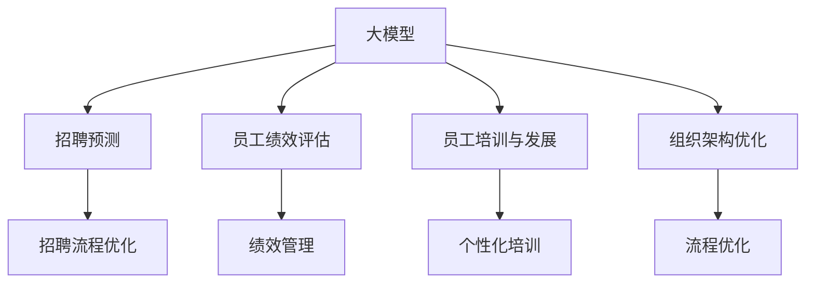

                 

# 大模型时代下的新型人力资源管理

在当今这个大模型时代，人工智能和机器学习技术的飞速发展，正逐渐改变着各行各业的管理方式。特别是对于人力资源管理(Human Resource Management, HRM)领域，传统的依靠人工经验和规则的方法正逐渐被基于数据驱动的模型所替代。本文将探讨在大模型时代下，新型人力资源管理的核心概念、算法原理、操作步骤，以及其应用领域和未来发展趋势。

## 1. 背景介绍

### 1.1 问题由来
人力资源管理是一门传统的管理学科，其核心目标是最大化组织的人力资源价值。传统的HRM方法依赖于手动数据分析、经验和直觉。然而，随着数据量的激增和模型算法的进步，基于人工智能和大模型的HRM方法开始崭露头角。

大模型，特别是深度学习模型，能够处理和分析大规模数据，挖掘潜在的关联和模式，在招聘、培训、绩效评估等各个环节中都能提供有力的支持。本文将重点讨论如何利用大模型来进行新型人力资源管理。

### 1.2 问题核心关键点
大模型时代下的人力资源管理，主要包括以下几个关键点：
- **数据驱动**：利用大模型对海量数据进行分析，提高决策的科学性和精确性。
- **自动化**：通过自动化算法实现日常HRM任务，减少人力成本和错误率。
- **预测与优化**：利用模型对未来人力资源需求进行预测，并优化资源配置。
- **个性化**：针对不同岗位和员工，提供个性化的培训和职业发展方案。
- **风险管理**：通过模型识别潜在风险，如员工流失、绩效下降等，提前采取措施。

## 2. 核心概念与联系

### 2.1 核心概念概述
为了更好地理解新型人力资源管理，我们需要掌握以下几个核心概念：

- **大模型**：基于深度学习的大规模神经网络模型，如BERT、GPT等，能够处理和分析大量数据，提取特征和模式。
- **招聘预测**：使用大模型预测未来的招聘需求，优化招聘流程。
- **员工绩效评估**：通过模型分析员工工作表现，进行绩效评估和反馈。
- **员工培训与发展**：利用大模型进行个性化培训方案设计，提升员工技能和职业发展。
- **组织架构优化**：利用模型分析组织结构，优化团队配置和流程。

这些概念之间相互关联，共同构成了新型人力资源管理的框架。以下是一个Mermaid流程图，展示这些概念之间的联系：



这个流程图展示了大型数据模型在招聘预测、绩效评估、培训与发展以及组织架构优化中的作用。

## 3. 核心算法原理 & 具体操作步骤
### 3.1 算法原理概述

新型人力资源管理主要依赖于大模型的预测和优化算法。其核心思想是通过对历史数据进行分析，建立数学模型，然后对未来人力资源需求进行预测和资源配置优化。

### 3.2 算法步骤详解

1. **数据收集与处理**：
   - 收集人力资源相关的历史数据，包括招聘信息、员工绩效、培训记录等。
   - 清洗和预处理数据，去除噪声和异常值，确保数据的质量和完整性。

2. **模型训练**：
   - 选择合适的模型结构，如回归模型、分类模型、序列模型等。
   - 使用历史数据对模型进行训练，调整模型参数以最小化损失函数。

3. **预测与优化**：
   - 利用训练好的模型进行预测，如招聘需求、员工绩效等。
   - 根据预测结果，进行资源配置优化，如调整招聘策略、培训计划等。

4. **评估与反馈**：
   - 使用实际结果对模型进行评估，通过误差分析调整模型。
   - 不断反馈优化模型，提升预测和优化效果。

### 3.3 算法优缺点

大模型在HRM中的应用具有以下优点：
- **高效性**：大模型能够处理大量数据，快速进行分析和预测。
- **精度高**：基于历史数据的模型能够提供较为准确的预测结果。
- **自动化**：自动化的预测和优化流程可以减少人工干预，提高工作效率。

但同时，大模型也存在一些缺点：
- **数据依赖**：模型的效果高度依赖于数据的质量和数量，数据偏差可能影响结果。
- **模型复杂度**：大型模型需要较高的计算资源和专业知识进行训练和维护。
- **可解释性差**：大模型通常被视为"黑盒"，难以解释其内部工作机制。

### 3.4 算法应用领域

新型人力资源管理主要应用于以下几个领域：
- **招聘管理**：通过模型预测招聘需求，优化招聘流程，提升招聘效率。
- **绩效管理**：使用模型评估员工绩效，提供个性化反馈和改进建议。
- **培训与发展**：根据员工特点，设计个性化培训方案，提升员工技能。
- **组织架构优化**：通过模型分析组织结构，优化团队配置和流程。

这些应用场景展示了大模型在HRM中的广泛应用和巨大潜力。

## 4. 数学模型和公式 & 详细讲解  
### 4.1 数学模型构建

在人力资源管理中，常用的数学模型包括回归模型、分类模型和序列模型。

- **回归模型**：用于预测连续的变量，如招聘需求数量、员工绩效评分等。常见的回归模型有线性回归、岭回归、Lasso回归等。
- **分类模型**：用于分类任务，如员工是否离职、岗位类别等。常见的分类模型有逻辑回归、决策树、随机森林、支持向量机等。
- **序列模型**：用于时间序列预测，如员工绩效变化趋势等。常见的序列模型有ARIMA、LSTM、GRU等。

### 4.2 公式推导过程

以回归模型为例，其基本形式为：
$$
y = w_0 + w_1 x_1 + w_2 x_2 + \cdots + w_n x_n + \epsilon
$$
其中，$y$为输出变量，$x_i$为输入变量，$w_i$为权重，$\epsilon$为误差项。

在训练过程中，最小化损失函数：
$$
L(w) = \frac{1}{2m} \sum_{i=1}^m (y_i - \hat{y}_i)^2
$$
其中，$m$为样本数量，$\hat{y}_i$为模型预测值。

### 4.3 案例分析与讲解

假设我们要预测一个公司的招聘需求，可以收集过去一年的招聘数据，包括职位、人数、薪资等，以及未来的招聘计划和市场需求。利用回归模型进行训练和预测，可以帮助我们制定更合理的招聘策略。

## 5. 项目实践：代码实例和详细解释说明
### 5.1 开发环境搭建

在进行人力资源管理大模型开发时，需要搭建一个合适的Python开发环境。可以使用Anaconda或Miniconda创建虚拟环境，并确保安装了所需的Python版本、PyTorch、TensorFlow等深度学习框架。

### 5.2 源代码详细实现

以下是一个简单的招聘需求预测模型的代码实现：

```python
import pandas as pd
import numpy as np
from sklearn.linear_model import LinearRegression
from sklearn.model_selection import train_test_split

# 读取数据
data = pd.read_csv('recruitment_data.csv')

# 数据预处理
X = data[['position', 'salary', 'market_demand']]
y = data['recruitment_num']
X_train, X_test, y_train, y_test = train_test_split(X, y, test_size=0.2, random_state=42)

# 训练模型
model = LinearRegression()
model.fit(X_train, y_train)

# 预测
y_pred = model.predict(X_test)

# 输出结果
print(y_pred)
```

这个代码实现了一个简单的线性回归模型，用于预测招聘需求。可以看到，代码非常简洁，易于理解和实现。

### 5.3 代码解读与分析

- `pandas`和`numpy`库用于数据读取和处理。
- `sklearn`库中的`LinearRegression`模型用于建立回归模型。
- `train_test_split`函数用于数据划分，保证模型的泛化能力。

### 5.4 运行结果展示

运行上述代码，可以得到招聘需求的预测结果。结果将帮助企业制定更合理的招聘策略，优化人力资源配置。

## 6. 实际应用场景

### 6.1 招聘预测

招聘预测是大模型在人力资源管理中最常见的应用之一。利用大模型，企业可以预测未来的招聘需求，优化招聘流程，减少招聘时间和成本。

### 6.2 绩效评估

通过大模型，企业可以对员工的绩效进行客观评估，识别优秀员工和有潜力的员工，制定个性化的培训和激励方案，提升员工满意度和工作积极性。

### 6.3 培训与发展

利用大模型，企业可以设计个性化的培训方案，提升员工技能和职业发展。通过分析员工的技能和职业兴趣，推荐适合的培训课程和职业路径，帮助员工实现职业发展。

### 6.4 组织架构优化

通过大模型，企业可以分析组织结构，识别冗余和瓶颈，优化团队配置和流程。利用模型预测员工需求和岗位需求，合理配置人力资源，提升组织效率。

## 7. 工具和资源推荐
### 7.1 学习资源推荐

为了深入了解大模型在人力资源管理中的应用，以下是一些推荐的学习资源：

- **《机器学习实战》**：这是一本经典的机器学习入门书籍，涵盖了回归模型、分类模型、序列模型等基础概念。
- **Coursera上的“数据科学”课程”**：由斯坦福大学提供，涵盖数据处理、机器学习、数据可视化等课程，适合初学者学习。
- **Kaggle竞赛**：Kaggle平台上有很多与人力资源管理相关的数据竞赛，可以帮助你实践和应用所学知识。

### 7.2 开发工具推荐

在进行人力资源管理大模型开发时，以下工具非常有用：

- **PyTorch**：一个广泛使用的深度学习框架，支持动态图和静态图计算，适合快速迭代研究。
- **TensorFlow**：由Google开发的深度学习框架，适合大规模工程应用。
- **Jupyter Notebook**：一个交互式的Python开发环境，适合编写和运行代码。
- **Weights & Biases**：一个模型训练实验跟踪工具，可以记录和可视化模型训练过程中的各项指标，方便对比和调优。

### 7.3 相关论文推荐

以下是一些关于大模型在人力资源管理中应用的经典论文，推荐阅读：

- **《基于机器学习的HRM预测模型研究》**：该论文介绍了多种机器学习模型在人力资源管理中的应用，包括回归模型、分类模型和序列模型。
- **《深度学习在HRM中的应用研究》**：该论文探讨了深度学习在大规模数据处理和预测中的优势，介绍了几种深度学习模型在人力资源管理中的应用。
- **《HRM中大模型的自动化流程设计》**：该论文介绍了如何利用大模型自动化设计人力资源管理流程，提高效率和精确度。

## 8. 总结：未来发展趋势与挑战
### 8.1 研究成果总结

大模型在人力资源管理中的应用已经取得了显著成果，主要体现在以下几个方面：
- 提升了招聘和员工绩效管理的效率和精度。
- 优化了培训与发展流程，提升了员工满意度。
- 分析了组织结构，提高了组织效率。

### 8.2 未来发展趋势

未来，大模型在人力资源管理中的应用将呈现以下几个趋势：
- **智能化和自动化**：大模型将进一步提升人力资源管理的智能化和自动化水平，减少人工干预。
- **个性化和定制化**：利用大模型进行个性化培训和职业发展设计，满足不同员工的需求。
- **跨部门协作**：大模型将促进跨部门协作，提升组织整体效率。
- **风险管理**：大模型将帮助识别和预测潜在风险，提前采取措施。

### 8.3 面临的挑战

尽管大模型在人力资源管理中展现了巨大的潜力，但也面临一些挑战：
- **数据隐私和安全**：人力资源数据涉及员工隐私，如何保护数据隐私和安全是一个重要问题。
- **数据质量**：大模型的效果高度依赖于数据质量，数据偏差可能影响模型结果。
- **模型可解释性**：大模型通常被视为"黑盒"，难以解释其内部工作机制。

### 8.4 研究展望

为了克服这些挑战，未来的研究需要在以下几个方面进行探索：
- **数据隐私保护**：开发数据隐私保护技术，确保员工数据的安全和隐私。
- **数据质量提升**：加强数据收集和处理，提升数据质量和完整性。
- **模型可解释性**：研究如何增强大模型的可解释性，使其内部机制透明化。

## 9. 附录：常见问题与解答

**Q1：大模型如何应用于招聘预测？**

A: 大模型可以通过对历史招聘数据进行分析，建立预测模型，预测未来的招聘需求。在预测过程中，可以引入时间序列、季节性等因素，提高预测的准确性。

**Q2：员工绩效评估中的模型选择有哪些？**

A: 员工绩效评估中的模型选择包括回归模型、分类模型、序列模型等。不同类型的模型适用于不同的绩效指标，如连续型绩效评分、二元分类（是否优秀）、序列型绩效变化等。

**Q3：如何在培训与发展中使用大模型？**

A: 大模型可以通过分析员工的技能和兴趣，推荐个性化的培训课程和职业发展路径。利用序列模型可以预测员工职业发展趋势，制定长期的职业发展计划。

**Q4：大模型在组织架构优化中的应用如何？**

A: 大模型可以分析组织结构，识别冗余和瓶颈，优化团队配置和流程。利用回归模型可以预测员工需求和岗位需求，合理配置人力资源，提升组织效率。

---

作者：禅与计算机程序设计艺术 / Zen and the Art of Computer Programming

