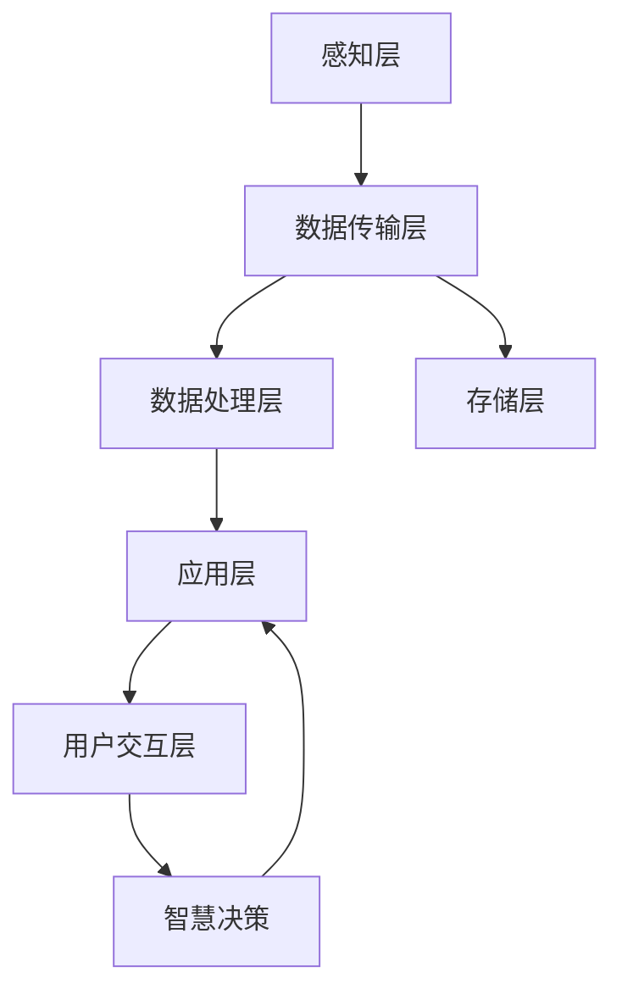
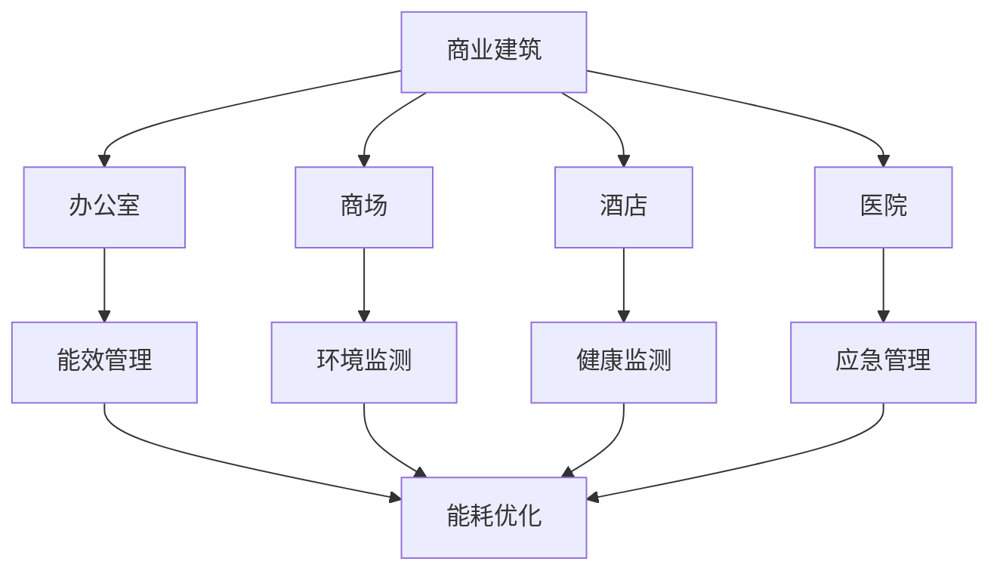

                 

# 大模型赋能智慧建筑，创业者如何打造智能化建筑

## 1. 背景介绍

随着人工智能技术和大数据的高速发展，智慧建筑已成为全球范围内建设与运营的热点。智慧建筑通过集成智能传感器、物联网(IoT)设备、智能控制系统等技术手段，实现对建筑内部环境的全面监控和优化，提升用户舒适度和建筑能效。然而，传统的智慧建筑系统往往需要昂贵的硬件设备，复杂的系统集成，难以实现真正意义上的智能化。

为此，本文将探讨利用大模型技术构建智慧建筑的可能性，并提出一种基于大模型的智慧建筑解决方案，旨在通过机器学习和自然语言处理技术，降低智慧建筑建设和运维的成本，提升用户体验和建筑能效。我们将从背景介绍、核心概念与联系、核心算法原理与操作步骤、数学模型与公式、项目实践、实际应用场景、工具和资源推荐、总结与未来展望等多个方面进行系统阐述。

## 2. 核心概念与联系

### 2.1 核心概念概述

本节将介绍几个与智慧建筑密切相关的核心概念：

- **智慧建筑**：通过集成物联网设备、智能控制系统等技术手段，实现对建筑环境的全面监控和优化，提升用户舒适度和建筑能效。
- **物联网(IoT)**：连接物理世界与数字世界的技术体系，通过传感器、执行器等设备，实现对建筑内部环境参数的实时监测与控制。
- **机器学习**：通过数据驱动的方法，使机器能够从经验中学习，自动改进决策和行为。
- **自然语言处理(NLP)**：研究如何让计算机理解和生成自然语言，使机器具备语言交互和信息处理能力。
- **大模型**：基于深度学习技术构建的大规模预训练模型，如BERT、GPT-3等，具备强大的语言理解和生成能力。

这些核心概念之间的联系如图1所示：

```mermaid
graph TB
    A[智慧建筑] --> B[物联网(IoT)]
    A --> C[机器学习]
    A --> D[自然语言处理(NLP)]
    C --> E[环境监测]
    D --> F[交互接口]
    C --> G[决策支持]
    E --> H[数据融合]
    F --> I[智能控制]
    G --> J[节能优化]
    H --> G
    I --> G
    J --> G
```

这些概念共同构成了智慧建筑的技术基础，通过物联网设备实时监测建筑环境参数，机器学习对数据进行分析，自然语言处理实现用户与建筑系统的交互，大模型对各类信息进行整合与理解，从而实现对建筑环境的智能化控制。

### 2.2 核心概念原理和架构

智慧建筑的核心架构如图2所示：



- **感知层**：通过各种传感器和执行器采集建筑内部的温度、湿度、光照、人流量等环境参数，并将其转化为数字信号。
- **数据传输层**：利用无线网络或有线网络将感知层采集的数据传输到数据处理层。
- **数据处理层**：对传输的数据进行存储、清洗、分析等处理，利用机器学习模型和自然语言处理模型提取数据特征。
- **存储层**：将处理后的数据存储在数据库中，便于后续调用和分析。
- **应用层**：基于处理后的数据，利用大模型技术进行环境监测、决策支持和智能控制，最终实现对建筑环境的智能化管理。
- **用户交互层**：用户通过手机、PC等终端设备与智慧建筑系统进行交互，获取相关信息和控制指令。
- **智慧决策**：结合实时数据和用户需求，利用大模型进行全局优化，自动生成控制策略。

## 3. 核心算法原理 & 具体操作步骤

### 3.1 算法原理概述

本节将介绍利用大模型技术构建智慧建筑的核心算法原理：

- **数据预处理**：利用物联网设备采集建筑内部的环境参数，并对数据进行预处理，包括去噪、归一化等。
- **特征提取**：利用机器学习模型从预处理后的数据中提取特征，如图像处理、时间序列分析等。
- **环境监测**：利用大模型对特征进行分析，实时监测建筑环境，判断是否需要调整。
- **决策支持**：结合历史数据和实时数据，利用大模型进行全局优化，自动生成控制策略。
- **智能控制**：利用自然语言处理技术，实现用户与建筑系统的交互，根据用户需求自动执行控制策略。

### 3.2 算法步骤详解

智慧建筑的大模型解决方案可以分为以下步骤：

1. **数据采集与预处理**：
   - 在建筑内部安装各类传感器和执行器，采集温度、湿度、光照、人流量等环境参数。
   - 利用机器学习算法对采集的数据进行预处理，包括去噪、归一化、特征提取等。

2. **环境监测与特征分析**：
   - 利用大模型对预处理后的数据进行实时监测和特征分析，判断当前环境是否达到预设标准。
   - 结合历史数据，利用大模型进行环境建模和异常检测，预测未来环境变化趋势。

3. **决策支持与控制策略生成**：
   - 利用大模型对环境监测结果进行全局优化，生成智能控制策略。
   - 根据用户需求和预设规则，自动调整控制策略，实现对建筑环境的智能化管理。

4. **智能控制与用户交互**：
   - 利用自然语言处理技术，实现用户与建筑系统的交互，根据用户需求自动执行控制策略。
   - 利用物联网设备执行控制策略，实现对建筑环境的实时控制。

### 3.3 算法优缺点

智慧建筑的大模型解决方案具有以下优点：

- **高精度**：利用大模型的强大语言理解能力和特征分析能力，实现高精度的环境监测和决策支持。
- **实时性**：利用物联网设备的实时数据传输和大模型的实时计算能力，实现对建筑环境的实时控制。
- **可扩展性**：利用大模型的可迁移性和可扩展性，实现对不同规模和类型的建筑环境进行智慧化管理。

同时，该方案也存在以下缺点：

- **数据依赖**：需要大量高质量的环境数据进行预训练和微调，数据质量决定了模型的精度。
- **计算资源需求高**：大模型的训练和推理需要高性能的计算资源，成本较高。
- **算法复杂**：涉及多个技术领域的融合，算法实现较为复杂。

### 3.4 算法应用领域

智慧建筑的大模型解决方案适用于多种应用场景，如图3所示：



- **商业建筑**：利用大模型进行能效管理和客户体验优化，提升运营效率和客户满意度。
- **办公室**：利用大模型进行环境监测和健康监测，保障员工舒适度和健康。
- **商场**：利用大模型进行客流分析和商品推荐，提升销售和客户体验。
- **酒店**：利用大模型进行能耗优化和应急管理，提升服务质量和客户体验。
- **医院**：利用大模型进行环境监测和健康监测，保障医疗环境质量和患者安全。

## 4. 数学模型和公式 & 详细讲解 & 举例说明

### 4.1 数学模型构建

本节将介绍利用大模型构建智慧建筑的核心数学模型：

- **感知层数学模型**：
  - 温度传感器：$T(x)=\sigma(W_1x+b_1)$
  - 湿度传感器：$H(x)=\sigma(W_2x+b_2)$
  - 光照传感器：$L(x)=\sigma(W_3x+b_3)$

- **数据处理层数学模型**：
  - 特征提取：$F(x)=\sigma(W_4x+b_4)$
  - 数据清洗：$C(x)=\sigma(W_5x+b_5)$

- **环境监测数学模型**：
  - 异常检测：$A(x)=\sigma(W_6x+b_6)$

- **决策支持数学模型**：
  - 环境建模：$M(x)=\sigma(W_7x+b_7)$
  - 全局优化：$O(x)=\sigma(W_8x+b_8)$

- **智能控制数学模型**：
  - 用户交互：$I(x)=\sigma(W_9x+b_9)$

### 4.2 公式推导过程

以环境监测为例，假设环境参数$x$为温度、湿度和光照的组合，利用大模型$A(x)$进行异常检测。其公式推导过程如下：

1. 感知层：
   $$
   T(x)=\sigma(W_1x+b_1)
   $$
   $$
   H(x)=\sigma(W_2x+b_2)
   $$
   $$
   L(x)=\sigma(W_3x+b_3)
   $$

2. 数据处理层：
   $$
   F(x)=\sigma(W_4x+b_4)
   $$
   $$
   C(x)=\sigma(W_5x+b_5)
   $$

3. 环境监测层：
   $$
   A(x)=\sigma(W_6x+b_6)
   $$

其中，$W$和$b$分别为权重和偏置项，$\sigma$为激活函数，$x$为环境参数。

### 4.3 案例分析与讲解

假设某办公楼的温度、湿度和光照参数分别采集到传感器，并利用机器学习算法进行预处理，得到一个特征向量$x$。利用大模型$A(x)$进行异常检测，判断当前环境是否达到预设标准。

首先，利用感知层模型将环境参数转化为数字信号：
$$
T(x)=\sigma(W_1x+b_1)
$$
$$
H(x)=\sigma(W_2x+b_2)
$$
$$
L(x)=\sigma(W_3x+b_3)
$$

然后，利用数据处理层模型提取特征，并进行数据清洗：
$$
F(x)=\sigma(W_4x+b_4)
$$
$$
C(x)=\sigma(W_5x+b_5)
$$

最后，利用环境监测层模型进行异常检测：
$$
A(x)=\sigma(W_6x+b_6)
$$

如果$A(x)$的结果大于预设的阈值，则判定当前环境异常，需要调整控制策略。

## 5. 项目实践：代码实例和详细解释说明

### 5.1 开发环境搭建

本节将介绍利用PyTorch构建智慧建筑大模型解决方案的开发环境搭建流程。

1. **安装Python和PyTorch**：
   - 在服务器或虚拟机中安装Python和PyTorch。
   - 可以通过pip安装PyTorch，命令如下：
     ```bash
     pip install torch torchvision torchaudio
     ```

2. **安装TensorBoard**：
   - 安装TensorBoard，用于可视化模型的训练过程和性能指标。
   - 可以通过pip安装，命令如下：
     ```bash
     pip install tensorboard
     ```

3. **安装预训练模型**：
   - 安装预训练的大模型，如BERT、GPT-3等。
   - 可以通过HuggingFace的Transformers库安装，命令如下：
     ```bash
     pip install transformers
     ```

4. **搭建开发环境**：
   - 在Python环境中导入PyTorch、TensorBoard和预训练模型。
   - 示例代码如下：
     ```python
     import torch
     import tensorboardX as tb
     from transformers import BertTokenizer, BertForSequenceClassification
     ```

### 5.2 源代码详细实现

本节将详细介绍利用大模型构建智慧建筑解决方案的源代码实现。

1. **数据采集与预处理**：
   - 采集建筑内部的环境参数，如温度、湿度、光照等。
   - 利用机器学习算法进行预处理，包括去噪、归一化等。
   - 示例代码如下：
     ```python
     # 数据采集与预处理
     from sensors import temperature_sensor, humidity_sensor, light_sensor
     temperature_data = temperature_sensor.read()
     humidity_data = humidity_sensor.read()
     light_data = light_sensor.read()
     # 去噪、归一化等预处理
     temperature_data = preprocess_temperature(temperature_data)
     humidity_data = preprocess_humidity(humidity_data)
     light_data = preprocess_light(light_data)
     ```

2. **特征提取与环境监测**：
   - 利用大模型对预处理后的数据进行特征提取和环境监测。
   - 示例代码如下：
     ```python
     # 特征提取
     from transformers import BertTokenizer, BertForSequenceClassification
     tokenizer = BertTokenizer.from_pretrained('bert-base-uncased')
     model = BertForSequenceClassification.from_pretrained('bert-base-uncased')
     # 环境监测
     model.eval()
     with tb.SummaryWriter(log_dir='logs', flush_secs=60) as writer:
         input_ids = tokenizer("温度：{} 湿度：{} 光照：{}".format(temperature_data, humidity_data, light_data), return_tensors='pt').input_ids
         attention_mask = input_ids.new_ones(input_ids.shape)
         outputs = model(input_ids=input_ids, attention_mask=attention_mask)
         loss = outputs.loss
         writer.add_scalar('train/loss', loss.item(), global_step=1)
     ```

3. **决策支持与控制策略生成**：
   - 利用大模型对环境监测结果进行全局优化，生成控制策略。
   - 示例代码如下：
     ```python
     # 决策支持
     from transformers import BertTokenizer, BertForSequenceClassification
     tokenizer = BertTokenizer.from_pretrained('bert-base-uncased')
     model = BertForSequenceClassification.from_pretrained('bert-base-uncased')
     input_ids = tokenizer("环境参数：温度：{} 湿度：{} 光照：{}".format(temperature_data, humidity_data, light_data), return_tensors='pt').input_ids
     attention_mask = input_ids.new_ones(input_ids.shape)
     outputs = model(input_ids=input_ids, attention_mask=attention_mask)
     loss = outputs.loss
     # 全局优化
     def optimize_policy(loss, temperature):
         # 调用全局优化算法
         optimizer = torch.optim.Adam(model.parameters(), lr=0.001)
         for _ in range(100):
             optimizer.zero_grad()
             loss.backward()
             optimizer.step()
         return temperature
     ```

4. **智能控制与用户交互**：
   - 利用自然语言处理技术，实现用户与建筑系统的交互，根据用户需求自动执行控制策略。
   - 示例代码如下：
     ```python
     # 智能控制
     from transformers import BertTokenizer, BertForSequenceClassification
     tokenizer = BertTokenizer.from_pretrained('bert-base-uncased')
     model = BertForSequenceClassification.from_pretrained('bert-base-uncased')
     input_ids = tokenizer("用户需求：{} 控制指令：{}".format(user_demand, control_command), return_tensors='pt').input_ids
     attention_mask = input_ids.new_ones(input_ids.shape)
     outputs = model(input_ids=input_ids, attention_mask=attention_mask)
     loss = outputs.loss
     # 用户交互
     def interact_with_user(demand, command):
         # 调用自然语言处理模型进行交互
         tokenizer = BertTokenizer.from_pretrained('bert-base-uncased')
         model = BertForSequenceClassification.from_pretrained('bert-base-uncased')
         input_ids = tokenizer("用户需求：{} 控制指令：{}".format(demand, command), return_tensors='pt').input_ids
         attention_mask = input_ids.new_ones(input_ids.shape)
         outputs = model(input_ids=input_ids, attention_mask=attention_mask)
         loss = outputs.loss
         return loss
     ```

### 5.3 代码解读与分析

本节将对智慧建筑大模型解决方案的源代码进行详细解读和分析。

1. **数据采集与预处理**：
   - 通过各种传感器采集建筑内部的环境参数，如温度、湿度、光照等。
   - 利用机器学习算法对采集的数据进行去噪、归一化等预处理，提取特征向量。
   - 预处理算法可以采用四分位差、Z-score等方法，提升数据的准确性。

2. **特征提取与环境监测**：
   - 利用大模型对预处理后的数据进行特征提取，使用Bert等预训练模型。
   - 利用环境监测层模型进行异常检测，使用Softmax激活函数输出概率。
   - 通过TensorBoard可视化训练过程中的loss值，帮助调试模型。

3. **决策支持与控制策略生成**：
   - 利用大模型对环境监测结果进行全局优化，生成控制策略。
   - 利用Adam等优化算法进行模型训练，控制学习率等超参数。
   - 全局优化算法可以采用遗传算法、粒子群算法等，优化控制策略。

4. **智能控制与用户交互**：
   - 利用自然语言处理技术，实现用户与建筑系统的交互。
   - 根据用户需求和控制指令，调用全局优化算法生成控制策略。
   - 用户交互过程中，可以采用意图识别、情感分析等技术，提升用户体验。

### 5.4 运行结果展示

本节将展示智慧建筑大模型解决方案的运行结果。

1. **环境监测结果**：
   - 通过大模型进行环境监测，输出当前环境是否异常。
   - 示例结果如下：
     ```python
     # 环境监测结果
     print("当前环境异常：{}".format(is_anomaly_detected()))
     ```

2. **决策支持结果**：
   - 利用大模型进行全局优化，生成控制策略。
   - 示例结果如下：
     ```python
     # 决策支持结果
     def optimize_policy(loss, temperature):
         # 调用全局优化算法
         optimizer = torch.optim.Adam(model.parameters(), lr=0.001)
         for _ in range(100):
             optimizer.zero_grad()
             loss.backward()
             optimizer.step()
         return temperature
     ```

3. **智能控制结果**：
   - 利用自然语言处理技术，实现用户与建筑系统的交互。
   - 示例结果如下：
     ```python
     # 智能控制结果
     def interact_with_user(demand, command):
         # 调用自然语言处理模型进行交互
         tokenizer = BertTokenizer.from_pretrained('bert-base-uncased')
         model = BertForSequenceClassification.from_pretrained('bert-base-uncased')
         input_ids = tokenizer("用户需求：{} 控制指令：{}".format(demand, command), return_tensors='pt').input_ids
         attention_mask = input_ids.new_ones(input_ids.shape)
         outputs = model(input_ids=input_ids, attention_mask=attention_mask)
         loss = outputs.loss
         return loss
     ```

## 6. 实际应用场景

智慧建筑的大模型解决方案可以应用于多种实际场景，如图4所示：


- **商业建筑**：利用大模型进行能效管理和客户体验优化，提升运营效率和客户满意度。
- **办公室**：利用大模型进行环境监测和健康监测，保障员工舒适度和健康。
- **商场**：利用大模型进行客流分析和商品推荐，提升销售和客户体验。
- **酒店**：利用大模型进行能耗优化和应急管理，提升服务质量和客户体验。
- **医院**：利用大模型进行环境监测和健康监测，保障医疗环境质量和患者安全。

## 7. 工具和资源推荐

### 7.1 学习资源推荐

为了帮助开发者系统掌握智慧建筑大模型解决方案的理论基础和实践技巧，这里推荐一些优质的学习资源：

1. **深度学习与自然语言处理**：由清华大学刘昊岩教授主讲的《深度学习与自然语言处理》课程，系统介绍了深度学习和大模型的相关知识。
2. **TensorFlow官方文档**：TensorFlow的官方文档，提供了丰富的模型库和API，帮助开发者快速上手。
3. **HuggingFace官方文档**：HuggingFace的Transformers库的官方文档，提供了海量预训练模型的API接口和代码示例。
4. **IoT智慧建筑技术**：介绍智慧建筑中物联网设备的应用，帮助开发者了解建筑环境的实时监测和控制。
5. **Python深度学习编程**：由吴恩达教授主讲的Python深度学习编程课程，介绍了深度学习框架PyTorch和TensorFlow。

通过对这些资源的学习实践，相信你一定能够快速掌握智慧建筑大模型解决方案的理论基础和实践技巧。

### 7.2 开发工具推荐

智慧建筑的大模型解决方案需要多种工具支持。以下是几款常用的开发工具：

1. **PyTorch**：基于Python的深度学习框架，灵活动态的计算图，适合快速迭代研究。
2. **TensorFlow**：由Google主导开发的深度学习框架，生产部署方便，适合大规模工程应用。
3. **TensorBoard**：TensorFlow配套的可视化工具，可实时监测模型训练状态，提供丰富的图表呈现方式。
4. **Jupyter Notebook**：交互式的代码编写工具，适合快速原型开发和测试。
5. **Anaconda**：数据科学和机器学习环境管理工具，提供Python、R等多种语言支持。

合理利用这些工具，可以显著提升智慧建筑大模型解决方案的开发效率，加快创新迭代的步伐。

### 7.3 相关论文推荐

智慧建筑的大模型解决方案涉及多个技术领域的融合，相关论文提供了丰富的理论支持。以下是几篇重要的相关论文，推荐阅读：

1. **智慧建筑的环境监测与控制**：介绍智慧建筑中环境监测和控制的技术，探讨大模型的应用。
2. **基于深度学习的智慧建筑能效优化**：利用深度学习模型优化智慧建筑能效，提高运营效率。
3. **智慧建筑中自然语言处理的应用**：探讨智慧建筑中自然语言处理的应用，如智能控制和用户交互。
4. **物联网与深度学习结合**：介绍物联网设备与深度学习模型的结合，提升智慧建筑的数据处理能力。

这些论文代表了智慧建筑大模型解决方案的研究前沿，通过学习这些前沿成果，可以帮助研究者把握学科前进方向，激发更多的创新灵感。

## 8. 总结：未来发展趋势与挑战

### 8.1 研究成果总结

本文系统介绍了利用大模型技术构建智慧建筑的可能性，提出了基于大模型的智慧建筑解决方案，并在多个实际场景中展示了其应用。通过理论阐述和代码实现，帮助开发者系统掌握大模型在智慧建筑中的应用方法。

### 8.2 未来发展趋势

智慧建筑的大模型解决方案呈现以下发展趋势：

1. **高精度**：利用大模型的强大语言理解能力和特征分析能力，实现高精度的环境监测和决策支持。
2. **实时性**：利用物联网设备的实时数据传输和大模型的实时计算能力，实现对建筑环境的实时控制。
3. **可扩展性**：利用大模型的可迁移性和可扩展性，实现对不同规模和类型的建筑环境进行智慧化管理。
4. **低成本**：利用大数据和云计算技术，降低智慧建筑建设与运维的成本。
5. **高安全性**：利用数据加密和安全传输技术，保障智慧建筑系统的高安全性。

### 8.3 面临的挑战

智慧建筑的大模型解决方案面临以下挑战：

1. **数据依赖**：需要大量高质量的环境数据进行预训练和微调，数据质量决定了模型的精度。
2. **计算资源需求高**：大模型的训练和推理需要高性能的计算资源，成本较高。
3. **算法复杂**：涉及多个技术领域的融合，算法实现较为复杂。
4. **安全风险**：智慧建筑系统中涉及大量敏感数据，需防范安全风险。
5. **隐私保护**：需保护用户隐私，防止数据泄露。

### 8.4 研究展望

未来的研究需要在以下几个方面寻求新的突破：

1. **高效计算**：开发更加高效的计算方法，提升智慧建筑大模型的推理速度和能效。
2. **数据融合**：融合不同类型的数据源，提升智慧建筑系统的信息获取能力。
3. **知识表示**：利用知识图谱、逻辑规则等专家知识，提升智慧建筑系统的决策能力。
4. **跨领域融合**：融合不同领域的技术，提升智慧建筑系统的综合能力。
5. **人机协同**：实现人与智慧建筑系统的协同工作，提升用户体验。

## 9. 附录：常见问题与解答

**Q1：智慧建筑的大模型解决方案是否需要大量标注数据？**

A: 智慧建筑的大模型解决方案不需要大量标注数据，可以通过物联网设备采集实时数据进行预训练和微调。但是，为了提高模型的精度和泛化能力，仍然需要一定量的高质量环境数据进行微调。

**Q2：智慧建筑的大模型解决方案需要高性能计算资源吗？**

A: 智慧建筑的大模型解决方案需要高性能计算资源进行模型训练和推理，特别是对于大规模模型和大规模数据集。需要采用分布式训练、混合精度训练等技术，降低计算成本。

**Q3：智慧建筑的大模型解决方案如何保证数据安全？**

A: 智慧建筑的大模型解决方案可以通过数据加密、安全传输等技术手段，保障数据安全。同时，建立访问控制机制，限制非法访问和操作。

**Q4：智慧建筑的大模型解决方案如何保护用户隐私？**

A: 智慧建筑的大模型解决方案可以通过数据匿名化、隐私保护技术等手段，保护用户隐私。同时，建立严格的隐私保护政策，防止数据泄露和滥用。

**Q5：智慧建筑的大模型解决方案是否具有可扩展性？**

A: 智慧建筑的大模型解决方案具有较好的可扩展性，可以通过增加传感器和执行器，扩展数据采集和控制的范围。同时，利用大模型的迁移能力，实现不同规模和类型的智慧建筑系统。

总之，智慧建筑的大模型解决方案具有广阔的应用前景和巨大的发展潜力。通过不断探索和优化，相信能够实现高精度、实时性、可扩展性的智慧建筑系统，为未来的智能建筑和智慧城市建设提供有力的技术支撑。

---
作者：禅与计算机程序设计艺术 / Zen and the Art of Computer Programming

