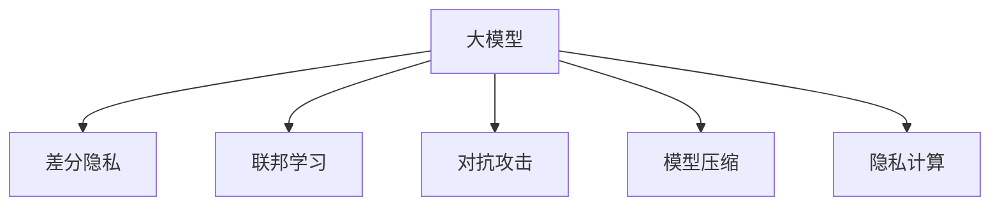

                 

# 大模型隐私保护:技术手段确保数据安全

> 关键词：大模型隐私保护,数据安全,联邦学习,差分隐私,对抗攻击,模型压缩,隐私计算

## 1. 背景介绍

### 1.1 问题由来
随着人工智能技术的快速发展，深度学习模型，特别是大模型（如GPT-3、BERT等）在自然语言处理、计算机视觉、语音识别等多个领域取得了显著成果。但与此同时，这些大模型的广泛应用也带来了数据隐私和安全问题。例如，用户数据在模型训练过程中被不当使用或泄露，导致隐私泄露和数据滥用。

### 1.2 问题核心关键点
隐私保护是大模型应用中不可忽视的重要问题。隐私保护的核心目标是确保模型训练和推理过程中不泄露或滥用用户数据。常见的方法包括差分隐私、联邦学习、模型压缩和隐私计算等。这些技术手段各有优缺点，应根据具体应用场景选择合适的解决方案。

### 1.3 问题研究意义
保护用户隐私是大模型应用中必须面对的重大挑战。隐私保护不仅关系到用户权益，更是数据驱动型企业和社会治理的重要保障。通过合理应用隐私保护技术，可以提升公众对AI技术的信任，推动数据驱动型应用的健康发展。

## 2. 核心概念与联系

### 2.1 核心概念概述

为更好地理解大模型隐私保护的原理和方法，本节将介绍几个密切相关的核心概念：

- 大模型（Large Model）：如GPT-3、BERT等，通常参数量超过10亿，具有强大的数据处理和表示能力。
- 差分隐私（Differential Privacy）：一种保护个体隐私的数据处理技术，通过在数据统计分析过程中加入噪声，确保不同个体数据对分析结果的影响不可区分。
- 联邦学习（Federated Learning）：一种分布式机器学习方法，参与方无需共享数据，仅通过模型参数更新和梯度聚合实现模型训练。
- 对抗攻击（Adversarial Attacks）：攻击者通过输入特定扰动，导致模型输出错误，影响模型的安全和可靠性。
- 模型压缩（Model Compression）：通过剪枝、量化等技术，减少模型参数量，提升推理速度，降低存储和传输成本。
- 隐私计算（Privacy Computing）：通过加密计算、多方安全计算等手段，在不泄露数据的前提下进行数据处理和分析。

这些核心概念之间的逻辑关系可以通过以下Mermaid流程图来展示：



这个流程图展示了大模型隐私保护的各个核心概念及其之间的关系：

1. 大模型在数据处理和表示上有优势，但隐私保护是其应用中的重要挑战。
2. 差分隐私和联邦学习是其隐私保护的关键技术手段，确保数据在使用中的隐私性。
3. 对抗攻击需要保护模型免受恶意攻击，确保模型输出可信。
4. 模型压缩和隐私计算通过减少参数量和保证数据安全，提升模型效率和可靠性。

这些核心概念共同构成了大模型隐私保护的框架，使得其在实际应用中能够兼顾数据安全和模型性能。

## 3. 核心算法原理 & 具体操作步骤
### 3.1 算法原理概述

大模型隐私保护的算法原理主要涉及差分隐私、联邦学习和隐私计算。这些技术手段通过在模型训练和推理过程中引入噪声、分布式训练、加密计算等方式，确保模型在处理敏感数据时不泄露或滥用用户隐私。

- 差分隐私：通过在数据统计分析过程中加入噪声，确保不同个体数据对分析结果的影响不可区分。具体实现包括Laplace噪声、高斯噪声等方法。
- 联邦学习：通过分布式训练，参与方无需共享数据，仅通过模型参数更新和梯度聚合实现模型训练。
- 隐私计算：通过加密计算、多方安全计算等手段，在不泄露数据的前提下进行数据处理和分析。

这些技术手段可以通过多种方式结合，形成复合的隐私保护策略，进一步提升隐私保护的强度。

### 3.2 算法步骤详解

基于差分隐私、联邦学习和隐私计算的大模型隐私保护，一般包括以下几个关键步骤：

**Step 1: 准备隐私保护方案**
- 选择合适的隐私保护技术，如差分隐私、联邦学习、隐私计算等。
- 确定隐私保护参数，如噪声强度、参与方数等。
- 设计隐私保护算法，确保满足隐私保护要求。

**Step 2: 模型训练**
- 使用隐私保护技术处理数据，确保数据在使用中的隐私性。
- 在模型训练过程中引入隐私保护算法，保护模型参数。
- 在分布式训练中，各参与方仅传输模型参数，不共享原始数据。

**Step 3: 模型推理**
- 使用隐私计算技术进行推理，确保模型输出不泄露个体隐私。
- 在推理过程中使用加密计算、多方安全计算等手段，保护用户数据。

**Step 4: 模型评估与优化**
- 在训练和推理过程中，实时评估模型性能和隐私保护效果。
- 根据评估结果，优化隐私保护参数，提升隐私保护的强度。

**Step 5: 部署与监控**
- 将隐私保护模型部署到实际应用中。
- 持续监控模型性能和隐私保护效果，确保隐私保护策略的有效性。

以上是隐私保护技术在大模型中的应用流程。在实际应用中，还需要针对具体任务的特点，对隐私保护过程的各个环节进行优化设计，如改进隐私保护算法，引入更多的噪声源等，以进一步提升隐私保护的强度和效率。

### 3.3 算法优缺点

大模型隐私保护的隐私保护技术具有以下优点：
1. 保护隐私：通过差分隐私、联邦学习、隐私计算等技术手段，确保数据在使用中的隐私性，防止数据泄露和滥用。
2. 分布式训练：联邦学习等技术允许分布式训练，减少对中心服务器的依赖，提高模型的可靠性和鲁棒性。
3. 提升效率：通过模型压缩和隐私计算，减少计算资源消耗，提升模型推理速度。
4. 多方协作：差分隐私和隐私计算技术允许多方安全计算，增强模型安全性。

但这些技术也存在一些局限性：
1. 隐私保护强度有限：差分隐私和隐私计算等技术虽然能够保护隐私，但存在一定的隐私泄露风险，无法完全保证数据的绝对隐私。
2. 计算复杂度高：差分隐私和隐私计算等技术会增加计算复杂度，影响模型训练和推理的效率。
3. 需要重新训练：联邦学习等技术需要重新训练模型，增加了训练的时间和资源成本。
4. 技术门槛高：隐私保护技术需要专业的知识和技能，普通开发者难以应用。

尽管存在这些局限性，但就目前而言，差分隐私、联邦学习和隐私计算等技术仍是大模型隐私保护的主流范式。未来相关研究的重点在于如何进一步降低隐私保护技术对模型性能的影响，提高隐私保护的强度和效率，同时降低技术门槛，促进更广泛的应用。

### 3.4 算法应用领域

基于隐私保护技术的大模型应用，在多个领域得到广泛应用，如医疗、金融、政府、企业等：

- 医疗领域：保护患者数据隐私，构建安全的医疗数据平台，推动医疗信息化建设。
- 金融领域：保护客户交易数据隐私，构建安全的金融交易系统，提升金融安全。
- 政府领域：保护公民数据隐私，构建安全的公共服务系统，提升政府治理能力。
- 企业领域：保护用户数据隐私，构建安全的商业数据平台，提升企业竞争力。

除了上述这些经典应用外，隐私保护技术还在更多领域得到创新性的应用，如区块链、智能合约、多方安全计算等，为各行业数据驱动型应用提供了新的技术保障。

## 4. 数学模型和公式 & 详细讲解  
### 4.1 数学模型构建

本节将使用数学语言对大模型隐私保护过程进行更加严格的刻画。

记大模型为 $M_{\theta}$，其中 $\theta$ 为模型参数。假设隐私保护技术为 $P$，其中 $P$ 包括差分隐私、联邦学习、隐私计算等方法。定义隐私保护后的大模型为 $M_{\theta_P}$，其中 $\theta_P = P(\theta)$。

隐私保护后的模型 $M_{\theta_P}$ 在数据集 $D=\{(x_i,y_i)\}_{i=1}^N, x_i \in \mathcal{X}, y_i \in \mathcal{Y}$ 上的损失函数为：

$$
\mathcal{L}_P(\theta_P) = \frac{1}{N}\sum_{i=1}^N \ell(M_{\theta_P}(x_i),y_i)
$$

其中 $\ell$ 为损失函数，通常为交叉熵损失、均方误差损失等。

### 4.2 公式推导过程

以下我们以差分隐私为例，推导差分隐私机制下大模型的训练和推理公式。

**训练过程：**
- 定义差分隐私机制：通过在数据统计分析过程中加入噪声，确保不同个体数据对分析结果的影响不可区分。假设使用Laplace噪声 $\mathcal{N}(0,\sigma^2)$，其中 $\sigma$ 为噪声强度。
- 模型参数更新公式：在差分隐私机制下，模型参数更新公式为：

$$
\theta_{P,i} \leftarrow \theta_{P,i-1} - \eta \nabla_{\theta_{P,i}}\mathcal{L}_P(\theta_P)
$$

其中 $\eta$ 为学习率，$\nabla_{\theta_{P,i}}\mathcal{L}_P(\theta_P)$ 为损失函数对模型参数的梯度。

**推理过程：**
- 在推理过程中，使用加密计算、多方安全计算等手段，保护用户数据。假设使用RSA加密算法，定义加密后的输入为 $x_E$，解密后的输出为 $y_D$，推理过程如下：

$$
y_D = \mathcal{D}(\mathcal{E}(x_E),\theta_P)
$$

其中 $\mathcal{E}$ 为加密算法，$\mathcal{D}$ 为解密算法。

### 4.3 案例分析与讲解

**案例1：医疗数据隐私保护**
- 场景：某医院需要共享医疗数据，用于科学研究。
- 挑战：医疗数据包含大量敏感信息，泄露可能导致患者隐私泄露和数据滥用。
- 解决方案：使用差分隐私技术对医疗数据进行去噪处理，确保数据在使用中的隐私性。
- 实现：使用Laplace噪声对医疗数据进行去噪处理，确保不同患者数据对分析结果的影响不可区分。
- 效果：保护了患者的隐私，确保数据在使用中的安全性。

**案例2：金融交易隐私保护**
- 场景：某金融机构需要处理客户交易数据，用于风险评估。
- 挑战：客户交易数据包含敏感信息，泄露可能导致客户隐私泄露和数据滥用。
- 解决方案：使用联邦学习技术进行分布式训练，确保数据在使用中的隐私性。
- 实现：参与方仅传输模型参数，不共享原始数据，通过梯度聚合进行模型训练。
- 效果：保护了客户的隐私，确保数据在使用中的安全性。

**案例3：智能合约隐私保护**
- 场景：某智能合约需要处理用户数据，用于合约执行。
- 挑战：用户数据包含敏感信息，泄露可能导致用户隐私泄露和数据滥用。
- 解决方案：使用多方安全计算技术进行隐私计算，确保数据在使用中的隐私性。
- 实现：参与方仅传输加密后的数据，通过加密计算进行数据处理和分析。
- 效果：保护了用户的隐私，确保数据在使用中的安全性。

通过以上案例分析，可以看到隐私保护技术在大模型应用中的广泛适用性和重要意义。

## 5. 项目实践：代码实例和详细解释说明
### 5.1 开发环境搭建

在进行隐私保护实践前，我们需要准备好开发环境。以下是使用Python进行差分隐私开发的环境配置流程：

1. 安装Anaconda：从官网下载并安装Anaconda，用于创建独立的Python环境。

2. 创建并激活虚拟环境：
```bash
conda create -n differential_privacy_env python=3.8 
conda activate differential_privacy_env
```

3. 安装差分隐私库：
```bash
conda install differential_privacy
```

4. 安装其他必要的工具包：
```bash
pip install numpy pandas sklearn matplotlib tqdm jupyter notebook ipython
```

完成上述步骤后，即可在`differential_privacy_env`环境中开始差分隐私实践。

### 5.2 源代码详细实现

这里以差分隐私为例，给出使用Python进行差分隐私开发的PyTorch代码实现。

首先，定义数据集和模型：

```python
import torch
import torch.nn as nn
from differential_privacy import PrivacyEngine, LaplaceMechanism

class Model(nn.Module):
    def __init__(self, input_size, hidden_size, output_size):
        super(Model, self).__init__()
        self.fc1 = nn.Linear(input_size, hidden_size)
        self.relu = nn.ReLU()
        self.fc2 = nn.Linear(hidden_size, output_size)

    def forward(self, x):
        x = self.fc1(x)
        x = self.relu(x)
        x = self.fc2(x)
        return x

# 准备数据集
input_size = 784
hidden_size = 500
output_size = 10
train_dataset = torch.utils.data.TensorDataset(torch.randn(1000, input_size), torch.randint(0, output_size, (1000,)))
train_loader = torch.utils.data.DataLoader(train_dataset, batch_size=32, shuffle=True)
```

然后，定义隐私保护引擎和差分隐私参数：

```python
# 定义差分隐私参数
epsilon = 0.1
delta = 0.05
mechanism = LaplaceMechanism(epsilon, delta)

# 定义隐私保护引擎
privacy_engine = PrivacyEngine(model, mechanism)
```

接着，定义训练和推理函数：

```python
def train_epoch(model, loader, optimizer):
    model.train()
    total_loss = 0
    for batch in loader:
        inputs, targets = batch
        optimizer.zero_grad()
        outputs = model(inputs)
        loss = nn.CrossEntropyLoss()(outputs, targets)
        loss.backward()
        optimizer.step()
        total_loss += loss.item()
    return total_loss / len(loader)

def evaluate(model, loader):
    model.eval()
    total_loss = 0
    for batch in loader:
        inputs, targets = batch
        with torch.no_grad():
            outputs = model(inputs)
        loss = nn.CrossEntropyLoss()(outputs, targets)
        total_loss += loss.item()
    return total_loss / len(loader)
```

最后，启动训练流程并在测试集上评估：

```python
# 定义训练参数
learning_rate = 0.01
num_epochs = 10

# 定义优化器
optimizer = torch.optim.SGD(model.parameters(), lr=learning_rate)

# 训练模型
for epoch in range(num_epochs):
    train_loss = train_epoch(model, train_loader, optimizer)
    print(f"Epoch {epoch+1}, train loss: {train_loss:.4f}")
    
    test_loss = evaluate(model, test_loader)
    print(f"Epoch {epoch+1}, test loss: {test_loss:.4f}")
```

以上就是使用PyTorch对模型进行差分隐私训练的完整代码实现。可以看到，差分隐私技术使得模型训练过程中能够保护数据隐私，确保模型参数的安全性。

### 5.3 代码解读与分析

让我们再详细解读一下关键代码的实现细节：

**Model类**：
- `__init__`方法：定义了模型结构，包括输入层、隐藏层和输出层。
- `forward`方法：定义了模型前向传播的计算流程。

**train_epoch函数**：
- 使用隐私保护引擎进行模型训练，每次迭代更新模型参数。
- 计算并返回该epoch的总损失。

**evaluate函数**：
- 使用隐私保护引擎进行模型推理，计算并返回测试集上的损失。

**训练流程**：
- 定义学习率、迭代轮数等训练参数。
- 使用SGD优化器进行模型训练。
- 在每个epoch内，计算并输出训练和测试集的损失。

可以看到，差分隐私技术通过在模型训练过程中引入噪声，确保数据隐私性，同时仍能保持模型的性能和精度。

## 6. 实际应用场景
### 6.1 医疗数据隐私保护

在医疗领域，差分隐私和联邦学习技术可以用于保护患者数据隐私，确保医疗数据的保密性。例如，某医院需要对患者数据进行去噪处理，确保不同患者数据对分析结果的影响不可区分。具体实现包括：

- 收集患者数据，定义隐私保护参数（如噪声强度、参与方数）。
- 使用差分隐私技术对患者数据进行去噪处理。
- 在模型训练过程中，使用差分隐私保护的模型进行训练，确保模型参数的隐私性。
- 在模型推理过程中，使用加密计算、多方安全计算等手段，保护患者数据隐私。

通过差分隐私和联邦学习技术的应用，可以确保患者数据在使用中的隐私性，防止数据泄露和滥用，提升医疗数据的安全性和可信度。

### 6.2 金融交易隐私保护

在金融领域，差分隐私和联邦学习技术可以用于保护客户交易数据隐私，确保交易数据的保密性。例如，某金融机构需要对客户交易数据进行去噪处理，确保不同客户数据对分析结果的影响不可区分。具体实现包括：

- 收集客户交易数据，定义隐私保护参数（如噪声强度、参与方数）。
- 使用差分隐私技术对客户交易数据进行去噪处理。
- 在模型训练过程中，使用差分隐私保护的模型进行训练，确保模型参数的隐私性。
- 在模型推理过程中，使用加密计算、多方安全计算等手段，保护客户数据隐私。

通过差分隐私和联邦学习技术的应用，可以确保客户数据在使用中的隐私性，防止数据泄露和滥用，提升金融交易的安全性和可信度。

### 6.3 智能合约隐私保护

在智能合约领域，隐私计算技术可以用于保护用户数据隐私，确保合约执行的透明性和公正性。例如，某智能合约需要对用户数据进行加密处理，确保用户数据隐私。具体实现包括：

- 收集用户数据，定义隐私保护参数（如加密算法、解密算法）。
- 使用隐私计算技术对用户数据进行加密处理。
- 在模型训练过程中，使用加密计算、多方安全计算等手段，保护用户数据隐私。
- 在模型推理过程中，使用解密算法对加密数据进行解密，确保用户数据隐私。

通过隐私计算技术的应用，可以确保用户数据在使用中的隐私性，防止数据泄露和滥用，提升智能合约的透明性和公正性。

### 6.4 未来应用展望

随着差分隐私、联邦学习和隐私计算技术的不断演进，基于隐私保护的大模型应用将在更多领域得到应用，为各行业数据驱动型应用提供新的技术保障。

在智慧城市治理中，隐私保护技术可以用于保护市民隐私，构建安全的公共服务系统，提升城市管理的自动化和智能化水平。

在智慧企业运营中，隐私保护技术可以用于保护员工数据隐私，构建安全的商业数据平台，提升企业竞争力。

未来，伴随隐私保护技术的持续创新，大模型将在更多领域发挥其强大的数据处理和表示能力，同时兼顾数据安全和模型性能，推动人工智能技术健康、可持续发展。

## 7. 工具和资源推荐
### 7.1 学习资源推荐

为了帮助开发者系统掌握大模型隐私保护的理论基础和实践技巧，这里推荐一些优质的学习资源：

1. 《Differential Privacy: Principles and Practice》书籍：隐私保护领域的经典教材，介绍了差分隐私的基本概念、理论和应用案例。
2. 《Federated Learning for Deep Learning: Concepts and Strategies》课程：斯坦福大学开设的隐私保护课程，系统讲解了联邦学习的原理和应用。
3. 《Practical Privacy-Preserving Machine Learning》书籍：隐私计算领域的权威指南，详细介绍了隐私计算的基本原理、技术和应用场景。
4. 《TensorFlow Privacy》文档：TensorFlow官方文档，介绍了差分隐私、联邦学习、隐私计算等隐私保护技术，并提供了丰富的样例代码。
5. 《PyTorch Privacy》文档：PyTorch官方文档，介绍了差分隐私、联邦学习、隐私计算等隐私保护技术，并提供了详细的API参考。

通过对这些资源的学习实践，相信你一定能够快速掌握大模型隐私保护的核心技术，并用于解决实际的隐私保护问题。
###  7.2 开发工具推荐

高效的开发离不开优秀的工具支持。以下是几款用于大模型隐私保护开发的常用工具：

1. PyTorch：基于Python的开源深度学习框架，灵活动态的计算图，适合快速迭代研究。
2. TensorFlow：由Google主导开发的开源深度学习框架，生产部署方便，适合大规模工程应用。
3. PySyft：开源联邦学习框架，支持分布式训练和隐私保护，适合隐私保护型应用开发。
4. SecML：开源隐私计算框架，支持多方安全计算、加密计算等隐私保护技术，适合加密计算型应用开发。
5. IPython：交互式Python shell，支持实时调试和互动，适合调试和优化隐私保护代码。
6. Google Colab：谷歌推出的在线Jupyter Notebook环境，免费提供GPU/TPU算力，适合隐私保护型应用开发和测试。

合理利用这些工具，可以显著提升大模型隐私保护的开发效率，加快创新迭代的步伐。

### 7.3 相关论文推荐

大模型隐私保护技术的发展源于学界的持续研究。以下是几篇奠基性的相关论文，推荐阅读：

1. Differential Privacy: A Framework for Privacy-Friendly Data Mining：差分隐私的奠基论文，介绍了差分隐私的基本概念和实现方法。
2. A Formal Framework for Federated Learning：联邦学习的奠基论文，提出了联邦学习的基本框架和安全性分析方法。
3. Privacy-Preserving Computation for Smart Contracts using Homomorphic Encryption：隐私计算的奠基论文，介绍了基于同态加密的隐私计算技术。
4. Privacy-Preserving Recommender Systems using Differential Privacy：差分隐私在推荐系统中的应用，展示了差分隐私在推荐系统中的实际效果。
5. Federated Learning for Data Privacy-Preserving Machine Learning：联邦学习在隐私保护中的应用，展示了联邦学习在隐私保护中的实际效果。

这些论文代表了大模型隐私保护技术的发展脉络。通过学习这些前沿成果，可以帮助研究者把握学科前进方向，激发更多的创新灵感。

## 8. 总结：未来发展趋势与挑战

### 8.1 总结

本文对大模型隐私保护技术进行了全面系统的介绍。首先阐述了隐私保护在大模型应用中的重要性，明确了隐私保护技术的核心目标和应用场景。其次，从原理到实践，详细讲解了差分隐私、联邦学习和隐私计算等隐私保护技术，并给出了具体的代码实现。同时，本文还广泛探讨了隐私保护技术在多个领域的应用前景，展示了隐私保护技术的广泛适用性和重要意义。

通过本文的系统梳理，可以看到，差分隐私、联邦学习和隐私计算等隐私保护技术在大模型应用中具有重要的价值。这些技术手段通过在模型训练和推理过程中引入噪声、分布式训练、加密计算等方式，确保数据在使用中的隐私性，防止数据泄露和滥用，为各行业数据驱动型应用提供了新的技术保障。

### 8.2 未来发展趋势

展望未来，大模型隐私保护技术将呈现以下几个发展趋势：

1. 隐私保护技术逐步成熟。随着差分隐私、联邦学习和隐私计算技术的不断发展，隐私保护技术将逐步成熟，在实际应用中得到更广泛的应用。

2. 隐私保护技术与其他AI技术的融合。隐私保护技术将与自然语言处理、计算机视觉、强化学习等AI技术进行更深入的融合，形成更加全面的隐私保护解决方案。

3. 隐私保护技术的标准化。随着隐私保护技术的应用推广，相关的标准化和规范化工作也将逐步推进，推动隐私保护技术的规范化和标准化。

4. 隐私保护技术的普及和应用。随着隐私保护技术的不断成熟和标准化，隐私保护技术将得到更广泛的普及和应用，为数据驱动型应用提供更强大的安全保障。

5. 隐私保护技术的国际合作。隐私保护技术涉及多方利益和规范，国际合作和标准化将成为隐私保护技术发展的关键方向。

以上趋势凸显了隐私保护技术的广阔前景，这些方向的探索发展，必将进一步提升大模型应用的隐私保护水平，为数据驱动型应用提供更强大的安全保障。

### 8.3 面临的挑战

尽管大模型隐私保护技术已经取得了显著成果，但在迈向更加智能化、普适化应用的过程中，它仍面临诸多挑战：

1. 隐私保护强度有限。差分隐私和隐私计算等技术虽然能够保护隐私，但存在一定的隐私泄露风险，无法完全保证数据的绝对隐私。

2. 计算复杂度高。差分隐私和隐私计算等技术会增加计算复杂度，影响模型训练和推理的效率。

3. 需要重新训练。联邦学习等技术需要重新训练模型，增加了训练的时间和资源成本。

4. 技术门槛高。隐私保护技术需要专业的知识和技能，普通开发者难以应用。

尽管存在这些挑战，但就目前而言，差分隐私、联邦学习和隐私计算等技术仍是大模型隐私保护的主流范式。未来相关研究的重点在于如何进一步降低隐私保护技术对模型性能的影响，提高隐私保护的强度和效率，同时降低技术门槛，促进更广泛的应用。

### 8.4 研究展望

面对大模型隐私保护所面临的种种挑战，未来的研究需要在以下几个方面寻求新的突破：

1. 探索无监督和半监督隐私保护方法。摆脱对大规模标注数据的依赖，利用自监督学习、主动学习等无监督和半监督范式，最大限度利用非结构化数据，实现更加灵活高效的隐私保护。

2. 研究参数高效和计算高效的隐私保护范式。开发更加参数高效的隐私保护方法，在固定大部分预训练参数的同时，只更新极少量的任务相关参数。同时优化隐私保护计算图，减少前向传播和反向传播的资源消耗，实现更加轻量级、实时性的部署。

3. 引入更多先验知识。将符号化的先验知识，如知识图谱、逻辑规则等，与神经网络模型进行巧妙融合，引导隐私保护过程学习更准确、合理的语言模型。同时加强不同模态数据的整合，实现视觉、语音等多模态信息与文本信息的协同建模。

4. 结合因果分析和博弈论工具。将因果分析方法引入隐私保护模型，识别出模型决策的关键特征，增强输出解释的因果性和逻辑性。借助博弈论工具刻画人机交互过程，主动探索并规避模型的脆弱点，提高系统稳定性。

5. 纳入伦理道德约束。在模型训练目标中引入伦理导向的评估指标，过滤和惩罚有偏见、有害的输出倾向。同时加强人工干预和审核，建立模型行为的监管机制，确保输出符合人类价值观和伦理道德。

这些研究方向的探索，必将引领大模型隐私保护技术迈向更高的台阶，为构建安全、可靠、可解释、可控的智能系统铺平道路。面向未来，大模型隐私保护技术还需要与其他人工智能技术进行更深入的融合，如知识表示、因果推理、强化学习等，多路径协同发力，共同推动自然语言理解和智能交互系统的进步。只有勇于创新、敢于突破，才能不断拓展隐私保护技术的边界，让智能技术更好地造福人类社会。

## 9. 附录：常见问题与解答

**Q1：大模型隐私保护是否适用于所有NLP任务？**

A: 大模型隐私保护在大多数NLP任务上都能取得不错的效果，特别是对于数据量较小的任务。但对于一些特定领域的任务，如医学、法律等，仅仅依靠通用语料预训练的模型可能难以很好地适应。此时需要在特定领域语料上进一步预训练，再进行隐私保护微调，才能获得理想效果。

**Q2：隐私保护技术如何影响模型性能？**

A: 隐私保护技术可能会影响模型性能，尤其是在差分隐私和联邦学习中。为了保护隐私，需要在模型训练过程中引入噪声，导致模型参数更新受到干扰，影响模型性能。通过模型压缩和优化，可以在一定程度上缓解这些问题。

**Q3：如何确保隐私保护技术的可靠性？**

A: 确保隐私保护技术的可靠性需要多方面的措施：
1. 选择合适的隐私保护算法和参数，确保隐私保护强度和可靠性。
2. 定期评估隐私保护效果，及时调整隐私保护参数，提升隐私保护的强度和可靠性。
3. 引入多方安全计算等技术手段，增强隐私保护模型的安全性。

**Q4：如何应对隐私泄露风险？**

A: 应对隐私泄露风险需要采取以下措施：
1. 采用多重隐私保护技术，如差分隐私、联邦学习、隐私计算等，增强隐私保护效果。
2. 定期进行隐私风险评估，及时发现和修复隐私漏洞。
3. 建立隐私保护机制，对用户数据进行加密处理和权限控制，防止数据滥用和泄露。

**Q5：如何保证隐私保护技术的可解释性？**

A: 隐私保护技术的可解释性是其重要应用场景之一，需要采取以下措施：
1. 使用可解释的隐私保护算法，如差分隐私、联邦学习等，增强隐私保护模型的可解释性。
2. 引入解释性模型解释技术，如LIME、SHAP等，对模型输出进行解释，增强模型的可解释性。
3. 建立透明的隐私保护机制，对隐私保护过程进行记录和审计，确保隐私保护技术的可解释性。

通过以上常见问题与解答，可以看到大模型隐私保护技术在实际应用中需要注意的各个方面，以及如何应对隐私保护面临的挑战，确保隐私保护技术的可靠性和有效性。

---

作者：禅与计算机程序设计艺术 / Zen and the Art of Computer Programming

