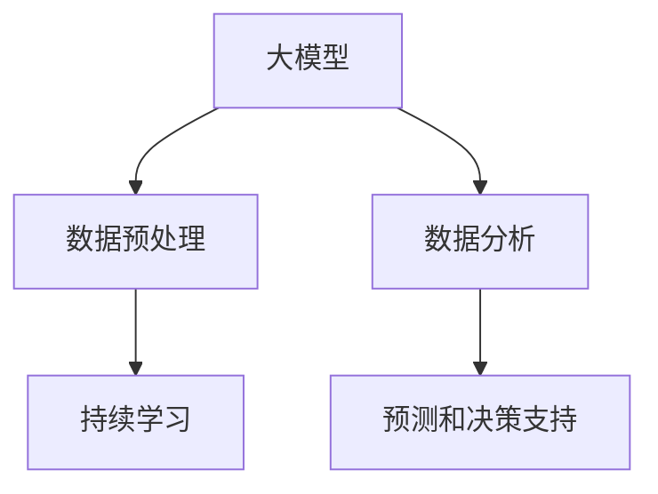

                 

# 大模型：推动商业智能的新技术

## 1. 背景介绍

### 1.1 问题由来
在快速发展的数字时代，数据驱动的决策已逐渐成为企业的核心竞争力。然而，数据的质量和量级往往超出了传统数据科学模型的处理能力。传统的数据分析方法基于统计学、机器学习等理论，其模型训练和预测依赖于人类对数据规律的理解，难以应对日益复杂的数据分布和巨量数据的挑战。

因此，大模型应运而生。基于深度学习的大模型，能够自适应地处理巨量数据，学习数据中复杂的关联和模式，显著提升了数据分析和决策的精度和效率。但大模型通常需要大量计算资源和数据进行预训练，难以大规模应用于商业智能系统中。

近年来，随着高性能计算的普及和预训练大模型的快速发展，商业智能领域开始利用大模型进行高效的数据分析和预测，这一趋势正在持续加速。如何有效利用大模型推动商业智能，成为当前研究的热点问题。

### 1.2 问题核心关键点
商业智能(Business Intelligence, BI)应用的核心在于对大规模数据进行高效分析，预测未来趋势，辅助决策制定。大模型的优势在于其强大的自适应能力，能够学习数据中的隐含模式，提供深度分析预测能力。

为实现这一目标，大模型需要在商业智能中发挥关键作用，主要体现在以下几个方面：

1. **数据预处理**：利用大模型对数据进行预处理和特征提取，增强数据质量，优化数据表示。
2. **数据分析**：使用大模型进行深度学习，挖掘数据中的关联和规律，提供深刻的洞见。
3. **预测和决策支持**：基于数据分析结果，使用大模型进行预测和决策优化，辅助管理决策。
4. **持续学习**：大模型能够实时更新，适应新的数据变化，保持业务分析的即时性和准确性。

### 1.3 问题研究意义
利用大模型推动商业智能，具有以下重要意义：

1. **提升分析效率**：大模型能够处理海量数据，快速得出分析结论，提升商业决策的效率。
2. **增强决策精准性**：基于深度学习的大模型，能够揭示数据中的隐含规律，提供更加精准的预测和决策支持。
3. **促进跨部门协作**：大模型能够集成多源数据，支持跨部门、跨业务场景的数据融合和分析，推动业务协同创新。
4. **赋能企业创新**：商业智能的大模型应用，能够实现业务的深度洞察，推动新产品、新服务和新模式的创新。

## 2. 核心概念与联系

### 2.1 核心概念概述

为更好地理解大模型在商业智能中的应用，本节将介绍几个关键概念：

- **大模型**：基于深度学习的大规模预训练模型，如BERT、GPT-3等。通过在大规模数据上进行预训练，学习数据中复杂的关联和模式，具备强大的自适应能力。
- **商业智能**：通过数据挖掘、统计分析和数据可视化等技术，将业务数据转换为有用的洞察和知识，辅助决策制定。
- **数据预处理**：对原始数据进行清洗、整理和特征提取，增强数据质量，优化数据表示。
- **数据分析**：通过深度学习等技术，从数据中挖掘关联和规律，提供深刻的洞见。
- **预测和决策支持**：基于数据分析结果，进行预测和决策优化，辅助管理决策。
- **持续学习**：大模型能够实时更新，适应新的数据变化，保持业务分析的即时性和准确性。

这些概念之间的逻辑关系可以通过以下Mermaid流程图来展示：



这个流程图展示了大模型在商业智能中的核心概念及其之间的关系：

1. 大模型通过预训练获得基础能力。
2. 数据预处理和持续学习增强数据质量，优化数据表示。
3. 数据分析利用大模型的自适应能力，挖掘数据中的关联和规律。
4. 预测和决策支持基于数据分析结果，提供深度洞察和优化建议。

这些概念共同构成了大模型在商业智能中的应用框架，使其能够提供强大的数据分析和决策支持能力。

## 3. 核心算法原理 & 具体操作步骤

### 3.1 算法原理概述

商业智能中应用大模型，主要通过以下步骤实现：

1. **数据预处理**：收集、整理和清洗原始数据，提取特征，构建模型训练所需的数据集。
2. **模型训练**：利用大模型对数据进行预训练，学习数据中的隐含模式和规律。
3. **数据分析**：对训练好的大模型进行微调或细调，以适应具体任务，获取更深层次的数据洞见。
4. **预测和决策支持**：利用微调后的模型进行预测和决策优化，辅助管理决策。
5. **持续学习**：定期更新模型参数，保持分析结果的即时性和准确性。

### 3.2 算法步骤详解

#### 3.2.1 数据预处理

商业智能应用中，数据预处理是至关重要的步骤。具体流程如下：

1. **数据收集**：从各个业务系统收集数据，包括但不限于销售数据、客户数据、市场数据等。
2. **数据清洗**：去除重复、错误和缺失数据，清洗数据异常点，保证数据质量。
3. **数据整合**：将来自不同业务系统的数据整合到一起，形成统一的视图。
4. **特征提取**：对数据进行特征工程，提取关键指标和特征，优化数据表示。

#### 3.2.2 模型训练

大模型训练通常需要大量的计算资源和时间，可以通过以下步骤优化：

1. **选择合适的模型**：根据任务需求，选择预训练模型（如BERT、GPT等）进行微调或细调。
2. **划分数据集**：将数据集分为训练集、验证集和测试集，一般要求训练集和验证集占总数据集的70-80%，测试集占20-30%。
3. **设置超参数**：调整学习率、批大小、迭代轮数等超参数，以优化模型性能。
4. **进行训练**：利用训练集对模型进行训练，同时利用验证集评估模型性能，防止过拟合。
5. **测试和评估**：在测试集上评估模型性能，根据实际需求进行微调和优化。

#### 3.2.3 数据分析

数据分析是大模型在商业智能中的核心应用。具体流程如下：

1. **任务适配层设计**：根据具体任务，设计适合的输出层和损失函数，如分类任务使用交叉熵损失函数。
2. **微调模型**：在训练好的大模型基础上，利用标注数据进行微调，优化模型针对特定任务的性能。
3. **深度分析**：利用微调后的模型进行深度学习，挖掘数据中的关联和规律，提供深刻的洞见。

#### 3.2.4 预测和决策支持

预测和决策支持是大模型在商业智能中的最终应用。具体流程如下：

1. **数据输入**：将新数据输入微调后的模型，获取预测结果。
2. **结果解释**：根据预测结果，提供可视化的洞察和建议，辅助管理决策。
3. **优化决策**：结合预测结果和业务经验，优化业务决策。

#### 3.2.5 持续学习

持续学习是大模型在商业智能中的重要特性。具体流程如下：

1. **数据更新**：定期更新数据集，增加新数据和新特征。
2. **模型更新**：利用新数据对模型进行重新训练，保持模型的时效性和准确性。
3. **业务协同**：将持续学习结果反馈到业务系统，实现跨部门的协同创新。

### 3.3 算法优缺点

利用大模型推动商业智能，具有以下优点：

1. **高效性**：大模型能够高效处理海量数据，快速得出分析结论，提升商业决策的效率。
2. **精准性**：基于深度学习的大模型，能够揭示数据中的隐含规律，提供更加精准的预测和决策支持。
3. **可扩展性**：大模型能够集成多源数据，支持跨部门、跨业务场景的数据融合和分析，推动业务协同创新。
4. **灵活性**：大模型能够实时更新，适应新的数据变化，保持业务分析的即时性和准确性。

同时，该方法也存在一定的局限性：

1. **数据质量要求高**：大模型需要高质量的数据进行预训练和微调，数据质量影响模型性能。
2. **计算资源需求高**：大模型训练和推理需要大量的计算资源和时间，对硬件资源有较高要求。
3. **模型可解释性不足**：大模型的决策过程通常缺乏可解释性，难以对其推理逻辑进行分析和调试。

尽管存在这些局限性，但大模型在商业智能中的应用已展现出巨大的潜力，未来仍有进一步优化的空间。

### 3.4 算法应用领域

大模型在商业智能中的应用领域广泛，主要包括以下几个方面：

1. **销售预测**：通过分析历史销售数据，预测未来销售趋势，辅助库存管理和销售决策。
2. **客户分析**：利用客户行为数据，挖掘客户需求和偏好，提供个性化的产品推荐和服务。
3. **市场洞察**：分析市场数据和竞争对手动态，洞察市场趋势，制定市场策略。
4. **运营优化**：利用运营数据，优化供应链管理、生产计划和物流调度，提升运营效率。
5. **风险管理**：分析财务和市场数据，评估风险和不确定性，制定风险控制策略。

除了这些常见的应用领域，大模型在金融、医疗、教育等众多领域也有广泛的应用，推动了各行业的数字化转型和智能化升级。

## 4. 数学模型和公式 & 详细讲解  
### 4.1 数学模型构建

假设大模型为 $M_{\theta}$，数据集为 $D=\{(x_i,y_i)\}_{i=1}^N$，其中 $x_i$ 为输入数据，$y_i$ 为标注标签。商业智能中的大模型应用，可以通过以下数学模型构建：

1. **数据预处理**：对原始数据进行清洗、整合和特征提取，构建模型训练所需的数据集。
2. **模型训练**：利用训练集 $D_{train}$ 对大模型 $M_{\theta}$ 进行预训练，最小化损失函数 $\mathcal{L}_{train}$。
3. **数据分析**：对训练好的大模型进行微调或细调，最小化损失函数 $\mathcal{L}_{fine-tune}$。
4. **预测和决策支持**：利用微调后的模型对新数据 $x_{test}$ 进行预测，获取预测结果 $\hat{y}$。
5. **持续学习**：利用新数据 $D_{update}$ 对模型进行重新训练，最小化损失函数 $\mathcal{L}_{update}$。

### 4.2 公式推导过程

以销售预测任务为例，假设模型 $M_{\theta}$ 在输入 $x$ 上的输出为 $\hat{y}=M_{\theta}(x)$，真实标签 $y$ 为销售量。则二分类交叉熵损失函数定义为：

$$
\ell(M_{\theta}(x),y) = -[y\log \hat{y} + (1-y)\log (1-\hat{y})]
$$

在训练集 $D_{train}$ 上，经验风险为：

$$
\mathcal{L}_{train}(\theta) = \frac{1}{N}\sum_{i=1}^N \ell(M_{\theta}(x_i),y_i)
$$

在微调集 $D_{fine-tune}$ 上，经验风险为：

$$
\mathcal{L}_{fine-tune}(\theta) = \frac{1}{N}\sum_{i=1}^N \ell(M_{\theta}(x_i),y_i)
$$

在更新集 $D_{update}$ 上，经验风险为：

$$
\mathcal{L}_{update}(\theta) = \frac{1}{N}\sum_{i=1}^N \ell(M_{\theta}(x_i),y_i)
$$

通过梯度下降等优化算法，最小化上述损失函数，即可更新模型参数 $\theta$。在数据预处理阶段，还需要进行特征工程，将原始数据转化为适合模型训练的格式。

### 4.3 案例分析与讲解

#### 4.3.1 销售预测案例

假设某电商平台需要预测下一季度的销售额，原始数据包括历史销售数据、促销活动、季节性因素等。具体实现步骤如下：

1. **数据收集**：从平台数据库中收集历史销售数据，包括日期、销售量、商品类别等信息。
2. **数据清洗**：去除重复、错误和缺失数据，清洗数据异常点，保证数据质量。
3. **数据整合**：将来自不同业务系统的数据整合到一起，形成统一的视图。
4. **特征提取**：提取关键指标和特征，如日期、促销活动、季节性因素等。
5. **模型训练**：选择BERT模型作为基础模型，对数据进行预训练，最小化损失函数 $\mathcal{L}_{train}$。
6. **数据分析**：对训练好的BERT模型进行微调，最小化损失函数 $\mathcal{L}_{fine-tune}$。
7. **预测和决策支持**：利用微调后的模型对新数据进行预测，获取预测结果 $\hat{y}$。
8. **持续学习**：定期更新数据集，对模型进行重新训练，最小化损失函数 $\mathcal{L}_{update}$。

通过以上步骤，电商平台能够快速准确地预测下一季度的销售额，优化库存管理和销售策略。

## 5. 项目实践：代码实例和详细解释说明

### 5.1 开发环境搭建

在进行商业智能应用开发前，我们需要准备好开发环境。以下是使用Python进行PyTorch开发的环境配置流程：

1. 安装Anaconda：从官网下载并安装Anaconda，用于创建独立的Python环境。

2. 创建并激活虚拟环境：
```bash
conda create -n pytorch-env python=3.8 
conda activate pytorch-env
```

3. 安装PyTorch：根据CUDA版本，从官网获取对应的安装命令。例如：
```bash
conda install pytorch torchvision torchaudio cudatoolkit=11.1 -c pytorch -c conda-forge
```

4. 安装Transformers库：
```bash
pip install transformers
```

5. 安装各类工具包：
```bash
pip install numpy pandas scikit-learn matplotlib tqdm jupyter notebook ipython
```

完成上述步骤后，即可在`pytorch-env`环境中开始商业智能应用的开发。

### 5.2 源代码详细实现

这里我们以销售预测任务为例，给出使用Transformers库对BERT模型进行微调的PyTorch代码实现。

首先，定义数据处理函数：

```python
from transformers import BertTokenizer
from torch.utils.data import Dataset
import torch

class SalesDataset(Dataset):
    def __init__(self, data, tokenizer, max_len=128):
        self.data = data
        self.tokenizer = tokenizer
        self.max_len = max_len
        
    def __len__(self):
        return len(self.data)
    
    def __getitem__(self, item):
        row = self.data[item]
        label = row[-1]  # 销售量
        
        text = row[:-1]  # 去除最后一列
        encoding = self.tokenizer(text, return_tensors='pt', max_length=self.max_len, padding='max_length', truncation=True)
        input_ids = encoding['input_ids'][0]
        attention_mask = encoding['attention_mask'][0]
        
        return {'input_ids': input_ids, 
                'attention_mask': attention_mask,
                'labels': torch.tensor(label, dtype=torch.long)}
```

然后，定义模型和优化器：

```python
from transformers import BertForRegression, AdamW

model = BertForRegression.from_pretrained('bert-base-cased')

optimizer = AdamW(model.parameters(), lr=2e-5)
```

接着，定义训练和评估函数：

```python
from torch.utils.data import DataLoader
from tqdm import tqdm

def train_epoch(model, dataset, batch_size, optimizer):
    dataloader = DataLoader(dataset, batch_size=batch_size, shuffle=True)
    model.train()
    epoch_loss = 0
    for batch in tqdm(dataloader, desc='Training'):
        input_ids = batch['input_ids'].to(device)
        attention_mask = batch['attention_mask'].to(device)
        labels = batch['labels'].to(device)
        model.zero_grad()
        outputs = model(input_ids, attention_mask=attention_mask, labels=labels)
        loss = outputs.loss
        epoch_loss += loss.item()
        loss.backward()
        optimizer.step()
    return epoch_loss / len(dataloader)

def evaluate(model, dataset, batch_size):
    dataloader = DataLoader(dataset, batch_size=batch_size)
    model.eval()
    preds, labels = [], []
    with torch.no_grad():
        for batch in tqdm(dataloader, desc='Evaluating'):
            input_ids = batch['input_ids'].to(device)
            attention_mask = batch['attention_mask'].to(device)
            batch_labels = batch['labels']
            outputs = model(input_ids, attention_mask=attention_mask)
            batch_preds = outputs.logits.tolist()
            batch_labels = batch_labels.tolist()
            for pred, label in zip(batch_preds, batch_labels):
                preds.append(pred)
                labels.append(label)
                
    print('Mean Absolute Error:', mean_absolute_error(labels, preds))
```

最后，启动训练流程并在测试集上评估：

```python
epochs = 5
batch_size = 16

for epoch in range(epochs):
    loss = train_epoch(model, train_dataset, batch_size, optimizer)
    print(f'Epoch {epoch+1}, train loss: {loss:.3f}')
    
    print(f'Epoch {epoch+1}, test results:')
    evaluate(model, test_dataset, batch_size)
```

以上就是使用PyTorch对BERT进行销售预测任务微调的完整代码实现。可以看到，得益于Transformers库的强大封装，我们可以用相对简洁的代码完成BERT模型的加载和微调。

### 5.3 代码解读与分析

让我们再详细解读一下关键代码的实现细节：

**SalesDataset类**：
- `__init__`方法：初始化数据集、分词器等关键组件。
- `__len__`方法：返回数据集的样本数量。
- `__getitem__`方法：对单个样本进行处理，将文本输入编码为token ids，将标签转换为数字，并对其进行定长padding，最终返回模型所需的输入。

**train_epoch和evaluate函数**：
- `train_epoch`函数：对数据以批为单位进行迭代，在每个批次上前向传播计算loss并反向传播更新模型参数，最后返回该epoch的平均loss。
- `evaluate`函数：与训练类似，不同点在于不更新模型参数，并在每个batch结束后将预测和标签结果存储下来，最后使用自定义的MAE指标输出结果。

**训练流程**：
- 定义总的epoch数和batch size，开始循环迭代
- 每个epoch内，先在训练集上训练，输出平均loss
- 在测试集上评估，输出MAE指标

可以看到，PyTorch配合Transformers库使得BERT微调的代码实现变得简洁高效。开发者可以将更多精力放在数据处理、模型改进等高层逻辑上，而不必过多关注底层的实现细节。

当然，工业级的系统实现还需考虑更多因素，如模型的保存和部署、超参数的自动搜索、更灵活的任务适配层等。但核心的微调范式基本与此类似。

## 6. 实际应用场景
### 6.1 智能客服系统

基于大模型微调的对话技术，可以广泛应用于智能客服系统的构建。传统客服往往需要配备大量人力，高峰期响应缓慢，且一致性和专业性难以保证。而使用微调后的对话模型，可以7x24小时不间断服务，快速响应客户咨询，用自然流畅的语言解答各类常见问题。

在技术实现上，可以收集企业内部的历史客服对话记录，将问题和最佳答复构建成监督数据，在此基础上对预训练对话模型进行微调。微调后的对话模型能够自动理解用户意图，匹配最合适的答案模板进行回复。对于客户提出的新问题，还可以接入检索系统实时搜索相关内容，动态组织生成回答。如此构建的智能客服系统，能大幅提升客户咨询体验和问题解决效率。

### 6.2 金融舆情监测

金融机构需要实时监测市场舆论动向，以便及时应对负面信息传播，规避金融风险。传统的人工监测方式成本高、效率低，难以应对网络时代海量信息爆发的挑战。基于大模型微调的文本分类和情感分析技术，为金融舆情监测提供了新的解决方案。

具体而言，可以收集金融领域相关的新闻、报道、评论等文本数据，并对其进行主题标注和情感标注。在此基础上对预训练语言模型进行微调，使其能够自动判断文本属于何种主题，情感倾向是正面、中性还是负面。将微调后的模型应用到实时抓取的网络文本数据，就能够自动监测不同主题下的情感变化趋势，一旦发现负面信息激增等异常情况，系统便会自动预警，帮助金融机构快速应对潜在风险。

### 6.3 个性化推荐系统

当前的推荐系统往往只依赖用户的历史行为数据进行物品推荐，无法深入理解用户的真实兴趣偏好。基于大语言模型微调技术，个性化推荐系统可以更好地挖掘用户行为背后的语义信息，从而提供更精准、多样的推荐内容。

在实践中，可以收集用户浏览、点击、评论、分享等行为数据，提取和用户交互的物品标题、描述、标签等文本内容。将文本内容作为模型输入，用户的后续行为（如是否点击、购买等）作为监督信号，在此基础上微调预训练语言模型。微调后的模型能够从文本内容中准确把握用户的兴趣点。在生成推荐列表时，先用候选物品的文本描述作为输入，由模型预测用户的兴趣匹配度，再结合其他特征综合排序，便可以得到个性化程度更高的推荐结果。

### 6.4 未来应用展望

随着大语言模型微调技术的不断发展，基于微调范式将在更多领域得到应用，为传统行业带来变革性影响。

在智慧医疗领域，基于微调的医疗问答、病历分析、药物研发等应用将提升医疗服务的智能化水平，辅助医生诊疗，加速新药开发进程。

在智能教育领域，微调技术可应用于作业批改、学情分析、知识推荐等方面，因材施教，促进教育公平，提高教学质量。

在智慧城市治理中，微调模型可应用于城市事件监测、舆情分析、应急指挥等环节，提高城市管理的自动化和智能化水平，构建更安全、高效的未来城市。

此外，在企业生产、社会治理、文娱传媒等众多领域，基于大模型微调的人工智能应用也将不断涌现，为经济社会发展注入新的动力。相信随着技术的日益成熟，微调方法将成为人工智能落地应用的重要范式，推动人工智能技术在垂直行业的规模化落地。

## 7. 工具和资源推荐
### 7.1 学习资源推荐

为了帮助开发者系统掌握大语言模型微调的理论基础和实践技巧，这里推荐一些优质的学习资源：

1. 《Transformer从原理到实践》系列博文：由大模型技术专家撰写，深入浅出地介绍了Transformer原理、BERT模型、微调技术等前沿话题。

2. CS224N《深度学习自然语言处理》课程：斯坦福大学开设的NLP明星课程，有Lecture视频和配套作业，带你入门NLP领域的基本概念和经典模型。

3. 《Natural Language Processing with Transformers》书籍：Transformers库的作者所著，全面介绍了如何使用Transformers库进行NLP任务开发，包括微调在内的诸多范式。

4. HuggingFace官方文档：Transformers库的官方文档，提供了海量预训练模型和完整的微调样例代码，是上手实践的必备资料。

5. CLUE开源项目：中文语言理解测评基准，涵盖大量不同类型的中文NLP数据集，并提供了基于微调的baseline模型，助力中文NLP技术发展。

通过对这些资源的学习实践，相信你一定能够快速掌握大语言模型微调的精髓，并用于解决实际的NLP问题。
###  7.2 开发工具推荐

高效的开发离不开优秀的工具支持。以下是几款用于大语言模型微调开发的常用工具：

1. PyTorch：基于Python的开源深度学习框架，灵活动态的计算图，适合快速迭代研究。大部分预训练语言模型都有PyTorch版本的实现。

2. TensorFlow：由Google主导开发的开源深度学习框架，生产部署方便，适合大规模工程应用。同样有丰富的预训练语言模型资源。

3. Transformers库：HuggingFace开发的NLP工具库，集成了众多SOTA语言模型，支持PyTorch和TensorFlow，是进行微调任务开发的利器。

4. Weights & Biases：模型训练的实验跟踪工具，可以记录和可视化模型训练过程中的各项指标，方便对比和调优。与主流深度学习框架无缝集成。

5. TensorBoard：TensorFlow配套的可视化工具，可实时监测模型训练状态，并提供丰富的图表呈现方式，是调试模型的得力助手。

6. Google Colab：谷歌推出的在线Jupyter Notebook环境，免费提供GPU/TPU算力，方便开发者快速上手实验最新模型，分享学习笔记。

合理利用这些工具，可以显著提升大语言模型微调任务的开发效率，加快创新迭代的步伐。

### 7.3 相关论文推荐

大语言模型和微调技术的发展源于学界的持续研究。以下是几篇奠基性的相关论文，推荐阅读：

1. Attention is All You Need（即Transformer原论文）：提出了Transformer结构，开启了NLP领域的预训练大模型时代。

2. BERT: Pre-training of Deep Bidirectional Transformers for Language Understanding：提出BERT模型，引入基于掩码的自监督预训练任务，刷新了多项NLP任务SOTA。

3. Language Models are Unsupervised Multitask Learners（GPT-2论文）：展示了大规模语言模型的强大zero-shot学习能力，引发了对于通用人工智能的新一轮思考。

4. Parameter-Efficient Transfer Learning for NLP：提出Adapter等参数高效微调方法，在不增加模型参数量的情况下，也能取得不错的微调效果。

5. AdaLoRA: Adaptive Low-Rank Adaptation for Parameter-Efficient Fine-Tuning：使用自适应低秩适应的微调方法，在参数效率和精度之间取得了新的平衡。

这些论文代表了大语言模型微调技术的发展脉络。通过学习这些前沿成果，可以帮助研究者把握学科前进方向，激发更多的创新灵感。

## 8. 总结：未来发展趋势与挑战

### 8.1 总结

本文对大模型在商业智能中的应用进行了全面系统的介绍。首先阐述了大模型和微调技术的研究背景和意义，明确了微调在拓展预训练模型应用、提升商业智能性能方面的独特价值。其次，从原理到实践，详细讲解了微调的数学原理和关键步骤，给出了微调任务开发的完整代码实例。同时，本文还广泛探讨了微调方法在智能客服、金融舆情、个性化推荐等多个行业领域的应用前景，展示了微调范式的巨大潜力。此外，本文精选了微调技术的各类学习资源，力求为读者提供全方位的技术指引。

通过本文的系统梳理，可以看到，基于大模型的微调方法正在成为商业智能应用的重要范式，极大地拓展了预训练语言模型的应用边界，催生了更多的落地场景。受益于大规模语料的预训练，微调模型以更低的时间和标注成本，在小样本条件下也能取得不俗的效果，有力推动了商业智能技术的产业化进程。未来，伴随预训练语言模型和微调方法的持续演进，相信NLP技术将在更广阔的应用领域大放异彩，深刻影响人类的生产生活方式。

### 8.2 未来发展趋势

展望未来，大模型微调技术将呈现以下几个发展趋势：

1. **模型规模持续增大**：随着算力成本的下降和数据规模的扩张，预训练语言模型的参数量还将持续增长。超大规模语言模型蕴含的丰富语言知识，有望支撑更加复杂多变的商业智能任务。

2. **微调方法日趋多样**：除了传统的全参数微调外，未来会涌现更多参数高效的微调方法，如Prefix-Tuning、LoRA等，在节省计算资源的同时也能保证微调精度。

3. **持续学习成为常态**：随着数据分布的不断变化，微调模型也需要持续学习新知识以保持性能。如何在不遗忘原有知识的同时，高效吸收新样本信息，将成为重要的研究课题。

4. **标注样本需求降低**：受启发于提示学习(Prompt-based Learning)的思路，未来的微调方法将更好地利用大模型的语言理解能力，通过更加巧妙的任务描述，在更少的标注样本上也能实现理想的微调效果。

5. **多模态微调崛起**：当前的微调主要聚焦于纯文本数据，未来会进一步拓展到图像、视频、语音等多模态数据微调。多模态信息的融合，将显著提升语言模型对现实世界的理解和建模能力。

6. **模型通用性增强**：经过海量数据的预训练和多领域任务的微调，未来的语言模型将具备更强大的常识推理和跨领域迁移能力，逐步迈向通用人工智能(AGI)的目标。

以上趋势凸显了大模型微调技术的广阔前景。这些方向的探索发展，必将进一步提升商业智能系统的性能和应用范围，为人类认知智能的进化带来深远影响。

### 8.3 面临的挑战

尽管大模型微调技术已经取得了瞩目成就，但在迈向更加智能化、普适化应用的过程中，它仍面临着诸多挑战：

1. **数据质量要求高**：大模型需要高质量的数据进行预训练和微调，数据质量影响模型性能。
2. **计算资源需求高**：大模型训练和推理需要大量的计算资源和时间，对硬件资源有较高要求。
3. **模型可解释性不足**：大模型的决策过程通常缺乏可解释性，难以对其推理逻辑进行分析和调试。
4. **持续学习效果差**：大模型在持续学习过程中，容易出现灾难性遗忘，难以保持模型的时效性和准确性。

尽管存在这些局限性，但大模型在商业智能中的应用已展现出巨大的潜力，未来仍有进一步优化的空间。

### 8.4 未来突破

面对大模型微调面临的种种挑战，未来的研究需要在以下几个方面寻求新的突破：

1. **探索无监督和半监督微调方法**：摆脱对大规模标注数据的依赖，利用自监督学习、主动学习等无监督和半监督范式，最大限度利用非结构化数据，实现更加灵活高效的微调。

2. **研究参数高效和计算高效的微调范式**：开发更加参数高效的微调方法，在固定大部分预训练参数的同时，只更新极少量的任务相关参数。同时优化微调模型的计算图，减少前向传播和反向传播的资源消耗，实现更加轻量级、实时性的部署。

3. **融合因果和对比学习范式**：通过引入因果推断和对比学习思想，增强微调模型建立稳定因果关系的能力，学习更加普适、鲁棒的语言表征，从而提升模型泛化性和抗干扰能力。

4. **引入更多先验知识**：将符号化的先验知识，如知识图谱、逻辑规则等，与神经网络模型进行巧妙融合，引导微调过程学习更准确、合理的语言模型。同时加强不同模态数据的整合，实现视觉、语音等多模态信息与文本信息的协同建模。

5. **结合因果分析和博弈论工具**：将因果分析方法引入微调模型，识别出模型决策的关键特征，增强输出解释的因果性和逻辑性。借助博弈论工具刻画人机交互过程，主动探索并规避模型的脆弱点，提高系统稳定性。

6. **纳入伦理道德约束**：在模型训练目标中引入伦理导向的评估指标，过滤和惩罚有偏见、有害的输出倾向。同时加强人工干预和审核，建立模型行为的监管机制，确保输出符合人类价值观和伦理道德。

这些研究方向的探索，必将引领大语言模型微调技术迈向更高的台阶，为构建安全、可靠、可解释、可控的智能系统铺平道路。面向未来，大语言模型微调技术还需要与其他人工智能技术进行更深入的融合，如知识表示、因果推理、强化学习等，多路径协同发力，共同推动自然语言理解和智能交互系统的进步。只有勇于创新、敢于突破，才能不断拓展语言模型的边界，让智能技术更好地造福人类社会。

## 9. 附录：常见问题与解答

**Q1：大模型微调是否适用于所有商业智能任务？**

A: 大模型微调在大多数商业智能任务上都能取得不错的效果，特别是对于数据量较小的任务。但对于一些特定领域的任务，如医疗、法律等，仅仅依靠通用语料预训练的模型可能难以很好地适应。此时需要在特定领域语料上进一步预训练，再进行微调，才能获得理想效果。此外，对于一些需要时效性、个性化很强的任务，如对话、推荐等，微调方法也需要针对性的改进优化。

**Q2：微调过程中如何选择合适的学习率？**

A: 微调的学习率一般要比预训练时小1-2个数量级，如果使用过大的学习率，容易破坏预训练权重，导致过拟合。一般建议从1e-5开始调参，逐步减小学习率，直至收敛。也可以使用warmup策略，在开始阶段使用较小的学习率，再逐渐过渡到预设值。需要注意的是，不同的优化器(如AdamW、Adafactor等)以及不同的学习率调度策略，可能需要设置不同的学习率阈值。

**Q3：采用大模型微调时会面临哪些资源瓶颈？**

A: 目前主流的预训练大模型动辄以亿计的参数规模，对算力、内存、存储都提出了很高的要求。GPU/TPU等高性能设备是必不可少的，但即便如此，超大批次的训练和推理也可能遇到显存不足的问题。因此需要采用一些资源优化技术，如梯度积累、混合精度训练、模型并行等，来突破硬件瓶颈。同时，模型的存储和读取也可能占用大量时间和空间，需要采用模型压缩、稀疏化存储等方法进行优化。

**Q4：如何缓解微调过程中的过拟合问题？**

A: 过拟合是微调面临的主要挑战，尤其是在标注数据不足的情况下。常见的缓解策略包括：
1. 数据增强：通过回译、近义替换等方式扩充训练集
2. 正则化：使用L2正则、Dropout、Early Stopping等避免过拟合
3. 对抗训练：引入对抗样本，提高模型鲁棒性
4. 参数高效微调：只调整少量参数(如Adapter、Prefix等)，减小过拟合风险
5. 多模型集成：训练多个微调模型，取平均输出，抑制过拟合

这些策略往往需要根据具体任务和数据特点进行灵活组合。只有在数据、模型、训练、推理等各环节进行全面优化，才能最大限度地发挥大模型微调的威力。

**Q5：大模型微调在实际应用中需要注意哪些问题？**

A: 将微调模型转化为实际应用，还需要考虑以下因素：
1. 模型裁剪：去除不必要的层和参数，减小模型尺寸，加快推理速度
2. 量化加速：将浮点模型转为定点模型，压缩存储空间，提高计算效率
3. 服务化封装：将模型封装为标准化服务接口，便于集成调用
4. 弹性伸缩：根据请求流量动态调整资源配置，平衡服务质量和成本
5. 监控告警：实时采集系统指标，设置异常告警阈值，确保服务稳定性
6. 安全防护：采用访问鉴权、数据脱敏等措施，保障数据和模型安全

大模型微调为商业智能应用带来了新的机遇，但如何将强大的性能转化为稳定、高效、安全的业务价值，还需要工程实践的不断打磨。唯有从数据、算法、工程、业务等多个维度协同发力，才能真正实现人工智能技术在垂直行业的规模化落地。总之，微调需要开发者根据具体任务，不断迭代和优化模型、数据和算法，方能得到理想的效果。

---

作者：禅与计算机程序设计艺术 / Zen and the Art of Computer Programming

