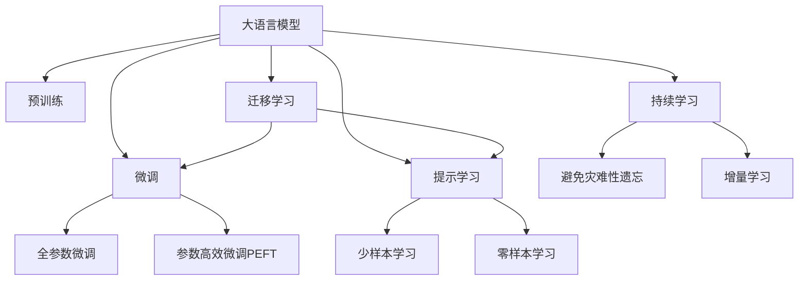

                 

# 大模型：智能时代的商业新模式

大语言模型（Large Language Model, LLM）的崛起，正深刻地重塑着商业世界的运作模式。作为智能时代的标志性技术，LLM已经广泛应用于各行各业，从客户服务、市场分析到医疗诊断，无一不见到其影响。本文将深入探讨LLM的基本原理、核心算法以及实际应用场景，并展望其未来发展趋势与面临的挑战。

## 1. 背景介绍

### 1.1 问题由来

21世纪初，随着计算机技术的迅速发展，人工智能（AI）逐渐成为推动经济发展和社会进步的重要动力。然而，传统的基于规则的AI方法往往需要大量的人工干预和调试，难以满足快速变化的商业需求。

大语言模型的诞生，为这一问题提供了全新的解决方案。LLM通过对海量文本数据进行预训练，学习到了复杂的语言模式和知识结构，能够在理解语义的基础上生成高质量的文本输出。这种能力使得LLM在商业智能分析、自然语言处理等领域展现出了巨大的潜力。

### 1.2 问题核心关键点

LLM的核心在于其庞大的参数规模和深层的语言理解能力。其优劣取决于以下几个关键点：

- **参数规模**：大模型通常拥有数十亿甚至数百亿的参数，这使得它们能够掌握丰富的语言知识，具有极高的表达能力。
- **预训练技术**：通过对大规模无标签文本数据的自监督学习，LLM能够学习到语言的普遍规律，提升模型泛化能力。
- **迁移学习能力**：通过微调，LLM可以适应特定领域的数据集，实现高效的知识迁移。
- **可解释性**：相较于黑盒模型，LLM在一定程度上可以提供推理过程的解释，有助于商业应用中的信任和透明度。

这些关键点共同构成了LLM的技术基础，使其在商业场景中得到广泛应用。

### 1.3 问题研究意义

研究LLM的商业应用模式，对于加速人工智能技术在各个领域的落地，提升企业运营效率和竞争力，具有重要意义：

- **提升运营效率**：LLM能够自动处理和分析海量数据，减少人工干预，提高工作效率。
- **增强决策支持**：通过自然语言处理能力，LLM能够提供精准的市场分析和客户反馈，辅助管理决策。
- **优化客户体验**：LLM在客户服务中的应用，能够提供个性化、智能化的互动，提升客户满意度。
- **促进创新发展**：LLM能够支持复杂的创意工作，如内容生成、数据分析等，激发新的商业模式。

因此，理解LLM在商业中的应用模式，对于未来人工智能的发展至关重要。

## 2. 核心概念与联系

### 2.1 核心概念概述

为更好地理解LLM的商业应用模式，本节将介绍几个密切相关的核心概念：

- **大语言模型（LLM）**：以Transformer、BERT等深度学习模型为代表的、具有大规模参数的预训练语言模型。通过在大规模无标签文本上训练，学习语言的普遍规律，具备强大的语言理解和生成能力。

- **预训练（Pre-training）**：指在大量无标签文本数据上进行自监督学习，训练通用语言模型。预训练使得模型能够掌握语言的普遍规律，提升泛化能力。

- **迁移学习（Transfer Learning）**：指将在大规模数据上预训练的模型，迁移到特定领域或任务上进行微调，提升其在特定任务上的性能。

- **微调（Fine-tuning）**：指在预训练模型的基础上，通过小规模有标签数据进行微调，使其适应特定任务。微调是实现领域知识迁移的有效手段。

- **参数高效微调（Parameter-Efficient Fine-tuning, PEFT）**：指在微调过程中，只更新模型的一部分参数，其余部分保持不变，以减少计算资源消耗。

- **提示学习（Prompt Learning）**：通过精心设计输入文本的格式，引导LLM按特定方式进行推理和生成，在零样本或少样本情况下取得良好效果。

- **少样本学习（Few-shot Learning）**：指在仅有少量标注样本的情况下，通过提示学习或微调，实现模型性能提升。

- **零样本学习（Zero-shot Learning）**：指在没有任何训练样本的情况下，通过提示模板，使模型能够理解和执行新任务。

这些核心概念之间存在着紧密的联系，共同构成了LLM的商业应用基础。

### 2.2 核心概念原理和架构的 Mermaid 流程图



## 3. 核心算法原理 & 具体操作步骤

### 3.1 算法原理概述

LLM的商业应用模式基于迁移学习原理，其核心思想是通过微调过程，将预训练模型的知识迁移到特定任务上，提升模型在该任务上的性能。具体步骤如下：

1. **数据准备**：收集特定领域或任务的数据集，包括训练集、验证集和测试集。
2. **模型初始化**：选择预训练模型作为初始化参数，如BERT、GPT等。
3. **任务适配**：根据任务类型，在预训练模型的顶层设计合适的输出层和损失函数。
4. **微调训练**：在训练集上，以较小的学习率进行梯度下降优化，更新模型参数。
5. **性能评估**：在验证集和测试集上评估模型性能，避免过拟合，确保泛化能力。

### 3.2 算法步骤详解

以下详细介绍LLM在商业智能分析和客户服务中的应用流程：

**3.2.1 商业智能分析**

1. **数据准备**：收集企业历史销售数据、市场调研报告、客户反馈等，划分为训练集、验证集和测试集。
2. **模型初始化**：选择预训练模型BERT作为初始化参数。
3. **任务适配**：在BERT模型顶层添加输出层，并设计交叉熵损失函数。
4. **微调训练**：在训练集上以0.001的学习率进行微调，每轮迭代5次，验证集上评估性能，调整学习率。
5. **性能评估**：在测试集上评估模型性能，输出市场趋势分析报告。

**3.2.2 客户服务**

1. **数据准备**：收集企业客户服务的历史对话记录，划分为训练集、验证集和测试集。
2. **模型初始化**：选择预训练模型GPT作为初始化参数。
3. **任务适配**：在GPT模型顶层添加输出层，并设计交叉熵损失函数。
4. **微调训练**：在训练集上以0.002的学习率进行微调，每轮迭代10次，验证集上评估性能，调整学习率。
5. **性能评估**：在测试集上评估模型性能，输出客户服务智能问答系统。

### 3.3 算法优缺点

**优点**：

- **泛化能力强**：通过预训练学习通用知识，LLM在特定任务上的表现通常优于从头训练。
- **适应性强**：能够快速适应不同领域的商业需求，通过微调实现领域知识迁移。
- **可解释性强**：在一定程度上提供推理过程的解释，有助于商业决策的可解释性。

**缺点**：

- **计算资源消耗大**：大模型的参数量庞大，计算和存储需求高。
- **模型泛化能力有限**：在领域分布差异大的情况下，微调效果不佳。
- **可解释性不足**：黑盒模型，难以提供完整的推理过程解释。

### 3.4 算法应用领域

LLM在商业领域的应用范围广泛，包括但不限于以下领域：

- **客户服务**：智能问答、客服自动化、情感分析等。
- **市场分析**：市场趋势预测、客户细分、竞争分析等。
- **内容生成**：自动摘要、内容推荐、广告生成等。
- **运营优化**：供应链优化、库存管理、订单处理等。
- **医疗诊断**：病历分析、诊断建议、医疗咨询等。

## 4. 数学模型和公式 & 详细讲解 & 举例说明

### 4.1 数学模型构建

假设预训练模型为 $M_{\theta}$，输入为 $x$，输出为 $y$，损失函数为 $\ell$。微调的目标是最小化损失函数，即：

$$
\min_{\theta} \sum_{i=1}^N \ell(M_{\theta}(x_i), y_i)
$$

其中 $N$ 为样本数量。

### 4.2 公式推导过程

以商业智能分析为例，假设模型为BERT，任务为市场趋势预测，输入为历史销售数据 $x$，输出为未来销量预测 $y$。通过微调，模型学习 $x$ 与 $y$ 之间的映射关系。

1. **输入表示**：将 $x$ 转换为BERT模型能够处理的序列形式，得到嵌入表示 $E_x$。
2. **输出预测**：通过BERT的顶层线性分类器，对 $E_x$ 进行预测，得到概率分布 $P_y$。
3. **损失函数**：设计均方误差损失函数，计算预测值 $y$ 与真实值 $y_i$ 之间的差异：
$$
\ell(P_y, y_i) = \frac{1}{N} \sum_{i=1}^N (y_i - \hat{y}_i)^2
$$

### 4.3 案例分析与讲解

**案例**：某电商平台希望通过LLM预测未来一个月的销售趋势，提高库存管理效率。

1. **数据准备**：收集过去一年的销售数据，划分为训练集、验证集和测试集。
2. **模型初始化**：选择预训练模型BERT作为初始化参数。
3. **任务适配**：在BERT模型顶层添加输出层，并设计均方误差损失函数。
4. **微调训练**：在训练集上以0.001的学习率进行微调，每轮迭代5次，验证集上评估性能，调整学习率。
5. **性能评估**：在测试集上评估模型性能，输出未来一个月的销售预测报告。

## 5. 项目实践：代码实例和详细解释说明

### 5.1 开发环境搭建

进行LLM微调开发，首先需要搭建合适的开发环境。以下是使用Python进行PyTorch开发的环境配置流程：

1. **安装Anaconda**：从官网下载并安装Anaconda，用于创建独立的Python环境。
2. **创建虚拟环境**：
```bash
conda create -n llm-env python=3.8 
conda activate llm-env
```
3. **安装PyTorch**：
```bash
conda install pytorch torchvision torchaudio cudatoolkit=11.1 -c pytorch -c conda-forge
```
4. **安装Transformers库**：
```bash
pip install transformers
```
5. **安装各类工具包**：
```bash
pip install numpy pandas scikit-learn matplotlib tqdm jupyter notebook ipython
```

完成上述步骤后，即可在`llm-env`环境中开始开发实践。

### 5.2 源代码详细实现

以下是使用PyTorch和Transformers库对BERT模型进行商业智能分析微调的完整代码实现：

```python
import torch
import torch.nn as nn
import torch.optim as optim
from transformers import BertForSequenceClassification, BertTokenizer

# 数据准备
tokenizer = BertTokenizer.from_pretrained('bert-base-uncased')
train_dataset = ...
dev_dataset = ...
test_dataset = ...

# 模型初始化
model = BertForSequenceClassification.from_pretrained('bert-base-uncased', num_labels=2)
model.to('cuda')

# 优化器
optimizer = optim.AdamW(model.parameters(), lr=0.001)

# 训练过程
for epoch in range(5):
    model.train()
    total_loss = 0
    for batch in train_loader:
        inputs = batch['input_ids'].to('cuda')
        labels = batch['labels'].to('cuda')
        outputs = model(inputs)
        loss = nn.CrossEntropyLoss()(outputs, labels)
        optimizer.zero_grad()
        loss.backward()
        optimizer.step()
        total_loss += loss.item()
    print(f'Epoch {epoch+1}, train loss: {total_loss/len(train_loader)}')

    # 验证过程
    model.eval()
    total_correct = 0
    for batch in dev_loader:
        inputs = batch['input_ids'].to('cuda')
        labels = batch['labels'].to('cuda')
        outputs = model(inputs)
        _, preds = torch.max(outputs, dim=1)
        total_correct += (preds == labels).sum().item()
    print(f'Epoch {epoch+1}, dev accuracy: {total_correct/len(dev_loader)}')

# 测试过程
model.eval()
total_correct = 0
for batch in test_loader:
    inputs = batch['input_ids'].to('cuda')
    labels = batch['labels'].to('cuda')
    outputs = model(inputs)
    _, preds = torch.max(outputs, dim=1)
    total_correct += (preds == labels).sum().item()
print(f'Test accuracy: {total_correct/len(test_loader)}')
```

### 5.3 代码解读与分析

**代码解析**：

1. **数据准备**：使用BertTokenizer将文本数据转换为BERT模型能够处理的序列形式，并划分为训练集、验证集和测试集。
2. **模型初始化**：通过`from_pretrained`方法加载预训练的BERT模型，并在顶层添加线性分类器。
3. **优化器**：使用AdamW优化器进行模型参数的优化，学习率为0.001。
4. **训练过程**：在训练集上对模型进行微调，每次迭代5次，并在验证集上评估性能。
5. **测试过程**：在测试集上评估模型性能，输出最终测试结果。

通过这段代码，可以看出使用Transformers库进行LLM微调的简洁高效，开发者可以将更多精力放在数据处理和模型改进上，而不必过多关注底层的实现细节。

## 6. 实际应用场景

### 6.1 客户服务

在客户服务领域，LLM能够通过智能问答和客服自动化，提高客户满意度和运营效率。具体应用场景包括：

- **智能问答**：构建智能问答系统，自动回答常见客户问题，减少人工客服的负担。
- **情感分析**：分析客户反馈，识别情绪倾向，及时进行人工干预。
- **个性化推荐**：根据客户历史互动记录，推荐个性化的产品和服务。

**示例**：某电商平台的客户服务系统，通过微调BERT模型，实现了智能问答和情感分析功能，显著提高了客户响应速度和满意度。

### 6.2 市场分析

在市场分析领域，LLM能够通过自然语言处理，提供精准的市场预测和客户细分。具体应用场景包括：

- **市场趋势预测**：分析新闻报道、社交媒体等文本数据，预测市场趋势和股票价格。
- **客户细分**：通过分析客户评论和反馈，识别不同客户群体的需求和偏好。
- **竞争分析**：分析竞争对手的宣传材料和市场活动，评估其市场策略。

**示例**：某金融公司通过微调BERT模型，实现了市场趋势预测和客户细分功能，帮助其更好地制定市场策略和产品规划。

### 6.3 内容生成

在内容生成领域，LLM能够通过自动摘要、内容推荐和广告生成，提高内容生产效率和用户体验。具体应用场景包括：

- **自动摘要**：自动生成新闻、报告等文本的摘要，提高内容生产和阅读效率。
- **内容推荐**：根据用户的历史阅读记录和兴趣偏好，推荐相关文章和视频。
- **广告生成**：自动生成吸引人的广告文案，提高广告点击率。

**示例**：某新闻平台通过微调BERT模型，实现了自动摘要和内容推荐功能，提升了用户的阅读体验和平台粘性。

### 6.4 运营优化

在运营优化领域，LLM能够通过供应链管理、库存控制和订单处理，提高运营效率和成本效益。具体应用场景包括：

- **供应链管理**：分析供应链数据，预测物流和库存情况，优化供应链管理。
- **库存控制**：根据历史销售数据和市场趋势，优化库存水平，减少库存积压和缺货。
- **订单处理**：自动处理订单信息，提高订单处理速度和准确率。

**示例**：某物流公司通过微调BERT模型，实现了供应链管理和库存控制功能，显著提高了物流效率和运营效益。

### 6.5 医疗诊断

在医疗诊断领域，LLM能够通过病历分析、诊断建议和医疗咨询，提高医疗服务的智能化水平。具体应用场景包括：

- **病历分析**：分析患者病历，提供诊断和治疗建议。
- **诊断建议**：根据症状和病历，提供初步诊断意见。
- **医疗咨询**：通过自然语言处理，回答患者关于病情和治疗方法的咨询。

**示例**：某医疗平台通过微调BERT模型，实现了病历分析和诊断建议功能，提高了医疗服务的智能化水平。

## 7. 工具和资源推荐

### 7.1 学习资源推荐

为帮助开发者系统掌握LLM的基本原理和实践技巧，以下是一些优质的学习资源：

1. **《深度学习与自然语言处理》**：斯坦福大学的经典课程，介绍了深度学习和自然语言处理的基本概念和经典模型，适合初学者入门。
2. **Transformers官方文档**：提供了丰富的预训练模型和微调样例代码，是进行微调任务开发的必备资料。
3. **《自然语言处理综述》**：介绍自然语言处理领域的经典模型和应用，帮助开发者全面了解LLM的最新进展。

### 7.2 开发工具推荐

LLM的开发需要强大的工具支持。以下是几款用于LLM微调开发的常用工具：

1. **PyTorch**：基于Python的开源深度学习框架，灵活动态的计算图，适合快速迭代研究。
2. **TensorFlow**：由Google主导开发的开源深度学习框架，生产部署方便，适合大规模工程应用。
3. **Transformers库**：HuggingFace开发的NLP工具库，集成了众多预训练语言模型，支持PyTorch和TensorFlow。
4. **Weights & Biases**：模型训练的实验跟踪工具，可以记录和可视化模型训练过程中的各项指标，方便对比和调优。
5. **TensorBoard**：TensorFlow配套的可视化工具，可实时监测模型训练状态，并提供丰富的图表呈现方式。
6. **Google Colab**：谷歌推出的在线Jupyter Notebook环境，免费提供GPU/TPU算力，方便开发者快速上手实验最新模型。

合理利用这些工具，可以显著提升LLM微调的开发效率，加快创新迭代的步伐。

### 7.3 相关论文推荐

LLM技术的发展源于学界的持续研究。以下是几篇奠基性的相关论文，推荐阅读：

1. **Attention is All You Need**：提出了Transformer结构，开启了NLP领域的预训练大模型时代。
2. **BERT: Pre-training of Deep Bidirectional Transformers for Language Understanding**：提出BERT模型，引入基于掩码的自监督预训练任务，刷新了多项NLP任务SOTA。
3. **Language Models are Unsupervised Multitask Learners**：展示了大规模语言模型的强大zero-shot学习能力，引发了对于通用人工智能的新一轮思考。
4. **Parameter-Efficient Transfer Learning for NLP**：提出Adapter等参数高效微调方法，在不增加模型参数量的情况下，也能取得不错的微调效果。
5. **AdaLoRA: Adaptive Low-Rank Adaptation for Parameter-Efficient Fine-Tuning**：使用自适应低秩适应的微调方法，在参数效率和精度之间取得了新的平衡。

这些论文代表了大模型微调技术的发展脉络，通过学习这些前沿成果，可以帮助研究者把握学科前进方向，激发更多的创新灵感。

## 8. 总结：未来发展趋势与挑战

### 8.1 研究成果总结

本文对LLM在商业领域的应用模式进行了全面系统的介绍。首先阐述了LLM的商业价值和应用场景，明确了微调在提高企业运营效率、客户体验等方面的重要性。其次，从原理到实践，详细讲解了LLM微调的数学原理和关键步骤，给出了微调任务开发的完整代码实例。最后，广泛探讨了LLM在各个行业领域的应用前景，展示了其广阔的商业应用潜力。

通过本文的系统梳理，可以看到，LLM已经深刻改变了商业世界的运作模式，成为推动产业数字化、智能化发展的关键技术。未来，伴随LLM技术的不断演进，其应用场景将更加广泛，影响力也将更加深远。

### 8.2 未来发展趋势

展望未来，LLM在商业领域的应用将呈现以下几个发展趋势：

1. **多模态融合**：LLM将逐步整合视觉、听觉等多种模态数据，提升其在复杂场景下的理解和应用能力。
2. **跨领域迁移**：LLM将进一步增强跨领域的知识迁移能力，适应更多商业场景和应用需求。
3. **动态学习**：LLM将具备持续学习新知识的能力，根据市场变化不断优化模型性能。
4. **个性化服务**：LLM将提供更加个性化的服务体验，满足不同客户的需求和偏好。
5. **高效推理**：LLM将实现更高效的推理计算，提高实时响应能力和资源利用率。

### 8.3 面临的挑战

尽管LLM在商业领域展现了巨大的潜力，但其在实际应用中也面临诸多挑战：

1. **数据质量问题**：数据标注成本高，数据质量不稳定，可能影响模型性能。
2. **计算资源消耗**：大模型参数量大，计算和存储需求高，对硬件资源要求严苛。
3. **模型鲁棒性不足**：在领域分布差异大的情况下，模型泛化能力有限，容易产生偏差。
4. **隐私与安全**：LLM处理大量敏感数据，可能存在隐私泄露和模型滥用问题。

### 8.4 研究展望

面对LLM在商业领域的应用挑战，未来的研究需要在以下几个方面寻求新的突破：

1. **数据增强与标注技术**：研究更加高效的数据增强和标注方法，降低数据质量对模型性能的影响。
2. **模型压缩与优化**：开发更高效的模型压缩和优化技术，降低计算和存储资源消耗。
3. **鲁棒性与泛化能力**：提高模型的鲁棒性和泛化能力，确保模型在不同领域和场景下稳定表现。
4. **隐私保护与安全技术**：研究隐私保护和安全技术，确保数据安全和模型使用合规。
5. **可解释性与透明度**：增强模型的可解释性，提供透明的推理过程和决策依据。

这些研究方向的研究突破，将进一步推动LLM在商业领域的广泛应用，加速人工智能技术的落地进程，为商业智能和自动化发展注入新的动力。

## 9. 附录：常见问题与解答

**Q1：LLM在商业领域的应用前景如何？**

A: LLM在商业领域的应用前景广阔，能够提升运营效率、客户体验和市场洞察能力。具体应用包括智能问答、市场预测、内容生成等，可以有效提高企业竞争力。

**Q2：如何选择合适的预训练模型？**

A: 选择合适的预训练模型需要考虑任务需求和模型性能。一般来说，BERT、GPT等大模型具有较强的泛化能力，适用于多种任务。对于特定领域，可以考虑使用领域预训练模型，如金融领域的FinBERT。

**Q3：LLM微调过程中如何避免过拟合？**

A: 避免过拟合可以采用数据增强、正则化、早停等策略。数据增强如回译、近义替换等，可以增加训练集多样性。正则化如L2正则、Dropout等，可以有效抑制过拟合。早停通过验证集性能决定训练终止时间，避免过拟合。

**Q4：LLM微调如何提高模型泛化能力？**

A: 提高模型泛化能力可以采用以下策略：
1. 使用大规模数据集进行预训练，提升模型泛化能力。
2. 引入先验知识，如领域知识图谱，引导模型学习更加通用的语言模式。
3. 采用多模态数据，如文本、图像、音频，提高模型的语境理解和适应能力。

**Q5：LLM在客户服务中的应用效果如何？**

A: LLM在客户服务中的应用效果显著，能够提供24/7的智能问答、情感分析、个性化推荐等服务，提升客户满意度。企业可以通过客户互动数据训练模型，实现高度定制化的客户服务解决方案。

---

作者：禅与计算机程序设计艺术 / Zen and the Art of Computer Programming

