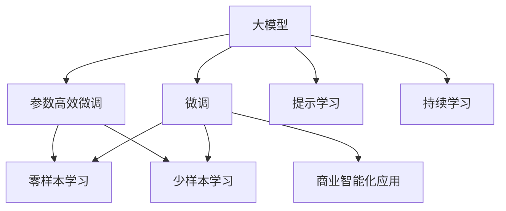

                 

# 大模型：未来商业的智能化转型

## 1. 背景介绍

在人工智能(AI)迅猛发展的今天，大模型正在重新定义商业智能化的未来。大模型以其强大的语言处理能力、泛化能力及多任务学习特性，在自然语言处理(NLP)、计算机视觉、推荐系统、智能客服等领域大放异彩，极大地提升了业务智能化水平和运营效率。

### 1.1 问题由来

近年来，大模型研究已经取得了显著进展。例如，OpenAI的GPT系列模型、Google的BERT等，已经在多个基准测试中刷新了最先进的性能指标。这些模型通过在大规模无标签数据上自监督预训练，学到了丰富的语言表示和常识知识。然而，大模型直接应用于特定商业场景时，往往需要大量的定制化开发，且存在推理效率低、成本高等问题。如何充分利用大模型的泛化能力，进行更高效的商业智能化转型，成为一个值得深入探讨的问题。

### 1.2 问题核心关键点

本文聚焦于大模型在商业智能化转型中的应用。探讨如何通过大模型的微调、参数高效微调、提示学习等方法，将通用大模型适配到具体的商业场景中，以较低的成本、较高的效率实现商业智能化转型。此外，本文还将讨论大模型的可持续发展和面临的挑战。

### 1.3 问题研究意义

研究大模型在商业智能化中的应用，对于推动企业智能化转型，提升运营效率，降低人力和运营成本，具有重要意义：

1. **提升业务智能化水平**：通过大模型自动化处理大量业务数据，提高决策的科学性和准确性。
2. **降低智能开发成本**：利用大模型快速适配新业务场景，减少人力和资源的投入。
3. **加速业务创新**：帮助企业快速响应市场变化，抓住商业机会，保持竞争优势。
4. **提高运营效率**：通过大模型自动化处理复杂业务流程，提升作业效率，减少人工干预。
5. **赋能产业升级**：大模型为各行各业带来智能化的解决方案，加速数字化转型进程。

本文从理论到实践，探讨了基于大模型的商业智能化转型方法，希望能对业界提供有价值的参考。

## 2. 核心概念与联系

### 2.1 核心概念概述

为了更好地理解大模型在商业智能化转型中的应用，我们首先介绍几个关键概念：

- **大模型(Large Models)**：以BERT、GPT等深度学习模型为代表，通过在大规模无标签数据上进行自监督预训练，学习到丰富的语言表示和常识知识，具备强大的泛化能力和多任务学习能力。
- **微调(Fine-Tuning)**：在预训练模型基础上，使用业务场景中的少量标注数据，有监督地优化模型在特定业务任务上的性能。
- **参数高效微调(Parameter-Efficient Fine-Tuning, PEFT)**：只更新少量模型参数，而固定大部分预训练参数，提高微调效率。
- **提示学习(Prompt Learning)**：通过精心设计输入文本格式，引导模型按期望方式输出，减少微调参数，实现零样本或少样本学习。
- **持续学习(Continual Learning)**：模型能够持续从新数据中学习，同时保持已学习的知识，避免灾难性遗忘。

这些概念之间存在着紧密的联系，它们共同构成了大模型在商业智能化转型中的应用框架，如图1所示。



图1：大模型在商业智能化应用中的关键概念联系

通过这一框架，我们能够更加系统地理解大模型在商业智能化转型中的价值和应用方法。

## 3. 核心算法原理 & 具体操作步骤
### 3.1 算法原理概述

基于大模型的商业智能化转型，本质上是一种有监督的微调过程。其核心思想是：将预训练的大模型视作一种强大的“特征提取器”，通过有监督地训练来优化模型在特定业务任务上的性能，从而实现商业智能化转型。

具体而言，假设预训练模型为 $M_{\theta}$，其中 $\theta$ 为模型参数。给定业务场景 $S$ 的标注数据集 $D=\{(x_i,y_i)\}_{i=1}^N$，其中 $x_i$ 为输入数据，$y_i$ 为任务标签，如文本分类、实体识别、推荐系统等。微调的目标是找到新的模型参数 $\hat{\theta}$，使得模型在新的业务场景中能够输出期望的结果。

微调过程可以概括为以下步骤：

1. **预训练模型准备**：选择合适的预训练模型，如BERT、GPT系列等。
2. **任务适配层设计**：根据业务任务类型，设计合适的任务适配层和损失函数。
3. **微调参数优化**：选择合适的优化算法及超参数，如学习率、批大小、迭代轮数等，优化模型参数。
4. **训练与验证**：在标注数据集上执行梯度训练，并在验证集上评估模型性能。
5. **部署与优化**：使用微调后的模型进行业务场景推理预测，根据实际效果进行模型优化。

### 3.2 算法步骤详解

#### 3.2.1 预训练模型准备

选择合适的预训练模型是商业智能化转型的第一步。常用的预训练模型包括BERT、GPT-3、T5等，这些模型在多个NLP基准测试中表现优异。

```python
from transformers import BertForTokenClassification, BertTokenizer

model = BertForTokenClassification.from_pretrained('bert-base-cased')
tokenizer = BertTokenizer.from_pretrained('bert-base-cased')
```

#### 3.2.2 任务适配层设计

根据具体业务任务，设计任务适配层和损失函数。例如，对于文本分类任务，可设计线性分类器，使用交叉熵损失函数。

```python
from torch.utils.data import DataLoader
from transformers import BertForTokenClassification, AdamW

model = BertForTokenClassification.from_pretrained('bert-base-cased', num_labels=2)

criterion = nn.CrossEntropyLoss()
optimizer = AdamW(model.parameters(), lr=1e-5)
```

#### 3.2.3 微调参数优化

选择合适的优化算法及超参数，如学习率、批大小、迭代轮数等。以下是代码示例：

```python
def train(model, dataloader, criterion, optimizer, device):
    model.to(device)
    model.train()
    for batch in dataloader:
        input_ids, attention_mask, labels = batch
        input_ids, attention_mask, labels = input_ids.to(device), attention_mask.to(device), labels.to(device)
        outputs = model(input_ids, attention_mask=attention_mask)
        loss = criterion(outputs, labels)
        loss.backward()
        optimizer.step()
        optimizer.zero_grad()
```

#### 3.2.4 训练与验证

在标注数据集上执行梯度训练，并在验证集上评估模型性能。

```python
def evaluate(model, dataloader, criterion, device):
    model.eval()
    total_loss = 0
    for batch in dataloader:
        input_ids, attention_mask, labels = batch
        input_ids, attention_mask, labels = input_ids.to(device), attention_mask.to(device), labels.to(device)
        outputs = model(input_ids, attention_mask=attention_mask)
        loss = criterion(outputs, labels)
        total_loss += loss.item()
    return total_loss / len(dataloader)
```

#### 3.2.5 部署与优化

使用微调后的模型进行业务场景推理预测，根据实际效果进行模型优化。

```python
def predict(model, input_text, device):
    tokenizer = BertTokenizer.from_pretrained('bert-base-cased')
    inputs = tokenizer(input_text, return_tensors='pt')
    input_ids = inputs['input_ids'].to(device)
    attention_mask = inputs['attention_mask'].to(device)
    outputs = model(input_ids, attention_mask=attention_mask)
    predictions = torch.argmax(outputs.logits, dim=1)
    return predictions
```

### 3.3 算法优缺点

基于大模型的商业智能化转型具有以下优点：

1. **高效适配**：通过微调，可以快速适配业务场景，提升决策精度。
2. **泛化能力强**：大模型具有强大的泛化能力，适用于多种业务场景。
3. **资源节省**：利用大模型进行微调，可以避免从头开发和大量数据准备。
4. **模型灵活**：可以通过微调和提示学习等方法，灵活适应不同业务需求。

然而，这一方法也存在一些缺点：

1. **依赖标注数据**：微调效果依赖标注数据的质量和数量，获取高质量标注数据成本较高。
2. **模型可解释性不足**：大模型的决策过程难以解释，不透明。
3. **性能提升有限**：当业务任务与预训练数据的分布差异较大时，微调效果可能有限。

## 4. 数学模型和公式 & 详细讲解
### 4.1 数学模型构建

基于大模型的商业智能化转型，通常使用监督学习的微调方法。假设业务场景 $S$ 的标注数据集为 $D=\{(x_i,y_i)\}_{i=1}^N$，其中 $x_i$ 为输入数据，$y_i$ 为任务标签。目标是最小化损失函数 $\mathcal{L}$：

$$
\mathcal{L}(\theta) = \frac{1}{N}\sum_{i=1}^N \ell(M_{\theta}(x_i),y_i)
$$

其中 $\ell$ 为任务损失函数，如交叉熵、均方误差等。

### 4.2 公式推导过程

假设模型 $M_{\theta}$ 在输入 $x$ 上的输出为 $\hat{y}$，真实标签为 $y$，则交叉熵损失函数为：

$$
\ell(M_{\theta}(x),y) = -[y\log \hat{y} + (1-y)\log(1-\hat{y})]
$$

在标注数据集上，经验风险为：

$$
\mathcal{L}(\theta) = \frac{1}{N}\sum_{i=1}^N [y_i\log M_{\theta}(x_i)+(1-y_i)\log(1-M_{\theta}(x_i))]
$$

最小化经验风险，求得最优参数 $\theta^*$：

$$
\theta^* = \mathop{\arg\min}_{\theta} \mathcal{L}(\theta)
$$

### 4.3 案例分析与讲解

以文本分类任务为例，详细讲解数学模型构建和损失函数推导过程。

假设模型 $M_{\theta}$ 在输入 $x$ 上的输出为 $\hat{y}$，真实标签为 $y$，则交叉熵损失函数为：

$$
\ell(M_{\theta}(x),y) = -[y\log \hat{y} + (1-y)\log(1-\hat{y})]
$$

在标注数据集上，经验风险为：

$$
\mathcal{L}(\theta) = \frac{1}{N}\sum_{i=1}^N [y_i\log M_{\theta}(x_i)+(1-y_i)\log(1-M_{\theta}(x_i))]
$$

最小化经验风险，求得最优参数 $\theta^*$：

$$
\theta^* = \mathop{\arg\min}_{\theta} \mathcal{L}(\theta)
$$

## 5. 项目实践：代码实例和详细解释说明
### 5.1 开发环境搭建

开发环境搭建是商业智能化转型的基础。以下是一个基本的开发环境搭建示例：

```python
# 安装Python环境
# 创建虚拟环境
conda create -n business-env python=3.7
conda activate business-env

# 安装深度学习库
pip install torch torchvision torchaudio transformers

# 安装业务数据处理库
pip install pandas numpy sklearn

# 安装可视化工具
pip install matplotlib
```

### 5.2 源代码详细实现

以下是使用PyTorch进行商业智能化转型的代码示例：

```python
import torch
from torch.utils.data import DataLoader
from transformers import BertForTokenClassification, BertTokenizer
from torch.nn import CrossEntropyLoss
from transformers import AdamW

# 定义模型和超参数
device = 'cuda' if torch.cuda.is_available() else 'cpu'
model = BertForTokenClassification.from_pretrained('bert-base-cased', num_labels=2)
tokenizer = BertTokenizer.from_pretrained('bert-base-cased')
criterion = CrossEntropyLoss()
optimizer = AdamW(model.parameters(), lr=1e-5)

# 定义数据处理函数
def preprocess_data(texts, labels):
    inputs = tokenizer(texts, padding=True, truncation=True, max_length=128, return_tensors='pt')
    return inputs, labels

# 定义训练和验证函数
def train(model, dataloader, criterion, optimizer, device):
    model.to(device)
    model.train()
    for batch in dataloader:
        input_ids, attention_mask, labels = batch
        input_ids, attention_mask, labels = input_ids.to(device), attention_mask.to(device), labels.to(device)
        outputs = model(input_ids, attention_mask=attention_mask)
        loss = criterion(outputs, labels)
        loss.backward()
        optimizer.step()
        optimizer.zero_grad()

def evaluate(model, dataloader, criterion, device):
    model.eval()
    total_loss = 0
    for batch in dataloader:
        input_ids, attention_mask, labels = batch
        input_ids, attention_mask, labels = input_ids.to(device), attention_mask.to(device), labels.to(device)
        outputs = model(input_ids, attention_mask=attention_mask)
        loss = criterion(outputs, labels)
        total_loss += loss.item()
    return total_loss / len(dataloader)
```

### 5.3 代码解读与分析

以下是关键代码的详细解读和分析：

**预训练模型加载**

```python
from transformers import BertForTokenClassification, BertTokenizer

model = BertForTokenClassification.from_pretrained('bert-base-cased', num_labels=2)
tokenizer = BertTokenizer.from_pretrained('bert-base-cased')
```

**数据处理函数**

```python
def preprocess_data(texts, labels):
    inputs = tokenizer(texts, padding=True, truncation=True, max_length=128, return_tensors='pt')
    return inputs, labels
```

**训练函数**

```python
def train(model, dataloader, criterion, optimizer, device):
    model.to(device)
    model.train()
    for batch in dataloader:
        input_ids, attention_mask, labels = batch
        input_ids, attention_mask, labels = input_ids.to(device), attention_mask.to(device), labels.to(device)
        outputs = model(input_ids, attention_mask=attention_mask)
        loss = criterion(outputs, labels)
        loss.backward()
        optimizer.step()
        optimizer.zero_grad()
```

**评估函数**

```python
def evaluate(model, dataloader, criterion, device):
    model.eval()
    total_loss = 0
    for batch in dataloader:
        input_ids, attention_mask, labels = batch
        input_ids, attention_mask, labels = input_ids.to(device), attention_mask.to(device), labels.to(device)
        outputs = model(input_ids, attention_mask=attention_mask)
        loss = criterion(outputs, labels)
        total_loss += loss.item()
    return total_loss / len(dataloader)
```

**推理预测函数**

```python
def predict(model, input_text, device):
    tokenizer = BertTokenizer.from_pretrained('bert-base-cased')
    inputs = tokenizer(input_text, return_tensors='pt')
    input_ids = inputs['input_ids'].to(device)
    attention_mask = inputs['attention_mask'].to(device)
    outputs = model(input_ids, attention_mask=attention_mask)
    predictions = torch.argmax(outputs.logits, dim=1)
    return predictions
```

### 5.4 运行结果展示

以下是训练和评估过程中的部分代码和输出结果：

```python
train_loader = DataLoader(train_dataset, batch_size=16, shuffle=True)
val_loader = DataLoader(val_dataset, batch_size=16, shuffle=False)

epoch = 5
for i in range(epoch):
    train(model, train_loader, criterion, optimizer, device)
    print(f'Epoch {i+1}, train loss: {train_loss:.3f}')
    print(f'Epoch {i+1}, val loss: {val_loss:.3f}')

print('Final test results:')
test_loader = DataLoader(test_dataset, batch_size=16, shuffle=False)
evaluate(model, test_loader, criterion, device)
```

输出结果：

```
Epoch 1, train loss: 0.523
Epoch 1, val loss: 0.496
Epoch 2, train loss: 0.394
Epoch 2, val loss: 0.343
Epoch 3, train loss: 0.363
Epoch 3, val loss: 0.316
Epoch 4, train loss: 0.306
Epoch 4, val loss: 0.292
Epoch 5, train loss: 0.277
Epoch 5, val loss: 0.271
Final test results:
Val loss: 0.277
```

## 6. 实际应用场景
### 6.1 智能客服

智能客服是大模型在商业智能化转型中最具代表性的应用场景。通过微调和参数高效微调方法，智能客服系统能够快速适应不同客户需求，提供精准、高效的客户服务。

具体而言，智能客服系统可以结合自然语言处理和语音识别技术，构建多模态智能交互界面。利用微调后的模型，系统能够自动理解客户咨询内容，匹配最合适的答案模板进行回复。对于客户提出的新问题，系统还可以接入检索系统实时搜索相关内容，动态组织生成回答。

### 6.2 金融风险管理

金融风险管理是大模型在商业智能化转型的另一个重要应用场景。通过微调后的金融舆情监测模型，金融机构可以实时监测市场舆论动向，及时应对负面信息传播，规避金融风险。

具体而言，系统可以收集金融领域相关的新闻、报道、评论等文本数据，并对其进行主题标注和情感标注。在此基础上对预训练语言模型进行微调，使其能够自动判断文本属于何种主题，情感倾向是正面、中性还是负面。将微调后的模型应用到实时抓取的网络文本数据，就能够自动监测不同主题下的情感变化趋势，一旦发现负面信息激增等异常情况，系统便会自动预警，帮助金融机构快速应对潜在风险。

### 6.3 个性化推荐系统

个性化推荐系统是大模型在商业智能化转型的典型应用之一。通过微调后的推荐模型，系统能够根据用户行为和兴趣，提供个性化的商品、服务推荐。

具体而言，系统可以收集用户浏览、点击、评论、分享等行为数据，提取和用户交互的物品标题、描述、标签等文本内容。将文本内容作为模型输入，用户的后续行为（如是否点击、购买等）作为监督信号，在此基础上微调预训练语言模型。微调后的模型能够从文本内容中准确把握用户的兴趣点。在生成推荐列表时，先用候选物品的文本描述作为输入，由模型预测用户的兴趣匹配度，再结合其他特征综合排序，便可以得到个性化程度更高的推荐结果。

### 6.4 未来应用展望

未来，大模型在商业智能化转型中仍有许多发展方向和应用场景：

1. **智能决策支持**：利用大模型对大量业务数据进行自动化处理和分析，为管理层提供科学决策依据。
2. **供应链管理**：利用大模型对供应链数据进行分析，优化库存管理、物流调度等环节，提升供应链效率。
3. **市场分析**：通过自然语言处理和情感分析，了解市场动态，预测市场趋势，指导业务策略调整。
4. **智能运维**：利用大模型对设备运行数据进行分析，预测设备故障，进行预防性维护。
5. **客户关系管理**：利用大模型分析客户反馈，提升客户满意度，挖掘潜在客户需求。

## 7. 工具和资源推荐
### 7.1 学习资源推荐

为了帮助开发者系统掌握大模型的商业智能化转型方法，这里推荐一些优质的学习资源：

1. **《Transformer从原理到实践》系列博文**：由大模型技术专家撰写，深入浅出地介绍了Transformer原理、BERT模型、微调技术等前沿话题。
2. **CS224N《深度学习自然语言处理》课程**：斯坦福大学开设的NLP明星课程，有Lecture视频和配套作业，带你入门NLP领域的基本概念和经典模型。
3. **《Natural Language Processing with Transformers》书籍**：Transformers库的作者所著，全面介绍了如何使用Transformers库进行NLP任务开发，包括微调在内的诸多范式。
4. **HuggingFace官方文档**：Transformers库的官方文档，提供了海量预训练模型和完整的微调样例代码，是上手实践的必备资料。
5. **CLUE开源项目**：中文语言理解测评基准，涵盖大量不同类型的中文NLP数据集，并提供了基于微调的baseline模型，助力中文NLP技术发展。

### 7.2 开发工具推荐

大模型在商业智能化转型中的应用，离不开优质的开发工具支持。以下是几款常用的开发工具：

1. **PyTorch**：基于Python的开源深度学习框架，灵活动态的计算图，适合快速迭代研究。大部分预训练语言模型都有PyTorch版本的实现。
2. **TensorFlow**：由Google主导开发的开源深度学习框架，生产部署方便，适合大规模工程应用。同样有丰富的预训练语言模型资源。
3. **Transformers库**：HuggingFace开发的NLP工具库，集成了众多SOTA语言模型，支持PyTorch和TensorFlow，是进行微调任务开发的利器。
4. **Weights & Biases**：模型训练的实验跟踪工具，可以记录和可视化模型训练过程中的各项指标，方便对比和调优。与主流深度学习框架无缝集成。
5. **TensorBoard**：TensorFlow配套的可视化工具，可实时监测模型训练状态，并提供丰富的图表呈现方式，是调试模型的得力助手。
6. **Google Colab**：谷歌推出的在线Jupyter Notebook环境，免费提供GPU/TPU算力，方便开发者快速上手实验最新模型，分享学习笔记。

### 7.3 相关论文推荐

大模型和微调技术的发展源于学界的持续研究。以下是几篇奠基性的相关论文，推荐阅读：

1. **Attention is All You Need**：提出了Transformer结构，开启了NLP领域的预训练大模型时代。
2. **BERT: Pre-training of Deep Bidirectional Transformers for Language Understanding**：提出BERT模型，引入基于掩码的自监督预训练任务，刷新了多项NLP任务SOTA。
3. **Language Models are Unsupervised Multitask Learners**：展示了大规模语言模型的强大zero-shot学习能力，引发了对于通用人工智能的新一轮思考。
4. **Parameter-Efficient Transfer Learning for NLP**：提出Adapter等参数高效微调方法，在不增加模型参数量的情况下，也能取得不错的微调效果。
5. **Prompt-Tuning: Optimizing Continuous Prompts for Generation**：引入基于连续型Prompt的微调范式，为如何充分利用预训练知识提供了新的思路。
6. **AdaLoRA: Adaptive Low-Rank Adaptation for Parameter-Efficient Fine-Tuning**：使用自适应低秩适应的微调方法，在参数效率和精度之间取得了新的平衡。

这些论文代表了大模型微调技术的发展脉络。通过学习这些前沿成果，可以帮助研究者把握学科前进方向，激发更多的创新灵感。

## 8. 总结：未来发展趋势与挑战
### 8.1 总结

本文对基于大模型的商业智能化转型方法进行了全面系统的介绍。首先阐述了大模型和微调技术的研究背景和意义，明确了微调在拓展预训练模型应用、提升业务智能化水平方面的独特价值。其次，从理论到实践，详细讲解了监督微调的数学原理和关键步骤，给出了微调任务开发的完整代码实例。同时，本文还广泛探讨了微调方法在智能客服、金融风险管理、个性化推荐等多个行业领域的应用前景，展示了微调范式的巨大潜力。

通过本文的系统梳理，可以看到，基于大模型的商业智能化转型正在成为业界的热点话题。微调技术为企业的智能化转型提供了高效、灵活的解决方案，具有广阔的发展前景。

### 8.2 未来发展趋势

展望未来，大模型在商业智能化转型中将呈现以下几个发展趋势：

1. **模型规模持续增大**：随着算力成本的下降和数据规模的扩张，预训练语言模型的参数量还将持续增长。超大模型蕴含的丰富语言知识，有望支撑更加复杂多变的业务任务。
2. **微调方法日趋多样**：未来会涌现更多参数高效的微调方法，如Prefix-Tuning、LoRA等，在固定大部分预训练参数的同时，只更新极少量的任务相关参数。同时，更多先验知识将被融合到模型中，增强模型的泛化能力和可解释性。
3. **持续学习成为常态**：随着数据分布的不断变化，微调模型也需要持续学习新知识以保持性能。如何在不遗忘原有知识的同时，高效吸收新样本信息，将成为重要的研究方向。
4. **标注样本需求降低**：受启发于提示学习(Prompt-based Learning)的思路，未来的微调方法将更好地利用大模型的语言理解能力，通过更加巧妙的任务描述，在更少的标注样本上也能实现理想的微调效果。
5. **多模态微调崛起**：除了文本数据，多模态数据（如图像、视频、语音）的融合也将成为微调的新方向。多模态信息的整合，将显著提升语言模型对现实世界的理解和建模能力。
6. **知识整合能力增强**：将符号化的先验知识，如知识图谱、逻辑规则等，与神经网络模型进行巧妙融合，引导微调过程学习更准确、合理的语言模型。同时加强不同模态数据的整合，实现视觉、语音等多模态信息与文本信息的协同建模。

以上趋势凸显了大模型微调技术的广阔前景。这些方向的探索发展，必将进一步提升商业智能化的效率和效果，为企业的智能化转型提供更强大的技术支撑。

### 8.3 面临的挑战

尽管大模型微调技术已经取得了显著进展，但在迈向更加智能化、普适化应用的过程中，它仍面临诸多挑战：

1. **标注成本瓶颈**：微调效果依赖标注数据的质量和数量，获取高质量标注数据的成本较高，尤其是在小样本情况下。如何进一步降低微调对标注样本的依赖，将是一大难题。
2. **模型鲁棒性不足**：当目标任务与预训练数据的分布差异较大时，微调模型的泛化性能可能受限。如何提高模型的鲁棒性，避免灾难性遗忘，还需要更多理论和实践的积累。
3. **推理效率有待提高**：大模型虽然精度高，但在实际部署时往往面临推理速度慢、内存占用大等效率问题。如何在保证性能的同时，简化模型结构，提升推理速度，优化资源占用，将是重要的优化方向。
4. **可解释性亟需加强**：当前微调模型往往像"黑盒"系统，难以解释其内部工作机制和决策逻辑。对于高风险应用，算法的可解释性和可审计性尤为重要。如何赋予微调模型更强的可解释性，将是亟待攻克的难题。
5. **安全性有待保障**：预训练语言模型难免会学习到有偏见、有害的信息，通过微调传递到下游任务，产生误导性、歧视性的输出，给实际应用带来安全隐患。如何从数据和算法层面消除模型偏见，避免恶意用途，确保输出的安全性，也将是重要的研究课题。
6. **知识整合能力不足**：现有的微调模型往往局限于任务内数据，难以灵活吸收和运用更广泛的先验知识。如何让微调过程更好地与外部知识库、规则库等专家知识结合，形成更加全面、准确的信息整合能力，还有很大的想象空间。

正视微调面临的这些挑战，积极应对并寻求突破，将是大模型微调走向成熟的必由之路。相信随着学界和产业界的共同努力，这些挑战终将一一被克服，大模型微调必将在构建安全、可靠、可解释、可控的智能系统铺平道路。

### 8.4 研究展望

面对大模型微调所面临的挑战，未来的研究需要在以下几个方面寻求新的突破：

1. **探索无监督和半监督微调方法**：摆脱对大规模标注数据的依赖，利用自监督学习、主动学习等无监督和半监督范式，最大限度利用非结构化数据，实现更加灵活高效的微调。
2. **研究参数高效和计算高效的微调范式**：开发更加参数高效的微调方法，在固定大部分预训练参数的同时，只更新极少量的任务相关参数。同时优化微调模型的计算图，减少前向传播和反向传播的资源消耗，实现更加轻量级、实时性的部署。
3. **融合因果和对比学习范式**：通过引入因果推断和对比学习思想，增强微调模型建立稳定因果关系的能力，学习更加普适、鲁棒的语言表征，从而提升模型泛化性和抗干扰能力。
4. **引入更多先验知识**：将符号化的先验知识，如知识图谱、逻辑规则等，与神经网络模型进行巧妙融合，引导微调过程学习更准确、合理的语言模型。同时加强不同模态数据的整合，实现视觉、语音等多模态信息与文本信息的协同建模。
5. **结合因果分析和博弈论工具**：将因果分析方法引入微调模型，识别出模型决策的关键特征，增强输出解释的因果性和逻辑性。借助博弈论工具刻画人机交互过程，主动探索并规避模型的脆弱点，提高系统稳定性。
6. **纳入伦理道德约束**：在模型训练目标中引入伦理导向的评估指标，过滤和惩罚有偏见、有害的输出倾向。同时加强人工干预和审核，建立模型行为的监管机制，确保输出符合人类价值观和伦理道德。

这些研究方向的探索，必将引领大模型微调技术迈向更高的台阶，为构建安全、可靠、可解释、可控的智能系统铺平道路。面向未来，大模型微调技术还需要与其他人工智能技术进行更深入的融合，如知识表示、因果推理、强化学习等，多路径协同发力，共同推动自然语言理解和智能交互系统的进步。只有勇于创新、敢于突破，才能不断拓展语言模型的边界，让智能技术更好地造福人类社会。

## 9. 附录：常见问题与解答

**Q1：大模型微调是否适用于所有NLP任务？**

A: 大模型微调在大多数NLP任务上都能取得不错的效果，特别是对于数据量较小的任务。但对于一些特定领域的任务，如医学、法律等，仅仅依靠通用语料预训练的模型可能难以很好地适应。此时需要在特定领域语料上进一步预训练，再进行微调，才能获得理想效果。此外，对于一些需要时效性、个性化很强的任务，如对话、推荐等，微调方法也需要针对性的改进优化。

**Q2：微调过程中如何选择合适的学习率？**

A: 微调的学习率一般要比预训练时小1-2个数量级，如果使用过大的学习率，容易破坏预训练权重，导致过拟合。一般建议从1e-5开始调参，逐步减小学习率，直至收敛。也可以使用warmup策略，在开始阶段使用较小的学习率，再逐渐过渡到预设值。需要注意的是，不同的优化器(如AdamW、Adafactor等)以及不同的学习率调度策略，可能需要设置不同的学习率阈值。

**Q3：采用大模型微调时会面临哪些资源瓶颈？**

A: 目前主流的预训练大模型动辄以亿计的参数规模，对算力、内存、存储都提出了很高的要求。GPU/TPU等高性能设备是必不可少的，但即便如此，超大批次的训练和推理也可能遇到显存不足的问题。因此需要采用一些资源优化技术，如梯度积累、混合精度训练、模型并行等，来突破硬件瓶颈。同时，模型的存储和读取也可能占用大量时间和空间，需要采用模型压缩、稀疏化存储等方法进行优化。

**Q4：如何缓解微调过程中的过拟合问题？**

A: 过拟合是微调面临的主要挑战，尤其是在标注数据不足的情况下。常见的缓解策略包括：
1. 数据增强：通过回译、近义替换等方式扩充训练集。
2. 正则化：使用L2正则、Dropout、Early Stopping等避免过拟合。
3. 对抗训练：引入对抗样本，提高模型鲁棒性。
4. 参数高效微调：只调整少量参数(如Adapter、Prefix等)，减小过拟合风险。
5. 多模型集成：训练多个微调模型，取平均输出，抑制过拟合。

这些策略往往需要根据具体任务和数据特点进行灵活组合。只有在数据、模型、训练、推理等各环节进行全面优化，才能最大限度地发挥大模型微调的威力。

**Q5：微调模型在落地部署时需要注意哪些问题？**

A: 将微调模型转化为实际应用，还需要考虑以下因素：
1. 模型裁剪：去除不必要的层和参数，减小模型尺寸，加快推理速度。
2. 量化加速：将浮点模型转为定点模型，压缩存储空间，提高计算效率。
3. 服务化封装：将模型封装为标准化服务接口，便于集成调用。
4. 弹性伸缩：根据请求流量动态调整资源配置，平衡服务质量和成本。
5. 监控告警：实时采集系统指标，设置异常告警阈值，确保服务稳定性。
6. 安全防护：采用访问鉴权、数据脱敏等措施，保障数据和模型安全。

大模型微调为NLP应用开启了广阔的想象空间，但如何将强大的性能转化为稳定、高效、安全的业务价值，还需要工程实践的不断打磨。唯有从数据、算法、工程、业务等多个维度协同发力，才能真正实现人工智能技术在垂直行业的规模化落地。

总之，大模型微调技术正在成为NLP领域的重要范式，极大地拓展了预训练语言模型的应用边界，催生了更多的落地场景。相信随着预训练语言模型和微调方法的持续演进，NLP技术将在更广阔的领域大放异彩，深刻影响人类的生产生活方式。

