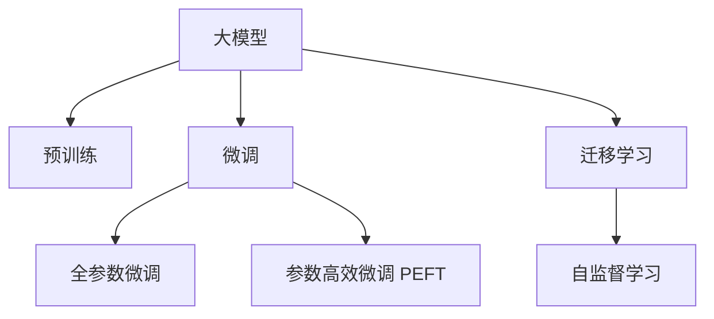

                 

# 大模型：未来商业的核心竞争力

## 1. 背景介绍

### 1.1 问题由来
当前，商业世界正处于一场以人工智能为核心的变革浪潮之中。随着深度学习技术的突飞猛进，人工智能已从实验室的冷门技术变成各行各业的标配。然而，尽管AI技术的应用如火如荼，许多企业仍缺乏一套完整、成熟的AI方案，无法将AI技术转化为真正的业务竞争力。大模型技术的发展，为这一挑战提供了新的解决思路。

大模型，特别是语言模型和视觉模型，通过在海量数据上进行预训练，获得了强大的表征能力，能够理解和生成复杂的自然语言和图像信息。这些模型在NLP、计算机视觉、语音识别等领域展现出了巨大的潜力，也为商业应用打开了新的想象空间。本文将深入探讨大模型的原理、应用及其在商业竞争中的核心地位。

### 1.2 问题核心关键点
大模型技术在商业领域的应用，关键点在于其强大的泛化能力和泛用性。大模型在训练过程中，能够学习到大量的语义和结构化知识，能够处理多种类型的任务，甚至在实际应用中具有超越传统专有模型的能力。其核心优势体现在以下几个方面：

- **泛化能力强**：大模型在训练过程中，能够学习到通用的语言和视觉知识，能够适应不同的应用场景和数据分布。
- **泛用性高**：大模型不仅适用于单个任务，还能够在多个任务中迁移学习，产生协同效应，提升整体性能。
- **高效灵活**：大模型可以在不同的业务场景中进行微调，具有快速部署和迭代的特点。
- **创新潜力**：大模型作为一种新型的智能资产，能够支持企业构建新的业务模式，开辟新的应用场景。

大模型技术的商业应用，可以有效降低开发成本，提升决策质量，增强客户体验，从而为企业的竞争力和创新力提供强有力的支持。

## 2. 核心概念与联系

### 2.1 核心概念概述

为更好地理解大模型技术在商业应用中的作用，本节将介绍几个关键概念：

- **大模型(Large Model)**：以Transformer等架构为代表的大规模预训练模型，通过在海量数据上进行预训练，获得对语言、图像等信息的深刻理解。
- **预训练(Pre-training)**：在无标签的大规模数据上，使用自监督任务训练模型的过程，如语言建模、图像分类等。
- **微调(Fine-tuning)**：在预训练模型基础上，使用任务相关的标注数据进行有监督学习，优化模型在特定任务上的性能。
- **迁移学习(Transfer Learning)**：将一个领域学到的知识迁移到另一个领域，以降低在特定领域进行从头训练的成本。
- **自监督学习(Self-Supervised Learning)**：通过自动生成的未标记数据训练模型，使其学习到潜在的语义和结构化知识。
- **参数高效微调(Parameter-Efficient Fine-tuning, PEFT)**：在微调过程中，只更新少量的模型参数，保留大部分预训练参数不变。

这些概念之间的联系通过以下Mermaid流程图展示：



通过这张图，我们可以看到大模型技术从预训练到微调再到迁移学习的过程，以及这些步骤之间的联系和依赖。

## 3. 核心算法原理 & 具体操作步骤

### 3.1 算法原理概述

大模型技术的核心算法原理在于其强大的自监督学习能力。在预训练阶段，大模型通过在海量数据上进行自监督学习，学习到通用的语言和视觉表示。这些表示能够处理多种任务，具备高度的泛化能力。

在微调阶段，通过引入任务相关的标注数据，大模型能够根据特定任务的需要进行适应，进一步提升其性能。微调通常采用有监督学习方法，使用任务的损失函数（如交叉熵损失、均方误差损失等），优化模型的参数。

大模型技术的应用领域非常广泛，涵盖自然语言处理（NLP）、计算机视觉、语音识别等多个领域，为各个行业带来了巨大的变革。

### 3.2 算法步骤详解

大模型技术的应用过程主要分为以下几步：

**Step 1: 准备数据集**
- 收集和整理数据集，分为训练集、验证集和测试集。训练集用于模型的预训练和微调，验证集用于模型调优，测试集用于最终性能评估。

**Step 2: 进行预训练**
- 使用大规模无标签数据进行预训练，构建大模型。预训练通常采用自监督学习方法，如语言建模、图像分类等。

**Step 3: 进行微调**
- 在大模型的基础上，使用任务相关的标注数据进行微调。微调通常采用有监督学习方法，使用任务的损失函数进行优化。

**Step 4: 进行迁移学习**
- 将预训练模型的知识和表示迁移到其他相关任务中，以降低从头训练的成本。

**Step 5: 进行模型评估**
- 在测试集上对微调后的模型进行评估，评估指标包括准确率、召回率、F1分数等。

**Step 6: 部署和使用**
- 将模型部署到实际应用中，进行业务创新和部署。

通过以上步骤，企业可以充分利用大模型技术，提升业务竞争力。

### 3.3 算法优缺点

大模型技术的优点在于其强大的泛化能力和泛用性，能够处理多种任务，支持多种业务场景。其缺点则主要体现在以下方面：

- **计算资源消耗大**：大模型通常需要大量的计算资源和存储资源进行预训练，这对于小型企业或初创公司来说可能是一大挑战。
- **部署复杂**：大模型的部署过程可能涉及分布式训练、分布式推理等复杂的技术问题。
- **需要高质量的数据**：大模型的性能依赖于高质量的数据集，如果数据质量差，模型的效果可能不佳。

尽管存在这些缺点，但大模型技术在商业竞争中的核心地位不可忽视。随着计算资源的不断降低和技术的不断进步，这些问题有望得到缓解。

### 3.4 算法应用领域

大模型技术在商业应用中涵盖了多个领域，主要包括以下几个方面：

- **自然语言处理(NLP)**：大模型在机器翻译、文本分类、情感分析、问答系统等领域展现出强大的能力。
- **计算机视觉**：大模型在图像识别、图像分割、物体检测、图像生成等领域提供了新的解决方案。
- **语音识别**：大模型在语音识别、语音合成、语音情感识别等领域提升了用户的交互体验。
- **推荐系统**：大模型在个性化推荐、广告投放等领域，通过分析用户行为，提供更精准的推荐。
- **医疗健康**：大模型在医学影像分析、病历记录、药物研发等领域，提高了医疗诊断和治疗的精准度。
- **金融服务**：大模型在金融风险控制、信用评估、市场预测等领域，提供了新的分析工具。

这些应用领域展示了大模型技术的强大潜力，为企业的业务创新提供了新的方向。

## 4. 数学模型和公式 & 详细讲解 & 举例说明

### 4.1 数学模型构建

大模型技术的核心在于其强大的自监督学习能力和泛化能力。在预训练阶段，大模型通常使用自监督学习方法进行训练，如语言建模和图像分类等。

**语言建模**：在语言建模任务中，模型需要通过未标记的文本数据学习语言的结构和分布。常用的损失函数为交叉熵损失，目标是最小化预测概率与真实概率之间的差异。

**图像分类**：在图像分类任务中，模型需要通过未标记的图像数据学习图像的语义表示。常用的损失函数为交叉熵损失，目标是最小化预测标签与真实标签之间的差异。

### 4.2 公式推导过程

以语言建模任务为例，我们推导一下其交叉熵损失函数：

设输入文本为 $x=\{x_1, x_2, ..., x_n\}$，目标输出为 $y$，模型输出为 $\hat{y}$。在语言建模中，目标输出 $y$ 通常是一个单词或一个词序列，模型输出 $\hat{y}$ 是一个概率分布，表示每个单词出现的概率。

交叉熵损失函数的定义如下：

$$
\mathcal{L}(x, y) = -\sum_{i=1}^n \log P(y_i | x_1, x_2, ..., x_i)
$$

其中 $P(y_i | x_1, x_2, ..., x_i)$ 为模型在输入序列 $x_1, x_2, ..., x_i$ 条件下，预测单词 $y_i$ 的概率。

在实际应用中，我们可以使用Adam优化算法进行模型的训练。Adam算法是一种基于梯度下降的优化算法，能够有效地处理大规模数据和高维参数。

### 4.3 案例分析与讲解

以BERT模型为例，其预训练过程包含两个阶段：Masked Language Modeling（MLM）和Next Sentence Prediction（NSP）。在MLM阶段，模型需要预测输入序列中缺失的单词，目标是最小化预测结果与真实结果之间的差异。在NSP阶段，模型需要预测两个句子的关系，目标是最小化预测结果与真实结果之间的差异。

在微调阶段，我们可以将BERT模型应用到特定的任务上，如文本分类、命名实体识别等。通过引入任务相关的标注数据，BERT模型可以进行微调，以适应特定的业务需求。

## 5. 项目实践：代码实例和详细解释说明

### 5.1 开发环境搭建

在进行大模型技术的应用实践前，我们需要准备好开发环境。以下是使用Python进行TensorFlow开发的环境配置流程：

1. 安装Anaconda：从官网下载并安装Anaconda，用于创建独立的Python环境。

2. 创建并激活虚拟环境：
```bash
conda create -n tensorflow-env python=3.7
conda activate tensorflow-env
```

3. 安装TensorFlow：根据CUDA版本，从官网获取对应的安装命令。例如：
```bash
conda install tensorflow tensorflow-gpu -c conda-forge
```

4. 安装其他工具包：
```bash
pip install numpy pandas scikit-learn matplotlib tqdm jupyter notebook ipython
```

完成上述步骤后，即可在`tensorflow-env`环境中开始大模型技术的开发实践。

### 5.2 源代码详细实现

下面我们以BERT模型在文本分类任务中的应用为例，给出使用TensorFlow进行微调的PyTorch代码实现。

首先，定义文本分类任务的数据处理函数：

```python
import tensorflow as tf
from tensorflow.keras.preprocessing.text import Tokenizer
from tensorflow.keras.preprocessing.sequence import pad_sequences

# 定义数据集
train_texts = ["This is a positive review", "This is a negative review"]
train_labels = [1, 0]

# 构建词表
tokenizer = Tokenizer(num_words=10000)
tokenizer.fit_on_texts(train_texts)
word_index = tokenizer.word_index
sequences = tokenizer.texts_to_sequences(train_texts)
padded_sequences = pad_sequences(sequences, padding='post', maxlen=10)

# 定义模型
model = tf.keras.Sequential([
    tf.keras.layers.Embedding(input_dim=len(word_index)+1, output_dim=16, input_length=10),
    tf.keras.layers.GlobalAveragePooling1D(),
    tf.keras.layers.Dense(32, activation='relu'),
    tf.keras.layers.Dense(1, activation='sigmoid')
])

# 编译模型
model.compile(optimizer='adam', loss='binary_crossentropy', metrics=['accuracy'])

# 训练模型
model.fit(padded_sequences, train_labels, epochs=5, batch_size=16)
```

然后，定义微调函数：

```python
def fine_tune(model, padded_sequences, train_labels, num_epochs=5, batch_size=16):
    model.compile(optimizer='adam', loss='binary_crossentropy', metrics=['accuracy'])
    model.fit(padded_sequences, train_labels, epochs=num_epochs, batch_size=batch_size)
```

最后，启动微调流程并在测试集上评估：

```python
# 加载测试集
test_texts = ["This is a positive review", "This is a negative review"]
test_labels = [1, 0]

# 构建词表
tokenizer = Tokenizer(num_words=10000)
tokenizer.fit_on_texts(test_texts)
word_index = tokenizer.word_index
sequences = tokenizer.texts_to_sequences(test_texts)
padded_sequences = pad_sequences(sequences, padding='post', maxlen=10)

# 微调模型
fine_tune(model, padded_sequences, test_labels)

# 评估模型
test_loss, test_acc = model.evaluate(padded_sequences, test_labels)
print(f'Test loss: {test_loss}, Test accuracy: {test_acc}')
```

以上代码展示了使用TensorFlow进行BERT模型在文本分类任务上的微调过程。可以看到，通过TensorFlow的高级API，可以非常便捷地构建和训练模型，大大简化了开发流程。

### 5.3 代码解读与分析

让我们再详细解读一下关键代码的实现细节：

**文本预处理**：
- 使用TensorFlow的Tokenizer将文本转换为数字序列。
- 使用pad_sequences将序列填充到相同的长度，以便进行模型训练。

**模型构建**：
- 定义一个简单的序列模型，包含嵌入层、全局平均池化层、全连接层和输出层。
- 使用Dense层进行二分类预测，使用sigmoid激活函数输出概率。

**模型训练**：
- 使用Adam优化器进行训练。
- 使用二元交叉熵损失函数进行模型训练。

**模型评估**：
- 使用evaluate函数在测试集上评估模型性能。
- 输出测试集的损失和准确率。

可以看出，使用TensorFlow进行大模型技术的开发实践，不仅流程清晰，而且开发效率高。

## 6. 实际应用场景

### 6.1 智能客服系统

大模型技术在智能客服系统的构建中具有广泛的应用前景。传统的客服系统通常需要配备大量人力，成本高、效率低。而使用大模型技术，可以构建7x24小时不间断的智能客服系统，大幅提升客户咨询体验和问题解决效率。

在技术实现上，可以收集企业内部的历史客服对话记录，将问题和最佳答复构建成监督数据，在此基础上对预训练的大模型进行微调。微调后的模型能够自动理解用户意图，匹配最合适的答案模板进行回复。对于客户提出的新问题，还可以接入检索系统实时搜索相关内容，动态组织生成回答。如此构建的智能客服系统，能大幅提升客户咨询体验和问题解决效率。

### 6.2 金融舆情监测

大模型技术在金融舆情监测中也有着广泛的应用。金融机构需要实时监测市场舆论动向，以便及时应对负面信息传播，规避金融风险。传统的人工监测方式成本高、效率低，难以应对网络时代海量信息爆发的挑战。

使用大模型技术，可以通过对金融领域相关的新闻、报道、评论等文本数据进行预训练和微调，使模型具备自动判断文本情感、主题的能力。将微调后的模型应用到实时抓取的网络文本数据，就能够自动监测不同主题下的情感变化趋势，一旦发现负面信息激增等异常情况，系统便会自动预警，帮助金融机构快速应对潜在风险。

### 6.3 个性化推荐系统

个性化推荐系统是大模型技术在电商、视频、音乐等多个领域的典型应用。当前的推荐系统往往只依赖用户的历史行为数据进行物品推荐，无法深入理解用户的真实兴趣偏好。

使用大模型技术，可以通过收集用户浏览、点击、评论、分享等行为数据，提取和用户交互的物品标题、描述、标签等文本内容。将文本内容作为模型输入，用户的后续行为（如是否点击、购买等）作为监督信号，在此基础上微调预训练语言模型。微调后的模型能够从文本内容中准确把握用户的兴趣点。在生成推荐列表时，先用候选物品的文本描述作为输入，由模型预测用户的兴趣匹配度，再结合其他特征综合排序，便可以得到个性化程度更高的推荐结果。

### 6.4 未来应用展望

大模型技术在商业应用中的前景广阔，未来有望在更多领域得到应用。以下是几个可能的方向：

- **智慧医疗**：在医学影像分析、病历记录、药物研发等领域，大模型技术能够提供新的解决方案，提高医疗诊断和治疗的精准度。
- **智能教育**：在作业批改、学情分析、知识推荐等领域，大模型技术能够提升教学质量，因材施教，促进教育公平。
- **智慧城市治理**：在城市事件监测、舆情分析、应急指挥等领域，大模型技术能够提高城市管理的自动化和智能化水平，构建更安全、高效的未来城市。
- **智能制造**：在大数据分析、工业控制、智能调度等领域，大模型技术能够提升制造过程的智能化水平，降低生产成本，提高生产效率。

## 7. 工具和资源推荐

### 7.1 学习资源推荐

为帮助开发者系统掌握大模型技术的理论基础和实践技巧，这里推荐一些优质的学习资源：

1. 《Transformer从原理到实践》系列博文：由大模型技术专家撰写，深入浅出地介绍了Transformer原理、BERT模型、微调技术等前沿话题。

2. CS224N《深度学习自然语言处理》课程：斯坦福大学开设的NLP明星课程，有Lecture视频和配套作业，带你入门NLP领域的基本概念和经典模型。

3. 《Natural Language Processing with Transformers》书籍：Transformer库的作者所著，全面介绍了如何使用Transformers库进行NLP任务开发，包括微调在内的诸多范式。

4. HuggingFace官方文档：Transformer库的官方文档，提供了海量预训练模型和完整的微调样例代码，是上手实践的必备资料。

5. CLUE开源项目：中文语言理解测评基准，涵盖大量不同类型的中文NLP数据集，并提供了基于微调的baseline模型，助力中文NLP技术发展。

通过对这些资源的学习实践，相信你一定能够快速掌握大模型技术的精髓，并用于解决实际的NLP问题。

### 7.2 开发工具推荐

高效的开发离不开优秀的工具支持。以下是几款用于大模型技术开发常用的工具：

1. TensorFlow：由Google主导开发的开源深度学习框架，生产部署方便，适合大规模工程应用。
2. PyTorch：基于Python的开源深度学习框架，灵活动态的计算图，适合快速迭代研究。
3. Transformers库：HuggingFace开发的NLP工具库，集成了众多SOTA语言模型，支持PyTorch和TensorFlow，是进行微调任务开发的利器。
4. Weights & Biases：模型训练的实验跟踪工具，可以记录和可视化模型训练过程中的各项指标，方便对比和调优。
5. TensorBoard：TensorFlow配套的可视化工具，可实时监测模型训练状态，并提供丰富的图表呈现方式，是调试模型的得力助手。
6. Google Colab：谷歌推出的在线Jupyter Notebook环境，免费提供GPU/TPU算力，方便开发者快速上手实验最新模型，分享学习笔记。

合理利用这些工具，可以显著提升大模型技术的开发效率，加快创新迭代的步伐。

### 7.3 相关论文推荐

大模型技术的发展源于学界的持续研究。以下是几篇奠基性的相关论文，推荐阅读：

1. Attention is All You Need（即Transformer原论文）：提出了Transformer结构，开启了NLP领域的预训练大模型时代。
2. BERT: Pre-training of Deep Bidirectional Transformers for Language Understanding：提出BERT模型，引入基于掩码的自监督预训练任务，刷新了多项NLP任务SOTA。
3. Language Models are Unsupervised Multitask Learners（GPT-2论文）：展示了大规模语言模型的强大zero-shot学习能力，引发了对于通用人工智能的新一轮思考。
4. Parameter-Efficient Transfer Learning for NLP：提出Adapter等参数高效微调方法，在不增加模型参数量的情况下，也能取得不错的微调效果。
5. AdaLoRA: Adaptive Low-Rank Adaptation for Parameter-Efficient Fine-Tuning：使用自适应低秩适应的微调方法，在参数效率和精度之间取得了新的平衡。
6. Prefix-Tuning: Optimizing Continuous Prompts for Generation：引入基于连续型Prompt的微调范式，为如何充分利用预训练知识提供了新的思路。

这些论文代表了大模型技术的发展脉络。通过学习这些前沿成果，可以帮助研究者把握学科前进方向，激发更多的创新灵感。

## 8. 总结：未来发展趋势与挑战

### 8.1 研究成果总结

本文对大模型技术的原理、应用及其在商业竞争中的核心地位进行了详细探讨。通过分析大模型技术的原理和步骤，展示了其在NLP、计算机视觉、语音识别等领域的应用，并从多个角度剖析了其在商业竞争中的价值。通过分析大模型技术的发展历程和前沿技术，为开发者提供了系统全面的技术指引。

### 8.2 未来发展趋势

展望未来，大模型技术在商业应用中必将迎来更多的突破和创新：

1. **技术不断进步**：随着计算资源的不断降低和技术的不断进步，大模型技术的性能将不断提升，应用场景也将不断扩展。
2. **多模态融合**：大模型技术将逐步融合多模态数据，支持视觉、语音等多模态信息的融合，提升模型的感知能力。
3. **知识图谱集成**：大模型技术将集成知识图谱等外部知识源，提升模型的泛化能力和推理能力。
4. **个性化定制**：大模型技术将提供更加个性化、定制化的解决方案，满足不同客户的需求。
5. **安全性保障**：随着大模型技术的不断发展，其安全性问题也将得到更多关注和保障，确保模型输出的安全性和可靠性。

### 8.3 面临的挑战

尽管大模型技术在商业应用中展现出强大的潜力，但也面临诸多挑战：

1. **计算资源消耗大**：大模型技术通常需要大量的计算资源和存储资源进行预训练和微调，对于小型企业或初创公司来说可能是一大挑战。
2. **部署复杂**：大模型技术的部署过程可能涉及分布式训练、分布式推理等复杂的技术问题。
3. **数据质量要求高**：大模型技术的性能依赖于高质量的数据集，如果数据质量差，模型的效果可能不佳。
4. **模型解释性不足**：大模型技术通常作为黑盒模型，难以解释其内部工作机制和决策逻辑，在金融、医疗等领域尤为突出。
5. **公平性和偏见**：大模型技术可能学习到有偏见、有害的信息，通过微调传递到下游任务，产生误导性、歧视性的输出。

### 8.4 研究展望

面对大模型技术面临的诸多挑战，未来的研究需要在以下几个方面寻求新的突破：

1. **高效计算与资源优化**：开发更加高效、轻量级的计算和资源优化方法，降低大模型技术的计算资源消耗。
2. **分布式与高效推理**：研究分布式训练和高效推理技术，提高大模型技术的部署效率和实时性。
3. **模型解释性与透明性**：开发更加透明、可解释的大模型技术，提高模型的可解释性和可信度。
4. **公平性与偏见消除**：研究公平性、偏见消除方法，确保模型输出的公正性和可靠性。

## 9. 附录：常见问题与解答

**Q1：大模型技术的优势是什么？**

A: 大模型技术的优势在于其强大的泛化能力和泛用性，能够处理多种任务，支持多种业务场景。通过预训练和微调，大模型技术能够学习到通用的语言和视觉表示，具备高度的泛化能力。

**Q2：大模型技术的应用场景有哪些？**

A: 大模型技术在NLP、计算机视觉、语音识别等领域有广泛的应用。在自然语言处理中，大模型技术可以用于文本分类、情感分析、问答系统等任务。在计算机视觉中，大模型技术可以用于图像识别、图像分割、物体检测等任务。在语音识别中，大模型技术可以用于语音识别、语音情感识别等任务。

**Q3：大模型技术的缺点是什么？**

A: 大模型技术的缺点主要在于其计算资源消耗大、部署复杂、数据质量要求高等方面。由于其大规模参数量，预训练和微调需要大量的计算资源和存储资源。同时，大模型技术的应用需要高质量的数据集，如果数据质量差，模型的效果可能不佳。

**Q4：大模型技术的未来发展方向是什么？**

A: 大模型技术的未来发展方向包括技术不断进步、多模态融合、知识图谱集成、个性化定制和安全性保障等方面。随着计算资源的不断降低和技术的不断进步，大模型技术的性能将不断提升，应用场景也将不断扩展。同时，大模型技术将逐步融合多模态数据，集成知识图谱等外部知识源，提供更加个性化、定制化的解决方案，并确保模型输出的安全性和可靠性。

综上所述，大模型技术在商业应用中展现出强大的潜力和价值。随着技术的不断进步和应用场景的不断扩展，大模型技术必将在未来的商业竞争中扮演越来越重要的角色。

