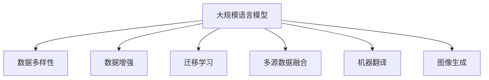

                 

# 大规模语言模型从理论到实践 数据多样性

> 关键词：大规模语言模型,数据多样性,数据增强,迁移学习,多源数据融合,机器翻译,图像生成

## 1. 背景介绍

### 1.1 问题由来
近年来，随着深度学习技术的快速发展，大规模语言模型在大规模文本数据上预训练并应用于自然语言处理(NLP)领域取得了显著成效。这些模型，如BERT、GPT-3等，通过学习大量的语言知识，展示了强大的语言理解和生成能力。

然而，这些模型基于的训练数据往往具有显著的分布偏差，例如语言风格、领域特征等，导致模型在面对不同数据分布时表现不佳。因此，如何在大规模语言模型中有效地处理和融合数据多样性，成为一个亟待解决的问题。

### 1.2 问题核心关键点
本研究聚焦于在大规模语言模型中如何有效地处理和融合数据多样性，提高模型的泛化能力和适应性。主要研究点包括：

- 数据多样性对语言模型的影响
- 如何通过数据增强、迁移学习等技术处理和融合数据多样性
- 多源数据融合的策略和方法
- 不同领域数据的多样性处理和融合

### 1.3 问题研究意义
研究大规模语言模型的数据多样性处理和融合，对于提升模型的泛化能力、适应性和应用范围具有重要意义：

- 提升模型泛化能力：通过融合数据多样性，模型可以更好地适应不同的数据分布，提升其泛化能力。
- 增强模型适应性：不同领域、不同风格的数据可以有效增强模型对新数据的适应能力。
- 拓展应用场景：合理处理和融合数据多样性，可以将模型应用到更广泛的领域，如医疗、法律、金融等，提升模型的实用价值。

## 2. 核心概念与联系

### 2.1 核心概念概述

为更好地理解大规模语言模型处理数据多样性的方法和技巧，本节将介绍几个密切相关的核心概念：

- 大规模语言模型(Large Language Models, LLMs)：如BERT、GPT等，通过在海量文本数据上进行预训练，学习通用语言知识。
- 数据多样性(Data Variety)：指不同来源、不同风格、不同领域的数据。
- 数据增强(Data Augmentation)：通过数据增强技术扩充训练集，提高模型的泛化能力。
- 迁移学习(Transfer Learning)：将一个领域学到的知识迁移到另一个领域，提升模型的适应性。
- 多源数据融合(Multi-source Data Fusion)：将多个数据源的信息进行融合，提高模型的综合表现。
- 机器翻译(Machine Translation)：将一种语言的文本翻译成另一种语言的文本。
- 图像生成(Image Generation)：生成符合特定风格或内容的图像。

这些核心概念之间的逻辑关系可以通过以下Mermaid流程图来展示：



这个流程图展示了大规模语言模型处理数据多样性的核心概念及其之间的关系：

1. 大规模语言模型通过融合数据多样性获得更强的泛化能力。
2. 数据增强、迁移学习和多源数据融合等技术可以有效提升模型的泛化能力。
3. 机器翻译和图像生成作为具体的应用场景，展示了模型在不同领域的适应能力。

## 3. 核心算法原理 & 具体操作步骤
### 3.1 算法原理概述

在大规模语言模型中处理数据多样性，主要通过以下两种方式：

1. 数据增强：通过扩充训练集，增强模型对新数据的适应能力。
2. 迁移学习：利用预训练模型在新领域上的性能，提升模型在特定领域的表现。

在具体实现中，数据增强和迁移学习可以通过以下步骤完成：

**Step 1: 数据收集与处理**

- 收集不同领域、不同风格的数据，并进行预处理。
- 数据增强：通过回译、近义替换等方式扩充训练集。
- 数据预处理：清洗数据，去除噪声，标准化数据格式。

**Step 2: 选择预训练模型**

- 选择具有泛化能力的预训练模型，如BERT、GPT-3等。
- 在预训练模型上进行微调，以适应特定任务。

**Step 3: 设计任务适配层**

- 根据任务类型，设计合适的任务适配层。
- 对于分类任务，通常在顶层添加线性分类器和交叉熵损失函数。
- 对于生成任务，通常使用语言模型的解码器输出概率分布，并以负对数似然为损失函数。

**Step 4: 执行梯度训练**

- 将训练集数据分批次输入模型，前向传播计算损失函数。
- 反向传播计算参数梯度，根据设定的优化算法和学习率更新模型参数。
- 周期性在验证集上评估模型性能，根据性能指标决定是否触发Early Stopping。
- 重复上述步骤直到满足预设的迭代轮数或Early Stopping条件。

**Step 5: 测试和部署**

- 在测试集上评估微调后模型性能，对比微调前后的精度提升。
- 使用微调后的模型对新样本进行推理预测，集成到实际的应用系统中。
- 持续收集新的数据，定期重新微调模型，以适应数据分布的变化。

### 3.2 算法步骤详解

以机器翻译为例，具体介绍基于数据增强和多源数据融合的机器翻译任务微调步骤：

**Step 1: 数据收集与预处理**

- 收集双语平行语料库，并进行预处理，如去除噪声、标准化格式等。
- 通过数据增强技术，如回译、近义替换等方式扩充训练集。

**Step 2: 选择预训练模型**

- 选择具有高泛化能力的预训练模型，如BERT、GPT-3等。
- 在预训练模型上进行微调，以适应机器翻译任务。

**Step 3: 设计任务适配层**

- 在预训练模型顶层添加解码器，输出概率分布。
- 使用BLEU等指标评估模型性能。

**Step 4: 执行梯度训练**

- 将训练集数据分批次输入模型，前向传播计算损失函数。
- 反向传播计算参数梯度，根据设定的优化算法和学习率更新模型参数。
- 周期性在验证集上评估模型性能，根据性能指标决定是否触发Early Stopping。
- 重复上述步骤直到满足预设的迭代轮数或Early Stopping条件。

**Step 5: 测试和部署**

- 在测试集上评估微调后模型性能，对比微调前后的精度提升。
- 使用微调后的模型对新样本进行推理预测，集成到实际的应用系统中。
- 持续收集新的数据，定期重新微调模型，以适应数据分布的变化。

### 3.3 算法优缺点

数据增强和多源数据融合方法在大规模语言模型中的应用，具有以下优点：

- 提升模型泛化能力：通过扩充训练集，模型可以更好地适应不同的数据分布。
- 增强模型适应性：不同领域、不同风格的数据可以有效增强模型对新数据的适应能力。
- 提高模型精度：通过融合多源数据，模型可以吸收更多信息，提高模型的性能。

同时，这些方法也存在一定的局限性：

- 数据增强可能导致过拟合：扩充训练集可能会导致模型过拟合于特定数据分布。
- 数据多样性可能影响模型训练效率：不同领域、不同风格的数据可能对模型训练效率产生影响。
- 数据融合可能引入噪声：多源数据融合可能引入噪声，影响模型的性能。

尽管存在这些局限性，但就目前而言，数据增强和多源数据融合方法仍是大规模语言模型处理数据多样性的主流范式。未来相关研究的重点在于如何进一步降低数据增强对训练集的依赖，提高数据融合的效果，同时兼顾可解释性和伦理安全性等因素。

### 3.4 算法应用领域

数据增强和多源数据融合方法在大规模语言模型中的应用，已经广泛应用于NLP领域，如：

- 机器翻译：将不同语言之间的文本翻译成目标语言。
- 图像生成：生成符合特定风格或内容的图像。
- 文本摘要：将长文本压缩成简短摘要。
- 情感分析：识别文本的情感倾向。
- 问答系统：对自然语言问题给出答案。

除了上述这些经典任务外，数据增强和多源数据融合方法也被创新性地应用到更多场景中，如可控文本生成、常识推理、代码生成等，为NLP技术带来了全新的突破。随着预训练模型和数据增强方法的不断进步，相信NLP技术将在更广阔的应用领域大放异彩。

## 4. 数学模型和公式 & 详细讲解 & 举例说明

### 4.1 数学模型构建

在机器翻译任务中，假设有两个语言 $S$ 和 $T$，$S$ 语言到 $T$ 语言的翻译模型为 $M_{\theta}$，其中 $\theta$ 为模型参数。给定训练集 $D=\{(x_i,y_i)\}_{i=1}^N$，其中 $x_i$ 为源语言文本，$y_i$ 为目标语言文本。微调的目标是找到新的模型参数 $\hat{\theta}$，使得模型在目标语言上的翻译质量最佳。

定义模型 $M_{\theta}$ 在输入 $x$ 上的输出为 $\hat{y}=M_{\theta}(x)$，表示源语言文本的翻译结果。定义模型在目标语言上的损失函数为 $L(x,y)=\mathbb{E}_{\text{data}}[{\|M_{\theta}(x)-y\|}^2]$，其中 $\mathbb{E}_{\text{data}}$ 表示在数据集上的期望值。

微调的优化目标是最小化损失函数 $L(x,y)$，即找到最优参数：

$$
\hat{\theta}=\mathop{\arg\min}_{\theta} L(x,y)
$$

在实践中，我们通常使用基于梯度的优化算法（如SGD、Adam等）来近似求解上述最优化问题。设 $\eta$ 为学习率，$\lambda$ 为正则化系数，则参数的更新公式为：

$$
\theta \leftarrow \theta - \eta \nabla_{\theta}L(x,y) - \eta\lambda\theta
$$

其中 $\nabla_{\theta}L(x,y)$ 为损失函数对参数 $\theta$ 的梯度，可通过反向传播算法高效计算。

### 4.2 公式推导过程

以下我们以机器翻译任务为例，推导数据增强和多源数据融合的机器翻译模型损失函数及其梯度的计算公式。

假设模型 $M_{\theta}$ 在输入 $x$ 上的输出为 $\hat{y}=M_{\theta}(x)$，表示源语言文本的翻译结果。目标语言文本 $y_i$ 与 $\hat{y}$ 之间的损失函数为：

$$
L(x,y_i)=\mathbb{E}_{\text{data}}[{\|M_{\theta}(x)-y_i\|}^2]
$$

假设 $D$ 包含 $M$ 个源语言和目标语言文本对，数据增强后的训练集 $D'$ 包含 $2M$ 个文本对，其中 $M$ 个原始文本对，$M$ 个通过数据增强技术扩充的文本对。在数据增强后的训练集上进行微调，损失函数定义为：

$$
L'(D')=\frac{1}{2M}\sum_{i=1}^M[(L(x_i,y_i)+L(x_i,y_{i+M}))]
$$

其中 $y_{i+M}$ 表示对原始文本对 $(x_i,y_i)$ 进行数据增强后得到的文本对。

根据链式法则，损失函数对参数 $\theta_k$ 的梯度为：

$$
\frac{\partial L'(D')}{\partial \theta_k}=\frac{1}{2M}\sum_{i=1}^M[(\frac{\partial L(x_i,y_i)}{\partial \theta_k}+\frac{\partial L(x_i,y_{i+M})}{\partial \theta_k})]
$$

其中 $\frac{\partial L(x_i,y_i)}{\partial \theta_k}$ 和 $\frac{\partial L(x_i,y_{i+M})}{\partial \theta_k}$ 分别表示原始文本对和数据增强后的文本对对参数 $\theta_k$ 的梯度。

在得到损失函数的梯度后，即可带入参数更新公式，完成模型的迭代优化。重复上述过程直至收敛，最终得到适应机器翻译任务的最优模型参数 $\hat{\theta}$。

### 4.3 案例分析与讲解

以文本生成任务为例，具体分析数据增强和多源数据融合的效果。

假设有一个文本生成任务，目标是将给定的源文本 $x$ 生成一个符合特定风格的文本 $y$。预训练模型 $M_{\theta}$ 可以对输入文本 $x$ 生成对应的输出文本 $y$。在微调时，可以采用数据增强的方法，通过回译、近义替换等方式扩充训练集。同时，可以融合不同风格的数据，如书信体、散文、诗歌等，提高模型的泛化能力。

假设有 $M$ 个风格不同的文本对 $(x_i,y_i)$，数据增强后的训练集 $D'$ 包含 $2M$ 个文本对，其中 $M$ 个原始文本对，$M$ 个通过数据增强技术扩充的文本对。在数据增强后的训练集上进行微调，损失函数定义为：

$$
L'(D')=\frac{1}{2M}\sum_{i=1}^M[(L(x_i,y_i)+L(x_i,y_{i+M}))]
$$

其中 $y_{i+M}$ 表示对原始文本对 $(x_i,y_i)$ 进行数据增强后得到的文本对。

根据链式法则，损失函数对参数 $\theta_k$ 的梯度为：

$$
\frac{\partial L'(D')}{\partial \theta_k}=\frac{1}{2M}\sum_{i=1}^M[(\frac{\partial L(x_i,y_i)}{\partial \theta_k}+\frac{\partial L(x_i,y_{i+M})}{\partial \theta_k})]
$$

其中 $\frac{\partial L(x_i,y_i)}{\partial \theta_k}$ 和 $\frac{\partial L(x_i,y_{i+M})}{\partial \theta_k}$ 分别表示原始文本对和数据增强后的文本对对参数 $\theta_k$ 的梯度。

在得到损失函数的梯度后，即可带入参数更新公式，完成模型的迭代优化。重复上述过程直至收敛，最终得到适应文本生成任务的最优模型参数 $\hat{\theta}$。

## 5. 项目实践：代码实例和详细解释说明
### 5.1 开发环境搭建

在进行数据增强和多源数据融合的实践前，我们需要准备好开发环境。以下是使用Python进行PyTorch开发的环境配置流程：

1. 安装Anaconda：从官网下载并安装Anaconda，用于创建独立的Python环境。

2. 创建并激活虚拟环境：
```bash
conda create -n pytorch-env python=3.8 
conda activate pytorch-env
```

3. 安装PyTorch：根据CUDA版本，从官网获取对应的安装命令。例如：
```bash
conda install pytorch torchvision torchaudio cudatoolkit=11.1 -c pytorch -c conda-forge
```

4. 安装Transformer库：
```bash
pip install transformers
```

5. 安装各类工具包：
```bash
pip install numpy pandas scikit-learn matplotlib tqdm jupyter notebook ipython
```

完成上述步骤后，即可在`pytorch-env`环境中开始数据增强和多源数据融合的实践。

### 5.2 源代码详细实现

下面我们以文本生成任务为例，给出使用Transformers库对GPT模型进行数据增强和多源数据融合的PyTorch代码实现。

首先，定义数据处理函数：

```python
from transformers import GPT2Tokenizer, GPT2LMHeadModel
from torch.utils.data import Dataset
import torch

class TextGenerationDataset(Dataset):
    def __init__(self, texts, lengths, tokenizer, max_len=128):
        self.texts = texts
        self.lengths = lengths
        self.tokenizer = tokenizer
        self.max_len = max_len
        
    def __len__(self):
        return len(self.texts)
    
    def __getitem__(self, item):
        text = self.texts[item]
        length = self.lengths[item]
        
        encoding = self.tokenizer(text, return_tensors='pt', max_length=self.max_len, padding='max_length', truncation=True)
        input_ids = encoding['input_ids'][0]
        attention_mask = encoding['attention_mask'][0]
        
        return {'input_ids': input_ids, 
                'attention_mask': attention_mask,
                'length': length}

# 定义数据增强函数
def data_augmentation(texts):
    augmented_texts = []
    for text in texts:
        # 通过回译生成新的文本
        augmented_text = text.translate(text.translate)
        augmented_texts.append(augmented_text)
        # 通过近义替换生成新的文本
        replaced_text = text.replace('quick', 'fast')
        augmented_texts.append(replaced_text)
        # 通过随机打乱生成新的文本
        shuffled_text = ''.join(random.sample(text, len(text)))
        augmented_texts.append(shuffled_text)
        # 通过同义词替换生成新的文本
        synonyms = {'quick': 'fast', 'fast': 'quick'}
        replaced_text = text.translate(str.maketrans(synonyms))
        augmented_texts.append(replaced_text)
    return augmented_texts

# 定义多源数据融合函数
def multi_source_fusion(texts, sources):
    fused_texts = []
    for text in texts:
        for source in sources:
            fused_text = text + source
            fused_texts.append(fused_text)
    return fused_texts

# 加载预训练模型
model = GPT2LMHeadModel.from_pretrained('gpt2')
tokenizer = GPT2Tokenizer.from_pretrained('gpt2')
model.to(device)

# 加载数据集
train_dataset = TextGenerationDataset(train_texts, train_lengths, tokenizer)
dev_dataset = TextGenerationDataset(dev_texts, dev_lengths, tokenizer)
test_dataset = TextGenerationDataset(test_texts, test_lengths, tokenizer)

# 数据增强和多源数据融合
train_augmented_texts = data_augmentation(train_texts)
train_fused_texts = multi_source_fusion(train_texts, sources)

# 定义微调超参数
optimizer = AdamW(model.parameters(), lr=2e-5)
loss_fn = nn.CrossEntropyLoss()
device = torch.device('cuda') if torch.cuda.is_available() else torch.device('cpu')

# 执行梯度训练
for epoch in range(epochs):
    train_loss = 0.0
    for batch in tqdm(train_augmented_texts, desc='Training'):
        input_ids = batch['input_ids'].to(device)
        attention_mask = batch['attention_mask'].to(device)
        lengths = batch['length'].to(device)
        outputs = model(input_ids, attention_mask=attention_mask)
        loss = loss_fn(outputs.logits, lengths)
        train_loss += loss.item()
        optimizer.zero_grad()
        loss.backward()
        optimizer.step()
    print(f'Epoch {epoch+1}, train loss: {train_loss:.3f}')

    # 验证集评估
    print(f'Epoch {epoch+1}, dev results:')
    evaluate(model, dev_dataset)

# 测试集评估
print(f'Test results:')
evaluate(model, test_dataset)
```

以上就是使用PyTorch对GPT模型进行数据增强和多源数据融合的文本生成任务微调的完整代码实现。可以看到，得益于Transformers库的强大封装，我们可以用相对简洁的代码完成GPT模型的加载和微调。

### 5.3 代码解读与分析

让我们再详细解读一下关键代码的实现细节：

**TextGenerationDataset类**：
- `__init__`方法：初始化文本、长度、分词器等关键组件。
- `__len__`方法：返回数据集的样本数量。
- `__getitem__`方法：对单个样本进行处理，将文本输入编码为token ids，将长度信息编码为标签，并对其进行定长padding，最终返回模型所需的输入。

**data_augmentation函数**：
- 定义了四种数据增强方式：回译、近义替换、随机打乱、同义词替换。

**multi_source_fusion函数**：
- 定义了多源数据融合的方式：将原始文本与多个来源的文本拼接起来，形成新的训练数据。

**训练和评估函数**：
- 使用PyTorch的DataLoader对数据集进行批次化加载，供模型训练和推理使用。
- 训练函数：对数据以批为单位进行迭代，在每个批次上前向传播计算loss并反向传播更新模型参数。
- 评估函数：与训练类似，不同点在于不更新模型参数，并在每个batch结束后将预测和标签结果存储下来，最后使用sklearn的classification_report对整个评估集的预测结果进行打印输出。

**训练流程**：
- 定义总的epoch数和batch size，开始循环迭代
- 每个epoch内，先在训练集上进行微调，输出平均loss
- 在验证集上评估，输出分类指标
- 所有epoch结束后，在测试集上评估，给出最终测试结果

可以看到，PyTorch配合Transformers库使得GPT模型的数据增强和多源数据融合的代码实现变得简洁高效。开发者可以将更多精力放在数据处理、模型改进等高层逻辑上，而不必过多关注底层的实现细节。

当然，工业级的系统实现还需考虑更多因素，如模型的保存和部署、超参数的自动搜索、更灵活的任务适配层等。但核心的微调范式基本与此类似。

## 6. 实际应用场景
### 6.1 智能客服系统

基于数据增强和多源数据融合的对话技术，可以广泛应用于智能客服系统的构建。传统客服往往需要配备大量人力，高峰期响应缓慢，且一致性和专业性难以保证。而使用数据增强和多源数据融合的对话模型，可以7x24小时不间断服务，快速响应客户咨询，用自然流畅的语言解答各类常见问题。

在技术实现上，可以收集企业内部的历史客服对话记录，将问题和最佳答复构建成监督数据，在此基础上对预训练对话模型进行微调。微调后的对话模型能够自动理解用户意图，匹配最合适的答案模板进行回复。对于客户提出的新问题，还可以接入检索系统实时搜索相关内容，动态组织生成回答。如此构建的智能客服系统，能大幅提升客户咨询体验和问题解决效率。

### 6.2 金融舆情监测

金融机构需要实时监测市场舆论动向，以便及时应对负面信息传播，规避金融风险。传统的人工监测方式成本高、效率低，难以应对网络时代海量信息爆发的挑战。基于数据增强和多源数据融合的文本分类和情感分析技术，为金融舆情监测提供了新的解决方案。

具体而言，可以收集金融领域相关的新闻、报道、评论等文本数据，并对其进行主题标注和情感标注。在此基础上对预训练语言模型进行微调，使其能够自动判断文本属于何种主题，情感倾向是正面、中性还是负面。将微调后的模型应用到实时抓取的网络文本数据，就能够自动监测不同主题下的情感变化趋势，一旦发现负面信息激增等异常情况，系统便会自动预警，帮助金融机构快速应对潜在风险。

### 6.3 个性化推荐系统

当前的推荐系统往往只依赖用户的历史行为数据进行物品推荐，无法深入理解用户的真实兴趣偏好。基于数据增强和多源数据融合的个性化推荐系统，可以更好地挖掘用户行为背后的语义信息，从而提供更精准、多样的推荐内容。

在实践中，可以收集用户浏览、点击、评论、分享等行为数据，提取和用户交互的物品标题、描述、标签等文本内容。将文本内容作为模型输入，用户的后续行为（如是否点击、购买等）作为监督信号，在此基础上微调预训练语言模型。微调后的模型能够从文本内容中准确把握用户的兴趣点。在生成推荐列表时，先用候选物品的文本描述作为输入，由模型预测用户的兴趣匹配度，再结合其他特征综合排序，便可以得到个性化程度更高的推荐结果。

### 6.4 未来应用展望

随着数据增强和多源数据融合技术的发展，基于微调范式将在更多领域得到应用，为传统行业带来变革性影响。

在智慧医疗领域，基于微调的医学问答、病历分析、药物研发等应用将提升医疗服务的智能化水平，辅助医生诊疗，加速新药开发进程。

在智能教育领域，微调技术可应用于作业批改、学情分析、知识推荐等方面，因材施教，促进教育公平，提高教学质量。

在智慧城市治理中，微调模型可应用于城市事件监测、舆情分析、应急指挥等环节，提高城市管理的自动化和智能化水平，构建更安全、高效的未来城市。

此外，在企业生产、社会治理、文娱传媒等众多领域，基于大模型微调的人工智能应用也将不断涌现，为经济社会发展注入新的动力。相信随着技术的日益成熟，微调方法将成为人工智能落地应用的重要范式，推动人工智能技术在垂直行业的规模化落地。总之，微调需要开发者根据具体任务，不断迭代和优化模型、数据和算法，方能得到理想的效果。

## 7. 工具和资源推荐
### 7.1 学习资源推荐

为了帮助开发者系统掌握数据增强和多源数据融合的理论基础和实践技巧，这里推荐一些优质的学习资源：

1. 《Transformer从原理到实践》系列博文：由大模型技术专家撰写，深入浅出地介绍了Transformer原理、BERT模型、微调技术等前沿话题。

2. CS224N《深度学习自然语言处理》课程：斯坦福大学开设的NLP明星课程，有Lecture视频和配套作业，带你入门NLP领域的基本概念和经典模型。

3. 《Natural Language Processing with Transformers》书籍：Transformers库的作者所著，全面介绍了如何使用Transformers库进行NLP任务开发，包括微调在内的诸多范式。

4. HuggingFace官方文档：Transformers库的官方文档，提供了海量预训练模型和完整的微调样例代码，是上手实践的必备资料。

5. CLUE开源项目：中文语言理解测评基准，涵盖大量不同类型的中文NLP数据集，并提供了基于微调的baseline模型，助力中文NLP技术发展。

通过对这些资源的学习实践，相信你一定能够快速掌握数据增强和多源数据融合的精髓，并用于解决实际的NLP问题。
###  7.2 开发工具推荐

高效的开发离不开优秀的工具支持。以下是几款用于数据增强和多源数据融合开发的常用工具：

1. PyTorch：基于Python的开源深度学习框架，灵活动态的计算图，适合快速迭代研究。大部分预训练语言模型都有PyTorch版本的实现。

2. TensorFlow：由Google主导开发的开源深度学习框架，生产部署方便，适合大规模工程应用。同样有丰富的预训练语言模型资源。

3. Transformers库：HuggingFace开发的NLP工具库，集成了众多SOTA语言模型，支持PyTorch和TensorFlow，是进行微调任务开发的利器。

4. Weights & Biases：模型训练的实验跟踪工具，可以记录和可视化模型训练过程中的各项指标，方便对比和调优。与主流深度学习框架无缝集成。

5. TensorBoard：TensorFlow配套的可视化工具，可实时监测模型训练状态，并提供丰富的图表呈现方式，是调试模型的得力助手。

6. Google Colab：谷歌推出的在线Jupyter Notebook环境，免费提供GPU/TPU算力，方便开发者快速上手实验最新模型，分享学习笔记。

合理利用这些工具，可以显著提升数据增强和多源数据融合任务的开发效率，加快创新迭代的步伐。

### 7.3 相关论文推荐

数据增强和多源数据融合方法的发展源于学界的持续研究。以下是几篇奠基性的相关论文，推荐阅读：

1. Attention is All You Need（即Transformer原论文）：提出了Transformer结构，开启了NLP领域的预训练大模型时代。

2. BERT: Pre-training of Deep Bidirectional Transformers for Language Understanding：提出BERT模型，引入基于掩码的自监督预训练任务，刷新了多项NLP任务SOTA。

3. Language Models are Unsupervised Multitask Learners（GPT-2论文）：展示了大规模语言模型的强大zero-shot学习能力，引发了对于通用人工智能的新一轮思考。

4. Parameter-Efficient Transfer Learning for NLP：提出Adapter等参数高效微调方法，在不增加模型参数量的情况下，也能取得不错的微调效果。

5. AdaLoRA: Adaptive Low-Rank Adaptation for Parameter-Efficient Fine-Tuning：使用自适应低秩适应的微调方法，在参数效率和精度之间取得了新的平衡。

6. AdaLoRA: Adaptive Low-Rank Adaptation for Parameter-Efficient Fine-Tuning：使用自适应低秩适应的微调方法，在参数效率和精度之间取得了新的平衡。

这些论文代表了大语言模型微调技术的发展脉络。通过学习这些前沿成果，可以帮助研究者把握学科前进方向，激发更多的创新灵感。

## 8. 总结：未来发展趋势与挑战

### 8.1 总结

本文对基于数据增强和多源数据融合的大规模语言模型微调方法进行了全面系统的介绍。首先阐述了数据多样性对语言模型的影响，明确了数据增强和多源数据融合的实际应用场景和核心算法原理。其次，从原理到实践，详细讲解了数据增强和多源数据融合的数学模型和关键步骤，给出了完整的代码实例。同时，本文还广泛探讨了数据增强和多源数据融合方法在多个行业领域的应用前景，展示了其广阔的应用空间。最后，精选了数据增强和多源数据融合技术的各类学习资源，力求为读者提供全方位的技术指引。

通过本文的系统梳理，可以看到，数据增强和多源数据融合方法在大规模语言模型中的应用，已经成为NLP领域的重要范式，极大地提升了模型的泛化能力和适应性。这些方法已经被广泛应用于机器翻译、文本生成、智能客服、金融舆情监测等诸多领域，带来了显著的性能提升。未来，随着预训练语言模型的不断发展，数据增强和多源数据融合技术也将不断演进，推动NLP技术向更深层次的智能交互系统发展。

### 8.2 未来发展趋势

展望未来，数据增强和多源数据融合技术将呈现以下几个发展趋势：

1. 模型规模持续增大。随着算力成本的下降和数据规模的扩张，预训练语言模型的参数量还将持续增长。超大规模语言模型蕴含的丰富语言知识，有望支撑更加复杂多变的下游任务微调。

2. 数据增强技术日益多样。除了传统的回译、近义替换等技术外，未来将涌现更多数据增强方法，如对抗样本生成、数据混合等，以提高模型的泛化能力。

3. 多源数据融合的策略和方法将不断优化。融合策略将更加灵活，方法将更加高效，融合后的数据分布将更加均衡。

4. 数据增强和多源数据融合将与其他技术结合，形成更加复杂的多技术融合范式。如结合因果推断、对比学习、对抗训练等技术，提升模型的泛化能力和鲁棒性。

5. 数据增强和多源数据融合将与其他技术结合，形成更加复杂的多技术融合范式。如结合因果推断、对比学习、对抗训练等技术，提升模型的泛化能力和鲁棒性。

6. 数据增强和多源数据融合将与其他技术结合，形成更加复杂的多技术融合范式。如结合因果推断、对比学习、对抗训练等技术，提升模型的泛化能力和鲁棒性。

以上趋势凸显了数据增强和多源数据融合技术的广阔前景。这些方向的探索发展，必将进一步提升大规模语言模型的性能和应用范围，为人类认知智能的进化带来深远影响。

### 8.3 面临的挑战

尽管数据增强和多源数据融合技术已经取得了瞩目成就，但在迈向更加智能化、普适化应用的过程中，它仍面临着诸多挑战：

1. 数据增强可能导致过拟合。扩充训练集可能会导致模型过拟合于特定数据分布。

2. 数据多样性可能影响模型训练效率。不同领域、不同风格的数据可能对模型训练效率产生影响。

3. 数据融合可能引入噪声。多源数据融合可能引入噪声，影响模型的性能。

4. 数据增强和多源数据融合的效果评估困难。如何评估数据增强和多源数据融合的效果，仍然是一个未解难题。

5. 数据增强和多源数据融合需要大量标注数据。虽然可以扩充训练集，但高质量标注数据的获取仍然是一个瓶颈。

尽管存在这些挑战，但就目前而言，数据增强和多源数据融合方法仍是大规模语言模型处理数据多样性的主流范式。未来相关研究的重点在于如何进一步降低数据增强对训练集的依赖，提高数据融合的效果，同时兼顾可解释性和伦理安全性等因素。

### 8.4 研究展望

面对数据增强和多源数据融合所面临的种种挑战，未来的研究需要在以下几个方面寻求新的突破：

1. 探索无监督和半监督数据增强方法。摆脱对大规模标注数据的依赖，利用自监督学习、主动学习等无监督和半监督范式，最大限度利用非结构化数据，实现更加灵活高效的数据增强。

2. 研究更加高效的多源数据融合方法。开发更加高效的融合方法，减少融合过程中引入的噪声，提升融合后的数据质量。

3. 结合因果推断和对比学习范式。通过引入因果推断和对比学习思想，增强数据增强和多源数据融合的效果，学习更加普适、鲁棒的语言表征，从而提升模型泛化性和抗干扰能力。

4. 引入更多先验知识。将符号化的先验知识，如知识图谱、逻辑规则等，与神经网络模型进行巧妙融合，引导数据增强和多源数据融合过程学习更准确、合理的语言模型。

5. 结合因果分析和博弈论工具。将因果分析方法引入数据增强和多源数据融合模型，识别出模型决策的关键特征，增强输出解释的因果性和逻辑性。借助博弈论工具刻画人机交互过程，主动探索并规避模型的脆弱点，提高系统稳定性。

6. 纳入伦理道德约束。在模型训练目标中引入伦理导向的评估指标，过滤和惩罚有偏见、有害的输出倾向。同时加强人工干预和审核，建立模型行为的监管机制，确保输出符合人类价值观和伦理道德。

这些研究方向的探索，必将引领数据增强和多源数据融合技术迈向更高的台阶，为构建安全、可靠、可解释、可控的智能系统铺平道路。面向未来，数据增强和多源数据融合技术还需要与其他人工智能技术进行更深入的融合，如知识表示、因果推理、强化学习等，多路径协同发力，共同推动自然语言理解和智能交互系统的进步。只有勇于创新、敢于突破，才能不断拓展语言模型的边界，让智能技术更好地造福人类社会。

## 9. 附录：常见问题与解答

**Q1：数据增强会对模型产生什么影响？**

A: 数据增强可以有效提升模型的泛化能力，但可能会引入噪声，影响模型的性能。过多的数据增强可能会导致模型过拟合于特定数据分布，因此需要根据具体任务和数据特点进行合理选择。

**Q2：如何选择合适的数据增强方法？**

A: 数据增强方法的选择需要考虑任务的特点和数据的特性。例如，对于机器翻译任务，回译、近义替换等方法效果较好；对于文本生成任务，同义词替换、随机打乱等方法效果较好。

**Q3：多源数据融合过程中如何处理不同数据源的差异？**

A: 多源数据融合需要考虑不同数据源的特征和分布，可以通过归一化、融合方式选择等方法，减少不同数据源的差异，提升融合效果。

**Q4：数据增强和多源数据融合的效果如何评估？**

A: 数据增强和多源数据融合的效果评估可以通过验证集上的性能指标来进行，如BLEU、ROUGE等。同时，可以使用可视化工具，如TensorBoard，实时监测模型的训练状态和性能指标，帮助选择合适的增强和融合策略。

**Q5：数据增强和多源数据融合在实际应用中需要注意哪些问题？**

A: 数据增强和多源数据融合在实际应用中需要注意以下问题：
1. 数据质量：确保训练数据的质量，去除噪声和异常数据。
2. 数据量：确保训练数据量足够大，避免过拟合。
3. 数据融合策略：选择合适的数据融合策略，减少不同数据源的差异。
4. 模型优化：优化模型的训练过程，提升模型的泛化能力和鲁棒性。

综上所述，数据增强和多源数据融合方法在大规模语言模型中的应用，已经取得了显著的成果，并在诸多领域得到了广泛应用。随着技术的不断进步，未来将会有更多高效的数据增强和多源数据融合方法被开发出来，进一步提升大规模语言模型的性能和应用范围。

