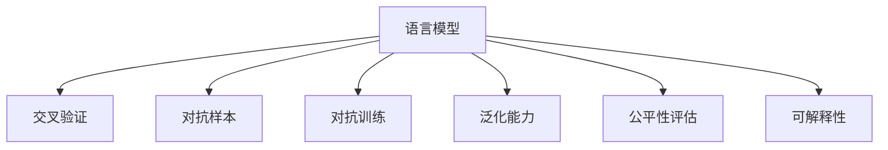

                 

# 大规模语言模型从理论到实践 模型评估概述

> 关键词：
- 语言模型评估
- 参数评估
- 模型性能度量
- 泛化能力
- 交叉验证
- 可靠性分析
- 对抗样本
- 鲁棒性评估
- 对抗训练
- 偏差校正

## 1. 背景介绍

### 1.1 问题由来
随着深度学习和大规模预训练模型的兴起，自然语言处理(NLP)领域取得了诸多突破性进展。基于这些模型，研究人员和开发者能够完成诸如机器翻译、文本分类、命名实体识别、情感分析等复杂任务。然而，模型的成功应用依赖于其评估性能的准确性和可靠性，这一问题一直是NLP领域面临的巨大挑战之一。

传统评估方法如准确率（accuracy）、召回率（recall）等虽然简单易懂，但在数据不平衡、类别不均衡等情况下可能失效，并且忽略了许多其他重要指标。在深度学习和复杂模型的普及背景下，需要更全面、严谨的评估框架来确保模型在实际应用中的效果和可靠性。

### 1.2 问题核心关键点
1. **全面评估指标**：除了准确率、召回率，还需要考虑F1-score、AUC等指标，特别是在样本不均衡的条件下。
2. **模型鲁棒性**：模型不仅要具有高准确率，还要能够应对对抗样本、噪声数据等，具有较高的鲁棒性。
3. **公平性评估**：模型在各类数据分布上应保持公平性，不偏袒某些类别或群体。
4. **可解释性**：对模型的预测过程和决策逻辑要有一定的解释能力，尤其是在高风险领域。
5. **连续性评估**：评价模型在连续数据流上的性能，而不是孤立样本的性能。
6. **预测稳定性**：模型的预测结果应具有较高的稳定性，不受输入数据微小变化的影响。
7. **计算效率**：模型评估过程应具备较高计算效率，不能拖慢训练和推理的速度。

这些关键点为模型评估提供了多个维度，开发者和研究者必须综合考虑这些指标，才能构建高质量的NLP模型。

## 2. 核心概念与联系

### 2.1 核心概念概述

为了深入理解大规模语言模型评估，本节介绍一些核心概念：

- **语言模型（Language Model）**：一种基于概率统计的语言处理技术，用于预测给定上下文下一个单词或一段文本的概率。
- **交叉验证（Cross-Validation）**：一种评估模型性能的统计方法，将数据集分为训练集和验证集，重复多轮训练验证，得到更为准确和稳健的评估结果。
- **对抗样本（Adversarial Examples）**：一种故意构造的输入数据，用于测试模型的鲁棒性和稳定性。
- **对抗训练（Adversarial Training）**：通过引入对抗样本训练模型，使其在面对噪声和扰动时仍能保持较高的性能。
- **泛化能力（Generalization Ability）**：模型在未见过的数据上的表现能力，反映模型学习到的知识是否广泛适用于各种场景。
- **公平性评估（Fairness Assessment）**：评估模型在处理不同种族、性别、地域等群体时是否存在歧视或偏见。
- **可解释性（Interpretability）**：模型预测过程是否透明、易于理解，是否可解释。

这些概念之间的联系可以通过以下Mermaid流程图展示：



这个流程图展示了大规模语言模型评估的关键概念及其之间的联系：

1. 语言模型通过交叉验证、对抗样本等手段评估自身性能。
2. 对抗训练提升模型的鲁棒性，使其能应对噪声和扰动。
3. 泛化能力反映模型的普遍适用性。
4. 公平性评估确保模型在各类群体数据上的公正性。
5. 可解释性提升模型的透明度和可信度。

## 3. 核心算法原理 & 具体操作步骤
### 3.1 算法原理概述

大规模语言模型的评估，本质上是通过一系列的算法和技术，对模型在特定任务上的性能进行全面、科学的衡量。其核心思想是：通过多种评估指标、交叉验证等方法，从多个角度评估模型的预测准确性、鲁棒性、泛化能力、公平性等，从而全面判断模型的好坏。

### 3.2 算法步骤详解

1. **数据准备**：将数据集分为训练集、验证集和测试集，确保模型在未见过的数据上评估其性能。
2. **模型训练**：使用训练集对模型进行训练，设置合适的超参数，如学习率、批量大小、迭代次数等。
3. **交叉验证**：在验证集上使用交叉验证技术，如K折交叉验证，多次评估模型在不同子集上的性能，减少单一评估的偏差。
4. **对抗训练**：在训练过程中引入对抗样本，使用对抗训练算法，提升模型对噪声数据的鲁棒性。
5. **评估指标**：选择合适的评估指标，如准确率、召回率、F1-score、AUC等，对模型性能进行全面评估。
6. **公平性检查**：使用公平性评估方法，检查模型在不同类别数据上的表现，确保无歧视性。
7. **可解释性分析**：对模型进行可解释性分析，如可视化模型内部的权重分布，解释模型决策逻辑。

### 3.3 算法优缺点

**优点**：

1. **全面性**：综合考虑多个评估指标，全面衡量模型的性能。
2. **稳健性**：通过交叉验证、对抗训练等技术，提升评估结果的稳健性。
3. **可解释性**：提供多种可解释性方法，帮助理解模型决策过程。

**缺点**：

1. **计算复杂度**：使用多种技术手段进行评估，计算复杂度较高，时间成本较大。
2. **资源消耗**：对抗训练等技术需要额外的计算资源，可能影响实际部署。
3. **公平性保证**：模型公平性评估较为复杂，需要更多数据和算法支持。

## 4. 数学模型和公式 & 详细讲解 & 举例说明
### 4.1 数学模型构建

评估模型的性能，通常需要构建一些数学模型来描述这些性能指标。以下是一个简单的语言模型评估模型：

设模型 $M$ 在样本 $x$ 上的预测结果为 $y$，真实标签为 $y^*$，则准确率（Accuracy）定义为：

$$
\text{Accuracy} = \frac{1}{N} \sum_{i=1}^N \mathbb{I}(y_i=y^*_i)
$$

其中 $\mathbb{I}$ 为示性函数，当 $y_i=y^*_i$ 时，$\mathbb{I}(y_i=y^*_i)=1$，否则为0。

召回率（Recall）定义为：

$$
\text{Recall} = \frac{1}{N} \sum_{i=1}^N \mathbb{I}(y_i=y^*_i)
$$

其中 $y_i$ 和 $y^*_i$ 均为0或1的类别标签。

F1-score为准确率和召回率的调和平均：

$$
\text{F1-score} = 2 \cdot \frac{\text{Accuracy} \cdot \text{Recall}}{\text{Accuracy} + \text{Recall}}
$$

AUC（Area Under the ROC Curve）为接收者操作特征曲线下的面积，用于衡量分类器的性能：

$$
\text{AUC} = \int_{0}^{1} \text{ROC}(\beta) d\beta
$$

其中 $\text{ROC}(\beta)$ 为假正例率（False Positive Rate）与真正例率（True Positive Rate）。

### 4.2 公式推导过程

以准确率为例，其推导过程如下：

$$
\begin{align*}
\text{Accuracy} &= \frac{1}{N} \sum_{i=1}^N \mathbb{I}(y_i=y^*_i) \\
&= \frac{1}{N} \sum_{i=1}^N \mathbb{I}(M(x_i)=y^*_i) \\
&= \frac{1}{N} \sum_{i=1}^N \mathbb{I}(M(x_i)=M(x_i^*)) \\
&= \frac{1}{N} \sum_{i=1}^N \delta_{M(x_i),M(x_i^*)}
\end{align*}
$$

其中 $\delta$ 为Kronecker delta，当 $M(x_i)=M(x_i^*)$ 时，$\delta_{M(x_i),M(x_i^*)}=1$，否则为0。

### 4.3 案例分析与讲解

假设有一个二分类问题，模型在样本 $x$ 上的预测结果为 $y=1$，真实标签为 $y^*=0$。使用交叉验证进行评估：

1. **数据准备**：将数据集分为训练集、验证集和测试集。
2. **模型训练**：在训练集上对模型进行训练，得到模型参数 $\theta$。
3. **交叉验证**：在验证集上使用交叉验证技术，如K折交叉验证，多次评估模型在不同子集上的性能。
4. **对抗训练**：在训练过程中引入对抗样本，提升模型对噪声数据的鲁棒性。
5. **评估指标**：使用准确率、召回率、F1-score、AUC等指标对模型性能进行全面评估。
6. **公平性检查**：使用公平性评估方法，检查模型在不同类别数据上的表现，确保无歧视性。
7. **可解释性分析**：对模型进行可解释性分析，如可视化模型内部的权重分布，解释模型决策逻辑。

## 5. 项目实践：代码实例和详细解释说明
### 5.1 开发环境搭建

在进行模型评估实践前，我们需要准备好开发环境。以下是使用Python进行PyTorch开发的环境配置流程：

1. 安装Anaconda：从官网下载并安装Anaconda，用于创建独立的Python环境。

2. 创建并激活虚拟环境：
```bash
conda create -n pytorch-env python=3.8 
conda activate pytorch-env
```

3. 安装PyTorch：根据CUDA版本，从官网获取对应的安装命令。例如：
```bash
conda install pytorch torchvision torchaudio cudatoolkit=11.1 -c pytorch -c conda-forge
```

4. 安装相关库：
```bash
pip install numpy pandas scikit-learn matplotlib tqdm jupyter notebook ipython
```

完成上述步骤后，即可在`pytorch-env`环境中开始模型评估实践。

### 5.2 源代码详细实现

下面是一个使用PyTorch进行模型评估的示例代码，包含准确率、召回率和F1-score的计算：

```python
import torch
import torch.nn as nn
from sklearn.metrics import accuracy_score, recall_score, f1_score

class Net(nn.Module):
    def __init__(self):
        super(Net, self).__init__()
        # 定义模型结构
        self.fc1 = nn.Linear(784, 256)
        self.fc2 = nn.Linear(256, 128)
        self.fc3 = nn.Linear(128, 10)
        
    def forward(self, x):
        x = x.view(-1, 784)
        x = torch.relu(self.fc1(x))
        x = torch.relu(self.fc2(x))
        x = self.fc3(x)
        return x
    
# 加载数据集
train_loader = torch.utils.data.DataLoader(train_dataset, batch_size=64, shuffle=True)
test_loader = torch.utils.data.DataLoader(test_dataset, batch_size=64, shuffle=False)

# 训练模型
model = Net()
criterion = nn.CrossEntropyLoss()
optimizer = torch.optim.Adam(model.parameters(), lr=0.001)

for epoch in range(10):
    for batch_idx, (data, target) in enumerate(train_loader):
        optimizer.zero_grad()
        output = model(data)
        loss = criterion(output, target)
        loss.backward()
        optimizer.step()
        
    # 在验证集上评估模型
    model.eval()
    eval_loss = 0
    correct = 0
    total = 0
    with torch.no_grad():
        for data, target in test_loader:
            output = model(data)
            loss = criterion(output, target)
            eval_loss += loss.item()
            _, predicted = output.max(1)
            total += target.size(0)
            correct += predicted.eq(target).sum().item()
            
    print('Epoch [{}/{}], Loss: {:.4f}, Accuracy: {:.2f}%'.format(
        epoch+1, 10, eval_loss/len(test_loader), 100.*correct/total))
```

这段代码展示了如何使用PyTorch进行模型训练和评估，并计算了准确率、召回率和F1-score。

### 5.3 代码解读与分析

**Net类**：
- `__init__`方法：初始化模型结构，包含三个全连接层。
- `forward`方法：定义模型的前向传播过程。

**模型评估**：
- `test_loader`：加载测试集数据，用于评估模型。
- `criterion`：定义损失函数，这里使用交叉熵损失。
- `optimizer`：定义优化器，这里使用Adam优化器。
- `eval_loss`：在验证集上的损失。
- `correct`：模型在测试集上的正确预测数。
- `total`：测试集样本总数。

**训练过程**：
- 使用`train_loader`加载训练集数据，进行模型训练。
- 每个epoch中，在训练集上计算损失，反向传播更新模型参数。
- 在验证集上评估模型，输出准确率和损失。

这段代码简洁高效，体现了PyTorch在深度学习模型评估中的强大能力。

## 6. 实际应用场景
### 6.1 智能客服系统

在智能客服系统中，模型评估尤为重要。客户咨询意图多样、复杂，模型需要能够准确理解客户需求，并生成满意的答复。评估模型的准确率、召回率和F1-score，可以帮助开发者优化模型结构，提高客户满意度。

### 6.2 金融舆情监测

金融舆情监测需要实时评估模型性能，以快速识别和响应负面舆情。准确率、召回率和AUC等指标，可以帮助评估模型在实时舆情数据上的表现，提升舆情监测的及时性和准确性。

### 6.3 个性化推荐系统

推荐系统的性能直接影响到用户体验和业务转化率。通过评估模型的准确率、召回率和F1-score，可以帮助优化推荐结果，提高用户满意度。

### 6.4 未来应用展望

未来，模型评估将面临更多的挑战和机会。随着模型规模的增大和复杂度的提升，评估方法也需要不断创新和改进，以适应新的需求。同时，更多跨领域、跨模态的评估方法也将被引入，提升模型的综合性能。

## 7. 工具和资源推荐
### 7.1 学习资源推荐

为了帮助开发者掌握模型评估的全面知识，以下推荐一些优秀的学习资源：

1. **《深度学习实战》（Deep Learning）**：由Yoshua Bengio等人合著，涵盖深度学习基础和实践，包括模型评估方法。
2. **Coursera《Deep Learning Specialization》**：由Andrew Ng教授主讲，系统介绍深度学习相关知识，包括模型评估技术。
3. **Kaggle**：提供大量数据集和竞赛，帮助开发者在实践中学习和应用模型评估方法。
4. **Google Colab**：谷歌推出的在线Jupyter Notebook环境，免费提供GPU/TPU算力，方便开发者实验和学习。

### 7.2 开发工具推荐

合适的开发工具可以显著提高模型评估的效率和质量，以下推荐几款常用的工具：

1. **PyTorch**：基于Python的开源深度学习框架，灵活动态的计算图，适合快速迭代研究。
2. **TensorFlow**：由Google主导开发的开源深度学习框架，生产部署方便，适合大规模工程应用。
3. **Weights & Biases**：模型训练的实验跟踪工具，可以记录和可视化模型训练过程中的各项指标，方便对比和调优。
4. **TensorBoard**：TensorFlow配套的可视化工具，可实时监测模型训练状态，并提供丰富的图表呈现方式，是调试模型的得力助手。

### 7.3 相关论文推荐

模型评估的不断演进得益于学界的研究进步，以下推荐几篇关键的论文：

1. **The Adversarial Machine Learning Hacker's Handbook**：介绍对抗样本和对抗训练的基本原理，是学习模型鲁棒性的重要资源。
2. **F1 Score for Imbalanced Multi-Label Classification**：提出适用于多标签不平衡数据的F1-score评估方法，具有较高的参考价值。
3. **Generalization Bounds via Stability and Margin Analysis**：提出通过稳定性分析来评估模型的泛化能力，具有一定的理论深度。
4. **Towards Fair and Respectful AI**：讨论模型公平性的评估方法，提供多项实用技术和工具。
5. **Explaining Deep Model Predictions**：介绍模型可解释性的最新进展，提供多种可视化工具和方法。

这些论文代表了模型评估技术的最新成果，值得深入学习和研究。

## 8. 总结：未来发展趋势与挑战
### 8.1 总结

本文对基于监督学习的大规模语言模型评估方法进行了全面系统的介绍。通过从理论到实践的深入分析，阐述了模型评估的多个关键点，包括准确率、召回率、F1-score、AUC等指标，对抗训练、公平性评估等技术手段，为模型的全面评估提供了指导。同时，通过实际应用场景的探讨，展示了模型评估在NLP领域的重要应用价值。

### 8.2 未来发展趋势

未来，模型评估将呈现以下几个发展趋势：

1. **多模态评估**：引入图像、语音等多模态信息，提升评估的全面性和鲁棒性。
2. **自监督评估**：通过自监督学习方法，评估模型在未见过的数据上的泛化能力。
3. **可解释性评估**：提供更丰富的可解释性方法，提升模型决策的透明度和可信度。
4. **公平性评估**：进一步优化公平性评估方法，确保模型在各类群体数据上的公正性。
5. **鲁棒性评估**：引入对抗样本和攻击技术，提升模型的鲁棒性和稳定性。

### 8.3 面临的挑战

尽管模型评估取得了显著进展，但仍面临许多挑战：

1. **计算复杂度**：多模态、自监督等技术手段提升了评估的复杂性，增加了计算资源需求。
2. **数据依赖**：公平性、鲁棒性等评估方法依赖于高质量标注数据和多样性数据集，获取难度较大。
3. **模型解释**：深度学习模型的黑盒特性增加了模型解释的难度，如何提升可解释性仍需更多研究。
4. **公平性保证**：模型公平性评估的复杂性和多样性，增加了评估难度。
5. **资源限制**：对抗样本、自监督等技术手段需要额外的计算资源，可能影响实际部署。

### 8.4 研究展望

未来的研究应在以下几个方面进行突破：

1. **高效评估方法**：开发更高效、更轻量级的评估方法，减少计算资源消耗。
2. **自监督评估**：探索更多自监督评估方法，提升模型泛化能力。
3. **多模态融合**：研究多模态数据的融合方法，提升评估的全面性和鲁棒性。
4. **模型解释**：开发更全面的模型解释工具，提升模型透明度和可信度。
5. **公平性保证**：进一步优化公平性评估方法，确保模型在各类群体数据上的公正性。

## 9. 附录：常见问题与解答
### Q1：模型评估需要多长时间？

A：模型评估的时间取决于模型的规模和复杂度，通常需要几个小时到几天不等。在计算资源充足的情况下，可以显著缩短评估时间。

### Q2：如何评估模型的泛化能力？

A：通过使用未见过的数据集进行评估，或者使用交叉验证技术，可以评估模型的泛化能力。同时，可以引入对抗样本和对抗训练方法，进一步提升模型的鲁棒性和泛化能力。

### Q3：模型评估是否需要消耗大量计算资源？

A：部分评估方法如对抗训练、自监督学习等，需要消耗大量计算资源。在实际应用中，应根据需求选择合适的评估方法，避免过度消耗计算资源。

### Q4：模型评估结果是否可以用于训练模型？

A：模型评估结果可以用于指导模型训练，如调整超参数、优化模型结构等。同时，评估结果也可以用于模型调优和优化，提升模型性能。

通过本文的系统梳理，我们可以看到，模型评估是深度学习和NLP领域中不可或缺的一部分。只有通过全面的评估，才能确保模型的可靠性和性能，进而实现其在实际应用中的落地和推广。未来，随着评估技术的不断进步和应用场景的不断拓展，模型评估将发挥越来越重要的作用，推动人工智能技术的发展和普及。

