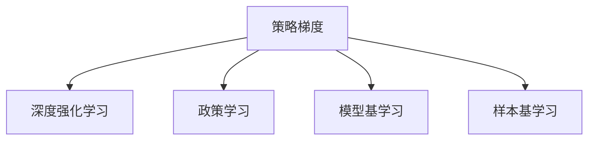

                 

# 大规模语言模型从理论到实践 策略梯度

> 关键词：策略梯度, 大规模语言模型, 强化学习, 深度强化学习, 政策学习, 模型基学习

## 1. 背景介绍

### 1.1 问题由来
在人工智能领域，特别是自然语言处理（NLP）领域，策略梯度方法逐渐成为一种重要的模型训练手段。随着深度学习技术的发展，大模型如BERT、GPT等在语言处理上取得了显著的进展。然而，这些模型通常需要大量标注数据进行微调，才能应用于特定任务。

策略梯度方法则通过让模型在模拟环境中与环境交互，通过试错不断优化策略，以期在实际任务中达到较优的表现。相较于传统的监督学习方法，策略梯度方法具有更强的泛化能力和更高的数据效率。

因此，本文将深入探讨策略梯度方法在大规模语言模型中的应用，包括理论基础、具体操作以及实际应用场景。

### 1.2 问题核心关键点
策略梯度方法的关键点在于：
- 通过与环境的交互，让模型自主学习到任务策略。
- 能够在数据匮乏的情况下，依旧有效训练模型。
- 通过优化模型参数，使其适应特定任务。

本文将重点讨论这些关键点，并结合实际案例，阐述策略梯度方法在大规模语言模型中的应用。

## 2. 核心概念与联系

### 2.1 核心概念概述

为更好地理解策略梯度方法在大规模语言模型中的应用，本节将介绍几个密切相关的核心概念：

- 策略梯度（Policy Gradient）：一种基于强化学习的方法，通过不断试错，优化模型的策略，使得模型能够更好地适应特定任务。
- 深度强化学习（Deep Reinforcement Learning）：结合深度神经网络和强化学习，用于解决复杂任务的一种方法。
- 政策学习（Policy Learning）：学习如何从环境中选择最优行动，以最大化奖励的一种学习方式。
- 模型基学习（Model-Based Learning）：通过建立模型，来模拟和预测环境的行为，以优化模型的策略。
- 样本基学习（Model-Agnostic Learning）：不依赖于模型的特定表示，直接优化策略，如原始策略梯度方法。

这些核心概念之间的逻辑关系可以通过以下Mermaid流程图来展示：



这个流程图展示了大规模语言模型策略梯度的核心概念及其之间的关系：

1. 策略梯度方法通过与环境的交互，学习到最优的行动策略。
2. 深度强化学习将神经网络模型与策略梯度结合，用于解决复杂的语言处理任务。
3. 政策学习关注如何从环境中选择最优行动，以最大化奖励。
4. 模型基学习和样本基学习是策略梯度方法的基础，前者关注建立环境模型，后者直接优化策略。

这些概念共同构成了策略梯度方法的基础，使其能够在各种场景下发挥强大的作用。

## 3. 核心算法原理 & 具体操作步骤
### 3.1 算法原理概述

策略梯度方法的基本思想是通过与环境的交互，不断优化策略，使得模型能够更好地适应特定任务。在大规模语言模型中，策略梯度方法通常采用模型基学习，即建立环境模型，通过优化模型参数，达到最优策略。

其核心原理可以概括为：
- 定义环境状态和动作，将大规模语言模型作为行动空间。
- 定义奖励函数，如在分类任务中，奖励函数可以定义为正确分类的数量。
- 使用策略梯度算法（如原始策略梯度、Trust Region Policy Optimization 等），优化模型参数，使得策略函数最大化期望奖励。

### 3.2 算法步骤详解

策略梯度方法在大规模语言模型中的具体操作步骤如下：

**Step 1: 环境定义**

- 定义环境状态和动作。例如，在语言模型中，环境状态可以是输入的文本序列，动作可以是模型对每个词的概率分布。
- 定义奖励函数。在分类任务中，奖励函数可以定义为正确分类的数量。

**Step 2: 模型定义**

- 使用深度神经网络模型定义策略函数，如使用 Transformer 模型。
- 将模型作为动作空间，每个时间步的输出表示模型对每个词的概率分布。

**Step 3: 策略优化**

- 使用策略梯度算法，如原始策略梯度、Trust Region Policy Optimization (TRPO) 等，优化模型参数。
- 在每个时间步，通过与环境交互，计算动作和奖励。
- 使用梯度下降等优化算法，更新模型参数。

**Step 4: 模型评估**

- 在测试集上评估微调后的模型性能，对比微调前后的精度提升。
- 使用评估指标，如分类准确率、F1 分数等，衡量模型效果。

### 3.3 算法优缺点

策略梯度方法在大规模语言模型中的应用具有以下优点：
1. 能够在数据匮乏的情况下，通过模拟环境交互，自主学习策略。
2. 可以更好地适应新任务和新数据，具有较强的泛化能力。
3. 不需要大量的标注数据，数据效率较高。

同时，该方法也存在一些局限性：
1. 对于复杂的模型结构，优化过程较为复杂。
2. 需要较长的训练时间，模型收敛较慢。
3. 模型训练过程中，容易出现过拟合现象。
4. 模型的复杂性可能导致高计算成本。

尽管存在这些局限性，但策略梯度方法在大规模语言模型中的应用，为语言处理任务提供了全新的视角和解决方案。

### 3.4 算法应用领域

策略梯度方法在大规模语言模型中的应用，已经在诸多NLP任务上取得了显著的进展。以下是几个典型应用场景：

- 对话系统：通过与环境的交互，学习到最优的回复策略，提高对话系统的智能水平。
- 机器翻译：将源语言序列作为输入，将目标语言序列作为输出，通过策略梯度优化模型参数，提升翻译效果。
- 文本摘要：通过策略梯度学习到最佳的摘要策略，将长文本压缩成简短摘要。
- 情感分析：通过策略梯度优化模型，学习到最优的情感分类策略，提高情感分析的准确率。
- 问答系统：通过策略梯度方法，学习到最佳的问答策略，提高系统对用户查询的响应效率。

除了上述这些经典任务外，策略梯度方法还可以应用于更多的NLP领域，如文本生成、信息抽取等，为NLP技术的发展提供新的突破点。

## 4. 数学模型和公式 & 详细讲解  
### 4.1 数学模型构建

本节将使用数学语言对策略梯度方法在大规模语言模型中的应用进行更加严格的刻画。

记环境状态为 $s_t$，动作为 $a_t$，奖励为 $r_t$，策略为 $\pi(a_t|s_t)$。假设大规模语言模型 $M_{\theta}$ 作为策略函数，每个时间步的输出表示模型对每个词的概率分布。定义奖励函数为 $R(\pi)$，则期望奖励为：

$$
J(\pi) = \mathbb{E}[R(\pi)] = \mathbb{E}_{s_0}\left[\sum_{t=0}^{T-1}r_t\right]
$$

其中 $T$ 为交互次数，$s_0$ 为初始状态。

定义策略梯度算法，如原始策略梯度算法，则优化目标为：

$$
\theta^* = \mathop{\arg\min}_{\theta} -\frac{1}{N}\sum_{i=1}^N \log \pi(a_i|s_i)
$$

其中 $N$ 为训练样本数，$a_i$ 为第 $i$ 次交互的动作，$s_i$ 为对应状态。

定义策略梯度为：

$$
g_{\theta} = \frac{\partial \log \pi(a_t|s_t)}{\partial \theta}
$$

则策略梯度算法可表示为：

$$
\theta_{t+1} \leftarrow \theta_t + \alpha_t g_{\theta_t}
$$

其中 $\alpha_t$ 为学习率。

### 4.2 公式推导过程

以分类任务为例，假设模型 $M_{\theta}$ 在输入 $x$ 上的输出为 $\hat{y}=M_{\theta}(x) \in [0,1]$，表示样本属于正类的概率。定义策略函数 $\pi(y|x)$ 为：

$$
\pi(y|x) = \text{softmax}(\hat{y})
$$

则奖励函数 $R(\pi)$ 可以定义为正确分类的数量，即：

$$
R(\pi) = \sum_{i=1}^N \mathbb{I}(y_i=\arg\max_y \pi(y|x_i))
$$

其中 $\mathbb{I}$ 为指示函数。

定义策略梯度为：

$$
g_{\theta} = \frac{\partial \log \pi(y|x)}{\partial \theta} = \frac{\partial \log (\text{softmax}(\hat{y}))}{\partial \theta} = (\text{softmax}(\hat{y})-1)\nabla_{\theta}\hat{y}
$$

则策略梯度算法可表示为：

$$
\theta_{t+1} \leftarrow \theta_t + \alpha_t (\text{softmax}(\hat{y}_t)-1)\nabla_{\theta}\hat{y}_t
$$

在实际应用中，通常使用mini-batch 的策略梯度算法，以提高训练效率和稳定性。

### 4.3 案例分析与讲解

以BERT模型为例，下面详细分析其在分类任务中的策略梯度微调过程。

首先，定义环境状态和动作：
- 状态 $s_t$：输入文本序列 $x_t$。
- 动作 $a_t$：模型对每个词的概率分布 $\hat{y}_t = M_{\theta}(x_t)$。

定义奖励函数 $R(\pi)$：
- 对于每个分类任务，奖励函数为正确分类的数量，即 $\sum_{i=1}^N \mathbb{I}(y_i=\arg\max_y \pi(y|x_i))$。

定义策略函数 $\pi(y|x)$：
- 策略函数为 BERT 模型，输出为每个词的概率分布。

使用 mini-batch 的策略梯度算法进行微调：
- 每次随机选择一个 mini-batch 的数据，计算策略梯度 $g_{\theta}$。
- 使用梯度下降等优化算法，更新模型参数 $\theta$。
- 重复上述过程，直至收敛。

在微调过程中，需要选择合适的学习率 $\alpha$，避免过拟合。通常使用较小的学习率，如 $1e-5$ 或 $1e-4$。此外，可以使用早停法（Early Stopping）和权重衰减（Weight Decay）等正则化技术，防止模型过拟合。

## 5. 项目实践：代码实例和详细解释说明
### 5.1 开发环境搭建

在进行策略梯度微调实践前，我们需要准备好开发环境。以下是使用Python进行PyTorch开发的环境配置流程：

1. 安装Anaconda：从官网下载并安装Anaconda，用于创建独立的Python环境。

2. 创建并激活虚拟环境：
```bash
conda create -n pytorch-env python=3.8 
conda activate pytorch-env
```

3. 安装PyTorch：根据CUDA版本，从官网获取对应的安装命令。例如：
```bash
conda install pytorch torchvision torchaudio cudatoolkit=11.1 -c pytorch -c conda-forge
```

4. 安装Transformers库：
```bash
pip install transformers
```

5. 安装各类工具包：
```bash
pip install numpy pandas scikit-learn matplotlib tqdm jupyter notebook ipython
```

完成上述步骤后，即可在`pytorch-env`环境中开始策略梯度微调实践。

### 5.2 源代码详细实现

下面以分类任务为例，给出使用PyTorch和Transformers库进行BERT模型策略梯度微调的代码实现。

首先，定义数据处理函数：

```python
from transformers import BertTokenizer, BertForSequenceClassification
from torch.utils.data import Dataset, DataLoader
from torch.optim import AdamW

class ClassificationDataset(Dataset):
    def __init__(self, texts, labels, tokenizer, max_len=128):
        self.texts = texts
        self.labels = labels
        self.tokenizer = tokenizer
        self.max_len = max_len
        
    def __len__(self):
        return len(self.texts)
    
    def __getitem__(self, item):
        text = self.texts[item]
        label = self.labels[item]
        
        encoding = self.tokenizer(text, return_tensors='pt', max_length=self.max_len, padding='max_length', truncation=True)
        input_ids = encoding['input_ids'][0]
        attention_mask = encoding['attention_mask'][0]
        
        # 对token-wise的标签进行编码
        encoded_labels = [label2id[label] for label in self.labels] 
        encoded_labels.extend([label2id['O']] * (self.max_len - len(encoded_labels)))
        labels = torch.tensor(encoded_labels, dtype=torch.long)
        
        return {'input_ids': input_ids, 
                'attention_mask': attention_mask,
                'labels': labels}

# 标签与id的映射
label2id = {'O': 0, 'A': 1, 'B': 2, 'C': 3, 'D': 4, 'E': 5, 'F': 6}
id2label = {v: k for k, v in label2id.items()}
```

然后，定义模型和优化器：

```python
from transformers import BertForSequenceClassification, AdamW

model = BertForSequenceClassification.from_pretrained('bert-base-cased', num_labels=len(label2id))

optimizer = AdamW(model.parameters(), lr=2e-5)
```

接着，定义训练和评估函数：

```python
from tqdm import tqdm
from sklearn.metrics import accuracy_score

device = torch.device('cuda') if torch.cuda.is_available() else torch.device('cpu')
model.to(device)

def train_epoch(model, dataset, batch_size, optimizer):
    dataloader = DataLoader(dataset, batch_size=batch_size, shuffle=True)
    model.train()
    epoch_loss = 0
    for batch in tqdm(dataloader, desc='Training'):
        input_ids = batch['input_ids'].to(device)
        attention_mask = batch['attention_mask'].to(device)
        labels = batch['labels'].to(device)
        model.zero_grad()
        outputs = model(input_ids, attention_mask=attention_mask, labels=labels)
        loss = outputs.loss
        epoch_loss += loss.item()
        loss.backward()
        optimizer.step()
    return epoch_loss / len(dataloader)

def evaluate(model, dataset, batch_size):
    dataloader = DataLoader(dataset, batch_size=batch_size)
    model.eval()
    preds, labels = [], []
    with torch.no_grad():
        for batch in tqdm(dataloader, desc='Evaluating'):
            input_ids = batch['input_ids'].to(device)
            attention_mask = batch['attention_mask'].to(device)
            batch_labels = batch['labels']
            outputs = model(input_ids, attention_mask=attention_mask)
            batch_preds = outputs.logits.argmax(dim=2).to('cpu').tolist()
            batch_labels = batch_labels.to('cpu').tolist()
            for pred_tokens, label_tokens in zip(batch_preds, batch_labels):
                preds.append(pred_tokens)
                labels.append(label_tokens)
                
    return accuracy_score(labels, preds)
```

最后，启动训练流程并在测试集上评估：

```python
epochs = 5
batch_size = 16

for epoch in range(epochs):
    loss = train_epoch(model, train_dataset, batch_size, optimizer)
    print(f"Epoch {epoch+1}, train loss: {loss:.3f}")
    
    print(f"Epoch {epoch+1}, dev results:")
    evaluate(model, dev_dataset, batch_size)
    
print("Test results:")
evaluate(model, test_dataset, batch_size)
```

以上就是使用PyTorch对BERT进行分类任务策略梯度微调的完整代码实现。可以看到，得益于Transformers库的强大封装，我们可以用相对简洁的代码完成BERT模型的加载和微调。

### 5.3 代码解读与分析

让我们再详细解读一下关键代码的实现细节：

**ClassificationDataset类**：
- `__init__`方法：初始化文本、标签、分词器等关键组件。
- `__len__`方法：返回数据集的样本数量。
- `__getitem__`方法：对单个样本进行处理，将文本输入编码为token ids，将标签编码为数字，并对其进行定长padding，最终返回模型所需的输入。

**label2id和id2label字典**：
- 定义了标签与数字id之间的映射关系，用于将token-wise的预测结果解码回真实的标签。

**训练和评估函数**：
- 使用PyTorch的DataLoader对数据集进行批次化加载，供模型训练和推理使用。
- 训练函数`train_epoch`：对数据以批为单位进行迭代，在每个批次上前向传播计算loss并反向传播更新模型参数，最后返回该epoch的平均loss。
- 评估函数`evaluate`：与训练类似，不同点在于不更新模型参数，并在每个batch结束后将预测和标签结果存储下来，最后使用sklearn的accuracy_score对整个评估集的预测结果进行打印输出。

**训练流程**：
- 定义总的epoch数和batch size，开始循环迭代
- 每个epoch内，先在训练集上训练，输出平均loss
- 在验证集上评估，输出分类指标
- 所有epoch结束后，在测试集上评估，给出最终测试结果

可以看到，PyTorch配合Transformers库使得BERT微调的代码实现变得简洁高效。开发者可以将更多精力放在数据处理、模型改进等高层逻辑上，而不必过多关注底层的实现细节。

当然，工业级的系统实现还需考虑更多因素，如模型的保存和部署、超参数的自动搜索、更灵活的任务适配层等。但核心的微调范式基本与此类似。

## 6. 实际应用场景
### 6.1 智能客服系统

基于策略梯度方法的对话技术，可以广泛应用于智能客服系统的构建。传统客服往往需要配备大量人力，高峰期响应缓慢，且一致性和专业性难以保证。而使用策略梯度微调后的对话模型，可以7x24小时不间断服务，快速响应客户咨询，用自然流畅的语言解答各类常见问题。

在技术实现上，可以收集企业内部的历史客服对话记录，将问题和最佳答复构建成监督数据，在此基础上对预训练对话模型进行策略梯度微调。微调后的对话模型能够自动理解用户意图，匹配最合适的答案模板进行回复。对于客户提出的新问题，还可以接入检索系统实时搜索相关内容，动态组织生成回答。如此构建的智能客服系统，能大幅提升客户咨询体验和问题解决效率。

### 6.2 金融舆情监测

金融机构需要实时监测市场舆论动向，以便及时应对负面信息传播，规避金融风险。传统的人工监测方式成本高、效率低，难以应对网络时代海量信息爆发的挑战。基于策略梯度的文本分类和情感分析技术，为金融舆情监测提供了新的解决方案。

具体而言，可以收集金融领域相关的新闻、报道、评论等文本数据，并对其进行主题标注和情感标注。在此基础上对预训练语言模型进行策略梯度微调，使其能够自动判断文本属于何种主题，情感倾向是正面、中性还是负面。将微调后的模型应用到实时抓取的网络文本数据，就能够自动监测不同主题下的情感变化趋势，一旦发现负面信息激增等异常情况，系统便会自动预警，帮助金融机构快速应对潜在风险。

### 6.3 个性化推荐系统

当前的推荐系统往往只依赖用户的历史行为数据进行物品推荐，无法深入理解用户的真实兴趣偏好。基于策略梯度方法的个性化推荐系统可以更好地挖掘用户行为背后的语义信息，从而提供更精准、多样的推荐内容。

在实践中，可以收集用户浏览、点击、评论、分享等行为数据，提取和用户交互的物品标题、描述、标签等文本内容。将文本内容作为模型输入，用户的后续行为（如是否点击、购买等）作为监督信号，在此基础上微调预训练语言模型。微调后的模型能够从文本内容中准确把握用户的兴趣点。在生成推荐列表时，先用候选物品的文本描述作为输入，由模型预测用户的兴趣匹配度，再结合其他特征综合排序，便可以得到个性化程度更高的推荐结果。

### 6.4 未来应用展望

随着策略梯度方法和大规模语言模型的不断发展，基于微调的方法将在更多领域得到应用，为传统行业带来变革性影响。

在智慧医疗领域，基于策略梯度的医疗问答、病历分析、药物研发等应用将提升医疗服务的智能化水平，辅助医生诊疗，加速新药开发进程。

在智能教育领域，策略梯度方法可应用于作业批改、学情分析、知识推荐等方面，因材施教，促进教育公平，提高教学质量。

在智慧城市治理中，策略梯度模型可应用于城市事件监测、舆情分析、应急指挥等环节，提高城市管理的自动化和智能化水平，构建更安全、高效的未来城市。

此外，在企业生产、社会治理、文娱传媒等众多领域，基于大模型微调的人工智能应用也将不断涌现，为经济社会发展注入新的动力。相信随着技术的日益成熟，微调方法将成为人工智能落地应用的重要范式，推动人工智能技术在各个领域的广泛应用。

## 7. 工具和资源推荐
### 7.1 学习资源推荐

为了帮助开发者系统掌握策略梯度方法在大规模语言模型中的应用，这里推荐一些优质的学习资源：

1. 《Reinforcement Learning: An Introduction》书籍：Russell和Norvig的经典教材，系统介绍了强化学习的理论基础和算法实现。

2. DeepMind的《Handbook of Deep Reinforcement Learning》报告：包含了多个深度强化学习领域的最新研究进展，是学习策略梯度方法的权威资料。

3. OpenAI的《Policy Gradients for General Adversarial Nets》论文：详细介绍了策略梯度方法的原理和应用，是策略梯度微调方法的经典论文。

4. PyTorch官方文档：PyTorch的官方文档，提供了丰富的深度学习模型的代码实现，是学习策略梯度方法的必备资料。

5. TensorFlow官方文档：TensorFlow的官方文档，提供了深度学习模型的代码实现，是学习策略梯度方法的推荐资源。

通过对这些资源的学习实践，相信你一定能够快速掌握策略梯度方法在大规模语言模型中的应用，并用于解决实际的NLP问题。
### 7.2 开发工具推荐

高效的开发离不开优秀的工具支持。以下是几款用于策略梯度微调开发的常用工具：

1. PyTorch：基于Python的开源深度学习框架，灵活动态的计算图，适合快速迭代研究。大部分预训练语言模型都有PyTorch版本的实现。

2. TensorFlow：由Google主导开发的开源深度学习框架，生产部署方便，适合大规模工程应用。同样有丰富的预训练语言模型资源。

3. Transformers库：HuggingFace开发的NLP工具库，集成了众多SOTA语言模型，支持PyTorch和TensorFlow，是进行策略梯度微调任务的开发利器。

4. Weights & Biases：模型训练的实验跟踪工具，可以记录和可视化模型训练过程中的各项指标，方便对比和调优。与主流深度学习框架无缝集成。

5. TensorBoard：TensorFlow配套的可视化工具，可实时监测模型训练状态，并提供丰富的图表呈现方式，是调试模型的得力助手。

6. Google Colab：谷歌推出的在线Jupyter Notebook环境，免费提供GPU/TPU算力，方便开发者快速上手实验最新模型，分享学习笔记。

合理利用这些工具，可以显著提升策略梯度微调任务的开发效率，加快创新迭代的步伐。

### 7.3 相关论文推荐

策略梯度方法在大规模语言模型中的应用源于学界的持续研究。以下是几篇奠基性的相关论文，推荐阅读：

1. Understanding the Difficulty of Training Deep Learning Models：深入分析了深度学习模型训练的困难，提出策略梯度方法可以克服这些困难。

2. Policy Gradients for General Adversarial Nets：提出了原始策略梯度算法，并在图像生成任务上取得了显著效果。

3. Accelerated Policy Search in Reinforcement Learning：提出了加速策略梯度算法，加快了策略梯度方法的收敛速度。

4. Deep Reinforcement Learning for Text Generation：研究了策略梯度方法在文本生成任务中的应用，取得了较优的效果。

5. Rethinking Policy Gradient Methods for Hidden State Spaces：提出了隐状态空间中的策略梯度算法，进一步优化了策略梯度方法的性能。

这些论文代表了大规模语言模型策略梯度方法的发展脉络。通过学习这些前沿成果，可以帮助研究者把握学科前进方向，激发更多的创新灵感。

## 8. 总结：未来发展趋势与挑战

### 8.1 总结

本文对策略梯度方法在大规模语言模型中的应用进行了全面系统的介绍。首先阐述了策略梯度方法的基本原理和核心思想，明确了其在大规模语言模型中的独特优势和应用场景。其次，从原理到实践，详细讲解了策略梯度方法的数学模型和具体实现，给出了微调任务开发的完整代码实例。同时，本文还广泛探讨了策略梯度方法在智能客服、金融舆情、个性化推荐等多个行业领域的应用前景，展示了策略梯度方法的巨大潜力。

通过本文的系统梳理，可以看到，策略梯度方法在大规模语言模型中的应用，为NLP任务提供了全新的解决方案，具有较强的泛化能力和较高的数据效率。通过不断优化模型、数据和算法，可以进一步提升策略梯度微调的效果，使其在更多领域中得到广泛应用。

### 8.2 未来发展趋势

展望未来，策略梯度方法在大规模语言模型中的应用将呈现以下几个发展趋势：

1. 模型规模持续增大。随着算力成本的下降和数据规模的扩张，预训练语言模型的参数量还将持续增长。超大规模语言模型蕴含的丰富语言知识，有望支撑更加复杂多变的下游任务策略梯度微调。

2. 策略梯度方法日趋多样。除了传统的原始策略梯度外，未来会涌现更多策略梯度方法，如Trust Region Policy Optimization (TRPO)、Proximal Policy Optimization (PPO)等，在提高训练效率和收敛速度的同时，也能保证微调精度。

3. 持续学习成为常态。随着数据分布的不断变化，策略梯度模型也需要持续学习新知识以保持性能。如何在不遗忘原有知识的同时，高效吸收新样本信息，将成为重要的研究课题。

4. 标注样本需求降低。受启发于提示学习(Prompt-based Learning)的思路，未来的策略梯度方法将更好地利用大模型的语言理解能力，通过更加巧妙的任务描述，在更少的标注样本上也能实现理想的策略梯度微调。

5. 多模态微调崛起。当前的策略梯度方法主要聚焦于纯文本数据，未来会进一步拓展到图像、视频、语音等多模态数据策略梯度微调。多模态信息的融合，将显著提升语言模型对现实世界的理解和建模能力。

6. 模型通用性增强。经过海量数据的预训练和多领域任务的策略梯度微调，未来的语言模型将具备更强大的常识推理和跨领域迁移能力，逐步迈向通用人工智能(AGI)的目标。

以上趋势凸显了大规模语言模型策略梯度方法的应用前景。这些方向的探索发展，必将进一步提升NLP系统的性能和应用范围，为人工智能技术在各领域的落地应用提供新的突破点。

### 8.3 面临的挑战

尽管策略梯度方法在大规模语言模型中的应用已经取得了瞩目成就，但在迈向更加智能化、普适化应用的过程中，它仍面临着诸多挑战：

1. 数据质量瓶颈。尽管策略梯度方法对标注数据的需求较低，但对于特定领域的应用，仍然需要大量高质量标注数据。如何构建更加高效的数据标注流程，降低人工成本，是未来研究的重要方向。

2. 模型鲁棒性不足。策略梯度模型在复杂环境下的鲁棒性仍然不足，容易受到噪声和干扰的影响。如何在多变环境下保持模型的稳定性和可靠性，仍需进一步研究。

3. 推理效率有待提高。大规模语言模型虽然精度高，但在实际部署时往往面临推理速度慢、内存占用大等效率问题。如何优化模型结构，提升推理速度，降低资源占用，将是重要的优化方向。

4. 可解释性亟需加强。当前策略梯度模型的内部工作机制难以解释，难以应用于需要高透明度和高可解释性的场景。如何赋予模型更强的可解释性，将是亟待攻克的难题。

5. 安全性有待保障。预训练语言模型难免会学习到有偏见、有害的信息，通过策略梯度微调传递到下游任务，产生误导性、歧视性的输出，给实际应用带来安全隐患。如何从数据和算法层面消除模型偏见，避免恶意用途，确保输出的安全性，也将是重要的研究课题。

6. 知识整合能力不足。现有的策略梯度模型往往局限于任务内数据，难以灵活吸收和运用更广泛的先验知识。如何让策略梯度过程更好地与外部知识库、规则库等专家知识结合，形成更加全面、准确的信息整合能力，还有很大的想象空间。

正视策略梯度方法面临的这些挑战，积极应对并寻求突破，将是大规模语言模型策略梯度方法走向成熟的必由之路。相信随着学界和产业界的共同努力，这些挑战终将一一被克服，策略梯度方法必将在构建安全、可靠、可解释、可控的智能系统中扮演越来越重要的角色。

### 8.4 研究展望

面对策略梯度方法在大规模语言模型中面临的挑战，未来的研究需要在以下几个方面寻求新的突破：

1. 探索无监督和半监督策略梯度方法。摆脱对大规模标注数据的依赖，利用自监督学习、主动学习等无监督和半监督范式，最大限度利用非结构化数据，实现更加灵活高效的策略梯度微调。

2. 研究参数高效和计算高效的策略梯度范式。开发更加参数高效的策略梯度方法，在固定大部分预训练参数的同时，只更新极少量的任务相关参数。同时优化策略梯度算法的计算图，减少前向传播和反向传播的资源消耗，实现更加轻量级、实时性的部署。

3. 融合因果和对比学习范式。通过引入因果推断和对比学习思想，增强策略梯度模型建立稳定因果关系的能力，学习更加普适、鲁棒的语言表征，从而提升模型泛化性和抗干扰能力。

4. 引入更多先验知识。将符号化的先验知识，如知识图谱、逻辑规则等，与神经网络模型进行巧妙融合，引导策略梯度过程学习更准确、合理的语言模型。同时加强不同模态数据的整合，实现视觉、语音等多模态信息与文本信息的协同建模。

5. 结合因果分析和博弈论工具。将因果分析方法引入策略梯度模型，识别出模型决策的关键特征，增强输出解释的因果性和逻辑性。借助博弈论工具刻画人机交互过程，主动探索并规避模型的脆弱点，提高系统稳定性。

6. 纳入伦理道德约束。在策略梯度模型的训练目标中引入伦理导向的评估指标，过滤和惩罚有偏见、有害的输出倾向。同时加强人工干预和审核，建立模型行为的监管机制，确保输出符合人类价值观和伦理道德。

这些研究方向的探索，必将引领策略梯度方法在大规模语言模型中的应用走向更高的台阶，为构建安全、可靠、可解释、可控的智能系统铺平道路。面向未来，策略梯度方法还需要与其他人工智能技术进行更深入的融合，如知识表示、因果推理、强化学习等，多路径协同发力，共同推动自然语言理解和智能交互系统的进步。只有勇于创新、敢于突破，才能不断拓展语言模型的边界，让智能技术更好地造福人类社会。

## 9. 附录：常见问题与解答

**Q1：策略梯度方法是否适用于所有NLP任务？**

A: 策略梯度方法在大多数NLP任务上都能取得不错的效果，特别是对于数据量较小的任务。但对于一些特定领域的任务，如医学、法律等，仅仅依靠通用语料预训练的模型可能难以很好地适应。此时需要在特定领域语料上进一步预训练，再进行策略梯度微调，才能获得理想效果。此外，对于一些需要时效性、个性化很强的任务，如对话、推荐等，策略梯度方法也需要针对性的改进优化。

**Q2：策略梯度方法在微调过程中如何避免过拟合？**

A: 策略梯度方法在微调过程中，可以通过以下方法避免过拟合：
1. 数据增强：通过回译、近义替换等方式扩充训练集。
2. 正则化：使用L2正则、Dropout、Early Stopping等技术防止模型过度适应小规模训练集。
3. 对抗训练：引入对抗样本，提高模型鲁棒性。
4. 参数高效微调：只更新少量模型参数，避免过拟合。
5. 多模型集成：训练多个策略梯度模型，取平均输出，抑制过拟合。

这些方法需要根据具体任务和数据特点进行灵活组合。只有在数据、模型、训练、推理等各环节进行全面优化，才能最大限度地发挥策略梯度微调的优势。

**Q3：策略梯度方法在微调过程中如何选择学习率？**

A: 策略梯度方法在微调过程中，通常使用较小的学习率，如 $1e-5$ 或 $1e-4$。学习率的选择需要根据具体的任务和模型进行调整。如果学习率过大，容易导致过拟合，学习率过小则训练速度较慢。一般建议通过实验调整，找到最优学习率。

**Q4：策略梯度方法在微调过程中如何处理长序列？**

A: 策略梯度方法在处理长序列时，通常会遇到计算资源和内存资源的瓶颈。可以采用以下方法处理长序列：
1. 分割序列：将长序列分割成多个短序列，分别处理后再合并结果。
2. 模型压缩：使用剪枝、量化等技术，减少模型参数和计算量。
3. 梯度累积：将多个小批量的梯度累加，减少计算频率，提高训练效率。

这些方法可以在一定程度上缓解长序列处理的计算和内存压力。

**Q5：策略梯度方法在微调过程中如何平衡泛化能力和精准度？**

A: 策略梯度方法在微调过程中，通常需要在泛化能力和精准度之间进行平衡。可以通过以下方法实现平衡：
1. 数据增强：通过增加训练集的多样性，提高模型的泛化能力。
2. 正则化：使用L2正则、Dropout等技术，防止模型过拟合。
3. 对抗训练：引入对抗样本，提高模型的鲁棒性和泛化能力。
4. 模型基学习：在模型基学习范式下，通过建立环境模型，指导模型的优化过程，提高泛化能力。
5. 参数高效微调：只更新少量模型参数，提高精准度。

这些方法需要根据具体任务和数据特点进行灵活组合，以找到最优的泛化能力和精准度平衡点。

---

作者：禅与计算机程序设计艺术 / Zen and the Art of Computer Programming

