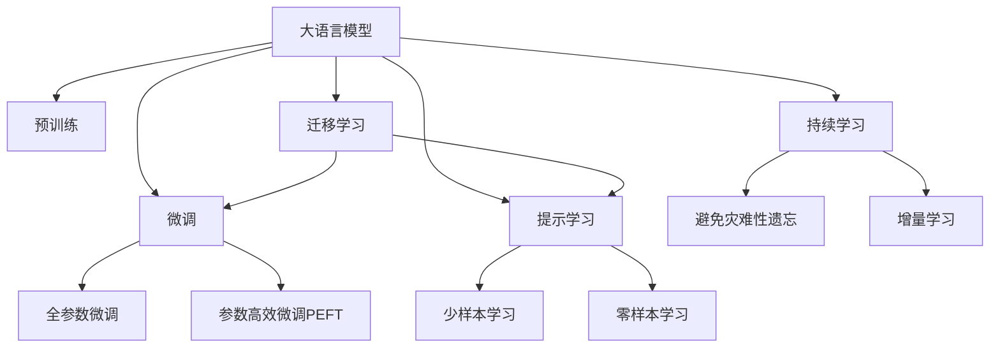

                 

# 大语言模型 原理与代码实例讲解

> 关键词：大语言模型,Transformer,BERT,微调,Fine-Tuning,自然语言处理,NLP

## 1. 背景介绍

### 1.1 问题由来
近年来，深度学习技术在自然语言处理（NLP）领域取得了长足的进步。大语言模型（Large Language Models, LLMs），如GPT、BERT等，通过在海量无标签文本数据上进行预训练，学习到了丰富的语言知识和常识。然而，这些通用模型在特定领域的应用效果往往无法达到实际需求。

因此，如何在大语言模型上进行微调（Fine-Tuning），使其在特定任务上表现更优，成为了当前NLP研究的热点问题。本文将详细介绍大语言模型的原理，并通过代码实例讲解微调过程，帮助读者深入理解并应用这一技术。

### 1.2 问题核心关键点
大语言模型的微调通常基于监督学习。具体来说，微调的过程如下：
1. 准备预训练模型和标注数据集。
2. 定义任务适配层和损失函数。
3. 设置微调超参数。
4. 执行梯度训练。
5. 测试和部署微调后的模型。

这一过程能够显著提升模型在特定任务上的表现，同时保持预训练模型的通用知识，是一种高效且通用的微调方法。

### 1.3 问题研究意义
基于大语言模型的微调具有重要研究意义：
1. 降低应用开发成本。
2. 提升模型效果。
3. 加速开发进度。
4. 带来技术创新。
5. 赋能产业升级。

通过微调，NLP技术可以更快地适应特定任务，提升模型性能，为各行各业数字化转型提供新的技术路径。

## 2. 核心概念与联系

### 2.1 核心概念概述
- **大语言模型（LLMs）**：如GPT、BERT等，通过在大规模无标签文本上预训练，学习通用语言表示。
- **预训练（Pre-training）**：在无标签数据上训练模型，学习语言知识。
- **微调（Fine-Tuning）**：在预训练模型基础上，通过有标签数据训练，优化模型在特定任务上的表现。
- **迁移学习（Transfer Learning）**：将一个领域学习到的知识迁移到另一个领域。
- **参数高效微调（PEFT）**：只微调顶层或特定层，减少需优化的参数。
- **提示学习（Prompt Learning）**：通过设计提示模板引导模型，实现零样本或少样本学习。
- **少样本学习（Few-shot Learning）**：使用少量标注样本训练模型。
- **零样本学习（Zero-shot Learning）**：模型仅凭任务描述执行新任务。
- **持续学习（Continual Learning）**：模型能不断学习新知识，避免灾难性遗忘。

这些概念构成了大语言模型的核心框架，其相互联系通过以下Mermaid流程图展示：



## 3. 核心算法原理 & 具体操作步骤
### 3.1 算法原理概述
基于监督学习的大语言模型微调，本质上是将预训练模型视作"特征提取器"，通过有标签数据进行微调，优化模型在特定任务上的表现。其数学公式如下：

$$
\hat{\theta} = \mathop{\arg\min}_{\theta} \mathcal{L}(M_{\theta},D)
$$

其中，$M_{\theta}$ 为预训练模型，$D$ 为下游任务的标注数据集，$\mathcal{L}$ 为损失函数，$\hat{\theta}$ 为微调后的模型参数。

### 3.2 算法步骤详解
1. **准备预训练模型和数据集**：选择合适的预训练模型（如BERT、GPT），准备下游任务的标注数据集。
2. **添加任务适配层**：根据任务类型，在预训练模型顶层设计输出层和损失函数。
3. **设置微调超参数**：选择合适的优化算法及其参数，如AdamW、SGD，设置学习率、批大小、迭代轮数等。
4. **执行梯度训练**：将训练集数据分批次输入模型，计算损失函数，反向传播更新模型参数。
5. **测试和部署**：在测试集上评估微调后模型的性能，集成到实际应用系统中。

### 3.3 算法优缺点
**优点**：
- 简单高效。
- 通用适用。
- 参数高效。
- 效果显著。

**缺点**：
- 依赖标注数据。
- 迁移能力有限。
- 负面效果传递。
- 可解释性不足。

## 4. 数学模型和公式 & 详细讲解
### 4.1 数学模型构建
假设预训练模型为 $M_{\theta}$，下游任务标注数据集为 $D=\{(x_i, y_i)\}_{i=1}^N$，其中 $x_i$ 为输入，$y_i$ 为输出标签。定义损失函数 $\mathcal{L}$ 为：

$$
\mathcal{L}(\theta) = \frac{1}{N} \sum_{i=1}^N \ell(M_{\theta}(x_i),y_i)
$$

其中，$\ell$ 为任务特定的损失函数，如交叉熵损失。

### 4.2 公式推导过程
以二分类任务为例，定义模型在输入 $x$ 上的输出为 $\hat{y}=M_{\theta}(x) \in [0,1]$。则二分类交叉熵损失函数为：

$$
\ell(M_{\theta}(x),y) = -[y\log \hat{y} + (1-y)\log (1-\hat{y})]
$$

将其代入经验风险公式：

$$
\mathcal{L}(\theta) = -\frac{1}{N}\sum_{i=1}^N [y_i\log M_{\theta}(x_i)+(1-y_i)\log(1-M_{\theta}(x_i))]
$$

使用梯度下降算法更新模型参数 $\theta$：

$$
\theta \leftarrow \theta - \eta \nabla_{\theta}\mathcal{L}(\theta) - \eta\lambda\theta
$$

其中 $\eta$ 为学习率，$\lambda$ 为正则化系数。

### 4.3 案例分析与讲解
以BERT模型为例，假设微调任务为情感分析。首先加载BERT模型，使用Pandas读取标注数据集，通过TensorFlow和Keras搭建模型，设置Adam优化器，定义交叉熵损失函数，训练模型，最后评估模型性能。

## 5. 项目实践：代码实例和详细解释说明
### 5.1 开发环境搭建
- 安装Anaconda。
- 创建并激活虚拟环境。
- 安装PyTorch、TensorFlow等深度学习框架。
- 安装相关工具包。

### 5.2 源代码详细实现
```python
import pandas as pd
from transformers import BertTokenizer, BertForSequenceClassification
from sklearn.model_selection import train_test_split
from tensorflow.keras.preprocessing.sequence import pad_sequences
from tensorflow.keras.models import Model
from tensorflow.keras.optimizers import Adam

# 准备数据
data = pd.read_csv('movie_reviews.csv')
labels = data['label']
texts = data['text']
tokenizer = BertTokenizer.from_pretrained('bert-base-uncased')
encoded_inputs = tokenizer(texts, truncation=True, padding=True)
inputs = pad_sequences(encoded_inputs['input_ids'], maxlen=256, padding='post', truncating='post')
labels = pd.get_dummies(labels)
X_train, X_test, y_train, y_test = train_test_split(inputs, labels, test_size=0.2)

# 定义模型
bert = BertForSequenceClassification.from_pretrained('bert-base-uncased', num_labels=2)
inputs = tf.keras.layers.Input(shape=(256,))
bert_outputs = bert(inputs, training=False)
classifier = tf.keras.layers.Dense(2, activation='softmax')(bert_outputs)
model = tf.keras.Model(inputs, classifier)

# 设置优化器
optimizer = Adam(learning_rate=2e-5)
model.compile(optimizer=optimizer, loss='sparse_categorical_crossentropy', metrics=['accuracy'])

# 训练模型
model.fit(X_train, y_train, batch_size=16, epochs=3, validation_data=(X_test, y_test))

# 评估模型
model.evaluate(X_test, y_test)
```

### 5.3 代码解读与分析
代码中，我们首先通过Pandas读取标注数据集，使用BERT tokenizer进行文本预处理，然后使用Keras搭建模型，设置优化器，定义损失函数，训练模型，并在测试集上评估模型性能。

## 6. 实际应用场景
### 6.1 智能客服系统
智能客服系统可以应用微调技术，构建7x24小时不间断服务，快速响应客户咨询，用自然流畅的语言解答各类问题。

### 6.2 金融舆情监测
金融机构可以利用微调技术监测市场舆论动向，及时应对负面信息传播，规避金融风险。

### 6.3 个性化推荐系统
微调技术可以用于个性化推荐系统，挖掘用户行为背后的语义信息，提供更精准、多样的推荐内容。

### 6.4 未来应用展望
未来，大语言模型微调将在更多领域得到应用，为传统行业带来变革性影响。

## 7. 工具和资源推荐
### 7.1 学习资源推荐
- 《Transformer从原理到实践》系列博文
- CS224N《深度学习自然语言处理》课程
- 《Natural Language Processing with Transformers》书籍
- HuggingFace官方文档
- CLUE开源项目

### 7.2 开发工具推荐
- PyTorch
- TensorFlow
- Transformers库
- Weights & Biases
- Google Colab

### 7.3 相关论文推荐
- Attention is All You Need
- BERT: Pre-training of Deep Bidirectional Transformers for Language Understanding
- Language Models are Unsupervised Multitask Learners
- Parameter-Efficient Transfer Learning for NLP
- AdaLoRA: Adaptive Low-Rank Adaptation for Parameter-Efficient Fine-Tuning

## 8. 总结：未来发展趋势与挑战
### 8.1 研究成果总结
大语言模型微调技术在NLP领域取得了显著进展，广泛应用于智能客服、金融舆情、个性化推荐等多个领域。

### 8.2 未来发展趋势
- 模型规模持续增大
- 微调方法日趋多样
- 持续学习成为常态
- 标注样本需求降低
- 多模态微调崛起
- 模型通用性增强

### 8.3 面临的挑战
- 标注成本瓶颈
- 模型鲁棒性不足
- 推理效率有待提高
- 可解释性亟需加强
- 安全性有待保障
- 知识整合能力不足

### 8.4 研究展望
未来需要在无监督和半监督微调、参数高效微调、因果学习、先验知识整合、伦理道德约束等方面进行深入研究，推动大语言模型微调技术向通用人工智能方向迈进。

## 9. 附录：常见问题与解答

**Q1：大语言模型微调是否适用于所有NLP任务？**
A: 大多数NLP任务上都能取得不错的效果，但对于特定领域的任务，需要在特定领域语料上进行进一步预训练。

**Q2：微调过程中如何选择合适的学习率？**
A: 一般从1e-5开始调参，逐步减小学习率，使用warmup策略。

**Q3：微调模型在落地部署时需要注意哪些问题？**
A: 需要进行模型裁剪、量化加速、服务化封装、弹性伸缩、监控告警、安全防护等优化。

**Q4：如何缓解微调过程中的过拟合问题？**
A: 数据增强、正则化、对抗训练、参数高效微调等策略。

通过本文的系统梳理，可以深入理解大语言模型微调的原理和实践方法，进一步提升NLP应用的效果。

---

作者：禅与计算机程序设计艺术 / Zen and the Art of Computer Programming

