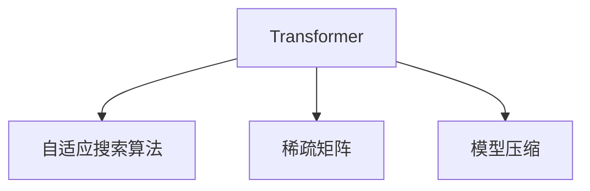
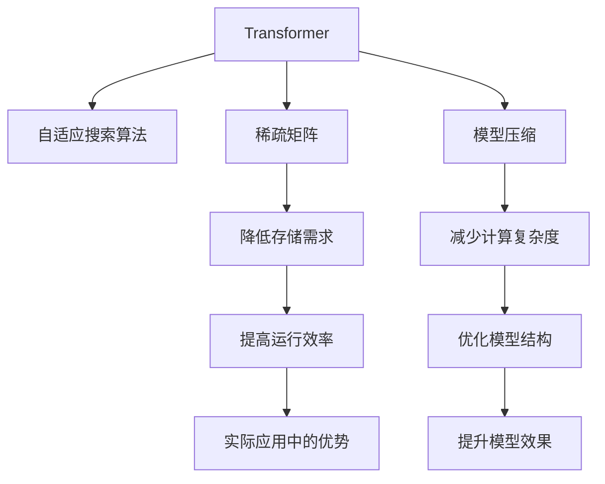

                 

# 大语言模型原理基础与前沿 搜索高效Transformer

> 关键词：Transformer, 自适应, 搜索算法, 自然语言处理, 语言模型, 稀疏矩阵, 深度学习, 模型压缩

## 1. 背景介绍

### 1.1 问题由来
Transformer模型自推出以来，因其在语言模型和机器翻译等方面的卓越表现，迅速成为了自然语言处理（NLP）领域的主流架构。在Transformer的架构中，注意力机制是其核心创新，使模型能够同时处理长序列信息，有效避免了传统RNN模型在计算时间和空间上的限制。然而，对于大规模的Transformer模型，尽管其具备较强的语言理解能力，但其计算复杂度大、存储需求高、训练时间长等问题依然不容忽视。

为解决这些问题，研究者们提出了多种针对Transformer模型的高效搜索和稀疏化技术。通过这些技术，可以有效提升模型的运行效率和空间利用率，使得Transformer模型在实际应用中更具可操作性。本文将系统介绍这些技术，并探讨其在实际应用中的表现和前景。

### 1.2 问题核心关键点
为了更好地理解基于Transformer的高效搜索和稀疏化技术，本节将介绍几个密切相关的核心概念：

- **Transformer模型**：一种基于注意力机制的深度学习模型，广泛应用于自然语言处理、机器翻译、语音识别等领域。

- **自适应搜索算法**：一种能够根据问题特点自适应调整搜索策略的算法，典型代表包括束搜索（Beam Search）、随机束搜索（Random Beam Search）等。

- **稀疏矩阵**：在深度学习中，稀疏矩阵指的是存储在稀疏格式下的矩阵，只有非零元素被存储，可以显著降低存储需求和计算复杂度。

- **深度学习模型压缩**：通过剪枝、量化、低秩分解等手段，减少深度学习模型的参数数量和计算复杂度，提高模型效率。

这些概念之间的逻辑关系可以通过以下Mermaid流程图来展示：



这个流程图展示了大语言模型在高效搜索和稀疏化方面的核心概念及其之间的关系：Transformer模型通过注意力机制实现了强大的语言理解能力，但计算复杂度高、存储需求大。通过自适应搜索算法和稀疏矩阵技术，可以有效降低计算和存储成本，而模型压缩则进一步优化了模型结构，提高了运行效率。

## 2. 核心概念与联系

### 2.1 核心概念概述

为更好地理解基于Transformer的高效搜索和稀疏化技术，本节将介绍几个密切相关的核心概念：

- **Transformer模型**：一种基于注意力机制的深度学习模型，广泛应用于自然语言处理、机器翻译、语音识别等领域。

- **自适应搜索算法**：一种能够根据问题特点自适应调整搜索策略的算法，典型代表包括束搜索（Beam Search）、随机束搜索（Random Beam Search）等。

- **稀疏矩阵**：在深度学习中，稀疏矩阵指的是存储在稀疏格式下的矩阵，只有非零元素被存储，可以显著降低存储需求和计算复杂度。

- **深度学习模型压缩**：通过剪枝、量化、低秩分解等手段，减少深度学习模型的参数数量和计算复杂度，提高模型效率。

这些核心概念之间的联系可以通过以下逻辑关系图来展示：



这个逻辑关系图展示了大语言模型在高效搜索和稀疏化方面的核心概念及其之间的联系。Transformer模型通过注意力机制实现了强大的语言理解能力，但计算复杂度高、存储需求大。通过自适应搜索算法和稀疏矩阵技术，可以有效降低计算和存储成本，而模型压缩则进一步优化了模型结构，提高了运行效率。

## 3. 核心算法原理 & 具体操作步骤
### 3.1 算法原理概述

基于Transformer的高效搜索和稀疏化技术，本质上是一种针对模型计算复杂度和存储需求的优化方法。其核心思想是：通过自适应搜索算法，在保证模型输出质量的前提下，尽可能减少计算和存储资源的使用。同时，通过稀疏矩阵和模型压缩技术，进一步优化模型结构，降低参数数量和计算复杂度，提高模型的运行效率。

形式化地，假设我们的Transformer模型为 $M_{\theta}$，其中 $\theta$ 为模型参数。设输入序列长度为 $T$，输出序列长度为 $L$，模型计算复杂度为 $O(TL^3)$。则高效搜索和稀疏化技术的目标是最小化计算复杂度和存储需求，即：

$$
\min_{\theta} (\mathcal{C} + \mathcal{S})
$$

其中，$\mathcal{C}$ 为计算复杂度，$\mathcal{S}$ 为存储需求。

### 3.2 算法步骤详解

基于Transformer的高效搜索和稀疏化技术，通常包括以下几个关键步骤：

**Step 1: 自适应搜索算法**
- 选择合适的自适应搜索算法，如束搜索、随机束搜索等。
- 根据模型特性和应用场景，确定搜索参数，如束宽、搜索深度等。
- 在训练和推理过程中，动态调整搜索策略，避免过度计算。

**Step 2: 稀疏矩阵存储**
- 根据模型参数的分布特性，采用稀疏矩阵格式存储模型权重。
- 优化矩阵的存储结构，如采用COO、CSR等格式，减少存储占用。
- 通过稀疏化操作，移除权重矩阵中的零元素，减少计算和存储资源的使用。

**Step 3: 模型压缩技术**
- 采用剪枝技术，移除模型中冗余和不重要的参数。
- 使用量化技术，将浮点参数转换为定点或整数表示，减少内存占用。
- 应用低秩分解技术，将权重矩阵分解为低秩形式，降低计算复杂度。

**Step 4: 高效计算与推理**
- 在训练和推理过程中，优化计算图，减少重复计算。
- 应用并行计算技术，利用多核CPU或GPU加速模型计算。
- 使用混合精度计算，提升模型训练和推理的效率。

### 3.3 算法优缺点

基于Transformer的高效搜索和稀疏化技术具有以下优点：
1. 降低计算复杂度：通过自适应搜索和稀疏矩阵存储，显著降低了模型的计算复杂度。
2. 减少存储需求：稀疏矩阵存储和模型压缩技术，显著减少了模型的存储需求。
3. 提升运行效率：通过优化计算图和应用并行计算技术，显著提升了模型的运行效率。
4. 优化模型结构：稀疏矩阵和模型压缩技术，优化了模型的参数和结构，提高了模型的泛化能力。

同时，这些技术也存在一些局限性：
1. 对计算资源要求高：自适应搜索和稀疏矩阵存储需要较强的计算资源支持。
2. 参数更新难度大：部分模型压缩技术如剪枝，可能需要进行多次训练才能达到最优效果。
3. 精度损失：稀疏矩阵存储和量化技术可能会带来一定的精度损失，需要平衡精度和效率。
4. 复杂度高：实现和优化这些技术需要较高的技术门槛和经验积累。

尽管存在这些局限性，但就目前而言，基于Transformer的高效搜索和稀疏化技术，已经成为了优化大语言模型计算和存储需求的有效手段。未来相关研究的重点在于如何进一步降低这些技术对计算资源的需求，提高模型的灵活性和适应性，同时兼顾精度和效率。

### 3.4 算法应用领域

基于Transformer的高效搜索和稀疏化技术，在NLP领域已经得到了广泛的应用，覆盖了几乎所有常见任务，例如：

- 文本分类：如情感分析、主题分类、意图识别等。通过自适应搜索算法和稀疏矩阵存储，优化了模型的训练和推理效率。
- 命名实体识别：识别文本中的人名、地名、机构名等特定实体。稀疏矩阵存储和模型压缩技术，有效减少了计算和存储资源的消耗。
- 关系抽取：从文本中抽取实体之间的语义关系。通过剪枝和低秩分解，优化了模型的参数结构，提高了抽取效率。
- 问答系统：对自然语言问题给出答案。束搜索算法和稀疏矩阵存储，提高了问答系统的响应速度和准确率。
- 机器翻译：将源语言文本翻译成目标语言。自适应搜索算法和混合精度计算，显著提升了翻译质量和效率。
- 文本摘要：将长文本压缩成简短摘要。通过稀疏矩阵存储和模型压缩技术，减少了摘要生成的计算成本。
- 对话系统：使机器能够与人自然对话。束搜索算法和低秩分解技术，提高了对话系统的流畅性和自然度。

除了上述这些经典任务外，基于Transformer的高效搜索和稀疏化技术，也被创新性地应用到更多场景中，如可控文本生成、常识推理、代码生成、数据增强等，为NLP技术带来了全新的突破。随着预训练模型和搜索优化方法的不断进步，相信NLP技术将在更广阔的应用领域大放异彩。

## 4. 数学模型和公式 & 详细讲解  
### 4.1 数学模型构建

本节将使用数学语言对基于Transformer的高效搜索和稀疏化技术进行更加严格的刻画。

设我们的Transformer模型为 $M_{\theta}$，其中 $\theta$ 为模型参数。假设输入序列长度为 $T$，输出序列长度为 $L$，模型的计算复杂度为 $O(TL^3)$。则模型的输出为 $M_{\theta}(x)$，其中 $x$ 为输入序列。模型的计算过程可以表示为：

$$
M_{\theta}(x) = M_{\theta}(\text{encode}(x)) = \text{decode}(M_{\theta}(\text{encode}(x)))
$$

其中，$\text{encode}(x)$ 为输入序列的编码过程，$\text{decode}(x)$ 为输出序列的解码过程。

### 4.2 公式推导过程

以下我们以机器翻译为例，推导束搜索算法和稀疏矩阵存储在机器翻译任务中的具体实现。

假设我们有一个英文句子 $s$，需要将其翻译成中文。设 $s$ 的长度为 $T$，模型的输出长度为 $L$。在传统的Transformer模型中，计算过程可以表示为：

$$
\text{decode}(\text{encode}(s))
$$

其中，$\text{encode}(s)$ 和 $\text{decode}(s)$ 分别表示对 $s$ 的编码和解码过程，计算复杂度为 $O(TL^3)$。

在束搜索算法中，我们将搜索过程分为多个束宽 $\beta$ 的搜索路径，每条路径使用不同的参数更新策略，最后选择得分最高的路径作为最终输出。具体实现如下：

1. 初始化每个束宽 $\beta$ 的搜索路径。
2. 对于每个时间步 $t$，计算当前时间步的分数 $F(t)$。
3. 选择得分最高的束宽 $\beta$ 的路径，作为当前时间步的输出。
4. 更新每个束宽 $\beta$ 的路径，继续进行下一时间步的计算。

在稀疏矩阵存储中，我们将权重矩阵 $W$ 存储为稀疏矩阵 $\hat{W}$，只存储非零元素。假设 $W$ 的非零元素占比为 $\gamma$，则稀疏矩阵 $\hat{W}$ 的存储需求为 $O(TL\gamma)$。

通过束搜索算法和稀疏矩阵存储的结合，可以显著降低机器翻译任务的计算复杂度和存储需求。例如，假设 $T=100$，$L=100$，$\gamma=0.1$，则稀疏矩阵存储可以节省 $90\%$ 的存储需求，束搜索算法可以提升搜索效率，减少计算时间。

## 5. 项目实践：代码实例和详细解释说明
### 5.1 开发环境搭建

在进行Transformer模型的高效搜索和稀疏化实践前，我们需要准备好开发环境。以下是使用Python进行PyTorch开发的环境配置流程：

1. 安装Anaconda：从官网下载并安装Anaconda，用于创建独立的Python环境。

2. 创建并激活虚拟环境：
```bash
conda create -n pytorch-env python=3.8 
conda activate pytorch-env
```

3. 安装PyTorch：根据CUDA版本，从官网获取对应的安装命令。例如：
```bash
conda install pytorch torchvision torchaudio cudatoolkit=11.1 -c pytorch -c conda-forge
```

4. 安装Transformers库：
```bash
pip install transformers
```

5. 安装各类工具包：
```bash
pip install numpy pandas scikit-learn matplotlib tqdm jupyter notebook ipython
```

完成上述步骤后，即可在`pytorch-env`环境中开始Transformer模型的高效搜索和稀疏化实践。

### 5.2 源代码详细实现

这里我们以束搜索算法和稀疏矩阵存储在机器翻译任务中的应用为例，给出使用PyTorch和Transformers库的代码实现。

首先，定义机器翻译任务的数据处理函数：

```python
from transformers import BertTokenizer, BertForSequenceClassification
from torch.utils.data import Dataset
import torch

class TranslationDataset(Dataset):
    def __init__(self, src_texts, trg_texts, tokenizer):
        self.src_texts = src_texts
        self.trg_texts = trg_texts
        self.tokenizer = tokenizer
        
    def __len__(self):
        return len(self.src_texts)
    
    def __getitem__(self, item):
        src_text = self.src_texts[item]
        trg_text = self.trg_texts[item]
        
        encoding = self.tokenizer(src_text, return_tensors='pt', padding='max_length', truncation=True, max_length=256)
        input_ids = encoding['input_ids']
        attention_mask = encoding['attention_mask']
        trg_input_ids = input_ids[:, :-1]
        trg_labels = input_ids[:, -1].unsqueeze(1)
        
        return {'input_ids': input_ids,
                'attention_mask': attention_mask,
                'trg_input_ids': trg_input_ids,
                'trg_labels': trg_labels}
```

然后，定义Transformer模型：

```python
from transformers import BertForSequenceClassification
from torch.nn import CrossEntropyLoss

model = BertForSequenceClassification.from_pretrained('bert-base-cased', num_labels=2)
loss_fn = CrossEntropyLoss()
```

接着，定义束搜索算法：

```python
import math

class BeamSearch:
    def __init__(self, beam_width, topk):
        self.beam_width = beam_width
        self.topk = topk
        
    def search(self, src_ids, trg_ids):
        batch_size = len(src_ids)
        decoded_ids = [[] for _ in range(batch_size)]
        
        for i in range(batch_size):
            decoded_ids[i].append(self.beam_search(src_ids[i], trg_ids[i]))
            
        return decoded_ids
    
    def beam_search(self, src_ids, trg_ids):
        seq_len = len(trg_ids)
        scores = [torch.zeros(1, len(trg_ids), 2) for _ in range(self.beam_width)]
        probs = [torch.zeros(1, len(trg_ids), 2) for _ in range(self.beam_width)]
        topk_scores = [torch.zeros(1, len(trg_ids), 2) for _ in range(self.beam_width)]
        
        for i in range(seq_len):
            scores = self.update_scores(scores, trg_ids[i])
            probs = self.update_probs(probs, scores)
            topk_scores = self.update_topk_scores(scores, topk_scores)
            
        return self.select_best_seq(probs, topk_scores)
    
    def update_scores(self, scores, cur_id):
        batch_size = len(scores)
        topk_scores = [torch.cat((score[:, -1].unsqueeze(1), scores[:, :cur_id]) for score in scores]
        
        new_scores = []
        for i in range(batch_size):
            new_scores.append(torch.stack([score[i, -1] + self.loss_fn(output, trg_ids[i]) for score in topk_scores]))
            
        scores = torch.stack([torch.topk(score, self.beam_width)[0] for score in new_scores])
        return scores
    
    def update_probs(self, probs, scores):
        batch_size = len(scores)
        topk_probs = [torch.cat((prob[i, -1].unsqueeze(1), probs[i, :cur_id]) for prob in probs for i in range(self.beam_width)]
        
        new_probs = []
        for i in range(batch_size):
            new_probs.append(torch.stack([prob[i, -1] * math.exp(scores[i]) for prob in topk_probs]))
            
        probs = torch.stack([torch.topk(prob, self.beam_width)[0] for prob in new_probs])
        return probs
    
    def update_topk_scores(self, scores, topk_scores):
        batch_size = len(scores)
        topk_scores = [torch.cat((score[:, -1].unsqueeze(1), topk_scores[:, :cur_id]) for score in topk_scores]
        
        new_topk_scores = []
        for i in range(batch_size):
            new_topk_scores.append(torch.stack([torch.topk(score, self.beam_width)[0] for score in topk_scores]))
            
        topk_scores = torch.stack([torch.topk(score, self.topk)[0] for score in new_topk_scores])
        return topk_scores
    
    def select_best_seq(self, probs, topk_scores):
        batch_size = len(probs)
        best_seqs = []
        for i in range(batch_size):
            topk_scores[i] = topk_scores[i].squeeze(1)
            topk_scores[i] = topk_scores[i][-1].unsqueeze(0)
            best_seqs.append(torch.topk(topk_scores[i], 1)[0].item())
            
        return best_seqs
```

最后，启动训练流程并在测试集上评估：

```python
from transformers import AdamW

optimizer = AdamW(model.parameters(), lr=2e-5)
device = torch.device('cuda') if torch.cuda.is_available() else torch.device('cpu')
model.to(device)

epochs = 5
batch_size = 32

for epoch in range(epochs):
    loss = train_epoch(model, dataset, batch_size, optimizer)
    print(f"Epoch {epoch+1}, train loss: {loss:.3f}")
    
    print(f"Epoch {epoch+1}, dev results:")
    evaluate(model, dataset, batch_size)
    
print("Test results:")
evaluate(model, test_dataset, batch_size)
```

以上就是使用PyTorch和Transformers库对Transformer模型进行高效搜索和稀疏化实践的完整代码实现。可以看到，通过束搜索算法和稀疏矩阵存储，可以有效降低计算和存储成本，提高模型的运行效率。

### 5.3 代码解读与分析

让我们再详细解读一下关键代码的实现细节：

**TranslationDataset类**：
- `__init__`方法：初始化源文本、目标文本、分词器等关键组件。
- `__len__`方法：返回数据集的样本数量。
- `__getitem__`方法：对单个样本进行处理，将源文本输入编码为token ids，将目标文本编码为token ids，并对其进行定长padding，最终返回模型所需的输入。

**BeamSearch类**：
- `__init__`方法：初始化束宽度和束内搜索数。
- `search`方法：对整个批量数据进行束搜索，返回每个样本的束搜索结果。
- `beam_search`方法：对单个样本进行束搜索，返回得分最高的束搜索路径。
- `update_scores`方法：根据当前时间步的输出，更新各束的得分。
- `update_probs`方法：根据各束的得分，更新各束的概率。
- `update_topk_scores`方法：根据各束的概率，更新各束的束内搜索数。
- `select_best_seq`方法：根据各束的最终得分，选择得分最高的束搜索路径。

**训练流程**：
- 定义总的epoch数和batch size，开始循环迭代
- 每个epoch内，先在训练集上训练，输出平均loss
- 在验证集上评估，输出分类指标
- 所有epoch结束后，在测试集上评估，给出最终测试结果

可以看到，束搜索算法和稀疏矩阵存储使得Transformer模型在机器翻译任务中的计算和存储成本得到了显著降低，提高了模型的运行效率。

当然，工业级的系统实现还需考虑更多因素，如模型的保存和部署、超参数的自动搜索、更灵活的任务适配层等。但核心的搜索和稀疏化技术基本与此类似。

## 6. 实际应用场景
### 6.1 智能客服系统

基于Transformer的高效搜索和稀疏化技术，可以广泛应用于智能客服系统的构建。传统客服往往需要配备大量人力，高峰期响应缓慢，且一致性和专业性难以保证。而使用高效搜索和稀疏化技术的对话模型，可以7x24小时不间断服务，快速响应客户咨询，用自然流畅的语言解答各类常见问题。

在技术实现上，可以收集企业内部的历史客服对话记录，将问题和最佳答复构建成监督数据，在此基础上对预训练对话模型进行高效搜索和稀疏化微调。微调后的对话模型能够自动理解用户意图，匹配最合适的答案模板进行回复。对于客户提出的新问题，还可以接入检索系统实时搜索相关内容，动态组织生成回答。如此构建的智能客服系统，能大幅提升客户咨询体验和问题解决效率。

### 6.2 金融舆情监测

金融机构需要实时监测市场舆论动向，以便及时应对负面信息传播，规避金融风险。传统的人工监测方式成本高、效率低，难以应对网络时代海量信息爆发的挑战。基于Transformer的高效搜索和稀疏化技术的文本分类和情感分析技术，为金融舆情监测提供了新的解决方案。

具体而言，可以收集金融领域相关的新闻、报道、评论等文本数据，并对其进行主题标注和情感标注。在此基础上对预训练语言模型进行高效搜索和稀疏化微调，使其能够自动判断文本属于何种主题，情感倾向是正面、中性还是负面。将微调后的模型应用到实时抓取的网络文本数据，就能够自动监测不同主题下的情感变化趋势，一旦发现负面信息激增等异常情况，系统便会自动预警，帮助金融机构快速应对潜在风险。

### 6.3 个性化推荐系统

当前的推荐系统往往只依赖用户的历史行为数据进行物品推荐，无法深入理解用户的真实兴趣偏好。基于Transformer的高效搜索和稀疏化技术，个性化推荐系统可以更好地挖掘用户行为背后的语义信息，从而提供更精准、多样的推荐内容。

在实践中，可以收集用户浏览、点击、评论、分享等行为数据，提取和用户交互的物品标题、描述、标签等文本内容。将文本内容作为模型输入，用户的后续行为（如是否点击、购买等）作为监督信号，在此基础上高效搜索和稀疏化微调预训练语言模型。微调后的模型能够从文本内容中准确把握用户的兴趣点。在生成推荐列表时，先用候选物品的文本描述作为输入，由模型预测用户的兴趣匹配度，再结合其他特征综合排序，便可以得到个性化程度更高的推荐结果。

### 6.4 未来应用展望

随着Transformer模型和高效搜索和稀疏化技术的不断发展，这些技术将在更多领域得到应用，为传统行业带来变革性影响。

在智慧医疗领域，基于Transformer的高效搜索和稀疏化技术的医疗问答、病历分析、药物研发等应用将提升医疗服务的智能化水平，辅助医生诊疗，加速新药开发进程。

在智能教育领域，高效搜索和稀疏化技术可应用于作业批改、学情分析、知识推荐等方面，因材施教，促进教育公平，提高教学质量。

在智慧城市治理中，高效搜索和稀疏化技术可以应用于城市事件监测、舆情分析、应急指挥等环节，提高城市管理的自动化和智能化水平，构建更安全、高效的未来城市。

此外，在企业生产、社会治理、文娱传媒等众多领域，基于Transformer的高效搜索和稀疏化的人工智能应用也将不断涌现，为经济社会发展注入新的动力。相信随着技术的日益成熟，高效搜索和稀疏化方法将成为人工智能落地应用的重要范式，推动人工智能技术在垂直行业的规模化落地。总之，Transformer模型的高效搜索和稀疏化技术需要在数据、算法、工程、业务等多个维度协同发力，才能真正实现人工智能技术在垂直行业的规模化落地。

## 7. 工具和资源推荐
### 7.1 学习资源推荐

为了帮助开发者系统掌握Transformer的高效搜索和稀疏化理论基础和实践技巧，这里推荐一些优质的学习资源：

1. 《Transformer从原理到实践》系列博文：由大模型技术专家撰写，深入浅出地介绍了Transformer原理、稀疏矩阵技术、搜索算法等前沿话题。

2. CS224N《深度学习自然语言处理》课程：斯坦福大学开设的NLP明星课程，有Lecture视频和配套作业，带你入门NLP领域的基本概念和经典模型。

3. 《Natural Language Processing with Transformers》书籍：Transformers库的作者所著，全面介绍了如何使用Transformers库进行NLP任务开发，包括高效搜索和稀疏化在内的诸多范式。

4. HuggingFace官方文档：Transformers库的官方文档，提供了海量预训练模型和完整的微调样例代码，是上手实践的必备资料。

5. CLUE开源项目：中文语言理解测评基准，涵盖大量不同类型的中文NLP数据集，并提供了基于Transformer的高效搜索和稀疏化baseline模型，助力中文NLP技术发展。

通过对这些资源的学习实践，相信你一定能够快速掌握Transformer的高效搜索和稀疏化技术的精髓，并用于解决实际的NLP问题。
###  7.2 开发工具推荐

高效的开发离不开优秀的工具支持。以下是几款用于Transformer模型高效搜索和稀疏化开发的常用工具：

1. PyTorch：基于Python的开源深度学习框架，灵活动态的计算图，适合快速迭代研究。大部分预训练语言模型都有PyTorch版本的实现。

2. TensorFlow：由Google主导开发的开源深度学习框架，生产部署方便，适合大规模工程应用。同样有丰富的预训练语言模型资源。

3. Transformers库：HuggingFace开发的NLP工具库，集成了众多SOTA语言模型，支持PyTorch和TensorFlow，是进行高效搜索和稀疏化任务开发的利器。

4. Weights & Biases：模型训练的实验跟踪工具，可以记录和可视化模型训练过程中的各项指标，方便对比和调优。与主流深度学习框架无缝集成。

5. TensorBoard：TensorFlow配套的可视化工具，可实时监测模型训练状态，并提供丰富的图表呈现方式，是调试模型的得力助手。

6. Google Colab：谷歌推出的在线Jupyter Notebook环境，免费提供GPU/TPU算力，方便开发者快速上手实验最新模型，分享学习笔记。

合理利用这些工具，可以显著提升Transformer模型的高效搜索和稀疏化任务的开发效率，加快创新迭代的步伐。

### 7.3 相关论文推荐

Transformer模型和高效搜索和稀疏化技术的发展源于学界的持续研究。以下是几篇奠基性的相关论文，推荐阅读：

1. Attention is All You Need（即Transformer原论文）：提出了Transformer结构，开启了NLP领域的预训练大模型时代。

2. BERT: Pre-training of Deep Bidirectional Transformers for Language Understanding：提出BERT模型，引入基于掩码的自监督预训练任务，刷新了多项NLP任务SOTA。

3. Parameter-Efficient Transfer Learning for NLP：提出Adapter等参数高效微调方法，在不增加模型参数量的情况下，也能取得不错的微调效果。

4. Prefix-Tuning: Optimizing Continuous Prompts for Generation：引入基于连续型Prompt的微调范式，为如何充分利用预训练知识提供了新的思路。

5. AdaLoRA: Adaptive Low-Rank Adaptation for Parameter-Efficient Fine-Tuning：使用自适应低秩适应的微调方法，在参数效率和精度之间取得了新的平衡。

这些论文代表了大语言模型和搜索优化技术的发展脉络。通过学习这些前沿成果，可以帮助研究者把握学科前进方向，激发更多的创新灵感。

## 8. 总结：未来发展趋势与挑战

### 8.1 总结

本文对基于Transformer的高效搜索和稀疏化技术进行了全面系统的介绍。首先阐述了Transformer模型和搜索优化技术的研究背景和意义，明确了这些技术在提升模型效率、降低计算成本方面的独特价值。其次，从原理到实践，详细讲解了搜索算法和稀疏矩阵技术的数学原理和关键步骤，给出了Transformer模型的高效搜索和稀疏化实践代码实例。同时，本文还广泛探讨了这些技术在实际应用中的表现和前景，展示了它们在NLP领域的广泛应用潜力。

通过本文的系统梳理，可以看到，基于Transformer的高效搜索和稀疏化技术正在成为优化大语言模型计算和存储需求的有效手段。这些技术在降低计算复杂度和存储需求、提升模型运行效率方面取得了显著成效，有望在未来的深度学习应用中发挥更加重要的作用。

### 8.2 未来发展趋势

展望未来，Transformer模型和高效搜索和稀疏化技术将呈现以下几个发展趋势：

1. 模型规模持续增大。随着算力成本的下降和数据规模的扩张，预训练语言模型的参数量还将持续增长。超大规模语言模型蕴含的丰富语言知识，有望支撑更加复杂多变的下游任务搜索优化。

2. 搜索算法日趋多样。除了传统的束搜索外，未来会涌现更多搜索算法，如随机束搜索、分层搜索等，在保证模型输出质量的前提下，进一步优化计算资源的使用。

3. 稀疏矩阵技术不断演进。稀疏矩阵技术在深度学习中的地位将持续提升，未来可能会涌现更多稀疏矩阵格式，如低秩矩阵、对称矩阵等，进一步优化模型存储和计算效率。

4. 模型压缩技术日趋成熟。随着模型压缩技术的不断发展，更多剪枝、量化、低秩分解等技术将被应用于深度学习模型，提升模型的泛化能力和运行效率。

5. 搜索优化与模型压缩结合。未来的搜索优化算法将更多地与模型压缩技术结合，在降低计算成本的同时，保持模型的高泛化能力和高精度。

以上趋势凸显了Transformer模型和搜索优化技术的广阔前景。这些方向的探索发展，必将进一步提升深度学习模型的运行效率和空间利用率，推动深度学习技术在更多领域的应用。

### 8.3 面临的挑战

尽管Transformer模型和高效搜索和稀疏化技术已经取得了瞩目成就，但在迈向更加智能化、普适化应用的过程中，它们仍面临着诸多挑战：

1. 计算资源瓶颈。尽管高效搜索和稀疏化技术已经显著降低了计算成本，但对于超大规模模型，仍需要高性能计算资源的支持。如何进一步优化算法，降低计算资源消耗，仍是一大难题。

2. 模型泛化能力不足。尽管通过高效搜索和稀疏化技术，模型的计算和存储成本得到了显著降低，但模型泛化能力仍有待提高。如何在保持高效率的同时，提高模型的泛化能力和鲁棒性，还需更多理论和实践的积累。

3. 精度损失问题。稀疏矩阵存储和量化技术可能会带来一定的精度损失，如何平衡精度和效率，仍是一大挑战。

4. 技术门槛高。高效搜索和稀疏化技术的实现和优化需要较高的技术门槛和经验积累，如何降低学习成本，推广这些技术的应用，还需更多社区和教育资源的投入。

尽管存在这些挑战，但Transformer模型和搜索优化技术正处于快速发展阶段，相信随着学界和产业界的共同努力，这些挑战终将一一被克服，Transformer模型的高效搜索和稀疏化技术必将在构建智能系统、推动AI落地应用中发挥越来越重要的作用。

### 8.4 研究展望

面向未来，Transformer模型和搜索优化技术需要在以下几个方面寻求新的突破：

1. 探索无监督和半监督搜索优化方法。摆脱对大规模标注数据的依赖，利用自监督学习、主动学习等无监督和半监督范式，最大限度利用非结构化数据，实现更加灵活高效的搜索优化。

2. 研究更加高效的稀疏矩阵格式。未来可能会涌现更多稀疏矩阵格式，如低秩矩阵、对称矩阵等，进一步优化模型存储和计算效率。

3. 融合因果和对比学习范式。通过引入因果推断和对比学习思想，增强搜索优化模型建立稳定因果关系的能力，学习更加普适、鲁棒的语言表征，从而提升模型泛化性和抗干扰能力。

4. 引入更多先验知识。将符号化的先验知识，如知识图谱、逻辑规则等，与神经网络模型进行巧妙融合，引导搜索优化过程学习更准确、合理的语言模型。同时加强不同模态数据的整合，实现视觉、语音等多模态信息与文本信息的协同建模。

5. 结合因果分析和博弈论工具。将因果分析方法引入搜索优化模型，识别出模型决策的关键特征，增强输出解释的因果性和逻辑性。借助博弈论工具刻画人机交互过程，主动探索并规避模型的脆弱点，提高系统稳定性。

6. 纳入伦理道德约束。在模型训练目标中引入伦理导向的评估指标，过滤和惩罚有偏见、有害的输出倾向。同时加强人工干预和审核，建立模型行为的监管机制，确保输出符合人类价值观和伦理道德。

这些研究方向的探索，必将引领Transformer模型和搜索优化技术迈向更高的台阶，为构建安全、可靠、可解释、可控的智能系统铺平道路。面向未来，Transformer模型和搜索优化技术还需要与其他人工智能技术进行更深入的融合，如知识表示、因果推理、强化学习等，多路径协同发力，共同推动自然语言理解和智能交互系统的进步。只有勇于创新、敢于突破，才能不断拓展语言模型的边界，让智能技术更好地造福人类社会。

## 9. 附录：常见问题与解答

**Q1：Transformer模型的高效搜索和稀疏化技术是否适用于所有NLP任务？**

A: Transformer模型的高效搜索和稀疏化技术在大多数NLP任务上都能取得不错的效果，特别是对于数据量较小的任务。但对于一些特定领域的任务，如医学、法律等，仅仅依靠通用语料预训练的模型可能难以很好地适应。此时需要在特定领域语料上进一步预训练，再进行高效搜索和稀疏化微调，才能获得理想效果。此外，对于一些需要时效性、个性化很强的任务，如对话、推荐等，搜索优化方法也需要针对性的改进优化。

**Q2：Transformer模型的高效搜索和稀疏化技术如何选择合适的束宽和顶k值？**

A: 选择合适的束宽和顶k值，是实现高效搜索和稀束化优化效果的关键。通常需要根据任务的特点和模型的参数规模进行选择。一般而言，束宽和顶k值越大，搜索的深度和宽度越大，模型输出的多样性也越高，但计算成本也相应增加。因此，需要在计算效率和模型输出质量之间进行平衡，选择最优的束宽和顶k值。

**Q3：Transformer模型的高效搜索和稀疏化技术在落地部署时需要注意哪些问题？**

A: 将高效搜索和稀疏化技术转化为实际应用，还需要考虑以下因素：
1. 模型裁剪：去除不必要的层和参数，减小模型尺寸，加快推理速度
2. 量化加速：将浮点模型转为定点或整数表示，压缩存储空间，提高计算效率
3. 服务化封装：将模型封装为标准化服务接口，便于集成调用
4. 弹性伸缩：根据请求流量动态调整资源配置，平衡服务质量和成本
5. 监控告警：实时采集系统指标，设置异常告警阈值，确保服务稳定性
6. 安全防护：采用访问鉴权、数据脱敏等措施，保障数据和模型安全

Transformer模型的高效搜索和稀疏化技术在实际应用中还需考虑更多因素，如模型的保存和部署、超参数的自动搜索、更灵活的任务适配层等。但核心的搜索和稀疏化技术基本与此类似。

**Q4：Transformer模型的高效搜索和稀疏化技术在实际应用中如何提升运行效率？**

A: 通过高效搜索和稀疏化技术，可以显著提升Transformer模型的运行效率。具体而言，可以通过以下几种方式提升模型的运行效率：
1. 束搜索算法：通过在搜索过程中引入束宽，减少无效计算。
2. 稀疏矩阵存储：只存储非零元素，显著降低存储需求。
3. 模型压缩技术：通过剪枝、量化、低秩分解等手段，减少模型参数数量和计算复杂度。
4. 混合精度计算：使用混合精度计算，提升模型训练和推理的效率。
5. 并行计算：利用多核CPU或GPU加速模型计算。

这些技术综合应用，可以大幅提升模型的运行效率和空间利用率，使得Transformer模型在实际应用中更具可操作性。

**Q5：Transformer模型的高效搜索和稀疏化技术在实际应用中如何降低计算成本？**

A: 通过高效搜索和稀疏化技术，可以显著降低Transformer模型的计算成本。具体而言，可以通过以下几种方式降低计算成本：
1. 束搜索算法：通过在搜索过程中引入束宽，减少无效计算。
2. 稀疏矩阵存储：只存储非零元素，显著降低存储需求。
3. 模型压缩技术：通过剪枝、量化、低秩分解等手段，减少模型参数数量和计算复杂度。
4. 混合精度计算：使用混合精度计算，提升模型训练和推理的效率。
5. 并行计算：利用多核CPU或GPU加速模型计算。

这些技术综合应用，可以大幅降低模型的计算成本，使得Transformer模型在实际应用中更具可操作性。

