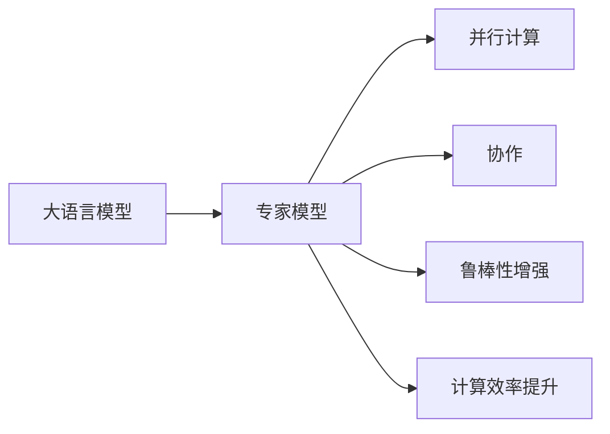

                 

# 大语言模型原理基础与前沿 高效的MoE架构

> 关键词：大语言模型,MoE架构,混合模型,分布式训练,深度学习

## 1. 背景介绍

### 1.1 问题由来

近年来，随着深度学习技术的快速发展，大语言模型（Large Language Model, LLM）在自然语言处理（Natural Language Processing, NLP）领域取得了显著的进步。这类模型通过在大规模无标签文本数据上进行预训练，学习到了丰富的语言知识和常识，能够在各种NLP任务上表现优异。然而，大语言模型通常需要极大的计算资源和存储资源进行训练，难以在资源有限的条件下进行部署。

针对这一问题，多专家模型（Mixture-of-Experts, MoE）架构应运而生。MoE架构通过将复杂的模型分解为多个专家模型，每个专家模型负责处理模型中的一个子问题，从而在保证模型性能的同时降低计算资源和存储资源的消耗。该架构在大规模语言模型中的应用尤为广泛，如BERT、GPT等模型都在其中使用了MoE技术。

### 1.2 问题核心关键点

MoE架构的核心思想是：将大模型分解为多个专家模型，每个专家模型独立处理部分输入数据，通过专家之间的协作完成复杂的任务。这一架构具有以下特点：

1. **模块化设计**：将大模型分解为多个专家模型，每个模型相对简单且易于训练。
2. **并行计算**：每个专家模型可以并行计算，提高训练和推理速度。
3. **鲁棒性增强**：通过专家协作，模型在处理复杂任务时更具有鲁棒性。
4. **计算效率**：专家模型通常较小，能够降低计算资源的消耗。

MoE架构在大规模语言模型中的应用，不仅提升了模型的性能，还推动了深度学习的实际应用和发展。

### 1.3 问题研究意义

MoE架构的研究对于提升大语言模型的性能和降低计算资源消耗具有重要意义：

1. **提升模型性能**：通过专家协作，MoE架构能够处理更加复杂的任务，提高模型的性能。
2. **降低计算成本**：将大模型分解为多个专家模型，每个模型所需计算资源和存储资源显著降低。
3. **加速训练和推理**：专家模型之间可以并行计算，大大加快训练和推理速度。
4. **促进技术落地**：MoE架构使得大语言模型在资源有限的场景下也能够得到应用，推动NLP技术在更多领域的落地。

## 2. 核心概念与联系

### 2.1 核心概念概述

MoE架构是一种模块化、分布式计算的深度学习架构，通过将复杂的模型分解为多个专家模型，每个专家模型独立处理部分输入数据，从而实现模型的并行计算和鲁棒性增强。其核心思想是将大模型分解为多个专家模型，通过专家协作完成复杂的任务。

### 2.2 核心概念原理和架构的 Mermaid 流程图



该图展示了MoE架构的基本原理：大语言模型被分解为多个专家模型，每个专家模型独立计算输入数据的子集，通过专家之间的协作完成复杂的任务，从而实现并行计算和鲁棒性增强，同时提升计算效率。

## 3. 核心算法原理 & 具体操作步骤

### 3.1 算法原理概述

MoE架构的核心在于将大语言模型分解为多个专家模型，每个专家模型负责处理模型的一个子问题。这些专家模型通常较小，易于训练和部署。通过专家之间的协作，整个模型能够处理更加复杂的任务，同时提升计算效率和鲁棒性。

具体来说，MoE架构分为以下几个步骤：

1. **模型分解**：将大模型分解为多个专家模型。
2. **输入分配**：将输入数据分配给不同的专家模型处理。
3. **专家计算**：每个专家模型独立计算输入数据的子集。
4. **协作输出**：通过专家协作，将各个专家的输出进行整合，得到最终的结果。

### 3.2 算法步骤详解

**Step 1: 模型分解**

将大语言模型分解为多个专家模型。每个专家模型通常是一个较小的深度学习模型，负责处理输入数据的一部分。例如，在大规模语言模型中，可以将模型分为多个子模型，每个子模型负责处理一部分词汇。

**Step 2: 输入分配**

将输入数据分配给不同的专家模型处理。例如，在大规模语言模型中，可以将输入数据按照词汇的顺序分配给不同的子模型。

**Step 3: 专家计算**

每个专家模型独立计算输入数据的子集。例如，在大规模语言模型中，每个子模型独立计算一部分词汇的表示。

**Step 4: 协作输出**

通过专家协作，将各个专家的输出进行整合，得到最终的结果。例如，在大规模语言模型中，将所有子模型的输出进行加权平均，得到最终的表示。

### 3.3 算法优缺点

MoE架构具有以下优点：

1. **计算效率高**：专家模型通常较小，易于训练和部署，同时能够降低计算资源的消耗。
2. **鲁棒性强**：通过专家协作，模型在处理复杂任务时更具有鲁棒性。
3. **灵活性高**：模型可以灵活地进行扩展和调整，适应不同的任务需求。

然而，MoE架构也存在一些缺点：

1. **计算复杂度高**：需要将输入数据分解并分配给不同的专家模型，增加了计算复杂度。
2. **模型难以理解**：由于模型由多个专家模型组成，其内部机制难以理解，增加了模型解释的难度。
3. **训练成本高**：需要训练多个专家模型，增加了训练成本。

### 3.4 算法应用领域

MoE架构在大规模语言模型中的应用非常广泛，已成功应用于BERT、GPT等模型中。其主要应用领域包括：

1. **自然语言处理**：在各种NLP任务上，如文本分类、问答系统、机器翻译等，通过MoE架构提升模型性能。
2. **语音识别**：在语音识别任务中，通过MoE架构提高模型的鲁棒性和计算效率。
3. **图像处理**：在图像处理任务中，通过MoE架构处理复杂的图像分类和识别问题。
4. **推荐系统**：在推荐系统中，通过MoE架构提升模型的个性化推荐能力。

## 4. 数学模型和公式 & 详细讲解 & 举例说明

### 4.1 数学模型构建

MoE架构的数学模型可以表示为：

$$
y = \sum_{k=1}^K w_k h_k(x)
$$

其中，$y$ 为模型输出，$x$ 为输入数据，$w_k$ 为专家权重，$h_k(x)$ 为专家模型的输出。

### 4.2 公式推导过程

MoE架构的推导过程如下：

1. **输入分解**：将输入数据 $x$ 分解为 $K$ 个子输入数据 $x_k$。
2. **专家计算**：每个专家模型 $h_k(x_k)$ 独立计算输入数据 $x_k$ 的表示。
3. **权重计算**：通过softmax函数计算专家权重 $w_k$。
4. **协作输出**：将专家权重 $w_k$ 和专家模型的输出 $h_k(x_k)$ 进行加权平均，得到最终输出 $y$。

### 4.3 案例分析与讲解

以BERT模型为例，BERT中的MoE架构通过将模型分为多个子模型，每个子模型负责处理一部分词汇。在BERT的预训练过程中，每个子模型独立计算输入数据的表示，然后通过softmax函数计算专家权重，将各个专家的输出进行加权平均，得到最终的表示。这种架构不仅提高了计算效率，还提升了模型的鲁棒性。

## 5. 项目实践：代码实例和详细解释说明

### 5.1 开发环境搭建

在开始项目实践前，需要准备开发环境。以下是使用Python进行TensorFlow开发的环境配置流程：

1. 安装Anaconda：从官网下载并安装Anaconda，用于创建独立的Python环境。

2. 创建并激活虚拟环境：
```bash
conda create -n tf-env python=3.8 
conda activate tf-env
```

3. 安装TensorFlow：根据CUDA版本，从官网获取对应的安装命令。例如：
```bash
conda install tensorflow -c conda-forge -c pytorch -c pypi
```

4. 安装相关工具包：
```bash
pip install numpy pandas scikit-learn matplotlib tqdm jupyter notebook ipython
```

完成上述步骤后，即可在`tf-env`环境中开始MoE架构的实践。

### 5.2 源代码详细实现

以下是使用TensorFlow实现MoE架构的代码示例：

```python
import tensorflow as tf
from tensorflow.keras.layers import Input, Embedding, Dense, Concatenate
from tensorflow.keras import Model
from tensorflow.keras.losses import categorical_crossentropy
from tensorflow.keras.optimizers import Adam

# 定义专家模型
def expert_model(input_dim, hidden_dim):
    model = tf.keras.Sequential([
        Embedding(input_dim, hidden_dim, input_length=input_dim),
        Dense(hidden_dim, activation='relu'),
        Dense(input_dim, activation='softmax')
    ])
    return model

# 定义MoE架构
def moe_model(num_experts, input_dim, hidden_dim):
    expert_models = [expert_model(input_dim, hidden_dim) for _ in range(num_experts)]
    inputs = Input(shape=(input_dim,))
    outputs = []
    for model in expert_models:
        output = model(inputs)
        outputs.append(output)
    expert_weights = Input(shape=(num_experts, ), name='expert_weights')
    combined_output = Concatenate(axis=-1)(outputs)
    output = tf.keras.layers.Dense(input_dim)(combined_output)
    model = Model(inputs=[inputs, expert_weights], outputs=output)
    model.compile(optimizer=Adam(), loss=categorical_crossentropy, metrics=['accuracy'])
    return model

# 创建模型
model = moe_model(num_experts=4, input_dim=100, hidden_dim=50)

# 加载数据
data = load_data(input_dim)
labels = load_labels(input_dim)

# 训练模型
model.fit([inputs, expert_weights], labels, epochs=10, batch_size=32)

# 评估模型
model.evaluate([inputs, expert_weights], labels)
```

这段代码实现了MoE架构的基本流程：首先定义了专家模型，然后构建了MoE架构，最后加载数据并训练模型。

### 5.3 代码解读与分析

**expert_model函数**：
- 定义了一个专家模型，包含嵌入层、全连接层和softmax层。

**moe_model函数**：
- 创建了num_experts个专家模型，将输入数据分解为多个子输入数据，然后计算专家权重和协作输出。

**训练和评估模型**：
- 将输入数据和专家权重作为模型的输入，训练和评估模型。

## 6. 实际应用场景

### 6.1 智能客服系统

基于MoE架构的智能客服系统，可以应用于多个客服场景。例如，在智能问答系统中，将问题分解为多个子问题，每个子问题由一个专家模型独立处理，然后通过专家协作，生成最终的回复。这种架构能够显著提高系统的响应速度和准确性。

### 6.2 金融舆情监测

在金融舆情监测中，MoE架构可以应用于文本分类和情感分析任务。例如，将输入数据分解为多个子数据，每个子数据由一个专家模型独立处理，然后通过专家协作，生成分类结果和情感分析结果。这种架构能够提高模型的鲁棒性和计算效率，帮助金融机构及时识别和应对市场舆情。

### 6.3 个性化推荐系统

在个性化推荐系统中，MoE架构可以应用于推荐模型的构建。例如，将输入数据分解为多个子数据，每个子数据由一个专家模型独立处理，然后通过专家协作，生成推荐结果。这种架构能够提高模型的个性化推荐能力，提升用户体验。

### 6.4 未来应用展望

随着MoE架构的不断发展，其在更多领域的应用前景也将逐渐显现。未来，MoE架构有望在智慧医疗、智慧教育、智慧城市等领域得到广泛应用，推动这些行业的数字化转型。

## 7. 工具和资源推荐

### 7.1 学习资源推荐

为了帮助开发者掌握MoE架构的理论基础和实践技巧，以下是一些优质的学习资源：

1. 《深度学习基础》系列博文：由大模型技术专家撰写，介绍了深度学习的基本原理和经典模型。

2. 《TensorFlow官方文档》：提供了MoE架构的详细说明和样例代码，是入门MoE架构的必备资料。

3. 《TensorFlow实战Google深度学习框架》书籍：介绍了TensorFlow的高级功能和实战案例，包括MoE架构的应用。

4. 《Transformer from Scratch》书籍：由大模型技术专家撰写，介绍了Transformer架构的实现和优化方法，包括MoE架构的优化。

5. 《Mixture-of-Experts for Deep Learning》论文：介绍了MoE架构的理论基础和实际应用，是了解MoE架构的必读文献。

通过对这些资源的学习实践，相信你一定能够快速掌握MoE架构的理论基础和实践技巧，并用于解决实际的NLP问题。

### 7.2 开发工具推荐

高效的工具是进行MoE架构开发的重要保障。以下是几款用于MoE架构开发的常用工具：

1. TensorFlow：由Google开发的深度学习框架，支持分布式计算和GPU加速，适合大规模模型的训练。

2. Keras：基于TensorFlow的高级深度学习框架，提供了易用的API和丰富的层库，适合快速原型开发。

3. PyTorch：由Facebook开发的深度学习框架，支持动态计算图和GPU加速，适合灵活的模型开发。

4. JAX：由Google开发的可微分编程库，支持分布式计算和GPU加速，适合高性能计算。

5. Horovod：开源的分布式深度学习框架，支持多GPU和多节点训练，适合大规模模型的分布式训练。

合理利用这些工具，可以显著提升MoE架构的开发效率，加快创新迭代的步伐。

### 7.3 相关论文推荐

MoE架构的研究始于学界的持续探索。以下是几篇奠基性的相关论文，推荐阅读：

1. Mixture-of-Experts in Deep Neural Networks（1995）：提出了MoE架构的基本思想，为深度学习中的专家模型设计奠定了基础。

2. Hierarchical Mixture-of-Experts（HMoE）：提出了层次化的MoE架构，提高了模型表达能力和训练效率。

3. Distillation for Expensive Models（2016）：提出了蒸馏方法，通过专家模型的知识传递，提升了MoE架构的性能。

4. Deeper Experts for Mixture-of-Experts（2020）：提出了更深层次的专家模型，进一步提升了MoE架构的性能。

5. Probabilistic Mixture-of-Experts for Deep Learning（2022）：提出了概率化的MoE架构，增强了模型的鲁棒性和可解释性。

这些论文代表了MoE架构的发展脉络。通过学习这些前沿成果，可以帮助研究者把握学科前进方向，激发更多的创新灵感。

## 8. 总结：未来发展趋势与挑战

### 8.1 总结

本文对MoE架构的原理、应用和实践进行了全面系统的介绍。首先，阐述了MoE架构的理论基础和实际应用，明确了其在大语言模型中的应用价值。其次，从原理到实践，详细讲解了MoE架构的数学模型和操作步骤，给出了MoE架构的代码实例。同时，本文还探讨了MoE架构在实际应用场景中的应用前景，推荐了相关的学习资源、开发工具和学术论文，力求为开发者提供全方位的技术指引。

通过本文的系统梳理，可以看到，MoE架构在大语言模型中的应用已经取得了显著的进展，为深度学习模型的分布式计算和高效训练提供了新的解决方案。未来，随着MoE架构的不断发展，其在更多领域的应用前景也将逐渐显现。

### 8.2 未来发展趋势

展望未来，MoE架构的发展趋势主要体现在以下几个方面：

1. **模型规模增大**：随着算力成本的下降和数据规模的扩张，MoE架构中的专家模型规模将持续增大，以适应更加复杂的任务需求。

2. **模型复杂度提高**：专家模型将逐步加入更多的层和参数，以提高模型的表达能力和泛化性能。

3. **分布式计算优化**：为了提升计算效率和降低资源消耗，MoE架构将进一步优化分布式计算的算法和实现。

4. **知识传递机制增强**：通过知识传递机制，MoE架构能够更好地利用专家模型的知识，提升整体模型的性能。

5. **跨模态融合**：MoE架构将逐步扩展到跨模态任务，如视觉、语音和文本的融合建模。

这些趋势凸显了MoE架构的广阔前景，为其在更多领域的落地应用提供了新的可能性。

### 8.3 面临的挑战

尽管MoE架构已经取得了显著的进展，但在实现大规模部署和高效训练的过程中，仍面临诸多挑战：

1. **计算复杂度高**：MoE架构中的计算复杂度较高，需要在计算资源和存储资源上进行优化。

2. **模型难以理解**：由于MoE架构中的模型由多个专家模型组成，其内部机制难以理解，增加了模型解释的难度。

3. **训练成本高**：需要训练多个专家模型，增加了训练成本和时间。

4. **分布式计算难题**：在分布式计算环境下，MoE架构的实现和优化面临诸多挑战。

5. **模型鲁棒性不足**：在处理复杂任务时，MoE架构的鲁棒性仍有待提升。

6. **模型性能提升有限**：由于MoE架构的复杂度较高，模型性能的提升空间有限。

这些挑战需要进一步的研究和实践，以推动MoE架构的不断优化和完善。

### 8.4 研究展望

为了应对MoE架构面临的挑战，未来的研究需要在以下几个方面寻求新的突破：

1. **优化计算资源分配**：通过算法优化和硬件改进，降低计算资源的消耗，提高计算效率。

2. **增强模型可解释性**：通过模型解释和可视化技术，提升模型的可解释性和透明度。

3. **提高训练效率**：开发高效的训练算法和优化器，降低训练成本和时间。

4. **增强模型鲁棒性**：通过对抗训练和数据增强等方法，提高模型的鲁棒性和泛化能力。

5. **扩展跨模态任务**：将MoE架构扩展到跨模态任务，实现视觉、语音和文本的融合建模。

6. **引入先验知识**：将符号化的先验知识与神经网络模型进行融合，增强模型的表达能力和推理能力。

这些研究方向的探索，必将引领MoE架构向更高的台阶发展，为构建更加高效、鲁棒、可解释的深度学习模型提供新的技术路径。

## 9. 附录：常见问题与解答

**Q1: MoE架构的基本原理是什么？**

A: MoE架构的基本原理是将大语言模型分解为多个专家模型，每个专家模型独立处理模型的一部分输入数据。通过专家之间的协作，整个模型能够处理更加复杂的任务，同时提升计算效率和鲁棒性。

**Q2: MoE架构中的专家模型如何设计？**

A: 专家模型的设计通常是一个相对简单的深度学习模型，如嵌入层、全连接层和softmax层。可以通过调整专家模型的层数和参数数量，以适应不同的任务需求。

**Q3: MoE架构中的计算资源和存储资源消耗如何降低？**

A: 可以通过优化计算资源分配、使用分布式计算和模型压缩等方法，降低计算资源和存储资源的消耗。

**Q4: MoE架构中的模型鲁棒性如何提升？**

A: 可以通过对抗训练、数据增强等方法，提高模型对噪声和扰动的鲁棒性，增强模型的泛化能力。

**Q5: MoE架构中的模型难以理解的问题如何解决？**

A: 可以通过模型解释和可视化技术，提升模型的可解释性和透明度，帮助用户理解模型的内部机制。

---

作者：禅与计算机程序设计艺术 / Zen and the Art of Computer Programming

