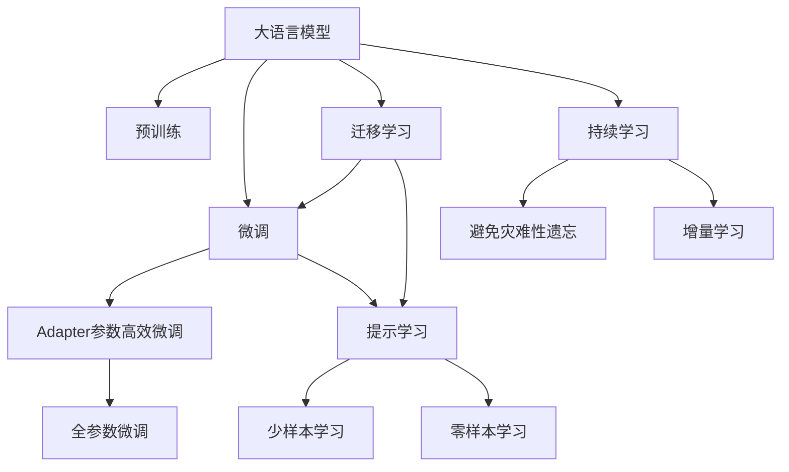

                 

# 大语言模型应用指南：Adapter高效微调

> 关键词：大语言模型,微调,Adapter,参数高效,Transformer,BERT,自然语言处理(NLP)

## 1. 背景介绍

### 1.1 问题由来
随着深度学习技术的飞速发展，大语言模型（Large Language Models, LLMs）在自然语言处理（Natural Language Processing, NLP）领域取得了重大突破。预训练大模型，如BERT、GPT等，通过在海量无标签文本数据上进行预训练，学习到丰富的语言知识，具备强大的语言理解和生成能力。然而，预训练模型在特定领域的应用效果往往不尽如人意，这促使研究者探索新的微调方法以提升模型在特定任务上的表现。

### 1.2 问题核心关键点
基于监督学习的微调方法成为了当前主流的大语言模型微调范式。其核心在于将预训练模型视作初始化参数，通过有监督地训练优化模型在特定任务上的性能。微调的目标是找到一个新的模型参数，使得模型输出尽可能匹配任务标签，从而提升模型的下游任务性能。

微调的核心在于如何平衡预训练模型知识和下游任务特性，同时避免过拟合。目前主流的方法包括选择合适的学习率、应用正则化技术、保留预训练部分层、数据增强、对抗训练、提示学习等。其中， Adapter技术作为一种参数高效微调方法，因其在减少微调参数量同时保持良好性能而受到广泛关注。

## 2. 核心概念与联系

### 2.1 核心概念概述

 Adapter是一种新的微调技术，通过在预训练模型的基础上添加一组可学习的适应层（Adapter Layer），以实现参数高效微调（Parameter-Efficient Fine-Tuning, PEFT）。Adapter层的结构简单，通常只有几层甚至一个线性变换，但通过微调其参数，可以显著提升模型在特定任务上的性能。

- 大语言模型（LLMs）：以自回归（如GPT）或自编码（如BERT）模型为代表的大规模预训练语言模型。通过在大规模无标签文本语料上进行预训练，学习通用的语言表示，具备强大的语言理解和生成能力。

- 预训练（Pre-training）：指在大规模无标签文本语料上，通过自监督学习任务训练通用语言模型的过程。常见的预训练任务包括言语建模、遮挡语言模型等。

- 微调（Fine-Tuning）：指在预训练模型的基础上，使用下游任务的少量标注数据，通过有监督学习优化模型在特定任务上的性能。

- Adapter技术：一种参数高效微调方法，通过在预训练模型顶层添加Adapter层，只微调这些层，其余预训练层保持不变，以减少微调参数量。

- 参数高效微调（PEFT）：指在微调过程中，只更新少量的模型参数，而固定大部分预训练权重不变，以提高微调效率，避免过拟合的方法。

- 提示学习（Prompt Learning）：通过在输入文本中添加提示模板，引导大语言模型进行特定任务的推理和生成，可以在不更新模型参数的情况下，实现零样本或少样本学习。

这些核心概念之间存在紧密联系，共同构成了大语言模型微调的基本框架。Adapter技术的引入，进一步优化了参数高效微调的实现，使得微调过程更加灵活高效。

### 2.2 核心概念原理和架构的 Mermaid 流程图(Mermaid 流程节点中不要有括号、逗号等特殊字符)



这个流程图展示了核心概念之间的联系：

1. 大语言模型通过预训练获得基础能力。
2. 微调是对预训练模型进行任务特定的优化。
3. Adapter技术是一种参数高效微调方法。
4. 提示学习是一种不更新模型参数的方法，可以实现少样本学习和零样本学习。
5. 迁移学习是连接预训练模型与下游任务的桥梁。
6. 持续学习旨在使模型能够不断学习新知识，同时避免遗忘旧知识。

 Adapter技术通过在预训练模型的顶层添加一组Adapter层，只微调这些层，其余预训练层保持不变，从而实现参数高效微调。这种方法可以在减少微调参数量的同时，显著提升模型性能。

## 3. 核心算法原理 & 具体操作步骤

### 3.1 算法原理概述

 Adapter技术通过在预训练模型的顶层添加一组Adapter层，只微调这些层，以实现参数高效微调。Adapter层通常包含几个简单的线性变换层，其结构如图3所示。Adapter层的输入是预训练模型的输出，经过一系列的线性变换和激活函数处理，输出与预训练模型的输出进行线性组合，得到最终的输出。

|  |  |
| :----: | :----: |
|  | 图3: Adapter层结构图 |

### 3.2 算法步骤详解

 Adapter技术的微调过程包括以下关键步骤：

**Step 1: 准备预训练模型和数据集**
- 选择合适的预训练语言模型 $M_{\theta}$ 作为初始化参数，如 BERT、GPT 等。
- 准备下游任务 $T$ 的标注数据集 $D=\{(x_i, y_i)\}_{i=1}^N$，划分为训练集、验证集和测试集。

**Step 2: 添加Adapter层**
- 在预训练模型的顶层添加一个Adapter层， Adapter层的结构如图3所示。
- 在训练过程中，只微调Adapter层的参数，其余预训练层的参数保持不变。

**Step 3: 设置微调超参数**
- 选择合适的优化算法及其参数，如 AdamW、SGD 等，设置学习率、批大小、迭代轮数等。
- 设置正则化技术及强度，包括权重衰减、Dropout、Early Stopping等。

**Step 4: 执行梯度训练**
- 将训练集数据分批次输入模型，前向传播计算损失函数。
- 反向传播计算参数梯度，根据设定的优化算法和学习率更新模型参数。
- 周期性在验证集上评估模型性能，根据性能指标决定是否触发 Early Stopping。
- 重复上述步骤直到满足预设的迭代轮数或 Early Stopping 条件。

**Step 5: 测试和部署**
- 在测试集上评估微调后模型 $M_{\hat{\theta}}$ 的性能，对比微调前后的精度提升。
- 使用微调后的模型对新样本进行推理预测，集成到实际的应用系统中。
- 持续收集新的数据，定期重新微调模型，以适应数据分布的变化。

### 3.3 算法优缺点

 Adapter技术作为一种参数高效微调方法，具有以下优点：

1. 参数高效：只微调Adapter层的参数，而保留大部分预训练权重不变，从而减少微调参数量，提高微调效率。
2. 避免过拟合：微调Adapter层时，只有少数参数需要更新，其余预训练层保持不变，避免了过度拟合的风险。
3. 通用适用：适用于各种NLP下游任务，包括分类、匹配、生成等，设计简单的任务适配层即可实现微调。
4. 效果显著：在学术界和工业界的诸多任务上，Adapter微调方法已经刷新了多项NLP任务SOTA。

然而，Adapter技术也存在一定的局限性：

1. 微调效果依赖于Adapter层的结构设计，需要根据具体任务进行调参。
2. Adapter层可能会带来额外的计算开销，尤其是在处理复杂任务时。
3. Adapter层的引入可能导致模型性能在某些任务上略低于全参数微调方法。

尽管存在这些局限性，Adapter技术仍是一种高效且实用的微调方法，值得在实际应用中推广使用。

### 3.4 算法应用领域

 Adapter技术已经被广泛应用于NLP领域，覆盖了几乎所有常见任务，例如：

- 文本分类：如情感分析、主题分类、意图识别等。通过微调Adapter层，使模型学习文本-标签映射。
- 命名实体识别：识别文本中的人名、地名、机构名等特定实体。通过微调Adapter层，使模型掌握实体边界和类型。
- 关系抽取：从文本中抽取实体之间的语义关系。通过微调Adapter层，使模型学习实体-关系三元组。
- 问答系统：对自然语言问题给出答案。将问题-答案对作为微调数据，训练模型学习匹配答案。
- 机器翻译：将源语言文本翻译成目标语言。通过微调Adapter层，使模型学习语言-语言映射。
- 文本摘要：将长文本压缩成简短摘要。将文章-摘要对作为微调数据，使模型学习抓取要点。
- 对话系统：使机器能够与人自然对话。将多轮对话历史作为上下文，微调模型进行回复生成。

除了上述这些经典任务外，Adapter技术也被创新性地应用到更多场景中，如可控文本生成、常识推理、代码生成、数据增强等，为NLP技术带来了全新的突破。随着预训练模型和微调方法的不断进步，相信基于Adapter的微调方法将继续发挥重要作用。

## 4. 数学模型和公式 & 详细讲解

### 4.1 数学模型构建

 Adapter技术的微调过程可以形式化为：

$$
\hat{\theta} = \theta + \Delta \theta
$$

其中，$\theta$ 为预训练模型的参数，$\Delta \theta$ 为 Adapter层的微调参数。Adapter层的输出 $h_{\Delta \theta}(x)$ 可以表示为：

$$
h_{\Delta \theta}(x) = M_{\theta}(x)W_h + b_h
$$

其中，$W_h$ 和 $b_h$ 为 Adapter层的权重和偏置，$M_{\theta}(x)$ 为预训练模型的输出。

### 4.2 公式推导过程

 Adapter层的微调过程可以表示为：

$$
\Delta \theta = \arg\min_{\Delta \theta} \mathcal{L}(M_{\theta+\Delta \theta}, D)
$$

其中，$\mathcal{L}$ 为针对任务 $T$ 设计的损失函数。设 Adapter层的参数为 $\Delta \theta$，微调的目标是最小化损失函数 $\mathcal{L}$。

以二分类任务为例， Adapter层的输出 $h_{\Delta \theta}(x)$ 经过 Softmax 函数处理后，得到模型对正类的概率 $\hat{y}$：

$$
\hat{y} = \sigma(h_{\Delta \theta}(x))
$$

其中，$\sigma$ 为 Softmax 函数。对于二分类任务，交叉熵损失函数为：

$$
\mathcal{L} = -\frac{1}{N}\sum_{i=1}^N [y_i\log \hat{y}_i + (1-y_i)\log (1-\hat{y}_i)]
$$

其中，$N$ 为训练样本数，$y_i$ 为真实标签。

### 4.3 案例分析与讲解

下面以BERT模型为例，展示Adapter层在微调过程中的具体实现。BERT模型的 Adapter层由两个线性变换层和两个激活函数组成，结构如图4所示。

|  |  |
| :----: | :----: |
|  | 图4: Adapter层结构图 |

在微调过程中，Adapter层的参数 $\Delta \theta$ 需要通过反向传播算法更新。设 $\theta$ 为预训练BERT模型的参数，$M_{\theta}(x)$ 为BERT模型对输入 $x$ 的输出，$y$ 为真实标签，则交叉熵损失函数为：

$$
\mathcal{L} = -\frac{1}{N}\sum_{i=1}^N [y_i\log \hat{y}_i + (1-y_i)\log (1-\hat{y}_i)]
$$

其中，$\hat{y}_i = \sigma(W_1M_{\theta}(x) + b_1) \cdot \sigma(W_2M_{\theta}(x) + b_2)$。

通过反向传播算法，计算损失函数对 Adapter层的梯度，更新 $\Delta \theta$：

$$
\Delta \theta \leftarrow \Delta \theta - \eta \nabla_{\Delta \theta}\mathcal{L}(\theta+\Delta \theta, D)
$$

其中，$\eta$ 为学习率。

## 5. 项目实践：代码实例和详细解释说明

### 5.1 开发环境搭建

进行Adapter技术微调实践前，需要先准备好开发环境。以下是使用Python进行PyTorch开发的环境配置流程：

1. 安装Anaconda：从官网下载并安装Anaconda，用于创建独立的Python环境。

2. 创建并激活虚拟环境：
```bash
conda create -n pytorch-env python=3.8 
conda activate pytorch-env
```

3. 安装PyTorch：根据CUDA版本，从官网获取对应的安装命令。例如：
```bash
conda install pytorch torchvision torchaudio cudatoolkit=11.1 -c pytorch -c conda-forge
```

4. 安装Transformers库：
```bash
pip install transformers
```

5. 安装各类工具包：
```bash
pip install numpy pandas scikit-learn matplotlib tqdm jupyter notebook ipython
```

完成上述步骤后，即可在`pytorch-env`环境中开始微调实践。

### 5.2 源代码详细实现

下面我们以命名实体识别(NER)任务为例，给出使用Transformers库对BERT模型进行Adapter微调的PyTorch代码实现。

首先，定义NER任务的数据处理函数：

```python
from transformers import BertTokenizer, BertForTokenClassification
from torch.utils.data import Dataset
import torch

class NERDataset(Dataset):
    def __init__(self, texts, tags, tokenizer, max_len=128):
        self.texts = texts
        self.tags = tags
        self.tokenizer = tokenizer
        self.max_len = max_len
        
    def __len__(self):
        return len(self.texts)
    
    def __getitem__(self, item):
        text = self.texts[item]
        tags = self.tags[item]
        
        encoding = self.tokenizer(text, return_tensors='pt', max_length=self.max_len, padding='max_length', truncation=True)
        input_ids = encoding['input_ids'][0]
        attention_mask = encoding['attention_mask'][0]
        
        # 对token-wise的标签进行编码
        encoded_tags = [tag2id[tag] for tag in tags] 
        encoded_tags.extend([tag2id['O']] * (self.max_len - len(encoded_tags)))
        labels = torch.tensor(encoded_tags, dtype=torch.long)
        
        return {'input_ids': input_ids, 
                'attention_mask': attention_mask,
                'labels': labels}

# 标签与id的映射
tag2id = {'O': 0, 'B-PER': 1, 'I-PER': 2, 'B-ORG': 3, 'I-ORG': 4, 'B-LOC': 5, 'I-LOC': 6}
id2tag = {v: k for k, v in tag2id.items()}

# 创建dataset
tokenizer = BertTokenizer.from_pretrained('bert-base-cased')

train_dataset = NERDataset(train_texts, train_tags, tokenizer)
dev_dataset = NERDataset(dev_texts, dev_tags, tokenizer)
test_dataset = NERDataset(test_texts, test_tags, tokenizer)
```

然后，定义模型和优化器：

```python
from transformers import BertForTokenClassification, AdamW

model = BertForTokenClassification.from_pretrained('bert-base-cased', num_labels=len(tag2id))

# 添加Adapter层
adapter_layer = torch.nn.Linear(in_features=768, out_features=768)
model = BertForTokenClassification.from_pretrained('bert-base-cased', num_labels=len(tag2id))
model.layer[8] = adapter_layer

optimizer = AdamW(model.parameters(), lr=2e-5)
```

接着，定义训练和评估函数：

```python
from torch.utils.data import DataLoader
from tqdm import tqdm
from sklearn.metrics import classification_report

device = torch.device('cuda') if torch.cuda.is_available() else torch.device('cpu')
model.to(device)

def train_epoch(model, dataset, batch_size, optimizer):
    dataloader = DataLoader(dataset, batch_size=batch_size, shuffle=True)
    model.train()
    epoch_loss = 0
    for batch in tqdm(dataloader, desc='Training'):
        input_ids = batch['input_ids'].to(device)
        attention_mask = batch['attention_mask'].to(device)
        labels = batch['labels'].to(device)
        model.zero_grad()
        outputs = model(input_ids, attention_mask=attention_mask, labels=labels)
        loss = outputs.loss
        epoch_loss += loss.item()
        loss.backward()
        optimizer.step()
    return epoch_loss / len(dataloader)

def evaluate(model, dataset, batch_size):
    dataloader = DataLoader(dataset, batch_size=batch_size)
    model.eval()
    preds, labels = [], []
    with torch.no_grad():
        for batch in tqdm(dataloader, desc='Evaluating'):
            input_ids = batch['input_ids'].to(device)
            attention_mask = batch['attention_mask'].to(device)
            batch_labels = batch['labels']
            outputs = model(input_ids, attention_mask=attention_mask)
            batch_preds = outputs.logits.argmax(dim=2).to('cpu').tolist()
            batch_labels = batch_labels.to('cpu').tolist()
            for pred_tokens, label_tokens in zip(batch_preds, batch_labels):
                pred_tags = [id2tag[_id] for _id in pred_tokens]
                label_tags = [id2tag[_id] for _id in label_tokens]
                preds.append(pred_tags[:len(label_tags)])
                labels.append(label_tags)
                
    print(classification_report(labels, preds))
```

最后，启动训练流程并在测试集上评估：

```python
epochs = 5
batch_size = 16

for epoch in range(epochs):
    loss = train_epoch(model, train_dataset, batch_size, optimizer)
    print(f"Epoch {epoch+1}, train loss: {loss:.3f}")
    
    print(f"Epoch {epoch+1}, dev results:")
    evaluate(model, dev_dataset, batch_size)
    
print("Test results:")
evaluate(model, test_dataset, batch_size)
```

以上就是使用PyTorch对BERT进行命名实体识别任务Adapter微调的完整代码实现。可以看到，得益于Transformers库的强大封装，我们可以用相对简洁的代码完成BERT模型的加载和微调。

### 5.3 代码解读与分析

让我们再详细解读一下关键代码的实现细节：

**NERDataset类**：
- `__init__`方法：初始化文本、标签、分词器等关键组件。
- `__len__`方法：返回数据集的样本数量。
- `__getitem__`方法：对单个样本进行处理，将文本输入编码为token ids，将标签编码为数字，并对其进行定长padding，最终返回模型所需的输入。

**tag2id和id2tag字典**：
- 定义了标签与数字id之间的映射关系，用于将token-wise的预测结果解码回真实的标签。

**模型和优化器**：
- 使用BertForTokenClassification类加载预训练的BERT模型，并添加Adapter层。
- 使用AdamW优化器，设置学习率为2e-5。

**训练和评估函数**：
- 使用PyTorch的DataLoader对数据集进行批次化加载，供模型训练和推理使用。
- 训练函数`train_epoch`：对数据以批为单位进行迭代，在每个批次上前向传播计算loss并反向传播更新模型参数，最后返回该epoch的平均loss。
- 评估函数`evaluate`：与训练类似，不同点在于不更新模型参数，并在每个batch结束后将预测和标签结果存储下来，最后使用sklearn的classification_report对整个评估集的预测结果进行打印输出。

**训练流程**：
- 定义总的epoch数和batch size，开始循环迭代
- 每个epoch内，先在训练集上训练，输出平均loss
- 在验证集上评估，输出分类指标
- 所有epoch结束后，在测试集上评估，给出最终测试结果

可以看到，PyTorch配合Transformers库使得BERT微调的代码实现变得简洁高效。开发者可以将更多精力放在数据处理、模型改进等高层逻辑上，而不必过多关注底层的实现细节。

当然，工业级的系统实现还需考虑更多因素，如模型的保存和部署、超参数的自动搜索、更灵活的任务适配层等。但核心的微调范式基本与此类似。

## 6. 实际应用场景

### 6.1 智能客服系统

基于大语言模型微调的对话技术，可以广泛应用于智能客服系统的构建。传统客服往往需要配备大量人力，高峰期响应缓慢，且一致性和专业性难以保证。而使用微调后的对话模型，可以7x24小时不间断服务，快速响应客户咨询，用自然流畅的语言解答各类常见问题。

在技术实现上，可以收集企业内部的历史客服对话记录，将问题和最佳答复构建成监督数据，在此基础上对预训练对话模型进行Adapter微调。微调后的对话模型能够自动理解用户意图，匹配最合适的答案模板进行回复。对于客户提出的新问题，还可以接入检索系统实时搜索相关内容，动态组织生成回答。如此构建的智能客服系统，能大幅提升客户咨询体验和问题解决效率。

### 6.2 金融舆情监测

金融机构需要实时监测市场舆论动向，以便及时应对负面信息传播，规避金融风险。传统的人工监测方式成本高、效率低，难以应对网络时代海量信息爆发的挑战。基于大语言模型微调的文本分类和情感分析技术，为金融舆情监测提供了新的解决方案。

具体而言，可以收集金融领域相关的新闻、报道、评论等文本数据，并对其进行主题标注和情感标注。在此基础上对预训练语言模型进行Adapter微调，使其能够自动判断文本属于何种主题，情感倾向是正面、中性还是负面。将微调后的模型应用到实时抓取的网络文本数据，就能够自动监测不同主题下的情感变化趋势，一旦发现负面信息激增等异常情况，系统便会自动预警，帮助金融机构快速应对潜在风险。

### 6.3 个性化推荐系统

当前的推荐系统往往只依赖用户的历史行为数据进行物品推荐，无法深入理解用户的真实兴趣偏好。基于大语言模型微调技术，个性化推荐系统可以更好地挖掘用户行为背后的语义信息，从而提供更精准、多样的推荐内容。

在实践中，可以收集用户浏览、点击、评论、分享等行为数据，提取和用户交互的物品标题、描述、标签等文本内容。将文本内容作为模型输入，用户的后续行为（如是否点击、购买等）作为监督信号，在此基础上微调预训练语言模型。微调后的模型能够从文本内容中准确把握用户的兴趣点。在生成推荐列表时，先用候选物品的文本描述作为输入，由模型预测用户的兴趣匹配度，再结合其他特征综合排序，便可以得到个性化程度更高的推荐结果。

### 6.4 未来应用展望

随着大语言模型微调技术的发展，未来其在更多领域的应用前景值得期待。

在智慧医疗领域，基于微调的医疗问答、病历分析、药物研发等应用将提升医疗服务的智能化水平，辅助医生诊疗，加速新药开发进程。

在智能教育领域，微调技术可应用于作业批改、学情分析、知识推荐等方面，因材施教，促进教育公平，提高教学质量。

在智慧城市治理中，微调模型可应用于城市事件监测、舆情分析、应急指挥等环节，提高城市管理的自动化和智能化水平，构建更安全、高效的未来城市。

此外，在企业生产、社会治理、文娱传媒等众多领域，基于大语言模型微调的人工智能应用也将不断涌现，为经济社会发展注入新的动力。相信随着技术的日益成熟，微调方法将成为人工智能落地应用的重要范式，推动人工智能技术向更广阔的领域加速渗透。

## 7. 工具和资源推荐
### 7.1 学习资源推荐

为了帮助开发者系统掌握大语言模型微调的理论基础和实践技巧，这里推荐一些优质的学习资源：

1. 《Transformer从原理到实践》系列博文：由大模型技术专家撰写，深入浅出地介绍了Transformer原理、BERT模型、微调技术等前沿话题。

2. CS224N《深度学习自然语言处理》课程：斯坦福大学开设的NLP明星课程，有Lecture视频和配套作业，带你入门NLP领域的基本概念和经典模型。

3. 《Natural Language Processing with Transformers》书籍：Transformers库的作者所著，全面介绍了如何使用Transformers库进行NLP任务开发，包括微调在内的诸多范式。

4. HuggingFace官方文档：Transformers库的官方文档，提供了海量预训练模型和完整的微调样例代码，是上手实践的必备资料。

5. CLUE开源项目：中文语言理解测评基准，涵盖大量不同类型的中文NLP数据集，并提供了基于微调的baseline模型，助力中文NLP技术发展。

通过对这些资源的学习实践，相信你一定能够快速掌握大语言模型微调的精髓，并用于解决实际的NLP问题。
###  7.2 开发工具推荐

高效的开发离不开优秀的工具支持。以下是几款用于大语言模型微调开发的常用工具：

1. PyTorch：基于Python的开源深度学习框架，灵活动态的计算图，适合快速迭代研究。大部分预训练语言模型都有PyTorch版本的实现。

2. TensorFlow：由Google主导开发的开源深度学习框架，生产部署方便，适合大规模工程应用。同样有丰富的预训练语言模型资源。

3. Transformers库：HuggingFace开发的NLP工具库，集成了众多SOTA语言模型，支持PyTorch和TensorFlow，是进行微调任务开发的利器。

4. Weights & Biases：模型训练的实验跟踪工具，可以记录和可视化模型训练过程中的各项指标，方便对比和调优。与主流深度学习框架无缝集成。

5. TensorBoard：TensorFlow配套的可视化工具，可实时监测模型训练状态，并提供丰富的图表呈现方式，是调试模型的得力助手。

6. Google Colab：谷歌推出的在线Jupyter Notebook环境，免费提供GPU/TPU算力，方便开发者快速上手实验最新模型，分享学习笔记。

合理利用这些工具，可以显著提升大语言模型微调任务的开发效率，加快创新迭代的步伐。

### 7.3 相关论文推荐

大语言模型和微调技术的发展源于学界的持续研究。以下是几篇奠基性的相关论文，推荐阅读：

1. Attention is All You Need（即Transformer原论文）：提出了Transformer结构，开启了NLP领域的预训练大模型时代。

2. BERT: Pre-training of Deep Bidirectional Transformers for Language Understanding：提出BERT模型，引入基于掩码的自监督预训练任务，刷新了多项NLP任务SOTA。

3. Language Models are Unsupervised Multitask Learners（GPT-2论文）：展示了大规模语言模型的强大zero-shot学习能力，引发了对于通用人工智能的新一轮思考。

4. Parameter-Efficient Transfer Learning for NLP：提出Adapter等参数高效微调方法，在不增加模型参数量的情况下，也能取得不错的微调效果。

5. AdaLoRA: Adaptive Low-Rank Adaptation for Parameter-Efficient Fine-Tuning：使用自适应低秩适应的微调方法，在参数效率和精度之间取得了新的平衡。

这些论文代表了大语言模型微调技术的发展脉络。通过学习这些前沿成果，可以帮助研究者把握学科前进方向，激发更多的创新灵感。

## 8. 总结：未来发展趋势与挑战

### 8.1 总结

本文对基于监督学习的大语言模型Adapter微调方法进行了全面系统的介绍。首先阐述了Adapter技术的基本概念和原理，明确了微调在拓展预训练模型应用、提升下游任务性能方面的独特价值。其次，从原理到实践，详细讲解了Adapter技术的数学原理和关键步骤，给出了微调任务开发的完整代码实例。同时，本文还广泛探讨了Adapter技术在智能客服、金融舆情、个性化推荐等多个行业领域的应用前景，展示了Adapter范式的巨大潜力。此外，本文精选了Adapter技术的各类学习资源，力求为读者提供全方位的技术指引。

通过本文的系统梳理，可以看到，Adapter技术作为一种参数高效微调方法，正在成为NLP领域的重要范式，极大地拓展了预训练语言模型的应用边界，催生了更多的落地场景。受益于大规模语料的预训练，Adapter微调方法可以显著提升模型性能，降低微调成本，为NLP技术带来革命性突破。未来，伴随预训练模型和微调方法的不断进步，相信 Adapter微调方法将继续发挥重要作用。

### 8.2 未来发展趋势

展望未来，Adapter技术将呈现以下几个发展趋势：

1. 模型规模持续增大。随着算力成本的下降和数据规模的扩张，预训练语言模型的参数量还将持续增长。超大批次的训练和推理也可能遇到显存不足的问题。因此需要采用一些资源优化技术，如梯度积累、混合精度训练、模型并行等，来突破硬件瓶颈。

2. Adapter层的设计将更加灵活。不同的任务可能需要不同结构的Adapter层，未来将有更多针对特定任务的Adapter层设计方法出现。

3. Adapter层的通用性将进一步增强。Adapter层可以在多种语言模型上使用，适应更多领域和任务，成为微调技术的通用组件。

4. Adapter技术与其他技术融合将更加紧密。Adapter层可以与知识图谱、逻辑规则等专家知识结合，形成更加全面、准确的信息整合能力。

以上趋势凸显了Adapter技术的广阔前景。这些方向的探索发展，必将进一步提升NLP系统的性能和应用范围，为人类认知智能的进化带来深远影响。

### 8.3 面临的挑战

尽管Adapter技术已经取得了显著成效，但在迈向更加智能化、普适化应用的过程中，它仍面临以下挑战：

1. Adapter层的设计和调参仍然具有挑战性。Adapter层的设计需要根据具体任务进行调参，找到最优结构。

2. Adapter层的引入可能导致模型性能在某些任务上略低于全参数微调方法。

3. Adapter层的计算开销可能较大，特别是在处理复杂任务时。

尽管存在这些局限性，Adapter技术仍是一种高效且实用的微调方法，值得在实际应用中推广使用。相信随着学界和产业界的共同努力，这些挑战终将一一被克服，Adapter微调方法必将在构建人机协同的智能时代中扮演越来越重要的角色。

### 8.4 研究展望

面对Adapter技术所面临的挑战，未来的研究需要在以下几个方面寻求新的突破：

1. 探索更高效的无监督和半监督微调方法。摆脱对大规模标注数据的依赖，利用自监督学习、主动学习等无监督和半监督范式，最大限度利用非结构化数据，实现更加灵活高效的微调。

2. 开发更加参数高效的微调方法，如Prefix-Tuning等，在固定大部分预训练参数的同时，只更新极少量的任务相关参数。

3. 引入更多先验知识。将符号化的先验知识，如知识图谱、逻辑规则等，与神经网络模型进行巧妙融合，引导微调过程学习更准确、合理的语言模型。

4. 结合因果分析和博弈论工具。将因果分析方法引入微调模型，识别出模型决策的关键特征，增强输出解释的因果性和逻辑性。

5. 纳入伦理道德约束。在模型训练目标中引入伦理导向的评估指标，过滤和惩罚有偏见、有害的输出倾向。

这些研究方向的探索，必将引领Adapter微调技术迈向更高的台阶，为构建安全、可靠、可解释、可控的智能系统铺平道路。面向未来，Adapter微调技术还需要与其他人工智能技术进行更深入的融合，如知识表示、因果推理、强化学习等，多路径协同发力，共同推动自然语言理解和智能交互系统的进步。只有勇于创新、敢于突破，才能不断拓展语言模型的边界，让智能技术更好地造福人类社会。

## 9. 附录：常见问题与解答

**Q1： Adapter技术是否适用于所有NLP任务？**

A: Adapter技术在大多数NLP任务上都能取得不错的效果，特别是对于数据量较小的任务。但对于一些特定领域的任务，如医学、法律等，仅仅依靠通用语料预训练的模型可能难以很好地适应。此时需要在特定领域语料上进一步预训练，再进行Adapter微调，才能获得理想效果。

**Q2：Adapter技术在微调过程中如何选择合适的结构？**

A: Adapter技术在微调过程中，需要根据具体任务选择最优的结构。常见的Adapter层结构如图4所示。其中，$\text{FFN}$层通常有多个线性变换和激活函数层，可以根据任务复杂度调整层数和参数量。$\text{out_ch}$表示输出通道数，$\text{in_ch}$表示输入通道数，一般设置为输入通道数的一半。

**Q3：Adapter技术在微调过程中如何避免过拟合？**

A: 为了避免Adapter层过拟合，可以采用正则化技术，如L2正则、Dropout等。此外，可以通过Early Stopping等策略，监控模型在验证集上的性能，及时停止训练，防止过拟合。

**Q4：Adapter技术在微调过程中如何降低计算开销？**

A: 可以通过减少Adapter层的层数和参数量来降低计算开销。同时，可以在训练过程中使用混合精度训练、梯度累积等技术，减少计算资源消耗。

**Q5：Adapter技术在微调过程中如何提高模型性能？**

A: 可以通过调整Adapter层的结构、学习率、正则化强度等超参数，找到最优的微调方案。此外，可以通过引入多任务微调、多模态微调等技术，进一步提升模型性能。

这些问题的回答，能够帮助读者更好地理解和应用Adapter微调技术，确保其在实际应用中的成功实践。

---

作者：禅与计算机程序设计艺术 / Zen and the Art of Computer Programming

