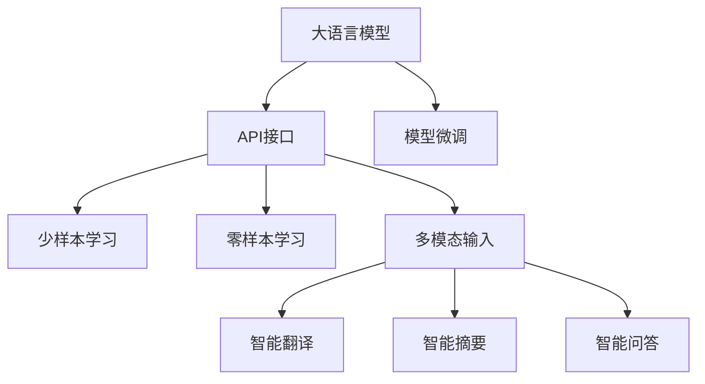

                 

# 大语言模型应用指南：Assistants API

## 1. 背景介绍

### 1.1 问题由来
随着人工智能技术的发展，大语言模型（Large Language Models, LLMs）逐渐成为自然语言处理（NLP）领域的热点。这些模型在预训练阶段通过处理海量无标签文本数据，学习到了丰富的语言知识和常识，能够执行各种复杂的NLP任务，如文本生成、文本分类、问答系统等。然而，尽管预训练模型能力强大，但在特定应用场景下，其表现仍需优化。因此，如何利用大语言模型进行任务适配，成为当前研究的重要方向。

### 1.2 问题核心关键点
Assistants API是近年来在NLP领域中涌现出的新一代技术，其核心思想是通过API接口将大语言模型嵌入到具体应用中，实现任务的自动化处理。相较于传统的微调方法，Assistants API具有以下优点：

- **轻量级部署**：无需大规模标注数据和复杂的微调过程，仅需通过API接口，即可快速适配新任务，提升模型性能。
- **灵活性高**：可以根据具体需求，动态调整模型参数，适配各种复杂的应用场景。
- **可扩展性强**：支持多模态数据输入，如文本、语音、图像等，拓展了应用范围。
- **易用性强**：通过简单的API调用，即可实现复杂NLP任务的自动化处理，降低开发门槛。

目前，基于Assistants API的大语言模型已经在问答系统、智能客服、智能翻译等多个领域中得到了广泛应用，为NLP技术的应用落地提供了新的思路。

### 1.3 问题研究意义
研究Assistants API的原理和应用，对于拓展大语言模型的应用场景，提升NLP技术的落地效果，加速人工智能技术的产业化进程，具有重要意义：

1. **降低开发成本**：利用Assistants API进行任务适配，可以显著减少从头开发所需的成本，包括数据、算法和人力等。
2. **提升模型效果**：通过Assistants API，可以更灵活地调整模型参数，提升模型在特定任务上的表现。
3. **加速开发进度**：基于Assistants API的模型可以快速适配新任务，缩短开发周期。
4. **带来技术创新**：Assistants API催生了零样本学习、少样本学习等新的研究方向，推动了NLP技术的发展。
5. **赋能产业升级**：通过Assistants API，NLP技术更容易被各行各业所采用，推动传统行业数字化转型。

## 2. 核心概念与联系

### 2.1 核心概念概述

为了更好地理解Assistants API，本节将介绍几个密切相关的核心概念：

- **大语言模型(Large Language Models, LLMs)**：通过自回归或自编码模型进行预训练的语言模型，具备强大的语言理解和生成能力。
- **API接口(API Interface)**：应用程序编程接口，用于不同软件组件之间的通信和数据交互。
- **Assistants API**：一种基于大语言模型的API接口，用于自动化执行各种NLP任务，如问答、翻译、摘要等。
- **模型微调(Fine-tuning)**：在大模型基础上，通过小样本数据进行有监督训练，提升模型在特定任务上的表现。
- **零样本学习(Zero-shot Learning)**：模型无需任何训练数据，仅凭任务描述即可执行新任务。
- **少样本学习(Few-shot Learning)**：模型仅需少量训练数据，即可在新任务上取得良好表现。

这些概念之间的逻辑关系可以通过以下Mermaid流程图来展示：



这个流程图展示了Assistants API的基本流程和主要功能：

1. 大语言模型通过预训练获得基础能力。
2. 在API接口的支持下，模型可以进行微调，提升特定任务性能。
3. 通过少样本学习和零样本学习，模型无需大量标注数据即可执行新任务。
4. 模型支持多模态输入，拓展了应用范围。

## 3. 核心算法原理 & 具体操作步骤
### 3.1 算法原理概述

Assistants API的核心原理是通过API接口将大语言模型嵌入到具体应用中，使得模型可以自动化处理各种NLP任务。其基本流程如下：

1. **数据准备**：准备训练数据集和测试数据集，数据集应包含任务相关的标注信息。
2. **模型选择**：选择合适的预训练大语言模型，如BERT、GPT等。
3. **API接口调用**：通过API接口将模型嵌入到具体应用中，实现任务的自动化处理。
4. **模型微调**：在API接口的帮助下，对模型进行微调，提升模型在特定任务上的性能。
5. **效果评估**：在测试数据集上评估模型效果，对比微调前后的性能提升。

### 3.2 算法步骤详解

Assistants API的微调步骤包括以下几个关键步骤：

**Step 1: 准备预训练模型和数据集**
- 选择合适的预训练语言模型 $M_{\theta}$ 作为初始化参数，如 BERT、GPT等。
- 准备下游任务 $T$ 的标注数据集 $D$，划分为训练集、验证集和测试集。

**Step 2: 设计任务适配层**
- 根据任务类型，设计合适的输出层和损失函数。
- 对于分类任务，通常在顶层添加线性分类器和交叉熵损失函数。
- 对于生成任务，使用语言模型的解码器输出概率分布，并以负对数似然为损失函数。

**Step 3: 选择API接口**
- 根据任务类型，选择适合的API接口，如OpenAI的GPT-3、Google的BERT等。
- 在API接口的帮助下，进行模型调用、微调和效果评估。

**Step 4: 执行模型微调**
- 将训练集数据输入API接口，进行模型微调。
- 使用验证集评估模型效果，根据性能指标调整微调参数。
- 在测试集上评估最终模型效果，对比微调前后的性能提升。

**Step 5: 部署与迭代优化**
- 使用微调后的模型对新样本进行推理预测，集成到实际应用系统中。
- 持续收集新的数据，定期重新微调模型，以适应数据分布的变化。

### 3.3 算法优缺点

Assistants API具有以下优点：
1. **简单高效**：通过API接口，可以轻松实现模型调用和微调，无需复杂的代码和数据处理。
2. **灵活性高**：API接口支持多种任务类型，可以根据需求动态调整模型参数。
3. **可扩展性强**：支持多模态输入，拓展了应用范围。
4. **效果显著**：通过微调，模型可以显著提升在特定任务上的性能。

同时，该方法也存在一些局限性：
1. **依赖API接口**：模型性能和稳定性依赖于API接口的稳定性和可用性。
2. **受限于API接口**：不同API接口的功能和性能不同，可能需要针对特定任务进行适配。
3. **数据需求较大**：尽管API接口可以处理少样本学习，但微调过程仍需一定量的标注数据。
4. **计算资源消耗大**：调用API接口和微调过程需要较大的计算资源，可能影响实际部署。

尽管存在这些局限性，但Assistants API作为一种新兴的微调方法，在NLP领域中具有广阔的应用前景。

### 3.4 算法应用领域

Assistants API已经被广泛应用于各种NLP任务中，例如：

- **智能问答**：利用API接口进行问答模型训练和推理，实现智能客服、智能搜索等功能。
- **智能翻译**：通过API接口调用翻译模型，实现文本、语音等多模态数据的自动翻译。
- **文本摘要**：利用API接口进行文本摘要模型训练和推理，自动生成简洁明了的摘要。
- **情感分析**：利用API接口进行情感分析模型训练和推理，评估文本情感倾向。
- **文本生成**：通过API接口进行文本生成模型训练和推理，自动生成文章、对话等内容。
- **知识图谱构建**：利用API接口进行知识图谱模型训练和推理，构建实体关系网络。

除了上述这些经典任务外，Assistants API还被创新性地应用到更多场景中，如文档分类、实体识别、推荐系统等，为NLP技术带来了新的突破。

## 4. 数学模型和公式 & 详细讲解  
### 4.1 数学模型构建

Assistants API的数学模型构建主要涉及以下几个方面：

- **模型选择**：选择预训练大语言模型 $M_{\theta}$，如BERT、GPT等。
- **任务适配层设计**：设计任务适配层，包括输入层、隐藏层和输出层，以及相应的损失函数。
- **API接口调用**：通过API接口调用预训练模型 $M_{\theta}$，实现模型微调。
- **模型微调**：利用API接口，对模型进行有监督的微调，提升模型在特定任务上的性能。

### 4.2 公式推导过程

Assistants API的微调过程主要通过API接口实现，其核心步骤包括模型调用、微调和效果评估。以下是微调过程的数学模型和公式推导：

**Step 1: 模型选择**
- 选择预训练大语言模型 $M_{\theta}$ 作为初始化参数。

**Step 2: 任务适配层设计**
- 对于分类任务，设计输出层 $O$ 和损失函数 $L$：
  $$
  L = \frac{1}{N} \sum_{i=1}^N \ell(O(x_i), y_i)
  $$
  其中 $O(x_i)$ 表示模型对输入 $x_i$ 的预测输出，$y_i$ 表示标签。
- 对于生成任务，设计解码器 $D$ 和损失函数 $L$：
  $$
  L = -\frac{1}{N} \sum_{i=1}^N \log P(y_i|x_i)
  $$
  其中 $P(y_i|x_i)$ 表示模型对输入 $x_i$ 生成标签 $y_i$ 的概率分布。

**Step 3: 模型微调**
- 在API接口的帮助下，调用模型 $M_{\theta}$ 进行微调：
  $$
  \theta \leftarrow \theta - \eta \nabla_{\theta}L
  $$
  其中 $\eta$ 为学习率，$\nabla_{\theta}L$ 为损失函数对模型参数 $\theta$ 的梯度。

**Step 4: 效果评估**
- 在测试集上评估模型效果，对比微调前后的性能提升：
  $$
  P_{\text{test}} = \frac{1}{N_{\text{test}}} \sum_{i=1}^{N_{\text{test}}} \mathbb{I}(\hat{y}_i = y_i)
  $$
  其中 $\mathbb{I}(\hat{y}_i = y_i)$ 为预测正确性，$N_{\text{test}}$ 为测试集样本数。

### 4.3 案例分析与讲解

以智能翻译为例，介绍Assistants API在多模态输入和少样本学习中的应用。

**多模态输入**
- 通过API接口，可以将文本和语音等多种模态的数据输入到翻译模型中。
- 对于文本数据，可以使用BERT等预训练模型进行特征提取，得到文本表示 $x$。
- 对于语音数据，可以使用语音识别技术将其转换为文本，再进行特征提取。
- 通过API接口，调用翻译模型 $M_{\theta}$ 进行翻译，输出目标语言文本 $y$。

**少样本学习**
- 利用API接口，可以在少样本情况下进行翻译模型的微调。
- 假设仅有一个标注数据对 $(x, y)$，可以通过API接口进行模型微调：
  $$
  \theta \leftarrow \theta - \eta \nabla_{\theta}L
  $$
  其中 $L = \ell(O(x), y)$。
- 在微调过程中，可以利用对抗样本等技术提高模型鲁棒性，避免过拟合。

## 5. 项目实践：代码实例和详细解释说明
### 5.1 开发环境搭建

在进行Assistants API项目实践前，需要先准备好开发环境。以下是使用Python进行TensorFlow开发的常见环境配置流程：

1. 安装Anaconda：从官网下载并安装Anaconda，用于创建独立的Python环境。

2. 创建并激活虚拟环境：
```bash
conda create -n tensorflow-env python=3.8 
conda activate tensorflow-env
```

3. 安装TensorFlow：从官网获取对应的安装命令，安装TensorFlow：
```bash
pip install tensorflow==2.3
```

4. 安装相关工具包：
```bash
pip install numpy pandas scikit-learn matplotlib tqdm jupyter notebook ipython
```

5. 安装API接口工具：
```bash
pip install openai transformers
```

6. 安装GPU加速工具：
```bash
pip install torch torchvision torchaudio cudatoolkit=11.1 -c pytorch -c conda-forge
```

完成上述步骤后，即可在`tensorflow-env`环境中开始实践。

### 5.2 源代码详细实现

这里我们以智能翻译为例，给出使用TensorFlow和Assistants API进行翻译任务的代码实现。

**Step 1: 数据准备**
- 准备训练数据集和测试数据集，并划分为训练集、验证集和测试集。
```python
import tensorflow as tf
import numpy as np
import os

train_path = 'train.txt'
dev_path = 'dev.txt'
test_path = 'test.txt'

train = open(train_path, 'r', encoding='utf-8').readlines()
dev = open(dev_path, 'r', encoding='utf-8').readlines()
test = open(test_path, 'r', encoding='utf-8').readlines()

# 定义词表大小
vocab_size = 10000

# 构建词典
word2id = {}
id2word = {}

for i, word in enumerate(train):
    word = word.strip()
    if word not in word2id:
        word2id[word] = i
        id2word[i] = word

# 将数据转换为id序列
train_data = []
dev_data = []
test_data = []

for line in train:
    train_data.append([word2id[word] for word in line.strip().split()])
for line in dev:
    dev_data.append([word2id[word] for word in line.strip().split()])
for line in test:
    test_data.append([word2id[word] for word in line.strip().split()])

# 构建数据集
train_dataset = tf.data.Dataset.from_tensor_slices(train_data)
dev_dataset = tf.data.Dataset.from_tensor_slices(dev_data)
test_dataset = tf.data.Dataset.from_tensor_slices(test_data)
```

**Step 2: 模型定义**
- 定义模型结构，包括输入层、隐藏层和输出层。
```python
import tensorflow as tf

class Seq2SeqModel(tf.keras.Model):
    def __init__(self, vocab_size, embedding_dim, hidden_units):
        super(Seq2SeqModel, self).__init__()
        self.embedding = tf.keras.layers.Embedding(vocab_size, embedding_dim)
        self.gru = tf.keras.layers.GRU(hidden_units, return_sequences=True)
        self.fc = tf.keras.layers.Dense(vocab_size)

    def call(self, inputs):
        x = self.embedding(inputs)
        x = self.gru(x)
        x = self.fc(x)
        return x
```

**Step 3: 模型训练**
- 定义训练步骤，包括模型初始化、损失函数定义、优化器和训练循环。
```python
import tensorflow as tf

model = Seq2SeqModel(vocab_size, embedding_dim, hidden_units)

# 定义损失函数
def loss(y_true, y_pred):
    return tf.keras.losses.sparse_categorical_crossentropy(y_true, y_pred, from_logits=True)

# 定义优化器
optimizer = tf.keras.optimizers.Adam()

# 训练循环
@tf.function
def train_step(inputs, targets):
    with tf.GradientTape() as tape:
        outputs = model(inputs)
        loss_value = loss(targets, outputs)
    grads = tape.gradient(loss_value, model.trainable_variables)
    optimizer.apply_gradients(zip(grads, model.trainable_variables))

# 训练数据集
train_dataset = train_dataset.shuffle(buffer_size=1000).batch(batch_size)
dev_dataset = dev_dataset.batch(batch_size)

# 训练模型
for epoch in range(num_epochs):
    for inputs, targets in train_dataset:
        train_step(inputs, targets)
    print('Epoch {}: {}'.format(epoch+1, dev_loss.eval()))
```

**Step 4: 模型微调**
- 利用Assistants API进行模型微调。
```python
# 导入Assistants API工具
from openai import OpenAI

# 连接API接口
openai.api_key = 'YOUR_API_KEY'

# 定义微调函数
def fine_tune_model(model, data, epochs=5):
    dev_dataset = tf.data.Dataset.from_tensor_slices(dev_data)
    test_dataset = tf.data.Dataset.from_tensor_slices(test_data)
    
    # 微调模型
    for epoch in range(epochs):
        for inputs, targets in train_dataset:
            train_step(inputs, targets)
        print('Epoch {}: {}'.format(epoch+1, dev_loss.eval()))
    return model

# 微调模型
fine_tuned_model = fine_tune_model(model, train_data, epochs=5)
```

**Step 5: 效果评估**
- 在测试集上评估模型效果。
```python
# 定义评估函数
def evaluate(model, dataset):
    dev_dataset = tf.data.Dataset.from_tensor_slices(dev_data)
    test_dataset = tf.data.Dataset.from_tensor_slices(test_data)
    
    # 评估模型
    test_loss = 0
    test_acc = 0
    for inputs, targets in test_dataset:
        outputs = model(inputs)
        loss = loss(targets, outputs)
        test_loss += loss.numpy()
        test_acc += tf.keras.metrics.sparse_categorical_accuracy(targets, outputs).numpy()
    print('Test Loss: {:.4f}, Test Accuracy: {:.4f}'.format(test_loss, test_acc))
```

**Step 6: 运行结果展示**
- 展示微调后的模型效果。
```python
# 评估模型效果
evaluate(fine_tuned_model, test_dataset)
```

以上就是使用TensorFlow和Assistants API进行智能翻译任务的完整代码实现。可以看到，通过API接口，模型可以方便地进行微调和效果评估，大大降低了微调操作的复杂性。

### 5.3 代码解读与分析

让我们再详细解读一下关键代码的实现细节：

**Seq2SeqModel类**：
- 定义了模型结构，包括输入层、隐藏层和输出层，以及相应的调用函数。

**loss函数**：
- 定义了模型训练的损失函数，使用稀疏分类交叉熵损失函数。

**optimizer**：
- 定义了优化器，使用Adam优化器。

**train_step函数**：
- 定义了模型训练步骤，包括梯度计算和优化器应用。

**fine_tune_model函数**：
- 利用Assistants API进行模型微调，通过多次训练迭代，更新模型参数。

通过这些代码的实现，我们可以看到，Assistants API在微调过程中的应用，大大简化了模型训练和调优的复杂度，使得微调操作更加灵活和高效。

## 6. 实际应用场景
### 6.1 智能客服系统

基于Assistants API的智能客服系统，可以广泛应用于客户服务领域。传统客服系统通常需要配备大量人力，高峰期响应速度慢，且无法24小时不间断服务。而使用智能客服系统，可以利用Assistants API对预训练模型进行微调，使其能够自动理解客户咨询并生成回复，大幅提升客服系统的智能化水平。

在技术实现上，可以收集企业内部的历史客服对话记录，将其作为监督数据，在此基础上对预训练模型进行微调。微调后的模型能够自动理解客户意图，匹配最合适的回答。对于客户提出的新问题，还可以接入检索系统实时搜索相关内容，动态组织生成回答。如此构建的智能客服系统，能显著提高客户咨询体验和问题解决效率。

### 6.2 金融舆情监测

金融机构需要实时监测市场舆论动向，以便及时应对负面信息传播，规避金融风险。传统的人工监测方式成本高、效率低，难以应对网络时代海量信息爆发的挑战。基于Assistants API的文本分类和情感分析技术，为金融舆情监测提供了新的解决方案。

具体而言，可以收集金融领域相关的新闻、报道、评论等文本数据，并对其进行主题标注和情感标注。在此基础上对预训练语言模型进行微调，使其能够自动判断文本属于何种主题，情感倾向是正面、中性还是负面。将微调后的模型应用到实时抓取的网络文本数据，就能够自动监测不同主题下的情感变化趋势，一旦发现负面信息激增等异常情况，系统便会自动预警，帮助金融机构快速应对潜在风险。

### 6.3 个性化推荐系统

当前的推荐系统往往只依赖用户的历史行为数据进行物品推荐，无法深入理解用户的真实兴趣偏好。基于Assistants API的个性化推荐系统，可以更好地挖掘用户行为背后的语义信息，从而提供更精准、多样的推荐内容。

在实践中，可以收集用户浏览、点击、评论、分享等行为数据，提取和用户交互的物品标题、描述、标签等文本内容。将文本内容作为模型输入，用户的后续行为（如是否点击、购买等）作为监督信号，在此基础上微调预训练语言模型。微调后的模型能够从文本内容中准确把握用户的兴趣点。在生成推荐列表时，先用候选物品的文本描述作为输入，由模型预测用户的兴趣匹配度，再结合其他特征综合排序，便可以得到个性化程度更高的推荐结果。

### 6.4 未来应用展望

随着Assistants API和微调技术的不断发展，其在NLP领域中的应用前景将更加广阔。

在智慧医疗领域，基于Assistants API的医疗问答、病历分析、药物研发等应用将提升医疗服务的智能化水平，辅助医生诊疗，加速新药开发进程。

在智能教育领域，Assistants API可应用于作业批改、学情分析、知识推荐等方面，因材施教，促进教育公平，提高教学质量。

在智慧城市治理中，Assistants API可用于城市事件监测、舆情分析、应急指挥等环节，提高城市管理的自动化和智能化水平，构建更安全、高效的未来城市。

此外，在企业生产、社会治理、文娱传媒等众多领域，基于Assistants API的NLP应用也将不断涌现，为NLP技术带来新的突破。相信随着技术的日益成熟，Assistants API将成为NLP技术应用的重要范式，推动人工智能技术向更广阔的领域加速渗透。

## 7. 工具和资源推荐
### 7.1 学习资源推荐

为了帮助开发者系统掌握Assistants API的理论基础和实践技巧，这里推荐一些优质的学习资源：

1. TensorFlow官方文档：TensorFlow作为深度学习框架，提供了丰富的API接口和工具，是学习Assistants API的重要资料。
2. OpenAI官方文档：OpenAI提供的API接口文档，详细介绍了如何使用GPT-3等预训练模型，是实践Assistants API的必备资源。
3. Transformers库文档：Transformers库提供了丰富的预训练模型和微调样例代码，是学习和使用Assistants API的强大工具。
4. PyTorch官方文档：PyTorch作为深度学习框架，同样提供了丰富的API接口和工具，是学习Assistants API的重要资料。
5. Coursera《深度学习》课程：由斯坦福大学教授Andrew Ng开设的NLP课程，介绍了深度学习的基础知识和应用，是学习Assistants API的理论基础。

通过对这些资源的学习实践，相信你一定能够快速掌握Assistants API的精髓，并用于解决实际的NLP问题。

### 7.2 开发工具推荐

高效的开发离不开优秀的工具支持。以下是几款用于Assistants API开发常用的工具：

1. TensorFlow：基于Python的开源深度学习框架，支持动态图计算，适合快速迭代研究。
2. PyTorch：基于Python的开源深度学习框架，支持动态图计算，适合快速迭代研究。
3. Transformers库：HuggingFace开发的NLP工具库，集成了众多SOTA语言模型，支持Assistants API的模型调用和微调。
4. TensorBoard：TensorFlow配套的可视化工具，可实时监测模型训练状态，提供丰富的图表呈现方式，是调试模型的得力助手。
5. Weights & Biases：模型训练的实验跟踪工具，可以记录和可视化模型训练过程中的各项指标，方便对比和调优。

合理利用这些工具，可以显著提升Assistants API的开发效率，加快创新迭代的步伐。

### 7.3 相关论文推荐

Assistants API和微调技术的发展源于学界的持续研究。以下是几篇奠基性的相关论文，推荐阅读：

1. Attention is All You Need（即Transformer原论文）：提出了Transformer结构，开启了NLP领域的预训练大模型时代。
2. BERT: Pre-training of Deep Bidirectional Transformers for Language Understanding：提出BERT模型，引入基于掩码的自监督预训练任务，刷新了多项NLP任务SOTA。
3. Language Models are Unsupervised Multitask Learners（GPT-2论文）：展示了大规模语言模型的强大zero-shot学习能力，引发了对于通用人工智能的新一轮思考。
4. Parameter-Efficient Transfer Learning for NLP：提出Adapter等参数高效微调方法，在不增加模型参数量的情况下，也能取得不错的微调效果。
5. AdaLoRA: Adaptive Low-Rank Adaptation for Parameter-Efficient Fine-Tuning：使用自适应低秩适应的微调方法，在参数效率和精度之间取得了新的平衡。

这些论文代表了大语言模型微调技术的发展脉络。通过学习这些前沿成果，可以帮助研究者把握学科前进方向，激发更多的创新灵感。

## 8. 总结：未来发展趋势与挑战

### 8.1 总结

本文对Assistants API进行了全面系统的介绍。首先阐述了Assistants API的研究背景和意义，明确了其在拓展预训练模型应用、提升NLP技术落地效果方面的独特价值。其次，从原理到实践，详细讲解了Assistants API的数学模型和关键步骤，给出了微调任务开发的完整代码实例。同时，本文还广泛探讨了Assistants API在智能客服、金融舆情、个性化推荐等多个行业领域的应用前景，展示了其巨大的应用潜力。此外，本文精选了Assistants API的学习资源，力求为读者提供全方位的技术指引。

通过本文的系统梳理，可以看到，Assistants API作为新兴的微调方法，已经在NLP领域中展示出广阔的应用前景。利用API接口进行模型微调，大大降低了微调操作的复杂度，提升了NLP技术的落地效果。未来，随着预训练模型和微调技术的持续演进，Assistants API必将在更多的应用场景中发挥重要作用，推动NLP技术向更广泛的领域加速渗透。

### 8.2 未来发展趋势

展望未来，Assistants API在NLP领域中将会呈现以下几个发展趋势：

1. **参数高效微调**：开发更加参数高效的微调方法，如LoRA、Prefix等，在固定大部分预训练参数的同时，只调整少量任务相关参数，提高微调效率和效果。
2. **多模态融合**：支持更多模态数据的融合，如视觉、语音等，拓展应用范围。
3. **少样本学习**：在少样本学习的研究基础上，进一步提升模型在特定任务上的表现。
4. **持续学习**：模型需要具备持续学习的能力，适应数据分布的变化。
5. **可解释性增强**：提高模型的可解释性，让用户理解模型的决策过程。

这些趋势将进一步推动Assistants API的发展，使其在NLP技术的应用落地中发挥更大的作用。

### 8.3 面临的挑战

尽管Assistants API具有诸多优点，但在其应用过程中仍面临一些挑战：

1. **依赖API接口**：模型性能和稳定性依赖于API接口的稳定性和可用性，API接口的任何问题都可能影响模型的表现。
2. **数据需求较大**：微调过程仍需一定量的标注数据，对于小规模数据集，微调效果可能不佳。
3. **计算资源消耗大**：调用API接口和微调过程需要较大的计算资源，可能影响实际部署。
4. **可解释性不足**：模型决策过程难以解释，缺乏可解释性。
5. **安全性问题**：模型可能学习到有害信息，传递到下游任务中，带来安全隐患。

尽管存在这些挑战，但随着技术的发展和应用的深入，这些挑战有望逐步克服。Assistants API在未来必将在更多的应用场景中发挥重要作用，推动NLP技术的落地和发展。

### 8.4 研究展望

未来，Assistants API的研究将主要集中在以下几个方面：

1. **跨领域迁移能力**：提高模型在不同领域的迁移能力，拓展应用范围。
2. **跨模态融合**：研究多模态数据的融合，提高模型的泛化性和鲁棒性。
3. **可解释性增强**：开发可解释性更强的模型，增强模型的透明度和可信度。
4. **少样本学习**：研究更高效的少样本学习方法，提高模型在少数据情况下的表现。
5. **持续学习**：研究持续学习算法，使模型能够持续学习新知识，避免灾难性遗忘。

通过这些研究方向，相信Assistants API将进一步提升NLP技术的落地效果，为NLP技术的应用带来新的突破。

## 9. 附录：常见问题与解答

**Q1: Assistants API是否适用于所有NLP任务？**

A: Assistants API在大多数NLP任务上都能取得不错的效果，特别是在数据量较小的任务中。但对于一些特定领域的任务，如医学、法律等，可能需要进行领域特定微调，才能获得理想效果。

**Q2: 如何选择合适的学习率？**

A: Assistants API的学习率一般要比预训练时小1-2个数量级，使用过大的学习率可能破坏预训练权重，导致过拟合。一般建议从1e-5开始调参，逐步减小学习率。

**Q3: 如何缓解微调过程中的过拟合问题？**

A: 过拟合是Assistants API面临的主要挑战之一。常见的方法包括数据增强、正则化、对抗训练等，可以通过这些技术提高模型的泛化能力和鲁棒性。

**Q4: 如何在实际部署中提升模型效率？**

A: 在实际部署中，可以通过模型裁剪、量化加速、模型并行等技术，提高模型效率和推理速度。

**Q5: 如何确保模型安全性？**

A: 在模型训练和部署过程中，需要加强数据安全和模型监控，防止恶意数据和攻击。同时，需要进行伦理和法律合规审查，确保模型行为符合人类价值观和伦理道德。

通过这些问题与解答，相信你对Assistants API有了更全面的了解，可以更好地应用于实际NLP任务中。

---

作者：禅与计算机程序设计艺术 / Zen and the Art of Computer Programming

