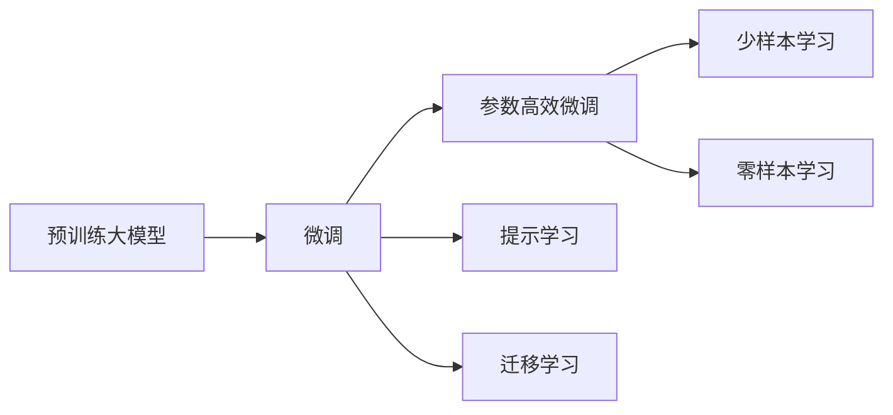

                 

# 大语言模型应用指南：工具

大语言模型（Large Language Models, LLMs）以其强大的自然语言处理能力，在自然语言处理（NLP）领域取得了巨大成功。然而，在实际应用中，如何高效地部署、管理和优化这些模型，成为了一个重要的课题。本文旨在提供一套详细的大语言模型应用指南，帮助开发者更好地利用大语言模型，提升其应用效果。

## 1. 背景介绍

### 1.1 问题由来

随着深度学习技术的发展，预训练大语言模型在NLP领域取得了一系列突破。如BERT、GPT-2、GPT-3等模型，通过在大量无标签文本数据上预训练，学习到了丰富的语言知识。这些模型被广泛应用于文本分类、问答、翻译等任务，并取得了优异的效果。

然而，在实际应用中，预训练大模型仍然面临一些挑战：

- **模型规模庞大**：如GPT-3拥有1750亿参数，部署和优化成本较高。
- **计算资源需求高**：大模型训练和推理需要大量GPU资源。
- **模型微调复杂**：不同任务需要针对性地微调模型，调整过程繁琐。

为了应对这些挑战，需要借助一系列工具和资源，提升大语言模型的应用效率和效果。

## 2. 核心概念与联系

### 2.1 核心概念概述

在进行大语言模型应用时，需要理解以下核心概念：

- **预训练大模型**：指在大规模无标签数据上进行自监督学习训练的语言模型，如BERT、GPT-3等。
- **微调(Fine-tuning)**：指在预训练模型基础上，使用下游任务的少量标注数据进行有监督学习，优化模型在下游任务上的表现。
- **参数高效微调(PEFT)**：指只更新模型的一小部分参数，以提高微调效率和效果。
- **提示学习(Prompt Learning)**：通过在输入文本中插入特定的提示信息，引导模型生成期望输出，实现零样本或少样本学习。
- **少样本学习**：指模型在极少量标注数据下进行学习。
- **零样本学习**：指模型在没有任何标注数据的情况下，仅通过任务描述进行推理和生成。
- **迁移学习**：指将通用大模型的知识迁移应用到特定任务上，提升模型性能。

这些概念之间存在紧密的联系，共同构成了大语言模型应用的基础框架。

### 2.2 核心概念原理和架构的 Mermaid 流程图



## 3. 核心算法原理 & 具体操作步骤

### 3.1 算法原理概述

大语言模型应用的核心在于微调。微调的目标是通过有监督学习，优化模型在下游任务上的表现。具体步骤如下：

1. **准备预训练模型和数据集**：选择合适的预训练模型和下游任务的标注数据集。
2. **添加任务适配层**：根据任务类型，在预训练模型顶层添加适当的输出层和损失函数。
3. **设置微调超参数**：包括学习率、批大小、优化器等。
4. **执行梯度训练**：通过反向传播算法更新模型参数，最小化损失函数。
5. **测试和部署**：在测试集上评估模型性能，并将模型集成到实际应用中。

### 3.2 算法步骤详解

以下是一个完整的微调流程示例：

1. **准备数据集**：
   - 准备下游任务的标注数据集。
   - 将数据集划分为训练集、验证集和测试集。
   - 使用合适的数据增强技术扩充训练集。

2. **模型初始化**：
   - 选择预训练模型，如BERT、GPT等。
   - 加载预训练模型权重，作为微调模型的初始化参数。

3. **任务适配层设计**：
   - 根据任务类型设计输出层和损失函数。
   - 对于分类任务，添加线性分类器和交叉熵损失函数。
   - 对于生成任务，使用语言模型的解码器输出概率分布，并使用负对数似然作为损失函数。

4. **超参数设置**：
   - 设置合适的学习率、批大小、优化器等。
   - 使用正则化技术，如L2正则、Dropout等，防止过拟合。
   - 设置Early Stopping策略，避免模型过度拟合。

5. **模型训练**：
   - 使用DataLoader将数据集分批次输入模型。
   - 计算损失函数，并使用优化器更新模型参数。
   - 周期性在验证集上评估模型性能，调整学习率。
   - 当性能不再提升时，停止训练。

6. **模型测试和部署**：
   - 在测试集上评估模型性能，对比微调前后的精度提升。
   - 将微调后的模型集成到实际应用系统中，如智能客服、金融舆情监测、个性化推荐等。
   - 持续收集新数据，定期重新微调模型，以适应数据分布的变化。

### 3.3 算法优缺点

大语言模型应用的优点包括：

- **简单高效**：微调过程简单，需要少量标注数据即可实现。
- **通用性强**：适用于多种NLP任务，如文本分类、问答、翻译等。
- **效果显著**：通常能够在少量数据下取得优异效果。
- **参数高效**：通过参数高效微调方法，可以避免过度拟合。

但同时，也存在一些缺点：

- **依赖标注数据**：微调效果很大程度上取决于标注数据的质量和数量。
- **迁移能力有限**：当目标任务与预训练数据分布差异较大时，效果可能不佳。
- **模型复杂度高**：大语言模型通常具有较高的计算复杂度和内存占用。
- **可解释性不足**：微调模型的决策过程缺乏可解释性。
- **潜在的伦理问题**：模型可能学习到有害信息，产生误导性输出。

## 4. 数学模型和公式 & 详细讲解 & 举例说明

### 4.1 数学模型构建

假设预训练模型为 $M_{\theta}$，其中 $\theta$ 为模型参数。下游任务的数据集为 $D=\{(x_i,y_i)\}_{i=1}^N$，其中 $x_i$ 为输入，$y_i$ 为标签。

定义损失函数为：

$$
\mathcal{L}(\theta) = \frac{1}{N}\sum_{i=1}^N \ell(M_{\theta}(x_i),y_i)
$$

其中 $\ell$ 为损失函数，如交叉熵损失。

### 4.2 公式推导过程

以二分类任务为例，损失函数为：

$$
\ell(M_{\theta}(x),y) = -[y\log \hat{y} + (1-y)\log(1-\hat{y})]
$$

其中 $\hat{y}=M_{\theta}(x)$ 为模型的输出概率。

使用梯度下降算法更新参数 $\theta$：

$$
\theta \leftarrow \theta - \eta \nabla_{\theta}\mathcal{L}(\theta)
$$

其中 $\eta$ 为学习率，$\nabla_{\theta}\mathcal{L}(\theta)$ 为损失函数对参数 $\theta$ 的梯度。

### 4.3 案例分析与讲解

假设有一个文本分类任务，需要将新闻文本分为“体育”和“财经”两类。使用微调方法进行任务适配：

1. **数据准备**：
   - 收集新闻文本及其分类标签。
   - 将文本进行分词和编码，生成输入张量 $x$。
   - 将标签进行独热编码，生成标签张量 $y$。

2. **模型初始化**：
   - 使用预训练的BERT模型作为初始化参数。
   - 在模型顶层添加线性分类器和交叉熵损失函数。

3. **超参数设置**：
   - 设置学习率为 $1e-5$，批大小为 $32$。
   - 使用AdamW优化器。
   - 设置Early Stopping策略，当验证集上的准确率不再提升时停止训练。

4. **模型训练**：
   - 将数据集分批次输入模型，计算损失函数。
   - 使用反向传播算法更新模型参数。
   - 每轮训练后评估模型在验证集上的准确率。

5. **模型测试**：
   - 在测试集上评估模型性能。
   - 输出模型的预测结果，计算准确率、精确率、召回率等指标。

## 5. 项目实践：代码实例和详细解释说明

### 5.1 开发环境搭建

为了高效进行大语言模型应用，需要搭建适合的环境：

1. **安装Python和PyTorch**：
   ```bash
   pip install torch torchvision torchaudio
   ```

2. **安装Transformers库**：
   ```bash
   pip install transformers
   ```

3. **安装数据增强工具**：
   ```bash
   pip install augmentor
   ```

4. **安装数据集处理工具**：
   ```bash
   pip install datasets
   ```

### 5.2 源代码详细实现

以下是一个简单的微调代码示例，使用BERT模型进行文本分类任务：

```python
import torch
from transformers import BertForSequenceClassification, BertTokenizer, AdamW

# 加载预训练模型和分词器
model = BertForSequenceClassification.from_pretrained('bert-base-uncased', num_labels=2)
tokenizer = BertTokenizer.from_pretrained('bert-base-uncased')

# 准备数据集
train_data = ...
val_data = ...
test_data = ...

# 定义任务适配层
model = BertForSequenceClassification(model, num_labels=2)

# 设置超参数
optimizer = AdamW(model.parameters(), lr=1e-5)
train_loader = DataLoader(train_data, batch_size=32)
val_loader = DataLoader(val_data, batch_size=32)
test_loader = DataLoader(test_data, batch_size=32)

# 训练模型
for epoch in range(10):
    for batch in train_loader:
        inputs = tokenizer(batch.text, return_tensors='pt', padding=True, truncation=True, max_length=512)
        outputs = model(**inputs)
        loss = outputs.loss
        optimizer.zero_grad()
        loss.backward()
        optimizer.step()
    
    # 评估模型
    acc = evaluate(val_loader)
    if acc >= best_acc:
        best_acc = acc
        best_model = model
    else:
        best_model = None

# 测试模型
acc = evaluate(test_loader)
print(f'Test accuracy: {acc}')
```

### 5.3 代码解读与分析

**数据准备**：
- 使用 `BertTokenizer` 对文本进行编码，生成输入张量 `inputs`。
- 使用 `BertForSequenceClassification` 模型进行分类。

**模型训练**：
- 在每个批次上计算损失函数，使用 `AdamW` 优化器更新模型参数。
- 每轮训练后，在验证集上评估模型性能，使用 Early Stopping 策略停止训练。

**模型测试**：
- 在测试集上评估模型性能，计算准确率等指标。

## 6. 实际应用场景

### 6.1 智能客服系统

智能客服系统是大语言模型应用的重要场景之一。通过微调模型，客服系统可以自动理解客户意图，提供个性化的回复，提升服务效率和客户满意度。例如，可以使用微调后的对话模型，对历史客服记录进行训练，生成智能客服模型。

### 6.2 金融舆情监测

金融机构需要实时监测市场舆情，避免负面信息传播对业务造成影响。通过微调模型，可以对金融新闻、评论等文本进行情感分析和主题分类，及时预警潜在风险。

### 6.3 个性化推荐系统

个性化推荐系统需要根据用户的历史行为和偏好，推荐合适的商品或内容。通过微调模型，可以学习用户兴趣点，生成推荐列表。

### 6.4 未来应用展望

未来，大语言模型将应用于更多领域，推动社会进步。例如，在医疗、教育、城市治理等领域，微调模型可以帮助解决实际问题，提升效率和智能化水平。

## 7. 工具和资源推荐

### 7.1 学习资源推荐

为了深入学习大语言模型应用，推荐以下学习资源：

1. **《Transformer原理与实践》**：深入介绍Transformer架构和预训练模型，是学习大语言模型的必备资料。
2. **CS224N《深度学习自然语言处理》**：斯坦福大学开设的NLP课程，涵盖多种NLP任务和经典模型，适合初学者入门。
3. **《Natural Language Processing with Transformers》**：作者为Transformers库的开发者，详细介绍了如何使用Transformers库进行NLP开发。
4. **HuggingFace官方文档**：提供丰富的预训练模型和微调样例代码，是实践大语言模型的首选资源。
5. **CLUE开源项目**：涵盖多个中文NLP数据集，并提供了基于微调的基准模型，有助于中文NLP技术发展。

### 7.2 开发工具推荐

为了高效开发大语言模型应用，推荐以下开发工具：

1. **PyTorch**：灵活的动态计算图，适合深度学习模型的开发和调试。
2. **TensorFlow**：生产部署方便的深度学习框架，支持多种模型。
3. **Transformers库**：提供丰富的预训练模型和微调方法，简化开发流程。
4. **Weights & Biases**：实验跟踪工具，记录模型训练过程和指标。
5. **TensorBoard**：可视化工具，实时监测模型训练状态。

### 7.3 相关论文推荐

大语言模型应用的最新研究进展，可以从以下论文获得：

1. **Attention is All You Need**：Transformer架构的奠基之作，开创了大规模语言模型预训练的先河。
2. **BERT: Pre-training of Deep Bidirectional Transformers for Language Understanding**：提出BERT模型，引入掩码语言模型任务，提升模型性能。
3. **Parameter-Efficient Transfer Learning for NLP**：提出Adapter等参数高效微调方法，提高微调效率。
4. **Prefix-Tuning: Optimizing Continuous Prompts for Generation**：引入连续型Prompt的微调方法，提升模型生成能力。
5. **AdaLoRA: Adaptive Low-Rank Adaptation for Parameter-Efficient Fine-Tuning**：使用自适应低秩适应的微调方法，平衡参数量和性能。

## 8. 总结：未来发展趋势与挑战

### 8.1 总结

本文详细介绍了大语言模型应用的原理和具体操作步骤，并结合实际应用场景，展示了微调方法的应用效果。通过学习本文，可以系统掌握大语言模型的应用方法，提升NLP技术的开发效率和效果。

### 8.2 未来发展趋势

未来，大语言模型应用将呈现以下趋势：

1. **模型规模增大**：随着算力成本的降低，大模型的参数量将持续增长。
2. **微调方法多样化**：除全参数微调外，参数高效微调方法将更加普及。
3. **持续学习成为常态**：模型需不断学习新知识，保持性能。
4. **少样本学习提升**：利用微调方法，在更少标注数据下实现高效学习。
5. **多模态微调崛起**：融合视觉、语音等多模态数据，提升模型理解能力。
6. **通用性增强**：大模型将具备更强的常识推理和跨领域迁移能力。

### 8.3 面临的挑战

尽管大语言模型应用取得了显著成效，但仍面临以下挑战：

1. **标注成本瓶颈**：小规模任务的标注数据不足，制约微调效果。
2. **模型鲁棒性不足**：面对域外数据，泛化性能可能下降。
3. **推理效率低**：大模型推理速度慢，内存占用大。
4. **可解释性不足**：微调模型缺乏可解释性，难以调试。
5. **安全性问题**：模型可能学习到有害信息，产生误导性输出。
6. **知识整合能力不足**：模型难以灵活吸收和应用外部知识。

### 8.4 研究展望

为了应对挑战，未来需要在以下方面进行探索：

1. **探索无监督和半监督微调方法**：利用自监督学习、主动学习等方法，减少对标注数据的依赖。
2. **开发参数高效和计算高效的微调范式**：在固定大部分预训练参数的情况下，只更新少量任务相关参数。
3. **融合因果和对比学习**：增强模型泛化性和抗干扰能力。
4. **引入更多先验知识**：与专家知识库、规则库等结合，提升模型知识整合能力。
5. **结合因果分析和博弈论工具**：增强模型决策的因果性和逻辑性。
6. **纳入伦理道德约束**：过滤和惩罚有害输出，确保模型行为符合伦理规范。

总之，大语言模型应用需要不断创新和优化，才能发挥其最大潜力，推动人工智能技术的发展和应用。

