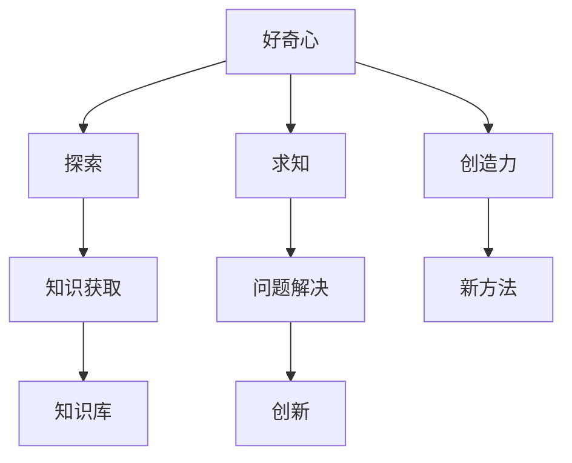

                 

## 1. 背景介绍

### 1.1 问题由来
随着科技的发展，人工智能（AI）和机器学习（ML）在各个领域中发挥着越来越重要的作用。从自动驾驶到智能推荐，从医疗诊断到金融分析，AI的应用无处不在。然而，尽管这些技术在许多任务上取得了显著的成果，但在一些复杂、高层次的创造性任务上，仍然显得力不从心。

好奇心与创造力，作为人类独特的思维方式和行为特征，是推动科技创新的双翼。AI如何通过模拟人类的好奇心与创造力，实现对未知领域的探索和创新的突破，成为了当前研究的热点。

### 1.2 问题核心关键点
本文将围绕好奇心与创造力在AI中的应用展开探讨，重点聚焦以下几个核心问题：
1. 什么是好奇心与创造力？
2. 如何通过AI模拟好奇心与创造力？
3. 模拟好奇心与创造力的AI应用实例有哪些？
4. 在AI领域模拟好奇心与创造力的挑战和未来趋势是什么？

## 2. 核心概念与联系

### 2.1 核心概念概述

为了更好地理解AI与好奇心、创造力之间的关系，首先对几个关键概念进行概述：

- **好奇心**：指的是对未知事物的探索欲和求知欲，是人类认知和知识获取的重要驱动力。
- **创造力**：指的是在已有知识和经验的基础上，创造出新思想、新方法的能力。
- **AI模拟好奇心与创造力**：通过构建能够自动学习和探索的新型AI模型，模拟人类的好奇心和创造力，以解决复杂、高层次的创新问题。

这些概念之间的联系可以通过以下Mermaid流程图来展示：



这个流程图展示了好奇心与创造力在AI中的作用机制：

1. 好奇心驱动AI模型进行探索和知识获取。
2. 好奇心和创造力结合，引导AI模型提出新问题和解决方案。
3. 通过知识库，AI模型积累更多的知识和经验，以支持后续的探索和创新。

## 3. 核心算法原理 & 具体操作步骤
### 3.1 算法原理概述

AI模拟好奇心与创造力的关键在于构建一个能够自我学习和适应环境变化的模型。这种模型通常基于以下两个基本原则：

1. **自我学习**：模型能够通过与环境的交互，自动积累知识，提升性能。
2. **自适应**：模型能够根据环境变化调整自身的策略和行为，以应对新情况。

这两个原则通过以下方式实现：

- **强化学习（Reinforcement Learning, RL）**：通过与环境的交互，模型在每个时间步获取奖励信号，优化自身策略，实现自我学习。
- **生成对抗网络（Generative Adversarial Networks, GANs）**：通过生成器与判别器的对抗训练，模型能够生成逼真的样本，实现创新。

### 3.2 算法步骤详解

#### 3.2.1 强化学习模型构建
1. **环境定义**：定义模型交互的环境，包括状态空间和动作空间。
2. **奖励函数设计**：设计奖励函数，引导模型进行有益的行为。
3. **策略优化**：选择适当的优化算法（如梯度下降、Q-learning等），更新模型参数，优化策略。

#### 3.2.2 生成对抗网络模型构建
1. **生成器定义**：设计生成器的神经网络结构，生成逼真的样本。
2. **判别器定义**：设计判别器的神经网络结构，判断样本的真实性。
3. **对抗训练**：交替训练生成器和判别器，使生成器生成的样本越来越难以被区分。

#### 3.2.3 算法优缺点

**强化学习的优点**：
- 能够处理动态环境，适应性强。
- 通过与环境的交互，积累丰富的经验。

**强化学习的缺点**：
- 需要大量的交互数据，训练时间较长。
- 模型可能陷入局部最优，难以找到全局最优解。

**生成对抗网络的优点**：
- 能够生成高质量的样本，具有很强的创新能力。
- 模型结构简单，训练相对容易。

**生成对抗网络的缺点**：
- 生成器可能生成模式崩溃，导致生成的样本质量下降。
- 模型训练过程中可能存在对抗样本。

### 3.3 算法应用领域

#### 3.3.1 游戏AI
在电子游戏中，强化学习广泛应用。通过与游戏环境的交互，模型学习游戏目标，逐步优化策略，实现自我提升。例如，AlphaGo通过强化学习掌握了复杂的围棋策略，击败了人类顶尖选手。

#### 3.3.2 图像生成
生成对抗网络在图像生成领域取得了巨大成功。例如，DeepMind的GAN模型能够生成逼真的手写数字和面部图像，大大提升了图像生成技术的发展。

#### 3.3.3 自然语言处理
AI通过模拟好奇心与创造力，在自然语言处理领域也取得了显著进展。例如，通过生成对抗网络，AI可以生成逼真的对话和文章，应用于聊天机器人和内容生成等领域。

## 4. 数学模型和公式 & 详细讲解 & 举例说明

### 4.1 数学模型构建

在强化学习和生成对抗网络中，数学模型起到了至关重要的作用。本文将重点介绍这两个领域的数学模型构建。

#### 4.1.1 强化学习模型
强化学习模型通常基于马尔可夫决策过程（Markov Decision Process, MDP），包括状态空间、动作空间和奖励函数。

- **状态空间**：表示环境的状态，包括所有可能的观察值。
- **动作空间**：表示模型在每个状态下可能采取的行动。
- **奖励函数**：定义每个动作在当前状态下获得的奖励。

#### 4.1.2 生成对抗网络模型
生成对抗网络模型由生成器和判别器两个部分组成，通过对抗训练优化模型参数。

- **生成器**：负责生成逼真的样本。
- **判别器**：负责判断样本的真实性。

#### 4.1.3 案例分析
以GAN生成手写数字为例，模型通过对抗训练，逐步优化生成器和判别器的参数，生成逼真的手写数字。

### 4.2 公式推导过程

#### 4.2.1 强化学习公式
在强化学习中，常用的公式包括贝尔曼方程（Bellman Equation）和Q值函数。

贝尔曼方程定义如下：

$$
V(s) = \max_a \left[ R(s, a) + \gamma \sum_{s'} V(s') \right]
$$

其中，$V(s)$表示在状态$s$下的价值函数，$a$表示在状态$s$下可能采取的动作，$R(s, a)$表示采取动作$a$在状态$s$下获得的奖励，$\gamma$表示折扣因子。

Q值函数定义为：

$$
Q(s, a) = R(s, a) + \gamma \max_{a'} Q(s', a')
$$

其中，$Q(s, a)$表示在状态$s$下采取动作$a$的Q值，$R(s, a)$表示采取动作$a$在状态$s$下获得的奖励，$\gamma$表示折扣因子。

#### 4.2.2 生成对抗网络公式
在生成对抗网络中，常用的公式包括生成器损失函数和判别器损失函数。

生成器损失函数定义为：

$$
L_G = -\mathbb{E}_{x \sim p_{data}(x)} \log D(G(z))
$$

其中，$L_G$表示生成器的损失函数，$D$表示判别器，$G$表示生成器，$z$表示生成器的输入噪声，$p_{data}(x)$表示数据分布。

判别器损失函数定义为：

$$
L_D = -\mathbb{E}_{x \sim p_{data}(x)} \log D(x) + \mathbb{E}_{z \sim p(z)} \log (1 - D(G(z)))
$$

其中，$L_D$表示判别器的损失函数，$D$表示判别器，$G$表示生成器，$z$表示生成器的输入噪声，$p_{data}(x)$表示数据分布，$p(z)$表示生成器的输入噪声分布。

### 4.3 案例分析与讲解

以GAN生成手写数字为例，模型通过对抗训练，逐步优化生成器和判别器的参数，生成逼真的手写数字。

## 5. 项目实践：代码实例和详细解释说明

### 5.1 开发环境搭建

在开发AI模拟好奇心与创造力的项目时，需要准备好开发环境。以下是使用Python进行TensorFlow开发的环境配置流程：

1. 安装Anaconda：从官网下载并安装Anaconda，用于创建独立的Python环境。

2. 创建并激活虚拟环境：
```bash
conda create -n tf-env python=3.8 
conda activate tf-env
```

3. 安装TensorFlow：根据CUDA版本，从官网获取对应的安装命令。例如：
```bash
conda install tensorflow tensorflow-gpu==2.5.0 
```

4. 安装Keras和Tensorboard：
```bash
conda install keras tensorboard
```

5. 安装各类工具包：
```bash
pip install numpy pandas scikit-learn matplotlib tqdm jupyter notebook ipython
```

完成上述步骤后，即可在`tf-env`环境中开始AI开发。

### 5.2 源代码详细实现

这里我们以GAN生成手写数字为例，给出TensorFlow的代码实现。

```python
import tensorflow as tf
from tensorflow.keras import layers, models

# 定义生成器
def make_generator_model():
    model = models.Sequential()
    model.add(layers.Dense(256, use_bias=False, input_shape=(100,)))
    model.add(layers.BatchNormalization())
    model.add(layers.LeakyReLU())
    model.add(layers.BatchNormalization())
    model.add(layers.Dense(512, use_bias=False))
    model.add(layers.BatchNormalization())
    model.add(layers.LeakyReLU())
    model.add(layers.Dense(1024, use_bias=False))
    model.add(layers.BatchNormalization())
    model.add(layers.LeakyReLU())
    model.add(layers.Dense(784, activation='tanh'))
    return model

# 定义判别器
def make_discriminator_model():
    model = models.Sequential()
    model.add(layers.Flatten(input_shape=(28, 28, 1)))
    model.add(layers.Dense(1024))
    model.add(layers.LeakyReLU())
    model.add(layers.Dropout(0.4))
    model.add(layers.Dense(512))
    model.add(layers.LeakyReLU())
    model.add(layers.Dropout(0.4))
    model.add(layers.Dense(256))
    model.add(layers.LeakyReLU())
    model.add(layers.Dropout(0.4))
    model.add(layers.Dense(1, activation='sigmoid'))
    return model

# 定义生成器和判别器的损失函数
def discriminator_loss(real_output, fake_output):
    real_loss = tf.reduce_mean(tf.nn.sigmoid_cross_entropy_with_logits(labels=tf.ones_like(real_output), logits=real_output))
    fake_loss = tf.reduce_mean(tf.nn.sigmoid_cross_entropy_with_logits(labels=tf.zeros_like(fake_output), logits=fake_output))
    total_loss = real_loss + fake_loss
    return total_loss

def generator_loss(fake_output):
    return tf.reduce_mean(tf.nn.sigmoid_cross_entropy_with_logits(labels=tf.ones_like(fake_output), logits=fake_output))

# 定义生成器和判别器的优化器
generator_optimizer = tf.keras.optimizers.Adam(1e-4)
discriminator_optimizer = tf.keras.optimizers.Adam(1e-4)

# 定义训练函数
def train_step(images, real_labels):
    with tf.GradientTape() as gen_tape, tf.GradientTape() as disc_tape:
        noise = tf.random.normal([BATCH_SIZE, 100])
        generated_images = generator(noise)
        disc_real_output = discriminator(images)
        disc_fake_output = discriminator(generated_images)
        gen_loss = generator_loss(disc_fake_output)
        disc_loss = discriminator_loss(disc_real_output, disc_fake_output)
    gradients_of_generator = gen_tape.gradient(gen_loss, generator.trainable_variables)
    gradients_of_discriminator = disc_tape.gradient(disc_loss, discriminator.trainable_variables)
    generator_optimizer.apply_gradients(zip(gradients_of_generator, generator.trainable_variables))
    discriminator_optimizer.apply_gradients(zip(gradients_of_discriminator, discriminator.trainable_variables))
```

### 5.3 代码解读与分析

这里我们详细解读一下关键代码的实现细节：

- **生成器定义**：通过多层全连接神经网络，将噪声向量转换为生成器模型输出。
- **判别器定义**：通过多层全连接神经网络，将输入图像转换为判别器模型输出。
- **损失函数定义**：生成器和判别器的损失函数采用交叉熵损失函数，引导生成器生成逼真的样本，判别器区分真实和生成的样本。
- **优化器定义**：生成器和判别器分别使用Adam优化器进行参数更新。
- **训练函数定义**：在每个训练步骤中，随机生成噪声向量，通过生成器生成样本，并计算生成器和判别器的损失函数，反向传播更新模型参数。

## 6. 实际应用场景

### 6.1 游戏AI

在游戏AI中，AI通过模拟好奇心与创造力，探索和优化游戏策略，实现自我提升。例如，AlphaGo通过强化学习掌握了围棋策略，击败了人类顶尖选手。

### 6.2 图像生成

在图像生成领域，生成对抗网络通过对抗训练，生成逼真的图像样本，广泛应用于艺术创作、图像修复等场景。

### 6.3 自然语言处理

在自然语言处理领域，AI通过模拟好奇心与创造力，生成逼真的对话和文章，应用于聊天机器人、内容生成等领域。

## 7. 工具和资源推荐

### 7.1 学习资源推荐

为了帮助开发者系统掌握AI模拟好奇心与创造力的理论基础和实践技巧，这里推荐一些优质的学习资源：

1. **《深度学习》课程**：斯坦福大学开设的深度学习课程，系统讲解了深度学习的基本概念和算法。

2. **《强化学习》课程**：Coursera开设的强化学习课程，涵盖了强化学习的理论和实践。

3. **《生成对抗网络》书籍**：《Generative Adversarial Networks: Training GANs and Beyond》书籍，详细介绍了GAN的理论和实践。

4. **TensorFlow官方文档**：TensorFlow的官方文档，提供了丰富的学习资源和样例代码。

5. **Keras官方文档**：Keras的官方文档，简化了深度学习模型的构建过程。

### 7.2 开发工具推荐

高效开发AI项目离不开优秀的工具支持。以下是几款常用的开发工具：

1. **TensorFlow**：谷歌开源的深度学习框架，提供了丰富的API和工具，适合大规模工程应用。

2. **PyTorch**：Facebook开源的深度学习框架，易于使用，适合快速迭代研究。

3. **Jupyter Notebook**：开源的交互式开发环境，适合Python编程和数据分析。

4. **TensorBoard**：TensorFlow配套的可视化工具，实时监测模型训练状态，提供丰富的图表呈现方式。

5. **Keras**：基于TensorFlow和Theano的高级API，简化了深度学习模型的构建过程。

### 7.3 相关论文推荐

AI模拟好奇心与创造力的研究源于学界的持续研究。以下是几篇奠基性的相关论文，推荐阅读：

1. **AlphaGo论文**：DeepMind的AlphaGo论文，通过强化学习实现了围棋的自我提升。

2. **GAN论文**：Ian Goodfellow的GAN论文，提出了生成对抗网络的概念。

3. **Attention论文**：Google的Attention论文，提出了注意力机制，提高了NLP模型的效果。

4. **Reinforcement Learning论文**：Sutton和Barto的《Reinforcement Learning: An Introduction》书籍，详细讲解了强化学习的理论和实践。

5. **Transformer论文**：Google的Transformer论文，提出了自注意力机制，提高了NLP模型的效果。

## 8. 总结：未来发展趋势与挑战

### 8.1 总结

本文对AI模拟好奇心与创造力的相关技术进行了全面系统的介绍。通过阐述好奇心与创造力在AI中的应用，重点介绍了强化学习和生成对抗网络的概念和实现。同时，通过具体案例分析，展示了这些技术在实际应用中的效果。

## 8.2 未来发展趋势

未来AI模拟好奇心与创造力的研究将呈现以下几个趋势：

1. **多模态融合**：将视觉、听觉、文本等多模态数据融合，提升模型的感知能力和创造力。

2. **跨领域迁移**：将AI模型在不同领域进行迁移，提升模型的适应性和应用范围。

3. **自监督学习**：利用无监督学习任务训练模型，提升模型的探索能力和泛化能力。

4. **零样本学习**：在无需标注数据的情况下，通过设计巧妙的任务描述，实现零样本学习和创新。

5. **模型可解释性**：增强AI模型的可解释性，使其行为更加透明和可理解。

## 8.3 面临的挑战

尽管AI模拟好奇心与创造力的技术已经取得了显著进展，但在实现更加智能化、普适化应用的过程中，仍面临诸多挑战：

1. **数据获取和标注**：高质量的数据和标注数据获取成本高，数据质量难以保证。

2. **模型复杂度**：模型的复杂度增加，训练和推理成本高。

3. **模型鲁棒性**：模型在面对新数据时，泛化能力不足。

4. **可解释性**：模型的决策过程难以解释，缺乏可解释性。

5. **伦理和安全性**：模型可能存在偏见和歧视，安全性难以保障。

## 8.4 研究展望

未来的研究需要在以下几个方面进行探索：

1. **跨领域知识图谱**：构建跨领域的知识图谱，提升AI模型的知识整合能力。

2. **多任务学习**：将多个相关任务结合，提升模型的适应性和创新能力。

3. **生成式推理**：结合生成式模型和推理机制，提升AI模型的创造力。

4. **人机协同**：将AI模型与人机交互机制结合，实现更智能的决策支持系统。

5. **可解释性增强**：设计可解释性的模型架构，增强AI模型的可理解性。

---

作者：禅与计算机程序设计艺术 / Zen and the Art of Computer Programming

