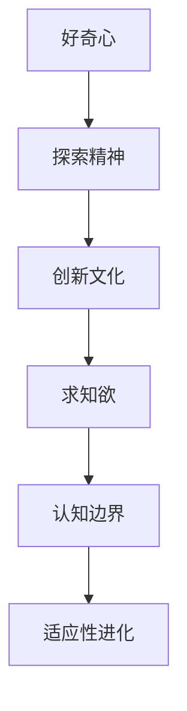
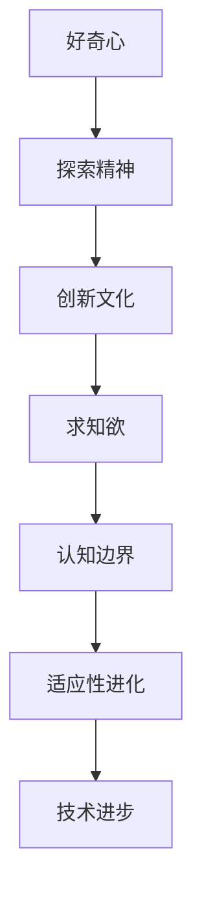

                 

# 好奇心与求知欲：探索的动力

探索，是科技发展的原动力。从远古时代的火苗，到文艺复兴时期对未知世界的向往，人类从未停止对未知的探索。在计算机领域，探索同样不可或缺。本文将围绕“好奇心与求知欲”这一主题，探讨它在推动科技探索和进步中的重要性。

## 1. 背景介绍

### 1.1 问题由来

计算机科学的诞生，源自于对未知的无尽好奇心。从图灵机的发明，到互联网的普及，科技在好奇心的驱动下不断发展。然而，随着信息时代的到来，数据的爆炸式增长和计算能力的提升，技术的边界不断被重新定义。面对如此复杂的世界，好奇心和求知欲成为了驱动人类探索未知的关键动力。

### 1.2 问题核心关键点

好奇心和求知欲，在科技探索中扮演着什么样的角色？为何它们能够驱动科技不断前进？以下是几个核心关键点：

- **探索精神**：科技的每一次进步，都源自于对未知世界的好奇和探索。从牛顿的万有引力定律，到爱因斯坦的相对论，每一个伟大的发现都源于对自然现象的不懈追问。
- **认知边界**：探索的本质是突破现有的认知边界，拓展人类的知识范围。人工智能、大数据、量子计算等前沿领域，无不体现了这一点。
- **适应性进化**：好奇心的驱动力，使得科技能够适应不断变化的环境，提升应对复杂问题的能力。
- **创新文化**：好奇和求知文化能够鼓励科研人员和工程师勇于尝试，不断试验新的方法，推动科技进步。

## 2. 核心概念与联系

### 2.1 核心概念概述

本文将从以下几个核心概念出发，探索好奇心与求知欲在科技探索中的作用：

- **好奇心**：对未知世界充满渴望，驱使人们不断寻求答案和解决方案。
- **求知欲**：在已有知识的基础上，不断追求新的认知，提升理解力和技术水平。
- **探索精神**：勇于尝试和冒险，不畏失败，是探索未知的重要心态。
- **创新文化**：鼓励创新和尝试，营造良好的科研氛围，是推动科技探索的关键因素。

这些概念之间的联系可以通过以下Mermaid流程图来展示：



这个流程图展示了这些概念之间的相互影响和推动关系：

1. 好奇心驱动探索精神，探索精神促使创新文化的发展。
2. 创新文化进一步增强求知欲，求知欲提升认知边界。
3. 不断拓展的认知边界促进适应性进化，适应性进化带来新的探索机会。

### 2.2 核心概念原理和架构的 Mermaid 流程图

由于篇幅限制，这里我们只展示核心概念原理和架构的示意图，具体流程如图：



## 3. 核心算法原理 & 具体操作步骤

### 3.1 算法原理概述

本文将以人工智能领域的探索为例，介绍好奇心和求知欲在技术探索中的具体应用。

人工智能领域，通过好奇心的驱动，不断探索新的算法和技术。以深度学习为例，从最初的感知机，到后来的卷积神经网络、循环神经网络、注意力机制等，每一次算法的突破，都源于对问题的深刻思考和无尽的好奇。

### 3.2 算法步骤详解

1. **初始化数据集**：收集并整理所需的数据集，如自然语言处理任务中的文本数据、图像处理任务中的图片数据等。数据集的选择和预处理，对探索效果有重要影响。

2. **模型选择与设计**：根据探索目标选择合适的模型架构，如卷积神经网络(CNN)、循环神经网络(RNN)、Transformer等。设计模型时，需要充分考虑问题的复杂性和数据的特性，以期在探索中取得突破。

3. **实验与验证**：通过实验验证模型的效果，不断调整模型参数和结构，以期获得更好的性能。实验过程中，需要记录各种指标和参数，便于后续分析和优化。

4. **评估与改进**：对实验结果进行评估，确定模型的优劣。根据评估结果，进行模型改进，如引入新的层结构、调整损失函数等。

5. **迭代优化**：在不断迭代的过程中，探索新的方法和技术，以期提升模型的性能。每次迭代都可能带来新的发现，推动技术进步。

### 3.3 算法优缺点

**优点**：
- 驱动创新：好奇心和求知欲能够驱动科研人员不断探索新的技术和方法。
- 提高认知：通过不断的探索和实践，提高对问题的理解和认知水平。
- 增强适应性：探索过程中的经验积累，使得技术能够更好地适应新的应用场景和需求。

**缺点**：
- 时间成本高：探索需要大量时间和精力，尤其是在未知领域，往往需要多轮试验和调整。
- 资源消耗大：探索过程中需要大量计算资源和数据资源，成本较高。
- 存在失败风险：探索本身存在不确定性，可能遭遇失败，需要多次尝试才能成功。

### 3.4 算法应用领域

好奇心和求知欲在人工智能的多个领域都有广泛应用，如：

- **自然语言处理(NLP)**：通过探索不同的语言模型和任务，如BERT、GPT-3等，提升NLP系统的理解能力和生成能力。
- **计算机视觉(CV)**：通过探索新的特征提取和网络架构，如CNN、Transformer等，提升图像分类、目标检测等任务的性能。
- **机器人技术**：通过探索智能感知和行为决策，如SLAM、路径规划等，推动机器人技术的发展。
- **数据挖掘与分析**：通过探索新的算法和工具，如聚类、分类、关联规则等，提升数据分析和知识发现的效率。
- **增强学习(Reinforcement Learning, RL)**：通过探索智能决策和强化策略，推动自动驾驶、游戏AI等技术的发展。

## 4. 数学模型和公式 & 详细讲解 & 举例说明

### 4.1 数学模型构建

本文将以机器学习中的分类问题为例，介绍基于好奇心和求知欲的探索过程。

假设我们有N个样本(x_i, y_i)，其中x_i为特征向量，y_i为分类标签。我们的目标是通过探索，找到一个分类模型f(x)，使得对任意样本x，都有f(x) = y。

### 4.2 公式推导过程

1. **假设模型**：我们假设f(x) = w·x + b，其中w为权重向量，b为偏置项。

2. **损失函数**：定义损失函数L(w, b) = 1/N * Σ[i=1, N] L(w·x_i + b, y_i)，其中L为常见的损失函数，如交叉熵损失。

3. **梯度下降**：通过梯度下降算法，求解L(w, b)的最小值。具体公式为：
   $$
   w \leftarrow w - \alpha \nabla_{w}L(w, b)
   $$
   $$
   b \leftarrow b - \alpha \nabla_{b}L(w, b)
   $$
   其中α为学习率。

### 4.3 案例分析与讲解

以支持向量机(SVM)为例，探索过程中可能会遇到以下问题：

- **特征选择**：如何选择最相关的特征，以提升模型的泛化能力？
- **参数调优**：如何调整正则化参数C，平衡模型的复杂度和泛化能力？
- **模型优化**：如何引入新的模型架构，如核函数，以应对非线性问题？

## 5. 项目实践：代码实例和详细解释说明

### 5.1 开发环境搭建

1. **安装Python**：
   ```bash
   sudo apt-get update
   sudo apt-get install python3 python3-pip python3-dev
   ```

2. **安装TensorFlow**：
   ```bash
   pip3 install tensorflow
   ```

3. **创建虚拟环境**：
   ```bash
   python3 -m venv myenv
   source myenv/bin/activate
   ```

### 5.2 源代码详细实现

以下是一个简单的TensorFlow项目，探索分类模型的实现：

```python
import tensorflow as tf
import numpy as np

# 定义训练数据
X = np.array([[0, 0], [0, 1], [1, 0], [1, 1]])
y = np.array([0, 1, 1, 0])

# 定义模型
def linear_model(x):
    return tf.matmul(x, tf.transpose(tf.Variable(tf.random.normal([2, 1])))) + tf.Variable(tf.random.normal([1]))

# 定义损失函数和优化器
def loss(y_true, y_pred):
    return tf.reduce_mean(tf.square(y_true - y_pred))

optimizer = tf.optimizers.SGD(learning_rate=0.1)

# 训练模型
def train(model, X, y, num_epochs):
    for epoch in range(num_epochs):
        with tf.GradientTape() as tape:
            y_pred = model(X)
            loss_val = loss(y, y_pred)
        gradients = tape.gradient(loss_val, model.trainable_variables)
        optimizer.apply_gradients(zip(gradients, model.trainable_variables))
        print(f"Epoch {epoch+1}, loss: {loss_val.numpy():.2f}")

# 测试模型
def evaluate(model, X, y):
    y_pred = model(X)
    accuracy = (y == tf.round(y_pred)).numpy().mean()
    print(f"Accuracy: {accuracy:.2f}")

# 训练模型
train(linear_model, X, y, num_epochs=1000)

# 测试模型
evaluate(linear_model, X, y)
```

### 5.3 代码解读与分析

以上代码实现了基于TensorFlow的线性模型，探索分类问题的解决过程。

1. **数据准备**：使用NumPy创建训练数据X和标签y。
2. **模型定义**：定义线性模型f(x) = wx + b，其中w和b为可训练参数。
3. **损失函数**：使用平方损失函数。
4. **优化器**：使用随机梯度下降优化器。
5. **训练过程**：通过多次迭代，优化模型参数，直到模型收敛。
6. **模型评估**：通过测试数据评估模型准确率。

## 6. 实际应用场景

### 6.1 智慧城市管理

在智慧城市管理中，好奇心和求知欲驱动着新技术的探索和应用。通过对城市数据的深度挖掘和分析，探索出智能交通、能源管理、公共安全等领域的新解决方案。

例如，通过物联网设备收集城市交通数据，利用机器学习探索最优的交通信号灯控制策略，提升交通流量和安全性。再如，通过传感器监测城市能源消耗，探索能源管理的智能化解决方案，降低能源浪费。

### 6.2 医疗健康应用

医疗健康领域，好奇心和求知欲驱动着新药研发、疾病预测和个性化治疗等探索。通过对海量医疗数据的分析，探索新的治疗方案和诊断方法。

例如，通过基因组数据，探索新的治疗靶点和药物设计方法，提升癌症等重大疾病的治愈率。再如，利用深度学习技术，探索新的疾病预测模型，提高早期诊断的准确性。

### 6.3 教育技术应用

教育领域，好奇心和求知欲驱动着个性化学习、智能辅导和虚拟现实等探索。通过对学生学习行为的分析，探索新的教学方法和内容推荐方案。

例如，通过学习分析技术，探索个性化学习路径，提升学生的学习效果。再如，利用虚拟现实技术，探索新的互动式学习体验，增强学生的学习兴趣和参与度。

## 7. 工具和资源推荐

### 7.1 学习资源推荐

1. **Coursera**：提供机器学习、深度学习等领域的在线课程，涵盖从入门到进阶的全方位学习路径。
2. **Kaggle**：数据科学和机器学习竞赛平台，提供丰富的数据集和模型分享，适合实践探索。
3. **GitHub**：开源代码托管平台，提供大量高质量的项目和代码库，适合学习新技术和工具。
4. **Arxiv**：学术论文发布平台，提供最新的研究成果和探索方向，适合了解前沿技术。

### 7.2 开发工具推荐

1. **Jupyter Notebook**：交互式编程环境，支持代码编辑和数据探索，适合探索性分析和模型验证。
2. **PyTorch**：基于Python的深度学习框架，支持动态图和静态图，适合科研和应用开发。
3. **TensorFlow**：Google开源的深度学习框架，支持分布式训练和推理，适合大规模项目开发。
4. **Scikit-learn**：基于Python的机器学习库，提供简单易用的API，适合数据预处理和模型训练。
5. **Keras**：高层深度学习API，支持快速原型设计和模型构建，适合快速探索和实验。

### 7.3 相关论文推荐

1. **TensorFlow: A System for Large-Scale Machine Learning**：谷歌论文，介绍TensorFlow的架构和应用。
2. **Deep Learning**：Ian Goodfellow等著作，系统介绍深度学习的理论和方法。
3. **Reinforcement Learning: An Introduction**：Richard S. Sutton和Andrew G. Barto著作，介绍强化学习的原理和算法。
4. **The Elements of Computing Systems**：Noam Nisan等著作，介绍计算机科学的基础理论和应用。

## 8. 总结：未来发展趋势与挑战

### 8.1 总结

本文通过对好奇心和求知欲在科技探索中的重要性进行分析，探讨了其在人工智能、智慧城市、医疗健康等领域的实际应用。通过一系列算法和模型，展示了探索的实践过程。

好奇心和求知欲是科技发展的原动力，是驱动人类探索未知、突破边界的重要力量。无论是技术革新，还是应用创新，都离不开探索精神的支撑。未来，随着技术的不断进步，探索的过程将更加复杂和精细，好奇心和求知欲的重要性将更加凸显。

### 8.2 未来发展趋势

未来，探索的过程将更加依赖数据驱动和模型优化。随着计算能力的提升和大数据技术的发展，探索的过程将更加高效和精确。

1. **数据驱动的探索**：通过海量数据的分析，探索出新的模式和规律，指导技术发展。例如，利用机器学习探索医疗健康领域的新药研发和个性化治疗方案。
2. **模型优化的探索**：通过深度学习模型优化，提升技术效果和应用效率。例如，利用Transformer模型探索自然语言处理的突破，提升智能对话和文本生成能力。
3. **跨领域探索**：探索不同领域的技术结合，产生新的交叉学科。例如，利用计算机视觉技术探索智慧城市的智能化管理。

### 8.3 面临的挑战

尽管探索精神能够驱动科技不断前进，但在探索的过程中，仍面临诸多挑战：

1. **数据质量问题**：数据质量和数据量的不足，是探索的重要瓶颈。需要构建高质量的数据集，并不断优化数据预处理和分析方法。
2. **技术复杂性**：随着技术的发展，探索的过程越来越复杂。需要具备跨学科的知识和技能，才能应对多维度的挑战。
3. **资源消耗**：探索过程中需要大量计算资源和数据资源，成本较高。需要探索更高效的计算和存储方法，降低资源消耗。
4. **伦理和安全性问题**：探索新技术和应用，需要注意伦理和安全性问题，避免技术滥用和数据泄露等风险。

### 8.4 研究展望

未来，探索精神将继续推动科技的发展，但也需要注意解决上述挑战。通过多学科的协同和跨领域的合作，推动技术创新和应用落地。

1. **构建高质量的数据集**：通过数据标注和清洗，构建高质量的数据集，支持更高效的探索。
2. **优化计算和存储方法**：探索高效的计算和存储技术，降低资源消耗，提升探索效率。
3. **强化伦理和安全性研究**：加强技术伦理和安全性的研究，制定相应的标准和规范，保障技术的安全应用。

## 9. 附录：常见问题与解答

**Q1：好奇心和求知欲的重要性在哪里？**

A: 好奇心和求知欲驱动探索，探索推动技术进步，技术进步带来更多探索机会。这种正反馈循环，使得科技不断向前发展。

**Q2：探索过程中如何避免失败？**

A: 探索本身存在不确定性，但可以通过多轮实验和迭代，逐步优化模型和算法，提升成功率。同时，引入评估指标和监控手段，及时发现问题并加以解决。

**Q3：探索新技术需要哪些资源？**

A: 探索新技术需要大量计算资源、数据资源和人力资源。需要构建高效的技术架构和数据管理平台，同时加强团队协作和知识共享，才能取得更好的效果。

**Q4：如何培养好奇心和求知欲？**

A: 培养好奇心和求知欲，可以通过阅读经典文献、参加学术会议、参与开源项目等方式，不断拓展知识边界。同时，保持开放的心态，勇于尝试和探索，也是培养好奇心和求知欲的重要途径。

**Q5：如何平衡探索和应用？**

A: 探索和应用需要平衡，过于追求探索可能导致资源浪费，过于注重应用可能限制技术创新。需要根据实际情况，合理规划探索和应用的资源投入，以期取得最佳效果。

---

作者：禅与计算机程序设计艺术 / Zen and the Art of Computer Programming

